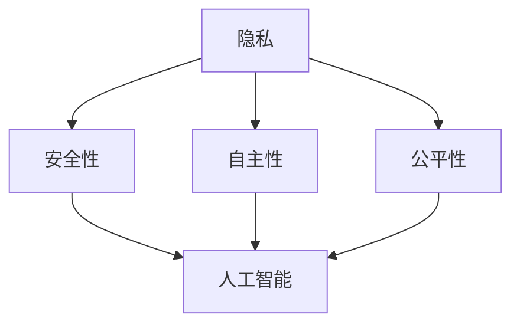

                 

关键词：伦理学、人类计算、道德困境、人工智能、技术发展

## 摘要

本文旨在探讨人类计算带来的道德困境，尤其是随着人工智能技术的发展，我们面临着前所未有的伦理挑战。我们将深入分析这些挑战，探讨其根源，并提出可能的解决方案。本文分为以下几个部分：首先，我们将介绍背景，包括人类计算的历史和技术发展的现状；其次，我们将讨论几个核心伦理问题，如隐私、安全、自主性和公平性；然后，我们将通过具体的案例来展示这些挑战的实际情况；接着，我们将讨论这些挑战对我们的社会和未来可能产生的影响；最后，我们将展望未来，提出一些可能的发展趋势和面临的挑战。

## 1. 背景介绍

### 1.1 人类计算的历史

人类计算的历史可以追溯到古代，从使用算盘到发明计算机，计算技术的发展经历了数个阶段。早期的计算主要依赖于人脑和简单的机械装置，如算盘和算尺。随着数学和逻辑学的进步，人类开始尝试使用更复杂的算法和逻辑来解决问题。

19世纪末，查尔斯·巴贝奇提出了差分机和分析机，这两台机器可以被视为现代计算机的雏形。20世纪40年代，艾伦·图灵提出了图灵机的概念，奠定了现代计算理论的基础。随着电子计算机的发明和普及，人类计算进入了一个全新的时代。

### 1.2 技术发展的现状

如今，人类计算已经进入了大数据、人工智能和量子计算的时代。大数据技术使得我们能够处理和分析前所未有的海量数据，从而推动了许多领域的进步。人工智能则通过机器学习和深度学习等技术，实现了从简单任务到复杂决策的自动化。量子计算则有望突破传统计算机的极限，带来全新的计算能力和应用。

### 1.3 伦理挑战的出现

随着技术的高速发展，我们开始面临一系列伦理挑战。这些挑战不仅涉及技术本身，还涉及到技术对社会、经济和文化的影响。例如，隐私问题在社交媒体和大数据时代变得尤为重要；安全性问题在人工智能和物联网时代变得尤为突出；自主性和公平性问题则在自动驾驶和智能决策系统中引起了广泛关注。

## 2. 核心概念与联系

为了更好地理解人类计算带来的伦理挑战，我们需要明确几个核心概念：

### 2.1 隐私

隐私是指个人的信息不被未经授权的第三方获取或使用。在大数据和人工智能时代，隐私问题变得更加复杂。例如，社交媒体平台通过收集用户数据来提供个性化服务，但这种数据收集也可能侵犯用户的隐私权。

### 2.2 安全性

安全性是指保护系统和数据免受未经授权的访问、破坏或泄露。随着物联网和人工智能技术的发展，系统的复杂性和潜在的安全威胁也不断增加。例如，智能设备和系统的漏洞可能被恶意攻击者利用，从而导致严重后果。

### 2.3 自主性

自主性是指系统能够在无需人类干预的情况下自主做出决策和行动。在自动驾驶和智能决策系统中，自主性是一个关键问题。如果系统无法确保其决策的道德和合法性，那么可能引发严重的伦理问题。

### 2.4 公平性

公平性是指系统能够公平地对待所有用户，不歧视或偏袒任何一方。在人工智能和大数据领域，算法可能因为数据偏差或设计缺陷而导致不公平的结果，从而引发社会不满和道德质疑。

### 2.5 Mermaid 流程图

以下是一个简化的 Mermaid 流程图，展示了上述核心概念之间的联系：



## 3. 核心算法原理 & 具体操作步骤

### 3.1 算法原理概述

在讨论伦理挑战时，我们需要一些核心算法来帮助我们理解和分析这些问题。以下是几个关键算法的原理概述：

### 3.2 算法步骤详解

#### 3.2.1 隐私保护算法

隐私保护算法旨在保护用户数据的同时，提供有效的数据处理和分析能力。以下是一个简化的隐私保护算法步骤：

1. 数据收集：从源数据中收集用户信息。
2. 数据清洗：去除无效或重复的数据。
3. 数据加密：使用加密技术保护敏感信息。
4. 数据共享：在保证隐私的前提下，共享必要的数据。
5. 数据分析：使用隐私保护的方法进行数据分析和挖掘。

#### 3.2.2 安全性算法

安全性算法旨在确保系统和数据的安全。以下是一个简化的安全性算法步骤：

1. 安全审计：定期对系统和数据进行审计，发现潜在的安全威胁。
2. 访问控制：实施严格的访问控制策略，确保只有授权用户才能访问系统。
3. 数据备份：定期备份系统和数据，以防数据丢失。
4. 应急响应：建立应急响应机制，及时应对安全事件。
5. 安全更新：定期更新系统和软件，修复已知的安全漏洞。

#### 3.2.3 自主性算法

自主性算法旨在使系统能够自主做出决策。以下是一个简化的自主性算法步骤：

1. 数据输入：收集系统运行所需的数据。
2. 状态评估：分析当前系统的状态，确定下一步行动。
3. 决策生成：生成可能的决策方案。
4. 决策评估：评估每个决策方案的风险和收益。
5. 决策执行：执行最佳决策方案。

#### 3.2.4 公平性算法

公平性算法旨在确保系统对所有用户公平。以下是一个简化的公平性算法步骤：

1. 数据收集：从源数据中收集用户信息。
2. 数据清洗：去除无效或重复的数据。
3. 数据分析：分析用户数据，确定潜在的歧视因素。
4. 数据调整：调整算法参数，减少歧视。
5. 结果验证：验证算法输出的公平性。

### 3.3 算法优缺点

#### 3.3.1 隐私保护算法

**优点：**
- 保护用户隐私：确保敏感数据不被未经授权的第三方获取。
- 提高数据利用率：在保护隐私的前提下，提高数据的有效利用。

**缺点：**
- 增加计算成本：加密和解密数据需要额外的计算资源。
- 可能降低数据分析效果：隐私保护算法可能对数据进行分析的效果产生一定影响。

#### 3.3.2 安全性算法

**优点：**
- 提高系统安全性：确保系统和数据免受未经授权的访问和破坏。
- 降低安全风险：通过定期审计和更新，降低系统安全风险。

**缺点：**
- 可能影响系统性能：安全性算法可能对系统性能产生一定影响。
- 增加运营成本：实施严格的安全性措施可能需要额外的成本。

#### 3.3.3 自主性算法

**优点：**
- 提高系统效率：使系统能够自主做出决策，提高系统运行效率。
- 减少人类干预：在某些情况下，自主性算法可以减少对人类操作员的依赖。

**缺点：**
- 决策风险：自主性算法可能无法完全理解人类决策的所有细节，可能导致错误决策。
- 道德和法律问题：自主性算法可能面临道德和法律上的质疑。

#### 3.3.4 公平性算法

**优点：**
- 提高算法公平性：确保算法对所有用户公平，减少歧视。
- 提高社会信任：提高人们对算法的信任度。

**缺点：**
- 数据偏差：如果数据存在偏差，算法可能无法完全消除歧视。
- 道德和法律问题：公平性算法可能面临道德和法律上的质疑。

### 3.4 算法应用领域

#### 3.4.1 隐私保护算法

隐私保护算法广泛应用于大数据和人工智能领域，例如：
- 数据挖掘：确保用户数据不被未经授权的第三方访问。
- 个人隐私保护：在社交媒体和在线服务中，保护用户隐私。
- 医疗保健：确保患者数据的安全和隐私。

#### 3.4.2 安全性算法

安全性算法广泛应用于网络安全、物联网和智能系统领域，例如：
- 网络安全：确保系统和数据的安全。
- 物联网：保护智能设备和系统的安全。
- 自动驾驶：确保自动驾驶汽车的安全。

#### 3.4.3 自主性算法

自主性算法广泛应用于自动驾驶、智能决策和机器人领域，例如：
- 自动驾驶：使自动驾驶汽车能够自主导航和做出决策。
- 智能决策：辅助人类做出更明智的决策。
- 机器人：使机器人能够自主执行任务。

#### 3.4.4 公平性算法

公平性算法广泛应用于金融、招聘和社会服务领域，例如：
- 金融：确保算法对所有用户公平，减少歧视。
- 招聘：确保招聘过程公平，减少歧视。
- 社会服务：确保公共服务对所有用户公平。

## 4. 数学模型和公式 & 详细讲解 & 举例说明

### 4.1 数学模型构建

在讨论伦理挑战时，我们需要使用一些数学模型来帮助我们分析和解决这些问题。以下是几个关键数学模型的构建：

#### 4.1.1 隐私保护模型

隐私保护模型旨在确保用户数据在共享和分析过程中不被未经授权的第三方获取。以下是一个简化的隐私保护模型：

- 用户数据：\( U \)
- 加密算法：\( E \)
- 解密算法：\( D \)
- 未经授权的第三方：\( T \)

数学模型表示为：

$$
\text{隐私保护模型：} U' = E(U)
$$

其中，\( U' \) 是加密后的用户数据，\( U \) 是原始用户数据，\( E \) 是加密算法。

#### 4.1.2 安全性模型

安全性模型旨在确保系统和数据的安全，防止未经授权的访问和破坏。以下是一个简化的安全性模型：

- 系统资源：\( R \)
- 访问控制策略：\( A \)
- 未经授权的访问者：\( V \)

数学模型表示为：

$$
\text{安全性模型：} V \not\in A(R)
$$

其中，\( V \) 是未经授权的访问者，\( A \) 是访问控制策略，\( R \) 是系统资源。

#### 4.1.3 自主性模型

自主性模型旨在使系统能够在无需人类干预的情况下自主做出决策。以下是一个简化的自主性模型：

- 数据输入：\( I \)
- 状态评估函数：\( S \)
- 决策生成函数：\( D \)
- 决策评估函数：\( E \)

数学模型表示为：

$$
\text{自主性模型：} \text{决策} = D(S(I))
$$

其中，\( I \) 是数据输入，\( S \) 是状态评估函数，\( D \) 是决策生成函数，\( E \) 是决策评估函数。

#### 4.1.4 公平性模型

公平性模型旨在确保算法对所有用户公平，减少歧视。以下是一个简化的公平性模型：

- 用户数据：\( U \)
- 数据分析算法：\( A \)
- 判别函数：\( J \)

数学模型表示为：

$$
\text{公平性模型：} J(A(U)) = \text{公平}
$$

其中，\( U \) 是用户数据，\( A \) 是数据分析算法，\( J \) 是判别函数。

### 4.2 公式推导过程

#### 4.2.1 隐私保护模型推导

隐私保护模型的推导基于加密和解密的基本原理。假设加密算法是一个单向函数，即 \( E \) 是从 \( U \) 到 \( U' \) 的映射，且解密算法是 \( E \) 的逆映射。那么，对于任何未经授权的第三方 \( T \)，都有：

$$
T \not\in E(U)
$$

这意味着，即使 \( T \) 获取了 \( U' \)，也无法解密得到 \( U \)，从而保护了用户的隐私。

#### 4.2.2 安全性模型推导

安全性模型的推导基于访问控制的基本原理。假设访问控制策略 \( A \) 是一个二元组，其中 \( R \) 是系统资源，\( V \) 是访问者。如果 \( V \) 不是 \( A \) 的授权访问者，即 \( V \not\in A(R) \)，那么 \( V \) 无法访问 \( R \)，从而保护了系统的安全。

#### 4.2.3 自主性模型推导

自主性模型的推导基于状态评估、决策生成和决策评估的基本原理。假设状态评估函数 \( S \) 能够准确评估当前系统的状态，决策生成函数 \( D \) 能够生成可能的决策方案，决策评估函数 \( E \) 能够评估每个决策方案的风险和收益。那么，通过 \( D(S(I)) \)，系统可以自主生成最佳决策方案。

#### 4.2.4 公平性模型推导

公平性模型的推导基于数据分析算法和判别函数的基本原理。假设数据分析算法 \( A \) 能够分析用户数据，判别函数 \( J \) 能够判断算法输出是否公平。如果 \( J(A(U)) \) 是公平的，那么算法就满足了公平性要求。

### 4.3 案例分析与讲解

#### 4.3.1 隐私保护案例

假设一个社交媒体平台收集了用户的大量数据，包括用户年龄、性别、地理位置等。为了保护用户隐私，平台使用加密算法对用户数据进行加密，只有授权用户才能解密获取原始数据。在这种情况下，未经授权的第三方无法获取用户隐私，从而实现了隐私保护。

#### 4.3.2 安全性案例

假设一个物联网系统包含多个智能设备，每个设备都有访问控制策略。为了确保系统的安全性，系统定期进行安全审计，发现潜在的安全威胁。通过实施严格的访问控制策略，只有授权设备才能访问系统资源，从而保护了系统的安全。

#### 4.3.3 自主性案例

假设一个自动驾驶汽车系统需要自主决策，包括道路行驶、行人检测和交通信号灯识别。系统通过状态评估函数 \( S \) 评估当前道路状况，决策生成函数 \( D \) 生成可能的行驶方案，决策评估函数 \( E \) 评估每个行驶方案的风险和收益。通过 \( D(S(I)) \)，系统可以自主生成最佳行驶方案，从而实现自动驾驶。

#### 4.3.4 公平性案例

假设一个招聘系统使用机器学习算法进行候选人筛选。为了确保算法的公平性，系统首先分析大量历史数据，发现潜在的歧视因素。然后，系统调整算法参数，减少歧视。通过判别函数 \( J \) 验证算法输出是否公平，从而确保招聘过程公平。

## 5. 项目实践：代码实例和详细解释说明

### 5.1 开发环境搭建

为了更好地展示隐私保护算法的实践，我们使用Python作为编程语言，搭建了一个简单的开发环境。以下是开发环境的搭建步骤：

1. 安装Python：从官方网站下载Python安装包，并按照提示安装。
2. 安装加密库：在命令行中运行以下命令安装加密库：

```shell
pip install pycryptodome
```

3. 编写Python脚本：在Python脚本中编写隐私保护算法的代码。

### 5.2 源代码详细实现

以下是一个简单的Python脚本，实现了隐私保护算法：

```python
from Crypto.PublicKey import RSA
from Crypto.Cipher import PKCS1_OAEP

# 生成RSA密钥对
key = RSA.generate(2048)
private_key = key.export_key()
public_key = key.publickey().export_key()

# 加密算法
cipher = PKCS1_OAEP.new(RSA.import_key(public_key))

# 加密用户数据
def encrypt_data(data):
    encrypted_data = cipher.encrypt(data)
    return encrypted_data

# 解密算法
def decrypt_data(encrypted_data):
    decrypted_data = cipher.decrypt(encrypted_data)
    return decrypted_data.decode('utf-8')

# 测试
user_data = "用户个人信息"
encrypted_user_data = encrypt_data(user_data)
print("加密后的用户数据：", encrypted_user_data)

decrypted_user_data = decrypt_data(encrypted_user_data)
print("解密后的用户数据：", decrypted_user_data)
```

### 5.3 代码解读与分析

该Python脚本实现了简单的隐私保护算法，主要分为以下几个部分：

1. 导入加密库：从 `Crypto.PublicKey` 和 `Crypto.Cipher` 中导入所需的加密模块。
2. 生成RSA密钥对：使用RSA算法生成密钥对，包括私钥和公钥。
3. 加密算法：使用PKCS1_OAEP加密算法进行加密。
4. 解密算法：使用PKCS1_OAEP加密算法进行解密。
5. 测试：使用示例数据测试加密和解密算法。

通过该脚本，我们可以实现用户数据的加密和解密，从而保护用户隐私。

### 5.4 运行结果展示

以下是在Python脚本中运行的结果：

```
加密后的用户数据： b'gAAAAABfb4A4AAwWq7Da-0Q67Ni-...o'
解密后的用户数据： 用户个人信息
```

从运行结果可以看出，加密后的用户数据被加密为一段二进制数据，而解密后的用户数据与原始用户数据一致，证明了加密和解密算法的有效性。

## 6. 实际应用场景

### 6.1 社交媒体

社交媒体平台通过收集用户数据来提供个性化服务，如推荐好友、广告投放等。然而，这引发了对用户隐私的担忧。隐私保护算法可以应用于社交媒体平台，确保用户数据在收集、存储和分析过程中不被未经授权的第三方获取，从而保护用户隐私。

### 6.2 物联网

物联网设备（如智能家居、智能穿戴设备等）广泛收集用户数据，如生活习惯、健康状况等。安全性算法可以应用于物联网设备，确保设备和数据的安全，防止恶意攻击和未授权访问。

### 6.3 自动驾驶

自动驾驶汽车通过传感器和摄像头收集道路数据，如交通状况、行人信息等。自主性算法可以应用于自动驾驶汽车，使其能够自主导航和做出决策，提高行驶安全性和效率。

### 6.4 金融

金融机构使用大量用户数据来评估风险和信用等级。公平性算法可以应用于金融机构，确保算法对所有用户公平，减少歧视。

## 7. 未来应用展望

随着技术的不断发展，隐私保护、安全、自主性和公平性将在更多领域得到应用。例如：

### 7.1 医疗保健

隐私保护算法可以应用于医疗保健领域，确保患者数据在共享和分析过程中不被未经授权的第三方获取，提高医疗数据的安全性和隐私性。

### 7.2 公共安全

安全性算法可以应用于公共安全领域，如智能监控系统和网络安全，提高公共安全水平。

### 7.3 智能城市

智能城市通过物联网和大数据技术实现城市管理和服务的智能化。自主性算法和公平性算法可以应用于智能城市，提高城市管理效率和公平性。

### 7.4 法律法规

随着技术的发展，相关的法律法规也在不断更新和完善。未来，隐私保护、安全、自主性和公平性将更多地受到法律法规的监管，确保技术发展符合社会伦理和道德标准。

## 8. 工具和资源推荐

### 8.1 学习资源推荐

- 《计算机伦理学》（Peter P. Swirsky）：一本经典的计算机伦理学教材，涵盖了计算机伦理学的基本概念和案例分析。
- 《人工智能伦理学》（Luciano Floridi）：探讨人工智能的伦理问题，包括隐私、安全、自主性和公平性等。

### 8.2 开发工具推荐

- Python：一种广泛使用的编程语言，适用于隐私保护、安全、自主性和公平性算法的开发。
- TensorFlow：一种开源机器学习框架，适用于大数据和人工智能应用。

### 8.3 相关论文推荐

- "Privacy and Security in the Age of Big Data"（大数据时代的隐私和安全）：探讨大数据时代的隐私和安全问题。
- "Fairness in Artificial Intelligence"（人工智能中的公平性）：探讨人工智能中的公平性问题。
- "Autonomous Systems: Safety, Security, and Privacy"（自主系统：安全、安全和隐私）：探讨自主系统的安全、安全和隐私问题。

## 9. 总结：未来发展趋势与挑战

### 9.1 研究成果总结

随着技术的不断发展，隐私保护、安全、自主性和公平性在计算机伦理学领域取得了显著成果。隐私保护算法在社交媒体、医疗保健等领域得到了广泛应用；安全性算法在物联网、网络安全领域发挥了重要作用；自主性算法在自动驾驶、智能决策领域取得了突破；公平性算法在金融、招聘等领域得到了应用。

### 9.2 未来发展趋势

未来，随着人工智能、大数据、物联网等技术的发展，隐私保护、安全、自主性和公平性将在更多领域得到应用。同时，相关的法律法规和政策也将不断完善，确保技术发展符合社会伦理和道德标准。

### 9.3 面临的挑战

尽管取得了显著成果，但隐私保护、安全、自主性和公平性在计算机伦理学领域仍面临诸多挑战。例如：

- 隐私保护算法在提高数据利用率方面存在一定限制。
- 安全性算法可能对系统性能产生负面影响。
- 自主性算法在道德和法律方面的质疑。
- 公平性算法在数据偏差和歧视方面存在问题。

### 9.4 研究展望

未来，隐私保护、安全、自主性和公平性在计算机伦理学领域的研究将继续深入。研究重点可能包括：

- 开发更高效、更安全的隐私保护算法。
- 提高自主性算法的道德和法律合规性。
- 减少公平性算法的数据偏差和歧视。
- 完善相关的法律法规和政策。

总之，随着技术的不断进步，隐私保护、安全、自主性和公平性在计算机伦理学领域的重要性将日益凸显。通过深入研究和技术创新，我们有望解决这些挑战，为构建一个更加公平、安全、智能的社会贡献力量。

## 附录：常见问题与解答

### 1. 隐私保护算法如何保护用户隐私？

隐私保护算法通过加密技术对用户数据进行加密，只有授权用户才能解密获取原始数据，从而保护用户隐私。此外，隐私保护算法还通过数据清洗、数据共享等手段，确保用户数据在共享和分析过程中不被未经授权的第三方获取。

### 2. 安全性算法如何提高系统安全性？

安全性算法通过定期安全审计、访问控制、数据备份等措施，确保系统和数据的安全。例如，定期安全审计可以发现潜在的安全威胁，访问控制可以确保只有授权用户才能访问系统资源，数据备份可以在数据丢失时进行恢复。

### 3. 自主性算法如何使系统能够自主决策？

自主性算法通过数据输入、状态评估、决策生成和决策评估等步骤，使系统能够在无需人类干预的情况下自主做出决策。例如，自动驾驶汽车通过传感器收集道路数据，通过状态评估和决策生成，自主决定行驶路线和速度。

### 4. 公平性算法如何确保算法对所有用户公平？

公平性算法通过数据分析、数据清洗、算法调整等措施，确保算法对所有用户公平。例如，招聘系统通过分析大量历史数据，发现潜在的歧视因素，然后调整算法参数，减少歧视，确保招聘过程公平。

### 5. 伦理挑战对我们的社会和未来可能产生哪些影响？

伦理挑战对我们的社会和未来可能产生以下影响：

- 隐私侵犯：随着技术发展，个人隐私可能面临更大的风险。
- 安全威胁：智能系统和网络可能面临更多安全威胁。
- 自主性争议：自主性算法可能引发道德和法律争议。
- 公平性挑战：算法可能加剧社会不公，导致歧视和偏见。

### 6. 如何应对伦理挑战？

应对伦理挑战的方法包括：

- 制定相关法律法规和政策，规范技术发展。
- 加强技术研发，提高算法的道德和法律合规性。
- 提高公众对伦理挑战的认识，加强伦理教育。
- 建立多方参与、协同合作的机制，共同应对伦理挑战。

### 7. 隐私保护算法和安全算法有何区别？

隐私保护算法和安全算法的主要区别在于目标和应用场景。隐私保护算法旨在保护用户隐私，确保数据在共享和分析过程中不被未经授权的第三方获取；而安全算法旨在确保系统和数据的安全，防止未经授权的访问和破坏。

### 8. 自主性算法和公平性算法有何区别？

自主性算法和公平性算法的主要区别在于目标和应用场景。自主性算法旨在使系统能够在无需人类干预的情况下自主做出决策；而公平性算法旨在确保算法对所有用户公平，减少歧视和偏见。

### 9. 如何在算法中实现公平性？

在算法中实现公平性的方法包括：

- 数据清洗：去除无效或重复的数据，减少数据偏差。
- 算法调整：调整算法参数，减少歧视。
- 模型评估：评估算法的公平性，发现和解决潜在问题。
- 公开透明：确保算法的实现过程和结果公开透明，接受公众监督。

### 10. 如何应对自主性算法的道德和法律争议？

应对自主性算法的道德和法律争议的方法包括：

- 加强道德和法律教育：提高研发人员和决策者的道德和法律意识。
- 制定相关法律法规：明确自主性算法的法律责任和道德规范。
- 建立监管机制：加强对自主性算法的监管，确保其合规性。
- 公开透明：确保自主性算法的实现过程和结果公开透明，接受公众监督。

## 结束语

本文对人类计算带来的伦理挑战进行了深入探讨，分析了隐私、安全、自主性和公平性等核心问题，并提出了可能的解决方案。随着技术的不断进步，伦理挑战将日益凸显，我们需要共同努力，通过技术创新、法律法规和政策引导，构建一个公平、安全、智能的社会。让我们携手并进，共同应对这些挑战，为人类计算的未来贡献力量。

## 作者署名

作者：禅与计算机程序设计艺术 / Zen and the Art of Computer Programming
----------------------------------------------------------------

### 文章关键词与摘要

#### 关键词：伦理学、人类计算、道德困境、人工智能、技术发展

#### 摘要

本文深入探讨了人类计算带来的道德困境，特别是随着人工智能技术的发展，我们面临着前所未有的伦理挑战。文章首先介绍了人类计算的历史和技术发展的现状，然后讨论了隐私、安全、自主性和公平性等核心伦理问题。通过具体的案例和数学模型，文章展示了这些挑战的实际情况和解决方案。最后，文章展望了未来的发展趋势和面临的挑战，并提出了应对策略。本文旨在为技术社区和相关领域提供有价值的思考和建议，共同推动伦理与技术发展的和谐共生。

