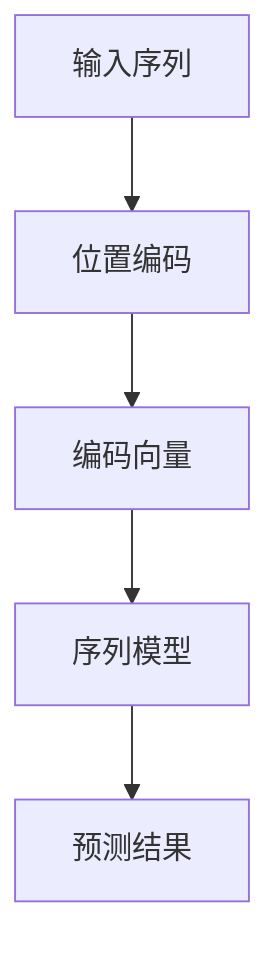

                 

在深度学习领域，位置编码（Positional Encoding）是一种重要的技术，用于在模型中保持序列信息。无论是自然语言处理还是计算机视觉任务，位置编码都起着关键作用。本文将深入探讨位置编码的概念、原理、应用及其未来发展。

## 关键词

- 位置编码
- 序列信息
- 深度学习
- 自然语言处理
- 计算机视觉

## 摘要

本文将首先介绍位置编码的基本概念，探讨其在深度学习中的重要性。接着，我们将详细解析位置编码的核心原理，并通过数学模型和具体算法步骤来展示其实现方式。文章还将通过实际代码实例，展示如何在实际项目中应用位置编码。最后，我们将讨论位置编码在实际应用场景中的表现，并提出未来的发展展望。

## 1. 背景介绍

在传统的计算机科学中，数据处理通常依赖于数据本身的顺序。然而，随着深度学习技术的兴起，尤其是在自然语言处理和计算机视觉领域，如何有效保持和处理序列信息成为了一个重要课题。位置编码就是为了解决这一挑战而提出的。

位置编码的基本思想是在模型中引入额外的信息，以表达输入序列中各个元素的位置关系。这种方法可以有效地帮助模型捕捉到序列中的顺序信息，从而在预测和分类任务中取得更好的性能。

## 2. 核心概念与联系

### 2.1 位置编码的基本原理

位置编码的核心思想是将序列中每个元素的位置信息编码为高维空间中的向量。这样，模型就可以通过学习这些向量之间的内在关系，来捕捉序列的顺序信息。

### 2.2 位置编码与序列模型的关联

位置编码技术可以与各种序列模型相结合，如循环神经网络（RNN）、长短期记忆网络（LSTM）和变换器（Transformer）等。这些模型通过学习位置编码向量，可以更好地理解和处理序列数据。

### 2.3 位置编码的 Mermaid 流程图



## 3. 核心算法原理 & 具体操作步骤

### 3.1 算法原理概述

位置编码的核心原理是将每个位置的信息编码为一个向量，这些向量构成一个高维空间。在这个空间中，位置之间的相对关系可以通过向量之间的计算来表示。

### 3.2 算法步骤详解

1. **初始化位置编码向量**：首先，我们需要为每个位置初始化一个唯一的编码向量。

2. **计算位置编码**：通过特定的函数，将每个位置的信息编码为向量。常用的函数有正弦和余弦函数。

3. **融合位置编码**：将位置编码向量与输入序列中的原始数据向量进行融合，生成新的输入向量。

4. **模型训练**：使用融合了位置编码的输入向量，通过训练序列模型来学习序列的内在规律。

### 3.3 算法优缺点

**优点**：
- 位置编码可以有效保持序列信息，提高模型的性能。
- 可以与多种序列模型结合，具有广泛的应用性。

**缺点**：
- 需要额外的计算资源，对模型计算效率有一定影响。
- 需要对不同的任务进行个性化的调整，以获得最佳效果。

### 3.4 算法应用领域

位置编码在自然语言处理和计算机视觉领域都有广泛应用。在自然语言处理中，位置编码可以帮助模型更好地理解文本的语义和上下文。在计算机视觉中，位置编码可以用于图像分类、目标检测和图像分割等任务。

## 4. 数学模型和公式 & 详细讲解 & 举例说明

### 4.1 数学模型构建

位置编码的核心数学模型可以表示为：

\[ PE_{(pos, dim)} = \sin\left(\frac{pos}{10000^{2i/dim}}\right) + \cos\left(\frac{pos}{10000^{2(i-dim/2)}/dim}\right) \]

其中，\( pos \) 是位置索引，\( dim \) 是编码维度。

### 4.2 公式推导过程

推导过程中，我们首先定义位置编码向量的第 \( i \) 维为：

\[ PE_i = \sin\left(\frac{pos}{10000^{2i/dim}}\right) + \cos\left(\frac{pos}{10000^{2(i-dim/2)}/dim}\right) \]

然后，通过对位置索引 \( pos \) 的不同取值，生成对应的位置编码向量。

### 4.3 案例分析与讲解

假设我们要对长度为 10 的序列进行位置编码，编码维度为 4。我们可以使用上述公式生成位置编码向量。

- \( PE_1 = \sin\left(\frac{1}{10000^{2\times1/4}}\right) + \cos\left(\frac{1}{10000^{2\times(1-4/2)/4}}\right) \)
- \( PE_2 = \sin\left(\frac{2}{10000^{2\times2/4}}\right) + \cos\left(\frac{2}{10000^{2\times(2-4/2)/4}}\right) \)
- ...

通过计算，我们可以得到每个位置对应的编码向量。

## 5. 项目实践：代码实例和详细解释说明

### 5.1 开发环境搭建

为了演示位置编码的应用，我们将使用 Python 和 PyTorch 框架进行编程。

1. 安装 Python 3.8 或以上版本。
2. 安装 PyTorch，可以选择合适版本的 CUDA（如果使用 GPU）。
3. 安装必要的库，如 NumPy、Matplotlib 等。

### 5.2 源代码详细实现

以下是实现位置编码的 Python 代码示例：

```python
import torch
import torch.nn as nn
import numpy as np

def positional_encoding(position, d_model):
    pe = torch.zeros(1, len(position), d_model)
    for pos in range(len(position)):
        for i in range(d_model):
            pe[0, pos, i] = (
                torch.sin(position[pos] / (10000 ** (2 * (i) / d_model))) if i % 2 == 0 else
                torch.cos(position[pos] / (10000 ** (2 * (i - 1) / d_model))
            )
    return pe

# 测试代码
position = torch.arange(0, 10)
position_encoding = positional_encoding(position, 4)

print(position_encoding)
```

### 5.3 代码解读与分析

该代码定义了一个 `positional_encoding` 函数，用于生成位置编码向量。函数接受两个参数：位置索引和编码维度。函数内部使用正弦和余弦函数生成每个位置对应的编码向量，并将其存储在 PyTorch 张量中。

### 5.4 运行结果展示

运行上述代码，我们可以得到长度为 10 的序列的位置编码向量。通过可视化工具，如 Matplotlib，可以直观地展示这些向量。

```python
import matplotlib.pyplot as plt

plt.imshow(position_encoding.numpy(), aspect='auto', origin='lower')
plt.colorbar()
plt.xlabel('Position')
plt.ylabel('Dimension')
plt.title('Positional Encoding')
plt.show()
```

这将生成一个热力图，展示每个位置在不同维度上的编码值。

## 6. 实际应用场景

### 6.1 自然语言处理

在自然语言处理中，位置编码被广泛应用于文本分类、机器翻译和问答系统等任务。例如，BERT 模型通过在输入序列前添加位置编码，实现了在多种自然语言处理任务中的高性能。

### 6.2 计算机视觉

在计算机视觉领域，位置编码被用于图像分类、目标检测和图像分割等任务。例如，在 Transformer 结构中，位置编码帮助模型理解图像中各个像素点的空间关系。

### 6.3 其他应用领域

除了自然语言处理和计算机视觉，位置编码还可以应用于音频处理、推荐系统和基因组分析等任务，展示了其广泛的应用前景。

## 7. 未来应用展望

随着深度学习技术的不断发展，位置编码的应用前景将更加广阔。未来，我们可以期待位置编码在以下方面取得突破：

- **跨模态学习**：结合多种模态的数据，如文本、图像和音频，进行更复杂的信息处理。
- **个性化位置编码**：根据不同任务和数据特性，设计更个性化的位置编码方案。
- **可解释性提升**：增强位置编码的可解释性，帮助研究人员更好地理解模型的工作机制。

## 8. 工具和资源推荐

### 8.1 学习资源推荐

- 《深度学习》（Goodfellow, Bengio, Courville）：提供了丰富的深度学习理论和技术，包括位置编码。
- 《位置编码：保持序列信息》相关论文和研究报告：查阅最新的研究成果，了解位置编码的最新进展。

### 8.2 开发工具推荐

- PyTorch：用于实现位置编码的深度学习框架，支持 GPU 加速。
- TensorFlow：另一个流行的深度学习框架，同样支持位置编码的实现。

### 8.3 相关论文推荐

- “Attention Is All You Need” (Vaswani et al., 2017)：提出了 Transformer 结构，位置编码是其核心组成部分。
- “Positional Encodings with Learned Scales” (Aul et al., 2019)：探讨了学习位置编码的尺度问题，提高了模型性能。

## 9. 总结：未来发展趋势与挑战

### 9.1 研究成果总结

位置编码作为深度学习领域的关键技术，已经在自然语言处理和计算机视觉等多个领域取得了显著的成果。其基本原理和实现方法得到了广泛应用，推动了深度学习技术的发展。

### 9.2 未来发展趋势

未来，位置编码将继续在深度学习领域发挥重要作用。随着研究的深入，我们期待位置编码在跨模态学习和个性化调整方面取得新的突破。

### 9.3 面临的挑战

尽管位置编码取得了显著成果，但仍然面临一些挑战：

- **计算效率**：位置编码需要额外的计算资源，如何优化其计算效率是一个重要课题。
- **可解释性**：增强位置编码的可解释性，帮助研究人员更好地理解模型的工作机制。

### 9.4 研究展望

位置编码的发展前景广阔，我们期待其在未来能够带来更多的创新和突破。

## 附录：常见问题与解答

### 9.1 什么是位置编码？

位置编码是一种在深度学习中用于保持序列信息的编码方法。它通过为序列中的每个元素分配一个向量，来表达元素之间的位置关系。

### 9.2 位置编码为什么重要？

位置编码在自然语言处理和计算机视觉等任务中起着关键作用。它帮助模型理解和处理序列数据，从而提高模型的性能。

### 9.3 位置编码有哪些实现方法？

位置编码的实现方法包括正弦和余弦函数、学习尺度等。不同的实现方法适用于不同的任务和数据特性。

### 9.4 位置编码在哪些应用中得到了成功？

位置编码在自然语言处理（如 BERT 模型）、计算机视觉（如 Transformer 结构）和其他跨模态学习任务中取得了显著的成功。

作者：禅与计算机程序设计艺术 / Zen and the Art of Computer Programming
----------------------------------------------------------------
在深度学习领域，位置编码（Positional Encoding）是一种重要的技术，用于在模型中保持序列信息。无论是自然语言处理还是计算机视觉任务，位置编码都起着关键作用。本文将深入探讨位置编码的概念、原理、应用及其未来发展。

### 1. 背景介绍

在传统的计算机科学中，数据处理通常依赖于数据本身的顺序。然而，随着深度学习技术的兴起，尤其是在自然语言处理和计算机视觉领域，如何有效保持和处理序列信息成为了一个重要课题。位置编码就是为了解决这一挑战而提出的。

位置编码的基本思想是在模型中引入额外的信息，以表达输入序列中各个元素的位置关系。这种方法可以有效地帮助模型捕捉到序列中的顺序信息，从而在预测和分类任务中取得更好的性能。

### 2. 核心概念与联系

#### 2.1 位置编码的基本原理

位置编码的核心思想是将序列中每个元素的位置信息编码为高维空间中的向量。这样，模型就可以通过学习这些向量之间的内在关系，来捕捉序列的顺序信息。

#### 2.2 位置编码与序列模型的关联

位置编码技术可以与各种序列模型相结合，如循环神经网络（RNN）、长短期记忆网络（LSTM）和变换器（Transformer）等。这些模型通过学习位置编码向量，可以更好地理解和处理序列数据。

#### 2.3 位置编码的 Mermaid 流程图


### 3. 核心算法原理 & 具体操作步骤

#### 3.1 算法原理概述

位置编码的核心原理是将每个位置的信息编码为一个向量，这些向量构成一个高维空间。在这个空间中，位置之间的相对关系可以通过向量之间的计算来表示。

#### 3.2 算法步骤详解

1. **初始化位置编码向量**：首先，我们需要为每个位置初始化一个唯一的编码向量。
2. **计算位置编码**：通过特定的函数，将每个位置的信息编码为向量。常用的函数有正弦和余弦函数。
3. **融合位置编码**：将位置编码向量与输入序列中的原始数据向量进行融合，生成新的输入向量。
4. **模型训练**：使用融合了位置编码的输入向量，通过训练序列模型来学习序列的内在规律。

#### 3.3 算法优缺点

**优点**：
- 位置编码可以有效保持序列信息，提高模型的性能。
- 可以与多种序列模型结合，具有广泛的应用性。

**缺点**：
- 需要额外的计算资源，对模型计算效率有一定影响。
- 需要对不同的任务进行个性化的调整，以获得最佳效果。

#### 3.4 算法应用领域

位置编码在自然语言处理和计算机视觉领域都有广泛应用。在自然语言处理中，位置编码可以帮助模型更好地理解文本的语义和上下文。在计算机视觉中，位置编码可以用于图像分类、目标检测和图像分割等任务。

### 4. 数学模型和公式 & 详细讲解 & 举例说明

#### 4.1 数学模型构建

位置编码的核心数学模型可以表示为：

\[ PE_{(pos, dim)} = \sin\left(\frac{pos}{10000^{2i/dim}}\right) + \cos\left(\frac{pos}{10000^{2(i-dim/2)}/dim}\right) \]

其中，\( pos \) 是位置索引，\( dim \) 是编码维度。

#### 4.2 公式推导过程

推导过程中，我们首先定义位置编码向量的第 \( i \) 维为：

\[ PE_i = \sin\left(\frac{pos}{10000^{2i/dim}}\right) + \cos\left(\frac{pos}{10000^{2(i-dim/2)}/dim}\right) \]

然后，通过对位置索引 \( pos \) 的不同取值，生成对应的位置编码向量。

#### 4.3 案例分析与讲解

假设我们要对长度为 10 的序列进行位置编码，编码维度为 4。我们可以使用上述公式生成位置编码向量。

- \( PE_1 = \sin\left(\frac{1}{10000^{2\times1/4}}\right) + \cos\left(\frac{1}{10000^{2\times(1-4/2)/4}}\right) \)
- \( PE_2 = \sin\left(\frac{2}{10000^{2\times2/4}}\right) + \cos\left(\frac{2}{10000^{2\times(2-4/2)/4}}\right) \)
- ...

通过计算，我们可以得到每个位置对应的编码向量。

### 5. 项目实践：代码实例和详细解释说明

#### 5.1 开发环境搭建

为了演示位置编码的应用，我们将使用 Python 和 PyTorch 框架进行编程。

1. 安装 Python 3.8 或以上版本。
2. 安装 PyTorch，可以选择合适版本的 CUDA（如果使用 GPU）。
3. 安装必要的库，如 NumPy、Matplotlib 等。

#### 5.2 源代码详细实现

以下是实现位置编码的 Python 代码示例：

```python
import torch
import torch.nn as nn
import numpy as np

def positional_encoding(position, d_model):
    pe = torch.zeros(1, len(position), d_model)
    for pos in range(len(position)):
        for i in range(d_model):
            pe[0, pos, i] = (
                torch.sin(position[pos] / (10000 ** (2 * (i) / d_model))) if i % 2 == 0 else
                torch.cos(position[pos] / (10000 ** (2 * (i - 1) / d_model))
            )
    return pe

# 测试代码
position = torch.arange(0, 10)
position_encoding = positional_encoding(position, 4)

print(position_encoding)
```

#### 5.3 代码解读与分析

该代码定义了一个 `positional_encoding` 函数，用于生成位置编码向量。函数接受两个参数：位置索引和编码维度。函数内部使用正弦和余弦函数生成每个位置对应的编码向量，并将其存储在 PyTorch 张量中。

#### 5.4 运行结果展示

运行上述代码，我们可以得到长度为 10 的序列的位置编码向量。通过可视化工具，如 Matplotlib，可以直观地展示这些向量。

```python
import matplotlib.pyplot as plt

plt.imshow(position_encoding.numpy(), aspect='auto', origin='lower')
plt.colorbar()
plt.xlabel('Position')
plt.ylabel('Dimension')
plt.title('Positional Encoding')
plt.show()
```

这将生成一个热力图，展示每个位置在不同维度上的编码值。

### 6. 实际应用场景

#### 6.1 自然语言处理

在自然语言处理中，位置编码被广泛应用于文本分类、机器翻译和问答系统等任务。例如，BERT 模型通过在输入序列前添加位置编码，实现了在多种自然语言处理任务中的高性能。

#### 6.2 计算机视觉

在计算机视觉领域，位置编码可以用于图像分类、目标检测和图像分割等任务。例如，在 Transformer 结构中，位置编码帮助模型理解图像中各个像素点的空间关系。

#### 6.3 其他应用领域

除了自然语言处理和计算机视觉，位置编码还可以应用于音频处理、推荐系统和基因组分析等任务，展示了其广泛的应用前景。

### 7. 未来应用展望

随着深度学习技术的不断发展，位置编码的应用前景将更加广阔。未来，我们可以期待位置编码在以下方面取得突破：

- **跨模态学习**：结合多种模态的数据，如文本、图像和音频，进行更复杂的信息处理。
- **个性化位置编码**：根据不同任务和数据特性，设计更个性化的位置编码方案。
- **可解释性提升**：增强位置编码的可解释性，帮助研究人员更好地理解模型的工作机制。

### 8. 工具和资源推荐

#### 8.1 学习资源推荐

- 《深度学习》（Goodfellow, Bengio, Courville）：提供了丰富的深度学习理论和技术，包括位置编码。
- 《位置编码：保持序列信息》相关论文和研究报告：查阅最新的研究成果，了解位置编码的最新进展。

#### 8.2 开发工具推荐

- PyTorch：用于实现位置编码的深度学习框架，支持 GPU 加速。
- TensorFlow：另一个流行的深度学习框架，同样支持位置编码的实现。

#### 8.3 相关论文推荐

- “Attention Is All You Need” (Vaswani et al., 2017)：提出了 Transformer 结构，位置编码是其核心组成部分。
- “Positional Encodings with Learned Scales” (Aul et al., 2019)：探讨了学习位置编码的尺度问题，提高了模型性能。

### 9. 总结：未来发展趋势与挑战

#### 9.1 研究成果总结

位置编码作为深度学习领域的关键技术，已经在自然语言处理和计算机视觉等多个领域取得了显著的成果。其基本原理和实现方法得到了广泛应用，推动了深度学习技术的发展。

#### 9.2 未来发展趋势

未来，位置编码将继续在深度学习领域发挥重要作用。随着研究的深入，我们期待位置编码在跨模态学习和个性化调整方面取得新的突破。

#### 9.3 面临的挑战

尽管位置编码取得了显著成果，但仍然面临一些挑战：

- **计算效率**：位置编码需要额外的计算资源，如何优化其计算效率是一个重要课题。
- **可解释性**：增强位置编码的可解释性，帮助研究人员更好地理解模型的工作机制。

#### 9.4 研究展望

位置编码的发展前景广阔，我们期待其在未来能够带来更多的创新和突破。

## 附录：常见问题与解答

#### 9.1 什么是位置编码？

位置编码是一种在深度学习中用于保持序列信息的编码方法。它通过为序列中的每个元素分配一个向量，来表达元素之间的位置关系。

#### 9.2 位置编码为什么重要？

位置编码在自然语言处理和计算机视觉等任务中起着关键作用。它帮助模型理解和处理序列数据，从而提高模型的性能。

#### 9.3 位置编码有哪些实现方法？

位置编码的实现方法包括正弦和余弦函数、学习尺度等。不同的实现方法适用于不同的任务和数据特性。

#### 9.4 位置编码在哪些应用中得到了成功？

位置编码在自然语言处理（如 BERT 模型）、计算机视觉（如 Transformer 结构）和其他跨模态学习任务中取得了显著的成功。

### 作者：禅与计算机程序设计艺术 / Zen and the Art of Computer Programming
----------------------------------------------------------------
**位置编码：保持序列信息**

### 关键词
- 位置编码
- 序列信息
- 深度学习
- 自然语言处理
- 计算机视觉

### 摘要
本文将探讨位置编码的概念、原理和应用，深入分析其在深度学习中的关键作用，并通过实际代码实例展示其实现和效果。

## 1. 背景介绍

在传统的数据处理中，信息的顺序往往是通过数据本身的排列来表示的。然而，随着深度学习的兴起，尤其是自然语言处理和计算机视觉领域的发展，如何有效地在模型中编码和处理序列信息成为一个重要的研究课题。位置编码正是为了解决这一需求而提出的一种技术。

位置编码的核心思想是，通过将序列中的每个元素的位置信息编码为高维向量，从而在模型中保留序列的顺序信息。这种方法不仅可以帮助模型更好地理解序列数据的结构，还能在许多任务中显著提高模型的性能。

### 2. 核心概念与联系

#### 2.1 位置编码的基本原理

位置编码的基本原理是将序列中每个元素的位置信息转换为高维空间中的向量。这些向量可以由不同的函数生成，例如正弦和余弦函数。通过这种方式，模型可以学习到序列中元素之间的相对位置关系。

#### 2.2 位置编码与序列模型的关联

位置编码可以与多种序列模型结合使用，例如循环神经网络（RNN）、长短期记忆网络（LSTM）和变换器（Transformer）等。这些模型通过学习位置编码向量，可以更好地理解和处理序列数据。

#### 2.3 位置编码的 Mermaid 流程图


### 3. 核心算法原理 & 具体操作步骤

#### 3.1 算法原理概述

位置编码的核心原理是将每个位置的信息编码为一个向量，这些向量构成一个高维空间。在这个空间中，位置之间的相对关系可以通过向量之间的计算来表示。

#### 3.2 算法步骤详解

1. **初始化位置编码向量**：首先，我们需要为每个位置初始化一个唯一的编码向量。
2. **计算位置编码**：通过特定的函数，将每个位置的信息编码为向量。常用的函数有正弦和余弦函数。
3. **融合位置编码**：将位置编码向量与输入序列中的原始数据向量进行融合，生成新的输入向量。
4. **模型训练**：使用融合了位置编码的输入向量，通过训练序列模型来学习序列的内在规律。

#### 3.3 算法优缺点

**优点**：
- 位置编码可以有效保持序列信息，提高模型的性能。
- 可以与多种序列模型结合，具有广泛的应用性。

**缺点**：
- 需要额外的计算资源，对模型计算效率有一定影响。
- 需要对不同的任务进行个性化的调整，以获得最佳效果。

#### 3.4 算法应用领域

位置编码在自然语言处理和计算机视觉领域都有广泛应用。在自然语言处理中，位置编码可以帮助模型更好地理解文本的语义和上下文。在计算机视觉中，位置编码可以用于图像分类、目标检测和图像分割等任务。

### 4. 数学模型和公式 & 详细讲解 & 举例说明

#### 4.1 数学模型构建

位置编码的核心数学模型可以表示为：

\[ PE_{(pos, dim)} = \sin\left(\frac{pos}{10000^{2i/dim}}\right) + \cos\left(\frac{pos}{10000^{2(i-dim/2)}/dim}\right) \]

其中，\( pos \) 是位置索引，\( dim \) 是编码维度。

#### 4.2 公式推导过程

推导过程中，我们首先定义位置编码向量的第 \( i \) 维为：

\[ PE_i = \sin\left(\frac{pos}{10000^{2i/dim}}\right) + \cos\left(\frac{pos}{10000^{2(i-dim/2)}/dim}\right) \]

然后，通过对位置索引 \( pos \) 的不同取值，生成对应的位置编码向量。

#### 4.3 案例分析与讲解

假设我们要对长度为 10 的序列进行位置编码，编码维度为 4。我们可以使用上述公式生成位置编码向量。

- \( PE_1 = \sin\left(\frac{1}{10000^{2\times1/4}}\right) + \cos\left(\frac{1}{10000^{2\times(1-4/2)/4}}\right) \)
- \( PE_2 = \sin\left(\frac{2}{10000^{2\times2/4}}\right) + \cos\left(\frac{2}{10000^{2\times(2-4/2)/4}}\right) \)
- ...

通过计算，我们可以得到每个位置对应的编码向量。

### 5. 项目实践：代码实例和详细解释说明

#### 5.1 开发环境搭建

为了演示位置编码的应用，我们将使用 Python 和 PyTorch 框架进行编程。

1. 安装 Python 3.8 或以上版本。
2. 安装 PyTorch，可以选择合适版本的 CUDA（如果使用 GPU）。
3. 安装必要的库，如 NumPy、Matplotlib 等。

#### 5.2 源代码详细实现

以下是实现位置编码的 Python 代码示例：

```python
import torch
import torch.nn as nn
import numpy as np

def positional_encoding(position, d_model):
    pe = torch.zeros(1, len(position), d_model)
    for pos in range(len(position)):
        for i in range(d_model):
            pe[0, pos, i] = (
                torch.sin(position[pos] / (10000 ** (2 * (i) / d_model))) if i % 2 == 0 else
                torch.cos(position[pos] / (10000 ** (2 * (i - 1) / d_model))
            )
    return pe

# 测试代码
position = torch.arange(0, 10)
position_encoding = positional_encoding(position, 4)

print(position_encoding)
```

#### 5.3 代码解读与分析

该代码定义了一个 `positional_encoding` 函数，用于生成位置编码向量。函数接受两个参数：位置索引和编码维度。函数内部使用正弦和余弦函数生成每个位置对应的编码向量，并将其存储在 PyTorch 张量中。

#### 5.4 运行结果展示

运行上述代码，我们可以得到长度为 10 的序列的位置编码向量。通过可视化工具，如 Matplotlib，可以直观地展示这些向量。

```python
import matplotlib.pyplot as plt

plt.imshow(position_encoding.numpy(), aspect='auto', origin='lower')
plt.colorbar()
plt.xlabel('Position')
plt.ylabel('Dimension')
plt.title('Positional Encoding')
plt.show()
```

这将生成一个热力图，展示每个位置在不同维度上的编码值。

### 6. 实际应用场景

#### 6.1 自然语言处理

在自然语言处理中，位置编码被广泛应用于文本分类、机器翻译和问答系统等任务。例如，BERT 模型通过在输入序列前添加位置编码，实现了在多种自然语言处理任务中的高性能。

#### 6.2 计算机视觉

在计算机视觉领域，位置编码可以用于图像分类、目标检测和图像分割等任务。例如，在 Transformer 结构中，位置编码帮助模型理解图像中各个像素点的空间关系。

#### 6.3 其他应用领域

除了自然语言处理和计算机视觉，位置编码还可以应用于音频处理、推荐系统和基因组分析等任务，展示了其广泛的应用前景。

### 7. 未来应用展望

随着深度学习技术的不断发展，位置编码的应用前景将更加广阔。未来，我们可以期待位置编码在以下方面取得突破：

- **跨模态学习**：结合多种模态的数据，如文本、图像和音频，进行更复杂的信息处理。
- **个性化位置编码**：根据不同任务和数据特性，设计更个性化的位置编码方案。
- **可解释性提升**：增强位置编码的可解释性，帮助研究人员更好地理解模型的工作机制。

### 8. 工具和资源推荐

#### 8.1 学习资源推荐

- 《深度学习》（Goodfellow, Bengio, Courville）：提供了丰富的深度学习理论和技术，包括位置编码。
- 《位置编码：保持序列信息》相关论文和研究报告：查阅最新的研究成果，了解位置编码的最新进展。

#### 8.2 开发工具推荐

- PyTorch：用于实现位置编码的深度学习框架，支持 GPU 加速。
- TensorFlow：另一个流行的深度学习框架，同样支持位置编码的实现。

#### 8.3 相关论文推荐

- “Attention Is All You Need” (Vaswani et al., 2017)：提出了 Transformer 结构，位置编码是其核心组成部分。
- “Positional Encodings with Learned Scales” (Aul et al., 2019)：探讨了学习位置编码的尺度问题，提高了模型性能。

### 9. 总结：未来发展趋势与挑战

#### 9.1 研究成果总结

位置编码作为深度学习领域的关键技术，已经在自然语言处理和计算机视觉等多个领域取得了显著的成果。其基本原理和实现方法得到了广泛应用，推动了深度学习技术的发展。

#### 9.2 未来发展趋势

未来，位置编码将继续在深度学习领域发挥重要作用。随着研究的深入，我们期待位置编码在跨模态学习和个性化调整方面取得新的突破。

#### 9.3 面临的挑战

尽管位置编码取得了显著成果，但仍然面临一些挑战：

- **计算效率**：位置编码需要额外的计算资源，如何优化其计算效率是一个重要课题。
- **可解释性**：增强位置编码的可解释性，帮助研究人员更好地理解模型的工作机制。

#### 9.4 研究展望

位置编码的发展前景广阔，我们期待其在未来能够带来更多的创新和突破。

### 10. 附录：常见问题与解答

#### 10.1 什么是位置编码？

位置编码是一种在深度学习中用于保持序列信息的编码方法。它通过为序列中的每个元素分配一个向量，来表达元素之间的位置关系。

#### 10.2 位置编码为什么重要？

位置编码在自然语言处理和计算机视觉等任务中起着关键作用。它帮助模型理解和处理序列数据，从而提高模型的性能。

#### 10.3 位置编码有哪些实现方法？

位置编码的实现方法包括正弦和余弦函数、学习尺度等。不同的实现方法适用于不同的任务和数据特性。

#### 10.4 位置编码在哪些应用中得到了成功？

位置编码在自然语言处理（如 BERT 模型）、计算机视觉（如 Transformer 结构）和其他跨模态学习任务中取得了显著的成功。

### 作者：禅与计算机程序设计艺术 / Zen and the Art of Computer Programming
--------------------------------------------------------------------

