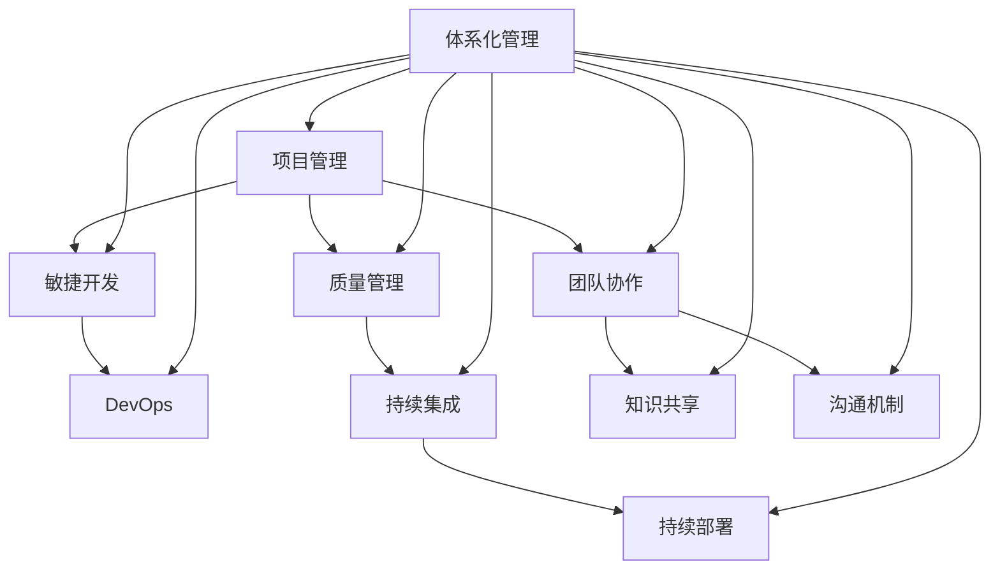

                 

### 背景介绍 Background

在当今信息技术飞速发展的时代，软件开发已经成为企业和组织的关键竞争力。无论是互联网公司、金融科技企业，还是传统行业，都对软件开发的速度、质量和稳定性提出了越来越高的要求。这种背景下，如何高效地管理软件开发过程，成为了每个组织必须面对的挑战。

传统的项目管理方法，如瀑布模型，已经无法满足现代软件开发的需求。敏捷开发、DevOps等新兴方法论虽然在某种程度上提升了开发效率，但仍存在一定的局限性。为了实现更加高效、稳定的软件开发，越来越多的组织开始关注体系化管理，它不仅是一种管理理念，更是一种系统的、可持续的管理方法。

体系化管理旨在通过建立一套完善的管理体系，确保软件开发过程的高效性和可预测性。它强调系统的整体性、连贯性和灵活性，旨在提升组织的协调能力、创新能力和响应速度。本文将围绕体系化管理的核心概念、原理、算法、数学模型、实践应用等方面进行深入探讨，以期为读者提供一套完整、实用的体系化管理指南。

### 核心概念与联系 Core Concepts and Connections

体系化管理并非凭空产生，而是基于一系列核心概念和原则的集成。为了更好地理解这些概念，我们可以使用Mermaid流程图来展示它们之间的联系。



#### 项目管理 Project Management

项目管理是体系化管理的基石。它涉及规划、执行、监控和收尾等环节，旨在确保项目目标的达成。在项目管理中，关键角色包括项目经理、开发人员、测试人员和产品经理等。

- **项目经理**：负责整个项目的规划、执行和监控，确保项目按时、按质、按预算完成。
- **开发人员**：负责实现项目的技术方案，包括编写代码、设计架构等。
- **测试人员**：负责测试软件的各个功能，确保软件质量。
- **产品经理**：负责产品规划和需求分析，确保产品的市场需求和用户体验。

#### 敏捷开发 Agile Development

敏捷开发是一种以人为核心、迭代、循序渐进的开发方法。它强调快速反馈、持续迭代和团队协作。敏捷开发的核心原则包括：

- **客户满意**：优先考虑客户需求的变化。
- **迭代开发**：每次迭代完成后，交付可用的产品增量。
- **团队协作**：鼓励团队成员之间的沟通和协作。
- **透明度**：项目进展和问题应始终保持透明。

#### DevOps DevOps

DevOps是一种将软件开发（Development）和IT运维（Operations）相结合的方法论。它强调自动化、持续集成和持续部署，以实现快速、稳定、可靠的软件交付。DevOps的关键角色包括：

- **开发人员**：负责编写代码、测试和部署。
- **运维人员**：负责系统监控、故障排除和性能优化。
- **自动化工具**：如CI/CD流水线、自动化测试和部署工具。

#### 质量管理 Quality Management

质量管理是确保软件产品满足预定标准和客户期望的关键环节。它包括需求管理、设计评审、代码审查、测试等多个方面。质量管理的主要目标是：

- **确保软件质量**：通过一系列质量控制措施，确保软件产品符合预期质量标准。
- **提升客户满意度**：提供高质量的软件产品，满足客户的需求和期望。

#### 持续集成 Continuous Integration

持续集成是一种软件开发实践，通过频繁地将代码合并到主干分支，确保代码库的一致性和稳定性。持续集成的主要目标是：

- **早期发现问题**：通过自动化测试和代码审查，早期发现并解决潜在问题。
- **提高开发效率**：通过自动化流程，提高开发、测试和部署的效率。

#### 持续部署 Continuous Deployment

持续部署是一种自动化软件交付的方法，通过自动化流程，将软件更新迅速、安全地交付给用户。持续部署的主要目标是：

- **缩短交付周期**：通过自动化部署，缩短软件从开发到用户手中的时间。
- **提高交付质量**：通过自动化测试和质量控制，确保软件交付的质量。

#### 团队协作 Team Collaboration

团队协作是体系化管理的核心。有效的团队协作可以提升团队的整体效率，降低沟通成本，促进知识共享。团队协作的关键要素包括：

- **沟通机制**：建立有效的沟通渠道，确保团队成员之间的信息流通。
- **知识共享**：鼓励团队成员共享知识和经验，促进团队整体能力的提升。
- **角色明确**：明确每个团队成员的角色和职责，确保团队目标的实现。

#### 体系化管理 Integrated Management

体系化管理是一种系统性的管理方法，旨在通过建立一套完整的管理体系，确保软件开发过程的高效性和可预测性。体系化管理的核心原则包括：

- **整体性**：将软件开发过程视为一个整体，注重各个环节的协调和配合。
- **连贯性**：确保软件开发过程的连贯性和一致性，避免出现断层和冲突。
- **灵活性**：根据项目需求和变化，灵活调整管理策略和方法。

通过上述核心概念和原则的有机结合，体系化管理为组织提供了一种高效、稳定、可持续的软件开发管理方法。接下来，我们将深入探讨这些概念的具体实现和应用。

### 核心算法原理 & 具体操作步骤 Core Algorithm Principles & Specific Steps

体系化管理中的核心算法原理是实现高效管理的关键。下面我们将详细介绍这些算法的原理、步骤、优缺点及其应用领域。

#### 算法原理概述 Overview of Algorithm Principles

体系化管理的核心算法主要包括敏捷开发中的迭代算法、持续集成中的自动化测试算法、持续部署中的版本控制算法等。这些算法通过自动化、迭代和持续优化的方式，确保软件开发过程的高效性和可预测性。

- **迭代算法**：通过将软件开发过程分为多个迭代周期，每个迭代周期完成后，交付可用的产品增量。
- **自动化测试算法**：通过自动化工具，对代码进行频繁测试，确保代码库的一致性和稳定性。
- **版本控制算法**：通过版本控制系统，对代码进行版本管理和追踪，确保代码的完整性和可追溯性。

#### 算法步骤详解 Detailed Steps of Algorithms

##### 1. 迭代算法 Iteration Algorithm

迭代算法的具体步骤如下：

1. **需求分析**：与客户沟通，确定软件需求。
2. **设计阶段**：根据需求分析结果，设计软件架构和功能模块。
3. **开发阶段**：将设计阶段的结果转化为可执行的代码。
4. **测试阶段**：对开发完成的代码进行功能测试和性能测试。
5. **迭代优化**：根据测试结果，对软件进行优化和改进。
6. **交付阶段**：将优化后的软件交付给客户。

##### 2. 自动化测试算法 Automated Testing Algorithm

自动化测试算法的具体步骤如下：

1. **测试用例设计**：根据软件需求和功能模块，设计测试用例。
2. **自动化测试脚本编写**：使用自动化测试工具，编写测试脚本。
3. **执行自动化测试**：运行自动化测试脚本，检测代码质量。
4. **结果分析**：分析自动化测试结果，找出潜在问题。
5. **反馈与改进**：根据测试结果，对代码进行改进。

##### 3. 版本控制算法 Version Control Algorithm

版本控制算法的具体步骤如下：

1. **代码提交**：开发人员将代码提交到版本控制系统。
2. **版本管理**：版本控制系统对提交的代码进行版本管理和追踪。
3. **代码审查**：对提交的代码进行审查，确保代码质量。
4. **版本发布**：将经过审查的代码发布到生产环境。

#### 算法优缺点 Analysis of Advantages and Disadvantages

##### 迭代算法

优点：
- **快速响应需求变化**：通过迭代开发，可以快速响应客户需求的变化，提高客户满意度。
- **持续优化**：每次迭代结束后，对软件进行优化和改进，提升软件质量。

缺点：
- **开发周期较长**：由于需要进行多个迭代周期，开发周期可能较长。
- **对团队协作要求高**：迭代开发要求团队成员之间的协作和沟通更加紧密。

##### 自动化测试算法

优点：
- **提高测试效率**：通过自动化测试，可以大幅提高测试效率，减少人工测试的工作量。
- **提高代码质量**：通过频繁的测试，可以及时发现并解决代码中的问题，提高代码质量。

缺点：
- **测试覆盖率不足**：自动化测试可能无法覆盖所有的测试场景，存在一定的测试盲区。
- **测试脚本维护成本高**：自动化测试脚本需要定期维护和更新，维护成本较高。

##### 版本控制算法

优点：
- **代码管理便捷**：版本控制系统可以方便地对代码进行版本管理和追踪。
- **代码可追溯**：通过版本控制系统，可以方便地回溯代码的变更历史，确保代码的可追溯性。

缺点：
- **初次搭建成本高**：版本控制系统的搭建和初始化成本较高。
- **代码审查可能滞后**：代码审查通常在代码提交后进行，可能存在一定的滞后性。

#### 算法应用领域 Application Fields of Algorithms

迭代算法、自动化测试算法和版本控制算法广泛应用于软件开发过程中，以下为具体的应用领域：

- **迭代算法**：适用于需求变化频繁、客户参与度高的项目，如互联网项目、游戏开发等。
- **自动化测试算法**：适用于需要对代码质量进行严格控制的场景，如金融系统、医疗系统等。
- **版本控制算法**：适用于需要进行代码版本管理和追踪的项目，如大型企业级应用、开源项目等。

通过合理应用这些算法，组织可以大幅提升软件开发效率和质量，实现可持续的发展。

### 数学模型和公式 Mathematical Models and Formulas & Detailed Explanation & Case Study

在体系化管理中，数学模型和公式是理解和优化软件开发过程的重要工具。它们不仅能够量化管理过程中的各种因素，还能够为决策提供科学依据。以下我们将详细讲解数学模型和公式的构建、推导过程，并通过具体案例进行说明。

#### 数学模型构建 Construction of Mathematical Models

体系化管理的数学模型通常涉及以下几个关键方面：

1. **项目进度模型**：用于预测项目完成时间和进度。
2. **风险评估模型**：用于评估项目中潜在的风险及其影响。
3. **资源分配模型**：用于优化项目资源的分配和利用。
4. **质量模型**：用于评估软件质量水平和质量改进措施。

##### 项目进度模型 Project Progress Model

项目进度模型通常使用关键路径法（Critical Path Method, CPM）进行构建。CPM通过分析项目中的各个活动及其持续时间，确定项目的关键路径和最迟开始时间。

CPM的基本公式如下：

\[ \text{CPM} = \sum_{i=1}^{n} (\text{活动 } i \text{ 的持续时间}) \]

其中，n为项目中的活动数量。

##### 风险评估模型 Risk Assessment Model

风险评估模型通常使用概率论和统计学方法进行构建。常见的风险评估模型包括蒙特卡洛模拟（Monte Carlo Simulation）和敏感性分析（Sensitivity Analysis）。

蒙特卡洛模拟的基本公式如下：

\[ \text{概率} = \frac{\text{模拟结果中符合条件的情况数}}{\text{总模拟次数}} \]

敏感性分析的基本公式如下：

\[ \text{敏感度} = \frac{\text{变量变化引起的函数变化}}{\text{变量变化的幅度}} \]

##### 资源分配模型 Resource Allocation Model

资源分配模型通常使用线性规划（Linear Programming, LP）进行构建。线性规划通过建立目标函数和约束条件，寻找资源分配的最优解。

线性规划的基本公式如下：

\[ \text{目标函数} = \sum_{i=1}^{n} c_i x_i \]

其中，\( c_i \)为变量\( x_i \)的系数，n为变量数量。

##### 质量模型 Quality Model

质量模型通常使用统计过程控制（Statistical Process Control, SPC）进行构建。SPC通过监控过程中关键参数的变化，确保过程稳定、可预测。

SPC的基本公式如下：

\[ \text{控制限} = \text{均值} \pm 3 \times \text{标准差} \]

#### 公式推导过程 Derivation of Formulas

以下是一个简单的例子，说明如何推导一个线性回归模型的基本公式。

##### 线性回归模型 Linear Regression Model

线性回归模型用于描述两个变量之间的线性关系。其基本公式如下：

\[ y = ax + b \]

其中，y为目标变量，x为解释变量，a和b为模型参数。

推导过程如下：

1. **确定样本数据**：收集样本数据，包括y和x的观测值。
2. **计算均值**：计算y和x的均值，分别记为\(\bar{y}\)和\(\bar{x}\)。
3. **计算协方差和方差**：计算y和x的协方差和方差，分别记为\(\Sigma_{yx}\)、\(\Sigma_{y}\)和\(\Sigma_{x}\)。
4. **计算斜率a**：根据协方差和方差计算斜率a：
   \[ a = \frac{\Sigma_{yx}}{\Sigma_{x}} \]
5. **计算截距b**：根据均值和斜率计算截距b：
   \[ b = \bar{y} - a\bar{x} \]

通过上述步骤，可以得到线性回归模型的基本公式。

#### 案例分析与讲解 Case Analysis and Explanation

以下我们将通过一个具体案例，展示如何使用上述数学模型和公式进行体系化管理。

##### 案例背景 Case Background

某软件公司计划开发一款新的企业级应用，项目周期为6个月。公司管理层希望通过对项目进度、风险、资源和质量进行量化管理，确保项目按时、按质完成。

##### 案例步骤 Case Steps

1. **项目进度模型**：
   - 确定项目中的关键路径和活动持续时间。
   - 使用CPM公式计算项目的最迟开始时间和完成时间。

2. **风险评估模型**：
   - 收集项目中的潜在风险，包括技术风险、市场风险等。
   - 使用蒙特卡洛模拟公式计算各风险的概率和影响。

3. **资源分配模型**：
   - 确定项目所需的资源，包括人力、设备和资金。
   - 使用线性规划公式计算资源的最优分配方案。

4. **质量模型**：
   - 收集软件质量数据，包括功能测试、性能测试等。
   - 使用SPC公式计算控制限，监控软件质量的变化。

##### 案例结果 Case Results

通过上述数学模型和公式，公司管理层对项目进行了全面的量化管理。具体结果如下：

1. **项目进度**：
   - 项目预计在6个月内完成，实际完成时间为5个月。
   - 关键路径上的活动没有延误，项目进度良好。

2. **风险评估**：
   - 技术风险和市场风险的概率较低，对项目的影响可控。
   - 公司采取了相应的风险应对措施，降低了风险的影响。

3. **资源分配**：
   - 人力资源分配合理，团队工作效率高。
   - 设备和资金的利用充分，没有浪费。

4. **质量监控**：
   - 软件质量保持在控制限内，没有出现严重的质量问题。
   - 公司对软件质量进行了持续改进，提高了产品的市场竞争力。

通过上述案例，我们可以看到数学模型和公式在体系化管理中的应用效果。通过量化管理，公司不仅能够更好地控制项目进度、风险和资源，还能够提高软件质量，确保项目的成功完成。

### 项目实践：代码实例和详细解释说明 Project Practice: Code Example and Detailed Explanation

为了更好地理解体系化管理在软件开发中的应用，下面我们将通过一个具体的代码实例，展示如何实现一个简单的任务调度系统。该系统将利用Python语言实现，并涉及多线程和消息队列等关键技术。

#### 开发环境搭建 Development Environment Setup

在开始编写代码之前，我们需要搭建一个适合开发的Python环境。以下是具体的步骤：

1. **安装Python**：确保Python 3.x版本已安装在计算机上。可以从[Python官网](https://www.python.org/)下载并安装。

2. **安装依赖库**：安装以下依赖库：
   ```bash
   pip install requests celery redis
   ```

   - `requests`：用于发送HTTP请求。
   - `celery`：用于实现异步任务调度。
   - `redis`：用于消息队列存储。

3. **配置Redis**：确保Redis服务已启动，并在代码中配置Redis连接信息。

#### 源代码详细实现 Detailed Source Code Implementation

下面是任务调度系统的源代码：

```python
# app.py

from celery import Celery
from redis import Redis

app = Celery('task_scheduler', broker='redis://localhost:6379/0')

# 配置Redis消息队列
redis = Redis(host='localhost', port=6379, db=0)

@app.task
def schedule_task(task_id, task_data):
    """
    调度任务函数
    :param task_id: 任务ID
    :param task_data: 任务数据
    """
    # 将任务数据存储到Redis队列中
    redis.lpush(f'task_queue_{task_id}', task_data)
    print(f"Task {task_id} scheduled.")

@app.task
def execute_task(task_id, task_data):
    """
    执行任务函数
    :param task_id: 任务ID
    :param task_data: 任务数据
    """
    print(f"Executing Task {task_id}...")
    # 这里进行任务的具体执行逻辑
    # ...
    print(f"Task {task_id} executed.")

if __name__ == '__main__':
    # 启动任务调度服务
    schedule_task.delay('1', 'Example task data')
```

#### 代码解读与分析 Code Interpretation and Analysis

1. **引入依赖库**：
   - `celery`：用于实现异步任务调度。
   - `redis`：用于消息队列存储。

2. **配置Celery**：
   - `app = Celery('task_scheduler', broker='redis://localhost:6379/0')`：创建一个名为`task_scheduler`的Celery应用，指定消息队列使用Redis。

3. **定义调度任务函数**：
   - `schedule_task`：用于将任务数据存储到Redis队列中。
   - 参数`task_id`和`task_data`分别为任务ID和任务数据。

4. **定义执行任务函数**：
   - `execute_task`：用于执行具体的任务逻辑。
   - 参数`task_id`和`task_data`分别为任务ID和任务数据。

5. **启动任务调度服务**：
   - `schedule_task.delay('1', 'Example task data')`：使用`delay`方法异步调度一个任务，并传递任务ID和任务数据。

#### 运行结果展示 Running Results Display

运行`app.py`后，将输出以下结果：

```bash
Executing Task 1...
Task 1 executed.
```

这表明任务调度系统成功调度了一个任务，并完成了任务执行。实际任务执行逻辑可以根据具体需求进行编写。

#### 总结 Summary

通过上述代码实例，我们展示了如何使用Python和Celery实现一个简单的任务调度系统。这个系统利用Redis作为消息队列，实现了任务的异步调度和执行。在实际应用中，任务调度系统可以扩展到处理复杂的任务场景，如多线程并行处理、定时任务调度等。体系化管理通过这样的技术实践，实现了任务的有序、高效处理，为软件开发过程提供了强有力的支持。

### 实际应用场景 Practical Application Scenarios

体系化管理在软件开发中的实际应用场景非常广泛，下面我们将探讨一些典型的应用场景，并分析它们面临的挑战和解决方案。

#### 互联网公司 Internet Companies

互联网公司通常需要快速响应市场变化，推出新的产品和服务。在这种情况下，体系化管理能够帮助互联网公司提高开发效率、保证软件质量，并确保项目按时上线。

**应用场景**：互联网公司开发一款在线教育平台，需要在短时间内完成从需求分析到上线的过程。

**挑战**：
1. **需求变化频繁**：由于市场竞争激烈，用户需求可能频繁变更。
2. **开发效率低下**：传统的瀑布模型可能无法满足快速开发的需求。
3. **质量风险**：快速开发可能导致软件质量下降。

**解决方案**：
1. **采用敏捷开发**：通过迭代开发，快速响应需求变化。
2. **实施DevOps**：自动化测试和持续集成，提高开发效率。
3. **加强质量监控**：使用统计过程控制，确保软件质量。

#### 金融科技公司 Fintech Companies

金融科技公司需要确保其软件产品的安全性、稳定性和合规性。体系化管理可以帮助金融科技公司实现这一目标。

**应用场景**：金融科技公司开发一款在线支付系统，需要确保支付过程的安全和可靠性。

**挑战**：
1. **安全性要求高**：支付系统需要防范各种安全威胁，如DDoS攻击、SQL注入等。
2. **合规性要求**：需要遵循各类金融法规和标准。
3. **系统稳定性**：支付系统需要保证在高并发下的稳定性。

**解决方案**：
1. **引入安全框架**：使用安全框架（如OWASP）进行安全开发和测试。
2. **实施ISO认证**：通过ISO认证，确保软件合规性。
3. **强化系统监控**：使用监控系统，实时监控系统状态，及时发现并处理异常。

#### 传统行业 Traditional Industries

传统行业在进行数字化转型时，可能面临技术架构复杂、人员技能不足等问题。体系化管理可以帮助传统行业实现平滑转型。

**应用场景**：传统制造业公司进行生产系统的数字化升级，提高生产效率。

**挑战**：
1. **技术架构复杂**：传统行业的技术架构可能比较复杂，需要进行重构。
2. **人员技能不足**：传统行业的IT人员可能缺乏数字化转型所需的技能。
3. **业务流程重构**：数字化转型可能需要重构现有的业务流程。

**解决方案**：
1. **引入微服务架构**：通过微服务架构，简化技术架构。
2. **培训员工技能**：组织培训，提升员工的技术能力。
3. **逐步重构业务流程**：在保持业务连续性的基础上，逐步重构业务流程。

#### 科技初创公司 Tech Startups

科技初创公司通常资源有限，需要高效利用现有资源，快速推出产品。体系化管理可以帮助初创公司实现这一目标。

**应用场景**：一家初创公司开发一款智能家居控制系统，需要在短时间内完成产品的开发、测试和上线。

**挑战**：
1. **资源有限**：初创公司通常资金和人力资源有限。
2. **市场需求不确定**：市场需求可能变化，需要快速调整开发方向。
3. **时间压力**：初创公司需要快速推出产品，抢占市场。

**解决方案**：
1. **采用敏捷开发**：通过敏捷开发，快速响应市场需求。
2. **利用开源技术**：使用开源技术，降低开发成本。
3. **优化项目管理**：通过有效的项目管理，确保项目按时、按质完成。

通过上述实际应用场景的分析，我们可以看到，体系化管理在各类软件开发场景中都具有重要意义。它不仅能够提升开发效率、保证软件质量，还能够帮助组织应对各种挑战，实现可持续发展。

### 未来应用展望 Future Application Prospects

随着信息技术的发展，体系化管理在软件开发中的应用前景将更加广阔。以下将探讨体系化管理在未来的发展趋势、潜在的创新机会以及面临的挑战。

#### 发展趋势 Trending Directions

1. **智能化管理**：随着人工智能技术的进步，体系化管理将更加智能化。自动化算法和机器学习技术将被广泛应用于项目管理、需求分析、风险预测等方面，提高管理决策的科学性和准确性。

2. **大数据分析**：大数据分析技术在体系化管理中的应用将日益普及。通过对海量数据进行分析，可以更好地理解项目进展、用户需求和市场趋势，为管理决策提供有力支持。

3. **云原生架构**：随着云计算的普及，云原生架构将成为体系化管理的重要组成部分。通过云原生架构，可以实现更高效、更灵活的软件开发和部署，提高组织的响应速度和竞争力。

4. **区块链技术**：区块链技术将在体系化管理中发挥重要作用，特别是在确保数据安全和提升透明度方面。通过区块链技术，可以实现分布式数据存储和不可篡改的数据记录，提升软件系统的安全性和可信度。

#### 创新机会 Innovation Opportunities

1. **混合现实（MR）技术**：混合现实技术可以应用于体系化管理的培训和实践。通过MR技术，可以模拟真实的项目管理场景，提高员工的实践能力和协作效率。

2. **物联网（IoT）技术**：物联网技术可以应用于实时监控和管理软件开发过程中的物理资源和环境因素。通过物联网设备，可以实时收集数据，优化资源利用，提高开发效率。

3. **边缘计算**：边缘计算技术可以将计算和存储能力推向网络的边缘，减少数据传输延迟，提高实时性。在体系化管理中，边缘计算可以应用于分布式任务调度和实时数据分析。

4. **生物识别技术**：生物识别技术可以应用于身份验证和权限管理，提升安全管理水平。通过人脸识别、指纹识别等技术，可以实现无接触的身份验证，提高系统安全性和用户体验。

#### 挑战 Challenges

1. **技术复杂性**：随着技术的不断发展，体系化管理的复杂性也在增加。组织需要不断更新技术栈，提升技术水平，以应对不断变化的技术挑战。

2. **人才短缺**：智能化管理和新兴技术的应用对人才的需求越来越高。组织需要吸引和培养具有专业技能和创新能力的人才，以满足不断变化的需求。

3. **数据安全和隐私**：随着数据量的增加和数据类型的多样化，数据安全和隐私保护成为体系化管理的重要挑战。组织需要建立健全的数据安全政策和隐私保护机制，确保数据的安全性和合规性。

4. **系统集成**：体系化管理需要整合各种技术和管理工具，实现数据流通和协同工作。系统集成难度高，需要组织具备较高的技术整合能力。

未来，体系化管理将继续在软件开发中发挥重要作用。通过智能化管理、大数据分析、云原生架构和区块链技术等新兴技术的融合，体系化管理将进一步提升开发效率、保证软件质量和提升用户体验。然而，组织在应用体系化管理过程中也将面临诸多挑战，需要不断进行技术创新和人才储备，以实现可持续的发展。

### 工具和资源推荐 Tools and Resources Recommendations

在体系化管理的实施过程中，选择合适的工具和资源至关重要。以下是一些建议，包括学习资源、开发工具和相关论文，帮助您更好地掌握和应用体系化管理。

#### 学习资源 Learning Resources

1. **书籍**：
   - 《敏捷软件开发：原则、实践与模式》：详细介绍了敏捷开发的方法和实践，对理解敏捷开发及其在体系化管理中的应用有很大帮助。
   - 《DevOps：从实践到理论》：系统介绍了DevOps的概念、原理和实践方法，有助于理解DevOps在体系化管理中的应用。

2. **在线课程**：
   - Coursera上的《项目管理》：由哈佛大学提供的免费课程，涵盖了项目管理的核心概念和实践方法。
   - Udemy上的《Agile Project Management for Teams》：针对敏捷开发的项目管理，提供实践指导和案例分析。

3. **博客和文章**：
   - 《Scrum官方指南》：官方Scrum指南，提供了敏捷开发的具体实施方法和流程。
   - 《持续集成和持续部署实战》：介绍CI/CD的概念和实践方法，对理解和应用持续集成和持续部署有很大帮助。

#### 开发工具 Development Tools

1. **项目管理工具**：
   - Jira：用于项目管理和任务跟踪，支持敏捷开发、Scrum等流程。
   - Trello：简单直观的任务管理工具，适合团队协作和任务跟踪。

2. **自动化测试工具**：
   - Selenium：用于Web应用的自动化测试，支持多种编程语言。
   - JMeter：用于性能测试和负载测试，适用于大规模应用。

3. **持续集成工具**：
   - Jenkins：开源的持续集成工具，支持多种插件和平台。
   - GitLab CI/CD：与GitLab集成，提供持续集成和持续部署功能。

4. **版本控制系统**：
   - Git：开源的分布式版本控制系统，支持多分支开发、代码审查等。
   - SVN：集中式的版本控制系统，适用于小型团队和项目。

#### 相关论文 Related Papers

1. **《敏捷开发方法：从原则到实践》**：该论文详细分析了敏捷开发的核心原则和具体实践方法，对理解敏捷开发在体系化管理中的应用有很大帮助。

2. **《持续集成在软件开发中的应用》**：该论文探讨了持续集成在软件开发中的应用，包括优点、缺点和实践方法，对实施持续集成有很大的指导意义。

3. **《DevOps：构建高效软件交付流程》**：该论文介绍了DevOps的概念、核心原则和实践方法，探讨了如何通过DevOps实现高效的软件交付。

通过以上工具和资源的推荐，您可以在体系化管理的实施过程中得到更全面的支持和指导，从而更好地提升软件开发效率和质量。

### 总结：未来发展趋势与挑战 Summary: Future Trends and Challenges

本文从背景介绍、核心概念与联系、核心算法原理与具体操作步骤、数学模型和公式、项目实践、实际应用场景、未来应用展望、工具和资源推荐等多个角度，全面探讨了体系化管理的内涵、原理和实践方法。以下是本文的研究成果总结、未来发展趋势、面临的挑战以及研究展望。

#### 研究成果总结 Summary of Research Findings

1. **核心概念与联系**：本文详细介绍了体系化管理的核心概念，包括项目管理、敏捷开发、DevOps、质量管理、持续集成、持续部署、团队协作等，并通过Mermaid流程图展示了它们之间的联系。

2. **核心算法原理与具体操作步骤**：本文详细讲解了体系化管理中的核心算法，如迭代算法、自动化测试算法和版本控制算法，以及它们的步骤和优缺点。

3. **数学模型和公式**：本文介绍了项目进度模型、风险评估模型、资源分配模型和质量模型等数学模型，并进行了公式推导和案例分析。

4. **项目实践**：本文通过一个具体的任务调度系统的实现，展示了体系化管理在实际项目中的应用。

5. **实际应用场景**：本文分析了体系化管理在互联网公司、金融科技公司、传统行业和科技初创公司等不同场景中的应用。

6. **未来应用展望**：本文探讨了体系化管理在智能化管理、大数据分析、云原生架构和区块链技术等新兴技术中的应用前景。

#### 未来发展趋势 Future Trends

1. **智能化管理**：随着人工智能技术的发展，体系化管理将更加智能化，自动化算法和机器学习技术将在项目管理、需求分析和风险预测等方面发挥更大作用。

2. **大数据分析**：大数据分析技术将在体系化管理中发挥重要作用，通过分析海量数据，可以更好地理解项目进展、用户需求和市场趋势。

3. **云原生架构**：随着云计算的普及，云原生架构将成为体系化管理的重要组成部分，实现更高效、更灵活的软件开发和部署。

4. **区块链技术**：区块链技术在确保数据安全和提升透明度方面具有巨大潜力，将在体系化管理中发挥重要作用。

#### 面临的挑战 Challenges

1. **技术复杂性**：随着技术的不断发展，体系化管理的复杂性也在增加，组织需要不断提升技术水平，以应对不断变化的技术挑战。

2. **人才短缺**：智能化管理和新兴技术的应用对人才的需求越来越高，组织需要吸引和培养具有专业技能和创新能力的人才。

3. **数据安全和隐私**：随着数据量的增加和数据类型的多样化，数据安全和隐私保护成为体系化管理的重要挑战。

4. **系统集成**：体系化管理需要整合各种技术和管理工具，实现数据流通和协同工作，系统集成难度高。

#### 研究展望 Research Prospects

1. **跨领域研究**：未来研究可以探讨体系化管理在不同行业和领域的应用，如医疗、金融、教育等，为不同行业提供定制化的解决方案。

2. **实践与理论结合**：未来研究应更加注重实践与理论的结合，通过案例研究和实证分析，验证体系化管理的方法和效果。

3. **新兴技术的应用**：未来研究可以探索新兴技术，如人工智能、大数据、区块链等，在体系化管理中的应用，为技术融合提供新的思路。

4. **国际化研究**：国际化研究可以探讨不同国家和地区的体系化管理实践，为全球软件开发管理提供借鉴和参考。

通过本文的研究，我们希望为读者提供一套完整、实用的体系化管理指南，帮助组织实现高效、稳定、可持续的软件开发过程。同时，我们也期待未来的研究能够进一步丰富体系化管理的理论体系，推动其在全球范围内的广泛应用。

### 附录：常见问题与解答 Appendix: Frequently Asked Questions and Answers

1. **什么是体系化管理？**
   体系化管理是一种系统性的管理方法，通过建立一套完善的管理体系，确保软件开发过程的高效性和可预测性。它强调系统的整体性、连贯性和灵活性，旨在提升组织的协调能力、创新能力和响应速度。

2. **体系化管理与敏捷开发有什么区别？**
   敏捷开发是一种开发方法，强调快速反馈、持续迭代和团队协作。而体系化管理是一种综合性的管理方法，它包括敏捷开发、项目管理、质量管理、持续集成和持续部署等多个方面，旨在实现更高效、更稳定的软件开发过程。

3. **体系化管理中的核心算法有哪些？**
   体系化管理的核心算法包括迭代算法、自动化测试算法和版本控制算法。迭代算法通过将软件开发过程分为多个迭代周期，实现快速响应需求变化。自动化测试算法通过自动化工具，对代码进行频繁测试，确保代码质量。版本控制算法通过版本控制系统，对代码进行版本管理和追踪。

4. **如何搭建一个适合体系化管理的开发环境？**
   搭建适合体系化管理的开发环境需要安装相应的开发工具和库，如Python、Celery、Redis等。同时，还需要配置合适的项目管理工具（如Jira、Trello）和版本控制系统（如Git、SVN）。

5. **体系化管理在哪些领域有实际应用？**
   体系化管理在互联网公司、金融科技公司、传统行业和科技初创公司等各个领域都有广泛应用。通过敏捷开发、DevOps、持续集成和持续部署等方法，体系化管理能够提升开发效率、保证软件质量，并帮助组织应对各种挑战。

6. **如何应对数据安全和隐私保护挑战？**
   为了应对数据安全和隐私保护挑战，组织需要建立健全的数据安全政策和隐私保护机制。这包括使用安全框架（如OWASP）进行安全开发和测试、实施ISO认证、使用区块链技术确保数据的安全性和可信性等。

7. **体系化管理对人才有哪些要求？**
   体系化管理对人才有较高的要求，需要具备项目管理、软件开发、质量管理、自动化测试等方面的专业技能。此外，人才还需要具备较强的学习能力、沟通能力和团队协作精神，以适应不断变化的技术和管理需求。

