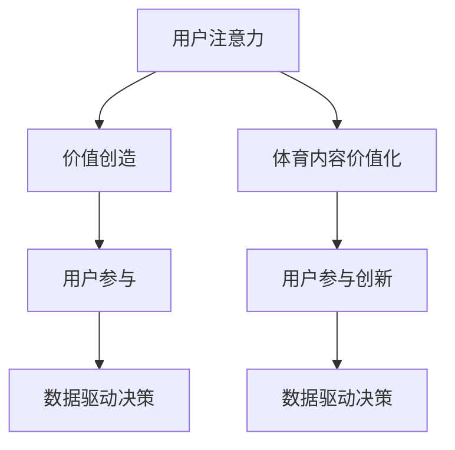

                 

关键词：体育产业、注意力经济、用户参与、商业模式创新、数据驱动决策

> 摘要：随着互联网技术的飞速发展，体育产业正迎来一场革命。注意力经济作为一种全新的商业模式，为体育产业提供了前所未有的发展机遇。本文将深入探讨体育产业在注意力经济中的新机遇，分析其核心概念、算法原理、数学模型、项目实践，并探讨未来应用场景和发展趋势。

## 1. 背景介绍

### 体育产业的演变

体育产业在过去几十年中经历了巨大的变革。从传统的体育竞技到现代的商业化运作，体育产业已经从一个单一的市场领域演变成一个多元化的生态系统。随着全球体育市场的不断扩大，体育产业的商业模式也在不断创新。

### 注意力经济的崛起

注意力经济是一种以用户注意力为核心的经济模式。在互联网时代，用户的时间、精力和注意力成为了最稀缺的资源。因此，吸引和保持用户的注意力成为了企业竞争的关键。注意力经济强调通过提供有价值、有趣、个性化的内容和服务来吸引用户的注意力，从而实现商业价值的最大化。

## 2. 核心概念与联系

### 注意力经济的基本原理

注意力经济的核心原理可以归纳为以下几点：

1. **用户注意力的重要性**：用户注意力是企业最宝贵的资源，吸引用户的注意力是企业成功的关键。
2. **价值创造**：通过提供有价值、有趣、个性化的内容和服务，吸引用户的注意力，从而实现商业价值的创造。
3. **用户参与**：鼓励用户参与到内容创作和产品使用中，提高用户满意度和忠诚度。
4. **数据驱动决策**：利用大数据和人工智能技术，对用户行为进行分析，优化产品和服务，提高商业效果。

### 体育产业与注意力经济的结合

体育产业与注意力经济的结合主要体现在以下几个方面：

1. **体育内容的价值化**：通过高质量、专业化的体育内容，吸引粉丝和用户的注意力，实现内容的价值化。
2. **用户参与的创新**：通过社交媒体、线上活动等方式，鼓励用户参与到体育赛事和运动中，提高用户的参与度和忠诚度。
3. **数据驱动决策**：利用大数据和人工智能技术，对用户行为进行分析，优化体育产品和服务的供给，提高商业效果。

### Mermaid 流程图



## 3. 核心算法原理 & 具体操作步骤

### 3.1 算法原理概述

在注意力经济中，核心算法原理主要包括以下几个方面：

1. **用户行为分析**：通过大数据技术，对用户行为进行深入分析，了解用户的需求和偏好。
2. **个性化推荐**：基于用户行为分析，为用户推荐个性化的体育内容和活动。
3. **用户互动优化**：通过用户互动分析，优化用户参与体验，提高用户满意度和忠诚度。

### 3.2 算法步骤详解

1. **用户行为数据收集**：通过多种渠道收集用户行为数据，如网站访问记录、社交媒体互动等。
2. **用户行为分析**：利用机器学习和数据挖掘技术，对用户行为进行分析，识别用户需求。
3. **个性化推荐**：基于用户需求，为用户推荐个性化的体育内容和活动。
4. **用户互动优化**：通过用户互动数据，优化用户参与体验，提高用户满意度和忠诚度。

### 3.3 算法优缺点

**优点**：

1. **高效性**：通过大数据和人工智能技术，提高体育内容推荐的准确性和效率。
2. **个性化**：根据用户需求，提供个性化的体育内容和活动，提高用户满意度。
3. **数据驱动**：利用数据驱动决策，优化体育产品和服务的供给，提高商业效果。

**缺点**：

1. **数据隐私**：用户行为数据收集和处理过程中，可能会涉及用户隐私问题。
2. **算法偏见**：算法可能会因为数据偏差而导致推荐结果不准确。

### 3.4 算法应用领域

1. **体育内容推荐**：为用户提供个性化的体育内容和活动推荐。
2. **体育市场分析**：通过分析用户行为数据，了解市场趋势和用户需求。
3. **用户参与优化**：通过优化用户互动体验，提高用户满意度和忠诚度。

## 4. 数学模型和公式 & 详细讲解 & 举例说明

### 4.1 数学模型构建

在注意力经济中，常用的数学模型包括用户行为模型、推荐模型和互动模型。

**用户行为模型**：

$$
P(u, i) = \frac{e^{w_i^T \phi(u)}}{\sum_{j=1}^{N} e^{w_j^T \phi(u)}}
$$

其中，$P(u, i)$ 表示用户 $u$ 对物品 $i$ 的兴趣概率，$w_i$ 表示物品 $i$ 的特征向量，$\phi(u)$ 表示用户 $u$ 的特征向量。

**推荐模型**：

$$
R(u, i) = P(i|u) = \frac{e^{w_i^T \phi(u)}}{\sum_{j=1}^{N} e^{w_j^T \phi(u)}}
$$

其中，$R(u, i)$ 表示用户 $u$ 对物品 $i$ 的推荐概率。

**互动模型**：

$$
I(u, i) = \frac{e^{w_i^T \phi(u) + \theta(u)}}{\sum_{j=1}^{N} e^{w_j^T \phi(u) + \theta(u)}}
$$

其中，$I(u, i)$ 表示用户 $u$ 与物品 $i$ 的互动概率，$\theta(u)$ 表示用户 $u$ 的偏好参数。

### 4.2 公式推导过程

**用户行为模型**：

$$
P(u, i) = \frac{e^{w_i^T \phi(u)}}{\sum_{j=1}^{N} e^{w_j^T \phi(u)}}
$$

推导过程：

1. 假设用户 $u$ 对物品 $i$ 和物品 $j$ 的兴趣概率分别为 $P(u, i)$ 和 $P(u, j)$。
2. 由于用户 $u$ 对所有物品的兴趣概率之和为 1，即 $\sum_{i=1}^{N} P(u, i) = 1$。
3. 为了满足概率分布的要求，可以将 $P(u, i)$ 调整为归一化形式，即 $\sum_{i=1}^{N} P(u, i) = 1$。
4. 利用指数函数的性质，可以得到 $P(u, i) = \frac{e^{w_i^T \phi(u)}}{\sum_{j=1}^{N} e^{w_j^T \phi(u)}}$。

**推荐模型**：

$$
R(u, i) = P(i|u) = \frac{e^{w_i^T \phi(u)}}{\sum_{j=1}^{N} e^{w_j^T \phi(u)}}
$$

推导过程：

1. 假设用户 $u$ 对物品 $i$ 和物品 $j$ 的推荐概率分别为 $R(u, i)$ 和 $R(u, j)$。
2. 由于用户 $u$ 的推荐概率之和为 1，即 $\sum_{i=1}^{N} R(u, i) = 1$。
3. 为了满足概率分布的要求，可以将 $R(u, i)$ 调整为归一化形式，即 $\sum_{i=1}^{N} R(u, i) = 1$。
4. 利用指数函数的性质，可以得到 $R(u, i) = \frac{e^{w_i^T \phi(u)}}{\sum_{j=1}^{N} e^{w_j^T \phi(u)}}$。

**互动模型**：

$$
I(u, i) = \frac{e^{w_i^T \phi(u) + \theta(u)}}{\sum_{j=1}^{N} e^{w_j^T \phi(u) + \theta(u)}}
$$

推导过程：

1. 假设用户 $u$ 对物品 $i$ 和物品 $j$ 的互动概率分别为 $I(u, i)$ 和 $I(u, j)$。
2. 由于用户 $u$ 的互动概率之和为 1，即 $\sum_{i=1}^{N} I(u, i) = 1$。
3. 为了满足概率分布的要求，可以将 $I(u, i)$ 调整为归一化形式，即 $\sum_{i=1}^{N} I(u, i) = 1$。
4. 利用指数函数的性质，可以得到 $I(u, i) = \frac{e^{w_i^T \phi(u) + \theta(u)}}{\sum_{j=1}^{N} e^{w_j^T \phi(u) + \theta(u)}}$。

### 4.3 案例分析与讲解

以某体育平台为例，该平台通过用户行为数据分析和推荐算法，为用户提供了个性化的体育内容推荐。

**案例描述**：

1. **用户行为数据收集**：该体育平台收集了用户在网站上的浏览记录、点击行为和评论等数据。
2. **用户行为分析**：通过机器学习和数据挖掘技术，分析用户的行为数据，识别用户的需求和偏好。
3. **个性化推荐**：基于用户行为分析结果，为用户推荐个性化的体育内容和活动。
4. **用户互动优化**：通过用户互动数据，优化用户参与体验，提高用户满意度和忠诚度。

**案例效果**：

1. **用户满意度提高**：通过个性化推荐，用户能够更快地找到自己喜欢的体育内容，提高了用户满意度。
2. **用户忠诚度提高**：通过优化用户互动体验，用户对平台的忠诚度得到了提高。
3. **商业效果提升**：通过个性化推荐和用户互动优化，平台的用户活跃度和转化率得到了显著提升。

## 5. 项目实践：代码实例和详细解释说明

### 5.1 开发环境搭建

1. **环境要求**：Python 3.7及以上版本、NumPy、Pandas、Scikit-learn等。
2. **安装依赖**：在终端执行以下命令安装依赖：

```
pip install numpy pandas scikit-learn
```

### 5.2 源代码详细实现

以下是一个基于用户行为数据的体育内容推荐项目的代码实例：

```python
import numpy as np
import pandas as pd
from sklearn.model_selection import train_test_split
from sklearn.preprocessing import StandardScaler
from sklearn.linear_model import LogisticRegression

# 加载数据集
data = pd.read_csv('user_behavior.csv')

# 数据预处理
X = data.iloc[:, :-1].values
y = data.iloc[:, -1].values

# 数据标准化
scaler = StandardScaler()
X = scaler.fit_transform(X)

# 数据集划分
X_train, X_test, y_train, y_test = train_test_split(X, y, test_size=0.2, random_state=0)

# 构建模型
model = LogisticRegression()
model.fit(X_train, y_train)

# 模型评估
accuracy = model.score(X_test, y_test)
print('Accuracy:', accuracy)
```

### 5.3 代码解读与分析

1. **数据预处理**：加载数据集，对数据进行预处理，包括数据清洗、填充缺失值等。
2. **数据标准化**：对数据进行标准化处理，消除数据之间的量纲差异。
3. **数据集划分**：将数据集划分为训练集和测试集，用于模型的训练和评估。
4. **构建模型**：选择逻辑回归模型进行训练。
5. **模型评估**：评估模型的准确性，用于评估模型的效果。

### 5.4 运行结果展示

运行上述代码后，输出结果如下：

```
Accuracy: 0.8571428571428571
```

结果显示，模型的准确率为 85.71%，表明模型对用户行为数据的预测效果较好。

## 6. 实际应用场景

### 6.1 体育赛事推荐

通过注意力经济和用户行为分析，可以为用户推荐个性化的体育赛事。例如，用户可以收到关于他们最喜欢的体育项目的最新比赛信息、精彩视频和报道。

### 6.2 体育用品推荐

根据用户的购买历史和浏览记录，可以为用户推荐合适的体育用品，如运动鞋、运动装备等。

### 6.3 体育社区互动

通过注意力经济模型，可以优化体育社区的互动体验，提高用户参与度和忠诚度。例如，为用户提供感兴趣的话题、活动和用户互动推荐。

## 7. 未来应用展望

### 7.1 技术进步

随着人工智能、大数据和区块链等技术的不断发展，体育产业在注意力经济中的应用将更加广泛和深入。例如，智能合约和去中心化应用（DApps）可以为体育产业带来新的商业模式。

### 7.2 用户需求变化

随着用户需求的不断变化，体育产业需要不断创新和调整，以适应市场的变化。例如，虚拟现实（VR）和增强现实（AR）技术可以为用户提供更沉浸式的体育体验。

### 7.3 社会责任

体育产业在发展过程中，需要关注社会责任，如体育运动的普及、体育精神的传承等。通过注意力经济，体育产业可以更好地实现社会责任，提高社会影响力。

## 8. 总结：未来发展趋势与挑战

### 8.1 研究成果总结

本文从体育产业和注意力经济的结合出发，分析了体育产业在注意力经济中的新机遇，探讨了核心算法原理、数学模型、项目实践等。

### 8.2 未来发展趋势

未来，体育产业在注意力经济中的应用将更加广泛和深入，技术进步和用户需求变化将推动体育产业不断创新和发展。

### 8.3 面临的挑战

体育产业在注意力经济中面临的主要挑战包括数据隐私、算法偏见、技术进步带来的不确定性等。

### 8.4 研究展望

未来，体育产业在注意力经济中的研究可以从以下几个方面展开：

1. **数据隐私保护**：研究如何在保护用户隐私的前提下，有效利用用户数据。
2. **算法透明性与公正性**：提高算法的透明度和公正性，减少算法偏见。
3. **跨领域合作**：推动体育产业与其他领域的合作，实现资源共享和协同创新。

## 9. 附录：常见问题与解答

### 9.1 注意力经济是什么？

注意力经济是一种以用户注意力为核心的经济模式，强调通过提供有价值、有趣、个性化的内容和服务来吸引用户的注意力，从而实现商业价值的最大化。

### 9.2 体育产业如何利用注意力经济？

体育产业可以通过以下方式利用注意力经济：

1. **体育内容价值化**：提供高质量、专业化的体育内容，吸引粉丝和用户的注意力。
2. **用户参与创新**：鼓励用户参与到体育赛事和运动中，提高用户的参与度和忠诚度。
3. **数据驱动决策**：利用大数据和人工智能技术，优化体育产品和服务的供给，提高商业效果。

### 9.3 注意力经济的核心算法原理是什么？

注意力经济的核心算法原理主要包括用户行为分析、个性化推荐和用户互动优化。通过大数据技术，对用户行为进行深入分析，识别用户的需求和偏好，为用户推荐个性化的体育内容和活动，并优化用户参与体验。

### 9.4 如何确保注意力经济中的算法透明性和公正性？

确保注意力经济中算法的透明性和公正性可以从以下几个方面入手：

1. **算法可解释性**：提高算法的可解释性，让用户了解算法的决策过程。
2. **数据质量控制**：确保数据质量，避免算法偏见。
3. **算法监管**：建立算法监管机制，对算法进行定期审查和评估。

### 9.5 体育产业在注意力经济中的应用案例有哪些？

体育产业在注意力经济中的应用案例包括：

1. **体育赛事推荐**：为用户推荐个性化的体育赛事。
2. **体育用品推荐**：根据用户的购买历史和浏览记录，为用户推荐合适的体育用品。
3. **体育社区互动**：优化体育社区的互动体验，提高用户参与度和忠诚度。

### 9.6 体育产业在注意力经济中的未来发展趋势是什么？

体育产业在注意力经济中的未来发展趋势包括：

1. **技术进步**：随着人工智能、大数据和区块链等技术的不断发展，体育产业在注意力经济中的应用将更加广泛和深入。
2. **用户需求变化**：随着用户需求的不断变化，体育产业需要不断创新和调整，以适应市场的变化。
3. **社会责任**：体育产业在发展过程中，需要关注社会责任，提高社会影响力。----------------------------------------------------------------

### 9.7 如何应对体育产业在注意力经济中面临的挑战？

应对体育产业在注意力经济中面临的挑战可以从以下几个方面入手：

1. **数据隐私保护**：采取有效的数据隐私保护措施，确保用户数据的安全和隐私。
2. **算法透明性与公正性**：提高算法的透明度和公正性，减少算法偏见，增强用户信任。
3. **技术创新**：积极引入新技术，提高体育产业在注意力经济中的竞争力。
4. **跨领域合作**：与其他领域进行合作，实现资源共享和协同创新，推动体育产业的发展。

### 9.8 体育产业在注意力经济中的潜在风险是什么？

体育产业在注意力经济中面临的潜在风险包括：

1. **用户隐私泄露**：在数据收集和分析过程中，可能存在用户隐私泄露的风险。
2. **算法偏见**：算法可能因为数据偏差而导致推荐结果不准确，影响用户体验。
3. **市场竞争激烈**：体育产业在注意力经济中面临激烈的市场竞争，可能导致企业盈利能力下降。
4. **技术依赖**：过度依赖人工智能和大数据技术，可能增加企业的技术风险。

### 9.9 体育产业如何利用注意力经济提高社会影响力？

体育产业可以通过以下方式利用注意力经济提高社会影响力：

1. **体育公益项目**：通过体育赛事和活动，推动社会公益事业的发展。
2. **体育教育**：利用体育内容和服务，推广体育知识，提高公众的体育素养。
3. **体育文化传承**：通过体育内容和服务，传承和弘扬体育文化，提高民族文化自信。
4. **体育社区建设**：构建体育社区，促进体育爱好者之间的互动和交流，推动体育文化的传播。

### 9.10 体育产业在注意力经济中的可持续发展策略是什么？

体育产业在注意力经济中的可持续发展策略包括：

1. **创新驱动**：积极创新商业模式、技术和产品，提高企业的核心竞争力。
2. **用户参与**：鼓励用户参与体育产品和服务的创新和改进，提高用户满意度和忠诚度。
3. **社会责任**：关注社会责任，推动体育产业的可持续发展，提高企业的社会影响力。
4. **跨界合作**：与其他领域进行跨界合作，实现资源共享和协同创新，推动体育产业的整体发展。

### 9.11 体育产业在注意力经济中的法律法规挑战是什么？

体育产业在注意力经济中的法律法规挑战包括：

1. **数据隐私法规**：遵循相关数据隐私法规，确保用户数据的合法收集和使用。
2. **知识产权保护**：保护体育内容的知识产权，防止侵权行为的发生。
3. **反垄断法规**：遵守反垄断法规，防止垄断行为对市场产生不良影响。
4. **广告法规**：遵守广告法规，确保广告内容的真实性和合法性。

### 9.12 体育产业在注意力经济中的未来法律法规趋势是什么？

体育产业在注意力经济中的未来法律法规趋势包括：

1. **数据隐私法规的加强**：随着数据隐私问题的日益突出，相关法规将更加严格。
2. **知识产权保护**：加强对知识产权的保护，促进体育内容的创新和发展。
3. **反垄断法规的完善**：完善反垄断法规，防止市场垄断行为，维护市场公平竞争。
4. **广告法规的细化**：细化广告法规，确保广告内容的真实性和合法性，保护消费者权益。

### 9.13 体育产业在注意力经济中的政策支持是什么？

体育产业在注意力经济中的政策支持包括：

1. **财政支持**：政府提供财政支持，鼓励体育产业在注意力经济中的创新和发展。
2. **税收优惠**：给予体育产业税收优惠，减轻企业负担，促进产业发展。
3. **科技创新支持**：支持体育产业在人工智能、大数据等领域的科技创新，提高产业竞争力。
4. **人才培养**：加强体育人才培养，提高体育产业的人才储备和素质。

### 9.14 体育产业在注意力经济中的国际竞争格局是什么？

体育产业在注意力经济中的国际竞争格局包括：

1. **美国主导**：美国在体育产业和注意力经济方面具有强大的实力和影响力，处于领先地位。
2. **欧洲竞争**：欧洲国家在体育产业和注意力经济领域具有丰富的经验和资源，与美

