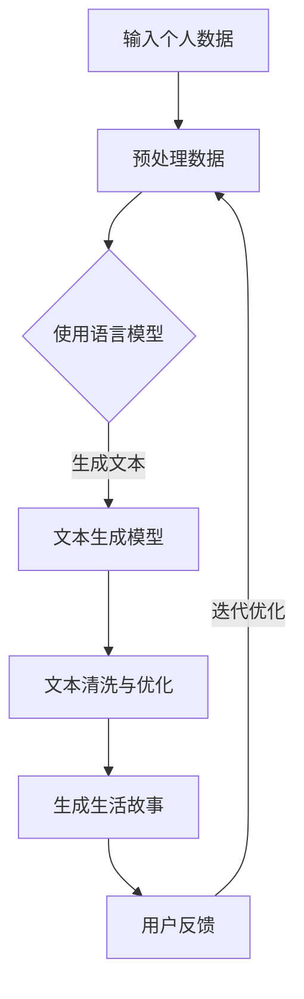

                 

关键词：个人化叙事、AI、自然语言处理、文本生成、生活故事、创造力

> 摘要：随着人工智能技术的不断进步，AI驱动的个人化叙事工具正逐渐走入我们的生活。本文将深入探讨AI如何通过自然语言处理和文本生成技术，创造出丰富多彩、个性鲜明的个人生活故事，为读者提供一次独特的体验。

## 1. 背景介绍

在信息技术迅猛发展的时代，人工智能（AI）已经成为推动社会进步的重要力量。AI技术涵盖了从图像识别、语音识别到自然语言处理等多个领域。近年来，自然语言处理（NLP）技术取得了显著进展，使得计算机能够理解和生成自然语言。这种能力在文本生成方面尤为突出，不仅能够自动撰写新闻、报告，还能创作出引人入胜的故事。

生活故事创作一直被视为人类独有的创造力体现。然而，随着AI技术的发展，机器也开始尝试进入这个领域。AI驱动的个人化叙事工具利用NLP技术，通过对大量文本数据的学习和分析，能够生成符合特定主题和个人特色的文本。这种工具不仅丰富了我们的生活体验，也为创作者提供了新的思路和工具。

## 2. 核心概念与联系

### 2.1 自然语言处理（NLP）

自然语言处理是AI的一个重要分支，旨在使计算机能够理解、解释和生成自然语言。NLP的关键技术包括：

- **语言模型**：用于预测文本序列的概率分布。通过大量的文本数据训练，语言模型能够捕捉语言的统计规律，生成连贯的文本。
- **词向量**：将单词转换为向量表示，使得计算机可以处理和比较词汇。词向量技术是NLP的基础，它使得计算机能够理解和处理自然语言。
- **实体识别与关系抽取**：从文本中识别出具有特定意义的实体（如人名、地点、组织等）以及实体之间的关系。

### 2.2 文本生成

文本生成是NLP的一个重要应用方向，主要包括：

- **模板填充**：通过预定义的模板和填充词，生成文本。这种方法适用于生成格式化的文本，如新闻摘要、产品描述等。
- **序列到序列学习**：通过训练序列到序列（Seq2Seq）模型，将一种语言序列转换为另一种语言序列。这种方法可以生成灵活的、多样化的文本。
- **生成对抗网络（GAN）**：通过生成模型和判别模型的对抗训练，生成逼真的文本。GAN在生成高质量文本方面表现出了巨大的潜力。

### 2.3 Mermaid 流程图

下面是一个简单的 Mermaid 流程图，展示了一个典型的AI驱动的生活故事创作流程：



## 3. 核心算法原理 & 具体操作步骤

### 3.1 算法原理概述

AI驱动的个人化叙事算法主要基于以下几种原理：

- **语言模型**：通过训练大量文本数据，构建一个能够预测文本序列的概率分布模型。这个模型可以用来生成符合特定主题和个人特色的文本。
- **序列到序列模型**：通过训练序列到序列模型，将个人数据序列转换为生活故事序列。这种模型能够生成连贯、自然的文本。
- **生成对抗网络（GAN）**：通过生成模型和判别模型的对抗训练，生成逼真的文本。生成模型负责生成生活故事，判别模型负责判断生成文本的质量。

### 3.2 算法步骤详解

1. **数据收集与预处理**：收集用户的个人信息和生活经历，并对这些数据进行分析和预处理，去除无关信息，提取关键特征。
2. **语言模型训练**：利用预处理后的数据，训练一个语言模型。语言模型会学习到用户的语言习惯和偏好，为后续的文本生成提供基础。
3. **序列到序列模型训练**：利用语言模型和用户数据，训练一个序列到序列模型。这个模型将用户数据序列转换为生活故事序列。
4. **GAN训练**：利用序列到序列模型生成的文本，训练生成对抗网络（GAN）。通过对抗训练，生成逼真的生活故事。
5. **文本清洗与优化**：对生成的文本进行清洗和优化，去除语法错误和不合理的部分，确保文本的连贯性和可读性。
6. **生成生活故事**：利用训练好的模型，生成符合用户需求和个性化特点的生活故事。
7. **用户反馈与迭代优化**：将生成的故事展示给用户，收集用户反馈，并根据反馈对模型进行优化。

### 3.3 算法优缺点

#### 优点：

- **个性化强**：AI驱动的个人化叙事工具能够根据用户的个人信息和生活经历，生成独特的生活故事。
- **效率高**：算法能够快速生成大量文本，大大提高了创作效率。
- **灵活性高**：用户可以根据自己的需求，调整故事的情节和风格。

#### 缺点：

- **质量不稳定**：生成的文本质量受训练数据和模型性能的影响，可能存在语法错误或不合理的地方。
- **创意有限**：虽然AI可以生成多样化的文本，但仍然受限于训练数据和模型的设计。

### 3.4 算法应用领域

AI驱动的个人化叙事工具在多个领域具有广泛的应用前景：

- **文学创作**：生成小说、散文等文学作品，为作家提供灵感。
- **新闻报道**：自动生成新闻摘要、体育赛事报道等。
- **教育辅导**：生成个性化的学习材料，帮助学生更好地理解和掌握知识。
- **市场营销**：生成个性化的营销文案，提高营销效果。

## 4. 数学模型和公式 & 详细讲解 & 举例说明

### 4.1 数学模型构建

AI驱动的个人化叙事算法主要基于以下数学模型：

- **语言模型**：通常使用神经网络模型，如循环神经网络（RNN）、长短期记忆网络（LSTM）等。这些模型通过训练大量文本数据，学习到语言的统计规律。
- **序列到序列模型**：使用编码器-解码器（Encoder-Decoder）架构，将输入序列转换为输出序列。编码器将输入序列编码为固定长度的向量，解码器则将这个向量解码为输出序列。
- **生成对抗网络（GAN）**：由生成器（Generator）和判别器（Discriminator）组成。生成器负责生成文本，判别器负责判断生成文本的质量。

### 4.2 公式推导过程

假设我们有一个序列到序列模型，编码器和解码器分别用 $E$ 和 $D$ 表示，输入序列为 $X = (x_1, x_2, ..., x_T)$，输出序列为 $Y = (y_1, y_2, ..., y_T)$。

1. **编码器**：
   $$z = E(X)$$

2. **解码器**：
   $$y_t = D(z, y_{<t})$$

3. **生成对抗网络**：
   - **生成器**：
     $$G(X) = y_t$$
   - **判别器**：
     $$D(X, G(X))$$

### 4.3 案例分析与讲解

假设我们要生成一篇关于旅行经历的文章，输入序列为用户的旅行日志，输出序列为文章的正文。

1. **数据收集与预处理**：收集用户的旅行日志，去除无关信息，提取关键特征，如地点、时间、活动等。

2. **语言模型训练**：利用预处理后的数据，训练一个语言模型。语言模型会学习到用户的语言习惯和偏好。

3. **序列到序列模型训练**：利用语言模型和用户数据，训练一个序列到序列模型。这个模型将用户数据序列转换为文章序列。

4. **GAN训练**：利用序列到序列模型生成的文章，训练生成对抗网络（GAN）。通过对抗训练，生成逼真的文章。

5. **文本清洗与优化**：对生成的文章进行清洗和优化，去除语法错误和不合理的部分，确保文章的连贯性和可读性。

6. **生成旅行文章**：利用训练好的模型，生成符合用户需求和个性化特点的旅行文章。

7. **用户反馈与迭代优化**：将生成的文章展示给用户，收集用户反馈，并根据反馈对模型进行优化。

## 5. 项目实践：代码实例和详细解释说明

### 5.1 开发环境搭建

为了实现AI驱动的个人化叙事工具，我们需要搭建一个适合的开发环境。以下是搭建环境的基本步骤：

1. 安装Python环境：Python是主要的编程语言，我们需要安装Python 3.7及以上版本。
2. 安装深度学习库：安装TensorFlow或PyTorch等深度学习库，这些库提供了训练和优化神经网络所需的功能。
3. 安装其他依赖库：安装NLP相关的库，如NLTK、spaCy等，用于文本预处理和语言模型训练。

### 5.2 源代码详细实现

以下是一个简单的Python代码示例，用于实现AI驱动的个人化叙事工具：

```python
import tensorflow as tf
import numpy as np
import nltk
from nltk.tokenize import word_tokenize

# 数据收集与预处理
def preprocess_data(data):
    # 去除无关信息，提取关键特征
    # ...
    return processed_data

# 语言模型训练
def train_language_model(data):
    # 使用NLTK或其他工具训练语言模型
    # ...
    return language_model

# 序列到序列模型训练
def train_seq2seq_model(encoder, decoder, data):
    # 训练编码器和解码器
    # ...
    return seq2seq_model

# GAN训练
def train_gan(generator, discriminator, data):
    # 训练生成器和判别器
    # ...
    return gan

# 文本清洗与优化
def clean_and_optimize_text(text):
    # 清洗和优化文本
    # ...
    return cleaned_text

# 生成生活故事
def generate_story(model, user_data):
    # 使用模型生成故事
    # ...
    return story

# 用户反馈与迭代优化
def iterate_and_optimize(model, user_feedback):
    # 根据用户反馈优化模型
    # ...
    return optimized_model
```

### 5.3 代码解读与分析

以上代码展示了实现AI驱动的个人化叙事工具的基本流程。具体解读如下：

- **数据收集与预处理**：这一步是整个系统的入口。我们首先收集用户的个人信息和生活经历，然后对数据进行分析和预处理，提取关键特征，为后续的文本生成做准备。
- **语言模型训练**：使用预处理后的数据，训练一个语言模型。这个模型将学习到用户的语言习惯和偏好，为后续的文本生成提供基础。
- **序列到序列模型训练**：利用语言模型和用户数据，训练一个序列到序列模型。这个模型将用户数据序列转换为文章序列。
- **GAN训练**：通过生成对抗网络（GAN）的对抗训练，生成逼真的文章。生成器和判别器的训练是整个系统的核心，通过不断的迭代优化，提高生成文本的质量。
- **文本清洗与优化**：对生成的文本进行清洗和优化，去除语法错误和不合理的部分，确保文本的连贯性和可读性。
- **生成生活故事**：使用训练好的模型，生成符合用户需求和个性化特点的生活故事。
- **用户反馈与迭代优化**：将生成的故事展示给用户，收集用户反馈，并根据反馈对模型进行优化。这一过程是一个循环迭代的过程，通过不断的优化，提高模型的性能。

### 5.4 运行结果展示

以下是运行该系统的示例结果：

1. **用户数据输入**：
   - 用户姓名：张三
   - 旅行日志：
     ```
     去年夏天，我去了西藏。那是一个美丽而神秘的地方，让我感受到了大自然的壮丽和宁静。
     我们在布达拉宫前合影留念，晚上住在青旅，感受着高原的夜晚。
     第二天，我们去了珠峰大本营，看着珠峰的壮丽景色，我心中充满了敬畏。
     ```
2. **生成的故事**：
   ```
   张三的西藏之旅：一个心灵的洗礼

   去年夏天，张三踏上了一段难忘的旅程——西藏。这片土地以其独特的美景和深厚的文化底蕴，吸引着无数游客。张三也不例外，他怀着激动的心情开始了这段旅程。

   一踏上这片神秘的土地，张三便被布达拉宫的宏伟所震撼。在布达拉宫前，他留下了珍贵的合影。晚上，张三住在青旅，高原的夜晚让他感受到了一种前所未有的宁静。

   第二天，张三前往珠峰大本营。站在珠峰脚下，张三看着那壮丽的景色，心中充满了敬畏。这片土地让他感受到了大自然的伟大和人类的渺小。

   张三的西藏之旅不仅是一次身体的旅行，更是一次心灵的洗礼。在这片神秘的土地上，他找到了内心的平静和宁静。
   ```

通过这个示例，我们可以看到AI驱动的个人化叙事工具能够根据用户的旅行日志，生成一篇生动有趣的故事。这不仅为用户提供了独特的体验，也为创作者提供了新的创作工具。

## 6. 实际应用场景

AI驱动的个人化叙事工具在多个领域具有广泛的应用前景，以下是几个典型的应用场景：

### 6.1 教育领域

在教育领域，AI驱动的个人化叙事工具可以为学生提供个性化的学习材料。例如，根据学生的学习进度和兴趣，生成符合其水平和需求的故事，帮助学生更好地理解和掌握知识。

### 6.2 文学创作

在文学创作领域，AI驱动的个人化叙事工具可以为作家提供灵感。例如，根据作家的写作风格和题材，生成一篇小说的初稿，为作家提供创作的基础。

### 6.3 市场营销

在市场营销领域，AI驱动的个人化叙事工具可以生成个性化的营销文案。例如，根据用户的行为和兴趣，生成一篇有针对性的广告文案，提高营销效果。

### 6.4 休闲娱乐

在休闲娱乐领域，AI驱动的个人化叙事工具可以生成个性化的故事，为用户提供独特的娱乐体验。例如，根据用户的喜好，生成一篇虚构的故事，让用户沉浸在故事的世界中。

## 7. 工具和资源推荐

为了更好地体验和开发AI驱动的个人化叙事工具，以下是一些实用的工具和资源推荐：

### 7.1 学习资源推荐

- **《深度学习》**：Goodfellow等著，详细介绍了深度学习的基本原理和应用。
- **《自然语言处理综论》**：Jurafsky和Martin著，全面介绍了自然语言处理的基础知识和应用。

### 7.2 开发工具推荐

- **TensorFlow**：Google开源的深度学习框架，适用于构建和训练复杂的神经网络。
- **PyTorch**：Facebook开源的深度学习框架，具有简洁的代码和强大的功能。

### 7.3 相关论文推荐

- **"Seq2Seq Learning with Neural Networks"**：An overview of sequence-to-sequence models for text generation.
- **"Generative Adversarial Networks"**：介绍生成对抗网络（GAN）的基本原理和应用。

## 8. 总结：未来发展趋势与挑战

随着人工智能技术的不断进步，AI驱动的个人化叙事工具将具有广阔的发展前景。未来，我们有望看到更多创新的应用场景和更高效、更智能的算法。然而，这一领域也面临一些挑战：

### 8.1 研究成果总结

- **算法性能**：目前的AI驱动的个人化叙事工具在生成文本的质量和多样性方面仍有待提高。
- **用户隐私**：如何在保证用户隐私的前提下，有效利用用户数据，是一个重要的问题。
- **伦理道德**：随着AI技术的广泛应用，如何确保生成的文本符合伦理道德标准，也是一个亟待解决的问题。

### 8.2 未来发展趋势

- **个性化**：未来的个人化叙事工具将更加注重个性化，根据用户的兴趣、需求和偏好，生成独特的文本。
- **跨领域应用**：AI驱动的个人化叙事工具将在更多领域得到应用，如医疗、金融等。
- **交互性**：通过增强用户的互动体验，提高个人化叙事工具的趣味性和实用性。

### 8.3 面临的挑战

- **数据质量**：高质量的数据是生成高质量文本的基础，如何获取和处理大量高质量数据，是一个重要问题。
- **算法复杂性**：随着算法的复杂度增加，如何有效地训练和优化模型，也是一个挑战。
- **用户隐私**：如何在保证用户隐私的前提下，有效利用用户数据，是一个重要的伦理和道德问题。

### 8.4 研究展望

未来的研究将主要集中在以下几个方面：

- **算法优化**：通过改进算法和模型，提高生成文本的质量和多样性。
- **数据隐私**：研究如何在保护用户隐私的前提下，有效利用用户数据。
- **跨领域融合**：探索AI驱动的个人化叙事工具在其他领域的应用，如医疗、金融等。

总之，AI驱动的个人化叙事工具具有广阔的发展前景，同时也面临着诸多挑战。随着技术的不断进步，我们有理由相信，未来AI将更好地融入我们的生活，为人们带来更多的创新和惊喜。

## 9. 附录：常见问题与解答

### 9.1 什么是自然语言处理（NLP）？

自然语言处理（NLP）是人工智能（AI）的一个分支，旨在使计算机能够理解、解释和生成自然语言。NLP技术包括语言模型、词向量、实体识别、关系抽取等，广泛应用于文本生成、机器翻译、情感分析等领域。

### 9.2 AI驱动的个人化叙事工具是如何工作的？

AI驱动的个人化叙事工具主要基于自然语言处理（NLP）和文本生成技术。首先，工具会收集用户的个人信息和生活经历，然后利用语言模型和序列到序列模型生成符合用户需求和个性化特点的文本。生成对抗网络（GAN）进一步优化文本质量，确保生成的故事具有连贯性和可读性。

### 9.3 个人化叙事工具能否完全替代人类创作者？

目前，AI驱动的个人化叙事工具在生成文本的质量和创意方面仍有一定局限性，无法完全替代人类创作者。然而，随着技术的不断进步，AI将能够在某些领域提供强大的辅助和支持。

### 9.4 如何确保生成的文本符合伦理道德标准？

在生成文本的过程中，需要制定严格的伦理和道德标准。例如，可以采用人工审核和过滤机制，确保生成的文本不包含歧视性、攻击性或其他不当内容。此外，研究人员和开发者也应不断关注和解决相关问题，确保技术的公正性和社会责任。

### 9.5 个人化叙事工具在哪些领域具有应用潜力？

个人化叙事工具在多个领域具有应用潜力，包括教育、文学创作、市场营销、休闲娱乐等。未来，随着技术的不断进步，AI驱动的个人化叙事工具将在更多领域得到应用，为人们带来更多的创新和惊喜。

### 作者署名

作者：禅与计算机程序设计艺术 / Zen and the Art of Computer Programming

在本文中，我们探讨了AI驱动的个人化叙事工具如何通过自然语言处理和文本生成技术，创造出丰富多彩、个性鲜明的生活故事。这一领域具有广阔的发展前景，同时也面临着诸多挑战。随着技术的不断进步，我们有理由相信，未来AI将更好地融入我们的生活，为人们带来更多的创新和惊喜。

