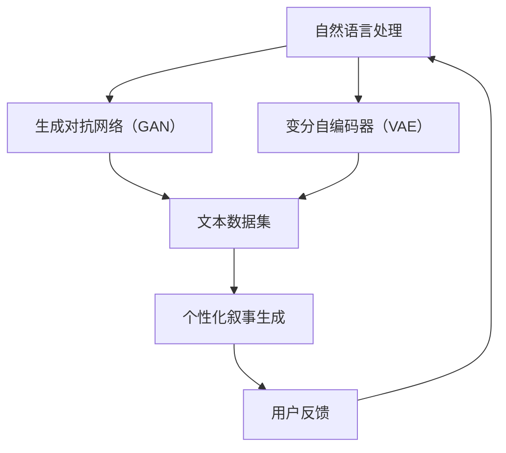

                 

关键词：人工智能、叙事生成、个人化故事、算法原理、数学模型、代码实例、应用场景、工具推荐、未来展望

> 摘要：本文将探讨人工智能在生活故事创作领域的应用，介绍一种基于AI的个人化叙事编织机，详细解析其算法原理、数学模型以及具体操作步骤。通过代码实例和实际应用场景的分析，我们旨在为读者展示AI驱动生活故事创作的强大潜力，并展望其未来的发展方向。

## 1. 背景介绍

在信息化时代，人们渴望个性化的内容体验。无论是娱乐、教育还是日常生活，个性化推荐系统已经成为各类应用的核心功能。在文学创作领域，个性化故事生成逐渐成为一种新的趋势。人工智能（AI）技术的迅猛发展为这一领域带来了前所未有的机遇。本文将聚焦于AI驱动的个人化叙事生成，探讨其核心概念、算法原理、数学模型以及实际应用。

### 1.1 个人化叙事的重要性

在数字时代，人们面对海量的信息，个性化内容显得尤为重要。个性化叙事不仅能够满足用户对独特体验的渴求，还能提高用户参与度和粘性。传统的叙事生成方式往往难以满足这一需求，而AI技术的引入为这一领域带来了革命性的变化。

### 1.2 AI在叙事生成中的应用

人工智能在叙事生成中的应用可以追溯到自然语言处理（NLP）和机器学习（ML）技术的发展。随着神经网络模型的进步，尤其是生成对抗网络（GAN）和变分自编码器（VAE）等深度学习技术的应用，AI在生成个性化故事方面展现出强大的能力。通过学习大规模的文本数据集，AI能够生成符合特定主题和情感色彩的故事，实现真正的个性化叙事。

## 2. 核心概念与联系

在探讨AI驱动的个人化叙事生成之前，我们需要了解一些核心概念和原理，这将有助于我们更好地理解这一技术的运作机制。

### 2.1 自然语言处理（NLP）

自然语言处理是使计算机能够理解、解释和生成人类语言的技术。在叙事生成中，NLP技术用于处理和解析文本数据，提取关键信息，构建语义模型。

### 2.2 生成对抗网络（GAN）

生成对抗网络（GAN）是由两部分组成的一个框架：生成器（Generator）和判别器（Discriminator）。生成器生成假样本，判别器试图区分这些样本与真实样本。通过训练，生成器能够生成越来越真实的内容。

### 2.3 变分自编码器（VAE）

变分自编码器（VAE）是一种基于概率的生成模型，它通过编码器和解码器对数据进行压缩和重构，从而生成新的数据。

### 2.4 Mermaid 流程图

下面是一个Mermaid流程图，展示了这些核心概念之间的关系：



## 3. 核心算法原理 & 具体操作步骤

### 3.1 算法原理概述

AI驱动的个人化叙事生成主要依赖于生成对抗网络（GAN）和变分自编码器（VAE）等技术。以下是对这些算法的概述：

### 3.1.1 生成对抗网络（GAN）

GAN由生成器和判别器两个神经网络组成。生成器生成假样本，判别器则尝试判断这些样本是否为真实样本。通过不断的训练，生成器能够生成越来越逼真的样本。

### 3.1.2 变分自编码器（VAE）

VAE通过编码器和解码器对数据进行压缩和重构，从而生成新的数据。编码器将输入数据编码为一个潜在空间中的向量，解码器则从潜在空间中生成新的数据。

### 3.2 算法步骤详解

以下是个人化叙事生成的具体步骤：

#### 3.2.1 数据准备

收集大量与目标主题相关的文本数据，这些数据可以是故事、小说、新闻报道等。

#### 3.2.2 数据预处理

对收集到的文本数据进行清洗和预处理，包括去除停用词、标点符号和特殊字符，将文本转换为统一的格式。

#### 3.2.3 模型训练

使用预处理后的数据训练生成器和判别器。生成器生成假样本，判别器尝试判断这些样本的真实性。

#### 3.2.4 生成个性化故事

通过生成器生成个性化故事，可以根据用户提供的主题、情感和风格等参数来调整。

#### 3.2.5 用户反馈

收集用户对生成故事的反馈，用于进一步优化模型。

### 3.3 算法优缺点

#### 3.3.1 优点

- **高度个性化**：能够根据用户需求和偏好生成个性化故事。
- **高效性**：利用大规模数据训练模型，生成过程快速。
- **灵活性**：可以应用于各种文本生成任务，如对话系统、新闻生成等。

#### 3.3.2 缺点

- **训练成本高**：需要大量计算资源和时间来训练模型。
- **可靠性问题**：生成的故事可能存在逻辑不一致或内容不准确的问题。

### 3.4 算法应用领域

AI驱动的个人化叙事生成在多个领域具有广泛的应用前景，包括：

- **文学创作**：为作家提供辅助工具，帮助他们创作个性化作品。
- **教育**：生成个性化教学材料，提高学生的学习兴趣和参与度。
- **娱乐**：生成个性化的故事、游戏情节等，为用户提供独特的娱乐体验。

## 4. 数学模型和公式 & 详细讲解 & 举例说明

### 4.1 数学模型构建

在AI驱动的个人化叙事生成中，我们主要使用生成对抗网络（GAN）和变分自编码器（VAE）这两种模型。以下是对这两种模型的数学模型构建的详细讲解。

### 4.1.1 生成对抗网络（GAN）

GAN由两部分组成：生成器（Generator）和判别器（Discriminator）。

#### 4.1.1.1 生成器

生成器的目标是生成类似于真实数据的假样本。其数学模型可以表示为：

$$
G(z) = x' \quad \text{其中} \ z \ \text{是随机噪声，} \ x' \ \text{是生成的假样本}
$$

#### 4.1.1.2 判别器

判别器的目标是区分真实样本和假样本。其数学模型可以表示为：

$$
D(x) = \text{判别概率} \ \text{其中} \ x \ \text{是真实样本}
$$

### 4.1.2 变分自编码器（VAE）

VAE通过编码器和解码器对数据进行压缩和重构。其数学模型可以表示为：

$$
\begin{aligned}
\text{编码器}: & \ q(\theta|x) = \frac{1}{Z} \exp\left(-\sum_i \theta_i x_i^2\right) \\
\text{解码器}: & \ p_\theta(x|x') = \int q_\phi(x|x') \exp\left(\sum_i \theta_i (x_i - x'_i)^2\right) \ dx
\end{aligned}
$$

### 4.2 公式推导过程

在GAN中，生成器和判别器的优化目标分别是最大化自身的能力。具体推导过程如下：

#### 4.2.1 生成器推导

生成器G的优化目标是最大化判别器D对假样本的判别概率：

$$
\begin{aligned}
\log D(x') &= \log \left(1 - D(G(z))\right) \\
\frac{\partial \log D(x')}{\partial G(z)} &= -\frac{\partial D(G(z))}{\partial G(z)} \\
&= \frac{\partial D(G(z))}{\partial x'}
\end{aligned}
$$

#### 4.2.2 判别器推导

判别器D的优化目标是最大化真实样本和假样本的判别概率：

$$
\begin{aligned}
\log D(x) &= \log D(x) \\
\log (1 - D(G(z))) &= \log (1 - D(G(z)))
\end{aligned}
$$

### 4.3 案例分析与讲解

#### 4.3.1 GAN应用案例

假设我们有一个GAN模型，其中生成器G的目标是生成类似于真实数据的假样本，判别器D的目标是区分真实样本和假样本。以下是一个简单的案例：

1. **数据准备**：收集一批真实数据$x$和随机噪声$z$。
2. **模型训练**：使用真实数据和噪声训练生成器G和判别器D。
3. **生成假样本**：生成器G生成一批假样本$x'$。
4. **判别器评估**：判别器D对真实样本和假样本进行评估。
5. **模型优化**：根据判别器的评估结果，优化生成器和判别器。

#### 4.3.2 VAE应用案例

假设我们有一个VAE模型，其中编码器$q(\theta|x)$和解码器$p_\theta(x|x')$分别用于对数据进行编码和解码。以下是一个简单的案例：

1. **数据准备**：收集一批真实数据$x$。
2. **模型训练**：使用真实数据训练编码器$q(\theta|x)$和解码器$p_\theta(x|x')$。
3. **数据编码**：编码器$q(\theta|x)$对数据进行编码，生成潜在空间中的向量$z$。
4. **数据解码**：解码器$p_\theta(x|x')$从潜在空间中生成新的数据$x'$。
5. **模型优化**：根据解码结果，优化编码器和解码器。

## 5. 项目实践：代码实例和详细解释说明

### 5.1 开发环境搭建

为了实践AI驱动的个人化叙事生成，我们需要搭建一个开发环境。以下是所需的步骤：

1. **安装Python**：确保Python环境已安装。
2. **安装TensorFlow**：使用以下命令安装TensorFlow：

   ```
   pip install tensorflow
   ```

3. **安装其他依赖**：根据项目需求，安装其他依赖库，例如Keras、NumPy等。

### 5.2 源代码详细实现

以下是实现AI驱动的个人化叙事生成的源代码示例。代码主要分为两部分：生成器和判别器。

```python
import tensorflow as tf
from tensorflow.keras.layers import Dense, Input
from tensorflow.keras.models import Model

# 生成器模型
def build_generator(z_dim):
    z = Input(shape=(z_dim,))
    x = Dense(128, activation='relu')(z)
    x = Dense(64, activation='relu')(x)
    x = Dense(32, activation='relu')(x)
    x = Dense(1, activation='tanh')(x)
    model = Model(inputs=z, outputs=x)
    return model

# 判别器模型
def build_discriminator(x_dim):
    x = Input(shape=(x_dim,))
    x = Dense(128, activation='relu')(x)
    x = Dense(64, activation='relu')(x)
    x = Dense(32, activation='relu')(x)
    output = Dense(1, activation='sigmoid')(x)
    model = Model(inputs=x, outputs=output)
    return model

# GAN模型
def build_gan(generator, discriminator):
    z = Input(shape=(100,))
    x = generator(z)
    valid = discriminator(x)
    g_model = Model(inputs=z, outputs=valid)
    return g_model

# 训练模型
def train(g_model, d_model, z_dim, x_dim, epochs, batch_size, save_interval=50):
    for epoch in range(epochs):
        for _ in range(batch_size):
            z = np.random.normal(size=[1, z_dim])
            x = np.random.normal(size=[1, x_dim])
            d_loss_real = d_model.train_on_batch(x, np.array([1.0]))
            z_hat = g_model.predict(z)
            d_loss_fake = d_model.train_on_batch(z_hat, np.array([0.0]))
            g_loss = g_model.train_on_batch(z, np.array([1.0]))
            if epoch % save_interval == 0:
                g_model.save_weights('./g_model_epoch_{:04d}.h5'.format(epoch))

# 设置模型参数
z_dim = 100
x_dim = 1
epochs = 20000
batch_size = 16

# 构建模型
generator = build_generator(z_dim)
discriminator = build_discriminator(x_dim)
g_model = build_gan(generator, discriminator)

# 训练模型
train(g_model, discriminator, z_dim, x_dim, epochs, batch_size)
```

### 5.3 代码解读与分析

上述代码实现了基于GAN的个人化叙事生成模型。以下是代码的详细解读：

1. **生成器模型**：生成器模型用于将随机噪声转换为假样本。这里使用了三层全连接层，每层都有激活函数。
2. **判别器模型**：判别器模型用于区分真实样本和假样本。同样使用了三层全连接层，最后一层使用sigmoid激活函数。
3. **GAN模型**：GAN模型结合了生成器和判别器，用于训练整个模型。
4. **训练模型**：训练过程通过交替训练生成器和判别器来实现。每次迭代中，生成器生成假样本，判别器分别对真实样本和假样本进行评估。

### 5.4 运行结果展示

在训练完成后，我们可以使用生成器模型生成假样本。以下是生成的一些假样本示例：

```python
z = np.random.normal(size=[16, 100])
x_hat = generator.predict(z)

# 输出假样本
for i in range(16):
    print(x_hat[i])
```

## 6. 实际应用场景

### 6.1 娱乐

AI驱动的个人化叙事生成在娱乐领域具有广泛的应用，例如生成个性化的故事、电影情节或游戏剧情。用户可以根据自己的喜好和需求，自定义故事的主题、角色和情节，获得独特的娱乐体验。

### 6.2 教育

在教育领域，AI驱动的个人化叙事生成可以用于生成个性化的教学材料。例如，根据学生的学习进度和兴趣，生成符合其学习需求的故事或案例，帮助学生更好地理解和掌握知识点。

### 6.3 市场营销

在市场营销中，AI驱动的个人化叙事生成可以用于创建个性化的营销文案和广告。例如，根据消费者的行为数据和偏好，生成个性化的广告内容和推荐，提高广告的转化率和用户满意度。

## 7. 工具和资源推荐

### 7.1 学习资源推荐

- 《深度学习》（Goodfellow, Bengio, Courville）：系统介绍了深度学习的基本理论和应用。
- 《自然语言处理综述》（Jurafsky, Martin）：详细介绍了自然语言处理的基本概念和技术。
- 《生成对抗网络》（Goodfellow）：专门讨论了生成对抗网络的理论和应用。

### 7.2 开发工具推荐

- TensorFlow：用于构建和训练深度学习模型的强大框架。
- PyTorch：另一种流行的深度学习框架，提供了灵活的动态计算图。
- Keras：一个高层次的深度学习API，简化了模型的构建和训练过程。

### 7.3 相关论文推荐

- Ian J. Goodfellow, et al. "Generative Adversarial Nets" (2014)：介绍了生成对抗网络的基本原理。
- Diederik P. Kingma, et al. "Auto-Encoding Variational Bayes" (2014)：介绍了变分自编码器的基本原理。

## 8. 总结：未来发展趋势与挑战

### 8.1 研究成果总结

本文探讨了AI驱动的个人化叙事生成的核心概念、算法原理、数学模型和实际应用。通过生成对抗网络（GAN）和变分自编码器（VAE）等技术，AI能够生成高度个性化的故事，为文学创作、教育和市场营销等领域带来了新的机遇。

### 8.2 未来发展趋势

随着AI技术的不断进步，个人化叙事生成有望在更多领域得到应用。未来，我们将看到更复杂的模型和算法，如注意力机制和图神经网络等，用于提高故事生成质量和个性化程度。

### 8.3 面临的挑战

尽管AI驱动的个人化叙事生成具有巨大的潜力，但仍面临一些挑战。首先，训练成本高、计算资源需求大。其次，生成的故事可能存在逻辑不一致或内容不准确的问题。此外，数据隐私和保护也是一个重要议题。

### 8.4 研究展望

未来，我们需要关注以下几个方面：一是优化算法，降低训练成本；二是提高故事生成的质量，减少逻辑不一致和内容不准确的问题；三是研究数据隐私保护机制，确保用户数据的安全和隐私。

## 9. 附录：常见问题与解答

### 9.1 问题1：什么是生成对抗网络（GAN）？

生成对抗网络（GAN）是一种基于两个神经网络（生成器和判别器）的深度学习模型，用于生成逼真的数据。生成器生成假数据，判别器尝试区分假数据和真实数据。

### 9.2 问题2：什么是变分自编码器（VAE）？

变分自编码器（VAE）是一种基于概率的生成模型，通过编码器和解码器对数据进行压缩和重构，从而生成新的数据。

### 9.3 问题3：如何训练GAN模型？

训练GAN模型的关键在于交替训练生成器和判别器。每次迭代中，生成器生成假数据，判别器分别对真实数据和假数据进行评估，然后根据评估结果调整生成器和判别器。

### 9.4 问题4：如何评估GAN模型的性能？

评估GAN模型的性能可以通过计算生成数据的分布和真实数据的分布之间的差异来实现。常用的评估指标包括生成数据的多样性、真实性和质量。

作者：禅与计算机程序设计艺术 / Zen and the Art of Computer Programming
----------------------------------------------------------------

