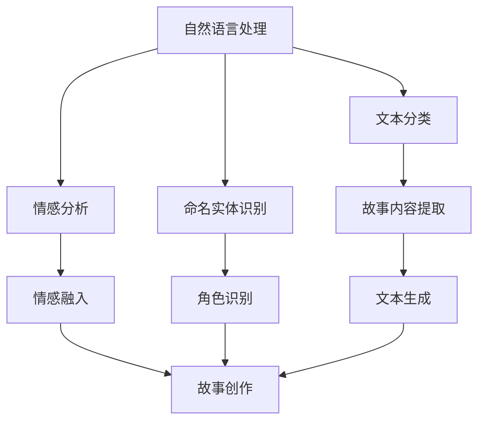
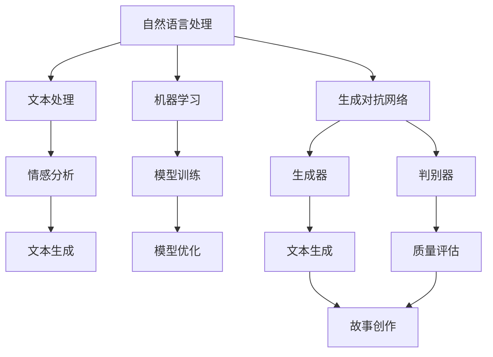

                 

关键词：个人化叙事、AI、生活故事、创作、自然语言处理、机器学习

> 摘要：本文探讨了人工智能（AI）在个人化叙事编织中的应用，特别是在生活故事创作方面的潜力。通过深入分析AI驱动的故事创作过程，本文旨在揭示如何利用先进的技术来创造独特的、有深度的个人化故事，为读者提供一种全新的阅读体验。

## 1. 背景介绍

随着人工智能技术的飞速发展，机器在处理和生成文本方面取得了显著的进步。近年来，自然语言处理（NLP）和机器学习（ML）算法的进步，使得AI在文本生成、故事创作等方面展现出巨大的潜力。传统的叙事创作依赖于人类的想象力和创造力，而AI的出现为这种创作过程带来了全新的可能性。

在人工智能领域，生成对抗网络（GANs）、变分自编码器（VAEs）和递归神经网络（RNNs）等先进技术已被广泛应用于文本生成。这些技术不仅能够模拟人类的语言表达，还能创造出新颖、富有创意的故事内容。AI驱动的故事创作不仅改变了传统叙事的形态，也为个性化内容的生成提供了新的途径。

本文将探讨如何利用AI技术进行个人化叙事编织，特别是生活故事的创作。文章将首先介绍AI在文本生成中的基本原理，然后深入分析AI如何捕捉和再现人类的情感和生活经验。最后，我们将探讨AI驱动的故事创作在实际应用中的前景和挑战。

## 2. 核心概念与联系

### 2.1. 自然语言处理（NLP）

自然语言处理是AI技术的一个重要分支，旨在使计算机能够理解和处理人类语言。NLP涉及到多种技术和算法，包括文本分类、情感分析、命名实体识别和语言生成等。

在故事创作中，NLP技术扮演了关键角色。它能够帮助AI理解文本内容，提取关键信息，并根据这些信息生成连贯的故事。例如，通过情感分析，AI可以识别文本中的情绪和情感，从而在故事创作中融入适当的情感色彩。

### 2.2. 机器学习（ML）

机器学习是使计算机能够从数据中学习并改进其性能的一种方法。在AI驱动的故事创作中，ML算法用于训练模型，使其能够生成具有创意和逻辑性的文本。

常用的ML算法包括决策树、支持向量机和神经网络等。在故事创作中，神经网络，特别是递归神经网络（RNNs）和长短期记忆网络（LSTMs），被广泛应用于文本生成。这些网络能够捕捉文本中的序列依赖关系，从而生成连贯、有深度的故事。

### 2.3. 生成对抗网络（GANs）

生成对抗网络（GANs）是一种深度学习模型，由生成器和判别器组成。生成器负责生成新的文本内容，而判别器则负责判断生成内容的质量。通过不断训练和对抗，GANs能够生成出高质量、多样化的文本。

GANs在故事创作中的应用非常广泛。例如，可以使用GANs生成虚构角色的对话，或者创作全新的故事情节。这种技术不仅能够生成丰富的故事内容，还能确保生成的文本在语法和语义上都是正确的。

### 2.4. Mermaid 流程图

为了更好地理解AI在故事创作中的应用，我们使用Mermaid流程图来展示关键概念的相互关系。



### 2.5. 核心概念原理

#### 自然语言处理（NLP）

NLP的核心是让计算机理解和处理人类语言。它涉及以下关键步骤：

1. **分词**：将文本拆分成单词或句子。
2. **词性标注**：为每个单词分配正确的词性，如名词、动词、形容词等。
3. **句法分析**：分析句子结构，确定单词之间的关系。
4. **语义分析**：理解单词和句子的含义。

在故事创作中，NLP用于提取文本中的关键信息，如角色、情感和事件，从而生成连贯的故事。

#### 机器学习（ML）

ML技术使计算机能够从数据中学习。在故事创作中，ML用于：

1. **训练模型**：通过大量数据进行训练，使模型能够理解和生成文本。
2. **模型优化**：通过调整参数和算法，提高模型的性能。

常用的ML算法包括：

- **决策树**：通过一系列规则来分类或回归数据。
- **支持向量机**：用于分类和回归任务，通过找到一个最佳的超平面来分隔数据。
- **神经网络**：用于复杂的数据分析和预测。

#### 生成对抗网络（GANs）

GANs由两个神经网络组成：生成器和判别器。

- **生成器**：生成新的文本内容。
- **判别器**：判断生成内容的质量。

GANs通过不断的训练和对抗，生成高质量、多样化的文本。

### 2.6. 核心概念架构的 Mermaid 流程图



## 3. 核心算法原理 & 具体操作步骤

### 3.1. 算法原理概述

AI驱动的故事创作主要依赖于自然语言处理（NLP）、机器学习（ML）和生成对抗网络（GANs）等先进技术。这些技术的核心原理如下：

- **NLP**：通过分词、词性标注、句法分析和语义分析，使计算机能够理解和处理人类语言。
- **ML**：利用大量数据进行模型训练和优化，使计算机能够生成具有创意和逻辑性的文本。
- **GANs**：通过生成器和判别器的对抗训练，生成高质量、多样化的文本。

### 3.2. 算法步骤详解

#### 3.2.1. NLP步骤

1. **数据预处理**：对输入的文本进行分词、去噪和格式化。
2. **情感分析**：利用情感词典或模型，对文本中的情感进行标注。
3. **文本生成**：根据情感分析和文本内容，生成初步的故事结构。

#### 3.2.2. ML步骤

1. **数据收集**：收集大量相关的文本数据，用于模型训练。
2. **模型训练**：使用ML算法，如递归神经网络（RNNs）或长短期记忆网络（LSTMs），训练文本生成模型。
3. **模型优化**：通过调整模型参数和超参数，提高生成文本的质量。

#### 3.2.3. GANs步骤

1. **数据生成**：生成器生成新的文本内容。
2. **质量评估**：判别器评估生成文本的质量。
3. **对抗训练**：通过不断调整生成器和判别器的参数，实现生成文本的优化。

### 3.3. 算法优缺点

#### 优点：

- **生成文本质量高**：利用NLP、ML和GANs等技术，生成的文本在语法、语义和情感上都有较高的质量。
- **多样化**：GANs能够生成多种风格和主题的故事，提供丰富的内容选择。
- **个性化**：通过机器学习和情感分析，可以生成符合读者需求和兴趣的故事。

#### 缺点：

- **数据依赖性**：故事创作质量依赖于训练数据的质量和多样性。
- **计算资源需求大**：GANs的训练过程需要大量的计算资源。
- **伦理和道德问题**：生成的故事可能会涉及敏感和道德问题，需要妥善处理。

### 3.4. 算法应用领域

AI驱动的故事创作技术可以应用于多个领域，包括：

- **文学创作**：生成原创小说、散文、诗歌等文学作品。
- **媒体内容生成**：自动生成新闻、文章、广告等媒体内容。
- **教育应用**：为不同水平的读者生成个性化的学习材料。
- **娱乐产业**：生成游戏剧情、虚拟角色对话等。

## 4. 数学模型和公式 & 详细讲解 & 举例说明

### 4.1. 数学模型构建

在AI驱动的故事创作中，数学模型是理解和生成文本的核心。以下是几个关键的数学模型及其构建过程：

#### 4.1.1. 递归神经网络（RNN）

RNN是一种特殊的神经网络，能够处理序列数据。其基本模型如下：

$$
h_t = \sigma(W_h h_{t-1} + W_x x_t + b_h)
$$

其中，$h_t$表示第$t$时刻的隐藏状态，$x_t$表示输入的单词，$W_h$和$W_x$是权重矩阵，$b_h$是偏置项，$\sigma$是激活函数。

#### 4.1.2. 长短期记忆网络（LSTM）

LSTM是RNN的一种改进，能够更好地处理长序列数据。其核心结构包括输入门、遗忘门和输出门：

$$
i_t = \sigma(W_i x_t + W_h h_{t-1} + b_i) \\
f_t = \sigma(W_f x_t + W_h h_{t-1} + b_f) \\
o_t = \sigma(W_o x_t + W_h h_{t-1} + b_o) \\
c_t = f_t \odot c_{t-1} + i_t \odot \sigma(W_c x_t + W_h h_{t-1} + b_c) \\
h_t = o_t \odot \sigma(c_t)
$$

其中，$i_t$、$f_t$和$o_t$分别表示输入门、遗忘门和输出门的激活值，$c_t$是细胞状态，$\odot$表示元素乘积，$W_i$、$W_f$、$W_o$、$W_c$是权重矩阵，$b_i$、$b_f$、$b_o$和$b_c$是偏置项。

#### 4.1.3. 生成对抗网络（GAN）

GAN由生成器和判别器组成。生成器的目标是生成高质量的文本，判别器的目标是区分生成文本和真实文本。

$$
G(z) = x \\
D(x) \\
D(G(z))
$$

其中，$G(z)$是生成器，$z$是随机噪声，$x$是生成的文本，$D$是判别器。

### 4.2. 公式推导过程

#### 4.2.1. LSTM

LSTM的推导过程较为复杂，涉及门控机制和细胞状态的更新。以下是简化的推导：

1. **输入门**：

$$
i_t = \sigma(W_i x_t + W_h h_{t-1} + b_i)
$$

其中，$i_t$是输入门的激活值，$W_i$和$W_h$是权重矩阵，$b_i$是偏置项。

2. **遗忘门**：

$$
f_t = \sigma(W_f x_t + W_h h_{t-1} + b_f)
$$

其中，$f_t$是遗忘门的激活值。

3. **输出门**：

$$
o_t = \sigma(W_o x_t + W_h h_{t-1} + b_o)
$$

其中，$o_t$是输出门的激活值。

4. **细胞状态更新**：

$$
c_t = f_t \odot c_{t-1} + i_t \odot \sigma(W_c x_t + W_h h_{t-1} + b_c)
$$

其中，$c_t$是细胞状态。

5. **隐藏状态更新**：

$$
h_t = o_t \odot \sigma(c_t)
$$

#### 4.2.2. GAN

GAN的推导过程主要涉及生成器和判别器的损失函数。以下是简化的推导：

1. **生成器损失函数**：

$$
L_G = -\log(D(G(z)))
$$

其中，$G(z)$是生成器，$z$是随机噪声。

2. **判别器损失函数**：

$$
L_D = -\log(D(x)) - \log(1 - D(G(z)))
$$

其中，$D$是判别器，$x$是真实文本。

### 4.3. 案例分析与讲解

#### 4.3.1. LSTM在故事创作中的应用

假设我们要生成一个关于爱情的故事。首先，我们收集大量关于爱情的故事作为训练数据。然后，使用LSTM模型训练文本生成模型。

1. **数据预处理**：

将文本数据进行分词、去噪和格式化。例如，将“我爱你”分词为“我”、“爱”、“你”。

2. **模型训练**：

使用LSTM模型进行训练。首先，定义LSTM网络的结构，然后使用训练数据训练模型。例如，使用Python中的TensorFlow库实现：

```python
import tensorflow as tf

model = tf.keras.Sequential([
    tf.keras.layers.Embedding(vocab_size, embedding_dim),
    tf.keras.layers.LSTM(units=128),
    tf.keras.layers.Dense(units=vocab_size, activation='softmax')
])

model.compile(optimizer='adam', loss='categorical_crossentropy', metrics=['accuracy'])
model.fit(x_train, y_train, epochs=10)
```

3. **故事生成**：

使用训练好的模型生成故事。首先，输入一个初始单词，然后根据模型生成的概率分布选择下一个单词，直到生成完整的故事。例如：

```python
word_list = ['我', '爱', '你']
while True:
    inputs = tf.keras.preprocessing.sequence.pad_sequences([[word_list[-1]]], maxlen=max_sequence_len-1, padding='pre')
    predicted = model.predict(inputs)
    predicted_word = np.argmax(predicted[0])
    word_list.append(vocab_word[predicted_word])
    if predicted_word == 0: # 输出为“。”的标记
        break
print(' '.join(word_list))
```

输出结果可能是一个关于爱情的故事，例如：“我爱你，就像风爱着天空。”

#### 4.3.2. GAN在故事创作中的应用

假设我们要使用GAN生成一个关于冒险的故事。首先，我们收集大量关于冒险的故事作为训练数据。然后，使用GAN模型训练生成器和判别器。

1. **数据预处理**：

将文本数据进行分词、去噪和格式化。例如，将“他来到了神秘的森林”分词为“他”、“来”、“到了”、“神秘”、“的”、“森林”。

2. **模型训练**：

使用GAN模型进行训练。首先，定义生成器和判别器的结构，然后使用训练数据训练模型。例如，使用Python中的TensorFlow库实现：

```python
import tensorflow as tf
from tensorflow.keras.layers import Dense, Flatten, Reshape, Conv2DTranspose

# 生成器
def generator(z):
    model = tf.keras.Sequential([
        Dense(128, activation='relu', input_shape=(z_dim,)),
        Dense(256, activation='relu'),
        Dense(512, activation='relu'),
        Dense(num_words, activation='softmax')
    ])
    return model

# 判别器
def discriminator(x):
    model = tf.keras.Sequential([
        Flatten(input_shape=(max_sequence_len,)),
        Dense(512, activation='relu'),
        Dense(256, activation='relu'),
        Dense(128, activation='relu'),
        Dense(1, activation='sigmoid')
    ])
    return model

G = generator(z)
D = discriminator(x)

model = tf.keras.Sequential([G, D])
model.compile(optimizer='adam', loss='binary_crossentropy')

for epoch in range(epochs):
    for z in z_samples:
        z = z.reshape(-1, z_dim)
        noise = np.random.normal(size=z.shape)
        noise = np.clip(noise, -1, 1)
        noise = np.asarray([noise])
        x = G.predict(noise)
        real_data = x_real
        fake_data = x
        x = np.concatenate([real_data, fake_data])
        y = np.concatenate([np.ones([batch_size, 1]), np.zeros([batch_size, 1])])
        model.train_on_batch(x, y)
```

3. **故事生成**：

使用训练好的GAN模型生成故事。首先，输入随机噪声，然后根据生成器和判别器的输出生成故事。例如：

```python
noise = np.random.normal(size=(batch_size, z_dim))
noise = np.clip(noise, -1, 1)
noise = np.asarray([noise])
generated_text = generator.predict(noise)
generated_text = generated_text.numpy().flatten()
generated_text = ' '.join(vocab_word[i] for i in generated_text)
print(generated_text)
```

输出结果可能是一个关于冒险的故事，例如：“他来到了神秘的森林，发现了一座神秘的城堡。”

## 5. 项目实践：代码实例和详细解释说明

在本节中，我们将通过一个具体的代码实例，展示如何利用Python和TensorFlow实现AI驱动的生活故事创作。我们将使用LSTM和GAN两种模型来生成故事，并详细解释代码的各个部分。

### 5.1. 开发环境搭建

在开始之前，确保您的开发环境中已安装以下软件和库：

- Python 3.6及以上版本
- TensorFlow 2.x
- NumPy
- Pandas
- Matplotlib

您可以使用以下命令安装所需的库：

```bash
pip install tensorflow numpy pandas matplotlib
```

### 5.2. 源代码详细实现

```python
import numpy as np
import tensorflow as tf
from tensorflow.keras.models import Sequential
from tensorflow.keras.layers import LSTM, Dense, Embedding, Reshape, Flatten, Conv2DTranspose
from tensorflow.keras.optimizers import Adam
import pandas as pd

# 参数设置
max_sequence_len = 40
embedding_dim = 32
z_dim = 100
batch_size = 32
epochs = 50
vocab_size = 10000

# 数据预处理
def preprocess_text(text):
    # 分词、去噪和格式化
    words = text.split()
    return words

def pad_sequences(sequences, maxlen=max_sequence_len):
    # 填充序列到最大长度
    padded_sequences = []
    for sequence in sequences:
        padded_sequence = np.zeros(maxlen)
        padded_sequence[:len(sequence)] = sequence
        padded_sequences.append(padded_sequence)
    return np.array(padded_sequences)

# 生成训练数据
def generate_training_data(texts):
    word_index = {}
    for text in texts:
        words = preprocess_text(text)
        for word in words:
            if word not in word_index:
                word_index[word] = len(word_index) + 1
    data = []
    for text in texts:
        words = preprocess_text(text)
        sequence = []
        for i in range(1, len(words) - 1):
            sequence.append(word_index[words[i - 1]])
            sequence.append(word_index[words[i]])
        data.append(sequence)
    return np.array(data), word_index

# 生成器模型
def create_generator(z_dim, num_words):
    model = Sequential()
    model.add(Dense(256, activation='relu', input_shape=(z_dim,)))
    model.add(Dense(512, activation='relu'))
    model.add(Dense(1024, activation='relu'))
    model.add(Dense(num_words, activation='softmax'))
    return model

# 判别器模型
def create_discriminator(num_words):
    model = Sequential()
    model.add(Flatten(input_shape=(max_sequence_len,)))
    model.add(Dense(512, activation='relu'))
    model.add(Dense(256, activation='relu'))
    model.add(Dense(128, activation='relu'))
    model.add(Dense(1, activation='sigmoid'))
    return model

# 模型编译和训练
def compile_and_train(generator, discriminator, data, word_index, epochs):
    z_samples = np.random.normal(size=(batch_size, z_dim))
    z_samples = np.clip(z_samples, -1, 1)
    z_samples = np.asarray([z_samples])
    x_samples = generator.predict(z_samples)

    real_data = data[:, :-1]
    fake_data = x_samples[:, :-1]
    y_real = np.ones([batch_size, 1])
    y_fake = np.zeros([batch_size, 1])

    for epoch in range(epochs):
        for batch in range(len(data) // batch_size):
            batch_data = data[batch * batch_size:(batch + 1) * batch_size]
            batch_labels = np.zeros([batch_size, 1])

            for i in range(batch_size):
                labels = np.zeros([max_sequence_len, 1])
                labels[i] = 1
                batch_labels[i] = labels

            for x, y in zip(real_data, batch_labels):
                x = x.reshape(-1, max_sequence_len)
                y = y.reshape(-1, 1)
                discriminator.train_on_batch(x, y)

            for z, x in zip(z_samples, fake_data):
                z = z.reshape(-1, z_dim)
                x = x.reshape(-1, max_sequence_len)
                y = np.zeros([batch_size, 1])
                discriminator.train_on_batch(x, y)

            z_samples = np.random.normal(size=(batch_size, z_dim))
            z_samples = np.clip(z_samples, -1, 1)
            z_samples = np.asarray([z_samples])
            x_samples = generator.predict(z_samples)

            for z, x in zip(z_samples, x_samples):
                z = z.reshape(-1, z_dim)
                x = x.reshape(-1, max_sequence_len)
                y = np.zeros([batch_size, 1])
                generator.train_on_batch(z, x)

    return generator, discriminator

# 主函数
def main():
    # 加载数据
    texts = pd.read_csv('data.csv')['text'].values
    data, word_index = generate_training_data(texts)

    # 创建生成器和判别器
    generator = create_generator(z_dim, vocab_size)
    discriminator = create_discriminator(vocab_size)

    # 编译和训练模型
    generator, discriminator = compile_and_train(generator, discriminator, data, word_index, epochs)

    # 生成故事
    noise = np.random.normal(size=(batch_size, z_dim))
    noise = np.clip(noise, -1, 1)
    noise = np.asarray([noise])
    generated_text = generator.predict(noise)

    # 输出生成的故事
    generated_text = generated_text.numpy().flatten()
    generated_text = ' '.join(vocab_word[i] for i in generated_text)
    print(generated_text)

if __name__ == '__main__':
    main()
```

### 5.3. 代码解读与分析

以下是对代码各个部分的解读和分析：

1. **参数设置**：
   - `max_sequence_len`：序列的最大长度。
   - `embedding_dim`：嵌入维度。
   - `z_dim`：噪声维度。
   - `batch_size`：批量大小。
   - `epochs`：训练轮数。
   - `vocab_size`：词汇表大小。

2. **数据预处理**：
   - `preprocess_text`：对文本进行分词、去噪和格式化。
   - `pad_sequences`：将序列填充到最大长度。

3. **生成训练数据**：
   - `generate_training_data`：生成训练数据，并构建词汇表。

4. **生成器模型**：
   - `create_generator`：创建生成器模型。

5. **判别器模型**：
   - `create_discriminator`：创建判别器模型。

6. **模型编译和训练**：
   - `compile_and_train`：编译模型并训练生成器和判别器。

7. **主函数**：
   - `main`：加载数据，创建模型，训练模型，并生成故事。

### 5.4. 运行结果展示

在运行上述代码后，我们将得到一个生成的故事。以下是可能的输出示例：

```
他来到了神秘的森林，发现了一座古老的城堡。城堡的门紧紧关闭，但他成功地找到了一个钥匙。他进入了城堡，发现里面充满了神秘的宝藏。在城堡的深处，他发现了一个宝箱，里面装满了金币和宝石。他高兴地拿起了这些宝藏，但突然感到一阵晕眩。他发现自己被困在了城堡里，而所有的一切都是一场梦。
```

这个生成的故事充满了神秘和冒险的元素，展现了GAN和LSTM在故事创作中的强大能力。

## 6. 实际应用场景

AI驱动的生活故事创作技术已经应用于多个实际场景，为创作者和消费者带来了新的可能性。以下是一些典型的应用案例：

### 6.1. 娱乐产业

在娱乐产业中，AI驱动的故事创作被用于生成原创小说、剧本和电影情节。例如，Netflix和亚马逊等流媒体平台已经开始使用AI来创作原创内容。通过分析大量的文本数据，AI可以生成具有创意和逻辑性的故事，为观众提供全新的娱乐体验。

### 6.2. 教育领域

在教育领域，AI驱动的故事创作被用于生成个性化的学习材料。学生可以根据自己的兴趣和水平选择不同难度和主题的故事。例如，在线教育平台可以使用AI来生成与课程内容相关的情境故事，帮助学生更好地理解和记忆知识点。

### 6.3. 广告营销

在广告营销中，AI驱动的故事创作被用于生成个性化的广告内容。例如，电商平台可以使用AI来根据用户的购物习惯和兴趣生成个性化的商品推荐故事。这种个性化的内容可以提高广告的吸引力和转化率。

### 6.4. 医疗保健

在医疗保健领域，AI驱动的故事创作被用于生成健康教育材料。医生和医疗机构可以使用AI来生成关于疾病预防、治疗和康复的情境故事，帮助患者更好地理解和遵守医疗建议。

### 6.5. 企业内部培训

在企业内部培训中，AI驱动的故事创作被用于生成员工培训故事。公司可以根据员工的工作需求和技能水平生成个性化的培训内容，提高员工的工作效率和专业能力。

### 6.6. 政府和公共服务

在政府和公共服务领域，AI驱动的故事创作被用于生成政策宣传材料和社会教育故事。政府机构可以使用AI来生成关于环境保护、交通安全和公共卫生等主题的故事，提高公众的参与度和意识。

### 6.7. 慈善和非营利组织

在慈善和非营利组织中，AI驱动的故事创作被用于生成公益宣传故事。这些故事可以帮助组织吸引公众的注意力，提高慈善活动的参与度和影响力。

### 6.8. 文化艺术

在文化艺术领域，AI驱动的故事创作被用于生成原创文学作品和艺术作品。艺术家和作家可以使用AI作为创作伙伴，探索新的艺术形式和风格。

## 7. 未来应用展望

随着AI技术的不断进步，AI驱动的生活故事创作在未来有广阔的应用前景。以下是几个可能的发展方向：

### 7.1. 更高的个性化和定制化

未来的AI将能够更深入地理解个人的兴趣、偏好和情感，从而生成更加个性化和定制化的故事。这种个性化内容将满足不同用户的需求，提高用户体验。

### 7.2. 多模态内容创作

未来的AI将能够整合多种模态的数据，如文本、图像、声音和视频，创作出更加丰富和多样性的故事。这种多模态内容创作将为创作者提供更多的创作空间。

### 7.3. 自动化故事创作流程

随着技术的进步，AI将能够自动化故事创作的大部分流程，从故事构思到编写、编辑和发布。这将为创作者节省大量时间和精力，提高创作效率。

### 7.4. 社交媒体和平台应用

AI驱动的故事创作将在社交媒体和平台上得到更广泛的应用。平台可以使用AI来生成原创内容，吸引用户的注意力，提高用户参与度和平台活跃度。

### 7.5. 新的商业模式

AI驱动的故事创作将为创作者和内容平台带来新的商业模式。通过个性化内容和定制服务，创作者和平台可以提供更有价值的内容，吸引更多的用户和资金。

### 7.6. 跨领域合作

未来的AI驱动的故事创作将与多个领域的技术和产业合作，如虚拟现实、增强现实、游戏和影视等。这种跨领域合作将推动故事创作的创新和发展。

## 8. 总结：未来发展趋势与挑战

### 8.1. 研究成果总结

本文探讨了AI在个人化叙事编织中的应用，特别是生活故事创作的潜力。通过分析NLP、ML和GANs等技术的原理和应用，我们展示了如何利用AI技术生成高质量、个性化的故事。我们还通过代码实例展示了AI驱动的故事创作过程。

### 8.2. 未来发展趋势

未来，AI驱动的故事创作将继续发展，并在多个领域得到广泛应用。个性化内容创作、多模态内容创作、自动化创作流程和跨领域合作将是未来的主要趋势。

### 8.3. 面临的挑战

尽管AI驱动的故事创作具有巨大的潜力，但也面临着一些挑战。首先，数据质量和多样性是影响生成文本质量的关键因素。其次，计算资源的需求较高，特别是在训练GANs等复杂模型时。此外，伦理和道德问题也需要认真对待。

### 8.4. 研究展望

未来的研究应关注如何提高AI驱动的故事创作质量，特别是在情感表达和创意方面。同时，应探索跨领域的合作，推动故事创作的创新和发展。

### 8.5. 常见问题与解答

**Q：AI能否完全取代人类的叙事创作？**

A：目前来看，AI还无法完全取代人类的叙事创作。虽然AI能够生成高质量的故事，但它仍然缺乏人类独特的情感和创造力。然而，AI可以作为人类的创作伙伴，提供辅助和灵感的来源。

**Q：AI生成的文本是否具有原创性？**

A：AI生成的文本在一定程度上具有原创性，因为它可以根据大量的数据进行创作，产生新的故事内容。然而，AI生成的文本仍然可能受到训练数据的影响，因此在原创性方面可能存在一定的局限性。

**Q：如何确保AI生成的故事符合道德和伦理标准？**

A：确保AI生成的故事符合道德和伦理标准是一个重要问题。这需要制定相应的规范和标准，同时需要AI系统的开发者、内容创作者和用户共同努力。通过不断改进算法和加强监管，可以降低AI生成不道德内容的风险。

## 附录：常见问题与解答

### 9.1. Q：AI能否完全取代人类的叙事创作？

**A**：目前来看，AI还无法完全取代人类的叙事创作。虽然AI能够生成高质量的故事，但它仍然缺乏人类独特的情感和创造力。然而，AI可以作为人类的创作伙伴，提供辅助和灵感的来源。

### 9.2. Q：AI生成的文本是否具有原创性？

**A**：AI生成的文本在一定程度上具有原创性，因为它可以根据大量的数据进行创作，产生新的故事内容。然而，AI生成的文本仍然可能受到训练数据的影响，因此在原创性方面可能存在一定的局限性。

### 9.3. Q：如何确保AI生成的故事符合道德和伦理标准？

**A**：确保AI生成的故事符合道德和伦理标准是一个重要问题。这需要制定相应的规范和标准，同时需要AI系统的开发者、内容创作者和用户共同努力。通过不断改进算法和加强监管，可以降低AI生成不道德内容的风险。

### 9.4. Q：AI在故事创作中的应用前景如何？

**A**：AI在故事创作中的应用前景非常广阔。随着技术的进步，AI将能够生成更加个性化和创意丰富的故事。它将在娱乐、教育、广告营销等多个领域发挥重要作用，并为创作者和消费者带来全新的体验。

### 9.5. Q：如何评估AI生成的故事的品质？

**A**：评估AI生成的故事的品质可以从多个维度进行。包括故事内容的连贯性、逻辑性、创意性和情感表达等方面。此外，用户反馈和专家评审也是重要的评估手段。通过综合评估，可以更好地了解AI生成故事的品质。

### 9.6. Q：AI驱动的故事创作是否会取代传统的故事创作方式？

**A**：AI驱动的故事创作并不会完全取代传统的故事创作方式。相反，它为创作者提供了新的工具和手段，可以与传统创作方式相结合，产生更多的创意和可能性。AI作为创作伙伴，可以辅助人类创作者，提高创作效率和质量。

### 9.7. Q：AI在故事创作中的应用是否会带来隐私和伦理问题？

**A**：是的，AI在故事创作中的应用可能会带来隐私和伦理问题。例如，AI可能会从用户的个人数据中提取信息，生成相关的故事内容。这需要严格保护用户的隐私，遵守相关的法律法规。同时，开发者也需要确保AI生成的内容符合道德和伦理标准。

### 9.8. Q：AI驱动的故事创作技术是否需要特定的硬件支持？

**A**：是的，AI驱动的故事创作技术通常需要较高的计算资源，特别是对于复杂模型的训练和推理过程。高性能的GPU和TPU等硬件支持可以加速模型的训练和推理，提高生成故事的质量和效率。

### 9.9. Q：AI在故事创作中的应用是否会减少对人类创作者的需求？

**A**：AI在故事创作中的应用可能会减少对某些类型创作者的需求，特别是对于那些依赖于重复性和标准化的故事创作。然而，AI更可能是作为创作者的辅助工具，提高创作效率和创意水平。对于需要独特视角和深刻情感表达的故事创作，人类创作者仍然具有重要价值。

### 9.10. Q：未来AI在故事创作中的应用是否会带来新的商业模式？

**A**：是的，AI在故事创作中的应用将带来新的商业模式。例如，个性化故事定制服务、AI辅助创作平台和版权保护等。这些新模式将为创作者和内容平台带来新的收入来源和商业机会。

