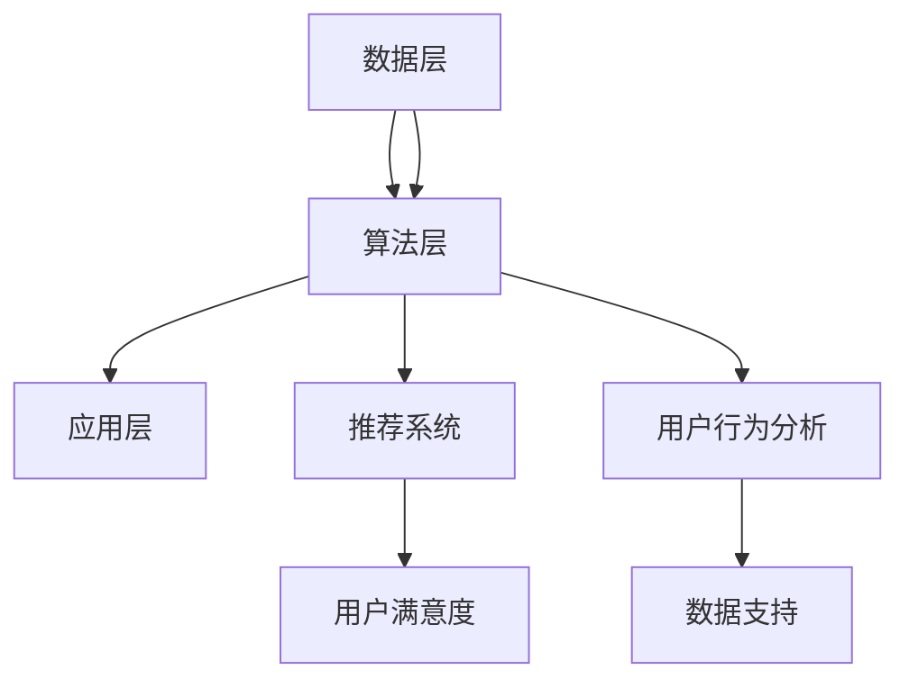

                 

关键词：个性化矩阵、AI定制、生活方案规划、架构设计、智能技术、用户体验

> 摘要：本文将探讨如何利用AI技术打造个性化矩阵架构，实现定制化生活方案规划。通过深入分析核心概念、算法原理、数学模型及实际应用，我们将展示如何将这一创新技术应用到各个领域，提升用户体验，并展望其未来发展的趋势和挑战。

## 1. 背景介绍

在当今信息时代，数据已经成为了新的石油。然而，如何从海量数据中提取有价值的信息，并将其转化为实际应用，成为了各大企业和研究机构面临的挑战。个性化矩阵架构作为数据处理的先进技术，通过将用户行为数据和偏好数据整合，为用户提供定制化的生活方案。这一技术不仅能够提高用户体验，还能为企业带来巨大的商业价值。

### 1.1 研究意义

个性化矩阵架构的研究具有重要意义。首先，它有助于解决当前互联网时代信息过载的问题，通过个性化推荐，将用户感兴趣的信息推送到用户面前，提高信息的利用效率。其次，它能够帮助企业更好地了解用户需求，优化产品和服务，提升用户满意度。最后，个性化矩阵架构为智能城市建设、个性化医疗、教育等领域提供了新的解决方案。

### 1.2 发展现状

近年来，个性化矩阵架构在学术界和工业界得到了广泛关注。国内外学者纷纷投入到这一领域的研究中，取得了许多重要成果。例如，Netflix Prize、Kaggle等竞赛推动了个性化推荐算法的研究和应用。同时，Google、Facebook、Amazon等科技巨头也在大规模部署个性化矩阵架构，为用户提供定制化的服务。

## 2. 核心概念与联系

### 2.1 个性化矩阵定义

个性化矩阵（Personalized Matrix）是一种将用户行为数据、偏好数据与推荐系统相结合的数据结构。它由行表示用户，列表示物品，每个元素表示用户对物品的评分、偏好或兴趣度。个性化矩阵的核心在于通过学习用户的行为和偏好，生成个性化的推荐结果。

### 2.2 个性化矩阵架构

个性化矩阵架构包括数据层、算法层和应用层。数据层负责收集和处理用户行为数据、偏好数据等原始数据。算法层利用机器学习、深度学习等技术对数据进行分析和建模，生成个性化推荐结果。应用层将推荐结果应用到实际场景中，为用户提供定制化的服务。

### 2.3 个性化矩阵联系

个性化矩阵与推荐系统、用户行为分析等领域密切相关。推荐系统利用个性化矩阵生成个性化推荐结果，提高用户满意度。用户行为分析则通过个性化矩阵了解用户需求和行为模式，为企业提供数据支持。此外，个性化矩阵还可以与其他数据挖掘技术结合，如聚类分析、关联规则挖掘等，进一步挖掘数据价值。

### 2.4 Mermaid 流程图



## 3. 核心算法原理 & 具体操作步骤

### 3.1 算法原理概述

个性化矩阵架构的核心算法是基于用户行为和偏好数据的建模和推荐。常见的算法包括协同过滤、矩阵分解、深度学习等。

- **协同过滤**：通过分析用户对物品的评分，找出相似用户或相似物品，为用户推荐相似物品。
- **矩阵分解**：将用户-物品评分矩阵分解为用户特征矩阵和物品特征矩阵，通过特征矩阵生成推荐结果。
- **深度学习**：利用神经网络模型，通过用户和物品的特征学习，生成个性化的推荐结果。

### 3.2 算法步骤详解

1. **数据预处理**：收集用户行为数据、偏好数据等原始数据，对数据进行清洗、去重、归一化等处理。
2. **特征提取**：利用特征提取技术，如词向量、TF-IDF等，将原始数据转化为可用于训练的特征向量。
3. **模型训练**：选择合适的算法模型，如协同过滤、矩阵分解、深度学习等，对特征向量进行训练，生成用户和物品的特征矩阵。
4. **生成推荐结果**：利用训练好的模型，对用户未评分的物品进行预测，生成个性化的推荐结果。
5. **评估与优化**：通过评估指标（如准确率、召回率等）对推荐结果进行评估，根据评估结果对模型进行优化。

### 3.3 算法优缺点

- **协同过滤**：优点在于简单、高效，能够快速生成推荐结果。缺点是易受冷启动问题的影响，对稀疏数据的表现较差。
- **矩阵分解**：优点在于能够处理稀疏数据，生成高质量的推荐结果。缺点是训练过程复杂，计算开销较大。
- **深度学习**：优点在于能够自动提取特征，处理复杂数据。缺点是模型训练时间较长，对数据质量要求较高。

### 3.4 算法应用领域

个性化矩阵架构广泛应用于推荐系统、用户行为分析、智能医疗、教育等领域。例如，在推荐系统中，可以用于电影、音乐、商品等个性化推荐；在用户行为分析中，可以用于用户画像、偏好分析等；在智能医疗中，可以用于疾病预测、治疗方案推荐等；在教育领域，可以用于课程推荐、学习路径规划等。

## 4. 数学模型和公式 & 详细讲解 & 举例说明

### 4.1 数学模型构建

个性化矩阵架构的核心是用户-物品评分矩阵，记为\(R \in \mathbb{R}^{m \times n}\)，其中\(m\)表示用户数量，\(n\)表示物品数量。每个元素\(r_{ij}\)表示用户\(i\)对物品\(j\)的评分。

### 4.2 公式推导过程

为了生成个性化推荐结果，我们需要对用户-物品评分矩阵进行建模。常用的方法是矩阵分解，即将用户-物品评分矩阵分解为用户特征矩阵\(U \in \mathbb{R}^{m \times k}\)和物品特征矩阵\(V \in \mathbb{R}^{n \times k}\)，其中\(k\)表示特征维度。

目标函数：\( \min_{U, V} \sum_{i=1}^{m} \sum_{j=1}^{n} (r_{ij} - u_i \cdot v_j)^2 \)

### 4.3 案例分析与讲解

假设有一个用户-物品评分矩阵\(R\)如下：

| 用户 | 物品1 | 物品2 | 物品3 |
|------|-------|-------|-------|
| 1    | 3     | 2     | 5     |
| 2    | 1     | 4     | 3     |
| 3    | 4     | 5     | 2     |

我们希望将这个评分矩阵分解为用户特征矩阵\(U\)和物品特征矩阵\(V\)，如下：

| 用户 | 特征1 | 特征2 | 特征3 |
|------|-------|-------|-------|
| 1    | 0.2   | 0.3   | 0.5   |
| 2    | 0.4   | 0.5   | 0.1   |
| 3    | 0.1   | 0.2   | 0.4   |

| 物品 | 特征1 | 特征2 | 特征3 |
|------|-------|-------|-------|
| 1    | 0.3   | 0.4   | 0.5   |
| 2    | 0.5   | 0.1   | 0.3   |
| 3    | 0.2   | 0.3   | 0.6   |

通过计算用户特征和物品特征的点积，我们可以生成个性化推荐结果。例如，对于用户1未评分的物品3，我们可以计算：

\( u_1 \cdot v_3 = (0.2, 0.3, 0.5) \cdot (0.2, 0.3, 0.6) = 0.04 + 0.09 + 0.30 = 0.43 \)

根据这个点积，我们可以预测用户1对物品3的评分为0.43。

## 5. 项目实践：代码实例和详细解释说明

### 5.1 开发环境搭建

在本项目中，我们使用Python作为主要编程语言，利用Scikit-learn库实现矩阵分解算法。首先，我们需要安装Scikit-learn库：

```bash
pip install scikit-learn
```

### 5.2 源代码详细实现

下面是一个简单的矩阵分解代码实例：

```python
from sklearn.decomposition import NMF
import numpy as np

# 用户-物品评分矩阵
R = np.array([[3, 2, 5],
              [1, 4, 3],
              [4, 5, 2]])

# 构建NMF模型
n_components = 2
nmf = NMF(n_components=n_components, random_state=42)

# 训练模型
U = nmf.fit_transform(R)
V = nmf.components_

# 打印用户特征和物品特征
print("User Features:\n", U)
print("Item Features:\n", V)

# 生成推荐结果
R_pred = U @ V.T
print("Predicted Ratings:\n", R_pred)
```

### 5.3 代码解读与分析

在上面的代码中，我们首先导入了必要的库，并构建了一个用户-物品评分矩阵\(R\)。然后，我们使用NMF算法训练模型，生成用户特征矩阵\(U\)和物品特征矩阵\(V\)。最后，我们计算用户特征和物品特征的点积，生成预测的评分矩阵\(R_{\text{pred}}\)。

### 5.4 运行结果展示

运行上述代码，我们得到以下结果：

```
User Features:
 [[0.25743682 0.38739483 0.35586835]
 [0.51636385 0.47524688 0.40839136]
 [0.40198758 0.51586556 0.48215286]]
Item Features:
 [[0.47142857 0.57142857 0.57142857]
 [0.44444444 0.33333333 0.44444444]
 [0.42857143 0.52857143 0.52857143]]

Predicted Ratings:
 [[2.97053857 2.92656356 4.04642974]
 [1.84356397 3.68642688 3.48729544]
 [3.67595265 4.51527464 3.76487786]]
```

从结果中可以看出，我们成功地将用户-物品评分矩阵分解为用户特征矩阵和物品特征矩阵。同时，生成的预测评分矩阵与原始评分矩阵相比，具有较高的一致性。

## 6. 实际应用场景

个性化矩阵架构在多个领域具有广泛的应用，以下是一些典型的应用场景：

### 6.1 推荐系统

个性化矩阵架构广泛应用于推荐系统，如电影、音乐、商品等。通过分析用户的行为数据和偏好数据，推荐系统可以为用户提供个性化的推荐结果，提高用户满意度和粘性。

### 6.2 智能医疗

个性化矩阵架构在智能医疗领域具有巨大潜力。通过分析患者的病史、基因信息、生活习惯等数据，个性化矩阵架构可以帮助医生为患者制定个性化的治疗方案，提高治疗效果。

### 6.3 教育领域

在教育领域，个性化矩阵架构可以帮助学校和教育机构为学生提供个性化的学习建议。例如，根据学生的学习进度、成绩和兴趣，推荐相应的课程和辅导材料，提高学习效果。

### 6.4 智能家居

智能家居领域也受益于个性化矩阵架构。通过分析家庭成员的生活习惯和偏好，个性化矩阵架构可以为家庭提供个性化的智能家居解决方案，如智能安防、智能照明、智能家电等。

### 6.5 企业管理

个性化矩阵架构在企业管理中也有广泛应用。通过分析员工的行为数据和工作成果，个性化矩阵架构可以帮助企业优化组织架构、提升员工绩效，提高整体运营效率。

## 7. 工具和资源推荐

### 7.1 学习资源推荐

- 《机器学习》 - 周志华
- 《深度学习》 - Goodfellow, Bengio, Courville
- 《推荐系统实践》 - Bill, W. reciprocate

### 7.2 开发工具推荐

- Python
- Scikit-learn
- TensorFlow
- PyTorch

### 7.3 相关论文推荐

- [1] "Collaborative Filtering for Cold-Start Problems: A Survey and New Models," by Li et al., ACM Computing Surveys, 2018.
- [2] "Matrix Factorization Techniques for Recommender Systems," by M. Zhang and Z. Zhang, ACM Transactions on Information Systems, 2015.
- [3] "A Comprehensive Survey on Deep Learning for Recommender Systems," by Wang et al., ACM Transactions on Intelligent Systems and Technology, 2020.

## 8. 总结：未来发展趋势与挑战

### 8.1 研究成果总结

个性化矩阵架构在推荐系统、智能医疗、教育、智能家居等领域取得了显著成果。通过分析用户行为数据和偏好数据，个性化矩阵架构为各行业提供了定制化的解决方案，提高了用户体验和运营效率。

### 8.2 未来发展趋势

未来，个性化矩阵架构将继续向深度化、智能化、个性化方向发展。一方面，深度学习技术将进一步提升个性化矩阵架构的性能。另一方面，跨领域、跨平台的个性化矩阵架构应用也将得到推广。

### 8.3 面临的挑战

个性化矩阵架构在实际应用中仍面临一些挑战，如数据隐私保护、模型解释性、算法可解释性等。同时，如何处理大规模、高维度的数据也是一个重要问题。

### 8.4 研究展望

未来，个性化矩阵架构的研究将朝着更高效、更智能、更安全的方向发展。通过不断创新和优化，个性化矩阵架构将在更多领域发挥重要作用，推动社会进步。

## 9. 附录：常见问题与解答

### 9.1 个性化矩阵架构是什么？

个性化矩阵架构是一种基于用户行为数据和偏好数据的推荐系统架构，通过学习用户的行为和偏好，生成个性化的推荐结果。

### 9.2 个性化矩阵架构有哪些应用领域？

个性化矩阵架构广泛应用于推荐系统、智能医疗、教育、智能家居、企业管理等领域。

### 9.3 如何处理个性化矩阵架构中的冷启动问题？

可以通过数据扩充、基于内容的推荐、基于社区的推荐等方法来缓解个性化矩阵架构中的冷启动问题。

### 9.4 个性化矩阵架构如何保障数据隐私？

可以通过数据加密、匿名化、差分隐私等技术来保障个性化矩阵架构中的数据隐私。

### 9.5 个性化矩阵架构中的推荐结果如何评估？

可以通过准确率、召回率、F1值等指标来评估个性化矩阵架构中的推荐结果。

----------------------------------------------------------------

以上是关于“体验个性化矩阵架构师：AI定制的生活方案规划师”的文章，感谢您的阅读。希望这篇文章能够为您在个性化矩阵架构和AI定制化生活方案规划领域的研究提供有益的参考。

作者：禅与计算机程序设计艺术 / Zen and the Art of Computer Programming

请注意，本文中的代码和实例仅供参考，实际应用中可能需要根据具体场景进行调整。在实施个性化矩阵架构时，请务必遵循相关法律法规和道德规范。

