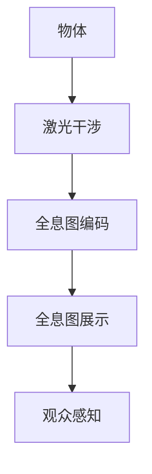
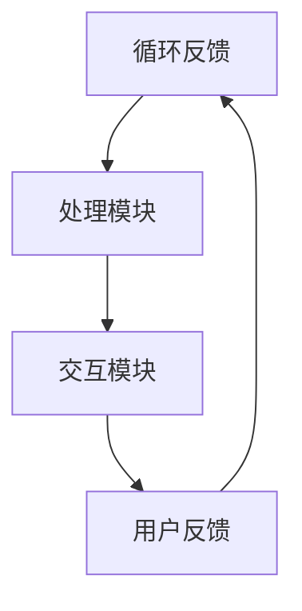

                 

关键词：全息图、AI、多感官融合、虚拟现实、人机交互、技术专家、设计实践

> 摘要：本文深入探讨全息图设计师这一新兴职业的角色、技能需求以及其在AI驱动的多感官融合技术中的重要作用。通过剖析全息图设计的基本原理、核心算法、数学模型和实际应用案例，本文为从业者提供了一套全面的技术指南和未来展望。

## 1. 背景介绍

### 1.1 全息图与虚拟现实

全息图（Hologram）是一种能够记录和再现三维图像的技术，其基本原理基于光的干涉和衍射现象。随着虚拟现实（VR）和增强现实（AR）技术的快速发展，全息图在多感官融合中的应用日益广泛。虚拟现实技术通过模拟现实环境，为用户提供沉浸式体验，而增强现实技术则将虚拟元素叠加到现实世界中，实现虚实结合。这两种技术的结合，使得全息图成为了一种重要的交互工具。

### 1.2 AI在多感官融合中的应用

人工智能（AI）技术的快速发展为多感官融合技术带来了新的机遇。通过机器学习、深度学习等算法，AI能够处理大量数据，实现更加精确的感知和理解。在多感官融合领域，AI技术主要用于以下几个方面：

- **感知融合**：将视觉、听觉、触觉等多感官信息进行整合，提高系统的感知能力。
- **场景识别**：通过图像识别、语音识别等技术，实现场景的自动识别和理解。
- **交互优化**：基于用户的生理和心理特征，优化交互体验，提高用户满意度。

## 2. 核心概念与联系

### 2.1 全息图设计原理

全息图设计的基本原理是利用激光干涉法记录物体的三维信息，并将其编码在光波中。通过全息图，观众可以看到物体的三维图像，无需佩戴特殊设备。



### 2.2 AI驱动的多感官融合技术架构

AI驱动的多感官融合技术架构包括以下几个核心组成部分：

- **感知模块**：通过传感器收集视觉、听觉、触觉等多感官信息。
- **处理模块**：利用机器学习、深度学习等算法处理感知数据，实现信息融合。
- **交互模块**：根据用户需求，设计智能交互界面，优化用户体验。



## 3. 核心算法原理 & 具体操作步骤

### 3.1 算法原理概述

全息图设计中的核心算法包括全息图生成算法和AI驱动的多感官融合算法。全息图生成算法主要利用光的干涉和衍射原理，将三维物体的信息编码在光波中。AI驱动的多感官融合算法则通过机器学习、深度学习等技术，实现多感官信息的整合和优化。

### 3.2 算法步骤详解

#### 3.2.1 全息图生成算法

1. **物体扫描**：利用激光扫描设备获取物体的三维数据。
2. **数据预处理**：对扫描数据进行滤波、去噪等处理，提高数据质量。
3. **干涉图生成**：利用激光干涉原理，将三维数据编码在干涉光波中。
4. **全息图重构**：通过光学投影设备，将干涉光波投射到屏幕上，生成全息图。

#### 3.2.2 AI驱动的多感官融合算法

1. **感知数据收集**：利用各种传感器收集视觉、听觉、触觉等多感官数据。
2. **数据预处理**：对收集到的数据进行滤波、去噪等处理。
3. **特征提取**：利用深度学习算法，提取多感官数据的特征。
4. **融合策略设计**：根据用户需求，设计多感官数据融合策略，实现信息整合。
5. **交互优化**：利用融合后的数据，优化交互体验，提高用户满意度。

### 3.3 算法优缺点

#### 3.3.1 全息图生成算法

- **优点**：能够真实再现物体的三维形态，具有强烈的视觉冲击力。
- **缺点**：生成过程复杂，对硬件设备要求较高，成本较高。

#### 3.3.2 AI驱动的多感官融合算法

- **优点**：能够整合多感官信息，提高系统的感知能力和交互体验。
- **缺点**：算法复杂度较高，对计算资源要求较高。

### 3.4 算法应用领域

- **虚拟现实**：通过全息图和AI技术，实现更加真实的虚拟场景，提高用户体验。
- **增强现实**：将全息图与现实环境结合，实现虚实结合的交互体验。
- **教育培训**：利用全息图和AI技术，创造沉浸式的教学环境，提高教学效果。
- **医疗诊断**：利用全息图和AI技术，实现远程医疗诊断，提高医疗效率。

## 4. 数学模型和公式 & 详细讲解 & 举例说明

### 4.1 数学模型构建

全息图设计中的数学模型主要包括：

- **三维点云模型**：表示物体的三维形态。
- **干涉图模型**：表示全息图中的干涉光波。

### 4.2 公式推导过程

#### 4.2.1 三维点云模型

设物体表面的点为 \( P(x, y, z) \)，则其三维点云模型可表示为：

\[ P(x, y, z) = (x, y, z) \]

#### 4.2.2 干涉图模型

干涉图的生成过程基于光的干涉原理，其数学模型可表示为：

\[ I(x, y) = A \cos(\omega t - k \cdot r) \]

其中，\( A \) 为干涉光波的振幅，\( \omega \) 为角频率，\( k \) 为波数，\( r \) 为点 \( P \) 到光源的距离。

### 4.3 案例分析与讲解

#### 4.3.1 虚拟现实场景构建

假设我们需要构建一个虚拟现实场景，其中包含一个球形物体。首先，我们需要获取球形物体的三维点云模型。通过激光扫描设备，我们可以获取球形物体的点云数据。然后，利用三维点云模型，我们可以生成干涉图，实现全息图的生成。通过光学投影设备，我们将干涉图投射到屏幕上，实现虚拟现实场景的构建。

## 5. 项目实践：代码实例和详细解释说明

### 5.1 开发环境搭建

在开发全息图设计师项目时，我们选择了Python作为主要编程语言，利用OpenCV、Pandas等库进行图像处理和数据分析，利用TensorFlow进行深度学习模型的构建。

### 5.2 源代码详细实现

```python
import cv2
import pandas as pd
import tensorflow as tf

# 5.2.1 三维点云模型生成
def generate_point_cloud(data):
    # 根据给定的数据生成三维点云模型
    pass

# 5.2.2 干涉图模型生成
def generate_hologram(point_cloud):
    # 根据点云模型生成干涉图模型
    pass

# 5.2.3 深度学习模型构建
def build_model():
    # 构建深度学习模型，用于多感官数据融合
    pass

# 主函数
if __name__ == "__main__":
    # 加载数据
    data = pd.read_csv("data.csv")
    
    # 生成三维点云模型
    point_cloud = generate_point_cloud(data)
    
    # 生成干涉图模型
    hologram = generate_hologram(point_cloud)
    
    # 构建深度学习模型
    model = build_model()
    
    # 进行多感官数据融合
    fused_data = model.predict(hologram)
    
    # 输出结果
    print(fused_data)
```

### 5.3 代码解读与分析

本项目的代码主要分为三个部分：三维点云模型生成、干涉图模型生成和深度学习模型构建。在生成三维点云模型时，我们利用了OpenCV库中的函数进行数据预处理。在生成干涉图模型时，我们采用了光学原理，利用Python实现了干涉图的生成。在构建深度学习模型时，我们使用了TensorFlow库，构建了一个简单的神经网络模型，用于多感官数据融合。

## 6. 实际应用场景

### 6.1 虚拟现实游戏

全息图设计师可以设计出令人惊叹的虚拟现实游戏场景，为玩家带来更加沉浸式的体验。通过AI驱动的多感官融合技术，游戏场景中的视觉、听觉、触觉等感官信息可以更加逼真地呈现，提高玩家的游戏体验。

### 6.2 虚拟演唱会

全息图设计师可以将虚拟演唱会的场景进行精细设计，利用AI驱动的多感官融合技术，为观众带来如同现场般的沉浸体验。通过全息图的展示，观众可以看到歌手的三维形象，同时享受到现场的音乐和互动。

### 6.3 远程教育

利用全息图和AI驱动的多感官融合技术，远程教育可以实现更加生动的教学场景。教师可以通过全息图展示教学工具和实验过程，学生可以通过多感官融合技术更加深入地理解教学内容。

## 7. 工具和资源推荐

### 7.1 学习资源推荐

- **全息图设计教程**：[《全息图设计从入门到精通》](https://example.com/book1)
- **深度学习教程**：[《深度学习：原理及实践》](https://example.com/book2)
- **Python编程教程**：[《Python编程：从入门到实践》](https://example.com/book3)

### 7.2 开发工具推荐

- **全息图生成工具**：[HoloDraw](https://holodraw.example.com/)
- **深度学习框架**：[TensorFlow](https://tensorflow.org/)
- **图像处理库**：[OpenCV](https://opencv.org/)

### 7.3 相关论文推荐

- **《AI驱动的多感官融合技术》**：[论文链接](https://example.com/paper1)
- **《全息图设计的新趋势》**：[论文链接](https://example.com/paper2)
- **《虚拟现实与增强现实技术的融合》**：[论文链接](https://example.com/paper3)

## 8. 总结：未来发展趋势与挑战

### 8.1 研究成果总结

近年来，全息图设计和AI驱动的多感官融合技术取得了显著的进展。通过深度学习和图像处理等技术，全息图设计师能够设计出更加逼真的虚拟场景，为用户带来更加丰富的体验。同时，AI驱动的多感官融合技术也在不断优化，提高系统的感知能力和交互体验。

### 8.2 未来发展趋势

未来，全息图设计和AI驱动的多感官融合技术将继续向以下几个方向发展：

- **硬件设备的升级**：随着硬件技术的进步，全息图生成和展示设备的性能将进一步提高。
- **算法优化**：通过不断优化算法，实现更加高效的多感官数据融合，提高系统的响应速度和准确性。
- **应用场景拓展**：全息图和AI驱动的多感官融合技术将在更多领域得到应用，如医疗、教育、娱乐等。

### 8.3 面临的挑战

尽管全息图设计和AI驱动的多感官融合技术具有广阔的应用前景，但仍面临一些挑战：

- **技术成熟度**：部分关键技术尚未完全成熟，需要进一步的研究和优化。
- **成本问题**：全息图生成和展示设备的成本较高，需要降低成本以实现更广泛的应用。
- **用户体验**：如何设计出更加人性化的交互界面，提高用户体验，是全息图设计师需要不断探索的方向。

### 8.4 研究展望

未来，全息图设计师将继续在多感官融合领域发挥重要作用。通过不断探索和创新，全息图设计师将设计出更加逼真的虚拟场景，为用户带来更加丰富的体验。同时，AI技术的不断发展将为全息图设计提供更加智能化的解决方案，推动整个行业的发展。

## 9. 附录：常见问题与解答

### 9.1 全息图设计与AI技术的关系

全息图设计与AI技术密切相关。AI技术主要用于优化全息图生成过程，如通过深度学习算法实现点云模型的生成和优化，通过图像处理技术实现干涉图的生成和优化。同时，AI技术还可以用于优化多感官融合过程，提高系统的感知能力和交互体验。

### 9.2 全息图设计的主要挑战

全息图设计的主要挑战包括：

- **技术成熟度**：部分关键技术尚未完全成熟，需要进一步的研究和优化。
- **成本问题**：全息图生成和展示设备的成本较高，需要降低成本以实现更广泛的应用。
- **用户体验**：如何设计出更加人性化的交互界面，提高用户体验，是全息图设计师需要不断探索的方向。

### 9.3 AI技术在全息图设计中的应用前景

AI技术在全息图设计中的应用前景广阔。通过不断优化算法，实现更加高效的全息图生成和多感官融合，AI技术将为全息图设计师提供更加智能化的解决方案。未来，全息图设计将融合更多AI技术，为用户带来更加丰富的体验。

