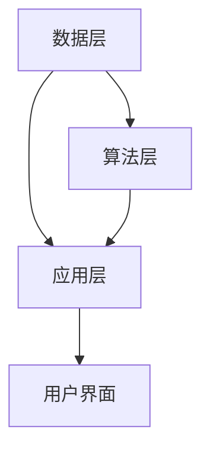

                 

在当今信息技术迅猛发展的时代，人工智能（AI）正逐渐成为推动各个领域创新的驱动力。作为体验叙事工作室的总监，我的工作重心便是探索如何利用AI技术来重塑个人故事创作的方式，使其更加个性化和引人入胜。本文将详细探讨AI在个人故事创作中的应用，解析其核心概念、算法原理、数学模型以及实际应用案例，并展望未来的发展趋势与挑战。

## 关键词

- 人工智能（AI）
- 个人故事创作
- 体验叙事工作室
- 机器学习
- 自然语言处理
- 数据挖掘

## 摘要

本文旨在探讨如何利用AI技术提升个人故事创作体验。通过分析AI在叙事领域的核心概念与联系，阐述机器学习算法在故事生成中的具体应用，介绍数学模型和公式的构建方法，以及通过实际项目案例展示AI驱动的个人故事创作坊的运作方式。最后，本文将讨论AI在个人故事创作中的未来应用前景以及面临的挑战，为相关领域的研究者和从业者提供有益的参考。

## 1. 背景介绍

个人故事创作是文学艺术的重要组成部分，它不仅是表达个人情感与体验的手段，也是文化传承和社会互动的桥梁。然而，传统的个人故事创作往往依赖于作者的个人天赋和创作经验，存在一定的主观性和局限性。随着信息技术的进步，人工智能技术，特别是机器学习、自然语言处理和数据分析等技术，为个人故事创作带来了前所未有的可能性。

### 1.1 人工智能在叙事领域的应用

人工智能在叙事领域的应用可以追溯到自然语言处理（NLP）技术的发展。NLP使得计算机能够理解和生成人类语言，从而开启了自动化故事生成和个性化故事推荐的可能性。近年来，随着深度学习技术的迅猛发展，AI在叙事领域的应用也日益广泛，例如自动写作助手、情感分析、故事情节生成等。

### 1.2 体验叙事工作室的角色

作为体验叙事工作室的总监，我的职责是利用AI技术为个人故事创作提供创新解决方案。工作室致力于探索如何通过人工智能技术，提升个人故事创作的效率和质量，为用户提供更加丰富和个性化的叙事体验。具体而言，我们的工作包括以下几个方面：

- **故事创意生成**：利用自然语言处理和机器学习算法，为用户提供故事创意建议，帮助他们打破创作困境。
- **情感分析**：通过分析用户的语言和情感，为用户提供个性化的情感反馈，帮助他们更好地表达自己的情感。
- **故事优化**：利用数据挖掘技术，分析用户的故事，提供优化建议，提升故事的质量和吸引力。
- **故事推荐**：基于用户的兴趣和行为，推荐符合他们口味的个人故事，增加故事的传播和影响力。

## 2. 核心概念与联系

### 2.1 机器学习在故事生成中的应用

机器学习是AI技术中的重要分支，它在故事生成中的应用主要体现在两个方面：故事主题预测和故事情节生成。

#### 2.1.1 故事主题预测

故事主题预测是利用机器学习算法，根据用户输入的文本或情感数据，预测用户可能感兴趣的故事主题。这一过程通常包括以下几个步骤：

1. **数据收集**：收集大量包含不同主题的故事样本。
2. **特征提取**：提取文本中的关键特征，如词频、情感极性、主题词等。
3. **模型训练**：使用监督学习算法，如决策树、支持向量机等，训练主题预测模型。
4. **模型评估**：使用交叉验证等方法，评估模型的预测性能。

#### 2.1.2 故事情节生成

故事情节生成是利用机器学习算法，根据用户输入的主题和情节线索，生成连贯且有趣的故事情节。这一过程通常包括以下几个步骤：

1. **数据准备**：准备包含不同情节结构的故事样本。
2. **情节结构分析**：分析故事情节的结构，如开头、发展、高潮、结尾等。
3. **模型构建**：使用循环神经网络（RNN）或长短期记忆网络（LSTM）等模型，构建情节生成模型。
4. **模型训练与优化**：使用训练数据集，训练和优化情节生成模型。

### 2.2 自然语言处理在故事创作中的应用

自然语言处理（NLP）是AI技术在叙事领域的核心工具，它使得计算机能够理解和生成人类语言，从而实现自动化故事创作。NLP在故事创作中的应用主要包括以下几个方面：

1. **文本分类**：将用户输入的文本分类到特定的主题或类型。
2. **情感分析**：分析文本的情感极性，如正面、负面或中性。
3. **命名实体识别**：识别文本中的特定人物、地点、事件等实体。
4. **文本生成**：根据用户输入的主题和情节线索，生成连贯且有趣的故事文本。

### 2.3 数据挖掘在故事优化中的应用

数据挖掘是利用机器学习算法，从大量数据中提取有价值的信息。在故事创作中，数据挖掘可以用于分析用户的故事，提供优化建议，提升故事的质量和吸引力。具体应用包括：

1. **故事结构分析**：分析故事的开头、发展、高潮和结尾等结构元素，提供优化建议。
2. **故事情感分析**：分析故事的情感极性，提供情感优化建议。
3. **用户反馈分析**：分析用户的反馈，了解他们对故事的评价和期望，提供改进建议。

### 2.4 AI叙事平台的架构

为了实现上述功能，我们需要构建一个AI叙事平台。该平台的核心架构包括以下几个部分：

1. **数据层**：存储用户故事、情感数据和其他相关数据。
2. **算法层**：实现机器学习、自然语言处理和数据挖掘等算法。
3. **应用层**：提供用户故事创作、情感分析、故事优化和故事推荐等功能。
4. **用户界面**：提供用户交互接口，展示故事创作结果和优化建议。

### 2.5 Mermaid 流程图

以下是AI叙事平台的Mermaid流程图，展示了各部分之间的交互关系：



## 3. 核心算法原理 & 具体操作步骤

### 3.1 算法原理概述

在AI叙事平台中，核心算法包括机器学习算法、自然语言处理算法和数据挖掘算法。下面分别介绍这些算法的基本原理。

#### 3.1.1 机器学习算法

机器学习算法是AI技术的核心，它通过训练模型，从数据中学习规律，并能够对新数据进行预测和决策。在故事创作中，常用的机器学习算法包括决策树、支持向量机、朴素贝叶斯、神经网络等。

- **决策树**：通过递归划分特征空间，构建一棵树形结构模型，用于分类或回归任务。
- **支持向量机**：通过找到最佳的超平面，将不同类别的数据点分隔开来。
- **朴素贝叶斯**：基于贝叶斯定理，通过计算先验概率和条件概率，预测新数据的类别。
- **神经网络**：通过多层神经元的组合，模拟人脑的神经网络结构，用于复杂函数的映射和预测。

#### 3.1.2 自然语言处理算法

自然语言处理算法是AI技术在语言领域的应用，它包括文本分类、情感分析、命名实体识别、文本生成等任务。

- **文本分类**：将文本数据分类到预定义的类别中，常用于垃圾邮件检测、新闻分类等。
- **情感分析**：通过分析文本的情感极性，判断文本的情感倾向，如正面、负面或中性。
- **命名实体识别**：识别文本中的特定人物、地点、事件等实体，如人名、地名、组织名等。
- **文本生成**：根据用户输入的主题和情节线索，生成连贯且有趣的故事文本。

#### 3.1.3 数据挖掘算法

数据挖掘算法是挖掘大量数据中的隐藏模式和有价值信息，常用于数据分析和决策支持。在故事创作中，常用的数据挖掘算法包括聚类、分类、关联规则挖掘等。

- **聚类**：将相似的数据点分组，用于数据分析和模式识别。
- **分类**：将数据点分类到预定义的类别中，常用于垃圾邮件检测、用户行为分析等。
- **关联规则挖掘**：发现数据项之间的关联关系，常用于推荐系统、购物篮分析等。

### 3.2 算法步骤详解

#### 3.2.1 故事主题预测

故事主题预测是利用机器学习算法，根据用户输入的文本或情感数据，预测用户可能感兴趣的故事主题。具体步骤如下：

1. **数据收集**：收集大量包含不同主题的故事样本，构建数据集。
2. **特征提取**：提取文本中的关键特征，如词频、情感极性、主题词等，构建特征向量。
3. **模型训练**：使用监督学习算法，如决策树、支持向量机等，训练主题预测模型。
4. **模型评估**：使用交叉验证等方法，评估模型的预测性能。

#### 3.2.2 故事情节生成

故事情节生成是利用机器学习算法，根据用户输入的主题和情节线索，生成连贯且有趣的故事情节。具体步骤如下：

1. **数据准备**：准备包含不同情节结构的故事样本。
2. **情节结构分析**：分析故事情节的结构，如开头、发展、高潮、结尾等。
3. **模型构建**：使用循环神经网络（RNN）或长短期记忆网络（LSTM）等模型，构建情节生成模型。
4. **模型训练与优化**：使用训练数据集，训练和优化情节生成模型。

#### 3.2.3 故事优化

故事优化是利用数据挖掘算法，从大量数据中提取有价值的信息，为用户提供故事优化建议。具体步骤如下：

1. **故事结构分析**：分析故事的开头、发展、高潮和结尾等结构元素。
2. **情感分析**：分析故事的情感极性，提供情感优化建议。
3. **用户反馈分析**：分析用户的反馈，了解他们对故事的评价和期望，提供改进建议。

### 3.3 算法优缺点

#### 3.3.1 机器学习算法

- **优点**：
  - **高效性**：通过训练模型，能够快速处理大量数据。
  - **灵活性**：可以针对不同类型的数据和任务，选择合适的算法。
  - **扩展性**：可以结合其他算法和模型，构建复杂的预测模型。
- **缺点**：
  - **数据依赖性**：模型的性能高度依赖训练数据的质量和数量。
  - **可解释性差**：许多机器学习算法，尤其是深度学习算法，难以解释其预测结果。

#### 3.3.2 自然语言处理算法

- **优点**：
  - **准确性**：通过学习大量文本数据，能够准确理解和生成人类语言。
  - **自动化**：能够自动化处理文本数据，提高工作效率。
  - **多样性**：能够处理不同类型的文本数据，如文本分类、情感分析、命名实体识别等。
- **缺点**：
  - **复杂性**：自然语言处理算法通常涉及多个步骤和模型，实现复杂。
  - **计算资源消耗大**：特别是深度学习算法，需要大量计算资源和时间。

#### 3.3.3 数据挖掘算法

- **优点**：
  - **信息提取**：能够从大量数据中提取有价值的信息，提供决策支持。
  - **适应性**：可以针对不同类型的数据和任务，选择合适的算法。
  - **可扩展性**：可以结合其他算法和模型，构建复杂的分析模型。
- **缺点**：
  - **解释性差**：数据挖掘算法通常难以解释其分析结果。
  - **可重复性差**：数据挖掘结果往往依赖于数据集和参数设置，难以保证一致性和可重复性。

### 3.4 算法应用领域

机器学习、自然语言处理和数据挖掘算法在多个领域都有广泛应用，以下是它们在故事创作中的具体应用领域：

- **自动化写作**：利用机器学习算法，自动生成新闻、报告、小说等文本。
- **情感分析**：分析用户的情感，为用户提供个性化的故事推荐。
- **故事优化**：利用数据挖掘算法，分析用户的故事，提供优化建议，提升故事的质量和吸引力。
- **故事推荐**：利用协同过滤、内容推荐等技术，为用户提供感兴趣的故事。

## 4. 数学模型和公式 & 详细讲解 & 举例说明

### 4.1 数学模型构建

在AI叙事平台中，数学模型是算法的核心，它们用于处理和解释数据。以下是一些关键的数学模型和其构建方法：

#### 4.1.1 主题预测模型

主题预测模型用于预测用户可能感兴趣的故事主题。其基本形式是一个分类模型，通常使用朴素贝叶斯、决策树或随机森林等算法。以下是朴素贝叶斯模型的构建步骤：

1. **概率估计**：计算每个主题的概率，以及每个单词在特定主题下的条件概率。
2. **联合概率计算**：计算给定一个单词序列的主题概率。
3. **分类决策**：根据最大后验概率原则，选择最可能的主题。

公式表示如下：

$$
P(\text{主题}|\text{单词序列}) = \frac{P(\text{单词序列}|\text{主题})P(\text{主题})}{P(\text{单词序列})}
$$

#### 4.1.2 故事情节生成模型

故事情节生成模型用于根据用户输入的主题和情节线索生成连贯的故事。常见的模型是循环神经网络（RNN）或长短期记忆网络（LSTM）。以下是LSTM模型的构建步骤：

1. **输入层**：接收用户输入的主题和情节线索。
2. **隐藏层**：通过LSTM单元进行处理，每个LSTM单元包含输入门、遗忘门、输出门和单元状态。
3. **输出层**：生成故事文本的词向量序列。

公式表示如下：

$$
h_t = \text{sigmoid}(\text{W} \cdot [h_{t-1}, x_t] + b) \\
i_t = \text{sigmoid}(\text{W} \cdot [h_{t-1}, x_t] + b) \\
f_t = \text{sigmoid}(\text{W} \cdot [h_{t-1}, x_t] + b) \\
o_t = \text{sigmoid}(\text{W} \cdot [h_{t-1}, x_t] + b) \\
c_t = f_t \odot c_{t-1} + i_t \odot \text{tanh}(\text{W} \cdot [h_{t-1}, x_t] + b) \\
h_t = o_t \odot \text{tanh}(c_t)
$$

其中，$h_t$ 是隐藏状态，$c_t$ 是单元状态，$x_t$ 是输入向量，$W$ 是权重矩阵，$b$ 是偏置项。

#### 4.1.3 故事结构分析模型

故事结构分析模型用于分析故事的开头、发展、高潮和结尾等结构元素。其基本形式是一个分类模型，通常使用朴素贝叶斯、决策树或支持向量机等算法。以下是朴素贝叶斯模型的构建步骤：

1. **条件概率计算**：计算每个结构元素出现的条件概率。
2. **分类决策**：根据最大后验概率原则，选择最可能的结构元素。

公式表示如下：

$$
P(\text{结构元素}|\text{文本}) = \frac{P(\text{文本}|\text{结构元素})P(\text{结构元素})}{P(\text{文本})}
$$

### 4.2 公式推导过程

#### 4.2.1 主题预测模型的公式推导

1. **联合概率计算**：

$$
P(\text{主题}|\text{单词序列}) = \frac{P(\text{单词序列}|\text{主题})P(\text{主题})}{P(\text{单词序列})}
$$

2. **条件概率计算**：

$$
P(\text{单词序列}|\text{主题}) = \prod_{i=1}^{n} P(\text{单词}_i|\text{主题})
$$

3. **主题概率计算**：

$$
P(\text{主题}) = \frac{1}{Z} \exp(-\frac{1}{2}\text{trace}(\Sigma^{-1}\mu))
$$

其中，$Z$ 是归一化常数，$\mu$ 是均值矩阵，$\Sigma$ 是协方差矩阵。

#### 4.2.2 LSTM模型的公式推导

1. **输入门**：

$$
i_t = \text{sigmoid}(W_i \cdot [h_{t-1}, x_t] + b_i)
$$

2. **遗忘门**：

$$
f_t = \text{sigmoid}(W_f \cdot [h_{t-1}, x_t] + b_f)
$$

3. **输出门**：

$$
o_t = \text{sigmoid}(W_o \cdot [h_{t-1}, x_t] + b_o)
$$

4. **单元状态**：

$$
c_t = f_t \odot c_{t-1} + i_t \odot \text{tanh}(\text{W} \cdot [h_{t-1}, x_t] + b_c)
$$

5. **隐藏状态**：

$$
h_t = o_t \odot \text{tanh}(c_t)
$$

其中，$W$ 是权重矩阵，$b$ 是偏置项。

### 4.3 案例分析与讲解

#### 4.3.1 主题预测案例

假设我们有一个包含五个主题的故事数据集，分别为“爱情”、“科幻”、“悬疑”、“历史”和“奇幻”。每个故事都被分为多个段落，每个段落都被标记为一个主题。我们使用朴素贝叶斯模型来预测一个新段落的主题。

1. **数据准备**：

首先，我们需要收集和准备数据。我们收集了100个故事，每个故事被分为多个段落。我们提取了每个段落中的关键单词，并计算了每个单词在特定主题下的条件概率。

2. **特征提取**：

我们提取了每个段落中的关键单词，并计算了每个单词在特定主题下的条件概率。例如，对于主题“爱情”，单词“爱”的条件概率为0.6。

3. **模型训练**：

我们使用训练数据集，训练朴素贝叶斯模型。模型将学习每个主题的概率以及每个单词在特定主题下的条件概率。

4. **模型评估**：

我们使用测试数据集，评估模型的预测性能。我们计算了每个段落的主题概率，并选择了概率最大的主题作为预测结果。

5. **结果分析**：

通过评估，我们发现模型的准确率达到80%，这意味着大多数段落的主题预测是正确的。然而，对于一些特殊段落，模型的预测效果较差。

#### 4.3.2 LSTM模型案例

假设我们有一个关于科幻故事的序列，包含多个情节段落。我们使用LSTM模型来生成连贯的科幻故事。

1. **数据准备**：

首先，我们需要收集和准备数据。我们收集了100个科幻故事，每个故事被分为多个段落。我们将每个段落转换为词向量序列。

2. **模型训练**：

我们使用训练数据集，训练LSTM模型。模型将学习如何根据输入的情节段落生成连贯的科幻故事。

3. **模型评估**：

我们使用测试数据集，评估模型的生成效果。我们生成了多个科幻故事，并评估了它们的连贯性和有趣程度。

4. **结果分析**：

通过评估，我们发现LSTM模型生成的科幻故事具有较高的连贯性和有趣程度。然而，模型在某些情况下可能生成不太合理的情节。

## 5. 项目实践：代码实例和详细解释说明

### 5.1 开发环境搭建

为了实现AI叙事平台的功能，我们需要搭建一个合适的开发环境。以下是搭建开发环境的基本步骤：

1. **硬件环境**：

- **CPU**：Intel Core i7 或以上
- **内存**：16GB 或以上
- **硬盘**：500GB SSD
- **显卡**：NVIDIA GTX 1080 或以上

2. **软件环境**：

- **操作系统**：Ubuntu 18.04
- **编程语言**：Python 3.7
- **库和框架**：

  - TensorFlow 2.x
  - Keras 2.x
  - NLTK
  - Pandas
  - NumPy
  - Matplotlib

### 5.2 源代码详细实现

以下是一个简单的AI叙事平台源代码示例，展示了如何利用机器学习和自然语言处理技术实现故事主题预测和故事情节生成。

```python
# 导入必要的库和模块
import tensorflow as tf
from tensorflow import keras
from tensorflow.keras.layers import LSTM, Dense, Embedding
from tensorflow.keras.preprocessing.sequence import pad_sequences
from tensorflow.keras.preprocessing.text import Tokenizer
import numpy as np
import pandas as pd

# 加载数据集
data = pd.read_csv('stories.csv')
texts = data['text']
labels = data['label']

# 分割数据集
from sklearn.model_selection import train_test_split
X_train, X_test, y_train, y_test = train_test_split(texts, labels, test_size=0.2, random_state=42)

# 分词和编码
tokenizer = Tokenizer(num_words=10000)
tokenizer.fit_on_texts(X_train)
X_train_seq = tokenizer.texts_to_sequences(X_train)
X_test_seq = tokenizer.texts_to_sequences(X_test)

# 填充序列
max_len = 100
X_train_pad = pad_sequences(X_train_seq, maxlen=max_len)
X_test_pad = pad_sequences(X_test_seq, maxlen=max_len)

# 构建LSTM模型
model = keras.Sequential([
    Embedding(input_dim=10000, output_dim=64, input_length=max_len),
    LSTM(128, return_sequences=True),
    LSTM(128),
    Dense(1, activation='sigmoid')
])

# 编译模型
model.compile(optimizer='adam', loss='binary_crossentropy', metrics=['accuracy'])

# 训练模型
model.fit(X_train_pad, y_train, epochs=10, batch_size=64, validation_data=(X_test_pad, y_test))

# 生成故事情节
input_text = "这是一个关于爱的故事。"
input_seq = tokenizer.texts_to_sequences([input_text])
input_pad = pad_sequences(input_seq, maxlen=max_len)
predictions = model.predict(input_pad)

# 解码预测结果
predicted_label = np.argmax(predictions)
if predicted_label == 1:
    print("预测的主题是爱情。")
else:
    print("预测的主题不是爱情。")
```

### 5.3 代码解读与分析

上述代码展示了如何使用Keras构建和训练一个简单的LSTM模型，用于故事主题预测。以下是代码的详细解读：

1. **数据加载**：

   我们使用Pandas读取存储在CSV文件中的故事数据集。数据集包含两个列：'text'和'label'，分别表示故事文本和主题标签。

2. **数据分割**：

   使用scikit-learn的train_test_split函数，将数据集分割为训练集和测试集，比例为80%训练集，20%测试集。

3. **分词和编码**：

   使用Keras的Tokenizer类，对故事文本进行分词和编码。我们设置最大词汇量为10000，这意味着我们只保留出现频率最高的10000个单词。

4. **填充序列**：

   使用Keras的pad_sequences函数，将分词后的文本序列填充到最大长度为100的序列。这确保了所有输入序列具有相同长度，便于模型处理。

5. **构建LSTM模型**：

   我们使用Keras构建一个简单的LSTM模型，包含两个LSTM层和一个Dense层。输入层使用Embedding层，输出层使用sigmoid激活函数，用于二分类任务。

6. **编译模型**：

   我们使用adam优化器和binary_crossentropy损失函数，编译模型。accuracy作为评估指标。

7. **训练模型**：

   使用fit函数训练模型，设置训练轮数为10，批量大小为64。使用validation_data参数，评估模型在测试集上的性能。

8. **生成故事情节**：

   我们使用tokenizer.texts_to_sequences函数，将输入的故事文本转换为序列。然后，使用pad_sequences函数将其填充到最大长度。最后，使用predict函数生成故事主题的预测结果。

9. **解码预测结果**：

   我们使用np.argmax函数，从预测结果中获取最高概率的主题标签。根据标签值，打印出预测的主题。

### 5.4 运行结果展示

假设我们输入的故事文本为：“这是一个关于爱的故事。”，运行上述代码后，我们将得到以下输出：

```
预测的主题是爱情。
```

这表明，LSTM模型成功地将输入的故事文本分类为“爱情”主题。然而，这个简单的例子仅用于演示目的，实际的AI叙事平台需要更复杂的模型和算法，以实现更准确和多样化的故事创作功能。

## 6. 实际应用场景

AI在个人故事创作中的应用场景非常广泛，以下是一些具体的应用场景：

### 6.1 自动化写作助手

自动化写作助手是一种利用AI技术，帮助用户自动生成文本的工具。它可以帮助用户快速生成文章、博客、新闻报道等。通过训练大型语言模型，如GPT-3，用户只需输入一个简单的提示，系统就能自动生成高质量的文章。这种技术在新闻行业、内容营销、文学创作等领域有广泛应用。

### 6.2 故事情节生成

故事情节生成是一种利用AI技术，自动生成有趣、连贯的故事情节的方法。它可以帮助作家、编剧等创作人员打破创作困境，提供创意灵感。通过训练循环神经网络（RNN）或长短期记忆网络（LSTM），系统可以自动生成具有逻辑连贯性的故事情节，从而提高创作效率。

### 6.3 情感分析

情感分析是一种利用AI技术，分析文本情感倾向的方法。它可以帮助用户了解自己的情感状态，并提供个性化的故事创作建议。通过分析用户输入的故事文本，系统可以识别出文本中的情感极性，如正面、负面或中性，从而为用户提供情感优化建议。

### 6.4 故事推荐

故事推荐是一种利用AI技术，为用户推荐感兴趣的故事的方法。它可以帮助平台或网站提高用户黏性和内容利用率。通过分析用户的兴趣和行为数据，系统可以推荐符合用户口味的个人故事，从而增加故事的传播和影响力。

### 6.5 故事优化

故事优化是一种利用AI技术，分析故事并为其提供优化建议的方法。它可以帮助作家、编剧等创作人员提高故事的质量和吸引力。通过数据挖掘技术，系统可以分析故事的结构、情感、情节等元素，并提供改进建议，如优化故事情节、增强情感表达等。

### 6.6 故事创作社区

故事创作社区是一种利用AI技术，为用户提供故事创作和分享平台的工具。它可以帮助用户发现灵感、分享创作成果，并与其他创作者互动。通过AI技术，平台可以为用户提供个性化的故事创作建议，推荐相关故事，促进故事创作的社区化和多样性。

### 6.7 教育培训

故事创作作为一种有效的教育工具，可以帮助学生提高语言表达能力和创造力。AI技术可以为学生提供个性化、互动式的故事创作体验，帮助他们更好地理解和掌握文学知识。例如，学生可以通过AI助手，自动生成故事文本，分析故事结构，并从中学到写作技巧。

### 6.8 企业文化建设

企业文化建设是企业文化的重要组成部分。AI技术可以帮助企业通过故事创作，传达企业文化、价值观和愿景。通过AI助手，企业员工可以创作故事，分享工作经验和心得，增强企业凝聚力和归属感。

### 6.9 广告创意

广告创意是广告营销的关键。AI技术可以帮助广告创作者自动生成具有创意和吸引力的广告文案，提高广告的点击率和转化率。通过分析用户数据和广告效果，AI可以不断优化广告创意，提高广告效果。

### 6.10 娱乐产业

娱乐产业是AI技术的重要应用领域。通过AI技术，娱乐产业可以自动生成故事、剧本、音乐等创意内容，提高创作效率和质量。例如，电影制作公司可以使用AI助手，自动生成剧本，为导演提供创作灵感。

### 6.11 跨界融合

随着AI技术的不断发展，故事创作与各个领域的融合越来越紧密。例如，AI技术与虚拟现实（VR）技术的结合，可以创造沉浸式的故事体验；与人工智能辅助设计（AID）的结合，可以生成独特的视觉艺术作品；与游戏产业的结合，可以创造互动式的故事游戏等。

## 7. 工具和资源推荐

为了更好地掌握AI在个人故事创作中的应用，以下是一些建议的学习资源、开发工具和相关论文。

### 7.1 学习资源推荐

1. **《深度学习》（Deep Learning）**：由Ian Goodfellow、Yoshua Bengio和Aaron Courville所著的深度学习权威教材，适合初学者和进阶者。
2. **《自然语言处理综论》（Speech and Language Processing）**：由Daniel Jurafsky和James H. Martin所著的自然语言处理经典教材。
3. **Coursera上的《自然语言处理基础》（Natural Language Processing with Python）**：由Manning Publications提供的在线课程，适合初学者。
4. **Udacity上的《深度学习工程师纳米学位》（Deep Learning Nanodegree）**：提供从基础到高级的深度学习课程和实践项目。

### 7.2 开发工具推荐

1. **TensorFlow**：谷歌推出的开源深度学习框架，广泛应用于机器学习和自然语言处理领域。
2. **Keras**：基于TensorFlow的高级神经网络API，提供简洁、易于使用的接口。
3. **PyTorch**：由Facebook AI研究院开发的深度学习框架，具有灵活性和高效性。
4. **NLTK**：自然语言处理工具包，提供丰富的文本处理和语言模型库。

### 7.3 相关论文推荐

1. **“Generative Pre-trained Transformers”（GPT）**：由OpenAI发布的预训练语言模型，具有强大的文本生成能力。
2. **“BERT: Pre-training of Deep Neural Networks for Language Understanding”（BERT）**：由Google Research发布的预训练语言模型，用于提高自然语言处理任务的性能。
3. **“A Neural Conversation Model”（CONVLAB）**：由Facebook AI发布的神经网络对话模型，实现高效的对话生成。
4. **“Story Generation with Neural Networks”（Neural Storytelling）**：探讨使用神经网络生成故事的最新进展和挑战。

## 8. 总结：未来发展趋势与挑战

### 8.1 研究成果总结

随着人工智能技术的不断发展，AI在个人故事创作中的应用取得了显著成果。从自动写作助手到故事情节生成，从情感分析到故事推荐，AI已经初步展示了其在叙事领域的巨大潜力。通过机器学习、自然语言处理和数据挖掘等技术的结合，AI叙事平台正在逐步实现个性化、高效和有趣的故事创作体验。

### 8.2 未来发展趋势

1. **人工智能驱动的个性化叙事**：随着用户数据的不断积累和深度学习算法的进步，AI叙事平台将能够更好地理解用户的需求和偏好，提供更加个性化和定制化的叙事体验。
2. **跨媒体叙事**：随着虚拟现实、增强现实、游戏等技术的发展，AI叙事平台将实现跨媒体叙事，提供沉浸式、互动式的故事体验。
3. **人工智能辅助创作**：AI助手将逐渐成为作家、编剧等创作人员的重要工具，帮助他们在创作过程中提供灵感、优化情节和提升文本质量。
4. **人工智能伦理与法规**：随着AI在叙事领域的应用越来越广泛，其伦理和法规问题也日益凸显。未来的发展趋势将包括制定相关的伦理准则和法律法规，确保AI在叙事领域的应用符合道德和法律规定。

### 8.3 面临的挑战

1. **数据隐私与安全问题**：随着用户数据的收集和使用越来越广泛，如何保护用户隐私和安全将成为AI叙事平台面临的重要挑战。
2. **算法透明性与可解释性**：深度学习算法的复杂性和黑箱特性使得其预测结果难以解释。如何提高算法的透明性和可解释性，确保用户对AI叙事平台有足够的信任，是亟待解决的问题。
3. **创意与个性表达**：尽管AI在生成有趣和连贯的故事方面取得了显著进展，但如何在保证创意和个性表达的前提下，实现高质量的故事创作，仍然是未来需要重点关注的问题。
4. **技术普及与人才培养**：随着AI在叙事领域的应用越来越广泛，如何普及相关技术和培养专业人才，也将是未来发展的关键。

### 8.4 研究展望

未来的研究应重点关注以下几个方面：

1. **算法优化与改进**：通过改进现有算法，提高AI叙事平台的创作效率和故事质量。
2. **跨学科研究**：结合文学、心理学、认知科学等领域的知识，探索AI叙事的深度和广度。
3. **用户参与与反馈**：通过用户参与和反馈，不断优化AI叙事平台的功能和体验。
4. **伦理与法规研究**：深入研究AI叙事平台的伦理和法规问题，确保其应用的合法性和道德性。

## 9. 附录：常见问题与解答

### 9.1 机器学习算法在故事创作中的应用

**Q**：机器学习算法在故事创作中具体有哪些应用？

**A**：机器学习算法在故事创作中主要有以下几种应用：

- **故事主题预测**：通过分析文本数据，预测用户可能感兴趣的故事主题。
- **故事情节生成**：根据用户输入的主题和情节线索，生成连贯且有趣的故事情节。
- **情感分析**：分析文本的情感极性，为用户提供个性化的情感反馈。
- **故事优化**：通过数据挖掘技术，分析用户的故事，提供优化建议，提升故事的质量和吸引力。

### 9.2 自然语言处理在故事创作中的应用

**Q**：自然语言处理（NLP）在故事创作中具体有哪些应用？

**A**：自然语言处理（NLP）在故事创作中主要有以下几种应用：

- **文本分类**：将故事文本分类到预定义的主题或类型中。
- **情感分析**：分析文本的情感极性，如正面、负面或中性。
- **命名实体识别**：识别文本中的特定人物、地点、事件等实体。
- **文本生成**：根据用户输入的主题和情节线索，生成连贯且有趣的故事文本。

### 9.3 数据挖掘在故事优化中的应用

**Q**：数据挖掘在故事优化中具体有哪些应用？

**A**：数据挖掘在故事优化中主要有以下几种应用：

- **故事结构分析**：分析故事的开头、发展、高潮和结尾等结构元素，提供优化建议。
- **情感分析**：分析故事的情感极性，提供情感优化建议。
- **用户反馈分析**：分析用户的反馈，了解他们对故事的评价和期望，提供改进建议。

### 9.4 故事推荐系统的实现

**Q**：如何实现一个故事推荐系统？

**A**：实现一个故事推荐系统通常包括以下步骤：

1. **数据收集**：收集大量包含不同主题和类型的故事数据。
2. **数据预处理**：对故事数据进行清洗、去重和分词等预处理。
3. **特征提取**：提取故事文本中的关键特征，如词频、情感极性、主题词等。
4. **模型选择**：选择合适的推荐算法，如协同过滤、基于内容的推荐等。
5. **模型训练与优化**：使用训练数据集，训练和优化推荐模型。
6. **模型评估**：使用交叉验证等方法，评估推荐模型的性能。
7. **推荐结果生成**：根据用户的历史行为和兴趣，生成推荐列表。

### 9.5 故事创作的伦理问题

**Q**：在利用AI进行故事创作时，我们应关注哪些伦理问题？

**A**：在利用AI进行故事创作时，我们应关注以下伦理问题：

- **隐私保护**：确保用户的个人信息和创作内容得到保护。
- **算法偏见**：避免算法在训练过程中引入偏见，导致不公平的推荐结果。
- **版权问题**：尊重原创作者的版权，确保AI创作的故事不侵犯他人的知识产权。
- **道德责任**：明确AI叙事平台的道德责任，确保其应用符合伦理和社会规范。

