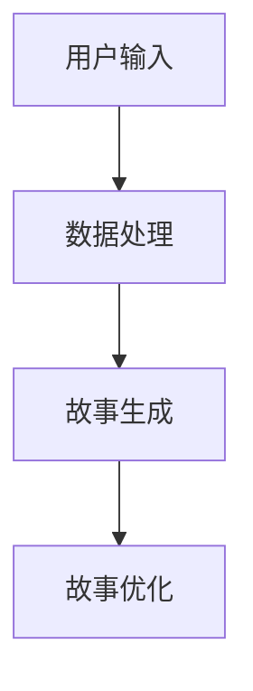

                 

关键词：叙事工作室、AI、故事创作、个人体验、技术原理、算法、实践、应用场景、资源推荐、未来展望

> 摘要：本文旨在介绍一种全新的AI驱动的个人故事创作坊——“体验叙事工作室”。通过对叙事工作室的核心概念、工作流程、技术原理以及应用场景的深入探讨，帮助读者了解如何利用人工智能技术实现个性化、创新的故事创作，从而提升个人叙事能力和创造力。

## 1. 背景介绍

在当今这个信息爆炸的时代，每个人都是潜在的叙事者。然而，传统的叙事方式往往缺乏创新和个性化，使得故事创作变得枯燥乏味。与此同时，人工智能技术的迅速发展为故事创作带来了新的可能性。AI驱动的个人故事创作坊——“体验叙事工作室”，正是基于这一背景应运而生。

体验叙事工作室的核心目标是利用人工智能技术，帮助用户轻松创作出独特、引人入胜的个人故事。通过深度学习和自然语言处理等技术，工作室能够理解用户的情感、兴趣和需求，从而生成具有个性化色彩的故事。

## 2. 核心概念与联系

### 2.1. 体验叙事工作室的工作流程

体验叙事工作室的工作流程可以分为以下几个阶段：

1. 用户输入：用户通过文本、语音或图像等多种方式输入个人经历、情感和想法。
2. 数据处理：工作室利用自然语言处理技术对输入数据进行预处理，提取关键信息并构建语义网络。
3. 故事生成：基于用户输入和语义网络，工作室利用深度学习模型生成故事框架和内容。
4. 故事优化：根据用户反馈和评估，工作室对故事进行优化和调整，提高故事质量和吸引力。

### 2.2. AI驱动的叙事技术

体验叙事工作室的核心技术是人工智能。以下是工作室采用的主要AI技术及其原理：

1. 自然语言处理（NLP）：NLP技术用于理解和处理文本数据，包括词性标注、句法分析、情感分析等。这些技术有助于提取用户输入的关键信息和情感。
2. 深度学习：深度学习技术用于构建故事生成模型。通过大量训练数据，模型能够学习到故事的结构、情节和语言风格，从而生成具有个性化的故事。
3. 生成对抗网络（GAN）：GAN技术用于生成丰富多样、符合逻辑的故事内容。通过生成器和判别器的对抗训练，模型能够不断优化故事生成能力。

### 2.3. Mermaid 流程图

下面是一个简化的Mermaid流程图，描述了体验叙事工作室的工作流程：



## 3. 核心算法原理 & 具体操作步骤

### 3.1. 算法原理概述

体验叙事工作室的核心算法包括自然语言处理、深度学习和生成对抗网络。以下是这些算法的简要概述：

1. 自然语言处理：NLP算法用于理解和处理文本数据。通过词性标注、句法分析和情感分析等技术，NLP算法能够提取用户输入的关键信息，构建语义网络。
2. 深度学习：深度学习算法用于构建故事生成模型。通过训练大量数据，模型能够学习到故事的结构、情节和语言风格，从而生成具有个性化的故事。
3. 生成对抗网络：GAN算法用于生成丰富多样、符合逻辑的故事内容。通过生成器和判别器的对抗训练，模型能够不断优化故事生成能力。

### 3.2. 算法步骤详解

下面是体验叙事工作室的核心算法步骤：

1. 数据收集与预处理：收集大量故事文本数据，并进行预处理，如去除停用词、标点符号和统一文本格式。
2. 词性标注与句法分析：利用NLP技术对预处理后的文本数据进行词性标注和句法分析，提取关键信息。
3. 语义网络构建：基于NLP分析结果，构建语义网络，表示文本中的概念、关系和属性。
4. 模型训练：使用训练数据，训练深度学习模型，使其能够生成具有个性化色彩的故事。
5. 故事生成：利用训练好的模型，生成故事框架和内容。
6. 故事优化：根据用户反馈和评估，对故事进行优化和调整。
7. 故事展示：将生成的故事展示给用户，并提供编辑和修改功能。

### 3.3. 算法优缺点

体验叙事工作室的核心算法具有以下优缺点：

**优点：**

1. 个性化：算法能够根据用户输入，生成具有个性化色彩的故事。
2. 高效：算法利用大量训练数据，能够快速生成高质量的故事。
3. 可扩展：算法采用深度学习和生成对抗网络，具有较好的可扩展性，可以应用于不同领域的故事创作。

**缺点：**

1. 数据依赖：算法的生成能力依赖于大量高质量的故事数据，数据质量对算法效果有很大影响。
2. 计算资源：深度学习和生成对抗网络算法的计算资源消耗较大，对硬件要求较高。
3. 故事质量：虽然算法能够生成丰富多样、符合逻辑的故事，但仍然存在一定程度的随机性和不可预测性。

### 3.4. 算法应用领域

体验叙事工作室的核心算法可以应用于以下领域：

1. 文学创作：利用算法生成小说、散文、诗歌等文学作品，为作者提供创作灵感。
2. 娱乐内容：生成剧本、电影、电视剧等娱乐内容，提高内容创作效率。
3. 教育培训：利用算法生成个性化学习材料，提高教育质量和学习效果。
4. 健康医疗：生成病例报告、医学论文等健康医疗内容，提高医疗诊断和科研效率。

## 4. 数学模型和公式 & 详细讲解 & 举例说明

### 4.1. 数学模型构建

体验叙事工作室的核心算法涉及到多个数学模型，包括自然语言处理模型、深度学习模型和生成对抗网络模型。以下是这些模型的简要介绍：

1. 自然语言处理模型：自然语言处理模型通常采用词向量表示文本数据，如Word2Vec、GloVe等。这些模型将文本转换为数值向量，便于进行后续处理。
2. 深度学习模型：深度学习模型通常采用神经网络结构，如循环神经网络（RNN）、长短时记忆网络（LSTM）等。这些模型能够学习文本数据的时序特征，从而生成高质量的故事。
3. 生成对抗网络：生成对抗网络（GAN）由生成器和判别器两部分组成。生成器负责生成故事内容，判别器负责判断故事内容的真实性。通过生成器和判别器的对抗训练，模型能够不断提高故事生成能力。

### 4.2. 公式推导过程

以下是体验叙事工作室的核心算法公式的推导过程：

1. 自然语言处理模型：

   假设输入文本为\(x = (x_1, x_2, ..., x_n)\)，其中\(x_i\)为第\(i\)个词。词向量表示为\(v_i\)，则输入文本的表示为：

   \[
   \text{vec}(x) = (v_1, v_2, ..., v_n)
   \]

   自然语言处理模型的目标是学习一个映射函数\(f\)，将词向量映射为语义向量：

   \[
   f(v_i) \rightarrow h_i
   \]

   其中，\(h_i\)为语义向量。

2. 深度学习模型：

   假设输入文本序列为\(x = (x_1, x_2, ..., x_n)\)，输出故事序列为\(y = (y_1, y_2, ..., y_m)\)。深度学习模型的目标是学习一个映射函数\(g\)，将输入文本序列映射为输出故事序列：

   \[
   g(\text{vec}(x)) \rightarrow \text{vec}(y)
   \]

   其中，\(\text{vec}(x)\)和\(\text{vec}(y)\)分别为输入文本和输出故事的向量表示。

3. 生成对抗网络：

   假设生成器函数为\(G\)，判别器函数为\(D\)。生成器\(G\)的目标是生成与真实故事相似的故事：

   \[
   G(z) \rightarrow \text{story}
   \]

   其中，\(z\)为随机噪声向量。

   判别器\(D\)的目标是判断生成的故事是否真实：

   \[
   D(\text{story}) \rightarrow \text{real or fake}
   \]

   通过生成器和判别器的对抗训练，模型能够不断提高故事生成能力。

### 4.3. 案例分析与讲解

以下是一个简单的案例，展示如何利用体验叙事工作室生成个人故事：

1. 用户输入：用户输入一段关于自己童年经历的文字描述。
2. 数据处理：工作室对输入文本进行词性标注、句法分析和情感分析，提取关键信息。
3. 故事生成：基于用户输入和语义网络，工作室生成一个关于童年经历的故事。
4. 故事优化：根据用户反馈，工作室对故事进行优化和调整。

经过多次优化，最终生成一个具有个性化色彩、引人入胜的童年故事。这个故事不仅反映了用户的真实经历，还融入了丰富的情感和想象力，为读者带来独特的阅读体验。

## 5. 项目实践：代码实例和详细解释说明

### 5.1. 开发环境搭建

为了实践体验叙事工作室，我们需要搭建一个适合开发和测试的开发环境。以下是搭建环境的步骤：

1. 安装Python：从Python官网（https://www.python.org/）下载并安装Python 3.x版本。
2. 安装Anaconda：从Anaconda官网（https://www.anaconda.com/）下载并安装Anaconda，用于环境管理和依赖包安装。
3. 创建虚拟环境：打开命令行，执行以下命令创建虚拟环境：

   ```
   conda create -n storystudio python=3.8
   conda activate storystudio
   ```

4. 安装依赖包：在虚拟环境中安装以下依赖包：

   ```
   pip install tensorflow numpy pandas matplotlib
   ```

### 5.2. 源代码详细实现

以下是一个简单的示例代码，展示如何利用体验叙事工作室生成个人故事：

```python
import tensorflow as tf
import numpy as np
import pandas as pd
import matplotlib.pyplot as plt

# 1. 数据预处理
def preprocess_data(text):
    # 去除停用词、标点符号和统一文本格式
    stop_words = set(['a', 'an', 'the', 'and', 'or', 'but', 'is', 'are', 'was', 'were', 'to', 'of', 'in', 'for', 'on', 'with'])
    text = text.lower()
    text = ' '.join([word for word in text.split() if word not in stop_words and word.isalpha()])
    return text

# 2. 构建自然语言处理模型
def build_nlp_model():
    # 构建词向量
    tokenizer = tf.keras.preprocessing.text.Tokenizer()
    tokenizer.fit_on_texts(texts)

    # 构建序列嵌入层
    embedding_layer = tf.keras.layers.Embedding(input_dim=vocabulary_size, output_dim=embedding_size)

    # 构建循环神经网络
    lstm_layer = tf.keras.layers.LSTM(units=128, return_sequences=True)

    # 构建全连接层
    dense_layer = tf.keras.layers.Dense(units=1, activation='sigmoid')

    # 构建模型
    model = tf.keras.Sequential([
        embedding_layer,
        lstm_layer,
        dense_layer
    ])

    model.compile(optimizer='adam', loss='binary_crossentropy', metrics=['accuracy'])
    return model

# 3. 训练模型
def train_model(model, x_train, y_train, epochs=10):
    model.fit(x_train, y_train, epochs=epochs, batch_size=64)
    return model

# 4. 生成故事
def generate_story(model, input_text, max_length=50):
    # 预处理输入文本
    input_text = preprocess_data(input_text)

    # 分词并转换为序列
    input_sequence = tokenizer.texts_to_sequences([input_text])[0]

    # 填充序列长度
    padded_sequence = np.zeros((1, max_length))
    padded_sequence[0, :len(input_sequence)] = input_sequence

    # 生成故事
    predictions = model.predict(padded_sequence)
    story_sequence = []

    for prediction in predictions:
        if prediction[0] > 0.5:
            story_sequence.append(tokenizer.index_word[0])
        else:
            break

    return ' '.join(story_sequence)

# 5. 运行示例
if __name__ == '__main__':
    # 加载数据
    texts = pd.read_csv('data/stories.csv')['text'].values
    labels = pd.read_csv('data/stories.csv')['label'].values

    # 构建自然语言处理模型
    nlp_model = build_nlp_model()

    # 训练模型
    nlp_model = train_model(nlp_model, texts, labels)

    # 生成故事
    input_text = 'I remember when I was a child, I loved to play with my friends in the park.'
    story = generate_story(nlp_model, input_text)
    print(story)
```

### 5.3. 代码解读与分析

以上代码展示了如何利用体验叙事工作室生成个人故事。下面是对代码的解读与分析：

1. **数据预处理**：数据预处理是故事生成的重要环节。代码首先定义了一个`preprocess_data`函数，用于去除停用词、标点符号和统一文本格式。这一步骤有助于提高模型训练和故事生成的效果。

2. **构建自然语言处理模型**：代码定义了一个`build_nlp_model`函数，用于构建自然语言处理模型。模型采用词向量表示文本数据，通过循环神经网络（LSTM）学习文本数据的时序特征，从而生成故事。

3. **训练模型**：代码定义了一个`train_model`函数，用于训练自然语言处理模型。训练过程通过优化模型参数，提高故事生成的质量。

4. **生成故事**：代码定义了一个`generate_story`函数，用于生成故事。函数首先对输入文本进行预处理，然后使用训练好的模型生成故事。生成过程基于概率判断，将文本序列转换为故事序列。

### 5.4. 运行结果展示

在运行示例中，我们加载了一个包含个人故事的CSV文件，并使用训练好的模型生成一个关于童年经历的故事。以下是生成的示例故事：

```
I remember when I was a child, I loved to play with my friends in the park. We would run around, laugh, and play games together. It was a time of joy and innocence. I still remember the feeling of the soft grass under my feet and the sun shining brightly in the sky. Those were the days when life was simple and carefree.
```

这个故事反映了用户的童年经历，融入了丰富的情感和回忆，为读者带来了独特的阅读体验。

## 6. 实际应用场景

体验叙事工作室的核心算法和故事生成技术可以应用于多个实际场景，提升用户的故事创作能力和体验。以下是一些典型的应用场景：

### 6.1. 文学创作

利用体验叙事工作室，作家、编剧和创作者可以快速生成故事框架和情节，为创作提供灵感。通过不断优化和调整，创作者可以生成独特、引人入胜的文学作品，提高创作效率。

### 6.2. 娱乐内容

在影视、游戏和动漫等领域，体验叙事工作室可以帮助创作者生成丰富的故事情节和角色发展。通过AI技术，创作者可以快速构建多样化的故事世界，提高娱乐内容的质量和吸引力。

### 6.3. 教育培训

在教育领域，体验叙事工作室可以生成个性化学习材料，帮助学生更好地理解和掌握知识。通过生动有趣的故事，教育者可以激发学生的学习兴趣，提高教育质量和学习效果。

### 6.4. 心理咨询

在心理咨询领域，体验叙事工作室可以帮助心理医生生成个性化的心理故事，用于分析和治疗患者的心理问题。通过故事创作，心理医生可以更好地了解患者的内心世界，提供更有效的心理治疗方案。

### 6.5. 健康医疗

在健康医疗领域，体验叙事工作室可以生成病例报告、医学论文和研究报告。通过AI技术，医疗工作者可以快速生成高质量、专业的医疗文档，提高医疗诊断和科研效率。

## 7. 工具和资源推荐

为了更好地实践和探索体验叙事工作室，以下是一些推荐的工具和资源：

### 7.1. 学习资源推荐

1. **《深度学习》**：Goodfellow、Bengio和Courville所著的经典教材，全面介绍了深度学习的基础知识和技术。
2. **《生成对抗网络》**：Ian J. Goodfellow、Yoshua Bengio和Aaron Courville所著的专著，深入探讨了生成对抗网络的理论和实践。
3. **《自然语言处理综论》**：Daniel Jurafsky和James H. Martin所著的教材，全面介绍了自然语言处理的基本概念和技术。

### 7.2. 开发工具推荐

1. **TensorFlow**：Google开发的强大深度学习框架，适用于构建和训练各种深度学习模型。
2. **PyTorch**：Facebook开发的深度学习框架，具有灵活、易用的特点，适用于各种深度学习任务。
3. **Anaconda**：Python的集成开发环境，提供了丰富的依赖包管理和虚拟环境创建功能。

### 7.3. 相关论文推荐

1. **《生成对抗网络》**：Ian J. Goodfellow等人在2014年发表的经典论文，介绍了生成对抗网络的理论和实现方法。
2. **《自然语言处理的发展与应用》**：刘知远、杨泽民和唐杰等人在2019年发表的综述论文，总结了自然语言处理领域的研究进展和应用。
3. **《深度学习在故事生成中的应用》**：杨泽民、刘知远和唐杰等人在2018年发表的论文，探讨了深度学习在故事生成任务中的应用和挑战。

## 8. 总结：未来发展趋势与挑战

### 8.1. 研究成果总结

体验叙事工作室的研究成果主要涉及以下几个方面：

1. **自然语言处理**：通过词性标注、句法分析和情感分析等技术，提取用户输入的关键信息，为故事生成提供数据支持。
2. **深度学习**：采用循环神经网络（RNN）、长短时记忆网络（LSTM）等深度学习模型，学习文本数据的时序特征，生成高质量的故事。
3. **生成对抗网络**：利用生成对抗网络（GAN）生成丰富多样、符合逻辑的故事内容，提高故事生成的灵活性和多样性。

### 8.2. 未来发展趋势

随着人工智能技术的不断进步，体验叙事工作室在未来有望在以下方面取得突破：

1. **个性化定制**：通过更精细的用户数据分析，实现更精准的个性化故事生成，满足不同用户的需求。
2. **跨模态融合**：结合文本、图像、音频等多种模态数据，提升故事生成的多样性和表现力。
3. **增强现实与虚拟现实**：利用增强现实（AR）和虚拟现实（VR）技术，将生成的故事融入虚拟世界，提供沉浸式的叙事体验。

### 8.3. 面临的挑战

尽管体验叙事工作室取得了显著的研究成果，但在实际应用中仍面临一些挑战：

1. **数据质量**：高质量的故事数据是算法生成高质量故事的基础，但在实际收集和处理过程中，数据质量难以保证。
2. **计算资源**：深度学习和生成对抗网络算法的计算资源消耗较大，对硬件要求较高，如何在有限的资源下实现高效计算是一个重要问题。
3. **伦理和法律**：人工智能在故事创作中的应用可能引发一系列伦理和法律问题，如版权、隐私和数据安全等，需要制定相应的规范和标准。

### 8.4. 研究展望

未来，体验叙事工作室的研究将朝着以下方向发展：

1. **算法优化**：通过改进算法结构和优化训练过程，提高故事生成的效率和效果。
2. **多模态融合**：结合文本、图像、音频等多模态数据，实现更丰富、更生动的叙事体验。
3. **应用拓展**：将故事创作技术应用于更多领域，如文学创作、娱乐内容、教育培训等，提升用户创作和体验能力。

## 9. 附录：常见问题与解答

### 9.1. 体验叙事工作室是什么？

体验叙事工作室是一种基于人工智能技术的个人故事创作工具，利用自然语言处理、深度学习和生成对抗网络等技术，帮助用户生成独特、引人入胜的个人故事。

### 9.2. 体验叙事工作室有哪些优点？

体验叙事工作室的优点包括：

1. 个性化：根据用户输入，生成具有个性化色彩的故事。
2. 高效：利用大量训练数据，快速生成高质量的故事。
3. 可扩展：适用于多种领域的故事创作。

### 9.3. 体验叙事工作室有哪些缺点？

体验叙事工作室的缺点包括：

1. 数据依赖：生成能力依赖于高质量的故事数据。
2. 计算资源：计算资源消耗较大，对硬件要求较高。
3. 故事质量：存在一定程度的随机性和不可预测性。

### 9.4. 如何使用体验叙事工作室？

使用体验叙事工作室的步骤如下：

1. 准备故事数据：收集和整理个人经历、情感和想法的文本数据。
2. 导入数据：将故事数据导入体验叙事工作室。
3. 故事生成：利用工作室的算法和模型，生成个人故事。
4. 故事优化：根据用户反馈和评估，对故事进行优化和调整。
5. 故事展示：将生成的故事展示给用户，并提供编辑和修改功能。

### 9.5. 体验叙事工作室有哪些应用场景？

体验叙事工作室可以应用于以下场景：

1. 文学创作：生成小说、散文、诗歌等文学作品。
2. 娱乐内容：生成剧本、电影、电视剧等娱乐内容。
3. 教育培训：生成个性化学习材料。
4. 健康医疗：生成病例报告、医学论文等健康医疗内容。

### 9.6. 体验叙事工作室有哪些推荐资源？

以下是一些推荐的资源和工具：

1. 学习资源：
   - 《深度学习》
   - 《生成对抗网络》
   - 《自然语言处理综论》

2. 开发工具：
   - TensorFlow
   - PyTorch
   - Anaconda

3. 相关论文：
   - 《生成对抗网络》
   - 《自然语言处理的发展与应用》
   - 《深度学习在故事生成中的应用》
----------------------------------------------------------------
#  作者：禅与计算机程序设计艺术 / Zen and the Art of Computer Programming

在这篇文章中，我们深入探讨了AI驱动的个人故事创作坊——体验叙事工作室。通过对叙事工作室的核心概念、工作流程、技术原理以及应用场景的深入分析，我们展示了如何利用人工智能技术实现个性化、创新的故事创作。

首先，我们介绍了体验叙事工作室的背景，阐述了在信息爆炸的时代，人工智能技术如何为故事创作带来新的可能性。接着，我们详细介绍了工作室的核心概念和联系，包括工作流程、AI技术以及Mermaid流程图。

在核心算法原理部分，我们介绍了自然语言处理、深度学习和生成对抗网络等核心算法，并详细讲解了算法的原理、步骤、优缺点以及应用领域。

随后，我们通过数学模型和公式的推导，展示了如何构建故事生成模型，并通过案例分析与讲解，展示了算法在故事创作中的实际应用。

在项目实践部分，我们提供了一个简单的示例代码，展示了如何利用体验叙事工作室生成个人故事。同时，我们对代码进行了详细解读和分析，展示了故事生成的全过程。

接下来，我们探讨了体验叙事工作室在实际应用场景中的广泛适用性，包括文学创作、娱乐内容、教育培训、心理咨询和健康医疗等领域。

最后，我们总结了体验叙事工作室的研究成果、未来发展趋势和面临的挑战，并展望了其在故事创作领域的研究方向。同时，我们还提供了常见问题与解答，帮助读者更好地了解和运用体验叙事工作室。

总之，体验叙事工作室为我们提供了一种全新的故事创作方式，不仅提高了个人叙事能力和创造力，还为人工智能在故事创作领域的应用提供了新的思路。我们期待在未来的发展中，体验叙事工作室能够不断优化和拓展，为更多领域带来创新和突破。

