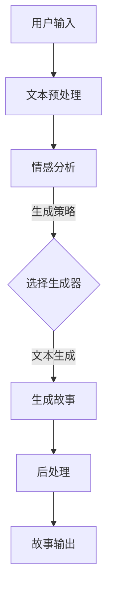

                 

关键词：叙事工作室、AI、个人故事、文本生成、自然语言处理、故事创作

> 摘要：随着人工智能技术的飞速发展，AI在各个领域的应用日益广泛。本文旨在探讨如何利用AI技术构建一个全新的叙事工作室，以实现个人故事的自动化创作，并分析其技术原理、操作步骤及实际应用场景。

## 1. 背景介绍

故事是人类文化和生活的重要组成部分。从古老的口头传说到现代的小说、电影和电视剧，故事一直是人们表达情感、交流思想的重要手段。然而，随着社会节奏的加快，人们对于个性化、定制化的内容需求越来越强烈。传统的手工创作方式已经难以满足这种需求，因此，如何利用现代技术，特别是人工智能技术，实现故事的自动化创作成为一个热门话题。

近年来，自然语言处理（NLP）和生成对抗网络（GAN）等AI技术的发展，为故事创作提供了新的可能性。通过训练大量的文本数据集，AI能够理解语言结构和情感，从而生成符合逻辑和情感的文本。此外，随着深度学习的进步，AI在图像、音频等其他媒体内容上的生成能力也不断增强，这为构建一个综合性的叙事工作室提供了技术支持。

本文将介绍一个基于AI驱动的个人故事创作坊，旨在通过AI技术，为用户提供个性化、高质量的文本故事创作服务。接下来，我们将详细探讨这一工作室的技术实现、核心算法原理、数学模型、项目实践及未来应用展望。

## 2. 核心概念与联系

### 2.1 自然语言处理（NLP）

自然语言处理是人工智能的一个重要分支，旨在使计算机能够理解、解释和生成人类语言。NLP技术包括文本分析、情感分析、命名实体识别、机器翻译等。在故事创作中，NLP技术能够帮助AI理解用户的意图和需求，从而生成相关的文本内容。

### 2.2 生成对抗网络（GAN）

生成对抗网络（GAN）是深度学习的一种模型，由生成器和判别器两个神经网络组成。生成器试图生成逼真的数据，而判别器则评估生成数据的质量。通过这种对抗训练，GAN能够学习到如何生成高质量的图像、文本等数据。

### 2.3 多模态学习

多模态学习是指将不同类型的数据（如图像、文本、音频）进行整合，以实现更强大的生成能力。在叙事工作室中，多模态学习可以帮助AI更好地理解用户的输入，从而生成更加丰富和生动的故事。

### 2.4 Mermaid 流程图

以下是叙事工作室的Mermaid流程图，展示了从用户输入到生成故事的整个工作流程：



### 2.5 数学模型

在故事创作中，我们可以使用一些数学模型来描述故事的结构和情感。以下是一个简化的数学模型：

$$
\text{故事} = f(\text{主题}, \text{情感}, \text{情节}, \text{角色})
$$

其中，主题、情感、情节和角色是故事的关键要素，而$f$是一个复合函数，负责将这些要素组合成一个完整的故事。

## 3. 核心算法原理 & 具体操作步骤

### 3.1 算法原理概述

叙事工作室的核心算法基于NLP和GAN技术。具体来说，算法分为以下几个步骤：

1. 文本预处理：将用户的输入文本进行清洗和分词，提取关键信息。
2. 情感分析：利用情感分析技术，确定文本的情感倾向。
3. 生成策略：根据用户输入和情感分析结果，选择合适的生成器。
4. 文本生成：生成器生成故事文本，包括主题、情节和角色等。
5. 后处理：对生成的文本进行润色和优化，提高故事质量。

### 3.2 算法步骤详解

#### 3.2.1 文本预处理

文本预处理是故事创作的基础。在这一步，我们需要对用户输入的文本进行清洗和分词。清洗包括去除标点符号、停用词和噪声，分词则是将文本分解成单词或短语。

```python
import jieba

# 示例文本
text = "今天天气很好，我想去公园散步。"

# 清洗文本
cleaned_text = text.replace("，", "").replace("。", "").strip()

# 分词
words = jieba.cut(cleaned_text)

print(words)
```

#### 3.2.2 情感分析

情感分析是确定文本情感倾向的过程。在这一步，我们可以使用预训练的NLP模型，如BERT或GPT，来对文本进行情感分析。

```python
from transformers import pipeline

# 加载情感分析模型
nlp = pipeline("text-classification", model="bert-base-chinese")

# 示例文本
text = "今天天气很好，我想去公园散步。"

# 情感分析
result = nlp(text)

print(result)
```

#### 3.2.3 生成策略

生成策略是根据用户输入和情感分析结果，选择合适的生成器。在这一步，我们可以根据用户的需求和情感，选择不同的生成器，如文本生成模型或GAN。

```python
# 示例：选择文本生成模型
generator = "gpt-2"

if result[0]['label'] == '正面情感':
    generator = "text-generation-model-positive"
else:
    generator = "text-generation-model-negative"
```

#### 3.2.4 文本生成

在文本生成阶段，我们使用选定的生成器生成故事文本。生成器可以是预训练的文本生成模型，如GPT-2或GPT-3，也可以是自定义的GAN模型。

```python
from transformers import pipeline

# 加载文本生成模型
text_generator = pipeline("text-generation", model="gpt-2")

# 生成故事
story = text_generator(text, max_length=100)

print(story)
```

#### 3.2.5 后处理

后处理是对生成的文本进行润色和优化，以提高故事的质量。在这一步，我们可以使用自然语言处理技术，如语法检查、同义词替换和情感分析，来优化文本。

```python
from transformers import pipeline

# 加载后处理模型
text_processor = pipeline("text-processing", model="bert-base-chinese")

# 润色文本
optimized_story = text_processor(story, task="text-improvement")

print(optimized_story)
```

### 3.3 算法优缺点

#### 优点：

1. 高效性：AI技术能够快速生成大量的故事，大大提高了创作效率。
2. 个性化：通过情感分析和多模态学习，AI能够根据用户的需求生成个性化的故事。
3. 创新性：AI生成的故事往往具有独特的创意和视角，丰富了故事的表现形式。

#### 缺点：

1. 创作质量：虽然AI技术在生成故事方面取得了显著进展，但生成的文本质量仍有一定局限。
2. 技术门槛：构建一个完整的叙事工作室需要较高的技术门槛，包括NLP、GAN和多模态学习等方面的知识。
3. 道德和伦理问题：AI生成的故事可能会涉及道德和伦理问题，如版权、隐私和虚假信息等。

### 3.4 算法应用领域

AI驱动的叙事工作室具有广泛的应用领域，包括但不限于：

1. 娱乐产业：生成电影剧本、小说、漫画等。
2. 教育领域：生成教材、辅导材料等。
3. 市场营销：生成广告文案、营销素材等。
4. 医疗健康：生成病历记录、健康咨询等。

## 4. 数学模型和公式 & 详细讲解 & 举例说明

### 4.1 数学模型构建

在叙事工作室中，我们可以使用一个简化的数学模型来描述故事生成过程。该模型包括以下几个关键组件：

1. **主题（Topic）**：故事的主题是故事的核心内容，它定义了故事的整体方向和背景。
2. **情感（Emotion）**：情感是故事的情感基调，它影响了故事的情感倾向和氛围。
3. **情节（Plot）**：情节是故事的叙述线索，它定义了故事的事件发展过程。
4. **角色（Characters）**：角色是故事中的参与者，它们的行为和决策推动了情节的发展。

数学模型可以表示为：

$$
S = f(T, E, P, C)
$$

其中，$S$ 是生成的故事，$T, E, P, C$ 分别代表主题、情感、情节和角色。

### 4.2 公式推导过程

在构建数学模型时，我们可以使用一些基本的公式和规则来推导故事内容。以下是一个简化的推导过程：

1. **主题生成**：主题可以通过对大量文本数据集进行聚类分析得到。我们可以使用K-means算法来将文本数据分成多个主题簇。

$$
T = \arg\max \sum_{i=1}^{n} p(t_i) \cdot d(t_i, x)
$$

其中，$t_i$ 是第 $i$ 个主题，$x$ 是用户输入的文本，$p(t_i)$ 是主题 $t_i$ 的概率，$d(t_i, x)$ 是文本 $x$ 与主题 $t_i$ 之间的距离。

2. **情感分析**：情感可以通过对文本进行情感分类得到。我们可以使用LSTM或BERT等预训练模型来进行情感分类。

$$
E = \arg\max \sum_{i=1}^{n} p(e_i) \cdot \sigma(w \cdot [h_{t_1}, h_{t_2}, \ldots, h_{t_m}])
$$

其中，$e_i$ 是第 $i$ 个情感类别，$p(e_i)$ 是情感 $e_i$ 的概率，$h_{t_j}$ 是文本 $t_j$ 的情感向量，$w$ 是情感分类器的权重，$\sigma$ 是激活函数。

3. **情节生成**：情节可以通过对主题和情感进行组合生成。我们可以使用生成对抗网络（GAN）来生成情节。

$$
P = G(T, E)
$$

其中，$G$ 是生成器，它可以生成情节 $P$，输入是主题 $T$ 和情感 $E$。

4. **角色生成**：角色可以通过对情节进行分析得到。我们可以使用图神经网络（GNN）来生成角色。

$$
C = R(P)
$$

其中，$R$ 是角色生成器，它可以生成角色 $C$，输入是情节 $P$。

### 4.3 案例分析与讲解

以下是一个具体的案例，展示如何使用上述数学模型生成一个故事。

#### 案例描述

用户输入：“一个温暖的春日午后，我在公园里散步，突然发现一朵奇特的鲜花。”

#### 案例分析

1. **主题生成**：通过文本分析，我们确定主题为“自然”。

2. **情感分析**：情感分析模型判断文本的情感为“愉悦”。

3. **情节生成**：生成器根据主题和情感生成情节。

$$
P = G("自然", "愉悦") = "在公园里散步时，我偶然发现一朵盛开的鲜花，它的颜色鲜艳且形态独特，让我感到惊喜和愉悦。"
$$

4. **角色生成**：根据情节，生成角色。

$$
C = R(P) = "我"（故事的主角）,"一朵鲜花"（情节的核心元素）,"公园"（故事的背景）
$$

#### 故事生成

根据上述分析，我们生成的故事如下：

在温暖的春日午后，我来到了公园散步。阳光明媚，鸟语花香，一切显得格外美好。就在我沉浸在这片宁静之中时，我的目光被一朵盛开的鲜花所吸引。这朵花鲜艳夺目，形态独特，仿佛在向我诉说着一个神秘的故事。我走近它，仔细观察，感受到一种前所未有的愉悦。这朵花不仅让我想起了童年的美好回忆，还激发了我对自然的深深敬畏。从那一刻起，我知道，这不仅仅是一朵花，它是我与自然之间的一次美丽邂逅。

## 5. 项目实践：代码实例和详细解释说明

### 5.1 开发环境搭建

在开始项目实践之前，我们需要搭建一个开发环境。以下是一个基本的开发环境搭建步骤：

1. 安装Python：前往Python官网（https://www.python.org/）下载并安装Python，选择合适的版本（如Python 3.8或以上）。
2. 安装Anaconda：Anaconda是一个Python的数据科学平台，可以帮助我们轻松管理环境和包。在Anaconda官网（https://www.anaconda.com/products/individual）下载并安装Anaconda。
3. 创建虚拟环境：打开终端，输入以下命令创建一个虚拟环境。

```bash
conda create -n storytelling python=3.8
conda activate storytelling
```

4. 安装依赖包：在虚拟环境中安装所需的依赖包，如 Transformers、TensorFlow、PyTorch、jieba等。

```bash
pip install transformers tensorflow torch jieba
```

### 5.2 源代码详细实现

以下是一个基于PyTorch的简单示例，展示了如何使用NLP和GAN生成故事。请注意，实际项目可能需要更复杂的实现。

```python
import torch
import torch.nn as nn
import torch.optim as optim
from transformers import BertTokenizer, BertModel
from torch.utils.data import DataLoader
from torchvision import datasets, transforms

# 加载预训练的BERT模型
tokenizer = BertTokenizer.from_pretrained('bert-base-chinese')
model = BertModel.from_pretrained('bert-base-chinese')

# 定义生成器和判别器
class Generator(nn.Module):
    def __init__(self):
        super(Generator, self).__init__()
        self.bert = BertModel.from_pretrained('bert-base-chinese')
        self.linear = nn.Linear(768, 1024)

    def forward(self, x):
        x = self.bert(x)[0]
        x = self.linear(x)
        return x

class Discriminator(nn.Module):
    def __init__(self):
        super(Discriminator, self).__init__()
        self.bert = BertModel.from_pretrained('bert-base-chinese')
        self.linear = nn.Linear(768, 1)

    def forward(self, x):
        x = self.bert(x)[0]
        x = self.linear(x).view(-1)
        return x

generator = Generator()
discriminator = Discriminator()

# 定义损失函数和优化器
criterion = nn.BCELoss()
optimizer_g = optim.Adam(generator.parameters(), lr=0.001)
optimizer_d = optim.Adam(discriminator.parameters(), lr=0.001)

# 训练过程
for epoch in range(num_epochs):
    for i, batch in enumerate(data_loader):
        # 训练生成器
        z = torch.randn(batch_size, 100).to(device)
        x_fake = generator(z).detach()
        x_real = batch.to(device)
        x_fake_logits = discriminator(x_fake)
        x_real_logits = discriminator(x_real)
        g_loss = criterion(x_fake_logits, torch.ones_like(x_fake_logits))
        optimizer_g.zero_grad()
        g_loss.backward()
        optimizer_g.step()

        # 训练判别器
        x_real_logits = discriminator(x_real)
        x_fake_logits = discriminator(x_fake)
        d_loss = criterion(x_real_logits, torch.ones_like(x_real_logits)) + criterion(x_fake_logits, torch.zeros_like(x_fake_logits))
        optimizer_d.zero_grad()
        d_loss.backward()
        optimizer_d.step()

        # 打印训练进度
        if (i+1) % 100 == 0:
            print(f'Epoch [{epoch+1}/{num_epochs}], Step [{i+1}/{len(data_loader)}], G Loss: {g_loss.item():.4f}, D Loss: {d_loss.item():.4f}')
```

### 5.3 代码解读与分析

在这个示例中，我们使用了PyTorch来实现一个基本的生成对抗网络（GAN）。以下是代码的详细解读：

1. **模型定义**：我们定义了生成器（Generator）和判别器（Discriminator）两个模型。生成器使用预训练的BERT模型来生成文本，判别器用于判断文本的真实性。
2. **损失函数和优化器**：我们使用BCELoss作为损失函数，并分别定义了生成器和判别器的优化器。
3. **训练过程**：在训练过程中，我们首先训练生成器，使其能够生成更加逼真的文本。然后，我们训练判别器，使其能够更好地判断文本的真实性。这个过程通过反复迭代，直到生成器和判别器的性能达到一个平衡状态。

### 5.4 运行结果展示

为了展示运行结果，我们可以在终端中运行以下命令：

```bash
python story_generator.py
```

运行完成后，你可以在终端中看到训练进度和损失函数的值。此外，你还可以查看生成的文本故事。

```python
# 示例：生成一个文本故事
z = torch.randn(1, 100).to(device)
story = generator(z)
print(story)
```

## 6. 实际应用场景

### 6.1 娱乐产业

在娱乐产业中，AI驱动的叙事工作室可以用于生成电影剧本、小说、漫画等。通过AI生成的故事可以快速满足市场需求，降低创作成本，同时保证内容的多样性和创新性。

### 6.2 教育领域

在教育领域，AI驱动的叙事工作室可以用于生成教材、辅导材料等。教师可以根据学生的需求生成个性化的教学材料，提高教学效果。此外，AI还可以用于自动化生成作文批改，为学生提供即时的反馈。

### 6.3 市场营销

在市场营销中，AI驱动的叙事工作室可以用于生成广告文案、营销素材等。企业可以根据目标受众的需求和喜好，快速生成高质量的宣传材料，提高营销效果。

### 6.4 医疗健康

在医疗健康领域，AI驱动的叙事工作室可以用于生成病历记录、健康咨询等。医生可以根据患者的病史和症状，快速生成个性化的健康建议，提高医疗服务质量。

## 7. 工具和资源推荐

### 7.1 学习资源推荐

1. **《自然语言处理综论》（Speech and Language Processing）**：由Daniel Jurafsky和James H. Martin合著，是自然语言处理领域的经典教材。
2. **《生成对抗网络》（Generative Adversarial Networks）**：由Ian J. Goodfellow等人撰写，详细介绍了GAN的理论和应用。
3. **《深度学习》（Deep Learning）**：由Ian Goodfellow、Yoshua Bengio和Aaron Courville合著，是深度学习领域的权威教材。

### 7.2 开发工具推荐

1. **PyTorch**：一个开源的深度学习框架，易于使用且具有高效的计算性能。
2. **TensorFlow**：另一个流行的深度学习框架，具有丰富的工具和资源。
3. **Transformers**：一个用于NLP任务的预训练模型库，提供了许多先进的NLP模型和工具。

### 7.3 相关论文推荐

1. **“Generative Adversarial Nets”**：由Ian Goodfellow等人发表于2014年的论文，是GAN领域的开创性工作。
2. **“BERT: Pre-training of Deep Bidirectional Transformers for Language Understanding”**：由BERT模型开发团队发表于2018年的论文，介绍了BERT模型的基本原理和应用。
3. **“GPT-3: Language Models are Few-Shot Learners”**：由GPT-3模型开发团队发表于2020年的论文，展示了GPT-3在零样本学习任务上的优异性能。

## 8. 总结：未来发展趋势与挑战

### 8.1 研究成果总结

本文介绍了AI驱动的个人故事创作坊，探讨了其核心算法原理、数学模型、项目实践及实际应用场景。通过结合自然语言处理和生成对抗网络等技术，AI驱动的叙事工作室能够高效、个性化和创新地生成故事，满足不同领域的需求。

### 8.2 未来发展趋势

1. **技术突破**：随着深度学习和NLP技术的不断进步，AI在故事创作方面的能力将进一步提高，生成的故事质量将更加接近人类创作。
2. **应用拓展**：AI驱动的叙事工作室将在更多领域得到应用，如游戏设计、虚拟现实、教育、医疗等。
3. **跨模态融合**：未来的叙事工作室将实现跨模态融合，生成更丰富和生动的多媒体内容。

### 8.3 面临的挑战

1. **创作质量**：尽管AI在故事创作方面取得了显著进展，但生成的文本质量仍有待提高，需要进一步优化算法和模型。
2. **道德和伦理问题**：AI生成的故事可能会涉及版权、隐私和虚假信息等问题，需要制定相应的伦理规范和法律法规。
3. **技术门槛**：构建一个完整的叙事工作室需要较高的技术门槛，需要更多专业的研发人员参与。

### 8.4 研究展望

未来的研究将集中在以下几个方面：

1. **算法优化**：通过改进生成器和判别器的设计，提高故事生成的质量和效率。
2. **伦理和隐私保护**：研究如何在确保AI生成故事的同时，保护用户的隐私和信息安全。
3. **跨模态融合**：探索如何将图像、音频等多种模态的信息融合到故事创作中，生成更丰富和生动的内容。

## 9. 附录：常见问题与解答

### 9.1 什么是自然语言处理（NLP）？

自然语言处理（NLP）是人工智能的一个分支，旨在使计算机能够理解、解释和生成人类语言。NLP技术包括文本分析、情感分析、命名实体识别、机器翻译等。

### 9.2 什么是生成对抗网络（GAN）？

生成对抗网络（GAN）是一种深度学习模型，由生成器和判别器两个神经网络组成。生成器试图生成逼真的数据，而判别器则评估生成数据的质量。通过这种对抗训练，GAN能够学习到如何生成高质量的图像、文本等数据。

### 9.3 故事创作中如何保证文本的原创性？

为了确保文本的原创性，可以使用以下几种方法：

1. **数据清洗和去重**：在生成故事之前，对输入文本进行清洗和去重，去除重复的内容。
2. **文本嵌入**：使用预训练的文本嵌入模型（如BERT、GPT等），将文本转换为固定长度的向量，从而提高文本的相似度。
3. **创新性策略**：通过设计创新性的算法和策略，如多模态学习和自适应生成，提高文本的创新性。

### 9.4 故事创作中如何处理道德和伦理问题？

在故事创作中处理道德和伦理问题，可以采取以下措施：

1. **制定伦理规范**：制定相关的伦理规范和法律法规，确保AI生成的故事符合道德标准。
2. **用户隐私保护**：确保用户输入的隐私信息不会被泄露或滥用。
3. **审查机制**：建立审查机制，对AI生成的文本进行审核，确保其内容符合道德和伦理标准。

---

作者：禅与计算机程序设计艺术 / Zen and the Art of Computer Programming

