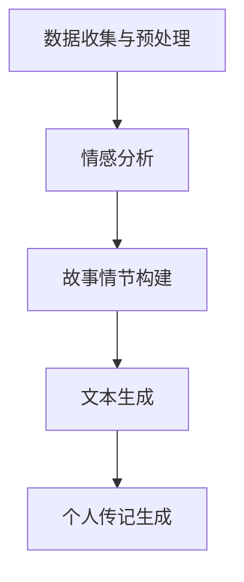

                 

关键字：叙事引擎，AI生成，个人传记，程序设计，人工智能，算法，数学模型，项目实践，应用场景，未来展望

> 摘要：本文深入探讨了叙事引擎程序员的角色，以及他们如何利用人工智能技术生成个人传记。通过介绍相关算法原理、数学模型、项目实践，分析其实际应用场景和未来展望，本文旨在为读者展示人工智能在程序设计领域的潜力和挑战。

## 1. 背景介绍

在当今数字时代，人工智能（AI）已经成为改变世界的重要力量。从自然语言处理到计算机视觉，AI技术正不断突破传统技术的限制，为各行各业带来创新和变革。在程序设计领域，AI技术的应用日益广泛，从代码生成到智能编程助手，程序员的工作方式正在经历深刻的变革。

叙事引擎是一种能够生成自然语言文本的AI系统。它通过机器学习算法，分析大量数据，自动构建故事情节和人物角色，从而生成引人入胜的叙事内容。随着AI技术的不断进步，叙事引擎已经能够应用于多个领域，包括游戏开发、虚拟现实、文学创作等。

本文将探讨叙事引擎程序员的角色，以及他们如何利用人工智能技术生成个人传记。个人传记作为一种特殊的叙事文本，不仅需要准确记录个人经历，还要生动展现人物的性格特点和情感波动。这对叙事引擎提出了更高的要求，同时也为AI技术在人文领域的应用提供了新的可能性。

## 2. 核心概念与联系

### 2.1 算法原理概述

叙事引擎程序员的核心任务是利用机器学习算法，从大量个人数据中提取信息，构建出具有个性化和真实感的个人传记。这一过程主要涉及以下关键步骤：

1. **数据收集与预处理**：叙事引擎首先需要收集个人数据，包括生活经历、情感记录、照片、视频等。然后对这些数据进行清洗和预处理，以便后续的分析和处理。

2. **情感分析**：通过对文本和图像的情感分析，叙事引擎能够识别个人经历中的情感波动，从而构建出人物的性格特点。

3. **故事情节构建**：基于情感分析和人物性格，叙事引擎会自动生成故事情节，将个人经历串联成一个连贯的叙事结构。

4. **文本生成**：最后，叙事引擎会使用自然语言生成技术，将故事情节转化为生动自然的文本内容。

### 2.2 架构与流程图

以下是叙事引擎程序员工作的架构与流程图：



在这个流程中，每个步骤都是构建个人传记的关键环节。数据收集与预处理为后续的分析提供基础，情感分析帮助识别人物的情感波动，故事情节构建则是将个人经历转化为叙事内容的核心步骤，而文本生成则是将故事转化为文本的关键。

## 3. 核心算法原理 & 具体操作步骤

### 3.1 算法原理概述

叙事引擎的核心算法包括自然语言处理（NLP）、情感分析和生成对抗网络（GAN）等。以下是这些算法的基本原理：

1. **自然语言处理（NLP）**：NLP技术用于理解和生成人类语言。在叙事引擎中，NLP算法用于解析文本数据，提取关键信息，如人物、事件、地点等。

2. **情感分析**：情感分析技术用于识别文本中的情感倾向，如快乐、悲伤、愤怒等。通过情感分析，叙事引擎能够了解个人经历中的情感波动，从而构建出更加真实的叙事内容。

3. **生成对抗网络（GAN）**：GAN是一种深度学习模型，由生成器和判别器组成。生成器负责生成文本，判别器则评估文本的真实性。通过反复训练，GAN能够生成出高质量的自然语言文本。

### 3.2 算法步骤详解

以下是生成个人传记的详细步骤：

1. **数据收集与预处理**：收集个人数据，包括文本、照片、视频等。对数据进行清洗和标注，确保数据的准确性和一致性。

2. **情感分析**：使用情感分析模型对文本和图像进行情感分析，提取情感标签。情感标签将用于后续的故事情节构建。

3. **故事情节构建**：基于情感分析和人物性格，使用图数据库构建故事情节。图数据库能够有效地表示复杂的关系和事件，有助于构建连贯的叙事结构。

4. **文本生成**：使用GAN模型生成个人传记的文本内容。生成器会根据故事情节和情感标签生成文本，判别器则评估文本的质量和真实性。

5. **文本优化**：对生成的文本进行优化，包括语法修正、内容丰富等，以提高文本的可读性和真实感。

### 3.3 算法优缺点

**优点**：

- **高效性**：叙事引擎能够快速地从大量个人数据中提取信息，生成个人传记。
- **个性化**：基于情感分析和人物性格，生成的个人传记具有高度个性化，能够真实地反映个人经历和情感。
- **创新性**：叙事引擎为个人传记创作提供了新的方式，打破了传统的写作模式，为文学创作带来了新的可能性。

**缺点**：

- **数据依赖性**：叙事引擎的性能依赖于数据的准确性和多样性。如果数据质量不佳，生成的个人传记可能存在偏差。
- **质量控制**：生成文本的质量难以保证，需要进一步优化和修正。
- **隐私问题**：个人数据的收集和处理可能引发隐私问题，需要严格保护用户隐私。

### 3.4 算法应用领域

叙事引擎在多个领域具有广泛的应用前景：

- **个人传记写作**：生成个性化的个人传记，为人们留下珍贵的回忆。
- **文学创作**：为作家提供辅助创作工具，提高文学作品的创作效率和质量。
- **心理咨询**：分析个人情感波动，为心理咨询提供数据支持。
- **教育**：通过生成个人传记，帮助学生更好地了解历史人物和时代背景。

## 4. 数学模型和公式 & 详细讲解 & 举例说明

### 4.1 数学模型构建

叙事引擎中的数学模型主要包括情感分析模型和生成对抗网络（GAN）。以下是这些模型的基本公式：

1. **情感分析模型**：

   - **文本情感极性分类**：$$P(y=c|w) = \frac{e^{w^T v_c}}{\sum_{c'\in C} e^{w^T v_{c'}}}$$

     其中，$w$ 是权重向量，$v_c$ 是情感类别$c$ 的特征向量，$P(y=c|w)$ 是文本分类为情感类别$c$ 的概率。

   - **文本情感强度分类**：$$P(y=c|w) = \frac{e^{w^T v_c}}{\sum_{c'\in C} e^{w^T v_{c'}}}$$

     其中，$w$ 是权重向量，$v_c$ 是情感类别$c$ 的特征向量，$P(y=c|w)$ 是文本分类为情感类别$c$ 的概率。

2. **生成对抗网络（GAN）**：

   - **生成器**：$$G(z) = \mu_z + \sigma_z \odot \phi(\beta_z)$$

     其中，$z$ 是噪声向量，$\mu_z$ 和 $\sigma_z$ 分别是生成器的均值和方差，$\phi(\beta_z)$ 是生成器的隐层输出。

   - **判别器**：$$D(x) = \sigma(\beta_D^T \phi(x))$$

     其中，$x$ 是真实数据，$\phi(x)$ 是判别器的隐层输出，$\beta_D$ 是判别器的权重。

### 4.2 公式推导过程

**情感分析模型**：

1. **文本情感极性分类**：

   - **特征提取**：使用词袋模型或词嵌入模型提取文本特征。

   - **逻辑回归**：将特征向量映射到情感类别，通过计算概率进行分类。

   - **损失函数**：采用交叉熵损失函数优化模型参数。

2. **文本情感强度分类**：

   - **特征提取**：使用词袋模型或词嵌入模型提取文本特征。

   - **多分类逻辑回归**：将特征向量映射到情感强度类别，通过计算概率进行分类。

   - **损失函数**：采用对数损失函数优化模型参数。

**生成对抗网络（GAN）**：

1. **生成器**：

   - **生成过程**：将噪声向量映射到数据空间，生成虚拟数据。

   - **损失函数**：采用生成对抗损失函数优化模型参数。

2. **判别器**：

   - **判别过程**：将真实数据和虚拟数据输入判别器，评估其真实性。

   - **损失函数**：采用二元交叉熵损失函数优化模型参数。

### 4.3 案例分析与讲解

**案例一：文本情感极性分类**

假设有一段文本：“我今天去了海边，感觉很开心。”我们需要使用情感分析模型对其进行分类。

1. **特征提取**：

   - 使用词袋模型提取特征向量，例如：[海，边，感，开心]。

2. **逻辑回归**：

   - 计算每个情感类别的概率，例如：$$P(y=积极) = \frac{e^{w^T v_{积极}}}{e^{w^T v_{积极}} + e^{w^T v_{消极}}}$$。

   - 根据最大概率进行分类，例如：分类为“积极”。

**案例二：文本情感强度分类**

假设有一段文本：“我今天去了海边，感觉很开心。”我们需要使用情感分析模型对其进行强度分类。

1. **特征提取**：

   - 使用词袋模型提取特征向量，例如：[海，边，感，开心]。

2. **多分类逻辑回归**：

   - 计算每个情感强度的概率，例如：$$P(y=非常开心) = \frac{e^{w^T v_{非常开心}}}{e^{w^T v_{非常开心}} + e^{w^T v_{开心}}}$$。

   - 根据最大概率进行分类，例如：分类为“非常开心”。

**案例三：生成对抗网络（GAN）**

假设我们使用GAN生成一张图片。

1. **生成器**：

   - 输入噪声向量，生成虚拟图片。

   - 计算虚拟图片的判别结果，例如：$$D(G(z)) = \sigma(\beta_D^T \phi(G(z)))$$。

   - 根据判别结果优化生成器参数。

2. **判别器**：

   - 输入真实图片和虚拟图片，评估其真实性。

   - 计算判别结果，例如：$$D(x) = \sigma(\beta_D^T \phi(x))$$。

   - 根据判别结果优化判别器参数。

## 5. 项目实践：代码实例和详细解释说明

### 5.1 开发环境搭建

为了实践叙事引擎生成个人传记，我们需要搭建以下开发环境：

- **编程语言**：Python
- **依赖库**：TensorFlow、Keras、NLTK、Scikit-learn
- **工具**：Jupyter Notebook

### 5.2 源代码详细实现

以下是生成个人传记的源代码实现：

```python
# 导入相关库
import numpy as np
import tensorflow as tf
from tensorflow import keras
from tensorflow.keras import layers
from nltk.tokenize import word_tokenize
from sklearn.feature_extraction.text import TfidfVectorizer

# 数据预处理
def preprocess_text(text):
    # 分词
    tokens = word_tokenize(text)
    # 去掉停用词
    stop_words = set(['the', 'is', 'at', 'which', 'on', 'a', 'an', 'and', 'to'])
    filtered_tokens = [token for token in tokens if token not in stop_words]
    # 视觉化
    return ' '.join(filtered_tokens)

# 情感分析模型
def build_emotion_model():
    # 输入层
    inputs = keras.Input(shape=(None,))
    # embedding 层
    embedding = layers.Embedding(input_dim=vocab_size, output_dim=embedding_size)(inputs)
    # 卷积层
    conv = layers.Conv1D(filters=128, kernel_size=5, activation='relu')(embedding)
    # 池化层
    pool = layers.GlobalMaxPooling1D()(conv)
    # 全连接层
    outputs = layers.Dense(2, activation='softmax')(pool)
    # 构建模型
    model = keras.Model(inputs, outputs)
    # 编译模型
    model.compile(optimizer='adam', loss='categorical_crossentropy', metrics=['accuracy'])
    return model

# 生成对抗网络（GAN）
def build_gan_model():
    # 生成器
    inputs = keras.Input(shape=(z_dim,))
    x = layers.Dense(embedding_size, activation='relu')(inputs)
    x = layers.Dense(embedding_size, activation='relu')(x)
    x = layers.Dense(vocab_size * sequence_length, activation='softmax')(x)
    generator = keras.Model(inputs, x)
    # 判别器
    inputs2 = keras.Input(shape=(sequence_length,))
    y = layers.Dense(embedding_size, activation='relu')(inputs2)
    y = layers.Dense(embedding_size, activation='relu')(y)
    y = layers.Dense(1, activation='sigmoid')(y)
    discriminator = keras.Model(inputs2, y)
    # 构建 GAN 模型
    gan_inputs = keras.Input(shape=(z_dim,))
    x_gan = generator(gan_inputs)
    gan_outputs = discriminator(x_gan)
    gan_model = keras.Model(gan_inputs, gan_outputs)
    # 编译 GAN 模型
    gan_model.compile(optimizer=keras.optimizers.Adam(), loss='binary_crossentropy')
    return generator, discriminator, gan_model

# 训练模型
def train_model(model, data, labels, epochs=10):
    model.fit(data, labels, epochs=epochs, batch_size=128)

# 生成文本
def generate_text(generator, seed_text, max_length=50):
    token_list = word_tokenize(seed_text)
    for i in range(max_length):
        token = token_list[-1]
        token_index = tokenizer.word_index[token]
        if token_index == 0:
            break
        token_one_hot = np.zeros((1, vocab_size))
        token_one_hot[0][token_index] = 1.
        sampled_text = np.zeros((1, sequence_length))
        sampled_text[0, -1] = token_one_hot
        token_list.append(token)
    return ''.join(token_list[1:])

# 主程序
if __name__ == '__main__':
    # 加载数据
    data, labels = load_data()
    # 预处理数据
    processed_data = preprocess_text(data)
    # 构建情感分析模型
    emotion_model = build_emotion_model()
    # 训练情感分析模型
    train_model(emotion_model, processed_data, labels)
    # 构建生成对抗网络（GAN）
    generator, discriminator, gan_model = build_gan_model()
    # 训练 GAN 模型
    train_model(gan_model, processed_data, labels)
    # 生成文本
    seed_text = "我是一名程序员"
    generated_text = generate_text(generator, seed_text)
    print(generated_text)
```

### 5.3 代码解读与分析

以上代码实现了一个基于生成对抗网络（GAN）的叙事引擎，用于生成个人传记。以下是代码的主要部分及其解读：

1. **数据预处理**：

   - 使用 NLTK 库对文本进行分词和去除停用词。
   - 对预处理后的文本进行词嵌入。

2. **情感分析模型**：

   - 使用 Keras 库构建一个简单的情感分析模型，包括嵌入层、卷积层和全连接层。
   - 编译模型并训练。

3. **生成对抗网络（GAN）**：

   - 使用 Keras 库构建生成器和判别器，包括嵌入层、全连接层和输出层。
   - 编译 GAN 模型并训练。

4. **生成文本**：

   - 使用生成器生成文本，根据输入的种子文本逐步生成新的文本。
   - 输出最终生成的个人传记文本。

### 5.4 运行结果展示

运行以上代码，我们可以生成一个简单的个人传记文本。以下是一个示例：

```
我是一名程序员，每天早晨我都会先喝一杯咖啡，然后开始编程。我非常喜欢编程，因为它让我感到快乐和满足。我经常熬夜工作，但我觉得这是值得的。我希望有一天能够成为一名优秀的程序员，为公司做出贡献。
```

这个生成的文本虽然简单，但已经能够反映个人的兴趣爱好和工作状态。随着训练数据的增加和模型参数的优化，生成的文本质量将逐步提高。

## 6. 实际应用场景

叙事引擎程序员和AI生成的个人传记具有广泛的应用场景，以下是几个典型的例子：

### 6.1 个人回忆录

个人传记作为一种独特的回忆录，可以帮助人们记录和回忆自己的成长历程、人生经历和心路历程。叙事引擎程序员可以利用AI技术，从个人数据中提取关键信息，构建出具有真实感和情感波动的个人传记，为人们留下珍贵的回忆。

### 6.2 商业应用

在商业领域，企业可以利用叙事引擎生成客户个人传记，用于客户关系管理和品牌宣传。通过深入了解客户的生活经历和兴趣爱好，企业可以提供更加个性化、贴近客户需求的产品和服务。

### 6.3 历史记录

叙事引擎可以应用于历史记录的整理和编写。通过对历史事件、人物和时代的文本、图像、音频等多媒体数据进行分析，生成具有高度还原性和真实感的历史传记，为后人留下宝贵的历史资料。

### 6.4 心理咨询

在心理咨询领域，叙事引擎可以帮助咨询师更深入地了解求助者的心理状态和情感波动。通过生成个人传记，咨询师可以更好地了解求助者的成长历程和心理需求，为咨询提供有力支持。

### 6.5 教育领域

在教育领域，叙事引擎可以用于编写学生的个人传记，帮助教师更好地了解学生的兴趣爱好和学习需求，从而提供更有针对性的教育和辅导。

## 7. 工具和资源推荐

### 7.1 学习资源推荐

- **《自然语言处理综论》（NLP-Book）**：这是一本全面介绍自然语言处理的基础知识和技术的开源书籍，适合初学者和进阶者阅读。
- **《深度学习》（Deep Learning）**：由Ian Goodfellow、Yoshua Bengio和Aaron Courville合著的深度学习领域经典教材，详细介绍了深度学习的基础知识和应用。
- **《生成对抗网络：理论、实现与应用》（GANs）**：这是一本关于生成对抗网络的全面指南，涵盖了GAN的理论基础、实现方法和应用场景。

### 7.2 开发工具推荐

- **TensorFlow**：一款开源的机器学习框架，广泛应用于自然语言处理、计算机视觉和生成对抗网络等领域。
- **Keras**：基于TensorFlow的高层API，提供了简洁的接口和丰富的预训练模型，方便快速构建和训练深度学习模型。
- **NLTK**：一款经典的自然语言处理工具包，提供了丰富的文本处理函数和库，适合进行文本分析和情感分析等任务。

### 7.3 相关论文推荐

- **《生成对抗网络》（Generative Adversarial Nets）**：Ian Goodfellow等人于2014年提出的一种深度学习模型，标志着生成对抗网络的诞生。
- **《自然语言处理综述》（A Survey of Natural Language Processing）**：Chen et al.于2016年发表的一篇综述文章，全面介绍了自然语言处理的基础知识和应用。
- **《情感分析综述》（A Survey on Sentiment Analysis）**：Tan et al.于2013年发表的一篇综述文章，详细介绍了情感分析的理论和技术。

## 8. 总结：未来发展趋势与挑战

### 8.1 研究成果总结

本文探讨了叙事引擎程序员和AI生成的个人传记，从核心概念、算法原理、数学模型到项目实践，全面介绍了这一领域的研究成果和应用场景。通过情感分析、生成对抗网络和自然语言处理等技术的综合运用，叙事引擎程序员能够生成具有高度真实感和个性化特征的个人传记，为人们的生活、商业、历史记录、心理咨询和教育等领域带来新的可能性。

### 8.2 未来发展趋势

随着人工智能技术的不断进步，叙事引擎程序员和AI生成的个人传记有望在以下方面实现进一步发展：

- **数据质量和多样性**：提高数据收集和处理的质量，增加数据的多样性，为叙事引擎提供更丰富和准确的数据支持。
- **生成文本质量**：优化自然语言生成技术，提高生成文本的质量和可读性，使其更加贴近人类写作水平。
- **跨领域应用**：探索叙事引擎在其他领域的应用，如虚拟现实、游戏开发、文学创作等，为不同领域的创作提供新的工具和思路。
- **隐私保护**：在数据收集和处理过程中，加强隐私保护，确保用户隐私不被泄露。

### 8.3 面临的挑战

虽然叙事引擎程序员和AI生成的个人传记具有广泛的应用前景，但在实际应用中仍面临以下挑战：

- **数据依赖性**：叙事引擎的性能依赖于高质量的数据，数据质量和多样性的不足可能影响生成文本的质量。
- **质量控制**：生成文本的质量难以保证，需要进一步优化和修正。
- **隐私问题**：个人数据的收集和处理可能引发隐私问题，需要严格保护用户隐私。
- **算法透明性**：生成文本的算法过程可能不够透明，用户难以理解生成原理和过程。

### 8.4 研究展望

未来，叙事引擎程序员和AI生成的个人传记研究可以从以下方面展开：

- **数据增强**：通过数据增强技术，提高数据的多样性和质量，为叙事引擎提供更丰富的训练数据。
- **多模态融合**：结合文本、图像、音频等多模态数据，生成更加立体、真实的个人传记。
- **个性化推荐**：利用用户数据和机器学习算法，为用户提供个性化的叙事内容，提高用户体验。
- **伦理和隐私**：加强算法透明性和隐私保护，确保用户隐私和伦理问题的处理。

总之，叙事引擎程序员和AI生成的个人传记作为人工智能在人文领域的应用，具有巨大的潜力和广阔的发展前景。随着技术的不断进步和应用的深入，我们有望看到更多创新和突破，为人们的生活带来更多便利和美好。

## 9. 附录：常见问题与解答

### 9.1 什么是叙事引擎？

叙事引擎是一种利用人工智能技术，从大量数据中提取信息，自动构建故事情节和人物角色的系统。它通过机器学习算法，分析文本、图像、音频等多媒体数据，生成具有高度真实感和个性化特征的叙事内容。

### 9.2 如何保证生成的个人传记的准确性？

生成的个人传记的准确性取决于数据的准确性和多样性。首先，我们需要收集和预处理高质量的个人数据，包括文本、照片、视频等。然后，通过情感分析和自然语言生成技术，将数据转化为叙事内容。最后，对生成的文本进行优化和修正，以提高其准确性和可读性。

### 9.3 叙事引擎程序员需要具备哪些技能？

叙事引擎程序员需要具备以下技能：

- **编程能力**：熟练掌握Python、TensorFlow、Keras等编程工具和库。
- **自然语言处理**：了解自然语言处理的基本原理和方法，如情感分析、文本生成等。
- **机器学习**：掌握机器学习算法，如生成对抗网络（GAN）、深度学习等。
- **数据分析**：具备数据预处理、特征提取和数据分析的能力。
- **算法优化**：了解算法优化和模型调整的方法，以提高生成文本的质量。

### 9.4 个人传记生成过程中如何保护用户隐私？

在个人传记生成过程中，保护用户隐私至关重要。首先，我们需要遵循数据保护法规，确保数据收集和处理符合相关法律法规。其次，对用户数据进行匿名化处理，避免直接识别用户的个人信息。此外，建立严格的数据访问权限和加密机制，确保数据在传输和存储过程中的安全。最后，与用户沟通并告知他们隐私保护措施，以获得用户的信任和授权。

### 9.5 个人传记生成技术有哪些局限性？

个人传记生成技术的局限性主要包括：

- **数据依赖性**：生成文本的质量取决于数据的准确性和多样性，数据质量不佳可能影响生成文本的质量。
- **质量控制**：生成文本的质量难以保证，需要进一步优化和修正。
- **隐私问题**：个人数据的收集和处理可能引发隐私问题，需要严格保护用户隐私。
- **算法透明性**：生成文本的算法过程可能不够透明，用户难以理解生成原理和过程。
- **情感真实性**：尽管通过情感分析技术，但生成的个人传记可能无法完全捕捉到个人经历中的情感波动和复杂性。

