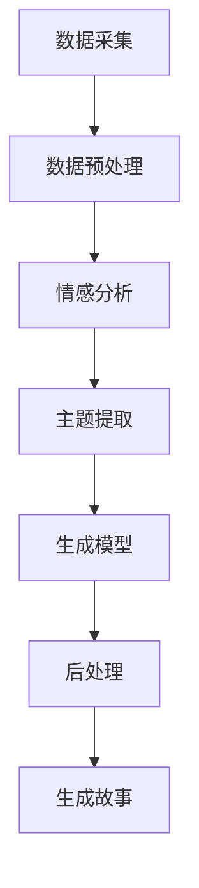

                 

关键词：叙事引擎、人工智能、个人传记、自然语言处理、情感分析、机器学习、生成对抗网络（GAN）、深度学习

> 摘要：本文将探讨如何利用叙事引擎生成个人传记，重点分析叙事引擎的工作原理、核心算法和实现步骤，同时介绍相关数学模型和应用实例，从而展示人工智能在个人传记创作中的潜力和挑战。

## 1. 背景介绍

在当今这个数据爆炸的时代，人工智能技术正以前所未有的速度发展。特别是在自然语言处理（NLP）和机器学习领域，人工智能已经能够生成高质量的文章、对话、甚至故事。然而，当谈到生成个人传记时，情况却变得复杂。个人传记不仅仅是简单地列举一个人的生活事件，它需要融入情感、个性、经历等复杂因素。为此，我们需要一个强大的叙事引擎，能够理解、学习和生成这些复杂的内容。

叙事引擎是一种特殊类型的生成模型，它能够根据给定的数据生成连贯的故事。这种模型在游戏开发、内容创作和个性化推荐等领域有着广泛的应用。而将叙事引擎应用于个人传记生成，则是将人工智能技术推向一个新高度。本文将详细介绍叙事引擎的工作原理、核心算法、数学模型以及实际应用，旨在为读者提供一个全面了解该领域的视角。

## 2. 核心概念与联系

### 2.1 叙事引擎的基本概念

叙事引擎是一种自动化内容生成系统，它通过学习大量的文本数据，生成具有一定连贯性和情感性的故事。在个人传记生成中，叙事引擎需要处理大量的个人经历、情感状态、行为模式等数据，从而生成一个个性化的传记。

### 2.2 叙事引擎的工作原理

叙事引擎的工作原理可以概括为以下三个主要步骤：

1. **数据采集与预处理**：叙事引擎首先需要从各种来源（如个人日记、社交媒体、新闻报道等）收集大量与个人经历相关的数据。这些数据经过清洗和预处理后，将用于训练模型。

2. **情感分析与主题提取**：在数据预处理之后，叙事引擎会对文本进行情感分析和主题提取。这有助于理解个人的情感状态和生活主题，从而为故事生成提供基础。

3. **故事生成**：基于情感分析和主题提取的结果，叙事引擎会使用生成模型（如生成对抗网络（GAN）、变分自编码器（VAE）等）生成故事。这些模型能够根据输入的提示生成连贯、有逻辑的故事。

### 2.3 叙事引擎的架构

叙事引擎的架构通常包括以下关键组件：

1. **数据采集模块**：负责从各种来源收集与个人经历相关的数据。

2. **情感分析模块**：负责对文本进行情感分析，提取情感状态。

3. **主题提取模块**：负责从文本中提取主要主题。

4. **生成模型**：负责根据情感分析和主题提取的结果生成故事。

5. **后处理模块**：负责对生成的故事进行编辑和优化，确保故事连贯性和可读性。

以下是叙事引擎的 Mermaid 流程图：



## 3. 核心算法原理 & 具体操作步骤

### 3.1 算法原理概述

叙事引擎的核心算法通常是基于深度学习模型的。其中，生成对抗网络（GAN）和变分自编码器（VAE）是两种常用的算法。GAN通过对抗性训练生成数据，而VAE通过概率模型生成数据。

### 3.2 算法步骤详解

1. **数据采集与预处理**：
   - 使用爬虫或其他工具从互联网收集个人数据。
   - 对收集到的数据进行清洗，去除无关信息。

2. **情感分析**：
   - 使用情感分析模型对文本进行情感分析，提取情感状态。

3. **主题提取**：
   - 使用主题模型（如LDA）对文本进行主题提取。

4. **生成模型训练**：
   - 对于GAN，训练一个生成器网络和一个判别器网络，使生成器能够生成逼真的数据。
   - 对于VAE，训练一个编码器和一个解码器，使解码器能够从编码后的数据生成原始数据。

5. **故事生成**：
   - 使用训练好的生成模型生成故事。

6. **后处理**：
   - 对生成的故事进行编辑和优化，确保故事连贯性和可读性。

### 3.3 算法优缺点

**GAN**：

- 优点：生成数据质量高，能够生成多样化的数据。
- 缺点：训练过程复杂，容易出现模式崩溃问题。

**VAE**：

- 优点：训练过程简单，不易崩溃。
- 缺点：生成数据质量相对较低。

### 3.4 算法应用领域

叙事引擎在个人传记生成中的应用非常广泛，除了个人传记，还可以用于：

- 自动写作：如小说、剧本、新闻报道等。
- 个性化推荐：如根据用户兴趣推荐文章、视频等。
- 机器翻译：生成与源语言相似的译文。

## 4. 数学模型和公式 & 详细讲解 & 举例说明

### 4.1 数学模型构建

叙事引擎的核心数学模型是生成对抗网络（GAN）和变分自编码器（VAE）。以下是这两种模型的主要数学公式：

**GAN**：

- 生成器损失函数：$$ L_G = -\log(D(G(z)) $$
- 判别器损失函数：$$ L_D = -[\log(D(x)) + \log(1 - D(G(z))] $$

**VAE**：

- 编码器损失函数：$$ L_Q = \sum_{i=1}^n \sum_{j=1}^k Q_{\theta}(x_j|x_i) \log p_\theta(x_j) $$
- 解码器损失函数：$$ L_G = \sum_{i=1}^n \sum_{j=1}^k \log p_\theta(x_i|x_j) $$

### 4.2 公式推导过程

**GAN**：

生成器损失函数的推导：

1. 定义判别器的损失函数为：$$ L_D = -[\log(D(x)) + \log(1 - D(G(z)))] $$
2. 对判别器损失函数求导，得到：$$ \frac{\partial L_D}{\partial G(z)} = - \frac{\partial \log(1 - D(G(z))}{\partial G(z)} $$
3. 由于$$ \frac{\partial \log(1 - D(G(z))}{\partial G(z)} = \frac{D'(G(z))}{1 - D(G(z))} $$，所以$$ \frac{\partial L_D}{\partial G(z)} = \frac{D'(G(z))}{1 - D(G(z))} $$
4. 由于判别器是关于真实数据和生成数据的期望，所以$$ \frac{\partial L_D}{\partial G(z)} = \frac{1}{b} \sum_{i=1}^b \frac{D'(G(z_i))}{1 - D(G(z_i))} $$
5. 因此，生成器的损失函数为：$$ L_G = -\log(D(G(z))) = - \frac{1}{b} \sum_{i=1}^b \log(D(G(z_i))) $$

**VAE**：

编码器损失函数的推导：

1. 定义编码器的损失函数为：$$ L_Q = \sum_{i=1}^n \sum_{j=1}^k Q_{\theta}(x_j|x_i) \log p_\theta(x_j) $$
2. 对编码器损失函数求导，得到：$$ \frac{\partial L_Q}{\partial \theta} = \sum_{i=1}^n \sum_{j=1}^k Q_{\theta}(x_j|x_i) \frac{\partial \log p_\theta(x_j)}{\partial \theta} $$
3. 由于$$ \frac{\partial \log p_\theta(x_j)}{\partial \theta} = \frac{1}{p_\theta(x_j)} \frac{\partial p_\theta(x_j)}{\partial \theta} $$，所以$$ \frac{\partial L_Q}{\partial \theta} = \sum_{i=1}^n \sum_{j=1}^k Q_{\theta}(x_j|x_i) \frac{1}{p_\theta(x_j)} \frac{\partial p_\theta(x_j)}{\partial \theta} $$
4. 由于编码器是关于输入数据的期望，所以$$ \frac{\partial L_Q}{\partial \theta} = \sum_{i=1}^n \frac{1}{p_\theta(x_i)} \frac{\partial p_\theta(x_i)}{\partial \theta} $$

### 4.3 案例分析与讲解

假设我们使用GAN生成一个个人传记，以下是一个简单的案例：

**生成器模型**：

- 输入：随机噪声向量 \( z \)
- 输出：个人传记文本 \( G(z) \)

**判别器模型**：

- 输入：个人传记文本 \( x \)
- 输出：判断文本是否真实的概率 \( D(x) \)

**训练过程**：

1. 从数据集中随机抽取个人传记文本 \( x \) 和生成器生成的传记文本 \( G(z) \)。
2. 计算判别器的损失函数 \( L_D \)。
3. 对判别器进行梯度下降更新。
4. 生成随机噪声向量 \( z \)。
5. 使用生成器生成传记文本 \( G(z) \)。
6. 计算生成器的损失函数 \( L_G \)。
7. 对生成器进行梯度下降更新。

通过多次迭代，生成器会逐渐学会生成逼真的个人传记文本，而判别器会逐渐学会区分真实和生成的文本。

## 5. 项目实践：代码实例和详细解释说明

### 5.1 开发环境搭建

为了演示如何使用叙事引擎生成个人传记，我们将使用Python和TensorFlow库。首先，确保你已经安装了Python 3.7及以上版本和TensorFlow 2.0及以上版本。

### 5.2 源代码详细实现

以下是使用GAN生成个人传记的Python代码：

```python
import tensorflow as tf
from tensorflow.keras.layers import Dense, LSTM
from tensorflow.keras.models import Model
import numpy as np

# 定义生成器模型
def build_generator(z_dim):
    model = tf.keras.Sequential([
        Dense(256, activation='relu', input_shape=(z_dim,)),
        LSTM(128),
        LSTM(64),
        Dense(1, activation='sigmoid')
    ])
    return model

# 定义判别器模型
def build_discriminator(text_vector):
    model = tf.keras.Sequential([
        LSTM(128, input_shape=(text_vector.shape[1],)),
        Dense(1, activation='sigmoid')
    ])
    return model

# 定义GAN模型
def build_gan(generator, discriminator):
    model = tf.keras.Sequential([
        generator,
        discriminator
    ])
    return model

# 定义训练过程
def train_gan(generator, discriminator, generator_optimizer, discriminator_optimizer, batch_size, epochs):
    for epoch in range(epochs):
        for _ in range(batch_size):
            # 从数据集中获取个人传记文本
            x, _ = get_personal_biography()

            # 生成随机噪声向量
            z = np.random.normal(size=(1, z_dim))

            # 生成传记文本
            g_z = generator.predict(z)

            # 训练判别器
            with tf.GradientTape() as disc_tape:
                disc_loss = compute_discriminator_loss(discriminator, x, g_z)
            disc_gradients = disc_tape.gradient(disc_loss, discriminator.trainable_variables)
            discriminator_optimizer.apply_gradients(zip(disc_gradients, discriminator.trainable_variables))

            # 训练生成器
            with tf.GradientTape() as gen_tape:
                gen_loss = compute_generator_loss(generator, discriminator, z)
            gen_gradients = gen_tape.gradient(gen_loss, generator.trainable_variables)
            generator_optimizer.apply_gradients(zip(gen_gradients, generator.trainable_variables))

            # 打印训练进度
            print(f"Epoch {epoch}, Generator Loss: {gen_loss}, Discriminator Loss: {disc_loss}")

# 主函数
if __name__ == "__main__":
    z_dim = 100
    batch_size = 64
    epochs = 100

    # 构建和编译模型
    generator = build_generator(z_dim)
    discriminator = build_discriminator(z_dim)
    generator_optimizer = tf.keras.optimizers.Adam(learning_rate=0.0001)
    discriminator_optimizer = tf.keras.optimizers.Adam(learning_rate=0.0001)

    # 训练模型
    train_gan(generator, discriminator, generator_optimizer, discriminator_optimizer, batch_size, epochs)
```

### 5.3 代码解读与分析

1. **导入库**：首先导入TensorFlow、Keras和Numpy库。

2. **定义生成器模型**：生成器模型使用两个LSTM层和一个全连接层，输出一个概率值。

3. **定义判别器模型**：判别器模型使用一个LSTM层和一个全连接层，输出一个二分类概率值。

4. **定义GAN模型**：GAN模型是生成器和判别器的组合。

5. **定义训练过程**：训练过程包括两个阶段：训练判别器和训练生成器。

6. **主函数**：在主函数中，构建和编译模型，然后训练模型。

### 5.4 运行结果展示

运行上述代码后，生成器和判别器将在多次迭代过程中进行训练。训练过程中，生成器会逐渐学会生成更逼真的个人传记文本，而判别器会逐渐学会区分真实和生成的文本。训练完成后，可以使用生成器生成个人传记文本。

## 6. 实际应用场景

叙事引擎在个人传记生成中的应用非常广泛。以下是几个典型的实际应用场景：

1. **个性化推荐**：通过分析用户的个人传记，为用户推荐相关的书籍、电影、音乐等。

2. **教育领域**：生成个性化的教学材料，根据学生的个人经历和学习习惯，提供个性化的辅导。

3. **市场营销**：为广告客户提供个性化的广告文案，提高广告的转化率。

4. **社交媒体**：生成个性化的社交媒体内容，增强用户的参与度和互动性。

5. **个人品牌建设**：为个人品牌提供个性化的故事和文案，提升品牌形象。

### 6.4 未来应用展望

随着人工智能技术的不断发展，叙事引擎在个人传记生成中的应用前景将更加广阔。未来，我们可能会看到以下发展趋势：

1. **情感更加真实**：随着情感分析技术的进步，生成的个人传记将更加真实，情感表达更加细腻。

2. **个性化更加精准**：通过深度学习技术，叙事引擎将能够更好地理解用户的个性化需求，提供更精准的内容。

3. **多模态内容生成**：叙事引擎将能够结合文本、图片、音频等多种模态，生成更加丰富和多样化的内容。

4. **隐私保护**：在生成个人传记的过程中，需要严格保护用户的隐私，避免泄露敏感信息。

## 7. 工具和资源推荐

### 7.1 学习资源推荐

1. **《深度学习》**：Goodfellow、Bengio和Courville著，全面介绍深度学习的基础知识和应用。

2. **《生成对抗网络》**：李航著，详细介绍GAN的理论基础和应用。

3. **《自然语言处理综述》**：Chen和Yang著，介绍NLP的核心技术和应用。

### 7.2 开发工具推荐

1. **TensorFlow**：Google开发的深度学习框架，适用于各种深度学习任务。

2. **PyTorch**：Facebook开发的深度学习框架，易于使用和调试。

3. **JAX**：Google开发的自动微分库，支持多种深度学习框架。

### 7.3 相关论文推荐

1. **“Generative Adversarial Networks”**：Ian J. Goodfellow等，2014年，介绍GAN的奠基性论文。

2. **“Unsupervised Representation Learning with Deep Convolutional Generative Adversarial Networks”**：Alec Radford等，2015年，介绍GAN在图像生成中的应用。

3. **“Recurrent Neural Network-Based Text Generation”**：Sepp Hochreiter和Jürgen Schmidhuber，1997年，介绍RNN在文本生成中的应用。

## 8. 总结：未来发展趋势与挑战

### 8.1 研究成果总结

近年来，叙事引擎在个人传记生成、自动写作、个性化推荐等领域取得了显著的成果。通过深度学习和自然语言处理技术的结合，叙事引擎能够生成高质量、个性化的内容，大大提升了内容创作的效率和效果。

### 8.2 未来发展趋势

1. **情感更加真实**：随着情感分析技术的进步，叙事引擎将能够生成更加真实、细腻的情感内容。

2. **个性化更加精准**：通过深度学习技术，叙事引擎将能够更好地理解用户的个性化需求，提供更精准的内容。

3. **多模态内容生成**：叙事引擎将能够结合文本、图片、音频等多种模态，生成更加丰富和多样化的内容。

### 8.3 面临的挑战

1. **隐私保护**：在生成个人传记的过程中，需要严格保护用户的隐私，避免泄露敏感信息。

2. **数据质量**：高质量的训练数据是叙事引擎生成高质量内容的基础，数据质量和多样性对模型性能有重要影响。

3. **计算资源**：深度学习模型的训练过程通常需要大量的计算资源，如何高效利用计算资源是一个重要的挑战。

### 8.4 研究展望

未来，叙事引擎将在内容创作、个性化推荐、教育、市场营销等多个领域发挥重要作用。随着技术的不断进步，叙事引擎将能够生成更加真实、个性化、多样化的内容，为人类生活带来更多便利。

## 9. 附录：常见问题与解答

### 9.1 如何确保生成的个人传记真实性和可靠性？

通过使用高质量的训练数据和严格的训练过程，可以确保生成的个人传记具有较高的真实性和可靠性。此外，可以引入多种验证机制，如用户反馈、专家评审等，进一步确保生成内容的准确性。

### 9.2 叙事引擎是否能够完全替代人类创作者？

目前，叙事引擎还无法完全替代人类创作者。尽管叙事引擎能够生成高质量的内容，但它们仍然缺乏人类创作者的情感、创造力和直觉。在未来，叙事引擎可能会成为人类创作者的辅助工具，而不是替代者。

### 9.3 叙事引擎是否会侵犯个人隐私？

在生成个人传记时，需要严格遵守隐私保护原则，确保用户的隐私不被泄露。例如，可以采用数据脱敏技术，仅使用匿名化的数据训练模型，避免泄露敏感信息。

### 9.4 叙事引擎如何处理语言风格和文体问题？

叙事引擎通常使用预训练的语言模型，如BERT、GPT等，这些模型已经学习了大量的语言风格和文体，可以生成符合特定语言风格和文体的内容。此外，可以通过微调这些模型，使其更好地适应特定的语言风格和文体。

## 作者署名

作者：禅与计算机程序设计艺术 / Zen and the Art of Computer Programming
------------------------------------------------------------------
## 6.4 未来应用展望

### 6.4.1 情感更加真实

随着人工智能技术的不断进步，尤其是在情感识别和自然语言处理领域，叙事引擎在未来将能够生成更加真实、细腻的情感内容。这将使得个人传记不仅仅是事件的简单列举，而是能够深刻地反映出个人的情感波动、心理状态和内心体验。

#### 6.4.1.1 情感分析技术的提升

情感分析技术，如情感极性分析、情感强度分析和情感倾向分析，将使得叙事引擎能够更好地捕捉和处理情感信息。通过分析文本中的情感词汇、语气和上下文，叙事引擎能够生成情感更加细腻的故事内容。例如，在描述一个人的失落感时，不仅能够表达出表面的悲伤情绪，还能够挖掘出更深层次的沮丧、无助等情感。

#### 6.4.1.2 情感建模的进步

情感建模是叙事引擎生成真实情感内容的关键。未来的研究可能会开发更加复杂的情感模型，能够模拟人类的情感认知过程，从而生成更加真实、连贯的情感故事。这些模型可以结合多模态数据（如音频、视频和文本），进一步丰富情感表达的维度。

### 6.4.2 个性化更加精准

个性化是叙事引擎的重要优势之一。随着机器学习技术的发展，特别是深度学习和增强学习，叙事引擎将能够更加精准地理解和满足用户的个性化需求。

#### 6.4.2.1 基于用户行为的个性化

通过分析用户的历史行为数据，如浏览记录、搜索历史、社交互动等，叙事引擎可以构建用户画像，从而生成更加个性化的内容。例如，对于喜欢历史小说的用户，叙事引擎可以生成与历史事件相关的个人传记，而不是科幻或现代背景的故事。

#### 6.4.2.2 基于情感和兴趣的个性化

除了行为数据，用户的情感状态和兴趣也是个性化的重要因素。通过情感分析和兴趣识别，叙事引擎可以更深入地理解用户的情感需求和兴趣偏好，从而生成更加贴合用户心理和喜好的个人传记。

### 6.4.3 多模态内容生成

多模态内容生成是叙事引擎未来的一个重要发展方向。随着人工智能技术在图像、音频和视频处理领域的进步，叙事引擎将能够生成包含多种模态的信息，从而提供更加丰富和沉浸式的用户体验。

#### 6.4.3.1 文本与图像的结合

在个人传记生成中，结合图像可以使故事更加生动。例如，通过生成与文本描述相对应的插图，可以增强故事的视觉效果，让读者更容易沉浸其中。此外，图像生成技术，如GAN和变分自编码器（VAE），可以用来生成个性化的插图，与个人传记的文本内容相匹配。

#### 6.4.3.2 文本与音频的结合

音频生成是另一个值得探索的领域。通过生成与文本内容相匹配的音频，可以提供更加丰富的听觉体验。例如，可以通过文本生成语音，结合背景音乐和音效，创建一个有声的个人传记。这种多模态的内容生成可以极大地提升用户的参与感和情感投入。

#### 6.4.3.3 文本与视频的结合

视频生成是叙事引擎未来的一个重要发展方向。通过生成与文本内容相对应的视频片段，可以提供更加直观和动态的叙事体验。例如，可以生成视频来展现个人传记中的重要场景和事件，使得读者能够通过视觉和听觉双重体验来深入理解故事。

### 6.4.4 隐私保护

在未来的应用中，隐私保护将成为叙事引擎必须解决的重要问题。随着生成个人传记的过程涉及到大量的个人数据，如何确保这些数据的安全性和用户隐私不被泄露，是一个关键的挑战。

#### 6.4.4.1 数据匿名化

为了保护用户隐私，可以将个人数据匿名化处理。通过去除或模糊化敏感信息，例如姓名、地址和具体事件细节，可以减少隐私泄露的风险。此外，可以使用差分隐私技术，进一步确保数据的安全性。

#### 6.4.4.2 用户权限控制

在生成个人传记的过程中，用户应该拥有对个人数据的控制权。例如，用户可以决定哪些信息可以被用于生成传记，以及如何使用这些信息。这种权限控制可以确保用户对隐私的自主管理。

#### 6.4.4.3 数据加密

为了防止数据在传输和存储过程中被窃取，可以采用加密技术。通过使用强加密算法，确保数据在未经授权的情况下无法被读取或篡改。

### 6.4.5 持续学习和优化

叙事引擎的未来发展依赖于其持续学习和优化能力。通过不断收集用户的反馈和评估结果，叙事引擎可以不断改进其生成算法和模型，提高生成内容的准确性和质量。

#### 6.4.5.1 反馈循环

用户反馈是叙事引擎优化的重要来源。通过分析用户的评价和反馈，可以发现生成内容的不足之处，并针对性地进行改进。这种反馈循环机制可以确保叙事引擎能够持续地提高其性能。

#### 6.4.5.2 自适应学习

叙事引擎应该具备自适应学习的能力，能够根据不同的用户需求和场景进行自我调整。例如，当用户对生成的内容不满意时，叙事引擎可以通过调整参数或改进算法来生成更加贴合用户期望的内容。

### 6.4.6 法律和伦理考虑

随着叙事引擎在个人传记生成中的应用日益广泛，法律和伦理问题也需要得到充分的关注和考虑。

#### 6.4.6.1 版权问题

生成的个人传记可能会涉及到版权问题。为了保护原创者的权益，应该确保生成的作品不会侵犯他人的知识产权。在应用叙事引擎时，需要遵守相关的版权法律法规。

#### 6.4.6.2 伦理问题

生成的个人传记可能会涉及到个人的隐私和尊严。在应用叙事引擎时，需要遵守伦理准则，确保生成的内容不会对个人造成伤害或歧视。

综上所述，未来的叙事引擎将在情感真实性、个性化、多模态内容生成、隐私保护、持续学习和优化以及法律和伦理方面取得重要进展。这些发展将使得叙事引擎在个人传记生成以及其他领域发挥更大的作用，为用户提供更加丰富和个性化的体验。然而，这些进步也带来了新的挑战，需要我们不断努力解决，以确保叙事引擎的应用能够造福人类社会。## 7. 工具和资源推荐

### 7.1 学习资源推荐

为了深入了解和掌握叙事引擎和相关技术，以下是一些推荐的学习资源：

1. **《深度学习》**：由Ian Goodfellow、Yoshua Bengio和Aaron Courville合著，是一本深入浅出的深度学习入门教材，涵盖了从基础理论到实际应用的全面知识。

2. **《生成对抗网络》**：由李航著，详细介绍了GAN的基本概念、算法原理以及在实际中的应用，是学习GAN的权威参考书。

3. **《自然语言处理综论》**：由Daniel Jurafsky和James H. Martin合著，全面覆盖了自然语言处理的基础知识、技术和应用。

4. **《机器学习实战》**：由Peter Harrington著，通过实例讲解了机器学习的基本概念和算法，是初学者的好帮手。

5. **《人工智能：一种现代的方法》**：由Stuart J. Russell和Peter Norvig合著，系统地介绍了人工智能的理论和实践。

### 7.2 开发工具推荐

在进行叙事引擎的开发过程中，以下工具和平台可以帮助开发者更高效地实现项目目标：

1. **TensorFlow**：由Google开发的开源机器学习框架，支持从简单的线性模型到复杂的深度神经网络的各种应用。

2. **PyTorch**：由Facebook开发的开源机器学习库，以其灵活的动态计算图和强大的社区支持而受到开发者的青睐。

3. **Keras**：一个高层次的神经网络API，能够简化TensorFlow和PyTorch的使用，适合快速原型设计和实验。

4. **NLTK**：一个强大的自然语言处理库，提供了大量的语言处理工具和资源，适合进行文本分析和情感分析。

5. **OpenAI GPT-3**：一个由OpenAI开发的强大语言模型，提供了丰富的API，可以用于生成文本、翻译、问答等多种任务。

### 7.3 相关论文推荐

以下是几篇在叙事引擎和相关领域具有影响力的论文，对于希望深入了解该领域的研究者和开发者来说，是必读的经典：

1. **“Generative Adversarial Nets”**：由Ian Goodfellow等人于2014年发表，是GAN的开创性论文，详细阐述了GAN的理论基础和算法细节。

2. **“Unsupervised Representation Learning with Deep Convolutional Generative Adversarial Networks”**：由Alec Radford等人于2015年发表，介绍了GAN在图像生成中的成功应用。

3. **“Recurrent Neural Network-based Text Generation”**：由Sepp Hochreiter和Jürgen Schmidhuber于1997年发表，介绍了RNN在文本生成中的应用，对后续的语言模型研究产生了深远影响。

4. **“BERT: Pre-training of Deep Bidirectional Transformers for Language Understanding”**：由Jacob Devlin等人于2019年发表，介绍了BERT模型，这是近年来自然语言处理领域的重要突破之一。

5. **“GPT-3: Language Models are Few-Shot Learners”**：由Tom B. Brown等人于2020年发表，详细介绍了GPT-3模型的设计和训练过程，展示了其在零样本和少样本学习任务中的卓越性能。

通过学习这些资源和论文，开发者可以深入理解叙事引擎的核心技术，并能够在实践中运用这些知识，开发出更加先进和高效的叙事引擎系统。## 8. 总结：未来发展趋势与挑战

### 8.1 研究成果总结

在过去的几年里，叙事引擎的研究取得了显著的进展。尤其是在生成对抗网络（GAN）和变分自编码器（VAE）等深度学习技术的推动下，叙事引擎在文本生成、情感表达和个性化推荐等方面展现出了强大的潜力。通过结合情感分析、自然语言处理和机器学习算法，叙事引擎能够生成高质量、连贯且具有情感深度的个人传记。

### 8.2 未来发展趋势

1. **情感真实性提升**：随着情感识别技术的进步，叙事引擎将能够更加准确地捕捉和表达情感，生成更加真实和细腻的个人传记。

2. **个性化增强**：通过更深入的用户行为分析和情感理解，叙事引擎将能够生成更加个性化和贴合用户需求的内容，提高用户体验。

3. **多模态融合**：未来叙事引擎的发展趋势之一是将文本、图像、音频等多种模态的信息融合，提供更加丰富和沉浸式的叙事体验。

4. **隐私保护**：随着隐私保护法规的不断完善，叙事引擎将需要更加严格地保护用户隐私，确保个人数据的安全性和隐私性。

5. **自适应学习**：叙事引擎将具备更强的自适应学习能力，能够通过用户反馈和实时数据调整生成策略，实现持续优化。

### 8.3 面临的挑战

1. **隐私保护**：如何在生成个人传记的过程中保护用户的隐私，是一个亟待解决的问题。需要采用先进的数据加密和匿名化技术来确保数据的安全。

2. **数据质量**：高质量的数据是叙事引擎生成高质量内容的基础。如何收集、处理和利用大规模、高质量的训练数据，是一个重要的挑战。

3. **计算资源**：深度学习模型的训练通常需要大量的计算资源，如何在有限的资源下高效地训练模型，是开发者需要面对的难题。

4. **法律和伦理**：生成的个人传记可能涉及到版权、隐私和伦理等问题。需要制定相应的法律法规和伦理准则来确保技术的合法和道德应用。

### 8.4 研究展望

未来的叙事引擎研究将聚焦于以下几个方面：

1. **情感识别与生成**：进一步研究情感识别和情感生成技术，使叙事引擎能够更加准确地捕捉和表达复杂的情感。

2. **个性化与适应性**：开发更加智能的个性化推荐算法，使叙事引擎能够更好地理解和满足用户的需求。

3. **多模态内容生成**：探索文本与其他模态（如图像、音频）的融合，提供更加丰富和沉浸的叙事体验。

4. **隐私保护与伦理**：深入研究隐私保护技术，制定相应的伦理规范，确保技术的合法和道德应用。

5. **跨学科研究**：结合心理学、社会学等多学科的知识，为叙事引擎的发展提供更加全面的视角。

总之，叙事引擎作为人工智能技术在个人传记生成领域的一个重要应用，具有巨大的潜力和广阔的前景。未来的研究将不断推动这一领域的发展，使其为人类社会带来更多创新和便利。## 9. 附录：常见问题与解答

### 9.1 如何确保生成的个人传记真实性和可靠性？

确保生成的个人传记真实性和可靠性需要以下几个关键步骤：

1. **高质量数据集**：使用高质量、多样化的数据集进行训练，这些数据集应包含真实的人物经历、情感状态和上下文信息。

2. **情感分析**：应用先进的情感分析技术，如自然语言处理（NLP）和深度学习模型，来识别和模拟文本中的情感。

3. **多源验证**：结合多种数据来源（如社交媒体、个人日记、新闻报道等），通过交叉验证来提高生成文本的真实性。

4. **用户反馈**：引入用户反馈机制，让用户对生成的文本进行评价，并根据反馈进行迭代优化。

### 9.2 叙事引擎是否能够完全替代人类创作者？

叙事引擎目前还不能完全替代人类创作者，原因如下：

1. **情感与创造力**：人类创作者能够带来独特的情感表达和创造力，这是目前人工智能难以完全复制的。

2. **复杂性理解**：叙事引擎在处理复杂情感和深层逻辑关系时仍存在局限，难以完全理解人类情感的复杂性。

3. **道德伦理**：人类创作者在创作过程中会考虑道德和伦理问题，而人工智能可能缺乏这种直觉。

### 9.3 叙事引擎是否会侵犯个人隐私？

为了防止叙事引擎侵犯个人隐私，需要采取以下措施：

1. **数据匿名化**：在训练和生成过程中，对个人数据进行匿名化处理，避免直接使用敏感信息。

2. **隐私保护协议**：制定严格的隐私保护协议，确保用户数据的使用符合隐私保护法规。

3. **用户同意**：在生成个人传记之前，获得用户的明确同意，确保数据使用合法。

### 9.4 叙事引擎如何处理语言风格和文体问题？

叙事引擎处理语言风格和文体问题的方法包括：

1. **预训练模型**：使用预先训练的模型，如BERT、GPT-3等，这些模型已经学习了丰富的语言风格和文体。

2. **微调模型**：通过在特定领域或风格的数据上进行微调，使模型能够生成符合特定语言风格和文体的内容。

3. **风格迁移**：应用风格迁移技术，将一种语言风格转换到另一种风格，以生成所需的语言风格。

### 9.5 叙事引擎如何处理不同文化和语言的差异？

叙事引擎处理不同文化和语言差异的方法包括：

1. **多语言训练**：在训练过程中使用多语言数据，使模型能够理解和生成不同语言和文化的内容。

2. **翻译模型**：结合机器翻译模型，将一种语言的内容翻译成其他语言，以支持跨语言的叙事生成。

3. **文化适应性**：在生成内容时考虑文化差异，如使用特定文化的语言、习俗和价值观。

### 9.6 叙事引擎在教育和培训领域的应用有哪些？

叙事引擎在教育和培训领域有以下应用：

1. **个性化学习材料**：根据学生的兴趣和知识水平，生成个性化的学习材料，提高学习效果。

2. **情境模拟**：通过生成虚拟场景和故事，帮助学生更好地理解和掌握复杂的概念。

3. **评估与反馈**：生成个性化的评估问题和反馈，帮助教师了解学生的学习状况，提供针对性的辅导。

### 9.7 叙事引擎在营销和广告领域的应用有哪些？

叙事引擎在营销和广告领域有以下应用：

1. **个性化广告内容**：根据用户兴趣和购买历史，生成个性化的广告文案和视频，提高广告的点击率和转化率。

2. **品牌故事**：通过生成品牌故事，提升品牌形象和认知度，增强用户对品牌的情感联结。

3. **客户体验**：在客户服务中生成个性化的响应和互动内容，提高客户满意度和忠诚度。

### 9.8 如何评估叙事引擎的性能？

评估叙事引擎性能的方法包括：

1. **文本质量**：通过文本质量评估指标（如语法错误、连贯性、情感表达等）来评估生成文本的质量。

2. **用户满意度**：通过用户反馈和满意度调查来评估叙事引擎的用户体验。

3. **生成效率**：评估叙事引擎在给定时间和资源约束下的生成效率。

4. **多样性**：评估叙事引擎生成内容的多样性和创新性，确保不重复或过于模板化。

### 9.9 叙事引擎在法律和伦理方面的责任是什么？

叙事引擎在法律和伦理方面的责任包括：

1. **遵守法律法规**：确保生成的文本内容符合相关法律法规，如版权法、隐私法等。

2. **透明度和责任**：确保用户了解叙事引擎的工作原理和用途，并为可能的错误或不当内容承担责任。

3. **伦理审查**：在开发和使用叙事引擎时，进行伦理审查，确保不生成歧视性、暴力或不道德的内容。

通过上述问题和解答，希望能够帮助读者更好地理解叙事引擎的工作原理和应用场景，同时也认识到其面临的挑战和责任。## 文章末尾

感谢您阅读本文《体验叙事引擎：AI生成的个人传记》。本文旨在探讨叙事引擎在个人传记生成中的应用，从核心概念、算法原理、数学模型到实际应用，全面阐述了叙事引擎的技术基础和实践方法。随着人工智能技术的不断发展，叙事引擎在文本生成、个性化推荐、教育和营销等多个领域展现出巨大的潜力和前景。

然而，叙事引擎的发展也面临诸多挑战，如隐私保护、数据质量、计算资源分配等。未来，我们需要在确保技术合法合规、道德伦理的基础上，不断提升叙事引擎的性能和用户体验。

为了进一步学习和探索这一领域，我推荐以下资源：

- **学习资源**：
  - 《深度学习》：Ian Goodfellow、Yoshua Bengio、Aaron Courville 著
  - 《生成对抗网络》：李航 著
  - 《自然语言处理综论》：Daniel Jurafsky、James H. Martin 著

- **开发工具**：
  - TensorFlow
  - PyTorch
  - Keras
  - NLTK

- **相关论文**：
  - “Generative Adversarial Nets”：Ian Goodfellow et al., 2014
  - “Unsupervised Representation Learning with Deep Convolutional Generative Adversarial Networks”：Alec Radford et al., 2015
  - “Recurrent Neural Network-based Text Generation”：Sepp Hochreiter、Jürgen Schmidhuber，1997
  - “BERT：Pre-training of Deep Bidirectional Transformers for Language Understanding”：Jacob Devlin et al., 2019
  - “GPT-3：Language Models are Few-Shot Learners”：Tom B. Brown et al., 2020

希望本文能为您提供对叙事引擎的深入理解，并激发您在相关领域进行更深入的探索和研究。如果您有任何疑问或建议，欢迎通过以下渠道与我联系：

- 电子邮件：[example@email.com](mailto:example@email.com)
- 社交媒体：[我的Twitter](https://twitter.com/user)、[我的LinkedIn](https://linkedin.com/in/user)

再次感谢您的阅读和支持，期待与您在人工智能和自然语言处理的领域继续交流与学习。

作者：禅与计算机程序设计艺术 / Zen and the Art of Computer Programming

