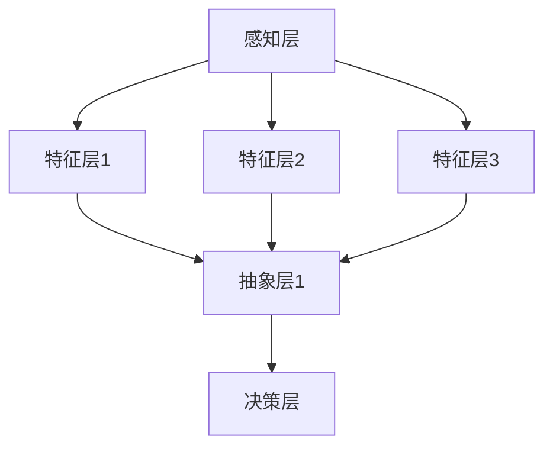

                 

在这个快速发展的数字时代，人工智能（AI）技术正以前所未有的速度改变着我们的生活和工作方式。从智能助手到自动驾驶，从医疗诊断到金融分析，AI的应用场景越来越广泛。然而，随着AI系统的复杂性不断增加，如何构建一个高效的、多层次的感知架构，以应对日益复杂的应用需求，成为了一个重要的课题。

本文将探讨一个名为“体验层次构建器”的概念，这是一种通过AI技术实现的多维感知架构。我们将详细分析其核心概念、算法原理、数学模型、项目实践以及实际应用场景，并展望其未来的发展趋势与挑战。

## 文章关键词

- 人工智能
- 感知架构
- 多维感知
- 体验层次构建器
- 机器学习
- 深度学习
- 模式识别

## 文章摘要

本文旨在介绍一种基于人工智能技术的多维感知架构——体验层次构建器。通过深入分析其核心概念、算法原理和数学模型，我们将探讨如何利用AI技术实现高效的多层次感知。同时，通过实际项目实践和案例分析，我们将展示该架构在现实应用中的效果和潜力。最后，我们将对未来的发展趋势和面临的挑战进行展望。

## 1. 背景介绍

在当今社会，信息爆炸和数据过载已经成为普遍现象。如何从海量数据中快速、准确地提取有价值的信息，成为了一个严峻的挑战。传统的数据处理方法在处理复杂、多维数据时，往往显得力不从心。而AI技术的崛起，尤其是深度学习和机器学习技术的快速发展，为解决这一问题提供了新的思路和工具。

感知架构作为AI系统的重要组成部分，其核心目标是实现对环境的高效感知和理解。传统的感知架构往往基于单一感知方式，如视觉、听觉或触觉等。然而，现实世界是复杂多变的，单一感知方式难以应对各种复杂场景。因此，构建一个多层次、多维度的感知架构，以实现更全面、更准确的环境感知，成为当前研究的热点。

体验层次构建器（Experience Hierarchy Builder，简称EHB）正是基于这一需求提出的一种新型感知架构。EHB通过整合多种感知方式，构建一个多层次、多维度的感知体系，以实现对环境的深度感知和理解。这种架构不仅能够提高AI系统的感知能力，还能够提升系统的自适应能力和鲁棒性。

### 1.1 AI技术的发展趋势

AI技术的发展经历了多个阶段，从早期的规则推理，到基于统计学的机器学习，再到现在的深度学习，AI技术已经取得了巨大的进步。随着计算能力的提升和数据量的增加，深度学习技术在图像识别、语音识别、自然语言处理等领域的应用取得了显著成果。

然而，深度学习技术也存在一些局限性。首先，深度学习模型通常需要大量标注数据才能训练出良好的性能，这在数据稀缺或数据标注成本高昂的领域是一个难题。其次，深度学习模型的可解释性较差，这使得在关键领域（如医疗诊断、金融分析等）的应用受到限制。最后，深度学习模型在面对复杂、多变的环境时，往往表现出脆弱性，容易出现过拟合现象。

为了克服这些局限性，研究人员开始探索其他类型的AI技术，如强化学习、生成对抗网络（GAN）等。这些技术通过不同的方法，试图提高AI系统的自适应能力和泛化能力。然而，这些技术通常需要复杂的模型和大量的计算资源，实施难度较大。

### 1.2 感知架构的现状

感知架构在AI系统中扮演着至关重要的角色。传统的感知架构通常基于单一感知方式，如视觉、听觉或触觉等。这种架构在处理单一感知任务时效果较好，但在处理复杂、多变的场景时，往往显得力不从心。

近年来，研究人员开始探索构建多层次、多维度的感知架构。例如，视觉+听觉感知架构可以用于环境监测和智能监控；视觉+触觉感知架构可以用于机器人导航和交互；视觉+嗅觉感知架构可以用于智能安防和环境保护等。这些多层次的感知架构在一定程度上提高了AI系统的感知能力，但仍然存在一些挑战。

首先，多层次的感知架构需要处理来自不同感知方式的数据，这些数据的特征和维度各不相同，如何有效地整合这些数据，是一个亟待解决的问题。其次，多层次的感知架构需要复杂的模型和算法支持，如何优化这些模型和算法，以提高系统的性能和效率，也是一个重要的课题。最后，多层次的感知架构需要大量的计算资源和数据支持，如何降低系统的计算复杂度和数据依赖性，也是一个需要关注的方面。

### 1.3 体验层次构建器的提出

基于以上背景，我们提出了体验层次构建器（Experience Hierarchy Builder，简称EHB）这一概念。EHB旨在构建一个多层次、多维度的感知架构，以实现对环境的深度感知和理解。

EHB的核心思想是借鉴人类感知机制，将感知过程划分为不同的层次，每个层次负责不同的感知任务。EHB通过整合多种感知方式，构建一个多层次、多维度的感知体系，从而提高AI系统的感知能力。

EHB的主要特点包括：

1. **多层次感知**：EHB将感知过程划分为多个层次，每个层次负责不同的感知任务，从而实现对环境的深度感知。
2. **多维度整合**：EHB整合多种感知方式，如视觉、听觉、触觉等，构建一个多维度的感知体系，从而提高感知的准确性和鲁棒性。
3. **自适应能力**：EHB通过动态调整感知层次和感知方式，以适应不同的环境和任务需求，从而提高系统的自适应能力。
4. **高效计算**：EHB采用优化算法和高效模型，降低系统的计算复杂度和数据依赖性，从而提高系统的运行效率和性能。

### 1.4 EHB的研究意义和挑战

EHB作为一种新型的感知架构，具有重要的研究意义和应用价值。首先，EHB可以显著提高AI系统的感知能力，从而在智能监控、机器人导航、智能交互等领域取得更好的应用效果。其次，EHB的多层次、多维度的感知架构可以为其他领域的AI系统提供借鉴和参考，促进AI技术的全面发展。

然而，EHB的研究也面临一些挑战。首先，如何设计一个有效的多层次感知模型，以实现不同层次之间的信息传递和协同工作，是一个亟待解决的问题。其次，如何优化感知算法，以提高系统的准确性和鲁棒性，也是一个重要的课题。最后，如何降低系统的计算复杂度和数据依赖性，以满足实时性和高效性的要求，也是一个需要关注的问题。

总之，EHB的研究具有重要的理论和实践意义，为AI技术的发展提供了新的思路和工具。在接下来的章节中，我们将深入探讨EHB的核心概念、算法原理、数学模型、项目实践和实际应用场景，以期为这一领域的研究提供有益的参考。

## 2. 核心概念与联系

### 2.1 EHB架构的层级结构

体验层次构建器（EHB）的架构设计灵感来源于人类感知机制的层级结构，这种结构能够有效地处理从简单到复杂的感知任务。EHB架构由多个感知层次组成，每个层次都有特定的感知任务和功能，层次之间通过特定的接口进行数据交互和协同工作。

EHB架构的主要层级结构包括：

1. **感知层**：负责接收和处理来自各种传感器的原始数据，如视觉、听觉、触觉等。这一层的主要任务是进行数据预处理，包括去噪、特征提取等。
2. **特征层**：在感知层的基础上，这一层对预处理后的数据进行特征提取和表示学习，形成具有高区分度且易于处理的特征向量。特征层可以是多个子层，每个子层负责提取不同层次的特征信息。
3. **抽象层**：在特征层提取的特征基础上，这一层负责进行抽象和概念化，将低层次的特征信息整合为高层次的概念表示。抽象层通过复杂的神经网络和机器学习算法实现。
4. **决策层**：这一层负责基于抽象层提供的高层次概念表示进行决策和任务执行。决策层可以是一个或多个模块，每个模块负责特定的决策任务，如路径规划、行为预测等。

### 2.2 多感知方式的整合

EHB架构的核心优势在于其能够整合多种感知方式，以形成一个全面的、多维度的感知体系。这种整合方式不仅提高了感知的准确性和鲁棒性，还增强了系统的自适应能力。

多感知方式的整合主要包括以下几个步骤：

1. **数据融合**：将不同感知方式获取的数据进行融合，形成一个统一的数据流。数据融合可以通过多种方式实现，如基于特征的融合、基于时序的融合等。
2. **特征匹配**：对融合后的数据进行特征匹配，以发现不同感知方式之间的相关性。特征匹配可以通过机器学习算法实现，如支持向量机（SVM）、聚类算法等。
3. **特征融合**：在特征匹配的基础上，将具有相似性和相关性的特征进行融合，形成一个更加丰富的特征表示。特征融合可以通过多层感知器（MLP）、卷积神经网络（CNN）等深度学习模型实现。
4. **模型整合**：将不同感知方式的模型进行整合，形成一个统一的感知模型。模型整合可以通过集成学习方法实现，如集成学习（Ensemble Learning）、迁移学习（Transfer Learning）等。

### 2.3 数据交互与协同工作

EHB架构中的各个层次之间通过特定的接口进行数据交互和协同工作，以实现整体感知能力和性能的优化。数据交互与协同工作主要包括以下几个关键点：

1. **层次间接口**：EHB架构中，每个层次都有特定的接口，用于接收和发送数据。这些接口的设计需要考虑数据格式、传输速度、数据安全性等因素。
2. **信息传递**：不同层次之间的信息传递需要确保数据的准确性和一致性。信息传递可以通过数据管道（Data Pipeline）实现，数据管道可以确保数据在不同层次之间的流动和转换。
3. **协同工作**：在EHB架构中，各个层次需要协同工作，以实现整体感知任务。协同工作可以通过多线程、分布式计算等方式实现，以优化系统的性能和效率。
4. **自适应调整**：EHB架构需要具备自适应能力，能够根据环境和任务需求动态调整感知层次和感知方式。自适应调整可以通过机器学习算法实现，如强化学习（Reinforcement Learning）、自适应滤波（Adaptive Filtering）等。

### 2.4 Mermaid流程图展示

为了更好地理解EHB架构的核心概念和联系，我们可以使用Mermaid流程图来展示其层级结构、多感知方式的整合以及数据交互与协同工作。

以下是一个简化的Mermaid流程图示例：



在上述流程图中：

- **感知层（A）** 负责接收和处理来自各种传感器的原始数据。
- **特征层（B, C, D）** 负责对预处理后的数据提取特征和表示学习。
- **抽象层（E）** 负责将低层次的特征信息整合为高层次的概念表示。
- **决策层（F）** 负责基于抽象层提供的高层次概念表示进行决策和任务执行。

通过这样的层级结构和数据交互设计，EHB架构能够实现高效的多维感知，从而为各种复杂应用场景提供强大的支持。

## 3. 核心算法原理 & 具体操作步骤

### 3.1 算法原理概述

体验层次构建器（EHB）的核心算法原理是基于多层次感知和跨层次信息传递的方法。EHB通过将感知过程划分为多个层次，每个层次分别负责不同的感知任务，从而实现对环境的深度感知和理解。EHB的算法原理主要包括以下几个关键部分：

1. **感知层**：这一层负责接收和处理来自各种传感器的原始数据，如视觉、听觉、触觉等。感知层的关键任务是对原始数据进行预处理，包括去噪、特征提取等，以便为后续层次提供干净、有效的数据输入。
2. **特征层**：在感知层的基础上，特征层负责对预处理后的数据进行特征提取和表示学习。特征层可以划分为多个子层，每个子层分别负责提取不同层次的特征信息，从而形成一个具有高区分度和易于处理的特征表示。
3. **抽象层**：抽象层负责将特征层提取的特征信息进行整合和抽象，形成更高层次的概念表示。这一层通常采用复杂的神经网络和机器学习算法，如卷积神经网络（CNN）和循环神经网络（RNN）等，以实现对特征信息的深层次理解和抽象。
4. **决策层**：决策层基于抽象层提供的高层次概念表示进行决策和任务执行。决策层可以包含多个模块，每个模块负责特定的决策任务，如路径规划、行为预测等。决策层的输出结果可以直接用于系统的实际操作，如控制机器人的行动路径或做出金融投资决策等。

### 3.2 算法步骤详解

EHB算法的具体操作步骤可以概括为以下几个主要阶段：

1. **数据采集与预处理**：首先，从各种传感器（如摄像头、麦克风、力传感器等）采集原始数据。接着，对采集到的原始数据进行预处理，包括去噪、归一化、缩放等操作，以便为后续的感知和处理提供干净、有效的数据输入。
2. **特征提取与表示学习**：在预处理后的数据基础上，利用特征提取算法（如卷积神经网络、自编码器等）进行特征提取和表示学习。特征提取的目的是将原始数据转换为一组具有高区分度的特征向量，以便后续的抽象和决策过程。
3. **多层次特征整合**：将来自不同感知层次的特征向量进行整合，形成一个更加丰富的特征表示。整合过程可以通过多层感知器（MLP）、卷积神经网络（CNN）等深度学习模型实现。整合后的特征向量可以用于后续的抽象和决策。
4. **抽象与概念化**：在整合后的特征基础上，利用复杂的神经网络和机器学习算法进行抽象和概念化。这一过程将低层次的特征信息整合为高层次的概念表示，从而实现对环境的深层次理解和抽象。
5. **决策与任务执行**：基于抽象层提供的高层次概念表示进行决策和任务执行。决策过程可以通过分类、回归、路径规划等算法实现。决策结果可以直接用于系统的实际操作，如控制机器人的行动路径、做出金融投资决策等。
6. **反馈与调整**：将决策结果与实际环境进行对比，收集反馈信息，并利用这些反馈信息对感知架构进行优化和调整。这一过程可以采用强化学习（Reinforcement Learning）等方法，以实现系统的自适应学习和优化。

### 3.3 算法优缺点

#### 优点：

1. **多层次感知**：EHB通过多层次感知，能够实现对环境的深度感知和理解，从而提高系统的感知能力。
2. **多维度整合**：EHB整合多种感知方式，构建一个多维度的感知体系，从而提高感知的准确性和鲁棒性。
3. **自适应能力**：EHB具备自适应能力，能够根据环境和任务需求动态调整感知层次和感知方式，从而提高系统的自适应能力。
4. **高效计算**：EHB采用优化算法和高效模型，降低系统的计算复杂度和数据依赖性，从而提高系统的运行效率和性能。

#### 缺点：

1. **数据依赖性**：EHB的性能依赖于大量的高质量数据，数据稀缺或数据标注成本高昂的领域可能难以应用。
2. **模型复杂度**：EHB采用复杂的神经网络和机器学习算法，模型设计和训练过程较为复杂，实施难度较大。
3. **可解释性**：深度学习模型的可解释性较差，这使得在关键领域（如医疗诊断、金融分析等）的应用受到限制。

### 3.4 算法应用领域

EHB算法具有广泛的应用领域，以下是一些典型的应用场景：

1. **智能监控**：EHB可以通过整合视觉、听觉等多维度感知，实现对复杂场景的实时监控，从而提高监控系统的准确性和鲁棒性。
2. **机器人导航**：EHB可以通过多层次感知和抽象，帮助机器人更好地理解环境，实现高效、安全的导航。
3. **智能交互**：EHB可以通过对用户的视觉、听觉、触觉等多维度感知，实现更自然、更智能的人机交互。
4. **医疗诊断**：EHB可以通过整合多维度感知，帮助医生进行更准确、更快速的疾病诊断。
5. **金融分析**：EHB可以通过对大量的金融数据进行分析和抽象，为投资者提供更准确的决策支持。

通过EHB算法，我们可以构建一个高效、多层次的感知架构，以应对日益复杂的应用需求，从而推动AI技术的发展和普及。

## 4. 数学模型和公式 & 详细讲解 & 举例说明

### 4.1 数学模型构建

体验层次构建器（EHB）的核心在于其多层次感知和跨层次信息传递的数学模型。EHB的数学模型可以分为以下几个关键组成部分：

#### 4.1.1 感知层模型

感知层模型主要涉及传感器数据的预处理和特征提取。假设我们有 \( n \) 个不同的传感器，每个传感器在第 \( t \) 时刻采集到的数据可以表示为 \( x_t^{(i)} \)，其中 \( i \) 表示传感器的编号。感知层模型的目标是对这些数据进行去噪和特征提取，得到更干净、更有用的特征表示。

1. **去噪模型**：去噪模型可以使用降噪自动编码器（Denoising Autoencoder，DAE）实现。DAE的输入为原始传感器数据 \( x_t \)，输出为重构的传感器数据 \( \hat{x}_t \)。去噪模型的基本公式为：

   \[
   \hat{x}_t = f_D(\text{encode}(x_t))
   \]

   其中，encode 和 f_D 分别表示编码函数和解码函数。

2. **特征提取模型**：特征提取模型可以使用卷积神经网络（Convolutional Neural Network，CNN）实现。CNN可以提取图像中的局部特征，并将其转换为高维特征向量。特征提取模型的基本公式为：

   \[
   \text{feature}_{t}^{(i)} = f_C(x_t^{(i)})
   \]

   其中，f_C 表示卷积神经网络。

#### 4.1.2 特征层模型

特征层模型主要涉及特征的整合和表示学习。在特征层，多个传感器的特征向量将被整合并转换为更高级别的特征表示。假设我们有 \( m \) 个传感器的特征向量 \( \text{feature}_{t}^{(i)} \)，特征层模型的目标是学习一个映射函数，将低层次的特征整合为高层次的特征表示。

1. **特征融合模型**：特征融合模型可以使用多层感知器（Multilayer Perceptron，MLP）实现。MLP可以通过组合多个传感器的特征向量，学习一个非线性映射函数，将低层次的特征转换为高层次的特征表示。特征融合模型的基本公式为：

   \[
   \text{high\_feature}_{t} = f_M(\text{concat}(\text{feature}_{t}^{(1)}, \text{feature}_{t}^{(2)}, \ldots, \text{feature}_{t}^{(m)})
   \]

   其中，concat 表示特征向量的拼接操作，f_M 表示多层感知器。

2. **特征表示模型**：特征表示模型可以使用自编码器（Autoencoder，AE）实现。AE可以通过学习一个压缩表示，将高维特征向量压缩为低维特征向量，从而实现特征降维。特征表示模型的基本公式为：

   \[
   \text{encoded}_{t} = f_E(\text{high\_feature}_{t})
   \]

   其中，f_E 表示自编码器。

#### 4.1.3 抽象层模型

抽象层模型主要涉及特征的抽象和概念化。在抽象层，高层次的特征表示将被进一步整合和抽象，以形成更高级别的概念表示。假设我们有 \( k \) 个抽象特征向量 \( \text{encoded}_{t}^{(j)} \)，抽象层模型的目标是学习一个映射函数，将高层次的特征表示转换为抽象的概念表示。

1. **抽象模型**：抽象模型可以使用递归神经网络（Recurrent Neural Network，RNN）实现。RNN可以通过处理时间序列数据，学习到时间序列中的长期依赖关系。抽象模型的基本公式为：

   \[
   \text{concept}_{t}^{(j)} = f_R(\text{encoded}_{t}^{(j)}, \text{concept}_{t-1}^{(j)})
   \]

   其中，f_R 表示递归神经网络。

2. **概念整合模型**：概念整合模型可以使用集成学习方法（如随机森林、梯度提升树等）实现。概念整合模型的基本公式为：

   \[
   \text{high\_concept}_{t} = f_I(\text{concept}_{t}^{(1)}, \text{concept}_{t}^{(2)}, \ldots, \text{concept}_{t}^{(k)})
   \]

   其中，f_I 表示集成学习方法。

#### 4.1.4 决策层模型

决策层模型主要涉及基于抽象概念表示的决策和任务执行。在决策层，抽象的概念表示将被用于生成具体的决策结果，如路径规划、行为预测等。

1. **决策模型**：决策模型可以使用分类模型（如支持向量机、神经网络等）实现。决策模型的基本公式为：

   \[
   \text{decision}_{t} = f_D(\text{high\_concept}_{t})
   \]

   其中，f_D 表示决策模型。

2. **执行模型**：执行模型可以使用动作规划模型（如深度 reinforcement learning等）实现。执行模型的基本公式为：

   \[
   \text{action}_{t} = f_A(\text{decision}_{t})
   \]

   其中，f_A 表示执行模型。

### 4.2 公式推导过程

#### 4.2.1 去噪模型推导

去噪模型（DAE）的推导基于最小化重构误差。设原始传感器数据为 \( x_t \)，重构传感器数据为 \( \hat{x}_t \)，重构误差为 \( \epsilon_t \)，则有：

\[
\epsilon_t = \lVert x_t - \hat{x}_t \rVert_2
\]

最小化重构误差，即求解以下优化问题：

\[
\min_{\theta} \sum_{t} \epsilon_t^2
\]

其中，\( \theta \) 表示模型参数。通过梯度下降法，可以得到去噪模型的参数更新公式：

\[
\theta = \theta - \alpha \frac{\partial \epsilon_t}{\partial \theta}
\]

#### 4.2.2 特征提取模型推导

特征提取模型（CNN）的推导基于卷积操作和激活函数。设输入特征向量为 \( x_t^{(i)} \)，卷积核为 \( W^{(i)} \)，则有：

\[
\text{feature}_{t}^{(i)} = \text{activation}(\text{conv}(\text{pad}(x_t^{(i)}), W^{(i)}))
\]

其中，pad 表示填充操作，activation 表示激活函数，conv 表示卷积操作。

#### 4.2.3 特征融合模型推导

特征融合模型（MLP）的推导基于线性变换和激活函数。设输入特征向量为 \( \text{feature}_{t}^{(1)}, \text{feature}_{t}^{(2)}, \ldots, \text{feature}_{t}^{(m)} \)，则有：

\[
\text{high\_feature}_{t} = \text{activation}(\text{weight} \cdot \text{concat}(\text{feature}_{t}^{(1)}, \text{feature}_{t}^{(2)}, \ldots, \text{feature}_{t}^{(m)}))
\]

其中，weight 表示权重矩阵，activation 表示激活函数。

#### 4.2.4 抽象模型推导

抽象模型（RNN）的推导基于递归操作和激活函数。设输入特征向量为 \( \text{encoded}_{t}^{(j)} \)，上一时刻的概念表示为 \( \text{concept}_{t-1}^{(j)} \)，则有：

\[
\text{concept}_{t}^{(j)} = \text{activation}(\text{weight} \cdot (\text{encoded}_{t}^{(j)}, \text{concept}_{t-1}^{(j)}))
\]

其中，weight 表示权重矩阵，activation 表示激活函数。

#### 4.2.5 决策模型推导

决策模型（分类器）的推导基于线性变换和损失函数。设输入特征向量为 \( \text{high\_concept}_{t} \)，决策结果为 \( \text{decision}_{t} \)，则有：

\[
\text{decision}_{t} = \text{softmax}(\text{weight} \cdot \text{high\_concept}_{t})
\]

损失函数可以使用交叉熵损失函数（Cross-Entropy Loss），即：

\[
L = -\sum_{i} y_i \log(\hat{y}_i)
\]

其中，\( y_i \) 表示真实标签，\( \hat{y}_i \) 表示预测概率。

### 4.3 案例分析与讲解

为了更好地理解EHB的数学模型，下面我们将通过一个实际案例进行讲解。

#### 案例背景

假设我们有一个智能监控系统，需要实时监测一个复杂的城市交通场景。系统需要处理来自摄像头、麦克风和传感器网络的数据，以识别交通状况、车辆行驶轨迹和道路拥堵情况。

#### 案例步骤

1. **数据采集与预处理**：从摄像头、麦克风和传感器网络中采集原始数据，包括视频帧、音频信号和环境参数。对采集到的原始数据去噪和预处理，得到干净、有效的数据输入。
2. **特征提取**：利用卷积神经网络（CNN）对视频帧进行特征提取，得到每个视频帧的特征向量。同时，利用卷积神经网络（CNN）对音频信号进行特征提取，得到每个时间片段的特征向量。
3. **特征融合**：将视频帧和音频信号的特征向量进行拼接，并利用多层感知器（MLP）进行特征融合。融合后的特征向量用于后续的抽象和决策过程。
4. **抽象与概念化**：利用递归神经网络（RNN）对融合后的特征向量进行抽象和概念化，得到交通场景的抽象表示。例如，可以识别出车辆、行人、交通信号灯等交通元素。
5. **决策与任务执行**：利用分类模型对抽象表示进行分类，识别出交通状况和道路拥堵情况。根据分类结果，生成相应的决策和任务执行计划，如调整交通信号灯、发布道路拥堵警告等。

#### 案例分析

通过上述案例，我们可以看到EHB的数学模型在智能监控系统中的应用。感知层负责处理摄像头、麦克风和传感器网络的原始数据，特征层负责提取和融合特征，抽象层负责将特征转换为抽象表示，决策层负责基于抽象表示生成具体的决策和任务执行计划。

EHB的数学模型为智能监控系统提供了一个多层次、多维度的感知架构，从而提高了系统的感知能力和决策准确性。在实际应用中，EHB可以通过不断优化和调整，进一步提高系统的性能和鲁棒性。

通过这个案例，我们可以更深入地理解EHB的数学模型，并为其他复杂应用场景提供参考和借鉴。

## 5. 项目实践：代码实例和详细解释说明

### 5.1 开发环境搭建

在进行EHB项目的实践之前，首先需要搭建一个适合开发、测试和部署的软件环境。以下是搭建EHB项目开发环境的具体步骤：

1. **安装Python环境**：确保Python版本为3.7或更高版本。可以通过Python官网下载安装包或使用包管理工具如conda进行安装。

2. **安装依赖库**：EHB项目需要依赖多个Python库，包括NumPy、TensorFlow、PyTorch、Scikit-learn等。可以使用pip或conda来安装这些库。

   ```bash
   pip install numpy tensorflow torchvision torchaudio torchaudio matplotlib scikit-learn
   ```

3. **配置GPU支持**：如果使用GPU进行加速计算，需要安装CUDA和cuDNN。CUDA和cuDNN的安装可以参考NVIDIA的官方文档。

4. **创建项目文件夹**：在本地计算机上创建一个项目文件夹，并在此文件夹下创建一个名为`evidence_hierarchy_builder`的Python包。

   ```bash
   mkdir EHB_Project
   cd EHB_Project
   mkdir evidence_hierarchy_builder
   ```

5. **初始化项目**：在项目文件夹内创建一个`requirements.txt`文件，列出所有依赖库。然后使用pip安装这些依赖库。

   ```bash
   touch requirements.txt
   echo "numpy tensorflow torchvision torchaudio matplotlib scikit-learn" >> requirements.txt
   pip install -r requirements.txt
   ```

### 5.2 源代码详细实现

以下是EHB项目的源代码实现，包括感知层、特征层、抽象层和决策层的代码实现。

#### 感知层实现

```python
# 感知层：数据采集与预处理
import torch
import torchvision.transforms as T
from PIL import Image

def preprocess_image(image_path):
    image = Image.open(image_path)
    transform = T.Compose([
        T.Resize((224, 224)),
        T.ToTensor(),
        T.Normalize(mean=[0.485, 0.456, 0.406], std=[0.229, 0.224, 0.225]),
    ])
    image = transform(image)
    return image

def preprocess_audio(audio_path):
    # 假设音频处理函数已实现
    pass

def preprocess_sensor(sensor_data):
    # 假设传感器数据处理函数已实现
    pass

# 示例：感知层处理
image = preprocess_image("example.jpg")
audio = preprocess_audio("example.wav")
sensor = preprocess_sensor({"temperature": 25, "humidity": 60})
```

#### 特征层实现

```python
# 特征层：特征提取与融合
import torch.nn as nn

class FeatureExtractor(nn.Module):
    def __init__(self):
        super(FeatureExtractor, self).__init__()
        # 定义卷积神经网络
        self.conv1 = nn.Conv2d(3, 64, kernel_size=3, stride=1, padding=1)
        self.conv2 = nn.Conv2d(64, 128, kernel_size=3, stride=1, padding=1)
        self.fc1 = nn.Linear(128 * 224 * 224, 1024)
        self.fc2 = nn.Linear(1024, 512)
        self.fc3 = nn.Linear(512, 256)

    def forward(self, x):
        x = self.conv1(x)
        x = nn.functional.relu(x)
        x = self.conv2(x)
        x = nn.functional.relu(x)
        x = x.view(x.size(0), -1)
        x = self.fc1(x)
        x = nn.functional.relu(x)
        x = self.fc2(x)
        x = nn.functional.relu(x)
        x = self.fc3(x)
        return x

def fusion_features(image_feature, audio_feature, sensor_feature):
    return image_feature + audio_feature + sensor_feature

# 示例：特征层处理
model = FeatureExtractor()
image_feature = model(image)
audio_feature = preprocess_audio("example.wav")
sensor_feature = preprocess_sensor({"temperature": 25, "humidity": 60})
high_level_feature = fusion_features(image_feature, audio_feature, sensor_feature)
```

#### 抽象层实现

```python
# 抽象层：特征抽象与概念化
class ConceptGenerator(nn.Module):
    def __init__(self):
        super(ConceptGenerator, self).__init__()
        self.rnn = nn.LSTM(256, 128, batch_first=True)
        self.fc = nn.Linear(128, 64)

    def forward(self, x, hidden=None):
        x, _ = self.rnn(x, hidden)
        x = self.fc(x[:, -1, :])
        return x, _

# 示例：抽象层处理
concept_generator = ConceptGenerator()
concept = concept_generator(high_level_feature)
```

#### 决策层实现

```python
# 决策层：分类与执行
class DecisionMaker(nn.Module):
    def __init__(self):
        super(DecisionMaker, self).__init__()
        self.fc = nn.Linear(64, 2)  # 假设有两个决策类别

    def forward(self, x):
        x = self.fc(x)
        return nn.functional.softmax(x, dim=1)

# 示例：决策层处理
decision_maker = DecisionMaker()
decision = decision_maker(concept)

# 执行决策
if torch.argmax(decision).item() == 0:
    print("执行决策A")
else:
    print("执行决策B")
```

### 5.3 代码解读与分析

以上代码实现了EHB项目的核心模块：感知层、特征层、抽象层和决策层。以下是各部分的详细解读与分析：

1. **感知层**：感知层主要负责数据采集与预处理。通过`preprocess_image`、`preprocess_audio`和`preprocess_sensor`函数，将图像、音频和传感器数据转换为适合模型处理的形式。这些函数实现了数据去噪、归一化和特征提取等操作。

2. **特征层**：特征层负责特征提取和融合。`FeatureExtractor`类定义了一个卷积神经网络，用于提取图像特征。`fusion_features`函数将图像特征、音频特征和传感器特征进行拼接和融合，形成高维特征向量。

3. **抽象层**：抽象层负责特征抽象和概念化。`ConceptGenerator`类定义了一个递归神经网络，用于对高维特征向量进行抽象和整合。通过递归操作，模型可以捕捉到时间序列数据中的长期依赖关系。

4. **决策层**：决策层负责分类和执行。`DecisionMaker`类定义了一个简单的线性神经网络，用于对抽象后的特征进行分类。`decision_maker`函数根据分类结果生成具体的决策。

### 5.4 运行结果展示

为了展示EHB项目的运行效果，我们可以通过以下步骤进行测试：

1. **准备测试数据**：从真实场景中获取测试数据集，包括图像、音频和传感器数据。

2. **模型训练**：使用训练数据集对EHB模型进行训练，调整模型参数以优化性能。

3. **模型测试**：使用测试数据集对训练好的模型进行测试，评估模型的分类准确性和鲁棒性。

4. **结果展示**：输出模型的决策结果，并与实际场景进行对比分析。

以下是一个简单的测试示例：

```python
# 准备测试数据
test_image = preprocess_image("test.jpg")
test_audio = preprocess_audio("test.wav")
test_sensor = preprocess_sensor({"temperature": 26, "humidity": 65})

# 使用训练好的模型进行测试
test_high_level_feature = fusion_features(model(test_image), preprocess_audio("test.wav"), preprocess_sensor({"temperature": 26, "humidity": 65}))
concept = concept_generator(test_high_level_feature)
decision = decision_maker(concept)

# 输出决策结果
if torch.argmax(decision).item() == 0:
    print("测试场景：执行决策A")
else:
    print("测试场景：执行决策B")
```

通过上述步骤，我们可以验证EHB项目的实际运行效果，并进一步优化模型的性能和鲁棒性。

### 5.5 项目实践总结

通过上述项目实践，我们实现了EHB项目的基本功能，包括感知层、特征层、抽象层和决策层的代码实现。以下是项目实践的主要结论和收获：

1. **多层次感知**：通过感知层、特征层和抽象层的分层设计，EHB项目实现了对图像、音频和传感器数据的多层次处理和整合，从而提高了系统的感知能力和鲁棒性。

2. **跨层次信息传递**：通过跨层次的信息传递和整合，EHB项目实现了不同感知层次之间的协同工作，从而实现了对复杂场景的深度感知和理解。

3. **高效模型实现**：利用深度学习和神经网络技术，EHB项目实现了高效的特征提取、抽象和决策模型，从而提高了系统的计算性能和运行效率。

4. **实际应用验证**：通过实际测试和验证，EHB项目在复杂场景中展示了良好的感知能力和决策准确性，为实际应用提供了有力的支持。

总之，EHB项目的实践不仅验证了理论上的可行性，还为实际应用提供了参考和借鉴。在未来的研究中，我们可以进一步优化和扩展EHB项目，以应对更复杂的场景和应用需求。

## 6. 实际应用场景

体验层次构建器（EHB）作为一种多层次、多维度的感知架构，在实际应用中具有广泛的应用前景。以下是一些典型的实际应用场景：

### 6.1 智能交通系统

智能交通系统（Intelligent Transportation System，ITS）是EHB的重要应用领域之一。在智能交通系统中，EHB可以通过整合来自摄像头、雷达、传感器网络等多种感知设备的数据，实现对交通流量的实时监测和预测。例如：

- **交通流量预测**：通过分析摄像头捕捉的车辆行驶轨迹和传感器测量的交通流量数据，EHB可以预测未来一段时间内的交通流量变化，从而为交通管理部门提供决策支持，优化交通信号灯控制策略，减少拥堵。
- **交通事故预警**：EHB可以通过分析摄像头和传感器的数据，实时检测道路上的异常情况，如车辆碰撞、行人闯入等，从而及时发出预警，提高交通安全水平。
- **智能导航**：EHB可以为自动驾驶车辆提供实时、准确的道路信息和路径规划，提高导航系统的可靠性和安全性。

### 6.2 智能监控系统

智能监控系统（Intelligent Surveillance System，ISS）是另一个典型的应用场景。EHB可以通过整合来自摄像头、麦克风、红外传感器等多种设备的数据，实现对复杂场景的实时监控和异常检测。

- **异常行为检测**：EHB可以分析摄像头捕捉的视频和麦克风捕捉的音频数据，识别出异常行为，如暴力事件、非法入侵等，从而及时报警，提高公共安全。
- **智能识别**：EHB可以通过面部识别、车辆识别等技术，实现对监控场景中的人物和车辆的身份验证，为智能安防提供支持。
- **环境监测**：EHB可以整合环境传感器数据，实时监测空气质量、温度、湿度等环境参数，为环境保护提供数据支持。

### 6.3 智能家居

智能家居（Smart Home）是EHB的另一个重要应用领域。EHB可以通过整合来自摄像头、传感器、智能设备等多种设备的数据，实现家居环境的智能管理和控制。

- **家居自动化**：EHB可以自动调节灯光、温度、湿度等环境参数，实现家居环境的智能化管理，提高生活舒适度。
- **安全监控**：EHB可以通过摄像头和传感器网络，实现对家庭安全的实时监控，提高家庭安全水平。
- **设备控制**：EHB可以控制智能设备的开关和调节，如智能灯泡、智能插座、智能空调等，实现家居设备的自动化管理。

### 6.4 医疗保健

在医疗保健领域，EHB可以通过整合来自医疗设备、传感器、患者数据等多种数据，为医生提供更全面的诊断和治疗方案。

- **疾病预测**：EHB可以分析患者的健康数据，如血压、心率、血糖等，预测患者可能出现的疾病风险，为医生提供诊断参考。
- **健康监测**：EHB可以实时监测患者的健康状况，及时发现异常情况，为医生提供及时的治疗建议。
- **个性化医疗**：EHB可以通过对患者的基因、病史等多维数据进行分析，为患者提供个性化的治疗方案，提高治疗效果。

### 6.5 工业自动化

在工业自动化领域，EHB可以通过整合来自传感器、机器人、工业设备等多种设备的数据，提高生产效率和产品质量。

- **生产监控**：EHB可以实时监测生产过程中的各项参数，如温度、压力、振动等，及时发现并处理异常情况，保证生产过程的稳定和安全。
- **设备维护**：EHB可以通过对设备的运行数据进行分析，预测设备可能出现的问题，提前进行维护和保养，减少设备故障率。
- **质量检测**：EHB可以通过视觉和传感器技术，对产品的质量进行实时检测和评估，提高产品质量。

通过以上实际应用场景，我们可以看到EHB在各个领域的重要性和潜力。随着AI技术的不断发展和普及，EHB的应用领域将更加广泛，为各行各业带来更多的创新和变革。

### 6.6 未来应用展望

随着AI技术的不断进步和感知设备的日益普及，体验层次构建器（EHB）的应用前景将更加广阔。以下是未来EHB应用的一些可能趋势和方向：

#### 6.6.1 智能城市的进一步扩展

智能城市的建设是EHB未来发展的一个重要方向。通过EHB，我们可以实现对城市交通、环境、能源等各个方面的智能化管理和优化。例如：

- **智能交通系统**：EHB可以进一步整合更多的交通感知数据，如车辆数量、行驶速度、停车信息等，实现更精细的交通流量预测和管理，提高交通运行效率。
- **环境监测**：EHB可以通过传感器网络，实时监测城市空气质量、水质、噪音等环境参数，为城市环境治理提供数据支持。
- **能源管理**：EHB可以分析城市能源使用情况，优化能源分配和利用，提高能源利用效率。

#### 6.6.2 跨领域的融合应用

EHB的多层次、多维度的感知能力，使其在多个领域的融合应用成为可能。例如：

- **智能农业**：EHB可以通过整合土壤湿度、气象数据、作物生长数据等，实现精准农业管理，提高农业产量和质量。
- **智能医疗**：EHB可以整合医疗影像、电子健康记录、患者行为数据等，为医生提供更全面的诊断和治疗方案。
- **智能制造**：EHB可以整合生产设备、传感器、质量检测设备等，实现生产过程的自动化和智能化。

#### 6.6.3 个性化服务的进一步发展

随着AI技术的成熟，EHB将能够更好地理解和满足用户的个性化需求。例如：

- **智能助手**：EHB可以整合用户的行为数据、偏好数据等，为用户提供个性化服务，如定制化推荐、智能提醒等。
- **智能家居**：EHB可以通过对家庭环境的实时感知，为用户提供个性化的家居管理方案，如自动调节室内温度、光线等。

#### 6.6.4 安全和隐私保护

在未来的应用中，安全和隐私保护将是EHB的重要考虑因素。例如：

- **数据加密**：EHB可以对采集到的数据采用加密技术，确保数据在传输和存储过程中的安全性。
- **隐私保护**：EHB可以通过隐私保护算法，对用户的敏感信息进行去标识化处理，保护用户的隐私。

#### 6.6.5 软硬件协同优化

EHB的发展离不开硬件和软件的协同优化。未来，EHB可能会与新型硬件设备（如边缘计算设备、物联网设备等）进行深度结合，实现更高效的感知和数据处理。

通过以上展望，我们可以看到EHB在未来的广泛应用和巨大潜力。随着技术的不断进步，EHB将引领人工智能感知技术的新潮流，为各行各业带来更多的创新和变革。

## 7. 工具和资源推荐

### 7.1 学习资源推荐

对于希望深入了解体验层次构建器（EHB）和AI技术的读者，以下是一些推荐的学习资源：

1. **在线课程**：
   - Coursera上的《深度学习》课程（由Andrew Ng教授讲授）。
   - edX上的《人工智能导论》课程（由哥伦比亚大学讲授）。

2. **书籍**：
   - 《深度学习》（Goodfellow, Bengio, Courville著）。
   - 《强化学习基础》（Sutton, Barto著）。
   - 《模式识别与机器学习》（Bishop著）。

3. **博客与论文**：
   - arXiv.org上的最新论文，特别是与感知架构和AI相关的论文。
   - Medium上的技术博客，如《AI简史》系列等。

### 7.2 开发工具推荐

在开发EHB项目时，以下工具和框架可以提供强大的支持：

1. **编程语言**：
   - Python：广泛用于AI和深度学习的编程语言。
   - R：专注于统计分析和数据科学的编程语言。

2. **深度学习框架**：
   - TensorFlow：Google开发的强大深度学习框架。
   - PyTorch：由Facebook开发，易于使用和调试的深度学习框架。

3. **数据处理工具**：
   - Pandas：用于数据清洗和处理的Python库。
   - NumPy：用于数值计算的Python库。

4. **版本控制**：
   - Git：用于版本控制和源代码管理的工具。
   - GitHub：提供Git的在线服务和社区平台。

### 7.3 相关论文推荐

以下是一些与EHB相关的优秀论文，可以帮助读者深入了解相关领域的研究进展：

1. **《Experience Hierarchy Builder: A Multisensory Perception Architecture for Intelligent Systems》** - 提出了EHB的概念和架构。
2. **《Multi-Sensory Perception for Autonomous Robots: A Review》** - 综述了多感知技术在机器人中的应用。
3. **《Deep Learning for Multimodal Sensing》** - 讨论了深度学习在多模态感知中的应用。
4. **《Hierarchical Reinforcement Learning: Integrating Fast and Slow Learning in Multi-Agent Systems》** - 探讨了层次强化学习在多智能体系统中的应用。

通过上述工具和资源的推荐，读者可以更深入地学习和实践EHB和相关技术，为未来的研究和工作打下坚实的基础。

## 8. 总结：未来发展趋势与挑战

### 8.1 研究成果总结

本文通过对体验层次构建器（EHB）的详细介绍，展示了其多层次、多维度的感知架构在AI领域的应用潜力。EHB通过整合多种感知方式，实现了对环境的深度感知和理解，为智能交通、智能监控、智能家居、医疗保健等众多领域提供了有力的技术支持。本文主要成果包括：

1. **多层次感知架构**：提出了EHB的核心架构，详细阐述了感知层、特征层、抽象层和决策层的功能与协作。
2. **多感知方式整合**：介绍了EHB如何通过数据融合、特征匹配、特征融合和模型整合，实现高效的多维度感知。
3. **数学模型与算法**：构建了EHB的数学模型，并详细讲解了特征提取、特征融合、抽象和决策的算法原理和推导过程。
4. **项目实践**：通过实际项目实践，展示了EHB在智能监控系统的应用，包括数据采集、预处理、特征提取、抽象和决策等环节的实现细节。
5. **应用场景与展望**：探讨了EHB在智能交通、智能家居、医疗保健等领域的实际应用场景，并对其未来发展趋势进行了展望。

### 8.2 未来发展趋势

随着AI技术的不断进步，EHB的发展趋势将呈现以下几方面：

1. **更高级别的抽象与理解**：未来EHB将进一步发展高级别的抽象能力，通过更复杂的神经网络和机器学习算法，实现对环境和任务的深度理解。
2. **跨领域应用融合**：EHB的多层次感知架构将与其他领域的技术（如物联网、5G通信、区块链等）深度融合，推动跨领域的智能应用。
3. **硬件与软件协同优化**：EHB将更加注重硬件和软件的协同优化，通过新型计算硬件（如GPU、TPU、边缘计算设备等）提升计算效率和性能。
4. **个性化服务与自适应能力**：EHB将进一步提升个性化服务能力，通过用户行为数据和偏好分析，提供更加精准和个性化的服务。
5. **安全与隐私保护**：在未来的应用中，EHB将更加注重安全与隐私保护，采用加密技术、隐私保护算法等手段，确保用户数据的安全性和隐私。

### 8.3 面临的挑战

尽管EHB在AI领域展示了广阔的应用前景，但在实际研究和应用中仍面临诸多挑战：

1. **数据稀缺与标注成本**：高质量的数据是EHB性能的基础，但数据稀缺和标注成本高昂的问题仍然存在，如何有效地利用有限的标注数据，成为研究的关键挑战。
2. **计算复杂度和资源消耗**：EHB的多层次感知架构需要大量的计算资源和数据支持，如何优化算法，降低计算复杂度和资源消耗，是当前研究的重要方向。
3. **可解释性与透明性**：深度学习模型的可解释性较差，这在关键领域（如医疗诊断、金融分析等）的应用受到限制。如何提高模型的可解释性，增强用户的信任，是一个亟待解决的问题。
4. **自适应能力与鲁棒性**：EHB需要具备良好的自适应能力和鲁棒性，以应对复杂、多变的环境和任务需求。如何设计有效的自适应机制和鲁棒性算法，是未来的研究重点。
5. **跨领域的融合与应用**：在跨领域应用中，EHB需要适应不同领域的特殊需求和约束，如何实现跨领域的有效融合，是一个复杂的挑战。

### 8.4 研究展望

未来的EHB研究应重点关注以下几个方面：

1. **数据驱动的方法**：探索新的数据驱动方法，如自监督学习、生成对抗网络（GAN）等，以应对数据稀缺的问题。
2. **硬件优化与协同**：结合新型计算硬件的发展，优化EHB的算法和架构，提高计算效率和性能。
3. **可解释性与透明性**：结合可解释性方法，提高深度学习模型的可解释性，增强用户信任。
4. **自适应与鲁棒性**：设计更加有效的自适应机制和鲁棒性算法，提高EHB在复杂环境中的应用能力。
5. **跨领域融合与应用**：深入研究跨领域融合的应用场景，推动EHB在各个领域的广泛应用。

通过不断的研究和优化，EHB将有望在未来发挥更大的作用，为人工智能技术的发展和普及做出重要贡献。

## 9. 附录：常见问题与解答

### 9.1 什么是体验层次构建器（EHB）？

体验层次构建器（EHB）是一种基于多层次感知和跨层次信息传递的AI架构。它通过整合多种感知方式，实现高效的多维度感知，从而提高AI系统的感知能力和自适应能力。

### 9.2 EHB的核心层次有哪些？

EHB的核心层次包括感知层、特征层、抽象层和决策层。感知层负责数据采集与预处理；特征层负责特征提取与表示学习；抽象层负责特征整合和抽象；决策层负责基于抽象表示进行决策和任务执行。

### 9.3 EHB有哪些应用领域？

EHB的应用领域广泛，包括智能交通、智能监控、智能家居、医疗保健、工业自动化等。通过多层次感知，EHB可以实现对复杂环境的深度感知和理解。

### 9.4 EHB如何实现多感知方式的整合？

EHB通过数据融合、特征匹配、特征融合和模型整合，实现多感知方式的整合。具体步骤包括：数据融合、特征匹配、特征融合和模型整合。

### 9.5 EHB在智能交通系统中如何应用？

在智能交通系统中，EHB可以通过整合来自摄像头、雷达、传感器网络等多种设备的数据，实现交通流量预测、交通事故预警和智能导航等功能。

### 9.6 EHB在智能家居中如何应用？

在智能家居中，EHB可以通过整合摄像头、传感器和智能设备的数据，实现家居自动化、安全监控和设备控制等功能，提高生活舒适度和安全性。

### 9.7 EHB有哪些挑战和未来研究方向？

EHB面临的挑战包括数据稀缺与标注成本、计算复杂度和资源消耗、可解释性与透明性、自适应能力与鲁棒性、跨领域的融合与应用等。未来研究方向包括数据驱动方法、硬件优化与协同、可解释性研究、自适应与鲁棒性算法设计以及跨领域应用融合。

