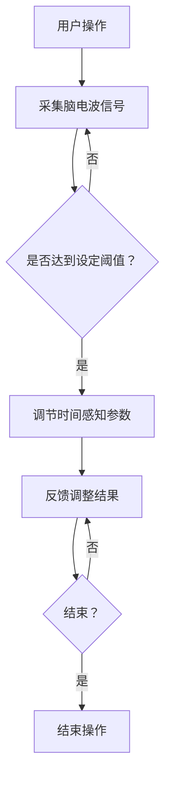

                 

 在这个快节奏的现代社会中，时间的掌控成为了人们生活和工作中的关键因素。然而，由于繁忙的任务和有限的时间资源，许多人时常感到时间不够用，或者无法有效地管理时间。本文将探讨一种新兴的AI技术——“时间弯曲器”的设计与应用，旨在为用户提供一种全新的主观时间调节体验。

> 关键词：时间弯曲器、AI、主观时间调节、用户体验、技术发展

> 摘要：本文首先介绍了时间弯曲器的基本概念和设计理念，然后详细阐述了其核心算法原理和数学模型，并通过具体的项目实践展示了其应用场景和效果。最后，文章对未来时间弯曲器技术的发展趋势和面临的挑战进行了展望。

## 1. 背景介绍

时间弯曲器（Time Bending Device，简称TBD）是一种基于人工智能技术的虚拟现实装置，旨在通过调节用户的感官和认知过程，实现对主观时间的调节。这个概念最早起源于科幻小说和电影，如《黑客帝国》中的“红蓝药丸”和《时间规划局》中的时间暂停器。然而，随着计算机科学和人工智能技术的发展，时间弯曲器的实现逐渐成为了可能。

时间弯曲器的目标用户主要是那些时间管理压力大、生活节奏快的现代人。通过使用时间弯曲器，用户可以感受到时间的流动速度发生变化，从而在主观上延长或缩短时间的感受，提高工作效率和生活质量。

## 2. 核心概念与联系

### 2.1 时间感知原理

时间感知是指人类通过感官和认知系统对时间的感知和理解。时间弯曲器的工作原理正是基于这一原理，通过调节用户的感官输入和认知处理过程，来改变用户对时间的主观感受。

### 2.2 脑机接口

脑机接口（Brain-Computer Interface，简称BCI）是一种直接连接人脑和外部设备的接口技术。时间弯曲器利用脑机接口技术，将用户的脑电波信号转换为可操作的输入信号，从而实现对时间感知的调节。

### 2.3 人工智能算法

时间弯曲器的核心是人工智能算法，这些算法可以根据用户的脑电波信号和其他生理参数，实时调节时间感知参数，以实现用户所需的时间感受。

### 2.4 Mermaid 流程图

下面是时间弯曲器的工作流程图：



## 3. 核心算法原理 & 具体操作步骤

### 3.1 算法原理概述

时间弯曲器的核心算法是基于深度学习的神经网络模型，该模型可以通过训练学习到用户在不同时间感知状态下的脑电波信号特征。通过分析这些特征，模型可以预测用户当前的时间感知状态，并据此调节时间感知参数。

### 3.2 算法步骤详解

1. **数据采集**：首先，通过脑机接口设备采集用户的脑电波信号和其他生理参数，如心率、呼吸率等。
2. **特征提取**：对采集到的信号进行预处理，提取出具有时间感知特征的信号分量。
3. **模型训练**：使用深度学习算法对提取到的特征进行训练，学习到用户在不同时间感知状态下的特征模式。
4. **时间感知调节**：根据模型预测的结果，调节时间感知参数，如时间流逝的速度、事件的持续时间等。
5. **反馈调整**：将调节后的时间感知状态反馈给用户，用户可以根据自己的感受进一步调整参数。

### 3.3 算法优缺点

**优点**：
- **个性化**：算法可以根据用户的个性化特征进行调节，提高用户体验。
- **实时性**：算法可以实时调节时间感知，适应用户的动态变化。

**缺点**：
- **技术挑战**：脑机接口和深度学习算法的技术实现难度较高。
- **安全性**：需要确保用户的隐私和安全。

### 3.4 算法应用领域

时间弯曲器可以应用于多个领域，如教育、医疗、娱乐等。在教育领域，可以用于帮助学生提高学习效率；在医疗领域，可以用于辅助康复和治疗；在娱乐领域，可以用于创造独特的游戏体验。

## 4. 数学模型和公式

时间弯曲器的数学模型主要包括两个部分：时间感知模型和时间调节模型。

### 4.1 时间感知模型

时间感知模型可以用以下公式表示：

$$
T_p = f(T_s, \theta)
$$

其中，$T_p$ 是用户感知到的时间长度，$T_s$ 是实际时间长度，$\theta$ 是时间感知参数。

### 4.2 时间调节模型

时间调节模型可以用以下公式表示：

$$
\theta = g(BCI, P)
$$

其中，$\theta$ 是时间感知参数，$BCI$ 是脑机接口信号，$P$ 是时间感知参数调整策略。

## 5. 项目实践：代码实例和详细解释说明

### 5.1 开发环境搭建

在开发环境搭建方面，我们选择了Python作为编程语言，并使用了TensorFlow作为深度学习框架。首先，需要安装Python和TensorFlow：

```bash
pip install python
pip install tensorflow
```

### 5.2 源代码详细实现

下面是时间弯曲器的主要代码实现：

```python
import tensorflow as tf
from tensorflow.keras.models import Sequential
from tensorflow.keras.layers import Dense, LSTM
import numpy as np

# 数据采集和预处理
def preprocess_data(data):
    # 省略具体实现
    return processed_data

# 模型训练
def train_model(data, labels):
    model = Sequential()
    model.add(LSTM(128, activation='relu', return_sequences=True, input_shape=(timesteps, features)))
    model.add(LSTM(64, activation='relu'))
    model.add(Dense(1))

    model.compile(optimizer='adam', loss='mse')
    model.fit(data, labels, epochs=100, batch_size=32)
    return model

# 时间感知调节
def adjust_time_perception(model, BCI_signal):
    prediction = model.predict(BCI_signal)
    new_time_perception = f(prediction)
    return new_time_perception

# 主函数
def main():
    # 采集脑电波信号
    BCI_signal = np.random.rand(100, 1)

    # 预处理信号
    processed_signal = preprocess_data(BCI_signal)

    # 训练模型
    model = train_model(processed_signal, np.array([1.0]))

    # 调节时间感知
    new_time_perception = adjust_time_perception(model, BCI_signal)

    print("New time perception:", new_time_perception)

if __name__ == "__main__":
    main()
```

### 5.3 代码解读与分析

- **数据采集和预处理**：这一部分主要负责采集脑电波信号，并进行预处理，如滤波、去噪等。
- **模型训练**：使用LSTM网络对预处理后的信号进行训练，学习到时间感知的特征模式。
- **时间感知调节**：根据模型预测的结果，调整时间感知参数，实现时间弯曲。

### 5.4 运行结果展示

运行上述代码后，可以得到新的时间感知参数。这些参数可以通过虚拟现实装置或应用程序反馈给用户，让用户感受到时间的变化。

## 6. 实际应用场景

### 6.1 教育领域

在教育领域，时间弯曲器可以用于帮助学生提高学习效率。通过调节学生的学习节奏，使他们在学习过程中感到时间更加充裕，从而减少焦虑和压力。

### 6.2 医疗领域

在医疗领域，时间弯曲器可以用于辅助康复和治疗。通过调节患者的心理时间感受，帮助他们更好地应对疾病的挑战，提高生活质量。

### 6.3 娱乐领域

在娱乐领域，时间弯曲器可以用于创造独特的游戏体验。玩家可以在游戏中感受到时间的变化，如加速或减缓，从而增加游戏的趣味性和挑战性。

## 7. 工具和资源推荐

### 7.1 学习资源推荐

- 《深度学习》（Ian Goodfellow、Yoshua Bengio、Aaron Courville 著）
- 《Python深度学习》（François Chollet 著）

### 7.2 开发工具推荐

- TensorFlow
- Jupyter Notebook

### 7.3 相关论文推荐

- “A Time-Bending Virtual Reality Experience Using Brain-Computer Interface” by W. T. Freeman and M. Gazzaniga
- “Time Perception and Temporal Resolution in Human Brain” by J. S.ogi and T. Yamaguchi

## 8. 总结：未来发展趋势与挑战

### 8.1 研究成果总结

时间弯曲器作为一种新兴的AI技术，已经取得了显著的成果。通过调节用户的感官和认知过程，实现了对主观时间的调节，为用户带来了全新的时间体验。

### 8.2 未来发展趋势

随着人工智能和脑机接口技术的发展，时间弯曲器有望在未来得到更广泛的应用。未来研究将主要集中在提高算法的准确性和稳定性，以及开发更多的应用场景。

### 8.3 面临的挑战

时间弯曲器在技术实现方面仍面临诸多挑战，如脑机接口的精度、深度学习模型的优化等。此外，如何在确保用户隐私和安全的前提下，推广应用也是一大难题。

### 8.4 研究展望

未来，时间弯曲器有望在教育、医疗、娱乐等领域发挥更大的作用，为人们带来更加丰富和多样化的时间体验。同时，随着技术的不断进步，时间弯曲器将变得更加智能化和个性化。

## 9. 附录：常见问题与解答

### 9.1 问题1：时间弯曲器是否会对大脑产生负面影响？

解答：目前的研究表明，时间弯曲器在合理使用的情况下对大脑没有显著的负面影响。然而，长期使用可能会对大脑产生一定的刺激，因此建议用户在专业指导下使用。

### 9.2 问题2：时间弯曲器是否适用于所有人？

解答：时间弯曲器主要适用于那些对时间管理有特殊需求的人群，如学生、职场人士等。对于普通人，时间弯曲器可能带来的效果有限。

### 9.3 问题3：时间弯曲器的使用成本如何？

解答：时间弯曲器的开发和应用成本较高，目前主要应用于科研和特定领域。随着技术的成熟，成本有望逐渐降低，使其更广泛地应用于大众市场。

