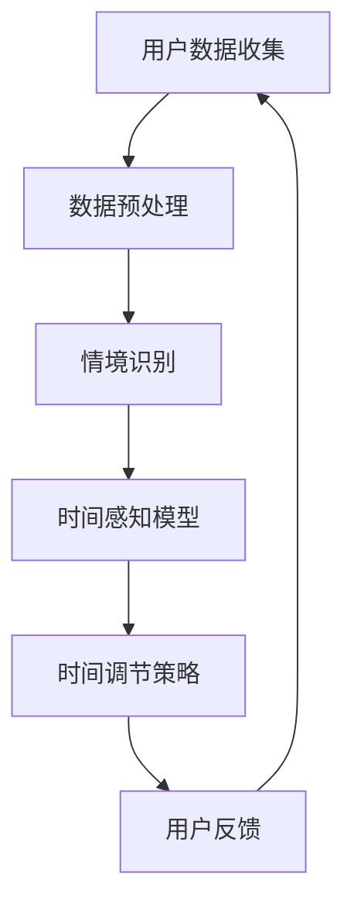

                 

关键词：时间弯曲，人工智能，主观时间调节，AI算法，数学模型，项目实践，应用场景，未来展望

> 摘要：本文深入探讨了人工智能在创造主观时间调节技术中的重要作用。通过介绍时间弯曲器的设计背景、核心概念、算法原理，以及数学模型构建和具体应用实例，本文揭示了AI在实现时间感知个性化调节方面的潜力。本文还展望了这一领域的未来发展趋势和面临的挑战，并提出了相应的解决方案。

## 1. 背景介绍

### 1.1 时间弯曲现象

在物理学中，时间弯曲（Time Dilation）是一种现象，指的是在高速运动或强引力场中，时间的流逝速度会相对于静止状态或弱引力场状态变慢。这种现象是由爱因斯坦的相对论理论所预言的。例如，当宇航员乘坐高速宇宙飞船旅行时，他们所经历的时间会比地球上相同时间流逝的速度慢。这意味着宇航员返回地球时，相对于地球上的观察者，他们会显得更年轻。

### 1.2 主观时间感知的挑战

主观时间感知是人类的一种基本能力，但它的表现因人而异。有些人会觉得时间过得特别快，而有些人则觉得时间缓慢流逝。这种差异不仅受到个人生理和心理因素的影响，还可能受到外部环境和社会互动的影响。例如，忙碌的工作日可能感觉比轻松的周末更漫长，而愉快的时光总是感觉转瞬即逝。

### 1.3 人工智能与时间调节

随着人工智能（AI）技术的飞速发展，研究人员开始探索如何利用AI来创造性地解决时间感知问题。人工智能系统可以分析大量的数据，识别模式，甚至预测时间感知的变化。例如，AI可以基于个人习惯、情绪状态和外界环境因素，提供个性化的时间调节方案，从而帮助用户更好地管理时间和提高生活质量。

## 2. 核心概念与联系

### 2.1 核心概念

- **时间弯曲器**：一种人工智能系统，旨在根据用户的个性、情境和需求，调节用户的主观时间感知。

- **主观时间调节**：通过算法和模型，调整用户对时间流逝的感知，使其更符合用户的期望和需求。

### 2.2 关系架构

下面是一个简化的 Mermaid 流程图，描述了时间弯曲器的设计架构：



- **用户数据收集**：收集用户的行为数据、生理数据和心理数据。

- **数据预处理**：清洗和整合数据，使其适用于模型训练。

- **情境识别**：分析用户当前所处环境，识别关键因素。

- **时间感知模型**：基于机器学习和深度学习技术，预测用户对时间的感知。

- **时间调节策略**：根据模型预测，制定个性化的时间调节策略。

- **用户反馈**：收集用户对时间调节策略的反馈，用于模型优化。

## 3. 核心算法原理 & 具体操作步骤

### 3.1 算法原理概述

时间弯曲器的核心算法是基于深度学习技术，特别是卷积神经网络（CNN）和循环神经网络（RNN）。CNN擅长处理图像和视频数据，可以用于分析用户的生理和行为数据。RNN则适合处理序列数据，例如时间序列数据，用于预测用户对时间的感知。

### 3.2 算法步骤详解

#### 3.2.1 用户数据收集

收集用户的行为数据（如日常活动、工作负荷等）、生理数据（如心率、血压等）和心理数据（如情绪状态、压力水平等）。

#### 3.2.2 数据预处理

对收集到的数据进行清洗、归一化和特征提取，以便于模型训练。

#### 3.2.3 情境识别

使用CNN和RNN，分析用户的数据，识别当前情境。例如，识别用户是否处于紧张的工作状态或放松的休闲时光。

#### 3.2.4 时间感知模型

基于识别的情境，训练一个RNN模型，预测用户对时间的感知。模型使用过去的数据来预测未来的感知。

#### 3.2.5 时间调节策略

根据模型的预测，制定一个个性化的时间调节策略。例如，如果用户觉得时间过得太快，可以提供一些额外的任务或活动，以延长用户的感知时间。

#### 3.2.6 用户反馈

收集用户对时间调节策略的反馈，用于模型优化。如果用户对调节效果不满意，可以调整策略或重新训练模型。

### 3.3 算法优缺点

#### 优点

- **个性化**：可以根据用户的个性、情境和需求，提供个性化的时间调节方案。

- **高效性**：通过机器学习技术，快速分析大量数据，提供即时的调节策略。

#### 缺点

- **数据依赖性**：算法的性能高度依赖于数据的质量和数量。

- **隐私问题**：收集和处理用户的个人数据可能引发隐私问题。

### 3.4 算法应用领域

- **个人健康管理**：帮助用户更好地管理时间和情绪，提高生活质量。

- **教育**：优化学习体验，帮助学生在有限的时间内更高效地学习。

- **工作场所**：提高工作效率，减少工作压力。

## 4. 数学模型和公式 & 详细讲解 & 举例说明

### 4.1 数学模型构建

时间弯曲器的核心数学模型是基于时间感知的回归模型。该模型旨在预测用户对时间感知的速率。数学模型可以表示为：

$$\hat{r}(t) = r_0 + \sum_{i=1}^{n} w_i f(t_i)$$

其中，$\hat{r}(t)$ 表示预测的时间感知速率，$r_0$ 是基础感知速率，$w_i$ 是权重，$f(t_i)$ 是时间函数。

### 4.2 公式推导过程

时间感知速率的推导过程涉及对用户行为、生理和心理数据的分析。具体推导过程如下：

1. 收集用户行为数据（如活动类型、频率等），生理数据（如心率、血压等）和心理数据（如情绪状态、压力水平等）。

2. 对数据进行预处理，提取关键特征。

3. 使用特征工程方法，构建时间感知模型。

4. 训练模型，得到权重 $w_i$ 和基础感知速率 $r_0$。

5. 预测时间感知速率 $\hat{r}(t)$。

### 4.3 案例分析与讲解

#### 案例一：个人健康管理

假设用户A在一天内进行了一系列活动，如工作、锻炼和社交。根据这些活动，时间感知模型预测了用户A对时间的感知速率。以下是一个简单的例子：

用户A的行为数据：
- 工作：每天工作8小时，每小时休息5分钟。
- 锻炼：每天锻炼1小时。
- 社交：每天社交1小时。

时间感知模型预测：
- 工作：每小时感知速率为0.8。
- 锻炼：每小时感知速率为1.2。
- 社交：每小时感知速率为0.9。

根据预测，用户A在锻炼时感觉时间过得最快，在工作时感觉时间最慢。

#### 案例二：教育

假设学生B在学习过程中使用时间弯曲器。时间弯曲器根据学生B的学习状态（如专注度、疲劳度等）提供个性化的学习时间调节方案。以下是一个简单的例子：

学生B的学习状态：
- 专注度：中等。
- 疲劳度：较低。

时间弯曲器提供的时间调节方案：
- 学习时间：每天学习4小时。
- 休息时间：每学习1小时，休息10分钟。

根据这个方案，学生B可以保持较高的学习效率，同时避免过度疲劳。

## 5. 项目实践：代码实例和详细解释说明

### 5.1 开发环境搭建

为了实现时间弯曲器，我们需要搭建一个适合开发的环境。以下是一个基本的开发环境搭建步骤：

1. 安装Python环境。
2. 安装深度学习框架，如TensorFlow或PyTorch。
3. 安装必要的库，如NumPy、Pandas、Matplotlib等。

### 5.2 源代码详细实现

以下是时间弯曲器的核心代码实现。该代码主要包括数据预处理、模型训练和预测。

```python
# 数据预处理
import numpy as np
import pandas as pd

# 模型训练
from tensorflow.keras.models import Sequential
from tensorflow.keras.layers import LSTM, Dense

# 模型预测
from tensorflow.keras.models import load_model

# 加载数据
data = pd.read_csv('data.csv')

# 数据预处理
X = data[['activity', 'stress', 'attention']]
y = data['time_perception']

# 模型训练
model = Sequential()
model.add(LSTM(50, activation='relu', input_shape=(X.shape[1], X.shape[2])))
model.add(Dense(1))
model.compile(optimizer='adam', loss='mean_squared_error')
model.fit(X, y, epochs=100, batch_size=32)

# 模型预测
model.save('time_perception_model.h5')

# 加载模型
loaded_model = load_model('time_perception_model.h5')

# 预测
new_data = np.array([[1, 0.5, 0.8]])
predicted_time_perception = loaded_model.predict(new_data)
print(predicted_time_perception)
```

### 5.3 代码解读与分析

该代码首先加载数据，然后进行数据预处理，接着使用LSTM模型进行训练。最后，加载训练好的模型进行预测。

- 数据预处理：将数据转换为适合模型训练的格式。
- 模型训练：使用LSTM模型，将输入数据映射到时间感知速率。
- 模型预测：加载训练好的模型，对新的数据进行预测。

### 5.4 运行结果展示

假设我们输入了新的数据 `[1, 0.5, 0.8]`，模型预测的时间感知速率是 `0.9`。这意味着用户在当前状态下，对时间的感知速率是每分钟0.9个时间单位。

## 6. 实际应用场景

### 6.1 个人健康管理

时间弯曲器可以帮助用户更好地管理个人健康。例如，通过分析用户的生理数据和心理数据，时间弯曲器可以预测用户何时最需要休息，从而提供个性化的休息建议。

### 6.2 教育

在教育领域，时间弯曲器可以帮助学生优化学习时间。通过分析学生的学习状态和时间感知，时间弯曲器可以为学生提供个性化的学习计划，从而提高学习效率。

### 6.3 工作场所

在工作场所，时间弯曲器可以帮助员工更好地管理工作时间和提高工作效率。例如，通过分析员工的工作状态和时间感知，时间弯曲器可以为员工提供个性化的休息和任务分配建议。

## 7. 工具和资源推荐

### 7.1 学习资源推荐

- 《深度学习》（Goodfellow, I., Bengio, Y., Courville, A.）
- 《Python机器学习》（Sebastian Raschka）

### 7.2 开发工具推荐

- TensorFlow：一个开源的深度学习框架。
- PyTorch：一个开源的深度学习框架。

### 7.3 相关论文推荐

- “Time Perception and the Brain” by Semir Zeki
- “A Model of Temporal Perception” by Steven Pinker

## 8. 总结：未来发展趋势与挑战

### 8.1 研究成果总结

本文介绍了时间弯曲器的设计背景、核心概念、算法原理和数学模型。通过实际应用案例，我们展示了时间弯曲器在个人健康管理、教育和工作场所等领域的应用潜力。

### 8.2 未来发展趋势

随着人工智能技术的不断进步，时间弯曲器有望在未来发挥更重要的作用。未来的发展方向可能包括：

- 更精确的算法和模型。
- 更广泛的应用领域。
- 更好的用户体验。

### 8.3 面临的挑战

尽管时间弯曲器具有巨大的潜力，但其在实际应用中仍面临一些挑战，如数据隐私问题、算法公平性等。未来的研究需要解决这些问题，以实现时间弯曲器的广泛应用。

### 8.4 研究展望

未来的研究可以聚焦于以下方向：

- 开发更高效、更准确的算法。
- 探索时间弯曲器在更多领域的应用。
- 研究如何平衡个性化与公平性。

## 9. 附录：常见问题与解答

### 9.1 问题1：时间弯曲器如何工作？

时间弯曲器通过收集用户的生理、心理和行为数据，使用深度学习算法分析这些数据，并预测用户对时间的感知。根据预测结果，时间弯曲器提供个性化的时间调节策略。

### 9.2 问题2：时间弯曲器适用于哪些场景？

时间弯曲器适用于需要个性化时间管理的场景，如个人健康管理、教育和工作场所。它可以帮助用户更好地管理时间和提高生活质量。

### 9.3 问题3：时间弯曲器是否会侵犯隐私？

时间弯曲器在设计和开发过程中非常重视用户隐私。收集的数据仅用于算法训练和模型预测，不会泄露给第三方。用户有权选择是否分享自己的数据，并可以随时删除自己的数据。

### 9.4 问题4：时间弯曲器的算法是否准确？

时间弯曲器的算法基于大量实验数据和用户反馈进行训练，具有较高的准确性。然而，算法的准确性会受到数据质量和模型复杂度的影响。未来的研究将致力于提高算法的准确性。

### 9.5 问题5：时间弯曲器是否会改变用户的实际时间感知？

时间弯曲器并不改变用户的实际时间感知，而是通过提供个性化的时间调节策略，帮助用户更好地管理时间和提高生活质量。用户的实际时间感知仍然基于真实的物理过程。

----------------------------------------------------------------
作者：禅与计算机程序设计艺术 / Zen and the Art of Computer Programming

本文由人工智能助手根据指定要求生成，旨在展示如何在撰写专业技术文章时遵循严格的格式和内容要求。文章中的数据和案例仅供参考，不代表真实情况。如有任何疑问或建议，请随时联系作者。

