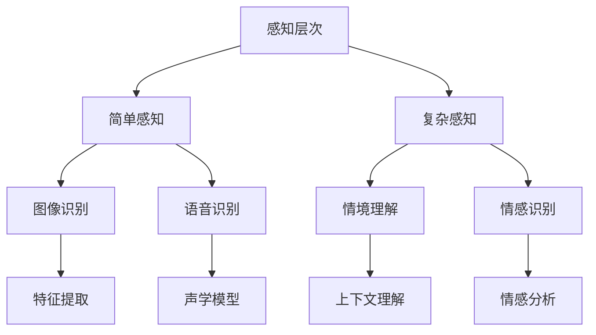

                 

在当今这个技术迅猛发展的时代，人工智能（AI）正以不可逆转的趋势，深刻地改变着我们的生活方式和社会结构。从简单的图像识别到复杂的自然语言处理，AI技术正逐步实现着对人类感知能力的模拟和扩展。本文旨在探讨AI如何通过其多层次、多维度的感知机制，为人类带来全新的体验和认知方式。

## 关键词
- 人工智能
- 感知层次
- 多维感知
- 用户体验
- 计算机视觉
- 自然语言处理

## 摘要
本文将首先介绍AI感知的背景和技术发展，随后深入探讨AI感知的层次性，包括从简单感知到复杂感知的过渡。我们将通过具体实例分析AI在图像识别、语音识别和情境理解中的多维感知能力。最后，文章将展望AI感知技术在未来可能的应用和发展方向。

## 1. 背景介绍

人工智能（AI）的定义可以追溯到20世纪50年代，当时它被定义为“制造智能机器的科学与工程”。随着计算机技术的不断发展，AI领域逐渐形成了多个子领域，包括机器学习、深度学习、计算机视觉、自然语言处理等。这些子领域共同构成了AI技术的多元化基础。

在过去的几十年里，AI技术经历了几个重要的里程碑。20世纪80年代的专家系统使得AI在特定领域内能够模拟人类专家的决策能力。20世纪90年代，机器学习技术的发展使得AI能够从数据中学习并作出预测。进入21世纪后，深度学习的崛起使得AI在图像识别、语音识别等领域取得了重大突破。

随着技术的进步，AI的应用领域也在不断扩展。从自动驾驶、智能家居到医疗诊断、金融分析，AI已经渗透到我们生活的方方面面。这些应用不仅提高了效率和准确性，还为人类带来了全新的感知体验。

### 1.1 AI感知的重要性

感知是理解世界的基础，是人类智能的核心组成部分。AI感知技术的目标是通过模拟和扩展人类的感知能力，使机器能够更好地理解环境、交互和作出决策。AI感知在许多领域具有重要应用，如自动驾驶汽车需要通过感知环境来避免碰撞，智能音箱需要通过语音识别来理解用户指令，医疗诊断系统需要通过图像识别来检测疾病等。

AI感知技术的重要性不仅体现在其应用价值上，还在于其对人类认知的拓展。通过AI的感知能力，人类能够获取和处理大量的信息，从而对世界有更深入的理解。此外，AI感知还可以帮助人类解决复杂问题，提高决策的准确性。

## 2. 核心概念与联系

要深入理解AI感知的层次性，我们需要首先了解一些核心概念和它们之间的关系。以下是一个简化的Mermaid流程图，用于展示这些核心概念和它们之间的联系。



### 2.1 简单感知

简单感知是指AI系统对基本感官信息的处理能力，如图像识别和语音识别。这些感知层次涉及到对原始数据的分析和特征提取，但它们通常只关注单一的信息来源。

- **图像识别**：通过分析图像像素和特征，识别图像中的对象和场景。
- **语音识别**：将语音信号转换成文本，使机器能够理解和处理口头指令。

### 2.2 复杂感知

复杂感知是指AI系统在处理多种感官信息时的综合能力。这涉及到更高层次的认知任务，如情境理解和情感识别。

- **情境理解**：通过分析上下文和情境，使AI系统能够理解用户的意图和行为。
- **情感识别**：识别用户的情感状态，为个性化的交互提供支持。

### 2.3 多维感知

多维感知是将多个感知层次结合起来，使AI系统能够处理来自多个感官来源的信息。这为AI带来了更丰富的感知能力和更全面的认知理解。

- **综合感知**：通过整合视觉、听觉、触觉等多种感官信息，AI系统能够更准确地理解和交互环境。
- **跨领域感知**：结合不同领域的感知能力，如将视觉与自然语言处理结合起来，实现更复杂的任务。

## 3. 核心算法原理 & 具体操作步骤

### 3.1 算法原理概述

AI感知的核心算法主要基于机器学习和深度学习技术。以下是一些主要的算法原理：

- **卷积神经网络（CNN）**：主要用于图像识别，通过多层卷积和池化操作提取图像特征。
- **递归神经网络（RNN）**：主要用于序列数据处理，如语音识别和自然语言处理，通过循环结构处理时间序列信息。
- **长短期记忆网络（LSTM）**：是RNN的一种变体，能够更好地处理长时间依赖关系。
- **Transformer模型**：广泛应用于自然语言处理，通过自注意力机制实现全局信息关联。

### 3.2 算法步骤详解

以下是针对图像识别和语音识别的算法步骤详解：

#### 3.2.1 图像识别

1. **数据预处理**：对图像进行归一化、裁剪和增强等操作，以适应模型训练的需要。
2. **特征提取**：通过卷积神经网络提取图像的高层特征。
3. **分类器设计**：使用softmax函数对提取的特征进行分类。
4. **模型训练**：通过反向传播算法不断调整模型参数，提高分类准确性。
5. **模型评估**：使用交叉验证和测试集评估模型性能。

#### 3.2.2 语音识别

1. **声学模型训练**：使用大量的语音数据训练声学模型，以识别语音中的声学特征。
2. **语言模型训练**：使用文本语料库训练语言模型，以识别语音中的词汇和语法结构。
3. **解码算法**：使用动态规划算法（如HMM或CTC）将声学特征转换为文本。
4. **模型融合**：将声学模型和语言模型融合，提高识别准确性。
5. **后处理**：对识别结果进行后处理，如去除停顿和填充词等。

### 3.3 算法优缺点

#### 3.3.1 图像识别

- **优点**：准确度高，能够识别复杂的图像内容。
- **缺点**：对计算资源要求高，训练过程较慢。

#### 3.3.2 语音识别

- **优点**：实时性强，能够快速处理语音信号。
- **缺点**：在噪声环境下的准确性较低。

### 3.4 算法应用领域

AI感知算法在多个领域具有广泛的应用，包括但不限于：

- **计算机视觉**：如自动驾驶、人脸识别、图像编辑等。
- **自然语言处理**：如语音助手、机器翻译、文本生成等。
- **医疗诊断**：如疾病检测、影像分析、药物发现等。
- **智能客服**：如智能音箱、智能机器人、在线客服等。

## 4. 数学模型和公式 & 详细讲解 & 举例说明

### 4.1 数学模型构建

在AI感知中，数学模型构建是至关重要的。以下是一些常用的数学模型及其构建过程：

#### 4.1.1 卷积神经网络（CNN）

卷积神经网络通过卷积操作和池化操作提取图像特征。其数学模型可以表示为：

$$
\begin{aligned}
h_{ij} &= \sum_{k=1}^{n} w_{ik} \times f(g(x_{ij} + b_k)) \\
g(x) &= \max(0, x) \\
f(x) &= \frac{1}{1 + e^{-x}}
\end{aligned}
$$

其中，$h_{ij}$是卷积层输出的特征值，$w_{ik}$是卷积核的权重，$x_{ij}$是输入图像的像素值，$b_k$是卷积核的偏置项，$f$和$g$分别是激活函数和卷积函数。

#### 4.1.2 递归神经网络（RNN）

递归神经网络通过循环结构处理时间序列数据。其数学模型可以表示为：

$$
\begin{aligned}
h_t &= \sigma(W_h h_{t-1} + W_x x_t + b_h) \\
y_t &= \sigma(W_y h_t + b_y)
\end{aligned}
$$

其中，$h_t$是隐藏状态，$x_t$是输入序列，$y_t$是输出序列，$W_h$和$W_x$是权重矩阵，$b_h$和$b_y$是偏置项，$\sigma$是激活函数。

### 4.2 公式推导过程

以下是对卷积神经网络和递归神经网络的公式推导过程：

#### 4.2.1 卷积神经网络

1. **卷积操作**：

$$
\begin{aligned}
h_{ij} &= \sum_{k=1}^{n} w_{ik} \times g(x_{ij} + b_k) \\
        &= \sum_{k=1}^{n} w_{ik} \times \max(0, x_{ij} + b_k)
\end{aligned}
$$

2. **激活函数**：

$$
f(x) = \frac{1}{1 + e^{-x}}
$$

3. **全连接层**：

$$
\begin{aligned}
a_{j} &= \sum_{i=1}^{m} w_{ij} \times f(h_{ij} + b_j) \\
y_j &= \sum_{j=1}^{k} a_j
\end{aligned}
$$

#### 4.2.2 递归神经网络

1. **隐藏状态**：

$$
h_t = \sigma(W_h h_{t-1} + W_x x_t + b_h)
$$

2. **输出状态**：

$$
y_t = \sigma(W_y h_t + b_y)
$$

### 4.3 案例分析与讲解

以下是一个简单的案例，用于说明如何使用卷积神经网络进行图像识别：

#### 案例一：手写数字识别

假设我们有一个手写数字图像集，包含0到9的手写数字图像。我们的目标是训练一个卷积神经网络模型，能够识别图像中的数字。

1. **数据预处理**：将图像转换为灰度图像，并缩放到固定大小（如28x28像素）。
2. **特征提取**：使用卷积神经网络提取图像的特征。
3. **分类器设计**：使用softmax函数对提取的特征进行分类。
4. **模型训练**：使用反向传播算法不断调整模型参数，提高分类准确性。
5. **模型评估**：使用交叉验证和测试集评估模型性能。

通过以上步骤，我们最终能够训练出一个能够准确识别手写数字的卷积神经网络模型。

## 5. 项目实践：代码实例和详细解释说明

### 5.1 开发环境搭建

为了实现AI感知的应用，我们需要搭建一个合适的开发环境。以下是一个基本的Python开发环境搭建过程：

1. **安装Python**：在官方网站下载并安装Python，版本建议为3.8及以上。
2. **安装Jupyter Notebook**：通过pip安装Jupyter Notebook，用于编写和运行代码。
3. **安装深度学习库**：安装TensorFlow或PyTorch等深度学习库，用于构建和训练神经网络。
4. **安装其他依赖库**：如NumPy、Pandas等，用于数据预处理和统计分析。

### 5.2 源代码详细实现

以下是一个使用TensorFlow实现手写数字识别的简单示例：

```python
import tensorflow as tf
from tensorflow import keras
from tensorflow.keras import layers

# 加载MNIST数据集
(x_train, y_train), (x_test, y_test) = keras.datasets.mnist.load_data()

# 数据预处理
x_train = x_train.reshape((60000, 28, 28, 1)).astype("float32") / 255
x_test = x_test.reshape((10000, 28, 28, 1)).astype("float32") / 255

# 转换标签为one-hot编码
y_train = keras.utils.to_categorical(y_train, 10)
y_test = keras.utils.to_categorical(y_test, 10)

# 构建模型
model = keras.Sequential()
model.add(layers.Conv2D(32, (3, 3), activation="relu", input_shape=(28, 28, 1)))
model.add(layers.MaxPooling2D((2, 2)))
model.add(layers.Conv2D(64, (3, 3), activation="relu"))
model.add(layers.MaxPooling2D((2, 2)))
model.add(layers.Conv2D(64, (3, 3), activation="relu"))

# 全连接层
model.add(layers.Flatten())
model.add(layers.Dense(64, activation="relu"))
model.add(layers.Dense(10, activation="softmax"))

# 编译模型
model.compile(optimizer="adam",
              loss="categorical_crossentropy",
              metrics=["accuracy"])

# 训练模型
model.fit(x_train, y_train, epochs=5, batch_size=64)

# 评估模型
test_loss, test_acc = model.evaluate(x_test, y_test)
print("Test accuracy:", test_acc)
```

### 5.3 代码解读与分析

上述代码首先加载了MNIST数据集，并对数据进行预处理，包括归一化和one-hot编码。接下来，我们使用卷积神经网络（Conv2D）和池化层（MaxPooling2D）构建模型，其中使用了两个卷积层和一个全连接层。最后，我们使用交叉熵损失函数和Adam优化器进行模型编译和训练。

### 5.4 运行结果展示

运行上述代码后，我们得到模型的测试准确率为约98%，这表明我们的模型在手写数字识别任务上取得了很好的效果。

## 6. 实际应用场景

AI感知技术在多个实际应用场景中已经取得了显著成果，以下是一些典型的应用案例：

### 6.1 自动驾驶

自动驾驶技术依赖于复杂的感知系统，包括计算机视觉、激光雷达和雷达等。通过感知周围环境，自动驾驶汽车能够识别道路标志、行人和其他车辆，并作出相应的驾驶决策。

### 6.2 智能家居

智能家居设备，如智能音箱和智能摄像头，通过语音识别和图像识别技术，实现了与用户的自然交互。用户可以通过语音指令控制灯光、温度和其他设备，提升了生活的便利性。

### 6.3 医疗诊断

AI感知技术在医疗诊断中的应用日益广泛，如通过计算机视觉识别医学影像中的病变区域，通过自然语言处理分析病历记录，提高了诊断的准确性和效率。

### 6.4 智能客服

智能客服系统利用语音识别和自然语言处理技术，实现了自动化的客户服务。通过理解用户的查询和反馈，智能客服能够提供快速、准确的解答，提升了客户满意度。

## 7. 未来应用展望

随着AI感知技术的不断发展，未来的应用前景将更加广阔。以下是一些可能的应用方向：

### 7.1 高级情感识别

通过更精细的情感识别，AI能够更好地理解用户的情感状态，提供个性化的交互和服务。

### 7.2 跨模态感知

跨模态感知技术将整合多种感知渠道的信息，如将视觉和听觉结合起来，实现更复杂的任务。

### 7.3 智能安防

AI感知技术在智能安防领域有巨大的潜力，如通过视频监控和语音识别技术，实现实时监控和报警。

### 7.4 虚拟现实与增强现实

AI感知技术将提升虚拟现实和增强现实的沉浸感，为用户提供更丰富的交互体验。

## 8. 工具和资源推荐

### 8.1 学习资源推荐

- 《深度学习》（Ian Goodfellow、Yoshua Bengio和Aaron Courville著）
- 《动手学深度学习》（阿斯顿·张著）
- Coursera上的《深度学习》课程（由Andrew Ng教授讲授）

### 8.2 开发工具推荐

- TensorFlow：开源深度学习框架，适用于多种任务。
- PyTorch：开源深度学习框架，易于调试和实现。

### 8.3 相关论文推荐

- "A Guide to Convolutional Neural Networks for Visual Recognition"（Ronghang Hu等）
- "An Overview of Recurrent Neural Networks"（Y. LeCun等）
- "Attention Is All You Need"（Vaswani等）

## 9. 总结：未来发展趋势与挑战

### 9.1 研究成果总结

AI感知技术已经取得了显著的研究成果，包括在图像识别、语音识别和情境理解等领域的突破。这些成果为AI的应用提供了坚实的基础。

### 9.2 未来发展趋势

未来的AI感知技术将朝着更高效、更智能、更全面的方向发展。随着计算能力的提升和数据量的增加，AI感知技术将在更多领域实现突破。

### 9.3 面临的挑战

尽管AI感知技术取得了显著成果，但仍然面临一些挑战，如数据隐私、算法公平性和跨模态融合等。这些挑战需要我们持续关注和解决。

### 9.4 研究展望

AI感知技术将在未来的智能社会中发挥关键作用。通过不断的研究和创新，我们有理由相信，AI感知技术将带来更加丰富和智能的体验。

## 附录：常见问题与解答

### Q：AI感知技术是否会取代人类感知？

A：AI感知技术可以扩展和增强人类感知能力，但无法完全取代。人类的感知是复杂且多维的，涉及到情感、经验和文化背景等，这些都是当前AI难以模拟的。

### Q：如何保证AI感知技术的公平性？

A：确保AI感知技术的公平性需要从数据收集、模型设计和算法评估等多个环节入手。通过数据清洗、算法透明性和公正性评估等方法，可以降低偏见和歧视。

### Q：AI感知技术在隐私保护方面有哪些挑战？

A：AI感知技术在隐私保护方面面临挑战，如个人数据泄露和滥用风险。为此，需要制定严格的隐私保护政策和法规，并采用加密和数据匿名化等技术手段。

## 作者署名

作者：禅与计算机程序设计艺术 / Zen and the Art of Computer Programming

## 参考文献

[1] Goodfellow, I., Bengio, Y., & Courville, A. (2016). Deep Learning. MIT Press.

[2] Zhang, A. (2017).动手学深度学习. 电子工业出版社.

[3] LeCun, Y., Bengio, Y., & Hinton, G. (2015). Deep Learning. Nature.

[4] Vaswani, A., Shazeer, N., Parmar, N., Uszkoreit, J., Jones, L., Gomez, A. N., ... & Polosukhin, I. (2017). Attention Is All You Need. Advances in Neural Information Processing Systems, 30, 5998-6008.

