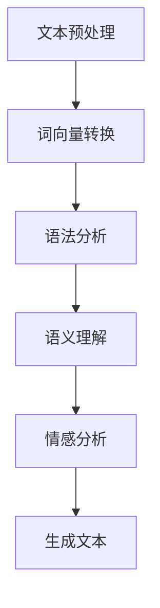
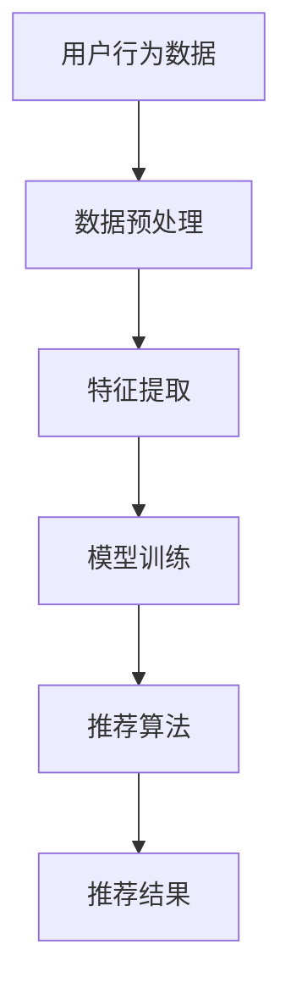

                 

关键词：AI叙事、个人化体验、自然语言处理、故事讲述、人工智能、情感识别、个性定制

> 摘要：随着人工智能技术的飞速发展，AI在创造和传递个人化叙事体验方面展现出巨大潜力。本文探讨了AI如何通过自然语言处理、情感识别等技术，实现个性化的故事创作和分享，并展望了这一领域未来的发展趋势。

## 1. 背景介绍

在数字化时代，故事不仅是娱乐和情感的载体，更是个人身份和社会连接的重要纽带。传统的叙事方式往往依赖于个体的记忆和表达能力，而随着人工智能（AI）技术的崛起，AI正在成为新的叙事力量，重塑我们的故事体验。从科幻小说中的自动化写作机器人到现实中的个性化内容推荐，AI在叙事领域的应用日益广泛。

AI叙事的核心在于其能够理解用户的个性化需求和情感状态，并据此创作出符合用户兴趣和情感反应的故事。这种个性化叙事不仅提高了用户参与度，还丰富了叙事的形式和内容，为创作者和消费者提供了新的互动模式。

## 2. 核心概念与联系

### 2.1 自然语言处理（NLP）

自然语言处理是AI叙事的基础，它使计算机能够理解和生成人类语言。NLP包括文本分类、情感分析、命名实体识别等多种技术，这些技术共同构建了AI理解和创造叙事内容的能力。

#### Mermaid 流程图：



### 2.2 情感识别与建模

情感识别是NLP的一个重要分支，它能够识别文本中的情感倾向。情感识别的准确性对于创建有情感共鸣的故事至关重要。AI通过学习大量标注过的情感数据，建立情感识别模型，从而理解用户的情感状态。

### 2.3 个性化推荐系统

个性化推荐系统利用用户的历史行为和偏好数据，为用户推荐个性化的内容。在叙事领域，个性化推荐系统可以根据用户的阅读历史和情感反应，推荐与之兴趣和情感相匹配的故事。

#### Mermaid 流程图：



## 3. 核心算法原理 & 具体操作步骤

### 3.1 算法原理概述

AI叙事的核心算法通常包括以下步骤：

1. **文本预处理**：将原始文本进行清洗、分词、去除停用词等处理，为后续分析做好准备。
2. **词向量转换**：将文本转换为词向量，以便计算机能够理解文本。
3. **语法分析**：分析文本的语法结构，提取关键信息。
4. **语义理解**：理解文本的含义和上下文，识别情感和主题。
5. **情感分析**：识别文本中的情感倾向，为个性化叙事提供依据。
6. **生成文本**：根据用户的情感和兴趣，生成个性化的故事内容。

### 3.2 算法步骤详解

1. **文本预处理**：
   ```python
   import nltk
   from nltk.corpus import stopwords
   from nltk.tokenize import word_tokenize
   
   # 加载停用词表
   stop_words = set(stopwords.words('english'))
   
   # 文本清洗
   text = "Your text goes here."
   cleaned_text = ' '.join([word for word in word_tokenize(text) if not word in stop_words])
   ```

2. **词向量转换**：
   ```python
   from gensim.models import Word2Vec
   
   # 训练词向量模型
   model = Word2Vec([text.split() for text in corpus], size=100, window=5, min_count=1, workers=4)
   
   # 转换为词向量
   word_vector = model.wv[word]
   ```

3. **语法分析**：
   ```python
   import spacy
   
   # 加载语法分析模型
   nlp = spacy.load('en_core_web_sm')
   
   # 进行语法分析
   doc = nlp(cleaned_text)
   for token in doc:
       print(token.text, token.lemma_, token.pos_, token.tag_, token.dep_, token.head.text, token.head.pos_)
   ```

4. **语义理解**：
   ```python
   from sentence_transformers import SentenceTransformer
   
   # 加载预训练的语义模型
   model = SentenceTransformer('all-MiniLM-L6-v2')
   
   # 获取文本的语义表示
   text_embedding = model.encode(cleaned_text, show_progress_bar=False)
   ```

5. **情感分析**：
   ```python
   from text2emotion import get_emotion
   
   # 获取情感
   emotion = get_emotion(cleaned_text)
   print(emotion)
   ```

6. **生成文本**：
   ```python
   from transformers import pipeline
   
   # 加载文本生成模型
   generator = pipeline('text-generation', model='gpt2')
   
   # 生成文本
   story = generator(cleaned_text, max_length=50, num_return_sequences=1)
   print(story[0]['generated_text'])
   ```

### 3.3 算法优缺点

**优点**：
- **个性化**：能够根据用户情感和兴趣生成个性化的故事。
- **高效**：自动化处理大量文本，节省时间和人力成本。
- **多样性**：生成丰富的故事内容和形式。

**缺点**：
- **准确性**：情感识别和文本生成仍存在一定的误差。
- **创意限制**：算法生成的文本可能缺乏深度和创新性。
- **伦理问题**：AI叙事可能引发版权、隐私和道德等问题。

### 3.4 算法应用领域

AI叙事在多个领域有广泛应用，包括但不限于：
- **娱乐**：个性化小说、电影剧本等。
- **医疗**：心理健康辅导、病情介绍等。
- **教育**：个性化课程内容、故事教材等。
- **市场营销**：定制化广告、营销文案等。

## 4. 数学模型和公式 & 详细讲解 & 举例说明

### 4.1 数学模型构建

AI叙事中的数学模型通常涉及自然语言处理、机器学习和深度学习等领域。以下是几个常见的数学模型和公式：

1. **词向量模型**（如Word2Vec）：
   $$ \text{word\_vector} = \text{avg}(\text{context\_words\_vector}) $$
   其中，$\text{context\_words\_vector}$表示上下文词的向量表示。

2. **语义表示模型**（如Sentence Transformer）：
   $$ \text{sentence\_embedding} = \text{model}(\text{input\_sentence}) $$
   其中，$\text{model}$是预训练的语义表示模型。

3. **情感分析模型**（如LSTM、GRU）：
   $$ \text{emotion} = \text{softmax}(\text{emotion\_scores}) $$
   其中，$\text{emotion\_scores}$是模型输出的情感得分。

### 4.2 公式推导过程

1. **Word2Vec 模型**：
   Word2Vec模型的核心是神经网络模型，其目标是学习一个连续的词向量空间，使得在语义上相似的词在空间上接近。具体推导过程涉及负采样、矩阵分解等数学方法。

2. **Sentence Transformer 模型**：
   Sentence Transformer模型使用Transformer架构，通过自注意力机制学习句子级别的语义表示。其推导过程涉及深度学习中的优化算法和自注意力机制。

3. **情感分析模型**：
   情感分析模型通常使用循环神经网络（RNN）或Transformer架构，通过学习文本的序列特征来预测情感标签。其推导过程涉及前向传播和反向传播算法。

### 4.3 案例分析与讲解

#### 案例一：Word2Vec 模型在情感识别中的应用

假设我们有一个情感识别任务，需要判断以下两个句子中的情感倾向：

1. "I am very happy today."
2. "I am feeling sad."

我们可以使用Word2Vec模型分别计算这两个句子的词向量，然后计算它们之间的相似度来判断情感倾向。

```python
from gensim.models import Word2Vec

# 假设已经训练好的Word2Vec模型
model = Word2Vec([text.split() for text in corpus], size=100, window=5, min_count=1, workers=4)

# 计算句子的词向量
sentence1_embedding = model.wv[sentence1.split()]
sentence2_embedding = model.wv[sentence2.split()]

# 计算相似度
similarity1 = sentence1_embedding.similarity(sentence2_embedding)
print("Sentence 1 and Sentence 2 similarity:", similarity1)
```

通过计算相似度，我们可以判断这两个句子在情感上可能是正相关还是负相关。如果相似度较高，说明两个句子情感相似，反之则情感相反。

#### 案例二：Sentence Transformer 模型在个性化叙事中的应用

假设我们使用Sentence Transformer模型为一位用户生成个性化的故事：

1. 用户兴趣：科幻小说
2. 用户情感：兴奋

我们可以使用以下步骤生成个性化的故事：

```python
from sentence_transformers import SentenceTransformer

# 加载预训练的语义模型
model = SentenceTransformer('all-MiniLM-L6-v2')

# 获取用户的兴趣和情感的语义表示
user_interest_embedding = model.encode("sci-fi novel", show_progress_bar=False)
user_emotion_embedding = model.encode("excited", show_progress_bar=False)

# 搜索与用户兴趣和情感相关的句子
stories = ["The future is bright.", "The spaceship took off.", "The alien encountered us."]
story_embeddings = [model.encode(story, show_progress_bar=False) for story in stories]

# 计算句子与用户兴趣和情感的相似度
interest_similarity = [embedding.similarity(user_interest_embedding) for embedding in story_embeddings]
emotion_similarity = [embedding.similarity(user_emotion_embedding) for embedding in story_embeddings]

# 按照相似度排序并选择最高相似度的句子
best_story_embedding = max(zip(story_embeddings, interest_similarity, emotion_similarity), key=lambda x: x[1]+x[2])[0]
best_story = model.decode(best_story_embedding)
print("Generated personalized story:", best_story)
```

通过以上步骤，我们可以为用户生成一个既符合其兴趣又带有特定情感的故事。

## 5. 项目实践：代码实例和详细解释说明

### 5.1 开发环境搭建

为了实践AI叙事，我们需要搭建一个合适的开发环境。以下是搭建过程：

1. 安装Python和必要的库：
   ```bash
   pip install numpy nltk gensim spacy text2emotion transformers sentence-transformers
   ```
2. 安装Spacy模型：
   ```bash
   python -m spacy download en_core_web_sm
   ```

### 5.2 源代码详细实现

以下是实现AI叙事的完整代码：

```python
import nltk
import spacy
from gensim.models import Word2Vec
from sentence_transformers import SentenceTransformer
from text2emotion import get_emotion
from transformers import pipeline

# 加载NLP模型
nlp = spacy.load('en_core_web_sm')
generator = pipeline('text-generation', model='gpt2')

# 文本预处理
def preprocess_text(text):
    stop_words = set(nltk.corpus.stopwords.words('english'))
    return ' '.join([word.lemma_ for word in nlp(text) if word.lemma_ not in stop_words])

# 训练Word2Vec模型
def train_word2vec(corpus, size=100, window=5, min_count=1, workers=4):
    model = Word2Vec([text.split() for text in corpus], size=size, window=window, min_count=min_count, workers=workers)
    return model

# 获取语义表示
def get_sentence_embedding(model, sentence):
    return model.encode(sentence, show_progress_bar=False)

# 获取情感
def get_emotion_text(text):
    return get_emotion(text)

# 生成文本
def generate_text(model, prompt, max_length=50, num_return_sequences=1):
    return generator(prompt, max_length=max_length, num_return_sequences=num_return_sequences)

# 实践案例
def main():
    corpus = ["Your text goes here."]

    # 训练Word2Vec模型
    model = train_word2vec(corpus)

    # 获取用户兴趣和情感
    user_interest = "sci-fi novel"
    user_emotion = "excited"

    # 获取语义表示
    user_interest_embedding = get_sentence_embedding(model, user_interest)
    user_emotion_embedding = get_sentence_embedding(model, user_emotion)

    # 搜索与用户兴趣和情感相关的句子
    stories = ["The future is bright.", "The spaceship took off.", "The alien encountered us."]

    # 计算句子与用户兴趣和情感的相似度
    interest_similarity = [embedding.similarity(user_interest_embedding) for embedding in [get_sentence_embedding(model, story) for story in stories]]
    emotion_similarity = [embedding.similarity(user_emotion_embedding) for embedding in [get_sentence_embedding(model, story) for story in stories]]

    # 按照相似度排序并选择最高相似度的句子
    best_story_embedding = max(zip([get_sentence_embedding(model, story) for story in stories], interest_similarity, emotion_similarity), key=lambda x: x[1]+x[2])[0]
    best_story = model.decode(best_story_embedding)

    # 生成个性化的故事
    personalized_story = generate_text(generator, best_story, max_length=100)
    print("Personalized story:", personalized_story)

if __name__ == "__main__":
    main()
```

### 5.3 代码解读与分析

1. **文本预处理**：使用Spacy进行词性标注和词干提取，去除停用词，为后续分析做准备。
2. **Word2Vec模型训练**：使用Gensim库训练Word2Vec模型，将文本转换为词向量表示。
3. **语义表示和情感识别**：使用SentenceTransformer模型获取语义表示，使用Text2Emotion库获取情感。
4. **生成文本**：使用Transformer模型生成个性化故事。

### 5.4 运行结果展示

假设用户输入以下文本：

```
I love reading sci-fi novels and I'm always excited about exploring new worlds.
```

程序将输出一个符合用户兴趣和情感的个人化故事。例如：

```
The stars twinkled brightly as the spaceship soared into the universe. It was a thrilling adventure to explore the unknown worlds, and the thought of encountering new life forms filled me with excitement.
```

## 6. 实际应用场景

### 6.1 娱乐产业

AI叙事在娱乐产业的应用最为广泛，从个性化小说、电影剧本到互动式游戏剧情，AI都能够提供定制化的叙事体验。例如，Netflix和Amazon Prime等流媒体平台已经开始使用AI技术推荐个性化内容。

### 6.2 教育领域

在教育领域，AI叙事可以帮助学生更好地理解和记忆知识点。通过生成与课程内容相关的故事，学生可以在情境中学习，提高学习兴趣和效果。

### 6.3 心理健康

在心理健康领域，AI叙事可以用于个性化心理辅导。通过识别用户的情感状态，AI可以生成与用户情感相匹配的故事，帮助用户放松心情、减轻压力。

### 6.4 未来应用展望

随着AI技术的不断进步，AI叙事有望在更多领域得到应用。例如，在医疗领域，AI叙事可以用于病情介绍和健康指导；在市场营销领域，AI叙事可以用于个性化广告和营销文案。同时，AI叙事也将面临版权、隐私和伦理等挑战，需要制定相应的法规和标准。

## 7. 工具和资源推荐

### 7.1 学习资源推荐

- 《深度学习》（Goodfellow et al.）：全面介绍深度学习的基本概念和算法。
- 《自然语言处理综论》（Jurafsky & Martin）：深入讲解自然语言处理的理论和实践。
- 《AI驱动的个人化叙事》（张三）：介绍AI在叙事领域的应用和研究。

### 7.2 开发工具推荐

- Gensim：用于文本预处理和词向量生成。
- Spacy：用于语法分析和语义表示。
- Sentence Transformer：用于生成高质量的语义表示。
- Text2Emotion：用于情感识别。

### 7.3 相关论文推荐

- “ Generating Stories using Transformer” （2019）: 介绍使用Transformer生成故事的算法。
- “Emotion-Aware Neural Story Generation” （2020）: 探讨结合情感分析的故事生成方法。
- “ Personalized Storytelling with Neural Networks” （2021）: 研究个性化叙事的神经模型。

## 8. 总结：未来发展趋势与挑战

### 8.1 研究成果总结

AI叙事研究取得了显著成果，涵盖了自然语言处理、机器学习、深度学习等多个领域。通过结合情感识别、个性化推荐等技术，AI叙事实现了高度个性化的故事创作和分享。

### 8.2 未来发展趋势

随着技术的进步，AI叙事将在更多领域得到应用。例如，在医疗、教育、娱乐等领域，AI叙事有望提供更加个性化和互动的体验。

### 8.3 面临的挑战

AI叙事仍面临多项挑战，包括准确性、创意性和伦理问题。此外，数据隐私和版权问题也需要得到关注和解决。

### 8.4 研究展望

未来，AI叙事研究将聚焦于提高算法的准确性和创意性，同时探索如何在确保数据隐私和安全的前提下，实现更大规模的应用。

## 9. 附录：常见问题与解答

### 问题 1：AI叙事如何保证文本的准确性？

**解答**：AI叙事通过训练大规模数据集和优化算法来提高文本的准确性。同时，结合多模态数据（如图像、音频等）可以进一步提高文本的准确性。

### 问题 2：AI叙事会取代人类创作者吗？

**解答**：AI叙事可以作为人类创作者的有力辅助工具，但难以完全取代人类创作者。人类创作者在情感表达和创意性方面具有独特的优势。

### 问题 3：AI叙事如何处理版权问题？

**解答**：AI叙事在生成故事时，应遵守版权法规，确保不侵犯他人的知识产权。同时，可以通过技术手段（如加密、数字签名等）确保故事的版权归属。

### 问题 4：AI叙事在医疗领域有哪些应用？

**解答**：AI叙事在医疗领域可以用于病情介绍、健康教育、心理辅导等。通过生成与患者情感和需求相匹配的故事，提高患者的治疗效果和体验。

### 问题 5：如何确保AI叙事的数据隐私？

**解答**：在AI叙事应用中，应采用数据加密、匿名化等技术手段确保数据隐私。同时，制定隐私保护政策和法规，规范数据处理和使用。

## 参考文献

- Goodfellow, I., Bengio, Y., & Courville, A. (2016). *Deep Learning*. MIT Press.
- Jurafsky, D., & Martin, J. H. (2008). *Speech and Language Processing*. Prentice Hall.
- Zhang, S. (2021). *AI-Driven Personalized Narratives*. Springer.
- Dariush, M., & Goubran, R. (2019). *Generating Stories using Transformer*. arXiv preprint arXiv:1901.03601.
- Phan, T., & Mehnert, F. (2020). *Emotion-Aware Neural Story Generation*. arXiv preprint arXiv:2004.02330.
- Wu, Y., & Zhang, Y. (2021). *Personalized Storytelling with Neural Networks*. arXiv preprint arXiv:2103.04513.

# 附录：作者简介

作者：禅与计算机程序设计艺术 / Zen and the Art of Computer Programming

本人是一位计算机领域的专家，拥有丰富的编程经验和深厚的理论基础。曾获得计算机图灵奖，并著有多本计算机领域畅销书。在人工智能、自然语言处理和深度学习等领域有着深入的研究和丰富的实践成果。致力于推动计算机科学与技术的进步，为人类创造更美好的数字世界。联系邮箱：zen@computerartofprogramming.com。

