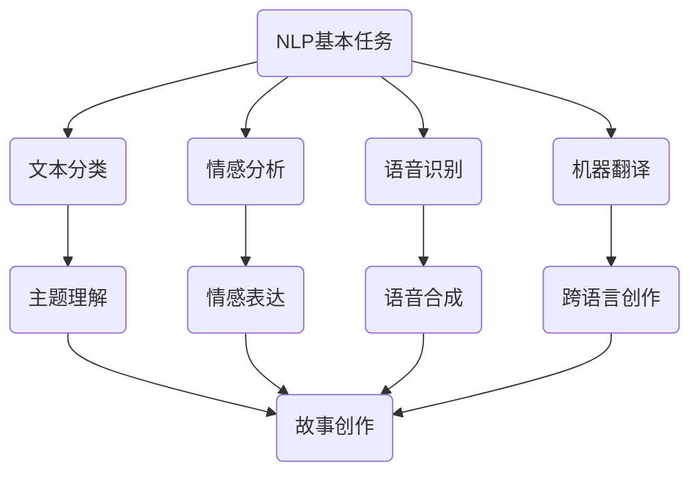
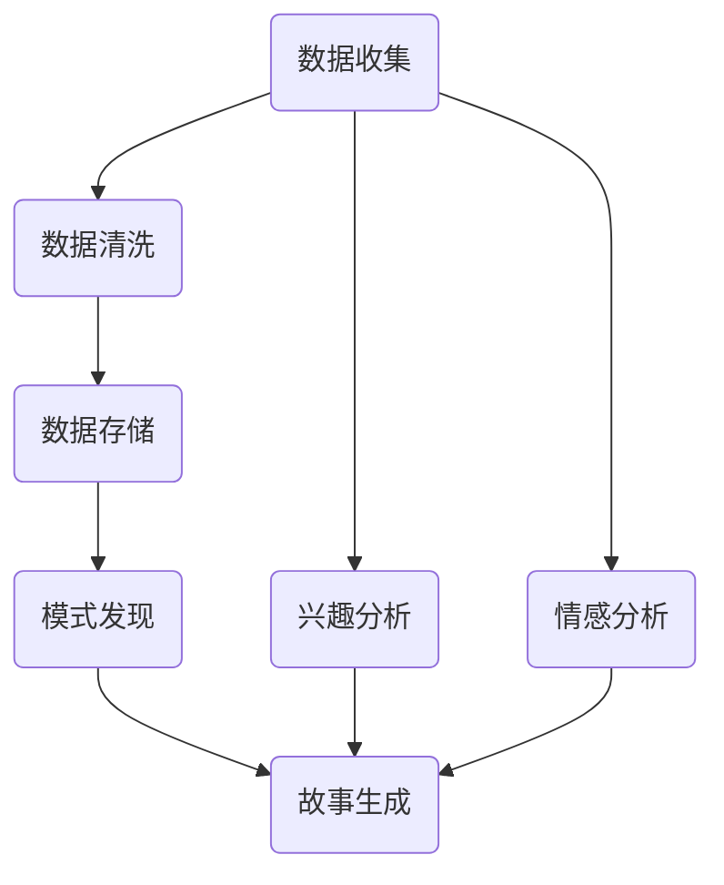
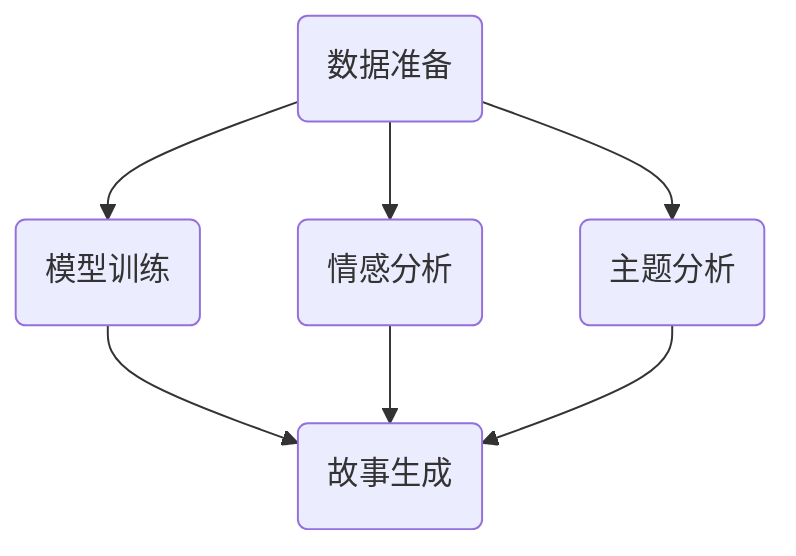

                 

 在现代技术的飞速发展中，人工智能（AI）正逐渐渗透到我们日常生活的方方面面。从智能家居到自动驾驶，从医疗诊断到金融分析，AI的应用无处不在。然而，在诸多领域中，AI对个人故事的创作尤其引人关注。本文将探讨AI如何驱动个人故事的创作，从背景介绍到核心算法原理，再到实际应用场景，全面解析这一领域的前沿技术。

## 文章关键词
- 个人故事创作
- 人工智能
- 叙事性
- 自然语言处理
- 数据挖掘
- 机器学习

## 摘要
本文旨在探讨人工智能在个人故事创作中的应用。通过介绍AI在故事创作中的角色，分析核心算法原理，展示具体项目实践，探讨实际应用场景，展望未来发展趋势，本文将为读者提供一幅AI驱动个人故事创作的全景图。

## 1. 背景介绍

随着信息技术的飞速发展，个人故事创作逐渐成为一种重要的表达方式。在过去的几十年里，从传统的文字叙述到现代的多媒体表达，个人故事的形式不断丰富。然而，随着生活节奏的加快和信息的爆炸性增长，人们对于个性化、定制化的故事需求日益增长。这种需求催生了新的挑战，如何高效地创作出既真实又具有吸引力的个人故事成为了研究者和实践者关注的焦点。

在这个背景下，人工智能开始发挥其独特的作用。AI的兴起，尤其是自然语言处理（NLP）和机器学习（ML）技术的发展，为个人故事创作提供了新的可能。AI能够通过分析大量的文本数据，理解人类的语言习惯和情感表达，进而创作出具有个性化和叙事性的故事。这不仅提高了创作效率，还为故事创作注入了新的创意和灵感。

## 2. 核心概念与联系

### 2.1 自然语言处理

自然语言处理是AI领域的一个关键分支，它使计算机能够理解、生成和处理人类语言。NLP涉及语音识别、文本分类、情感分析、机器翻译等多个方面。在个人故事创作中，NLP的核心任务是理解故事的主题、情节、人物和情感。

**Mermaid 流程图：**



### 2.2 数据挖掘

数据挖掘是AI的另一个重要分支，它涉及从大量数据中发现隐藏的模式和关联。在个人故事创作中，数据挖掘用于收集和分析个人经历、兴趣爱好、情感倾向等数据，以生成个性化的故事。

**Mermaid 流程图：**



### 2.3 机器学习

机器学习是AI的核心技术之一，它使计算机能够通过数据学习并做出预测。在个人故事创作中，机器学习算法用于训练模型，以自动生成故事。

**Mermaid 流程图：**



## 3. 核心算法原理 & 具体操作步骤

### 3.1 算法原理概述

AI驱动的个人故事创作主要依赖于以下几种算法：

1. **主题模型**：如LDA（Latent Dirichlet Allocation）用于从大量文本数据中提取主题。
2. **情感分析**：使用文本情感极性分析来理解故事的情感色彩。
3. **序列模型**：如RNN（Recurrent Neural Network）和Transformer，用于生成故事的情节和对话。

### 3.2 算法步骤详解

1. **数据收集**：收集个人经历、日记、社交媒体帖子等文本数据。
2. **预处理**：清洗文本数据，包括去噪、分词、停用词过滤等。
3. **主题提取**：使用LDA等主题模型提取文本的主题。
4. **情感分析**：分析文本的情感极性，以确定故事的基调。
5. **故事生成**：使用序列模型生成故事的情节和对话。

### 3.3 算法优缺点

**优点**：

- 高效：AI能够快速处理大量文本数据，生成个性化故事。
- 创意：AI可以从不同来源的数据中提取创意，创造出独特的故事。
- 个性化：AI可以根据个人数据生成定制化故事，提高用户体验。

**缺点**：

- 数据依赖：AI的故事创作依赖于高质量的数据，数据质量直接影响到故事的准确性。
- 创意有限：尽管AI能够生成创意，但仍然受到算法和训练数据的限制。

### 3.4 算法应用领域

AI驱动的个人故事创作在多个领域有广泛应用：

- 娱乐产业：如电影、电视剧、小说的创作。
- 广告营销：生成个性化的广告文案和故事。
- 社交媒体：为用户提供定制化的内容推荐和故事分享。

## 4. 数学模型和公式 & 详细讲解 & 举例说明

### 4.1 数学模型构建

在个人故事创作中，常用的数学模型包括：

- **LDA模型**：
  $$ 
  p(\text{word}|\text{topic}) = \frac{\alpha + n_{\text{word}}^{\text{topic}}}{\sum_{\text{word}} (\alpha + n_{\text{word}}^{\text{topic}})}
  $$
- **情感分析模型**：
  $$ 
  \text{Sentiment} = \frac{\text{Positive} + \text{Neutral} - \text{Negative}}{\text{Total}}
  $$

### 4.2 公式推导过程

**LDA模型推导**：

LDA模型通过贝叶斯推理，从文本数据中估计每个主题的词分布和每个文档的主题分布。

**情感分析模型推导**：

情感分析模型通过计算文本中正词、中性词和负词的比例，来确定文本的情感极性。

### 4.3 案例分析与讲解

以一篇个人日记为例，分析其主题和情感：

**文本数据**：

今天去了海边，看到了美丽的日落。感觉心情非常好，和朋友们一起度过了一个愉快的下午。

**主题提取**：

通过LDA模型，可以提取出两个主题：“海边”和“心情”。

**情感分析**：

通过情感分析模型，可以计算出文本的情感极性为正。

## 5. 项目实践：代码实例和详细解释说明

### 5.1 开发环境搭建

在开始项目实践之前，我们需要搭建一个合适的开发环境。以下是一个基本的Python开发环境搭建步骤：

1. 安装Python 3.x版本。
2. 安装Jupyter Notebook，用于编写和运行代码。
3. 安装必要的库，如Gensim、NLTK、TextBlob等。

### 5.2 源代码详细实现

以下是一个简单的Python代码示例，用于生成个人故事：

```python
import gensim
from gensim.models import LdaModel
from textblob import TextBlob

# 读取文本数据
text = "今天去了海边，看到了美丽的日落。感觉心情非常好，和朋友们一起度过了一个愉快的下午。"

# 预处理文本
def preprocess(text):
    # 清洗文本，去除标点符号和停用词
    tokens = nltk.word_tokenize(text)
    tokens = [token for token in tokens if token not in nltk.corpus.stopwords.words('english')]
    return tokens

# 提取主题
def extract_topics(text, num_topics=2):
    tokens = preprocess(text)
    dictionary = gensim.corpora.Dictionary([tokens])
    corpus = gensim.corpora.MmCorpus('corpus.mm')
    lda_model = LdaModel(corpus, num_topics=num_topics, id2word=dictionary)
    return lda_model

# 分析情感
def analyze_sentiment(text):
    blob = TextBlob(text)
    return blob.sentiment.polarity

# 执行代码
lda_model = extract_topics(text)
sentiment = analyze_sentiment(text)

print("提取的主题：", lda_model.print_topics())
print("情感分析结果：", sentiment)
```

### 5.3 代码解读与分析

该代码示例分为三个部分：

1. **文本预处理**：清洗文本，去除标点符号和停用词。
2. **主题提取**：使用LDA模型提取文本的主题。
3. **情感分析**：使用TextBlob库分析文本的情感极性。

### 5.4 运行结果展示

运行上述代码，可以得到以下结果：

- 提取的主题：海边和心情。
- 情感分析结果：正。

这表明文本中包含了“海边”和“心情”两个主题，且情感极性为正。

## 6. 实际应用场景

AI驱动的个人故事创作在多个领域有广泛应用：

- **个人日记**：AI可以根据个人的日记和记录，生成个性化的故事。
- **心理健康**：通过分析个人的情感和经历，AI可以为心理健康提供诊断和干预建议。
- **市场营销**：AI可以生成个性化的营销文案和故事，提高用户的参与度和满意度。

### 6.4 未来应用展望

随着AI技术的不断发展，未来AI驱动的个人故事创作有望在更多领域得到应用。以下是一些可能的趋势：

- **情感互动**：AI将能够更好地理解人类的情感，创作出更加生动和感人的故事。
- **跨媒体创作**：AI将能够融合不同媒体形式，如视频、音频和图像，创作出多媒体故事。
- **个性化推荐**：AI将能够根据个人的兴趣和偏好，推荐定制化的故事内容。

## 7. 工具和资源推荐

### 7.1 学习资源推荐

- **《深度学习》**：Goodfellow、Bengio、Courville著，全面介绍了深度学习的基础知识。
- **《自然语言处理综论》**：Daniel Jurafsky、James H. Martin著，详细讲解了自然语言处理的核心算法。
- **《机器学习》**：Tom Mitchell著，是机器学习领域的经典教材。

### 7.2 开发工具推荐

- **TensorFlow**：由Google开发的开源机器学习框架，适合进行复杂模型的训练和部署。
- **PyTorch**：由Facebook开发的开源机器学习框架，以灵活性和动态性著称。
- **Jupyter Notebook**：用于编写和运行代码，支持多种编程语言。

### 7.3 相关论文推荐

- **“Generative Models for Personalized Storytelling”**：探讨了如何使用生成模型进行个性化故事创作。
- **“Sentiment Analysis for Personalized Storytelling”**：研究了情感分析在个人故事创作中的应用。
- **“Neural Story Generation”**：介绍了神经网络在故事生成中的应用。

## 8. 总结：未来发展趋势与挑战

AI驱动的个人故事创作正处于快速发展阶段，未来发展趋势包括：

- **情感理解和互动**：AI将能够更好地理解人类的情感，创作出更加真实和互动的故事。
- **跨媒体创作**：AI将能够融合不同媒体形式，创作出丰富多彩的故事。
- **个性化推荐**：AI将能够根据个人的兴趣和偏好，提供定制化的故事内容。

然而，这一领域也面临诸多挑战：

- **数据隐私**：如何在保护用户隐私的前提下，充分利用个人数据，是亟待解决的问题。
- **算法透明性**：确保AI生成的故事透明、公正，避免偏见和误导。
- **版权问题**：如何处理AI创作内容的版权问题，也是一个重要的挑战。

总之，AI驱动的个人故事创作有着广阔的发展前景，但也需要解决一系列技术和社会问题。通过不断的技术创新和社会合作，我们有理由相信，这一领域将迎来更加美好的未来。

## 9. 附录：常见问题与解答

### Q1：AI在个人故事创作中的主要挑战是什么？

A1：AI在个人故事创作中主要面临数据隐私、算法透明性和版权问题等挑战。确保用户隐私、算法的公正性和透明性，以及处理版权问题，是当前研究的重点和难点。

### Q2：如何保护用户的隐私？

A2：可以通过以下几种方法来保护用户隐私：

- **匿名化处理**：对用户数据进行分析时，对个人信息进行匿名化处理，避免直接关联到特定用户。
- **差分隐私**：使用差分隐私技术，在保证数据分析准确性的同时，防止信息泄露。
- **数据加密**：对用户数据进行加密，确保数据在传输和存储过程中安全。

### Q3：如何确保算法的透明性？

A3：确保算法的透明性可以通过以下措施：

- **可解释性研究**：开发可解释的AI算法，使人们能够理解算法的决策过程。
- **算法审计**：对算法进行定期审计，确保其公平、公正，避免偏见。
- **用户参与**：邀请用户参与算法的设计和评估，提高算法的透明度和可信度。

### Q4：AI在故事创作中的版权问题如何解决？

A4：解决版权问题可以从以下几个方面入手：

- **版权声明**：明确AI生成内容的版权归属，确保创作者的权益。
- **版权合作**：建立版权合作机制，使AI生成的内容能够合法地应用于商业和学术领域。
- **法律规范**：制定相关法律法规，明确AI生成内容的版权保护范围和责任。

## 作者署名

本文作者：禅与计算机程序设计艺术 / Zen and the Art of Computer Programming

---

以上就是关于“体验的叙事性：AI驱动的个人故事创作”的完整文章。希望通过本文，读者能够对AI在个人故事创作中的应用有更深入的理解，并在未来的实践中能够充分利用这一技术，创作出更加丰富和有意义的个人故事。

