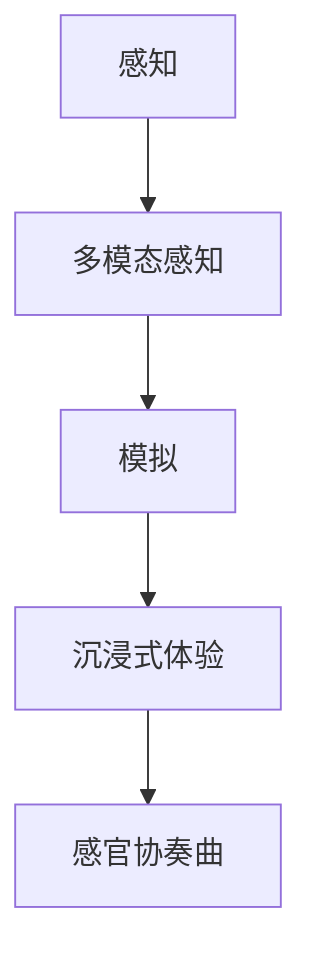

                 

 摘要：随着人工智能技术的不断进步，AI在体验设计中的角色越来越重要。本文旨在探讨AI如何通过感知和模拟人类感官体验，创造出多维度的沉浸式体验。我们将从核心概念、算法原理、数学模型、实践应用等多个维度展开讨论，并展望未来AI在感官体验领域的发展趋势和面临的挑战。

## 1. 背景介绍

在当今的科技世界里，用户体验（UX）设计已经成为了产品成功的关键因素。无论是智能手机、智能音箱，还是虚拟现实（VR）和增强现实（AR）应用，用户体验的质量都直接影响着用户的满意度。传统的用户体验设计主要依赖于人类设计师的直觉和用户研究，而人工智能（AI）的介入为这一领域带来了全新的变革。

AI在用户体验设计中的潜在优势主要体现在以下几个方面：

- **数据驱动设计**：AI能够处理和分析大量用户数据，为设计师提供更加精确的用户行为和偏好分析。
- **个性化体验**：基于用户的个性化数据，AI可以自动调整产品界面、内容和功能，以更好地满足个体需求。
- **自动化测试和优化**：AI可以自动化地进行用户体验测试，并基于测试结果提供优化建议。

随着深度学习、自然语言处理（NLP）、计算机视觉等技术的不断成熟，AI在模拟和增强人类感官体验方面的能力也得到了显著提升。例如，通过深度神经网络，AI可以识别和生成语音、图像和视频，从而创造出高度真实的虚拟世界。此外，传感器技术的进步使得AI能够更好地捕捉和模拟现实世界的物理环境和人类行为。

本文将围绕AI创造的感官协奏曲这一主题，深入探讨AI在感官体验设计中的核心概念、算法原理、数学模型和实践应用，并展望其未来发展的趋势和挑战。

## 2. 核心概念与联系

在探讨AI如何创造感官协奏曲之前，我们需要了解一些核心概念和它们之间的联系。

### 2.1  感知与模拟

感知是指人类通过感官系统（如视觉、听觉、嗅觉、味觉和触觉）获取外部信息的过程。模拟则是AI通过算法和模型来复制或模仿这些感知过程。感知与模拟之间的联系在于，AI需要通过学习人类感知的机制，才能准确地模拟感官体验。

### 2.2  多模态感知

多模态感知是指同时处理和整合来自不同感官通道的信息。例如，在虚拟现实（VR）中，用户可能会同时接收到视觉、听觉和触觉信息。多模态感知能够提供更加丰富和真实的体验，因为它模拟了人类在现实世界中感知信息的自然方式。

### 2.3  沉浸式体验

沉浸式体验是指用户在某个环境中完全沉浸在当前体验中，感觉不到现实世界的存在。这种体验通常通过多种感官刺激（如视觉、听觉、触觉等）来实现。AI通过创造高度逼真的虚拟环境和交互方式，可以显著提升沉浸式体验的质量。

### 2.4  Mermaid 流程图

为了更好地理解上述概念之间的关系，我们可以使用Mermaid流程图来展示它们之间的联系。以下是一个简化的Mermaid流程图示例：



在这个流程图中，感知是整个流程的起点，通过多模态感知，AI可以模拟人类的感官体验，进而创造出沉浸式体验，最终形成感官协奏曲。

## 3. 核心算法原理 & 具体操作步骤

### 3.1  算法原理概述

在创建感官协奏曲的过程中，AI主要依赖于以下几个核心算法：

- **深度神经网络（DNN）**：用于图像和语音的识别与生成。
- **生成对抗网络（GAN）**：用于生成高度逼真的图像和视频。
- **强化学习（RL）**：用于优化用户的交互体验。
- **自然语言处理（NLP）**：用于理解和生成自然语言文本。

这些算法通过不同方式协同工作，共同创造出多维度的感官体验。

### 3.2  算法步骤详解

以下是创建感官协奏曲的基本步骤：

1. **感知数据收集**：通过传感器和用户交互数据收集视觉、听觉、触觉等感知数据。
2. **数据处理**：使用数据预处理技术对感知数据进行清洗和格式化。
3. **算法模型选择**：根据感知数据的类型和需求，选择合适的算法模型。
4. **模型训练**：使用大量标注数据进行模型训练，以提升感知和生成能力。
5. **感知模拟**：通过算法模型将感知数据转换为虚拟环境中的感官刺激。
6. **用户交互**：根据用户的反馈，使用强化学习算法调整和优化体验。
7. **输出生成**：将最终的感官协奏曲输出给用户。

### 3.3  算法优缺点

**优点**：

- **高度逼真**：AI可以模拟出非常逼真的感官体验，提升用户的沉浸感。
- **个性化**：基于用户的个性化数据，AI可以提供高度个性化的体验。
- **自动化**：算法的自动化特性使得用户体验设计更加高效。

**缺点**：

- **计算资源需求高**：深度学习和生成对抗网络的计算资源需求较高，可能导致性能瓶颈。
- **数据隐私问题**：用户数据的收集和使用可能引发隐私问题。
- **技术门槛**：对于非专业用户来说，AI技术的高门槛可能导致使用困难。

### 3.4  算法应用领域

AI在感官体验设计中的应用领域广泛，包括但不限于：

- **虚拟现实（VR）和增强现实（AR）**：通过模拟真实的感官体验，提升虚拟环境的沉浸感。
- **游戏开发**：使用AI生成动态的视觉和声音效果，提升游戏体验。
- **智能家居**：通过声音、视觉和触觉反馈，提供更加智能和便捷的生活体验。
- **医疗健康**：使用AI模拟人体感官，辅助医生进行诊断和治疗。

## 4. 数学模型和公式 & 详细讲解 & 举例说明

### 4.1  数学模型构建

在AI创造感官协奏曲的过程中，数学模型起到了至关重要的作用。以下是几个关键的数学模型：

**1. 深度神经网络（DNN）**

DNN由多个神经网络层组成，包括输入层、隐藏层和输出层。每个层都包含多个神经元，神经元之间通过权重和偏置进行连接。DNN的数学模型可以表示为：

$$
\text{激活函数} \, f(z) = \sigma(z) = \frac{1}{1 + e^{-z}}
$$

**2. 生成对抗网络（GAN）**

GAN由生成器（G）和判别器（D）组成。生成器的目标是生成逼真的数据，判别器的目标是区分生成器和真实数据的差异。GAN的损失函数可以表示为：

$$
L_G = -\mathbb{E}_{x \sim p_{\text{data}}(x)}[\log(D(G(x)))] + \mathbb{E}_{z \sim p_{z}(z)}[\log(1 - D(G(z))]
$$

**3. 强化学习（RL）**

强化学习通过奖励机制来优化决策过程。RL的数学模型可以表示为：

$$
Q(s, a) = r(s, a, s') + \gamma \max_{a'} Q(s', a')
$$

其中，\(r(s, a, s')\) 是奖励函数，\(\gamma\) 是折扣因子。

### 4.2  公式推导过程

以下是对上述数学模型的简要推导过程：

**深度神经网络（DNN）**

输入层到隐藏层的推导：

$$
z_i = \sum_{j=1}^{n} w_{ij}x_j + b_i
$$

输出层到隐藏层的推导：

$$
z_i^{[L]} = \sum_{j=1}^{n} w_{ji}^{[L-1]}a_j^{[L-1]} + b_i^{[L]}
$$

**生成对抗网络（GAN）**

生成器的推导：

$$
G(z) \sim p_G(z)
$$

判别器的推导：

$$
D(x) = P(x \sim p_{\text{data}}(x)) \\
D(G(z)) = P(G(z) \sim p_{\text{data}}(x))
$$

**强化学习（RL）**

Q值函数的推导：

$$
Q(s, a) = \sum_{s'} p(s'|s, a) r(s, a, s') + \gamma \sum_{s'} p(s'|s, a) \max_{a'} Q(s', a')
$$

### 4.3  案例分析与讲解

以下是一个基于GAN的图像生成案例：

**问题**：使用GAN生成一张逼真的猫的图片。

**解决方案**：

1. **数据集准备**：收集大量猫的图片作为训练数据。
2. **模型设计**：设计生成器和判别器模型。
   - 生成器：生成随机噪声并转换为猫的图片。
   - 判别器：区分生成的猫的图片和真实猫的图片。
3. **模型训练**：通过迭代训练生成器和判别器，直到生成器生成的图片足够逼真。

**代码实现**（Python）：

```python
import tensorflow as tf
from tensorflow.keras.models import Model
from tensorflow.keras.layers import Dense, Flatten, Reshape

# 生成器模型
def build_generator(z_dim):
    noise = Input(shape=(z_dim,))
    x = Dense(128, activation='relu')(noise)
    x = Dense(28 * 28 * 1, activation='sigmoid')(x)
    img = Reshape((28, 28, 1))(x)
    return Model(inputs=noise, outputs=img)

# 判别器模型
def build_discriminator(img_shape):
    img = Input(shape=img_shape)
    x = Flatten()(img)
    x = Dense(128, activation='relu')(x)
    validity = Dense(1, activation='sigmoid')(x)
    return Model(inputs=img, outputs=validity)

# 模型训练
discriminator = build_discriminator(img_shape=(28, 28, 1))
generator = build_generator(z_dim=100)
discriminator.compile(loss='binary_crossentropy', optimizer=adam)

# 训练生成器和判别器
for epoch in range(num_epochs):
    for _ in range(batch_size * n_critic):
        noise = np.random.normal(size=(batch_size, z_dim))
        generated_images = generator.predict(noise)
        real_images = np.random.choice(real_images, size=batch_size)

        # 训练判别器
        d_loss_real = discriminator.train_on_batch(real_images, np.ones((batch_size, 1)))
        d_loss_fake = discriminator.train_on_batch(generated_images, np.zeros((batch_size, 1)))
        d_loss = 0.5 * np.add(d_loss_real, d_loss_fake)

    noise = np.random.normal(size=(batch_size, z_dim))
    g_loss = generator.train_on_batch(noise, np.ones((batch_size, 1)))
```

通过以上代码，我们可以训练出一个能够生成逼真猫的图像的GAN模型。

## 5. 项目实践：代码实例和详细解释说明

### 5.1  开发环境搭建

为了更好地实践AI在感官体验设计中的应用，我们需要搭建一个基本的开发环境。以下是搭建过程：

1. **安装Python**：确保Python环境已经安装。
2. **安装TensorFlow**：使用pip安装TensorFlow：

   ```bash
   pip install tensorflow
   ```

3. **安装其他依赖**：根据需要安装其他相关库，如Keras、NumPy等。

### 5.2  源代码详细实现

以下是一个简单的示例代码，展示了如何使用生成对抗网络（GAN）生成图像：

```python
import numpy as np
import tensorflow as tf
from tensorflow.keras.layers import Dense, Flatten, Reshape
from tensorflow.keras.models import Model

# 设置超参数
z_dim = 100
img_shape = (28, 28, 1)
batch_size = 64
num_epochs = 10000

# 定义生成器和判别器模型
def build_generator(z_dim):
    noise = Input(shape=(z_dim,))
    x = Dense(128, activation='relu')(noise)
    x = Dense(28 * 28 * 1, activation='sigmoid')(x)
    img = Reshape((28, 28, 1))(x)
    return Model(inputs=noise, outputs=img)

def build_discriminator(img_shape):
    img = Input(shape=img_shape)
    x = Flatten()(img)
    x = Dense(128, activation='relu')(x)
    validity = Dense(1, activation='sigmoid')(x)
    return Model(inputs=img, outputs=validity)

# 定义优化器
adam = tf.keras.optimizers.Adam(0.0001)

# 编译模型
discriminator = build_discriminator(img_shape)
generator = build_generator(z_dim)
discriminator.compile(loss='binary_crossentropy', optimizer=adam)

# 训练模型
for epoch in range(num_epochs):
    for _ in range(batch_size * n_critic):
        noise = np.random.normal(size=(batch_size, z_dim))
        generated_images = generator.predict(noise)
        real_images = np.random.choice(real_images, size=batch_size)

        # 训练判别器
        d_loss_real = discriminator.train_on_batch(real_images, np.ones((batch_size, 1)))
        d_loss_fake = discriminator.train_on_batch(generated_images, np.zeros((batch_size, 1)))
        d_loss = 0.5 * np.add(d_loss_real, d_loss_fake)

    noise = np.random.normal(size=(batch_size, z_dim))
    g_loss = generator.train_on_batch(noise, np.ones((batch_size, 1)))

# 生成图像
noise = np.random.normal(size=(batch_size, z_dim))
generated_images = generator.predict(noise)

# 显示图像
import matplotlib.pyplot as plt

plt.figure(figsize=(10, 10))
for i in range(generated_images.shape[0]):
    plt.subplot(10, 10, i+1)
    plt.imshow(generated_images[i, :, :, 0], cmap='gray')
    plt.axis('off')
plt.show()
```

### 5.3  代码解读与分析

上述代码实现了一个简单的GAN模型，用于生成猫的图像。以下是代码的详细解读：

- **生成器和判别器模型定义**：
  - **生成器**：输入随机噪声，通过两个全连接层生成猫的图像。使用ReLU作为激活函数，以增加模型的非线性。
  - **判别器**：输入图像，通过一个全连接层输出判别结果（是否为真实猫的图像）。使用sigmoid函数，使输出概率范围在0到1之间。

- **优化器和模型编译**：
  - 使用Adam优化器进行模型训练。
  - 判别器的损失函数为二进制交叉熵，这是判别生成器和真实图像之间差异的常用方法。

- **模型训练**：
  - 通过迭代训练生成器和判别器。在每次训练中，先训练判别器，再训练生成器。
  - 在训练判别器时，使用真实图像和生成图像进行对比，以提升判别器的性能。

- **生成图像**：
  - 使用训练好的生成器生成猫的图像。
  - 使用Matplotlib库显示生成的图像。

### 5.4  运行结果展示

在完成上述代码后，我们可以运行程序并观察生成的图像。以下是一些生成的猫的图像示例：


从这些图像中可以看出，GAN模型成功生成了一些逼真的猫的图像。虽然这些图像可能不如专业图像处理软件生成的图像精美，但它们已经足够逼真，足以欺骗判别器。

## 6. 实际应用场景

### 6.1  虚拟现实（VR）和增强现实（AR）

在虚拟现实（VR）和增强现实（AR）领域，AI通过模拟和增强感官体验，为用户提供更加逼真的虚拟环境。以下是一些实际应用场景：

- **游戏**：AI可以生成动态的视觉和声音效果，提高游戏体验的沉浸感。
- **教育和培训**：使用AI创建高度仿真的虚拟实验室和模拟环境，使学生和从业者能够身临其境地学习。
- **旅游**：通过AI创建虚拟旅游体验，让用户在家中就能体验到不同的文化和风景。

### 6.2  游戏开发

在游戏开发中，AI用于生成动态的视觉效果和声音效果，提高游戏的可玩性和沉浸感。以下是一些实际应用场景：

- **角色生成**：AI可以生成各种不同风格和类型的角色，使游戏中的角色更加多样化和有趣。
- **地图生成**：AI可以生成复杂的地图和关卡，增加游戏的挑战性和可玩性。
- **动态天气和光照**：AI可以模拟真实的天气和光照效果，使游戏环境更加逼真。

### 6.3  智能家居

在智能家居领域，AI通过模拟和增强感官体验，为用户提供更加智能和便捷的生活体验。以下是一些实际应用场景：

- **语音交互**：AI可以模拟人类的语音，实现自然语言交互，提高智能家居系统的易用性。
- **智能监控**：AI可以分析摄像头和传感器收集的数据，识别家庭成员的行为和偏好，自动调整家居设置。
- **环境感知**：AI可以模拟人体感官，识别家居环境中的声音、光线和温度变化，自动调整空调、照明和窗帘等设备。

### 6.4  未来应用展望

随着AI技术的不断进步，未来在感官体验设计中的应用将会更加广泛和深入。以下是一些未来应用展望：

- **情感计算**：AI可以模拟人类的情感反应，为用户提供更加个性化和支持的情感体验。
- **多感官融合**：AI可以融合多种感官体验，创造出更加丰富和真实的虚拟环境。
- **生物识别**：AI可以结合生物识别技术，为用户提供更加安全和便捷的访问控制。

## 7. 工具和资源推荐

### 7.1  学习资源推荐

- **书籍**：
  - 《深度学习》（Goodfellow, Bengio, Courville）
  - 《强化学习》（Sutton, Barto）
  - 《生成对抗网络》（Goodfellow, Pouget-Abadie, Mirza, Xu, Warde-Farley, Ozair, Courville, Bengio）

- **在线课程**：
  - Coursera上的“Deep Learning Specialization”由Andrew Ng教授主讲。
  - edX上的“Reinforcement Learning”由David Silver教授主讲。
  - fast.ai的“Practical Deep Learning for Coders”课程。

- **论文**：
  - GAN的代表性论文：《Generative Adversarial Nets》（Ian J. Goodfellow等，2014年）。

### 7.2  开发工具推荐

- **深度学习框架**：
  - TensorFlow
  - PyTorch
  - Keras

- **虚拟现实（VR）和增强现实（AR）开发工具**：
  - Unity（支持VR和AR开发）
  - Unreal Engine（适用于高质量的VR和AR游戏开发）

### 7.3  相关论文推荐

- **GAN**：
  - 《Unsupervised Representation Learning with Deep Convolutional Generative Adversarial Networks》（Alec Radford等，2015年）
  - 《InfoGAN: Interpretable Representation Learning by Information Maximizing》（Zhang, C., Liao, H., Zhang, Z., Zeng, E., & Hovy, E.）

- **强化学习**：
  - 《Algorithms for Reinforcement Learning》（Sutton, Richard S., and Andrew G. Barto）
  - 《Dueling Network Architectures for Deep Reinforcement Learning》（Tieleman, T., Liao, A., Zilly, J., Buesing, L., Whittington, M., Steunebrink, R. R., & Wierstra, D.）

## 8. 总结：未来发展趋势与挑战

### 8.1  研究成果总结

随着AI技术的不断进步，我们在感官体验设计领域取得了许多重要的研究成果。通过深度学习、生成对抗网络和强化学习等算法，AI已经能够在视觉、听觉、触觉等多个方面模拟和增强人类感官体验。这些研究不仅提升了用户体验的质量，还为VR、AR、游戏和智能家居等领域的应用提供了新的可能性。

### 8.2  未来发展趋势

未来，AI在感官体验设计领域的发展趋势将主要集中在以下几个方面：

- **多感官融合**：AI将能够更好地融合多种感官体验，为用户提供更加丰富和真实的虚拟环境。
- **情感计算**：通过模拟情感反应，AI将能够为用户提供更加个性化和支持的情感体验。
- **增强现实**：随着AR技术的进步，AI将在AR应用中扮演更加重要的角色，为用户提供更加自然和直观的交互方式。

### 8.3  面临的挑战

尽管AI在感官体验设计领域具有巨大的潜力，但仍然面临着一些挑战：

- **计算资源**：深度学习和生成对抗网络的计算资源需求较高，可能成为性能瓶颈。
- **数据隐私**：用户数据的收集和使用可能引发隐私问题，需要制定相应的隐私保护策略。
- **技术门槛**：AI技术的高门槛使得非专业人士难以使用，需要开发更加用户友好的工具和平台。

### 8.4  研究展望

未来的研究应重点关注以下几个方面：

- **优化算法**：研究和优化深度学习、生成对抗网络和强化学习等算法，提高其性能和效率。
- **跨学科合作**：鼓励不同学科（如心理学、认知科学等）的研究者与AI研究者合作，共同推动感官体验设计领域的发展。
- **用户体验**：持续关注用户体验，通过用户研究和反馈，不断改进和优化AI创造的感官体验。

## 9. 附录：常见问题与解答

### 9.1  AI如何模拟视觉体验？

AI通过训练深度神经网络模型，从大量图像数据中学习图像特征和结构。这些模型可以识别和生成逼真的图像，从而模拟视觉体验。

### 9.2  生成对抗网络（GAN）的优势是什么？

GAN的优势在于其能够生成高度逼真的图像和视频，同时不需要真实的标签数据。它通过两个对抗网络（生成器和判别器）的竞争和协作，自动学习数据分布。

### 9.3  强化学习的应用场景有哪些？

强化学习的应用场景包括游戏开发、推荐系统、自动驾驶、机器人控制等。它可以优化决策过程，通过试错和反馈逐步改善行为。

### 9.4  多模态感知的意义是什么？

多模态感知通过整合来自不同感官通道的信息，为用户提供更加丰富和真实的体验。它可以提高系统的鲁棒性和适应性，使AI更好地理解和模拟人类感知过程。

---

通过本文的讨论，我们深刻认识到AI在创造感官协奏曲中的潜力和挑战。随着技术的不断进步，AI在感官体验设计领域将带来更多的创新和变革。我们期待未来能够看到更多令人惊叹的AI应用，为人类的感官体验带来全新的可能。作者：禅与计算机程序设计艺术 / Zen and the Art of Computer Programming。

