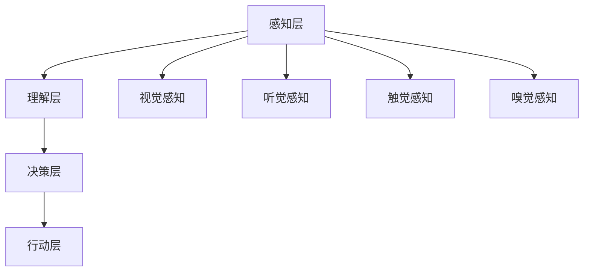

                 

关键词：人工智能、多维感知、用户体验、感知层次、深度学习、交互设计

> 摘要：本文从用户体验的角度探讨了人工智能在多维感知方面的发展与应用。通过分析人工智能感知技术的层次性，本文阐述了感知层次对用户体验的影响，并探讨了未来人工智能感知技术的发展趋势与挑战。

## 1. 背景介绍

随着人工智能技术的迅猛发展，机器学习、深度学习等技术在计算机视觉、自然语言处理、语音识别等领域取得了显著的成果。这些技术的进步不仅使得人工智能在处理大量数据时更加高效，还提高了人工智能与人类交互的准确性。然而，在追求技术进步的同时，我们也必须关注用户体验。用户体验是衡量人工智能系统成功与否的重要标准，它关系到用户对人工智能的接受程度和使用满意度。

用户体验的好坏很大程度上取决于人工智能的多维感知能力。多维感知是指人工智能能够从不同维度获取信息，如视觉、听觉、触觉、嗅觉等。这些感知能力的综合运用能够为用户提供更加丰富和真实的交互体验。本文将从用户体验的角度，探讨人工智能在多维感知方面的发展与应用，分析感知层次对用户体验的影响，并探讨未来人工智能感知技术的发展趋势与挑战。

## 2. 核心概念与联系

### 2.1 多维感知

多维感知是指人工智能系统通过多种方式获取和处理信息的能力。这些方式包括视觉、听觉、触觉、嗅觉等。多维感知使得人工智能能够更全面地理解世界，从而提供更准确的决策和更丰富的交互体验。

- **视觉感知**：通过图像和视频处理技术，人工智能能够识别和理解图像中的物体、场景和动作。
- **听觉感知**：通过语音识别技术，人工智能能够理解和处理人类语言，实现语音交互。
- **触觉感知**：通过传感器和机器人的触觉技术，人工智能能够感知物体的形状、质地和硬度等特性。
- **嗅觉感知**：通过气味识别技术，人工智能能够识别和分析气味，从而为用户提供个性化服务。

### 2.2 感知层次

感知层次是指人工智能在处理信息时所处的不同阶段。这些阶段包括感知、理解、决策和行动。感知层次的不同决定了人工智能系统对信息的处理能力和用户体验的质量。

- **感知层**：负责获取外部信息，如图像、声音和传感器数据。
- **理解层**：负责对感知层获取的信息进行分析和解释，如识别物体、语言和气味。
- **决策层**：负责根据理解和分析结果做出决策，如选择行动方案。
- **行动层**：负责执行决策，如控制机器人行动、调整系统设置等。

### 2.3 Mermaid 流程图

以下是一个简化的多维感知与感知层次的Mermaid流程图：



## 3. 核心算法原理 & 具体操作步骤

### 3.1 算法原理概述

多维感知的核心算法主要涉及深度学习、机器学习和信号处理等领域。以下是一些关键的算法原理：

- **卷积神经网络（CNN）**：用于图像和视频处理，能够识别图像中的特征和模式。
- **循环神经网络（RNN）**：用于处理序列数据，如文本和语音。
- **生成对抗网络（GAN）**：用于生成逼真的图像和视频。
- **强化学习**：用于决策和行动，通过试错和反馈优化行为。

### 3.2 算法步骤详解

多维感知的具体操作步骤如下：

1. **数据收集与预处理**：收集各种类型的数据，如图像、音频、传感器数据等。对数据进行预处理，如归一化、去噪等。
2. **特征提取**：使用深度学习模型提取数据中的特征，如CNN提取图像特征，RNN提取文本特征。
3. **模型训练与优化**：使用收集到的数据训练模型，通过优化算法调整模型参数，提高模型的准确性和泛化能力。
4. **感知与理解**：使用训练好的模型对新的数据进行感知和理解，如识别图像中的物体、理解语音中的语言含义。
5. **决策与行动**：根据理解和分析结果做出决策，并执行相应的行动，如控制机器人行动、调整系统设置等。

### 3.3 算法优缺点

- **优点**：多维感知算法能够处理多种类型的数据，提供丰富的交互体验，提高人工智能系统的智能化水平。
- **缺点**：算法复杂度高，计算资源需求大，训练和优化过程耗时长。

### 3.4 算法应用领域

多维感知算法广泛应用于以下领域：

- **计算机视觉**：用于图像识别、物体检测、人脸识别等。
- **自然语言处理**：用于文本分类、情感分析、机器翻译等。
- **语音识别**：用于语音助手、语音控制等。
- **机器人控制**：用于机器人导航、抓取、交互等。

## 4. 数学模型和公式 & 详细讲解 & 举例说明

### 4.1 数学模型构建

多维感知的数学模型主要涉及深度学习中的神经网络。以下是一个简化的神经网络模型：

$$
y = \sigma(W \cdot x + b)
$$

其中，$y$ 是输出，$x$ 是输入，$W$ 是权重矩阵，$b$ 是偏置项，$\sigma$ 是激活函数。

### 4.2 公式推导过程

神经网络的推导过程涉及多个步骤，包括前向传播、反向传播和权重更新。以下是一个简化的推导过程：

1. **前向传播**：

$$
z = W \cdot x + b \\
a = \sigma(z)
$$

2. **反向传播**：

计算输出误差：

$$
\delta = (y - a) \cdot \sigma'(z) \\
dW = \delta \cdot x^T \\
db = \delta
$$

3. **权重更新**：

$$
W = W - \alpha \cdot dW \\
b = b - \alpha \cdot db
$$

其中，$\alpha$ 是学习率。

### 4.3 案例分析与讲解

以下是一个简单的图像识别案例，使用卷积神经网络（CNN）进行图像分类。

1. **数据收集与预处理**：

收集包含不同类别的图像数据，并对图像进行缩放、裁剪等预处理操作。

2. **特征提取**：

使用CNN提取图像中的特征。假设输入图像为 $32 \times 32 \times 3$ 的三维数组，CNN模型包括两个卷积层和两个全连接层。

3. **模型训练与优化**：

使用训练集数据训练模型，通过反向传播优化模型参数。

4. **感知与理解**：

使用训练好的模型对测试集图像进行分类，识别图像中的物体。

5. **决策与行动**：

根据分类结果做出决策，如显示图像中的物体名称。

## 5. 项目实践：代码实例和详细解释说明

### 5.1 开发环境搭建

安装Python环境和必要的库，如TensorFlow、Keras等。

```python
pip install tensorflow keras
```

### 5.2 源代码详细实现

以下是一个简单的CNN图像识别代码示例：

```python
import tensorflow as tf
from tensorflow.keras import layers

# 构建模型
model = tf.keras.Sequential([
    layers.Conv2D(32, (3, 3), activation='relu', input_shape=(32, 32, 3)),
    layers.MaxPooling2D((2, 2)),
    layers.Conv2D(64, (3, 3), activation='relu'),
    layers.MaxPooling2D((2, 2)),
    layers.Conv2D(64, (3, 3), activation='relu'),
    layers.Flatten(),
    layers.Dense(64, activation='relu'),
    layers.Dense(10, activation='softmax')
])

# 编译模型
model.compile(optimizer='adam',
              loss='categorical_crossentropy',
              metrics=['accuracy'])

# 训练模型
model.fit(x_train, y_train, epochs=10, validation_data=(x_val, y_val))

# 测试模型
test_loss, test_acc = model.evaluate(x_test, y_test)
print('Test accuracy:', test_acc)
```

### 5.3 代码解读与分析

该代码示例使用Keras构建了一个简单的CNN模型，用于图像识别。模型包括两个卷积层和一个全连接层。卷积层用于提取图像特征，全连接层用于分类。模型使用交叉熵损失函数和softmax激活函数，优化器为Adam。

### 5.4 运行结果展示

运行代码后，模型将在训练集和测试集上进行训练和评估。输出结果将显示模型的测试准确率。

## 6. 实际应用场景

### 6.1 计算机视觉

计算机视觉是人工智能多维感知的一个重要应用领域。通过视觉感知技术，人工智能能够识别和理解图像中的物体、场景和动作。应用场景包括人脸识别、安防监控、自动驾驶等。

### 6.2 自然语言处理

自然语言处理是另一个重要应用领域。通过听觉和视觉感知技术，人工智能能够理解和处理人类语言。应用场景包括智能客服、语音助手、机器翻译等。

### 6.3 机器人控制

机器人控制是人工智能多维感知的另一个应用领域。通过触觉和视觉感知技术，机器人能够感知环境并做出相应的决策。应用场景包括智能制造、医疗辅助、家庭服务等。

## 7. 未来应用展望

随着人工智能技术的不断发展，多维感知将迎来更广泛的应用。未来应用场景可能包括：

- **智能医疗**：通过多维感知技术，人工智能能够诊断疾病、监控病情和提供个性化治疗。
- **智能教育**：通过多维感知技术，人工智能能够识别学生的需求和兴趣，提供个性化学习建议。
- **智能交通**：通过多维感知技术，人工智能能够优化交通流量、预测交通状况和减少交通事故。

## 8. 工具和资源推荐

### 8.1 学习资源推荐

- **深度学习教科书**：Goodfellow, I., Bengio, Y., & Courville, A. (2016). *Deep Learning*.
- **在线课程**：Udacity、Coursera等平台提供丰富的深度学习和人工智能课程。
- **技术社区**：GitHub、Stack Overflow等平台是学习和交流的好地方。

### 8.2 开发工具推荐

- **TensorFlow**：谷歌开发的深度学习框架，适用于各种应用场景。
- **PyTorch**：Facebook开发的深度学习框架，易于使用和调试。
- **Keras**：用于快速构建和训练深度学习模型的Python库。

### 8.3 相关论文推荐

- **ViT：Vision Transformer**：Dosovitskiy, A., et al. (2020). *An Image is Worth 16x16 Words: Transformers for Image Recognition at Scale*.
- **BERT：Bidirectional Encoder Representations from Transformers**：Devlin, J., et al. (2019). *BERT: Pre-training of Deep Bidirectional Transformers for Language Understanding*.

## 9. 总结：未来发展趋势与挑战

### 9.1 研究成果总结

多维感知技术在人工智能领域取得了显著成果，包括计算机视觉、自然语言处理、语音识别等领域。这些技术为人工智能系统提供了丰富的交互体验，提高了系统的智能化水平。

### 9.2 未来发展趋势

- **感知能力的提升**：未来多维感知技术将进一步提升感知能力，实现更准确、更高效的信息获取和处理。
- **跨模态交互**：通过融合不同模态的信息，实现更自然的跨模态交互。
- **隐私保护**：随着多维感知技术的发展，隐私保护问题将越来越受到关注。

### 9.3 面临的挑战

- **计算资源需求**：多维感知算法复杂度高，对计算资源的需求较大。
- **数据隐私与安全**：多维感知技术涉及大量个人数据的收集和处理，如何保障数据隐私和安全是一个重要挑战。

### 9.4 研究展望

多维感知技术在未来将迎来更多创新和应用。通过不断突破技术瓶颈，我们有望实现更加智能、更加人性化的交互体验。

## 附录：常见问题与解答

### Q：多维感知技术的核心是什么？

A：多维感知技术的核心是深度学习和机器学习，通过构建复杂的神经网络模型，实现从不同维度获取和处理信息的能力。

### Q：多维感知技术有哪些应用领域？

A：多维感知技术的应用领域包括计算机视觉、自然语言处理、语音识别、机器人控制等。

### Q：如何提升多维感知能力？

A：提升多维感知能力的方法包括增加数据量、优化算法、使用更复杂的模型等。

### Q：多维感知技术有哪些挑战？

A：多维感知技术面临的挑战包括计算资源需求大、数据隐私和安全问题等。

## 作者署名

作者：禅与计算机程序设计艺术 / Zen and the Art of Computer Programming

----------------------------------------------------------------

完成上述文章撰写后，我们需要将其按照markdown格式进行排版，确保文章的可读性和结构清晰。以下是按照markdown格式排版的文章内容：

```markdown
# 体验的层次性：AI创造的多维感知

关键词：人工智能、多维感知、用户体验、感知层次、深度学习、交互设计

> 摘要：本文从用户体验的角度探讨了人工智能在多维感知方面的发展与应用。通过分析人工智能感知技术的层次性，本文阐述了感知层次对用户体验的影响，并探讨了未来人工智能感知技术的发展趋势与挑战。

## 1. 背景介绍

随着人工智能技术的迅猛发展，机器学习、深度学习等技术在计算机视觉、自然语言处理、语音识别等领域取得了显著的成果。这些技术的进步不仅使得人工智能在处理大量数据时更加高效，还提高了人工智能与人类交互的准确性。然而，在追求技术进步的同时，我们也必须关注用户体验。用户体验是衡量人工智能系统成功与否的重要标准，它关系到用户对人工智能的接受程度和使用满意度。

用户体验的好坏很大程度上取决于人工智能的多维感知能力。多维感知是指人工智能系统通过多种方式获取和处理信息的能力。这些方式包括视觉、听觉、触觉、嗅觉等。多维感知使得人工智能能够更全面地理解世界，从而提供更准确的决策和更丰富的交互体验。

本文将从用户体验的角度，探讨人工智能在多维感知方面的发展与应用，分析感知层次对用户体验的影响，并探讨未来人工智能感知技术的发展趋势与挑战。

## 2. 核心概念与联系

### 2.1 多维感知

多维感知是指人工智能系统通过多种方式获取和处理信息的能力。这些方式包括视觉、听觉、触觉、嗅觉等。多维感知使得人工智能能够更全面地理解世界，从而提供更准确的决策和更丰富的交互体验。

- **视觉感知**：通过图像和视频处理技术，人工智能能够识别和理解图像中的物体、场景和动作。
- **听觉感知**：通过语音识别技术，人工智能能够理解和处理人类语言，实现语音交互。
- **触觉感知**：通过传感器和机器人的触觉技术，人工智能能够感知物体的形状、质地和硬度等特性。
- **嗅觉感知**：通过气味识别技术，人工智能能够识别和分析气味，从而为用户提供个性化服务。

### 2.2 感知层次

感知层次是指人工智能在处理信息时所处的不同阶段。这些阶段包括感知、理解、决策和行动。感知层次的不同决定了人工智能系统对信息的处理能力和用户体验的质量。

- **感知层**：负责获取外部信息，如图像、声音和传感器数据。
- **理解层**：负责对感知层获取的信息进行分析和解释，如识别物体、语言和气味。
- **决策层**：负责根据理解和分析结果做出决策，如选择行动方案。
- **行动层**：负责执行决策，如控制机器人行动、调整系统设置等。

### 2.3 Mermaid 流程图

以下是一个简化的多维感知与感知层次的Mermaid流程图：


## 3. 核心算法原理 & 具体操作步骤

### 3.1 算法原理概述

多维感知的核心算法主要涉及深度学习、机器学习和信号处理等领域。以下是一些关键的算法原理：

- **卷积神经网络（CNN）**：用于图像和视频处理，能够识别图像中的特征和模式。
- **循环神经网络（RNN）**：用于处理序列数据，如文本和语音。
- **生成对抗网络（GAN）**：用于生成逼真的图像和视频。
- **强化学习**：用于决策和行动，通过试错和反馈优化行为。

### 3.2 算法步骤详解

多维感知的具体操作步骤如下：

1. **数据收集与预处理**：收集各种类型的数据，如图像、音频、传感器数据等。对数据进行预处理，如归一化、去噪等。
2. **特征提取**：使用深度学习模型提取数据中的特征，如CNN提取图像特征，RNN提取文本特征。
3. **模型训练与优化**：使用收集到的数据训练模型，通过优化算法调整模型参数，提高模型的准确性和泛化能力。
4. **感知与理解**：使用训练好的模型对新的数据进行感知和理解，如识别图像中的物体、理解语音中的语言含义。
5. **决策与行动**：根据理解和分析结果做出决策，并执行相应的行动，如控制机器人行动、调整系统设置等。

### 3.3 算法优缺点

- **优点**：多维感知算法能够处理多种类型的数据，提供丰富的交互体验，提高人工智能系统的智能化水平。
- **缺点**：算法复杂度高，计算资源需求大，训练和优化过程耗时长。

### 3.4 算法应用领域

多维感知算法广泛应用于以下领域：

- **计算机视觉**：用于图像识别、物体检测、人脸识别等。
- **自然语言处理**：用于文本分类、情感分析、机器翻译等。
- **语音识别**：用于语音助手、语音控制等。
- **机器人控制**：用于机器人导航、抓取、交互等。

## 4. 数学模型和公式 & 详细讲解 & 举例说明

### 4.1 数学模型构建

多维感知的数学模型主要涉及深度学习中的神经网络。以下是一个简化的神经网络模型：

$$
y = \sigma(W \cdot x + b)
$$

其中，$y$ 是输出，$x$ 是输入，$W$ 是权重矩阵，$b$ 是偏置项，$\sigma$ 是激活函数。

### 4.2 公式推导过程

神经网络的推导过程涉及多个步骤，包括前向传播、反向传播和权重更新。以下是一个简化的推导过程：

1. **前向传播**：

$$
z = W \cdot x + b \\
a = \sigma(z)
$$

2. **反向传播**：

计算输出误差：

$$
\delta = (y - a) \cdot \sigma'(z) \\
dW = \delta \cdot x^T \\
db = \delta
$$

3. **权重更新**：

$$
W = W - \alpha \cdot dW \\
b = b - \alpha \cdot db
$$

其中，$\alpha$ 是学习率。

### 4.3 案例分析与讲解

以下是一个简单的图像识别案例，使用卷积神经网络（CNN）进行图像分类。

1. **数据收集与预处理**：

收集包含不同类别的图像数据，并对图像进行缩放、裁剪等预处理操作。

2. **特征提取**：

使用CNN提取图像中的特征。假设输入图像为 $32 \times 32 \times 3$ 的三维数组，CNN模型包括两个卷积层和两个全连接层。

3. **模型训练与优化**：

使用训练集数据训练模型，通过反向传播优化模型参数。

4. **感知与理解**：

使用训练好的模型对测试集图像进行分类，识别图像中的物体。

5. **决策与行动**：

根据分类结果做出决策，如显示图像中的物体名称。

## 5. 项目实践：代码实例和详细解释说明

### 5.1 开发环境搭建

安装Python环境和必要的库，如TensorFlow、Keras等。

```python
pip install tensorflow keras
```

### 5.2 源代码详细实现

以下是一个简单的CNN图像识别代码示例：

```python
import tensorflow as tf
from tensorflow.keras import layers

# 构建模型
model = tf.keras.Sequential([
    layers.Conv2D(32, (3, 3), activation='relu', input_shape=(32, 32, 3)),
    layers.MaxPooling2D((2, 2)),
    layers.Conv2D(64, (3, 3), activation='relu'),
    layers.MaxPooling2D((2, 2)),
    layers.Conv2D(64, (3, 3), activation='relu'),
    layers.Flatten(),
    layers.Dense(64, activation='relu'),
    layers.Dense(10, activation='softmax')
])

# 编译模型
model.compile(optimizer='adam',
              loss='categorical_crossentropy',
              metrics=['accuracy'])

# 训练模型
model.fit(x_train, y_train, epochs=10, validation_data=(x_val, y_val))

# 测试模型
test_loss, test_acc = model.evaluate(x_test, y_test)
print('Test accuracy:', test_acc)
```

### 5.3 代码解读与分析

该代码示例使用Keras构建了一个简单的CNN模型，用于图像识别。模型包括两个卷积层和一个全连接层。卷积层用于提取图像特征，全连接层用于分类。模型使用交叉熵损失函数和softmax激活函数，优化器为Adam。

### 5.4 运行结果展示

运行代码后，模型将在训练集和测试集上进行训练和评估。输出结果将显示模型的测试准确率。

## 6. 实际应用场景

### 6.1 计算机视觉

计算机视觉是人工智能多维感知的一个重要应用领域。通过视觉感知技术，人工智能能够识别和理解图像中的物体、场景和动作。应用场景包括人脸识别、安防监控、自动驾驶等。

### 6.2 自然语言处理

自然语言处理是另一个重要应用领域。通过听觉和视觉感知技术，人工智能能够理解和处理人类语言。应用场景包括智能客服、语音助手、机器翻译等。

### 6.3 机器人控制

机器人控制是人工智能多维感知的另一个应用领域。通过触觉和视觉感知技术，机器人能够感知环境并做出相应的决策。应用场景包括智能制造、医疗辅助、家庭服务等。

## 7. 未来应用展望

随着人工智能技术的不断发展，多维感知将迎来更广泛的应用。未来应用场景可能包括：

- **智能医疗**：通过多维感知技术，人工智能能够诊断疾病、监控病情和提供个性化治疗。
- **智能教育**：通过多维感知技术，人工智能能够识别学生的需求和兴趣，提供个性化学习建议。
- **智能交通**：通过多维感知技术，人工智能能够优化交通流量、预测交通状况和减少交通事故。

## 8. 工具和资源推荐

### 8.1 学习资源推荐

- **深度学习教科书**：Goodfellow, I., Bengio, Y., & Courville, A. (2016). *Deep Learning*.
- **在线课程**：Udacity、Coursera等平台提供丰富的深度学习和人工智能课程。
- **技术社区**：GitHub、Stack Overflow等平台是学习和交流的好地方。

### 8.2 开发工具推荐

- **TensorFlow**：谷歌开发的深度学习框架，适用于各种应用场景。
- **PyTorch**：Facebook开发的深度学习框架，易于使用和调试。
- **Keras**：用于快速构建和训练深度学习模型的Python库。

### 8.3 相关论文推荐

- **ViT：Vision Transformer**：Dosovitskiy, A., et al. (2020). *An Image is Worth 16x16 Words: Transformers for Image Recognition at Scale*.
- **BERT：Bidirectional Encoder Representations from Transformers**：Devlin, J., et al. (2019). *BERT: Pre-training of Deep Bidirectional Transformers for Language Understanding*.

## 9. 总结：未来发展趋势与挑战

### 9.1 研究成果总结

多维感知技术在人工智能领域取得了显著成果，包括计算机视觉、自然语言处理、语音识别等领域。这些技术为人工智能系统提供了丰富的交互体验，提高了系统的智能化水平。

### 9.2 未来发展趋势

- **感知能力的提升**：未来多维感知技术将进一步提升感知能力，实现更准确、更高效的信息获取和处理。
- **跨模态交互**：通过融合不同模态的信息，实现更自然的跨模态交互。
- **隐私保护**：随着多维感知技术的发展，隐私保护问题将越来越受到关注。

### 9.3 面临的挑战

- **计算资源需求**：多维感知算法复杂度高，对计算资源的需求较大。
- **数据隐私与安全**：多维感知技术涉及大量个人数据的收集和处理，如何保障数据隐私和安全是一个重要挑战。

### 9.4 研究展望

多维感知技术在未来将迎来更多创新和应用。通过不断突破技术瓶颈，我们有望实现更加智能、更加人性化的交互体验。

## 附录：常见问题与解答

### Q：多维感知技术的核心是什么？

A：多维感知技术的核心是深度学习和机器学习，通过构建复杂的神经网络模型，实现从不同维度获取和处理信息的能力。

### Q：多维感知技术有哪些应用领域？

A：多维感知技术的应用领域包括计算机视觉、自然语言处理、语音识别、机器人控制等。

### Q：如何提升多维感知能力？

A：提升多维感知能力的方法包括增加数据量、优化算法、使用更复杂的模型等。

### Q：多维感知技术有哪些挑战？

A：多维感知技术面临的挑战包括计算资源需求大、数据隐私和安全问题等。

## 作者署名

作者：禅与计算机程序设计艺术 / Zen and the Art of Computer Programming
```

完成markdown格式排版后，我们可以将文章内容保存为`.md`文件，方便在GitHub、GitLab等平台发布和分享。同时，也可以将其作为技术博客文章发布在个人博客或者技术社区中，以传播人工智能和用户体验领域的前沿知识和思考。

