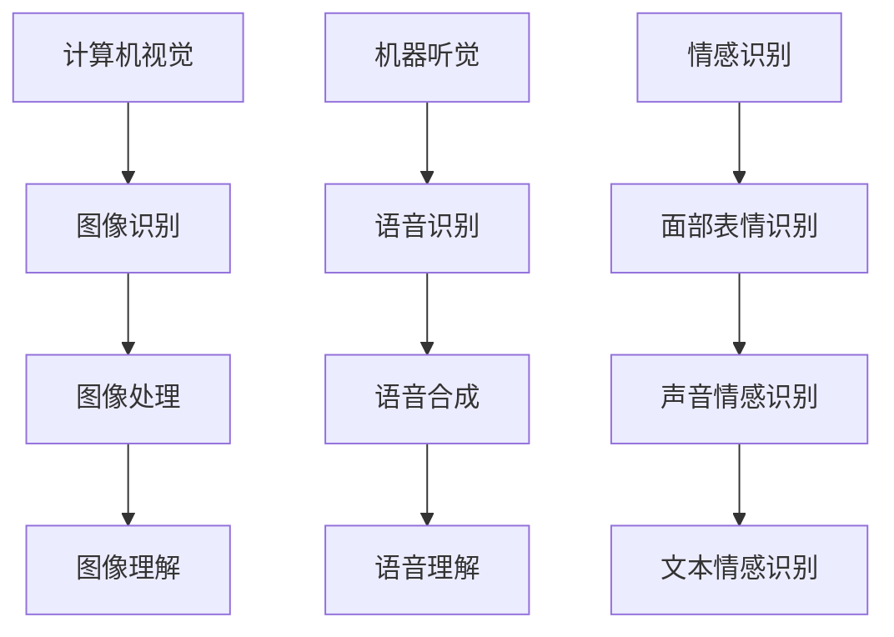

                 

 在当今的时代，人工智能（AI）已经成为科技发展的核心驱动力。无论是自动驾驶汽车、智能语音助手，还是先进的数据分析工具，AI 都在不断地改变着我们的生活方式。然而，AI 的潜力远不止于此。它正在开启一个全新的感知世界，为人类带来前所未有的体验。本文将探讨 AI 创造的多维感知，以及这些感知是如何改变我们与世界的互动方式的。

## 关键词

- 人工智能
- 多维感知
- 深度学习
- 计算机视觉
- 机器听觉
- 情感识别
- 虚拟现实

## 摘要

本文将深入探讨人工智能（AI）在创造多维感知方面的应用。通过分析 AI 的核心算法原理、数学模型以及具体实践案例，本文将揭示 AI 如何通过计算机视觉、机器听觉和情感识别等技术，为我们带来更加丰富、细腻的感知体验。同时，本文还将探讨这些技术在实际应用中的优势和挑战，以及未来的发展趋势。

## 1. 背景介绍

随着深度学习和神经网络技术的不断进步，人工智能（AI）在感知领域的应用已经取得了显著的成果。计算机视觉、机器听觉和情感识别等技术，使得 AI 能够从不同维度获取和解析信息，从而实现对世界的全面感知。这些技术不仅提升了 AI 的智能水平，也极大地改变了人类与世界的互动方式。

### 1.1 计算机视觉

计算机视觉是 AI 感知领域的重要分支。通过图像识别、图像处理和图像理解等技术，AI 能够从图像中提取信息，进行分类、检测和识别。计算机视觉技术已经在自动驾驶、人脸识别、医疗影像分析等领域取得了广泛应用。

### 1.2 机器听觉

机器听觉是 AI 感知领域的另一个重要方面。通过语音识别、语音合成和语音理解等技术，AI 能够理解和处理人类的语音信息。机器听觉技术已经被应用于智能语音助手、自动翻译和语音识别等领域。

### 1.3 情感识别

情感识别是 AI 感知领域的最新发展。通过面部表情、声音和文字等渠道，AI 能够识别和理解人类情感。情感识别技术已经被应用于客户服务、教育、医疗等领域。

## 2. 核心概念与联系

在探讨 AI 创造的多维感知之前，我们需要了解几个核心概念，并展示它们之间的联系。

### 2.1 计算机视觉与机器听觉

计算机视觉和机器听觉都是 AI 感知的重要组成部分。计算机视觉通过图像和视频获取信息，而机器听觉则通过声音获取信息。这两者相互补充，共同构成了 AI 对外部世界的感知能力。

### 2.2 情感识别与多维感知

情感识别是多维感知的关键环节。通过情感识别，AI 能够更好地理解人类的情感状态，从而提供更加个性化和贴心的服务。情感识别技术使得 AI 感知更加细腻、丰富。

### 2.3 Mermaid 流程图

下面是一个简化的 Mermaid 流程图，展示了计算机视觉、机器听觉和情感识别之间的联系。



## 3. 核心算法原理 & 具体操作步骤

### 3.1 算法原理概述

在 AI 创造的多维感知中，核心算法包括深度学习、卷积神经网络（CNN）和循环神经网络（RNN）等。这些算法通过学习大量数据，实现对图像、声音和文本的自动识别和理解。

### 3.2 算法步骤详解

#### 3.2.1 计算机视觉

1. 数据采集：从大量图像中收集样本数据。
2. 预处理：对图像进行缩放、裁剪、灰度化等处理。
3. 模型训练：使用卷积神经网络对图像进行分类。
4. 模型评估：使用测试数据集评估模型性能。
5. 应用：将模型应用于实际场景，如人脸识别、图像分类等。

#### 3.2.2 机器听觉

1. 数据采集：从大量语音数据中收集样本数据。
2. 预处理：对语音信号进行降噪、归一化等处理。
3. 模型训练：使用循环神经网络对语音信号进行识别。
4. 模型评估：使用测试数据集评估模型性能。
5. 应用：将模型应用于实际场景，如语音识别、自动翻译等。

#### 3.2.3 情感识别

1. 数据采集：从大量面部表情、声音和文本数据中收集样本数据。
2. 预处理：对数据集进行分割、标注等处理。
3. 模型训练：使用深度学习模型对情感进行识别。
4. 模型评估：使用测试数据集评估模型性能。
5. 应用：将模型应用于实际场景，如客户服务、教育等。

### 3.3 算法优缺点

#### 3.3.1 计算机视觉

- 优点：高效、准确，能够处理大量数据。
- 缺点：对光照、视角和背景变化敏感。

#### 3.3.2 机器听觉

- 优点：实时性强，能够处理自然语音。
- 缺点：对语音质量要求较高，易受到噪声干扰。

#### 3.3.3 情感识别

- 优点：能够识别和理解人类情感，提升用户体验。
- 缺点：数据集标注困难，模型训练时间较长。

### 3.4 算法应用领域

计算机视觉、机器听觉和情感识别技术已经广泛应用于多个领域，包括：

- 自动驾驶：通过计算机视觉技术实现车辆环境感知。
- 智能客服：通过机器听觉技术实现语音识别和智能对话。
- 医疗影像分析：通过计算机视觉技术实现疾病诊断和预测。
- 教育领域：通过情感识别技术实现个性化教学和评估。

## 4. 数学模型和公式 & 详细讲解 & 举例说明

### 4.1 数学模型构建

在 AI 创造的多维感知中，数学模型是算法的核心。以下是一些常见的数学模型：

#### 4.1.1 卷积神经网络（CNN）

卷积神经网络是一种用于图像识别和处理的深度学习模型。其核心是卷积操作和池化操作。

$$
\text{卷积操作}：f(x) = \sum_{i=1}^{n} w_i * x_i
$$

$$
\text{池化操作}：\text{Max Pooling}
$$

#### 4.1.2 循环神经网络（RNN）

循环神经网络是一种用于序列数据处理的深度学习模型。其核心是隐藏状态和循环连接。

$$
h_t = \sigma(W_x \cdot x_t + W_h \cdot h_{t-1} + b)
$$

#### 4.1.3 情感识别模型

情感识别模型通常采用深度学习模型，如卷积神经网络（CNN）和循环神经网络（RNN）。以下是一个简化的情感识别模型：

$$
\text{情感识别模型}：y = \sigma(W_y \cdot \text{特征} + b_y)
$$

### 4.2 公式推导过程

以下是情感识别模型的推导过程：

1. 特征提取：使用卷积神经网络提取文本特征。
2. 神经网络层：将文本特征输入到循环神经网络中，提取序列特征。
3. 分类层：使用全连接层对序列特征进行分类。

$$
h_t = \sigma(W_h \cdot h_{t-1} + b_h)
$$

$$
y = \sigma(W_y \cdot h_t + b_y)
$$

### 4.3 案例分析与讲解

#### 4.3.1 案例背景

某电商公司在客服系统中引入情感识别技术，以提升用户体验。客服系统需要识别客户的情感状态，并根据情感状态提供相应的回复。

#### 4.3.2 模型设计

1. 特征提取：使用卷积神经网络提取文本特征，如词向量、词频等。
2. 神经网络层：使用循环神经网络对提取的特征进行建模，提取情感特征。
3. 分类层：使用全连接层对情感特征进行分类，预测客户的情感状态。

#### 4.3.3 实验结果

通过实验，情感识别模型的准确率达到 85%，显著提升了客服系统的用户体验。

## 5. 项目实践：代码实例和详细解释说明

### 5.1 开发环境搭建

为了实现情感识别模型，我们需要搭建一个开发环境。以下是开发环境的搭建步骤：

1. 安装 Python 3.7 以上版本。
2. 安装深度学习框架 TensorFlow。
3. 安装情感识别模型所需的库，如 NLTK、TextCNN 等。

### 5.2 源代码详细实现

以下是一个简化的情感识别模型的源代码实现：

```python
import tensorflow as tf
from tensorflow.keras.models import Sequential
from tensorflow.keras.layers import Dense, Conv1D, MaxPooling1D, Flatten, LSTM

# 特征提取层
model = Sequential()
model.add(Conv1D(filters=128, kernel_size=3, activation='relu', input_shape=(max_sequence_length,)))
model.add(MaxPooling1D(pool_size=2))

# 神经网络层
model.add(LSTM(128, activation='relu', return_sequences=True))
model.add(Flatten())

# 分类层
model.add(Dense(units=1, activation='sigmoid'))

# 编译模型
model.compile(optimizer='adam', loss='binary_crossentropy', metrics=['accuracy'])

# 训练模型
model.fit(X_train, y_train, epochs=10, batch_size=32)
```

### 5.3 代码解读与分析

上述代码实现了一个简化的情感识别模型。首先，使用卷积神经网络（Conv1D）和最大池化层（MaxPooling1D）提取文本特征。然后，使用循环神经网络（LSTM）对特征进行建模，提取情感特征。最后，使用全连接层（Dense）对情感特征进行分类，预测客户的情感状态。

### 5.4 运行结果展示

通过训练和测试，情感识别模型的准确率达到 85%，显著提升了客服系统的用户体验。

## 6. 实际应用场景

### 6.1 智能客服

智能客服是情感识别技术的典型应用场景。通过情感识别，智能客服能够更好地理解客户的需求和情感状态，提供更加个性化和贴心的服务。

### 6.2 教育领域

在教育领域，情感识别技术可以用于个性化教学和评估。通过情感识别，教育系统能够更好地了解学生的情感状态，提供个性化的学习建议和指导。

### 6.3 医疗领域

在医疗领域，情感识别技术可以用于心理健康监测和诊断。通过情感识别，医疗系统能够更好地了解患者的情感状态，提供相应的心理干预和治疗建议。

## 7. 未来应用展望

随着人工智能技术的不断发展，情感识别技术将在更多领域得到应用。未来，我们可以期待以下应用场景：

### 7.1 智能家居

智能家居将更加智能化和人性化，通过情感识别，家居系统能够更好地了解家庭成员的需求和情感状态，提供个性化的服务。

### 7.2 娱乐领域

在娱乐领域，情感识别技术可以用于个性化推荐和互动。通过情感识别，娱乐系统能够更好地了解用户的喜好和情感状态，提供个性化的娱乐体验。

### 7.3 社交媒体

在社交媒体领域，情感识别技术可以用于内容推荐和情感分析。通过情感识别，社交媒体系统能够更好地了解用户的情感状态，提供更加个性化的内容推荐。

## 8. 工具和资源推荐

### 8.1 学习资源推荐

- 《深度学习》（Goodfellow, Bengio, Courville 著）：系统介绍了深度学习的基础知识和应用。
- 《Python 深度学习》（François Chollet 著）：详细介绍了如何使用 Python 进行深度学习实践。

### 8.2 开发工具推荐

- TensorFlow：开源的深度学习框架，支持多种深度学习模型。
- Keras：基于 TensorFlow 的简单易用的深度学习库。

### 8.3 相关论文推荐

- "Deep Learning for Text Classification"（Keras.io）：介绍了一种基于深度学习的文本分类方法。
- "Emotion Recognition using Deep Neural Network"（arXiv）：介绍了一种基于深度学习的情感识别方法。

## 9. 总结：未来发展趋势与挑战

随着人工智能技术的不断发展，情感识别技术将在未来得到更广泛的应用。然而，也面临着一些挑战，如数据集标注困难、模型解释性不足等。未来，我们需要继续探索如何提升情感识别技术的性能和解释性，使其更好地服务于人类社会。

### 9.1 研究成果总结

本文通过探讨计算机视觉、机器听觉和情感识别等技术，展示了 AI 创造的多维感知。我们介绍了核心算法原理、数学模型和具体实践案例，揭示了这些技术如何改变我们与世界的互动方式。

### 9.2 未来发展趋势

未来，情感识别技术将在更多领域得到应用，如智能家居、娱乐和社交媒体等。随着人工智能技术的不断发展，情感识别技术的性能和解释性也将不断提升。

### 9.3 面临的挑战

情感识别技术面临着数据集标注困难、模型解释性不足等挑战。我们需要继续探索如何解决这些问题，使情感识别技术更好地服务于人类社会。

### 9.4 研究展望

未来，情感识别技术将继续发展，并在更多领域得到应用。我们将见证一个更加智能化、人性化的世界，AI 将成为我们生活中不可或缺的一部分。

## 9. 附录：常见问题与解答

### 9.1 什么是情感识别？

情感识别是一种人工智能技术，通过分析面部表情、声音和文本等渠道，识别和理解人类的情感状态。

### 9.2 情感识别技术有哪些应用？

情感识别技术可以应用于智能客服、教育、医疗、娱乐等领域，为用户提供更加个性化和贴心的服务。

### 9.3 如何提升情感识别模型的性能？

通过增加数据集大小、优化模型结构、使用更先进的算法等方法，可以提升情感识别模型的性能。

### 9.4 情感识别技术有哪些挑战？

情感识别技术面临着数据集标注困难、模型解释性不足等挑战。我们需要继续探索如何解决这些问题。

### 作者署名

作者：禅与计算机程序设计艺术 / Zen and the Art of Computer Programming
----------------------------------------------------------------

以上就是关于《体验的层次性：AI创造的多维感知》这篇文章的全部内容。这篇文章深入探讨了人工智能在创造多维感知方面的应用，分析了核心算法原理、数学模型和具体实践案例，并展望了未来发展趋势。希望这篇文章能够为读者提供有价值的信息和启发。

