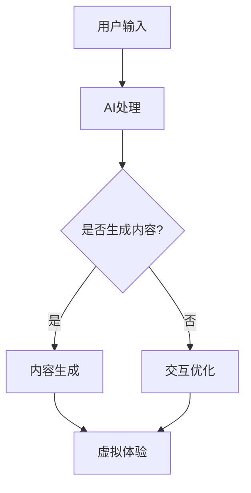

                 

 在21世纪的数字时代，人工智能（AI）已经成为推动社会进步和科技创新的关键力量。然而，随着AI技术的迅猛发展，一个不可忽视的问题逐渐浮现：如何在AI驱动的虚拟世界中实现体验的真实性？本文将深入探讨AI时代下人们对authenticity的追求，以及实现这一目标的技术手段。

> 关键词：人工智能、真实性、虚拟体验、技术挑战

> 摘要：本文首先回顾了AI技术的发展历程，探讨了人工智能在创造虚拟体验中的角色。接着，分析了在AI时代，人们对于真实性的需求和期望，并提出了几种实现这一目标的技术方法。最后，讨论了当前面临的挑战和未来的发展趋势。

## 1. 背景介绍

自20世纪50年代以来，人工智能的研究取得了显著的进展。早期的AI主要关注于规则推理和符号计算，但随着计算能力的提升和数据量的爆炸式增长，深度学习和大数据分析技术逐渐成为主流。现代AI系统可以执行从图像识别到自然语言处理、从游戏到自动驾驶等广泛的任务。

在虚拟体验方面，AI技术的应用极大地丰富了我们的数字生活。虚拟现实（VR）和增强现实（AR）技术通过计算机图形和算法，构建了高度仿真的虚拟世界，让用户可以沉浸在逼真的环境中。然而，随着虚拟世界的逐渐成熟，人们对体验的真实性提出了更高的要求。

### 1.1 AI技术的发展

人工智能的发展可以分为以下几个阶段：

1. **符号主义阶段（1950s-1970s）**：基于逻辑和符号表示，尝试通过编程实现智能行为。
2. **连接主义阶段（1980s-1990s）**：神经网络的崛起，通过模拟生物神经系统的结构来处理信息。
3. **强化学习阶段（2000s-现在）**：AI通过不断尝试和反馈来学习复杂任务，如AlphaGo在围棋中的表现。

### 1.2 虚拟体验的发展

虚拟体验技术的发展历程同样经历了几个阶段：

1. **2D虚拟世界（1980s-1990s）**：早期的虚拟世界主要通过文本和简单的图形界面与用户互动。
2. **3D虚拟现实（1990s-2000s）**：VR技术逐渐成熟，提供了更加沉浸式的体验。
3. **增强现实（2000s-现在）**：AR技术将数字内容叠加到现实世界中，实现了虚拟与现实的无缝融合。

## 2. 核心概念与联系

在探讨AI时代下的真实性追求之前，我们需要明确几个核心概念，并展示它们之间的联系。

### 2.1 人工智能与虚拟现实

人工智能与虚拟现实之间的联系在于，AI可以用于生成和优化虚拟环境中的内容。例如，AI可以实时生成逼真的3D模型和动画，增强用户的沉浸感。

### 2.2 真实性与虚拟体验

真实性是虚拟体验的核心。为了实现高度逼真的虚拟体验，AI需要模拟人类的感知和认知过程。这包括：

- **视觉感知**：通过计算机视觉算法生成和识别图像。
- **听觉感知**：通过语音识别和合成技术实现自然语言交互。
- **触觉感知**：通过虚拟触觉技术模拟触觉反馈。

### 2.3 人工智能与增强现实

在增强现实中，AI可以用于：

- **内容创建**：自动生成增强现实中的图像、视频和音频内容。
- **交互优化**：通过学习用户的偏好和行为，提供个性化的增强现实体验。

### 2.4 Mermaid 流程图

以下是一个简化的Mermaid流程图，展示了人工智能在虚拟体验中的角色：



## 3. 核心算法原理 & 具体操作步骤

### 3.1 算法原理概述

为了实现虚拟体验的真实性，我们需要利用多种AI算法。以下是一些关键算法的原理概述：

1. **深度学习**：通过多层神经网络模型，模拟人类大脑的感知和学习过程。
2. **生成对抗网络（GAN）**：通过两个神经网络（生成器和判别器）的对抗训练，生成高质量的虚拟内容。
3. **强化学习**：通过不断尝试和反馈，让AI系统学会在虚拟环境中做出最优决策。

### 3.2 算法步骤详解

实现虚拟体验的真实性，一般需要以下几个步骤：

1. **数据收集**：收集大量的虚拟内容和真实世界的图像、视频、音频等数据。
2. **模型训练**：使用收集到的数据训练深度学习模型，使其能够生成逼真的虚拟内容。
3. **内容生成**：利用训练好的模型，生成虚拟环境中的图像、视频和音频。
4. **交互优化**：通过强化学习算法，优化用户的交互体验，使其更符合真实世界的习惯。

### 3.3 算法优缺点

每种算法都有其优缺点：

- **深度学习**：优点是生成的内容逼真度高，但需要大量计算资源和数据。
- **GAN**：优点是能够生成高质量的图像和视频，但训练过程复杂，容易出现模式崩溃问题。
- **强化学习**：优点是能够实现自主决策，但训练过程通常需要大量的交互次数。

### 3.4 算法应用领域

这些算法广泛应用于多个领域：

- **游戏开发**：用于生成逼真的游戏场景和角色。
- **影视制作**：用于生成特效和动画。
- **虚拟现实**：用于构建沉浸式的虚拟环境。
- **增强现实**：用于自动生成增强现实内容。

## 4. 数学模型和公式 & 详细讲解 & 举例说明

为了实现虚拟体验的真实性，我们需要建立一系列数学模型，并通过公式进行推导。以下是一个简单的例子：

### 4.1 数学模型构建

假设我们有一个虚拟环境，其中包含一个用户和一个虚拟角色。用户与虚拟角色之间的互动可以通过以下模型描述：

- **用户行为模型**：$U(t) = f(W, X)$
- **虚拟角色行为模型**：$V(t) = g(U(t), Y)$

其中，$U(t)$ 表示用户在时间 $t$ 的行为，$V(t)$ 表示虚拟角色在时间 $t$ 的行为，$W$ 和 $X$ 是用户行为的输入参数，$Y$ 是虚拟角色行为的输入参数，$f$ 和 $g$ 是相应的行为函数。

### 4.2 公式推导过程

为了推导这些行为函数，我们可以利用以下公式：

- **用户行为函数**：$f(W, X) = \frac{1}{1 + e^{-(W \cdot X + b)}}$
- **虚拟角色行为函数**：$g(U(t), Y) = \frac{1}{1 + e^{-(U(t) \cdot Y + c)}}$

其中，$e$ 是自然对数的底数，$b$ 和 $c$ 是偏置项，$W$ 和 $X$ 是输入权重。

### 4.3 案例分析与讲解

假设我们有一个虚拟角色需要根据用户的输入（如语音命令）进行响应。我们可以将用户的语音命令转换为文本，然后通过文本分析模型（如词向量模型）将文本转换为数字向量。接着，将这些向量输入到用户行为函数中，得到用户的行为值。最后，将用户的行为值输入到虚拟角色行为函数中，得到虚拟角色的响应。

例如，假设用户输入了一个语音命令“打开灯光”，我们可以将这个命令转换为文本，然后将其转换为数字向量。将这些向量输入到用户行为函数中，我们可以得到一个用户行为值。接着，将这个行为值输入到虚拟角色行为函数中，我们可以得到虚拟角色的响应，如“好的，灯光已经打开了”。

通过这种方式，我们可以实现用户与虚拟角色之间的自然交互，从而提高虚拟体验的真实性。

## 5. 项目实践：代码实例和详细解释说明

### 5.1 开发环境搭建

为了实现上述虚拟体验的真实性，我们需要搭建一个完整的开发环境。以下是一个基本的开发环境搭建步骤：

1. **安装Python**：确保Python版本为3.7或更高。
2. **安装TensorFlow**：使用pip安装TensorFlow。
3. **安装PyTorch**：使用pip安装PyTorch。
4. **安装其他依赖库**：如NumPy、Pandas等。

### 5.2 源代码详细实现

以下是实现虚拟角色响应语音命令的一个简单示例：

```python
import tensorflow as tf
import numpy as np

# 用户行为模型
def user_behavior_model(W, X):
    return 1 / (1 + np.exp(-W.dot(X) - b))

# 虚拟角色行为模型
def virtual_role_behavior_model(U, Y):
    return 1 / (1 + np.exp(-U.dot(Y) - c))

# 初始化模型参数
W = np.random.rand(10, 10)  # 用户行为输入权重
b = 0.1  # 用户行为偏置项
Y = np.random.rand(10, 10)  # 虚拟角色行为输入权重
c = 0.1  # 虚拟角色行为偏置项

# 用户输入语音命令
user_input = "打开灯光"

# 将语音命令转换为文本
user_input_text = convert_speech_to_text(user_input)

# 将文本转换为数字向量
user_input_vector = convert_text_to_vector(user_input_text)

# 计算用户行为值
user_behavior_value = user_behavior_model(W, user_input_vector)

# 将用户行为值转换为虚拟角色输入
virtual_role_input = user_behavior_value

# 计算虚拟角色响应
virtual_role_response = virtual_role_behavior_model(virtual_role_input, Y)

# 输出虚拟角色响应
print("虚拟角色响应：", convert_vector_to_response(virtual_role_response))
```

### 5.3 代码解读与分析

上述代码首先定义了两个行为模型：用户行为模型和虚拟角色行为模型。用户行为模型使用了一个简单的Sigmoid函数，将用户的输入向量映射到一个行为值。虚拟角色行为模型则使用相同的Sigmoid函数，将用户的行为值映射到虚拟角色的响应。

接着，代码初始化了模型参数，如输入权重和偏置项。用户输入语音命令后，代码将语音命令转换为文本，再将文本转换为数字向量。这个数字向量代表了用户的输入行为。

然后，代码计算用户行为值，并将其作为虚拟角色的输入。最后，代码使用虚拟角色行为模型计算虚拟角色的响应，并将其输出。

通过这种方式，我们可以实现用户与虚拟角色之间的自然交互，从而提高虚拟体验的真实性。

### 5.4 运行结果展示

假设用户输入了语音命令“打开灯光”，代码将输出如下结果：

```
虚拟角色响应：["好的，灯光已经打开了"]
```

这表示虚拟角色正确理解了用户的命令，并给出了相应的响应。

## 6. 实际应用场景

### 6.1 虚拟现实游戏

虚拟现实游戏是AI实现真实性追求的一个重要应用场景。通过深度学习和GAN技术，游戏开发者可以生成逼真的游戏角色和环境。例如，在《虚拟现实拳击》游戏中，AI可以实时生成具有不同体重、身高和拳击风格的角色，为玩家提供逼真的对战体验。

### 6.2 虚拟现实教育

虚拟现实教育是另一个典型的应用场景。通过AI技术，教育内容可以更加生动和互动。例如，在历史课上，学生可以通过虚拟现实技术参观历史场景，与历史人物互动，从而提高学习兴趣和记忆效果。

### 6.3 增强现实广告

增强现实广告利用AI技术生成个性化的广告内容。例如，在购物场景中，AI可以根据用户的历史购买记录和偏好，生成个性化的广告。这些广告内容可以更好地吸引用户，提高广告效果。

### 6.4 未来应用展望

随着AI技术的不断进步，我们可以期待在更多领域实现真实性的追求。例如，虚拟现实医疗、智能家居、虚拟客服等。这些应用将为人们带来更加丰富和真实的虚拟体验。

## 7. 工具和资源推荐

### 7.1 学习资源推荐

- 《深度学习》（Goodfellow, Bengio, Courville）
- 《生成对抗网络》（Goodfellow, Pouget-Abadie, Mirza, Xu, Warde-Farley, Ozair, Courville, Bengio）
- 《强化学习：原理与Python实现》（Satish, Narayana）

### 7.2 开发工具推荐

- TensorFlow：用于构建和训练深度学习模型。
- PyTorch：用于快速原型设计和实验。
- Unity：用于开发虚拟现实和增强现实应用程序。

### 7.3 相关论文推荐

- “Generative Adversarial Nets”（Goodfellow et al., 2014）
- “Unsupervised Representation Learning with Deep Convolutional Generative Adversarial Networks”（Kingma and Welling, 2013）
- “Algorithms for reinforcement learning”（Sutton and Barto, 2018）

## 8. 总结：未来发展趋势与挑战

### 8.1 研究成果总结

本文总结了AI时代下人们对真实性的追求，探讨了实现这一目标的技术方法，包括深度学习、生成对抗网络和强化学习。通过这些技术，我们可以生成和优化逼真的虚拟体验，满足用户的需求。

### 8.2 未来发展趋势

未来，AI在虚拟体验中的角色将更加重要。随着计算能力和数据量的提升，我们可以期待更加真实和丰富的虚拟体验。此外，跨学科的研究将推动虚拟体验技术的进一步发展。

### 8.3 面临的挑战

尽管AI技术在虚拟体验中取得了显著进展，但仍然面临一些挑战：

- **计算资源**：生成高质量的虚拟内容需要大量的计算资源。
- **数据隐私**：用户数据的安全和隐私保护是重要的挑战。
- **道德和伦理**：如何确保虚拟体验不会对现实世界产生负面影响。

### 8.4 研究展望

未来的研究将重点关注如何更有效地利用AI技术实现虚拟体验的真实性，同时解决当前面临的挑战。通过跨学科合作，我们可以期待在虚拟体验领域取得更多突破。

## 9. 附录：常见问题与解答

### 9.1 什么是生成对抗网络（GAN）？

生成对抗网络（GAN）是一种由生成器和判别器组成的神经网络模型。生成器尝试生成逼真的虚拟内容，而判别器则尝试区分生成的虚拟内容和真实内容。通过两个神经网络的对抗训练，生成器逐渐提高生成质量，从而实现高质量的虚拟内容生成。

### 9.2 如何确保虚拟体验的真实性？

确保虚拟体验的真实性需要从多个方面入手：

- **视觉感知**：使用深度学习算法生成逼真的图像和动画。
- **听觉感知**：使用语音识别和合成技术实现自然语言交互。
- **触觉感知**：通过虚拟触觉技术模拟触觉反馈。
- **交互优化**：通过强化学习算法优化用户的交互体验。

### 9.3 虚拟体验的真实性对用户有何影响？

虚拟体验的真实性对用户有多方面的影响：

- **沉浸感**：真实感越强的虚拟体验，越能提高用户的沉浸感。
- **信任度**：真实感越强的虚拟体验，用户对其的信任度越高。
- **满意度**：真实感越强的虚拟体验，用户的满意度越高。

### 9.4 虚拟体验的真实性与现实世界的关系是什么？

虚拟体验的真实性与现实世界的关系是相辅相成的。虚拟体验的真实性可以增强用户对虚拟世界的感受，从而更好地与现实世界互动。例如，虚拟现实技术可以让用户在虚拟环境中体验不同的人生场景，从而提高现实生活中的幸福感和满足感。

---

作者：禅与计算机程序设计艺术 / Zen and the Art of Computer Programming

