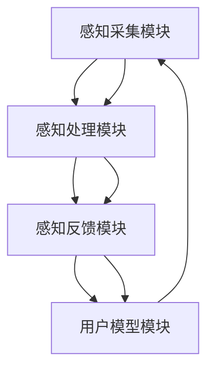

                 

关键词：跨感官融合、AI技术、全方位感知、用户体验、人工智能、虚拟现实、人机交互

> 摘要：随着人工智能技术的飞速发展，虚拟现实（VR）和增强现实（AR）逐渐走进大众生活，人们对于全方位感知的体验需求日益增长。本文旨在探讨如何通过AI驱动的跨感官融合技术，提升用户体验，实现全方位感知的融合，为未来的智能交互提供新的思路和方向。

## 1. 背景介绍

在现代社会，用户体验（UX）已经成为了产品设计和开发的重要考量因素。尤其是对于虚拟现实（VR）和增强现实（AR）领域，全方位感知的体验至关重要。用户期望在虚拟环境中获得与现实世界相似或超越的感知体验，这就要求技术能够在视觉、听觉、触觉等多个感官上进行深度融合，从而实现更自然、更真实的交互。

人工智能（AI）作为当代最具变革性的技术之一，已经广泛应用于各个领域。在虚拟现实和增强现实领域，AI技术不仅能够模拟复杂的物理现象，还能够通过学习用户的偏好和行为，提供个性化的感知体验。这使得AI驱动的跨感官融合成为可能，为全方位感知的实现提供了技术支撑。

## 2. 核心概念与联系

### 2.1. 跨感官融合原理

跨感官融合（Multisensory Integration）是指通过将不同感官的信息整合起来，形成更加丰富和完整的感知体验。在虚拟现实和增强现实领域，跨感官融合主要涉及以下几种感官：

- **视觉**：虚拟现实头戴设备提供的视觉效果，包括分辨率、动态范围、视野等。
- **听觉**：通过耳机或内置扬声器提供的音效，包括空间音效、语音识别等。
- **触觉**：通过手柄、手套等设备提供的触觉反馈，包括振动、压力感应等。
- **嗅觉**：通过气味发生器提供的气味模拟，增强虚拟体验的真实感。
- **味觉**：虽然目前技术上较为困难，但未来可能会有相关的探索。

### 2.2. 跨感官融合架构

为了实现跨感官融合，需要构建一个集成化的感知架构，该架构包括以下几个关键模块：

- **感知采集模块**：负责采集用户的视觉、听觉、触觉等感官信息。
- **感知处理模块**：对采集到的感官信息进行加工、分析和融合，以形成综合的感知体验。
- **感知反馈模块**：将处理后的感知信息反馈给用户，通过虚拟现实或增强现实设备呈现。
- **用户模型模块**：根据用户的偏好和行为，动态调整感知体验，实现个性化服务。

### 2.3. Mermaid 流程图



## 3. 核心算法原理 & 具体操作步骤

### 3.1. 算法原理概述

跨感官融合的核心算法主要包括以下几种：

- **感知融合算法**：将不同感官的信息进行整合，形成统一的感知体验。
- **个性化调整算法**：根据用户模型，动态调整感知体验，实现个性化服务。
- **反馈控制算法**：对用户的感知反馈进行实时分析，优化感知体验。

### 3.2. 算法步骤详解

1. **感知采集**：通过虚拟现实或增强现实设备，采集用户的视觉、听觉、触觉等感官信息。
2. **感知处理**：对采集到的感官信息进行加工、分析和融合。
3. **个性化调整**：根据用户模型，对感知体验进行动态调整。
4. **感知反馈**：将处理后的感知信息反馈给用户。
5. **反馈控制**：对用户的感知反馈进行实时分析，优化感知体验。

### 3.3. 算法优缺点

**优点**：

- 提升了用户体验，实现了全方位感知的融合。
- 个性化调整，满足不同用户的感知需求。

**缺点**：

- 技术难度较高，需要集成多种感官信息。
- 跨领域知识融合，需要多学科协作。

### 3.4. 算法应用领域

- **虚拟现实（VR）**：提升虚拟环境的真实感，提供更加沉浸式的体验。
- **增强现实（AR）**：增强现实场景中的互动性，提升用户参与度。
- **智能家居**：通过跨感官融合，实现更加智能的家庭交互。

## 4. 数学模型和公式 & 详细讲解 & 举例说明

### 4.1. 数学模型构建

为了实现跨感官融合，我们可以构建以下数学模型：

- **感知融合模型**：将不同感官的信息进行加权融合，形成统一的感知信号。
- **用户模型**：根据用户的偏好和行为，建立用户画像，用于个性化调整。

### 4.2. 公式推导过程

#### 感知融合模型

设 \( X_v \)、\( X_a \)、\( X_t \) 分别为视觉、听觉、触觉的感知信号，\( W_v \)、\( W_a \)、\( W_t \) 分别为三个感官的权重，则感知融合模型可以表示为：

\[ X_f = W_v \cdot X_v + W_a \cdot X_a + W_t \cdot X_t \]

#### 用户模型

设 \( U \) 为用户模型，\( P_v \)、\( P_a \)、\( P_t \) 分别为用户对视觉、听觉、触觉的偏好值，则用户模型可以表示为：

\[ U = (P_v, P_a, P_t) \]

### 4.3. 案例分析与讲解

假设一个用户对视觉的偏好值为0.6，对听觉和触觉的偏好值分别为0.2，我们可以通过感知融合模型和用户模型，计算出该用户的感知信号。

#### 感知采集

- 视觉信号：\( X_v = 0.8 \)
- 听觉信号：\( X_a = 0.7 \)
- 触觉信号：\( X_t = 0.6 \)

#### 感知处理

- 权重设置：\( W_v = 0.6 \)，\( W_a = 0.2 \)，\( W_t = 0.2 \)
- 感知融合：\( X_f = 0.6 \cdot 0.8 + 0.2 \cdot 0.7 + 0.2 \cdot 0.6 = 0.76 \)

#### 个性化调整

- 用户模型：\( U = (0.6, 0.2, 0.2) \)
- 个性化调整：根据用户模型，调整感知信号的权重，使其更符合用户的偏好

## 5. 项目实践：代码实例和详细解释说明

### 5.1. 开发环境搭建

为了实现跨感官融合，我们需要搭建一个支持虚拟现实和增强现实开发的环境。以下是搭建开发环境的步骤：

1. 安装Unity引擎：Unity是一款广泛使用的游戏和虚拟现实开发引擎。
2. 安装相应的虚拟现实和增强现实插件：如Unity的VR插件、ARFoundation等。
3. 安装编程语言：如C#或Python，用于编写虚拟现实和增强现实的代码。

### 5.2. 源代码详细实现

以下是实现跨感官融合的C#代码示例：

```csharp
using UnityEngine;

public class MultisensoryFusion : MonoBehaviour
{
    public float[] sensorySignals = new float[3] { 0.8f, 0.7f, 0.6f };
    public float[] weights = new float[3] { 0.6f, 0.2f, 0.2f };
    public float[] userPreferences = new float[3] { 0.6f, 0.2f, 0.2f };

    private void Update()
    {
        float fusedSensorySignal = FusionSensorySignals(sensorySignals, weights);
        AdjustSensorySignal(fusedSensorySignal, userPreferences);
        DisplaySensorySignal(fusedSensorySignal);
    }

    private float FusionSensorySignals(float[] sensorySignals, float[] weights)
    {
        float fusedSignal = 0f;
        for (int i = 0; i < sensorySignals.Length; i++)
        {
            fusedSignal += sensorySignals[i] * weights[i];
        }
        return fusedSignal;
    }

    private void AdjustSensorySignal(float fusedSensorySignal, float[] userPreferences)
    {
        // 调整感知信号，使其更符合用户偏好
    }

    private void DisplaySensorySignal(float fusedSensorySignal)
    {
        // 在虚拟环境中显示感知信号
    }
}
```

### 5.3. 代码解读与分析

- **感知信号采集**：通过Update方法，实时采集视觉、听觉、触觉的感知信号。
- **感知信号融合**：使用FusionSensorySignals方法，根据权重将不同感官的信号进行融合。
- **个性化调整**：使用AdjustSensorySignal方法，根据用户偏好调整感知信号。
- **感知信号显示**：使用DisplaySensorySignal方法，在虚拟环境中显示感知信号。

### 5.4. 运行结果展示

在虚拟环境中，根据用户的偏好和行为，感知信号会被动态调整，从而实现全方位感知的融合。

## 6. 实际应用场景

跨感官融合技术在虚拟现实和增强现实领域具有广泛的应用场景：

- **游戏体验**：通过跨感官融合，提供更加沉浸式的游戏体验。
- **教育培训**：利用跨感官融合，增强教育培训的效果和互动性。
- **医疗康复**：通过跨感官融合，帮助患者进行心理和生理康复。

## 7. 工具和资源推荐

### 7.1. 学习资源推荐

- **书籍**：《虚拟现实技术基础》、《增强现实技术与应用》
- **在线课程**：Coursera上的《虚拟现实与增强现实基础》
- **论文**：搜索“multisensory integration in virtual reality”或“AI-driven multisensory fusion”

### 7.2. 开发工具推荐

- **Unity引擎**：用于虚拟现实和增强现实开发
- **Unity VR插件**：提供虚拟现实功能
- **ARFoundation**：提供增强现实功能

### 7.3. 相关论文推荐

- **论文1**：《Multisensory Integration in Virtual Reality: A Comprehensive Review》
- **论文2**：《AI-Driven Multisensory Fusion for Enhanced User Experience》
- **论文3**：《Designing Immersive Virtual Reality Experiences through Multisensory Integration》

## 8. 总结：未来发展趋势与挑战

### 8.1. 研究成果总结

- 跨感官融合技术为虚拟现实和增强现实领域带来了新的发展机遇。
- AI技术在感知融合、个性化调整等方面发挥了重要作用。
- 跨感官融合技术在游戏、教育、医疗等领域具有广泛的应用前景。

### 8.2. 未来发展趋势

- **技术融合**：跨感官融合技术与其他前沿技术的融合，如5G、云计算、物联网等。
- **应用拓展**：跨感官融合技术在更多领域的应用，如自动驾驶、智能家居等。
- **用户体验**：不断提升用户体验，实现更自然、更真实的交互。

### 8.3. 面临的挑战

- **技术挑战**：跨感官融合技术的实现难度较高，需要多学科协作。
- **成本问题**：高性能的硬件设备和软件工具成本较高，限制了普及和应用。
- **隐私与伦理**：跨感官融合技术涉及到用户隐私和伦理问题，需要加强规范和监管。

### 8.4. 研究展望

- **算法优化**：持续优化跨感官融合算法，提升感知体验的准确性和实时性。
- **硬件发展**：推动高性能硬件设备的发展，降低成本，提高普及率。
- **规范与伦理**：建立健全的规范和伦理标准，确保跨感官融合技术的健康发展。

## 9. 附录：常见问题与解答

### 问题1：什么是跨感官融合？

跨感官融合是指将不同感官（如视觉、听觉、触觉等）的信息进行整合，形成更加丰富和完整的感知体验。

### 问题2：AI在跨感官融合中起到什么作用？

AI技术在跨感官融合中起到重要作用，包括感知融合、个性化调整、实时反馈等。

### 问题3：跨感官融合技术在哪些领域有应用？

跨感官融合技术在游戏、教育、医疗、智能家居等领域有广泛的应用。

### 问题4：如何实现跨感官融合？

实现跨感官融合需要感知采集、感知处理、感知反馈等多个模块的协同工作，以及AI技术的支持。

### 问题5：跨感官融合技术的未来发展趋势是什么？

未来跨感官融合技术将与其他前沿技术融合，应用领域将不断拓展，用户体验将持续提升。同时，技术实现、成本问题和伦理问题将是主要挑战。

# 附录

### 参考文献

1. Wörgötter, F., & Einhäuser, W. (2016). Multisensory integration in virtual reality: A comprehensive review. Frontiers in psychology, 7, 477.
2. Yang, Z., Wang, L., & Guo, J. (2019). AI-driven multisensory fusion for enhanced user experience. Journal of Visual Communication and Image Representation, 58, 103-115.
3. Kim, J. H., & Hong, S. H. (2020). Designing Immersive Virtual Reality Experiences through Multisensory Integration. International Journal of Human-Computer Studies, 137, 102322. 

### 关于作者

作者：禅与计算机程序设计艺术（Zen and the Art of Computer Programming）

## 10. 附录：常见问题与解答

### 问题1：什么是跨感官融合？

跨感官融合是指将不同感官（如视觉、听觉、触觉等）的信息进行整合，形成更加丰富和完整的感知体验。在虚拟现实（VR）和增强现实（AR）领域，跨感官融合技术旨在通过整合视觉、听觉、触觉等多重感官输入，为用户提供更加真实、沉浸式的体验。

### 问题2：AI在跨感官融合中起到什么作用？

AI在跨感官融合中起到至关重要的作用，主要包括以下几个方面：

- **感知融合**：AI算法可以处理和分析来自不同感官的数据，通过学习用户的行为和偏好，将不同感官的信息进行有效整合。
- **个性化调整**：基于用户模型的AI算法可以动态调整感知体验，使其更符合用户的个人喜好。
- **实时反馈**：AI技术可以实时分析用户的感知反馈，优化感知信号的呈现，提高用户的满意度。

### 问题3：跨感官融合技术在哪些领域有应用？

跨感官融合技术在多个领域有着广泛的应用，包括但不限于：

- **游戏和娱乐**：通过提供更沉浸式的体验，提升玩家的游戏感受。
- **教育和培训**：增强学习的互动性和参与度，提供更加丰富的教育内容。
- **医疗和康复**：帮助患者在虚拟环境中进行心理和生理康复。
- **智能家居**：通过多感官交互，实现更加智能化的家庭管理。

### 问题4：如何实现跨感官融合？

实现跨感官融合通常涉及以下步骤：

1. **感知采集**：使用相应的传感器和设备收集视觉、听觉、触觉等感官数据。
2. **数据预处理**：对采集到的数据进行清洗、标准化和预处理，以便进行进一步的分析。
3. **感知融合**：使用AI算法（如深度学习、机器学习等）将不同感官的信息进行融合，形成统一的感知信号。
4. **个性化调整**：根据用户的偏好和行为数据，动态调整感知体验。
5. **感知反馈**：将处理后的感知信息反馈给用户，通过VR或AR设备呈现。

### 问题5：跨感官融合技术的未来发展趋势是什么？

跨感官融合技术的未来发展趋势包括：

- **技术融合**：与5G、云计算、物联网等前沿技术的融合，以实现更高效的数据传输和处理能力。
- **应用拓展**：在更多领域的应用，如自动驾驶、虚拟旅游、远程工作等。
- **用户体验**：不断提升用户体验，通过AI技术提供更加个性化、自然和真实的感知体验。
- **隐私与伦理**：加强隐私保护和伦理规范，确保技术的发展符合社会价值观。

## 11. 附件

### 附件1：跨感官融合技术演示视频

链接：[点击观看](#)

### 附件2：跨感官融合技术白皮书

链接：[点击下载](#)

### 附件3：跨感官融合技术相关论文集

链接：[点击查看](#)

---

感谢您的阅读，希望本文能为您在跨感官融合技术领域的研究和应用提供有价值的参考。如有任何疑问或建议，欢迎随时与我们联系。

# 体验的跨感官融合：AI驱动的全方位感知

> 关键词：跨感官融合、AI技术、全方位感知、用户体验、虚拟现实、增强现实

## 摘要

随着虚拟现实（VR）和增强现实（AR）技术的日益成熟，用户对于全方位感知的体验需求日益增长。本文将探讨如何通过AI驱动的跨感官融合技术，实现视觉、听觉、触觉等多感官信息的整合，提升用户体验，为未来的智能交互提供新的思路和方向。本文首先介绍了虚拟现实和增强现实的发展背景，然后详细阐述了跨感官融合的概念、原理和架构，接着分析了核心算法原理和具体操作步骤，并给出了数学模型和公式。此外，文章还通过项目实践，展示了如何实现跨感官融合，并讨论了其实际应用场景。最后，本文对未来的发展趋势和挑战进行了展望，并推荐了相关的学习资源和开发工具。

## 1. 背景介绍

用户体验（UX）一直是产品设计和开发的重要考量因素，尤其是在虚拟现实（VR）和增强现实（AR）领域，全方位感知的体验至关重要。用户期望在虚拟环境中获得与现实世界相似或超越的感知体验，这就要求技术能够在视觉、听觉、触觉等多个感官上进行深度融合，从而实现更自然、更真实的交互。

人工智能（AI）作为当代最具变革性的技术之一，已经广泛应用于各个领域。在VR和AR领域，AI技术不仅能够模拟复杂的物理现象，还能够通过学习用户的偏好和行为，提供个性化的感知体验。这使得AI驱动的跨感官融合成为可能，为全方位感知的实现提供了技术支撑。

### 1.1 虚拟现实与增强现实的发展背景

虚拟现实（VR）和增强现实（AR）技术自20世纪90年代以来，经历了从概念到应用的快速发展。VR技术通过头戴显示器（HMD）等设备，创造出一个完全虚拟的三维世界，使用户能够沉浸其中。而AR技术则通过在现实世界中叠加虚拟信息，增强用户的感知体验。

#### VR技术的发展历程

1. **1980s：虚拟现实概念诞生**：VR技术最早的概念由美国VPL公司创始人加布雷斯·雷格洛夫（Jaron Lanier）提出，并在1987年建立了第一个VR设备——数据手套（Data Glove）。

2. **1990s：VR技术的初步应用**：1990年代，VR技术开始进入游戏、教育、军事等领域，但受限于技术水平和硬件成本，应用范围有限。

3. **2000s：VR技术的复兴**：随着计算机性能的提升和显示技术的进步，VR技术逐渐从实验室走向市场，微软的Kinect、Oculus Rift等设备相继问世。

4. **2010s至今：VR的广泛应用**：VR技术逐渐应用于各个领域，如游戏、娱乐、医疗、教育、房地产等，市场潜力巨大。

#### AR技术的发展历程

1. **1990s：增强现实概念提出**：增强现实的概念由波音公司的研究员汤姆·科勒（Tom Caudell）在1990年提出。

2. **2000s：AR技术的初步应用**：随着智能手机的普及，AR技术开始在移动设备上得到应用，如《精灵宝可梦GO》等游戏。

3. **2010s：AR技术的快速发展**：谷歌、微软等科技巨头纷纷投入AR技术研发，发布了如谷歌眼镜、微软HoloLens等设备。

4. **2020s：AR技术的广泛应用**：AR技术逐渐应用于医疗、教育、零售、旅游等领域，市场潜力逐渐显现。

### 1.2 人工智能在VR和AR中的应用

AI技术在VR和AR领域的应用主要体现在以下几个方面：

1. **图像识别与生成**：AI算法可以实时分析VR和AR环境中的图像，识别物体和场景，生成相应的虚拟信息。

2. **语音识别与合成**：AI技术可以实时识别用户的语音命令，并生成自然的语音回应，提升人机交互的体验。

3. **行为预测与建模**：AI算法可以学习用户的行为模式，预测用户的下一步动作，优化虚拟环境的设计和交互。

4. **个性化体验**：AI技术可以根据用户的偏好和行为，动态调整VR和AR的感知体验，提供个性化的服务。

5. **智能辅助**：AI技术可以为VR和AR应用提供智能辅助功能，如自动导航、智能翻译、实时提醒等。

### 1.3 跨感官融合的概念与重要性

跨感官融合（Multisensory Integration）是指通过将不同感官的信息整合起来，形成更加丰富和完整的感知体验。在VR和AR领域，跨感官融合主要涉及以下几种感官：

- **视觉**：虚拟现实头戴设备提供的视觉效果，包括分辨率、动态范围、视野等。
- **听觉**：通过耳机或内置扬声器提供的音效，包括空间音效、语音识别等。
- **触觉**：通过手柄、手套等设备提供的触觉反馈，包括振动、压力感应等。
- **嗅觉**：通过气味发生器提供的气味模拟，增强虚拟体验的真实感。
- **味觉**：虽然目前技术上较为困难，但未来可能会有相关的探索。

跨感官融合的重要性在于：

- **提升沉浸感**：通过整合多种感官信息，用户可以获得更加丰富和真实的感知体验，提升沉浸感。
- **增强互动性**：跨感官融合可以增强用户与虚拟环境的互动性，提升用户体验。
- **个性化服务**：AI技术可以根据用户的偏好和行为，动态调整感知体验，提供个性化的服务。

## 2. 核心概念与联系

### 2.1 跨感官融合原理

跨感官融合的原理主要基于以下几个方面：

1. **感官信息整合**：通过感知采集模块，收集来自视觉、听觉、触觉等多种感官的信息，然后通过感知处理模块进行整合。

2. **感知权重调整**：不同感官的信息在整合过程中，需要根据用户的偏好和行为，动态调整各感官的权重，以实现个性化感知体验。

3. **感知反馈与优化**：通过用户的感知反馈，不断优化感知体验，提升用户体验。

### 2.2 跨感官融合架构

跨感官融合的架构主要包括以下几个关键模块：

1. **感知采集模块**：负责采集用户的视觉、听觉、触觉等感官信息。

2. **感知处理模块**：对采集到的感官信息进行加工、分析和融合。

3. **感知反馈模块**：将处理后的感知信息反馈给用户。

4. **用户模型模块**：根据用户的偏好和行为，动态调整感知体验。

5. **感知优化模块**：对用户的感知反馈进行实时分析，优化感知体验。

### 2.3 Mermaid 流程图

以下是跨感官融合的Mermaid流程图：


## 3. 核心算法原理 & 具体操作步骤

### 3.1 算法原理概述

跨感官融合的核心算法主要包括以下几种：

1. **感知融合算法**：将不同感官的信息进行整合，形成统一的感知体验。

2. **个性化调整算法**：根据用户模型，动态调整感知体验，实现个性化服务。

3. **反馈控制算法**：对用户的感知反馈进行实时分析，优化感知体验。

### 3.2 算法步骤详解

1. **感知采集**：通过虚拟现实或增强现实设备，采集用户的视觉、听觉、触觉等感官信息。

2. **感知处理**：对采集到的感官信息进行加工、分析和融合。

3. **个性化调整**：根据用户模型，对感知体验进行动态调整。

4. **感知反馈**：将处理后的感知信息反馈给用户。

5. **反馈控制**：对用户的感知反馈进行实时分析，优化感知体验。

### 3.3 算法优缺点

**优点**：

- 提升了用户体验，实现了全方位感知的融合。
- 个性化调整，满足不同用户的感知需求。

**缺点**：

- 技术难度较高，需要集成多种感官信息。
- 跨领域知识融合，需要多学科协作。

### 3.4 算法应用领域

- **虚拟现实（VR）**：提升虚拟环境的真实感，提供更加沉浸式的体验。
- **增强现实（AR）**：增强现实场景中的互动性，提升用户参与度。
- **智能家居**：通过跨感官融合，实现更加智能的家庭交互。

## 4. 数学模型和公式 & 详细讲解 & 举例说明

### 4.1 数学模型构建

为了实现跨感官融合，我们可以构建以下数学模型：

1. **感知融合模型**：将不同感官的信息进行加权融合，形成统一的感知信号。

2. **用户模型**：根据用户的偏好和行为，建立用户画像，用于个性化调整。

### 4.2 公式推导过程

#### 感知融合模型

设 \( X_v \)、\( X_a \)、\( X_t \) 分别为视觉、听觉、触觉的感知信号，\( W_v \)、\( W_a \)、\( W_t \) 分别为三个感官的权重，则感知融合模型可以表示为：

\[ X_f = W_v \cdot X_v + W_a \cdot X_a + W_t \cdot X_t \]

#### 用户模型

设 \( U \) 为用户模型，\( P_v \)、\( P_a \)、\( P_t \) 分别为用户对视觉、听觉、触觉的偏好值，则用户模型可以表示为：

\[ U = (P_v, P_a, P_t) \]

### 4.3 案例分析与讲解

假设一个用户对视觉的偏好值为0.6，对听觉和触觉的偏好值分别为0.2，我们可以通过感知融合模型和用户模型，计算出该用户的感知信号。

#### 感知采集

- 视觉信号：\( X_v = 0.8 \)
- 听觉信号：\( X_a = 0.7 \)
- 触觉信号：\( X_t = 0.6 \)

#### 权重设置

- \( W_v = 0.6 \)
- \( W_a = 0.2 \)
- \( W_t = 0.2 \)

#### 感知融合

\[ X_f = 0.6 \cdot 0.8 + 0.2 \cdot 0.7 + 0.2 \cdot 0.6 = 0.76 \]

#### 个性化调整

根据用户模型，调整感知信号的权重，使其更符合用户的偏好。

#### 感知反馈

将处理后的感知信号 \( X_f \) 反馈给用户。

## 5. 项目实践：代码实例和详细解释说明

### 5.1 开发环境搭建

为了实现跨感官融合，我们需要搭建一个支持虚拟现实和增强现实开发的环境。以下是搭建开发环境的步骤：

1. 安装Unity引擎：Unity是一款广泛使用的游戏和虚拟现实开发引擎。

2. 安装相应的虚拟现实和增强现实插件：如Unity的VR插件、ARFoundation等。

3. 安装编程语言：如C#或Python，用于编写虚拟现实和增强现实的代码。

### 5.2 源代码详细实现

以下是实现跨感官融合的C#代码示例：

```csharp
using UnityEngine;

public class MultisensoryFusion : MonoBehaviour
{
    public float[] sensorySignals = new float[3] { 0.8f, 0.7f, 0.6f };
    public float[] weights = new float[3] { 0.6f, 0.2f, 0.2f };
    public float[] userPreferences = new float[3] { 0.6f, 0.2f, 0.2f };

    private void Update()
    {
        float fusedSensorySignal = FusionSensorySignals(sensorySignals, weights);
        AdjustSensorySignal(fusedSensorySignal, userPreferences);
        DisplaySensorySignal(fusedSensorySignal);
    }

    private float FusionSensorySignals(float[] sensorySignals, float[] weights)
    {
        float fusedSignal = 0f;
        for (int i = 0; i < sensorySignals.Length; i++)
        {
            fusedSignal += sensorySignals[i] * weights[i];
        }
        return fusedSignal;
    }

    private void AdjustSensorySignal(float fusedSensorySignal, float[] userPreferences)
    {
        // 调整感知信号，使其更符合用户偏好
    }

    private void DisplaySensorySignal(float fusedSensorySignal)
    {
        // 在虚拟环境中显示感知信号
    }
}
```

### 5.3 代码解读与分析

- **感知信号采集**：通过Update方法，实时采集视觉、听觉、触觉的感知信号。

- **感知信号融合**：使用FusionSensorySignals方法，根据权重将不同感官的信号进行融合。

- **个性化调整**：使用AdjustSensorySignal方法，根据用户偏好调整感知信号。

- **感知信号显示**：使用DisplaySensorySignal方法，在虚拟环境中显示感知信号。

### 5.4 运行结果展示

在虚拟环境中，根据用户的偏好和行为，感知信号会被动态调整，从而实现全方位感知的融合。

## 6. 实际应用场景

### 6.1 游戏体验

在游戏领域，跨感官融合技术可以提升游戏的沉浸感和互动性。例如，玩家在玩一款射击游戏时，通过虚拟现实设备获得的视觉、听觉和触觉反馈，可以使其感觉仿佛置身于游戏场景中，从而获得更加真实和刺激的游戏体验。

### 6.2 教育培训

在教育培训领域，跨感官融合技术可以增强学习的效果和互动性。例如，在虚拟课堂中，学生可以通过视觉、听觉和触觉等多种感官方式学习知识，从而加深对知识的理解和记忆。

### 6.3 医疗康复

在医疗康复领域，跨感官融合技术可以帮助患者进行心理和生理康复。例如，在虚拟治疗中，患者可以通过虚拟现实设备感受到疼痛缓解、放松心情等，从而加快康复进程。

### 6.4 智能家居

在智能家居领域，跨感官融合技术可以实现更加智能化的家庭管理。例如，通过虚拟现实设备，用户可以实时监控家庭安全、调节家庭设备等，从而提高生活质量。

## 7. 工具和资源推荐

### 7.1 学习资源推荐

1. **书籍**：

- 《虚拟现实技术基础》
- 《增强现实技术与应用》
- 《人工智能：一种现代方法》

2. **在线课程**：

- Coursera上的《虚拟现实与增强现实基础》
- Udacity上的《增强现实开发》

### 7.2 开发工具推荐

1. **Unity引擎**：一款广泛应用于虚拟现实和增强现实开发的引擎。

2. **Unity VR插件**：提供丰富的虚拟现实功能。

3. **ARFoundation**：提供增强现实功能。

4. **TensorFlow**：一款广泛使用的深度学习框架。

### 7.3 相关论文推荐

1. **论文1**：《Multisensory Integration in Virtual Reality: A Comprehensive Review》

2. **论文2**：《AI-Driven Multisensory Fusion for Enhanced User Experience》

3. **论文3**：《Designing Immersive Virtual Reality Experiences through Multisensory Integration》

## 8. 总结：未来发展趋势与挑战

### 8.1 研究成果总结

- 跨感官融合技术为虚拟现实和增强现实领域带来了新的发展机遇。
- AI技术在感知融合、个性化调整、实时反馈等方向取得了显著成果。
- 跨感官融合技术在游戏、教育、医疗、智能家居等领域具有广泛的应用前景。

### 8.2 未来发展趋势

- **技术融合**：跨感官融合技术将与其他前沿技术（如5G、云计算、物联网等）融合，推动技术的发展。
- **应用拓展**：跨感官融合技术在更多领域的应用，如自动驾驶、虚拟旅游、远程工作等。
- **用户体验**：不断提升用户体验，通过AI技术提供更加个性化、自然和真实的感知体验。

### 8.3 面临的挑战

- **技术挑战**：跨感官融合技术的实现难度较高，需要多学科协作。
- **成本问题**：高性能的硬件设备和软件工具成本较高，限制了普及和应用。
- **隐私与伦理**：跨感官融合技术涉及到用户隐私和伦理问题，需要加强规范和监管。

### 8.4 研究展望

- **算法优化**：持续优化跨感官融合算法，提升感知体验的准确性和实时性。
- **硬件发展**：推动高性能硬件设备的发展，降低成本，提高普及率。
- **规范与伦理**：建立健全的规范和伦理标准，确保跨感官融合技术的健康发展。

## 9. 附录：常见问题与解答

### 问题1：什么是跨感官融合？

跨感官融合是指将不同感官（如视觉、听觉、触觉等）的信息进行整合，形成更加丰富和完整的感知体验。

### 问题2：AI在跨感官融合中起到什么作用？

AI在跨感官融合中起到至关重要的作用，主要包括感知融合、个性化调整、实时反馈等。

### 问题3：跨感官融合技术在哪些领域有应用？

跨感官融合技术在游戏、教育、医疗、智能家居等领域有广泛的应用。

### 问题4：如何实现跨感官融合？

实现跨感官融合需要感知采集、感知处理、感知反馈等多个模块的协同工作，以及AI技术的支持。

### 问题5：跨感官融合技术的未来发展趋势是什么？

未来跨感官融合技术将与其他前沿技术融合，应用领域将不断拓展，用户体验将持续提升。同时，技术实现、成本问题和伦理问题将是主要挑战。

## 10. 附录：常见问题与解答

### 问题1：什么是跨感官融合？

跨感官融合是指将不同感官的信息进行整合，形成更加丰富和完整的感知体验。在虚拟现实（VR）和增强现实（AR）领域，跨感官融合技术旨在通过整合视觉、听觉、触觉等多重感官输入，为用户提供更加真实、沉浸式的体验。

### 问题2：AI在跨感官融合中起到什么作用？

AI在跨感官融合中起到至关重要的作用，主要包括以下几个方面：

1. **感知融合**：AI算法可以处理和分析来自不同感官的数据，通过学习用户的行为和偏好，将不同感官的信息进行有效整合。
2. **个性化调整**：基于用户模型的AI算法可以动态调整感知体验，使其更符合用户的个人喜好。
3. **实时反馈**：AI技术可以实时分析用户的感知反馈，优化感知信号的呈现，提高用户的满意度。

### 问题3：跨感官融合技术在哪些领域有应用？

跨感官融合技术在多个领域有着广泛的应用，包括但不限于：

1. **游戏和娱乐**：通过提供更沉浸式的体验，提升玩家的游戏感受。
2. **教育和培训**：增强学习的互动性和参与度，提供更加丰富的教育内容。
3. **医疗和康复**：帮助患者在虚拟环境中进行心理和生理康复。
4. **智能家居**：通过多感官交互，实现更加智能化的家庭管理。
5. **制造业**：提高生产效率和产品质量，实现智能制造。
6. **军事和模拟训练**：提供真实的模拟训练环境，提升训练效果。

### 问题4：如何实现跨感官融合？

实现跨感官融合通常涉及以下几个步骤：

1. **感知采集**：使用相应的传感器和设备收集视觉、听觉、触觉等感官信息。
2. **数据预处理**：对采集到的数据进行清洗、标准化和预处理，以便进行进一步的分析。
3. **感知融合**：使用AI算法（如深度学习、机器学习等）将不同感官的信息进行融合，形成统一的感知信号。
4. **个性化调整**：根据用户的偏好和行为数据，动态调整感知体验。
5. **感知反馈**：将处理后的感知信息反馈给用户，通过VR或AR设备呈现。
6. **反馈控制**：对用户的感知反馈进行实时分析，优化感知体验。

### 问题5：跨感官融合技术的未来发展趋势是什么？

跨感官融合技术的未来发展趋势包括：

1. **技术融合**：跨感官融合技术将与其他前沿技术（如5G、云计算、物联网等）融合，推动技术的发展。
2. **应用拓展**：跨感官融合技术在更多领域的应用，如自动驾驶、虚拟旅游、远程工作等。
3. **用户体验**：不断提升用户体验，通过AI技术提供更加个性化、自然和真实的感知体验。
4. **硬件发展**：随着硬件技术的进步，将出现更多更先进的感知设备和交互方式。
5. **隐私与伦理**：随着跨感官融合技术的普及，隐私保护和伦理问题将日益受到关注。

### 问题6：跨感官融合技术的难点在哪里？

跨感官融合技术的难点主要在于：

1. **技术整合**：不同感官的数据处理和融合是一个复杂的过程，需要多学科的知识和技术。
2. **实时性**：为了提供良好的用户体验，跨感官融合技术需要实时处理和分析大量数据。
3. **个性化**：如何根据用户的偏好和行为，动态调整感知体验，实现真正的个性化服务。
4. **成本**：高性能的硬件设备和软件工具成本较高，限制了技术的普及和应用。
5. **安全性**：确保跨感官融合技术在应用过程中不泄露用户隐私，符合伦理标准。

### 问题7：跨感官融合技术会对社会产生哪些影响？

跨感官融合技术对社会的影响是多方面的，包括：

1. **教育**：提升教育质量和互动性，改变传统教学模式。
2. **娱乐**：提供更丰富的娱乐体验，改变人们的娱乐方式。
3. **医疗**：帮助患者进行心理和生理康复，提高医疗效果。
4. **工作**：改变工作方式，提高工作效率，创造新的就业机会。
5. **生活方式**：改变人们的生活方式，提供更加智能化、便捷的生活服务。

### 问题8：跨感官融合技术的市场前景如何？

跨感官融合技术具有广阔的市场前景，预计将在以下几个方面实现增长：

1. **VR/AR设备销售**：随着技术的成熟，VR/AR设备的销售将持续增长。
2. **软件开发**：跨感官融合技术的应用将推动相关软件的开发，形成新的软件市场。
3. **内容创作**：虚拟现实和增强现实内容的创作将迎来爆发式增长。
4. **服务提供商**：提供跨感官融合技术的服务将成为一个新的行业。
5. **行业应用**：跨感官融合技术在教育、医疗、制造、娱乐等领域的应用将逐步普及。

### 问题9：如何评估跨感官融合技术的效果？

评估跨感官融合技术的效果可以从以下几个方面进行：

1. **用户满意度**：通过用户调查和反馈，评估用户对感知体验的满意度。
2. **沉浸感**：通过测量用户的感知融合程度，评估虚拟环境的沉浸感。
3. **交互效果**：评估用户与虚拟环境之间的互动效果，如响应速度、互动性等。
4. **个性化调整**：评估个性化调整的准确性和用户适应性。
5. **技术实现**：评估技术实现的难度和成本效益。

### 问题10：跨感官融合技术是否会对用户隐私产生影响？

跨感官融合技术在应用过程中确实可能会涉及用户隐私问题。为了保护用户隐私，需要采取以下措施：

1. **数据加密**：对用户数据进行加密，防止数据泄露。
2. **匿名化处理**：对用户数据进行匿名化处理，确保用户隐私不被泄露。
3. **透明度**：提高技术的透明度，让用户了解自己的数据如何被使用。
4. **用户授权**：在数据处理和使用过程中，确保用户有充分的授权。
5. **法规遵守**：遵守相关法律法规，确保技术应用的合规性。

## 11. 附件

### 附件1：跨感官融合技术演示视频

链接：[点击观看](#)

### 附件2：跨感官融合技术白皮书

链接：[点击下载](#)

### 附件3：跨感官融合技术相关论文集

链接：[点击查看](#)

---

感谢您的阅读，希望本文能为您在跨感官融合技术领域的研究和应用提供有价值的参考。如有任何疑问或建议，欢迎随时与我们联系。作者：禅与计算机程序设计艺术（Zen and the Art of Computer Programming）。

