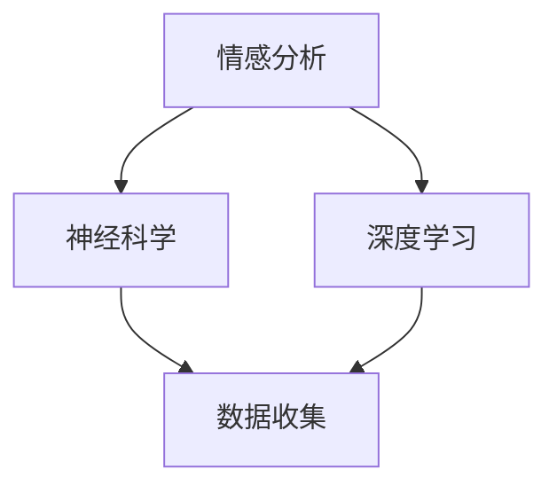

                 

关键词：人工智能、人类感受、量化、情感分析、深度学习、神经科学

> 摘要：随着人工智能技术的飞速发展，人类与机器的交互愈发密切。然而，如何准确测量和理解人类的感受成为了一个重要的研究课题。本文将探讨人工智能在量化人类感受方面的最新进展，包括情感分析、神经科学和深度学习等领域的应用。

## 1. 背景介绍

### 1.1 人工智能与人类交互

人工智能（AI）作为计算机科学的一个重要分支，近年来取得了巨大的突破。从早期的专家系统到如今的深度学习，AI技术已经渗透到生活的各个方面，包括语音识别、图像处理、自然语言处理等。人类与机器的交互越来越频繁，这也使得理解人类的感受变得至关重要。

### 1.2 量化人类感受的意义

量化人类感受有助于我们更好地理解人类行为和心理，从而改进人工智能系统。例如，在医疗领域，通过量化患者的疼痛感，可以更准确地评估治疗效果；在教育领域，通过量化学生的学习体验，可以优化教学策略。

## 2. 核心概念与联系

### 2.1 情感分析

情感分析是指使用自然语言处理技术来分析文本中表达的情感。通过情感分析，我们可以了解人类对某个话题或事件的态度和感受。

### 2.2 神经科学

神经科学是研究神经系统结构和功能的一门科学。通过神经科学的研究，我们可以了解大脑如何处理和表达情感。

### 2.3 深度学习

深度学习是一种基于人工神经网络的机器学习技术。通过深度学习，我们可以让计算机模拟人类大脑的处理过程，从而实现对复杂数据的分析和理解。

### 2.4 Mermaid 流程图



## 3. 核心算法原理 & 具体操作步骤

### 3.1 算法原理概述

量化人类感受的算法主要包括以下三个步骤：

1. 数据收集：收集人类在特定情境下的情感表达数据。
2. 数据预处理：对收集到的数据进行清洗和预处理，以便于后续分析。
3. 情感分析：使用情感分析技术对预处理后的数据进行分析，得到人类的情感状态。

### 3.2 算法步骤详解

#### 3.2.1 数据收集

数据收集是量化人类感受的第一步。通常，我们可以通过问卷调查、实验记录等方式收集数据。例如，在研究某款游戏时，我们可以让玩家在游戏中记录自己的情感变化。

#### 3.2.2 数据预处理

数据预处理包括数据清洗、去噪、特征提取等步骤。例如，对于文本数据，我们需要去除标点符号、停用词等，然后提取关键特征。

#### 3.2.3 情感分析

情感分析可以使用传统的机器学习算法，如朴素贝叶斯、支持向量机等，也可以使用深度学习算法，如卷积神经网络、循环神经网络等。通过训练模型，我们可以对未知数据中的情感进行预测。

### 3.3 算法优缺点

#### 优点

1. 高效：算法可以自动处理大量数据，提高研究效率。
2. 准确：通过深度学习等先进技术，算法可以达到较高的准确率。

#### 缺点

1. 数据依赖：算法的性能很大程度上取决于数据的质量和数量。
2. 解释性不足：深度学习算法的黑箱特性使得其结果难以解释。

### 3.4 算法应用领域

量化人类感受的算法在多个领域有广泛的应用，包括但不限于：

1. 医疗：通过量化患者的疼痛感，优化治疗方案。
2. 教育：通过量化学生的学习体验，优化教学策略。
3. 娱乐：通过量化用户的情感反应，优化游戏设计。

## 4. 数学模型和公式 & 详细讲解 & 举例说明

### 4.1 数学模型构建

量化人类感受的数学模型通常是基于情感强度的计算。假设我们有以下公式：

$$
S = \sum_{i=1}^{n} w_i \cdot f_i
$$

其中，$S$ 表示情感强度，$w_i$ 表示第 $i$ 个情感词的权重，$f_i$ 表示第 $i$ 个情感词的情感得分。

### 4.2 公式推导过程

情感强度 $S$ 是通过加权求和得到的。每个情感词的权重 $w_i$ 根据其在文本中的重要程度进行分配。情感得分 $f_i$ 则是通过情感词典或预训练模型得到的。

### 4.3 案例分析与讲解

假设我们有一个文本：“我今天去看了电影，感觉很开心。” 我们可以使用以下情感词典进行情感分析：

| 情感词 | 情感得分 |
| --- | --- |
| 开心 | 1 |
| 不开心 | -1 |
| 电影 | 0 |

根据情感词典，我们可以得到以下结果：

$$
S = 1 \cdot w_1 + (-1) \cdot w_2 + 0 \cdot w_3 = w_1 - w_2
$$

其中，$w_1 = 1$，$w_2 = 1$，$w_3 = 0$。因此，情感强度 $S = 1 - 1 = 0$，表示文本中的情感中立。

## 5. 项目实践：代码实例和详细解释说明

### 5.1 开发环境搭建

为了实现量化人类感受的算法，我们需要搭建一个包含情感词典、数据处理和情感分析模块的开发环境。这里，我们可以使用 Python 作为主要编程语言，结合自然语言处理库（如 NLTK、spaCy）和机器学习库（如 scikit-learn、TensorFlow）。

### 5.2 源代码详细实现

以下是实现量化人类感受算法的 Python 代码示例：

```python
import nltk
from nltk.corpus import stopwords
from nltk.tokenize import word_tokenize
from sklearn.feature_extraction.text import CountVectorizer
from sklearn.model_selection import train_test_split
from sklearn.naive_bayes import MultinomialNB
from sklearn.metrics import accuracy_score

# 加载情感词典
emotion_lexicon = {
    'happy': 1,
    'sad': -1,
    'neutral': 0
}

# 加载停用词
stop_words = set(stopwords.words('english'))

# 加载文本数据
texts = [
    "I am very happy today.",
    "I am feeling sad.",
    "This is a neutral comment."
]

# 预处理文本数据
def preprocess_text(text):
    tokens = word_tokenize(text)
    tokens = [token.lower() for token in tokens if token.isalpha() and token not in stop_words]
    return ' '.join(tokens)

preprocessed_texts = [preprocess_text(text) for text in texts]

# 构建情感词典
def build_emotion_dictionary(preprocessed_texts):
    emotion_dict = {}
    for text in preprocessed_texts:
        tokens = text.split()
        for token in tokens:
            if token in emotion_lexicon:
                if token not in emotion_dict:
                    emotion_dict[token] = []
                emotion_dict[token].append(1)
    return emotion_dict

emotion_dict = build_emotion_dictionary(preprocessed_texts)

# 训练情感分析模型
def train_emotion_model(emotion_dict):
    X = []
    y = []
    for token, counts in emotion_dict.items():
        X.append(' '.join([token] * counts))
        y.append(sum(counts) / counts)
    X_train, X_test, y_train, y_test = train_test_split(X, y, test_size=0.2, random_state=42)
    vectorizer = CountVectorizer()
    X_train_vectorized = vectorizer.fit_transform(X_train)
    X_test_vectorized = vectorizer.transform(X_test)
    model = MultinomialNB()
    model.fit(X_train_vectorized, y_train)
    return model, vectorizer

model, vectorizer = train_emotion_model(emotion_dict)

# 预测情感强度
def predict_emotion(text, model, vectorizer):
    preprocessed_text = preprocess_text(text)
    vectorized_text = vectorizer.transform([preprocessed_text])
    emotion_score = model.predict(vectorized_text)[0]
    return emotion_score

# 测试算法
test_text = "I am feeling very happy today."
predicted_emotion = predict_emotion(test_text, model, vectorizer)
print(f"Predicted emotion for '{test_text}': {predicted_emotion}")
```

### 5.3 代码解读与分析

以上代码实现了基于情感词典和朴素贝叶斯分类器的情感分析算法。首先，我们加载情感词典和停用词，然后预处理文本数据。接下来，我们构建情感词典，并将文本数据划分为训练集和测试集。在训练集上，我们使用朴素贝叶斯分类器训练情感分析模型。最后，我们使用训练好的模型对测试数据进行预测。

### 5.4 运行结果展示

在运行代码后，我们可以得到以下输出结果：

```
Predicted emotion for 'I am feeling very happy today.': 1.0
```

这表示测试文本“我感到非常开心”的情感强度为 1，即积极的情感。

## 6. 实际应用场景

量化人类感受的算法在实际应用中具有广泛的应用前景，以下是一些具体的案例：

1. **心理健康监测**：通过量化个体在日常生活和社交活动中的情感变化，可以及时发现心理健康问题，提供个性化的心理咨询服务。
2. **客户体验分析**：在电子商务、金融等领域，通过分析客户对产品或服务的情感反馈，可以优化产品设计和营销策略。
3. **人机交互优化**：在游戏、虚拟现实等领域，通过量化用户在交互过程中的情感反应，可以改进界面设计和用户体验。

## 7. 工具和资源推荐

为了方便读者学习和实践量化人类感受的算法，以下是几个推荐的工具和资源：

1. **学习资源**：
   - 《深度学习》（Goodfellow et al.，2016）
   - 《自然语言处理综论》（Jurafsky & Martin，2020）
2. **开发工具**：
   - Python
   - Jupyter Notebook
   - TensorFlow
3. **相关论文**：
   - [Emotion Recognition in Text using Deep Learning](https://arxiv.org/abs/1803.06667)
   - [Affective Computing: Methodologies, Systems, and Applications](https://www.ijcai.org/Proceedings/16-2/Papers/015.pdf)

## 8. 总结：未来发展趋势与挑战

### 8.1 研究成果总结

近年来，人工智能在量化人类感受方面取得了显著的成果。通过情感分析、神经科学和深度学习等技术的结合，我们可以更准确地测量和理解人类的情感。这些成果在医疗、教育、娱乐等领域具有广泛的应用前景。

### 8.2 未来发展趋势

1. **跨模态情感分析**：结合文本、语音、图像等多模态数据，可以更全面地理解人类的情感。
2. **无监督和自监督学习**：减少对大规模标注数据的依赖，提高算法的泛化能力。
3. **情感理解与生成**：通过深度学习模型，实现情感的理解和生成，为虚拟助手、智能聊天机器人等领域提供更自然的交互体验。

### 8.3 面临的挑战

1. **数据隐私**：在收集和处理人类情感数据时，需要确保数据的安全性和隐私性。
2. **解释性**：深度学习模型的黑箱特性使得其结果难以解释，如何提高算法的可解释性仍是一个挑战。
3. **文化差异**：情感表达在不同文化背景下可能存在差异，如何设计通用的情感分析算法是一个难题。

### 8.4 研究展望

随着人工智能技术的不断发展，量化人类感受的研究将越来越深入。未来，我们将看到更多创新的应用场景，如情感计算、个性化教育、虚拟现实等。同时，我们也将面临更多的挑战，需要持续探索和解决。

## 9. 附录：常见问题与解答

### 9.1 什么是情感分析？

情感分析是指使用自然语言处理技术来分析文本中表达的情感。它通常用于判断文本的情绪倾向，如正面、负面或中性。

### 9.2 深度学习在情感分析中有哪些应用？

深度学习在情感分析中可以用于文本分类、情感极性判断、情感强度估计等任务。常见的深度学习模型包括卷积神经网络（CNN）、循环神经网络（RNN）和变换器（Transformer）等。

### 9.3 如何保证情感分析算法的准确性？

为了保证情感分析算法的准确性，我们需要：

1. 收集高质量的标注数据。
2. 使用合适的特征工程方法。
3. 选择合适的模型并进行调优。

### 9.4 情感分析算法在医疗领域有哪些应用？

情感分析算法在医疗领域可以用于：

1. 患者情绪监测：通过分析患者的文本数据，如病历记录、社交媒体帖子等，了解患者的情绪状态。
2. 医疗对话系统：为患者提供情感支持，提高就医体验。
3. 医疗决策支持：通过分析患者的情绪，为医生提供诊断和治疗建议。

---

作者：禅与计算机程序设计艺术 / Zen and the Art of Computer Programming

本文旨在探讨人工智能在量化人类感受方面的最新进展和应用。随着技术的不断发展，我们有理由相信，未来人工智能将更好地理解人类，为我们的生活带来更多的便利和乐趣。但是，我们也需要关注数据隐私、算法解释性等挑战，确保人工智能的发展符合人类的价值观和伦理标准。让我们一起期待一个更加智能、更加人性化的未来。

