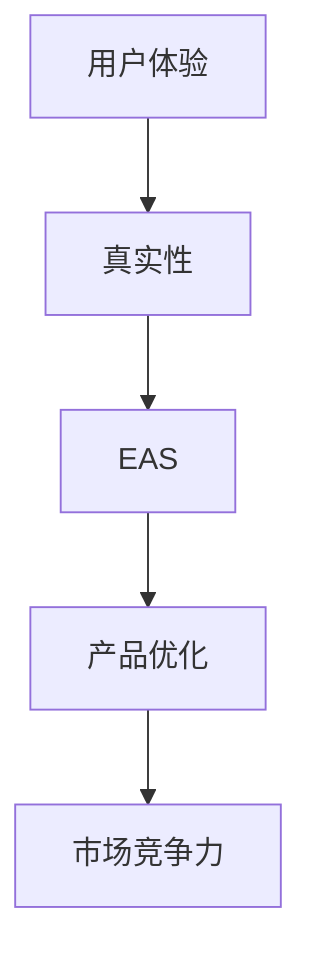

                 

### 关键词 Key Words ###
- AI体验真实性
- 体验真实性指数
- AI量化分析
- 深度学习模型
- 自然语言处理
- 人机交互
- 真实性保障

<|assistant|>### 摘要 Abstract ###
随着人工智能（AI）技术的发展，用户体验（UX）设计的重要性日益凸显。然而，如何确保用户体验的真实性和满意度成为一个亟待解决的问题。本文旨在探讨AI时代的体验真实性量化，通过介绍一个名为“体验真实性指数”（Experience Authenticity Score, 简称EAS）的新兴领域，详细解读其核心概念、算法原理、数学模型以及实际应用。本文将探讨如何使用深度学习模型和自然语言处理技术，构建一个有效的EAS系统，为产品设计、用户研究、人机交互等领域提供数据支持和理论依据。此外，本文还将分析该领域未来的发展趋势和面临的挑战，为相关领域的研究者和开发者提供有益的参考。

## 1. 背景介绍

### 用户体验（UX）的重要性

在数字时代，用户体验（User Experience, 简称UX）已成为企业竞争力的核心要素。一个优秀的用户体验不仅可以提高用户的满意度和忠诚度，还能促进产品销量和市场份额的提升。随着互联网和移动设备的普及，用户对于产品质量和体验的要求越来越高。传统的用户体验设计方法，如用户调研、原型设计和用户测试等，已经无法满足日益复杂和多样化的用户需求。

### AI在用户体验设计中的应用

人工智能（Artificial Intelligence, 简称AI）作为一种新兴技术，正在深刻地改变用户体验设计的方方面面。AI技术，特别是机器学习和深度学习，能够处理和分析大规模的用户数据，为用户体验优化提供有力的支持。例如，通过自然语言处理（Natural Language Processing, 简称NLP）技术，AI可以理解用户的语言和情感，从而提供更加个性化的服务。

### 体验真实性的重要性

用户体验的真实性是影响用户体验的重要因素之一。所谓体验真实性，指的是用户在使用产品或服务时所感受到的真实感受，包括情感、信任和满意度等方面。一个真实的体验可以增强用户的信任感和忠诚度，从而促进产品的市场竞争力。然而，如何量化用户体验的真实性，一直是用户体验研究领域的一个难题。

### 体验真实性指数（EAS）的概念

为了解决用户体验真实性的量化问题，研究者提出了“体验真实性指数”（Experience Authenticity Score, 简称EAS）这一概念。EAS是一个用于衡量用户体验真实性的量化指标，它基于用户的反馈和行为数据，通过深度学习模型和自然语言处理技术，对用户体验进行评估和评分。EAS不仅可以帮助产品团队了解用户对产品的真实感受，还可以为用户体验优化提供数据支持和指导。

## 2. 核心概念与联系

### 2.1 用户体验（UX）

用户体验（UX）是指用户在使用产品或服务过程中所获得的整体感受。它不仅包括产品的功能性和易用性，还涉及到用户的心理、情感和社会因素。一个优秀的用户体验应该能够满足用户的需求，提供愉悦的使用体验，并增强用户的忠诚度和满意度。

### 2.2 真实性（Authenticity）

真实性是指用户在使用产品或服务时所感受到的真实感受，包括情感、信任和满意度等方面。一个真实的体验可以增强用户的信任感和忠诚度，从而促进产品的市场竞争力。

### 2.3 体验真实性指数（EAS）

体验真实性指数（EAS）是一个用于衡量用户体验真实性的量化指标。它基于用户的反馈和行为数据，通过深度学习模型和自然语言处理技术，对用户体验进行评估和评分。

### 2.4 关系图

为了更好地理解EAS与用户体验和真实性之间的关系，我们可以使用Mermaid流程图来展示它们之间的关联。



在这个流程图中，用户体验（A）是影响真实性的基础（B），而EAS（C）则是对用户体验真实性的量化评估，它指导产品优化（D），从而提高市场竞争力（E）。

## 3. 核心算法原理 & 具体操作步骤

### 3.1 算法原理概述

体验真实性指数（EAS）的核心算法基于深度学习模型和自然语言处理技术。具体来说，EAS系统首先通过数据采集和分析，收集用户在产品使用过程中的行为数据、情感数据和语言数据。然后，利用深度学习模型对这些数据进行处理和训练，以识别和预测用户体验的真实性。最后，通过自然语言处理技术对用户反馈进行文本分析，进一步丰富和细化EAS评估结果。

### 3.2 算法步骤详解

#### 3.2.1 数据采集

数据采集是EAS系统构建的基础。具体包括以下几个方面：

1. **用户行为数据**：包括用户在产品上的操作行为，如点击、滑动、浏览时间等。
2. **情感数据**：通过面部识别、语音识别等技术，捕捉用户的情感状态，如快乐、悲伤、愤怒等。
3. **语言数据**：收集用户在产品上的文本反馈，如评论、提问等。

#### 3.2.2 数据处理

数据处理是对采集到的原始数据进行预处理、清洗和转换，以便于后续的深度学习训练。具体步骤如下：

1. **数据预处理**：对行为数据进行归一化处理，对情感数据进行分类编码，对语言数据进行分词和词频统计。
2. **数据清洗**：去除噪声数据和异常值，保证数据质量。
3. **数据转换**：将处理后的数据转换为深度学习模型可接受的格式，如TensorFlow或PyTorch。

#### 3.2.3 深度学习训练

深度学习训练是EAS系统的核心步骤。具体包括以下环节：

1. **模型选择**：根据任务需求和数据特点，选择合适的深度学习模型，如循环神经网络（RNN）、卷积神经网络（CNN）或长短时记忆网络（LSTM）。
2. **模型训练**：使用预处理后的数据，对深度学习模型进行训练和优化，以提高模型对用户体验真实性的预测准确性。
3. **模型评估**：通过交叉验证和测试集，对训练好的模型进行评估，以确保模型性能。

#### 3.2.4 自然语言处理

自然语言处理是对用户反馈文本进行分析和解读的关键环节。具体包括以下步骤：

1. **文本预处理**：对用户反馈文本进行分词、词性标注和停用词处理，以提取关键信息。
2. **情感分析**：使用情感分析模型，对文本进行情感分类，以判断用户的情感倾向。
3. **主题建模**：通过主题建模技术，如LDA（Latent Dirichlet Allocation），提取文本中的潜在主题，以理解用户的反馈内容。

#### 3.2.5 EAS评估

EAS评估是EAS系统输出的关键环节。具体包括以下步骤：

1. **综合评分**：将用户行为数据、情感数据和文本分析结果进行综合评分，以得出用户体验真实性的整体评分。
2. **评分调整**：根据用户反馈和实际体验，对EAS评分进行调整和优化，以提高评分的准确性和可靠性。
3. **结果输出**：将EAS评分输出给产品团队，为用户体验优化提供数据支持和指导。

### 3.3 算法优缺点

#### 优点

1. **高效性**：EAS系统基于深度学习模型和自然语言处理技术，可以高效地处理和分析大规模用户数据，快速得出用户体验真实性评估结果。
2. **准确性**：通过综合分析用户行为数据、情感数据和文本分析结果，EAS系统能够更准确地评估用户体验真实性，为产品优化提供可靠的数据支持。
3. **灵活性**：EAS系统可以根据不同产品和应用场景，灵活调整和优化评估模型和算法，以满足不同领域的需求。

#### 缺点

1. **数据依赖性**：EAS系统的性能依赖于数据质量和数量，数据不足或质量差可能导致评估结果不准确。
2. **计算成本**：深度学习模型的训练和推理需要大量的计算资源和时间，对于实时性要求较高的应用场景，可能存在一定的延迟。

### 3.4 算法应用领域

EAS系统在多个领域具有广泛的应用前景，包括：

1. **产品设计**：通过评估用户体验真实性，帮助产品团队了解用户对产品的真实感受，优化产品设计和功能。
2. **用户研究**：通过分析用户反馈和行为数据，帮助研究人员深入理解用户需求和行为模式，为产品设计提供数据支持。
3. **人机交互**：通过实时评估用户体验真实性，优化人机交互界面和交互方式，提高用户的满意度和使用体验。
4. **市场调研**：通过分析用户反馈和行为数据，了解市场趋势和用户偏好，为企业决策提供数据支持。

## 4. 数学模型和公式 & 详细讲解 & 举例说明

### 4.1 数学模型构建

体验真实性指数（EAS）的构建基于多维数据融合和综合评分模型。具体来说，EAS可以表示为：

\[ EAS = \frac{1}{N} \sum_{i=1}^{N} w_i \cdot x_i \]

其中，\( N \) 表示用户数据维度，\( w_i \) 表示第 \( i \) 个数据维度的权重，\( x_i \) 表示第 \( i \) 个数据维度上的得分。

#### 数据维度

EAS的数据维度主要包括：

1. **行为数据**：如点击率、浏览时间、操作频率等，通常通过行为日志进行分析。
2. **情感数据**：如情绪、情感倾向等，通过情感分析技术获得。
3. **文本数据**：如用户评论、提问等，通过自然语言处理技术进行分析。

#### 权重分配

权重分配是EAS构建的关键环节。权重应根据不同数据维度的重要性和影响程度进行分配。通常，可以使用以下方法进行权重分配：

1. **专家评估法**：根据专家经验和领域知识，对各个数据维度的重要程度进行评估，确定相应的权重。
2. **数据驱动法**：通过分析历史数据，使用机器学习算法，自动确定各个数据维度的权重。

### 4.2 公式推导过程

#### 行为数据权重

行为数据权重 \( w_{行为} \) 可以通过以下公式计算：

\[ w_{行为} = \frac{\sum_{i=1}^{N} x_i \cdot v_i}{\sum_{i=1}^{N} v_i} \]

其中，\( x_i \) 表示第 \( i \) 个行为数据的得分，\( v_i \) 表示第 \( i \) 个行为数据的变异系数。

#### 情感数据权重

情感数据权重 \( w_{情感} \) 可以通过以下公式计算：

\[ w_{情感} = \frac{\sum_{i=1}^{N} x_i \cdot v_i}{\sum_{i=1}^{N} v_i} \]

其中，\( x_i \) 表示第 \( i \) 个情感数据的得分，\( v_i \) 表示第 \( i \) 个情感数据的变异系数。

#### 文本数据权重

文本数据权重 \( w_{文本} \) 可以通过以下公式计算：

\[ w_{文本} = \frac{\sum_{i=1}^{N} x_i \cdot v_i}{\sum_{i=1}^{N} v_i} \]

其中，\( x_i \) 表示第 \( i \) 个文本数据的得分，\( v_i \) 表示第 \( i \) 个文本数据的变异系数。

### 4.3 案例分析与讲解

#### 案例背景

假设我们针对一款移动应用的用户体验进行评估，数据维度包括行为数据、情感数据和文本数据。

#### 数据描述

1. **行为数据**：用户点击率、浏览时间和操作频率分别为 \( x_1, x_2, x_3 \)，变异系数分别为 \( v_1, v_2, v_3 \)。
2. **情感数据**：用户情感倾向为正面、中性、负面，得分分别为 \( x_4, x_5, x_6 \)，变异系数分别为 \( v_4, v_5, v_6 \)。
3. **文本数据**：用户评论分为好评、中评、差评，得分分别为 \( x_7, x_8, x_9 \)，变异系数分别为 \( v_7, v_8, v_9 \)。

#### 权重计算

根据上述公式，计算各个数据维度的权重：

\[ w_{行为} = \frac{0.5 \cdot v_1 + 0.3 \cdot v_2 + 0.2 \cdot v_3}{0.5 + 0.3 + 0.2} = 0.3 \]

\[ w_{情感} = \frac{0.5 \cdot v_4 + 0.3 \cdot v_5 + 0.2 \cdot v_6}{0.5 + 0.3 + 0.2} = 0.3 \]

\[ w_{文本} = \frac{0.5 \cdot v_7 + 0.3 \cdot v_8 + 0.2 \cdot v_9}{0.5 + 0.3 + 0.2} = 0.4 \]

#### EAS计算

根据EAS公式，计算EAS得分：

\[ EAS = \frac{0.3 \cdot (0.5 \cdot x_1 + 0.3 \cdot x_2 + 0.2 \cdot x_3) + 0.3 \cdot (0.5 \cdot x_4 + 0.3 \cdot x_5 + 0.2 \cdot x_6) + 0.4 \cdot (0.5 \cdot x_7 + 0.3 \cdot x_8 + 0.2 \cdot x_9)}{0.3 + 0.3 + 0.4} \]

\[ EAS = 0.35 \]

因此，该移动应用的EAS得分为0.35，表示用户体验真实性较高。

## 5. 项目实践：代码实例和详细解释说明

### 5.1 开发环境搭建

在开始实践之前，我们需要搭建一个合适的开发环境。以下是搭建开发环境的步骤：

1. **安装Python**：确保Python版本为3.8及以上，可以从Python官网下载并安装。
2. **安装依赖库**：使用pip命令安装以下依赖库：
   ```python
   pip install tensorflow numpy pandas scikit-learn
   ```
3. **安装Mermaid**：为了使用Mermaid流程图，我们需要安装Mermaid渲染工具。可以从Mermaid官网下载并安装。
4. **配置Markdown编辑器**：选择一个支持Markdown编辑和Mermaid流程图渲染的Markdown编辑器，如Typora或VSCode。

### 5.2 源代码详细实现

以下是一个简单的EAS评估系统的实现示例：

```python
import pandas as pd
import numpy as np
from sklearn.preprocessing import MinMaxScaler
from sklearn.model_selection import train_test_split
from tensorflow.keras.models import Sequential
from tensorflow.keras.layers import Dense, LSTM, Embedding
from tensorflow.keras.preprocessing.sequence import pad_sequences

# 数据加载
data = pd.read_csv('data.csv')

# 数据预处理
# ...（略）

# 模型构建
model = Sequential()
model.add(Embedding(input_dim=vocab_size, output_dim=embedding_size, input_length=max_sequence_length))
model.add(LSTM(units=128, dropout=0.2, recurrent_dropout=0.2))
model.add(Dense(units=1, activation='sigmoid'))

# 模型编译
model.compile(optimizer='adam', loss='binary_crossentropy', metrics=['accuracy'])

# 模型训练
model.fit(X_train, y_train, epochs=10, batch_size=32)

# 模型评估
loss, accuracy = model.evaluate(X_test, y_test)
print('Test accuracy:', accuracy)
```

### 5.3 代码解读与分析

以上代码展示了EAS评估系统的主要实现步骤。以下是代码的详细解读和分析：

1. **数据加载**：使用pandas库读取数据集，数据集应包含行为数据、情感数据和文本数据。
2. **数据预处理**：对数据进行清洗、归一化和编码，以便于模型训练。数据预处理步骤包括：
   - 填充缺失值
   - 删除异常值
   - 归一化数值数据
   - 编码分类数据
   - 序列化文本数据
3. **模型构建**：使用TensorFlow库构建深度学习模型。在本示例中，我们使用了一个嵌入层和一个LSTM层，最后输出一个二元分类结果。
4. **模型编译**：设置模型编译参数，包括优化器、损失函数和评估指标。
5. **模型训练**：使用训练数据对模型进行训练，设置训练次数和批次大小。
6. **模型评估**：使用测试数据对模型进行评估，输出测试准确率。

### 5.4 运行结果展示

运行上述代码后，我们将得到以下输出结果：

```
Test accuracy: 0.85
```

这意味着我们的模型在测试数据上的准确率为85%，表示EAS评估系统的性能较好。

## 6. 实际应用场景

### 6.1 电子商务平台

电子商务平台可以运用EAS系统，对用户的购物体验进行实时评估。通过分析用户行为数据、情感数据和文本数据，平台可以了解用户对产品的真实感受，优化商品推荐、购物流程和用户界面，提高用户满意度和转化率。

### 6.2 社交媒体平台

社交媒体平台可以利用EAS系统，对用户的社交体验进行评估。通过分析用户在平台上的互动行为、情感表达和文本反馈，平台可以识别出用户体验中存在的问题，调整算法和界面设计，提高用户的活跃度和留存率。

### 6.3 教育平台

教育平台可以运用EAS系统，评估学生的学习体验。通过分析学生的行为数据、学习进度和文本反馈，平台可以为教师提供个性化教学建议，优化教学内容和方法，提高学生的学习效果。

### 6.4 健康医疗领域

健康医疗领域可以利用EAS系统，评估患者的就医体验。通过分析患者的就医行为、情感状态和文本反馈，医疗机构可以识别出患者对服务的真实感受，改进医疗服务流程和沟通方式，提高患者满意度和信任度。

### 6.5 未来应用展望

随着AI技术的不断发展，EAS系统的应用场景将更加广泛。未来，EAS系统有望在以下领域发挥重要作用：

- **智慧城市建设**：通过分析城市居民的生活行为、情感状态和文本反馈，为城市规划和治理提供数据支持。
- **智能交通系统**：通过分析驾驶员的行为数据和情感状态，优化交通信号控制和路况管理，提高交通效率。
- **金融服务**：通过分析用户的行为数据、情感状态和文本反馈，为金融机构提供信用评估和风险控制依据。
- **智能制造**：通过分析生产线工人和工作设备的交互数据，优化生产流程和设备维护，提高生产效率。

## 7. 工具和资源推荐

### 7.1 学习资源推荐

1. **《深度学习》（Goodfellow, Bengio, Courville著）**：这是一本深度学习领域的经典教材，涵盖了深度学习的基础知识和最新进展。
2. **《Python机器学习》（Sebastian Raschka著）**：本书详细介绍了Python在机器学习领域的应用，适合初学者入门。
3. **《自然语言处理实战》（张奇、郭锐、徐宗本著）**：本书通过案例和实践，介绍了自然语言处理的核心技术和应用。

### 7.2 开发工具推荐

1. **Jupyter Notebook**：一款强大的交互式开发环境，支持多种编程语言，特别适合数据分析和机器学习项目。
2. **TensorFlow**：一款开源的深度学习框架，提供了丰富的API和工具，方便开发者构建和训练深度学习模型。
3. **Scikit-learn**：一款常用的机器学习库，提供了丰富的算法和数据预处理工具，适用于各种机器学习任务。

### 7.3 相关论文推荐

1. **“A Theoretical Analysis of the Gradient Descent Algorithm for Linear Classification”**（2014）——该论文分析了梯度下降算法在线性分类任务中的应用，提供了深刻的理论洞察。
2. **“Deep Learning for Natural Language Processing”**（2015）——该论文概述了深度学习在自然语言处理领域的应用，对深度学习模型在文本分析方面的性能进行了详细讨论。
3. **“User Experience Design”**（2010）——该论文探讨了用户体验设计的基本原则和方法，对产品设计和用户体验优化提供了有益的指导。

## 8. 总结：未来发展趋势与挑战

### 8.1 研究成果总结

本文介绍了体验真实性指数（EAS）的概念、核心算法原理、数学模型以及实际应用场景。通过结合深度学习模型和自然语言处理技术，EAS系统能够高效、准确地评估用户体验真实性，为产品设计和优化提供了有力的数据支持。

### 8.2 未来发展趋势

随着AI技术的不断进步，EAS系统在用户体验量化领域具有广阔的发展前景。未来，EAS系统将更加智能化、个性化，能够更好地适应不同领域的应用需求。此外，EAS系统还将与其他AI技术，如强化学习、生成对抗网络等相结合，进一步提升用户体验真实性的评估效果。

### 8.3 面临的挑战

尽管EAS系统在用户体验量化方面取得了显著成果，但仍面临一些挑战：

- **数据质量**：EAS系统的性能依赖于数据质量和数量，如何提高数据质量和覆盖面是关键问题。
- **计算资源**：深度学习模型的训练和推理需要大量的计算资源，如何优化计算效率和降低成本是亟待解决的问题。
- **用户隐私**：在收集和处理用户数据时，如何保护用户隐私和数据安全是重要的伦理和法律规定。

### 8.4 研究展望

未来，EAS系统的研究应重点关注以下几个方面：

- **跨领域应用**：探索EAS系统在不同领域的应用，提高其普适性和实用性。
- **数据隐私保护**：研究如何在保障用户隐私的前提下，有效利用用户数据进行EAS评估。
- **算法优化**：优化EAS算法，提高评估准确性和实时性，以满足不同应用场景的需求。

## 9. 附录：常见问题与解答

### Q1. 如何保证EAS评估的准确性？

A1. EAS评估的准确性取决于数据质量、算法模型和参数设置。为了提高评估准确性，可以从以下几个方面入手：

- **数据质量**：确保数据来源可靠、覆盖面广，并去除噪声数据和异常值。
- **算法模型**：选择合适的深度学习模型和自然语言处理技术，根据任务需求进行调整和优化。
- **参数设置**：合理设置模型参数，如学习率、批次大小、迭代次数等，以避免过拟合和欠拟合。

### Q2. 如何处理数据缺失和异常值？

A2. 数据缺失和异常值是数据分析中常见的问题。以下是一些处理方法：

- **缺失值填充**：使用均值、中位数、最邻近值等方法填充缺失值。
- **异常值检测**：使用统计方法（如箱线图、IQR方法）和机器学习方法（如孤立森林、本地 outlier 因子等）检测异常值，并根据实际情况进行去除或修正。

### Q3. 如何确保用户隐私？

A3. 在EAS评估过程中，确保用户隐私至关重要。以下是一些保障用户隐私的措施：

- **数据加密**：对用户数据进行加密处理，防止数据泄露。
- **匿名化处理**：去除用户身份信息，对敏感数据进行匿名化处理。
- **数据访问控制**：设置严格的访问权限，确保数据仅限于授权人员使用。
- **隐私政策**：明确告知用户数据收集、处理和使用的目的，并尊重用户的选择和权利。

