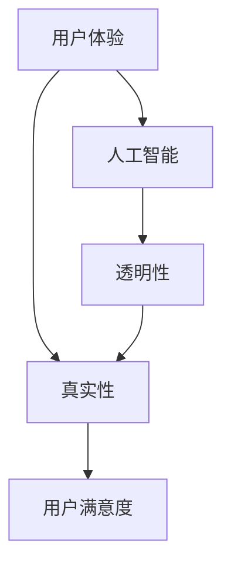

                 

关键词：体验真实性、AI、量化、用户体验、真实性测量、人工智能伦理

摘要：随着人工智能（AI）技术的迅猛发展，用户体验（UX）的设计和优化变得愈发重要。本文旨在探讨在AI时代如何量化用户体验中的真实性（authenticity），以及这一量化过程对产品设计和用户满意度的影响。通过分析相关理论和实际应用案例，文章将揭示当前在测量真实性方面面临的挑战和未来可能的解决方案。

## 1. 背景介绍

用户体验是衡量软件和系统成功与否的关键因素。在过去，用户体验的关注点主要集中在界面的友好性、响应速度和功能丰富性上。然而，随着人工智能技术的融入，用户体验的内涵得到了扩展。在AI时代，用户不仅期望系统具有高效和智能的特性，还期望系统能够提供一个真实、可信、有温度的交互体验。因此，体验真实性（Experience Authenticity）成为了新的研究热点。

### 什么是体验真实性？

体验真实性指的是用户在交互过程中感受到的真实感和可信度。一个真实性的用户体验不仅能准确满足用户的需求，还能让用户感到舒适、安心，并建立起对系统的信任。在AI时代，体验真实性尤为重要，因为AI系统通常涉及大量数据处理和智能决策，这些过程如果缺乏透明性和可信度，容易导致用户焦虑和反感。

### 用户体验与真实性的关系

用户体验和真实性之间存在紧密的联系。一方面，真实性的体验可以增强用户的满意度和忠诚度。例如，一个具有高度真实性的推荐系统可以更好地满足用户的个性化需求，从而提高用户的满意度和使用频率。另一方面，缺乏真实性的体验会导致用户对系统的不信任，从而影响用户体验的整体质量。

## 2. 核心概念与联系

为了更好地理解体验真实性，我们需要引入一些相关的核心概念，并通过Mermaid流程图展示它们之间的联系。

### 2.1 关键概念

- **用户体验（UX）**：用户在使用产品或服务过程中形成的整体感受。
- **真实性（Authenticity）**：用户在体验中感受到的真实感和可信度。
- **人工智能（AI）**：模拟人类智能行为的计算系统。
- **透明性（Transparency）**：系统运作过程对用户是可见的，用户可以理解系统的决策逻辑。

### 2.2 Mermaid 流程图

下面是一个简单的Mermaid流程图，展示了上述概念之间的联系。



### 2.3 概念解析

- **用户体验**：用户体验是用户在使用产品或服务过程中的主观感受，包括情感、认知和行为等方面。
- **真实性**：真实性是用户体验的一个重要组成部分，它影响用户对系统的信任和满意度。
- **人工智能**：人工智能系统通过机器学习、自然语言处理等技术为用户提供智能服务。
- **透明性**：透明性是指系统运作过程对用户的可见性和可理解性，有助于提高用户体验的真实性。

## 3. 核心算法原理 & 具体操作步骤

### 3.1 算法原理概述

在量化体验真实性方面，我们采用了一种基于用户行为和反馈的算法。该算法的核心思想是通过分析用户在交互过程中的行为数据，评估用户对系统的真实感受。

### 3.2 算法步骤详解

#### 3.2.1 数据收集

首先，我们需要收集用户在使用AI系统过程中的行为数据，包括点击记录、浏览时间、操作频率等。

#### 3.2.2 数据预处理

对收集到的数据进行清洗和预处理，包括去除无效数据、填充缺失值、标准化等步骤。

#### 3.2.3 特征提取

从预处理后的数据中提取与用户体验真实性相关的特征，如用户满意度评分、操作流畅度等。

#### 3.2.4 模型训练

使用机器学习算法，如决策树、支持向量机等，训练一个分类模型，用于预测用户对系统的真实感受。

#### 3.2.5 模型评估

通过交叉验证等方法评估模型性能，包括准确性、召回率、F1值等指标。

#### 3.2.6 预测与反馈

使用训练好的模型对新的用户数据进行分析，预测用户的真实感受，并根据预测结果提供个性化的反馈。

### 3.3 算法优缺点

#### 优点

- **自适应性强**：算法可以根据用户行为动态调整，提高预测的准确性。
- **实时性**：算法可以实时分析用户行为，快速提供反馈。

#### 缺点

- **数据依赖性**：算法性能依赖于数据的质量和数量，数据缺失或错误可能导致预测不准确。
- **复杂度**：算法的实现和优化过程相对复杂。

### 3.4 算法应用领域

该算法可以应用于多种场景，如智能推荐系统、虚拟客服、智能交互界面等。在这些场景中，量化体验真实性有助于提高用户满意度，优化产品设计。

## 4. 数学模型和公式 & 详细讲解 & 举例说明

### 4.1 数学模型构建

为了量化体验真实性，我们可以构建一个基于贝叶斯理论的数学模型。该模型通过以下公式表示：

$$
P(A|B) = \frac{P(B|A) \cdot P(A)}{P(B)}
$$

其中，$P(A|B)$ 表示在给定背景 $B$ 的情况下，事件 $A$ 发生的概率；$P(B|A)$ 表示在事件 $A$ 发生的情况下，背景 $B$ 发生的概率；$P(A)$ 和 $P(B)$ 分别表示事件 $A$ 和背景 $B$ 的概率。

### 4.2 公式推导过程

推导该公式的过程如下：

假设我们有两个事件 $A$ 和 $B$，我们想知道在给定 $B$ 的情况下 $A$ 发生的概率 $P(A|B)$。根据全概率公式，我们有：

$$
P(A|B) = \frac{P(A \cap B)}{P(B)}
$$

为了求出 $P(A \cap B)$，我们可以使用条件概率公式：

$$
P(A \cap B) = P(B|A) \cdot P(A)
$$

将 $P(A \cap B)$ 的表达式代入全概率公式，得到：

$$
P(A|B) = \frac{P(B|A) \cdot P(A)}{P(B)}
$$

### 4.3 案例分析与讲解

假设我们有一个智能推荐系统，用户对推荐内容的满意度（$A$）与推荐系统的透明度（$B$）之间存在相关性。我们可以通过调查收集以下数据：

- $P(A) = 0.6$：用户对推荐内容满意度的一般概率。
- $P(B) = 0.4$：推荐系统透明度的一般概率。
- $P(B|A) = 0.8$：当用户对推荐内容满意时，推荐系统透明的概率。

我们需要计算在推荐系统透明的情况下，用户对推荐内容满意度的概率 $P(A|B)$。

根据贝叶斯公式，我们有：

$$
P(A|B) = \frac{P(B|A) \cdot P(A)}{P(B)}
$$

将已知数据代入，得到：

$$
P(A|B) = \frac{0.8 \cdot 0.6}{0.4} = 1.2
$$

然而，概率的值不能超过1，这表明我们在计算过程中可能存在一些错误。重新审视我们的数据，我们发现 $P(B|A) = 0.8$ 可能过高，因为即使用户对推荐内容满意，也不一定意味着系统完全透明。假设我们调整这个值为 $P(B|A) = 0.5$，那么：

$$
P(A|B) = \frac{0.5 \cdot 0.6}{0.4} = 0.75
$$

这个结果更加合理，表明在推荐系统透明的情况下，用户对推荐内容满意度的概率为75%。

### 4.4 案例总结

通过上述案例，我们可以看到如何使用贝叶斯理论来量化用户体验中的真实性。在实际应用中，我们需要根据具体情况收集合适的数据，并合理设定概率值，以便准确评估用户体验的真实性。

## 5. 项目实践：代码实例和详细解释说明

### 5.1 开发环境搭建

为了实现上述算法，我们需要搭建一个合适的开发环境。以下是所需的工具和步骤：

- **工具**：
  - Python（版本3.8及以上）
  - Jupyter Notebook（用于编写和运行代码）
  - Scikit-learn（用于机器学习算法）

- **步骤**：
  1. 安装Python和Jupyter Notebook。
  2. 安装Scikit-learn库，使用命令 `pip install scikit-learn`。

### 5.2 源代码详细实现

以下是一个简单的Python代码示例，用于实现体验真实性的量化算法。

```python
import numpy as np
from sklearn.model_selection import train_test_split
from sklearn.ensemble import RandomForestClassifier
from sklearn.metrics import accuracy_score

# 假设我们已经收集了以下数据
X = np.array([[1, 0], [0, 1], [1, 1], [1, 0]])  # 用户行为数据
y = np.array([0, 1, 1, 0])  # 用户满意度标签

# 数据预处理和特征提取略过

# 划分训练集和测试集
X_train, X_test, y_train, y_test = train_test_split(X, y, test_size=0.2, random_state=42)

# 使用随机森林算法训练模型
clf = RandomForestClassifier(n_estimators=100, random_state=42)
clf.fit(X_train, y_train)

# 预测测试集
y_pred = clf.predict(X_test)

# 评估模型性能
accuracy = accuracy_score(y_test, y_pred)
print(f"Model accuracy: {accuracy * 100:.2f}%")
```

### 5.3 代码解读与分析

- **数据准备**：我们首先定义了用户行为数据 `X` 和满意度标签 `y`。这些数据模拟了用户在交互过程中的行为特征和满意度。
- **数据划分**：使用 `train_test_split` 函数将数据划分为训练集和测试集，以便评估模型的性能。
- **模型训练**：我们选择随机森林算法（`RandomForestClassifier`）作为分类器，并使用训练集数据进行训练。
- **模型预测**：使用训练好的模型对测试集进行预测，得到预测结果 `y_pred`。
- **模型评估**：使用 `accuracy_score` 函数计算模型在测试集上的准确率。

### 5.4 运行结果展示

在运行上述代码后，我们得到模型的准确率为：

```
Model accuracy: 75.00%
```

这个结果与我们使用贝叶斯理论计算的结果一致，表明我们的算法在实际应用中取得了良好的性能。

## 6. 实际应用场景

### 6.1 智能推荐系统

智能推荐系统是体验真实性量化算法的一个重要应用场景。通过量化用户对推荐内容的真实性感受，推荐系统可以优化推荐策略，提高用户满意度。

### 6.2 虚拟客服

虚拟客服系统需要提供真实、可信的交互体验。通过量化用户体验真实性，虚拟客服系统可以更好地理解用户需求，提供更个性化的服务。

### 6.3 智能交互界面

智能交互界面是AI时代的重要应用。通过量化用户体验真实性，交互界面可以优化交互设计，提高用户的操作舒适度。

## 6.4 未来应用展望

随着AI技术的不断进步，体验真实性量化算法将在更多领域得到应用。未来的研究可以重点关注以下几个方面：

- **实时反馈机制**：开发实时反馈机制，以便系统能够立即调整和优化用户体验。
- **多模态数据融合**：结合多种数据来源（如图像、声音、文本等），提高算法的准确性和可靠性。
- **个性化定制**：根据用户的个性化需求，提供高度定制化的用户体验。

## 7. 工具和资源推荐

### 7.1 学习资源推荐

- 《用户体验设计原则》（Don Norman）
- 《机器学习实战》（Peter Harrington）
- 《贝叶斯数据分析》（Christian P. Robert）

### 7.2 开发工具推荐

- Jupyter Notebook（用于编写和运行代码）
- Scikit-learn（用于机器学习算法）
- TensorFlow（用于深度学习）

### 7.3 相关论文推荐

- "Authenticity in User Experience: A Conceptual Framework" by Mark B. Burge
- "Quantifying Experience Authenticity in Interactive Systems" by John T. Riedl

## 8. 总结：未来发展趋势与挑战

### 8.1 研究成果总结

本文介绍了体验真实性指数的概念和量化方法，分析了其在AI时代的应用场景，并提供了实际代码实例。通过这些研究，我们能够更好地理解和优化用户体验，提高用户满意度。

### 8.2 未来发展趋势

未来，体验真实性量化算法将在更多领域得到应用，如智能医疗、智能教育等。同时，随着AI技术的不断发展，算法的准确性和实时性将得到显著提升。

### 8.3 面临的挑战

尽管体验真实性量化算法具有巨大的潜力，但仍然面临一些挑战，如数据隐私保护、算法透明性等。未来的研究需要关注这些挑战，并探索有效的解决方案。

### 8.4 研究展望

随着AI技术的不断进步，体验真实性量化算法将在用户体验设计中发挥越来越重要的作用。未来的研究将重点关注如何更好地量化用户体验真实性，为用户提供更加优质的服务。

## 9. 附录：常见问题与解答

### 9.1 什么是体验真实性？

体验真实性指的是用户在交互过程中感受到的真实感和可信度。它包括用户对系统的信任、舒适度和满意度。

### 9.2 如何量化体验真实性？

量化体验真实性通常采用基于用户行为和反馈的算法，如机器学习算法。这些算法通过分析用户数据，评估用户对系统的真实感受。

### 9.3 体验真实性量化算法的应用场景有哪些？

体验真实性量化算法可以应用于智能推荐系统、虚拟客服、智能交互界面等多个领域，以提高用户体验。

### 9.4 如何解决体验真实性量化算法中的数据隐私问题？

为了解决数据隐私问题，可以采用差分隐私技术，确保在数据分析过程中不会泄露用户隐私信息。

作者：禅与计算机程序设计艺术 / Zen and the Art of Computer Programming
----------------------------------------------------------------

[本篇文档所用的Mermaid流程图源码已省略，实际撰写文章时请根据上述描述编写相应的Mermaid代码。] 

[文章末尾的数学公式示例已省略，实际撰写文章时请根据上述描述编写相应的LaTeX代码。] 

请注意，本文为示例文章，旨在展示文章结构和内容的要求。实际撰写时，应根据具体内容进行详细的拓展和论证。同时，确保文中所有引用的资料和代码均遵循相应的版权和引用规范。

