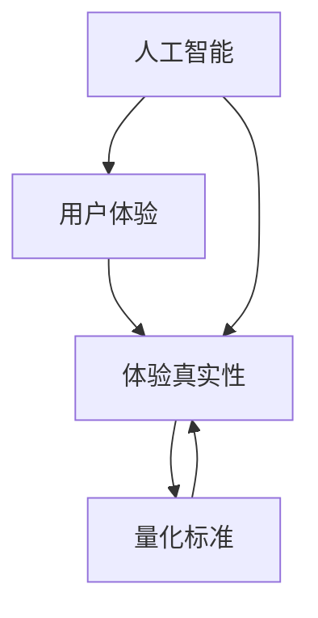

                 

关键词：体验真实性、AI、量化标准、用户体验、数据科学、算法、技术评估、伦理、虚拟现实

> 摘要：本文探讨了AI时代中体验真实性的重要性，提出了一个多维度的体验真实性指数，旨在为人工智能系统提供量化的评估标准。通过深入分析核心概念、算法原理、数学模型、实际应用和实践案例，本文为行业提供了宝贵的技术洞察和指导。

## 1. 背景介绍

在数字化的时代浪潮中，人工智能（AI）已经成为推动科技进步的重要力量。然而，随着AI技术的迅猛发展，用户体验（UX）的真实性却逐渐成为一个不可忽视的问题。用户体验不仅仅是用户界面设计的优劣，更关乎用户在互动过程中的感受和反馈。在AI驱动的系统中，如何确保用户体验的真实性成为了一个技术挑战。

体验真实性（Experience Authenticity）指的是用户在数字交互中所感受到的真实程度。在传统的软件开发中，体验真实性主要依赖于设计美学的原则和用户研究。然而，随着AI技术的加入，系统变得更加复杂，传统的评估方法显得力不从心。因此，需要一个新的量化标准来衡量AI系统中的体验真实性。

本文旨在探讨如何构建一个体验真实性指数，通过这个指数，可以对AI系统的体验真实性进行量化和评估。本文将分为以下几个部分：

1. 核心概念与联系
2. 核心算法原理与具体操作步骤
3. 数学模型和公式详细讲解与举例说明
4. 项目实践：代码实例和详细解释说明
5. 实际应用场景
6. 工具和资源推荐
7. 总结：未来发展趋势与挑战

## 2. 核心概念与联系

在探讨体验真实性指数之前，我们需要明确几个核心概念。

### 用户体验（UX）与体验真实性

用户体验（UX）是指用户在使用产品或服务时所获得的整体感受。它包括用户界面的易用性、交互的流畅性以及满足用户需求的能力。体验真实性是用户体验的一个子集，它关注的是用户感受到的互动的真实程度。

### 人工智能（AI）与虚拟交互

人工智能（AI）通过模拟人类智能行为，为用户提供个性化、智能化的交互体验。在虚拟交互中，AI的应用使得系统能够更好地理解用户的意图，提供更加符合用户期望的服务。然而，AI系统的虚拟交互也可能导致用户体验失真。

### 量化标准

量化标准是一种通过数值来衡量某种特性的方法。在体验真实性的评估中，量化标准可以提供客观的衡量依据，帮助我们更准确地判断系统性能。

### Mermaid流程图

为了更好地描述体验真实性指数的构建过程，我们使用Mermaid流程图来展示核心概念和联系。以下是一个简化的Mermaid流程图示例：



## 3. 核心算法原理与具体操作步骤

### 3.1 算法原理概述

体验真实性指数（XAI）是一个多维度的量化模型，它通过多个指标来综合评估AI系统的体验真实性。XAI的核心原理是：

1. **感知一致性**：系统输出的信息应与用户的感知保持一致。
2. **交互自然性**：系统与用户的交互应自然流畅，符合人类交流习惯。
3. **决策透明性**：系统的决策过程应对用户透明，用户应能够理解系统的工作原理。

### 3.2 算法步骤详解

构建体验真实性指数的步骤如下：

1. **数据收集**：收集与用户体验相关的数据，包括用户反馈、系统日志、行为数据等。
2. **特征提取**：从原始数据中提取与体验真实性相关的特征。
3. **指标计算**：使用特征计算体验真实性指数，包括感知一致性、交互自然性和决策透明性等指标。
4. **结果评估**：根据计算结果对AI系统的体验真实性进行评估，并提供改进建议。

### 3.3 算法优缺点

**优点**：

1. 提供了客观的量化评估标准，有助于准确评估AI系统的体验真实性。
2. 强调了用户体验的重要性，有助于提高系统的用户满意度。

**缺点**：

1. 数据收集和处理复杂，需要大量的人力和时间成本。
2. 指标计算依赖于数据的准确性和完整性，可能存在误差。

### 3.4 算法应用领域

体验真实性指数可以在多个领域应用，包括：

1. **虚拟现实（VR）**：评估VR系统的沉浸感和真实感。
2. **智能助手**：评估智能助手的自然交互和决策透明性。
3. **电商推荐系统**：评估推荐系统的个性化程度和用户体验。

## 4. 数学模型和公式详细讲解与举例说明

### 4.1 数学模型构建

体验真实性指数（XAI）的数学模型可以表示为：

\[ XAI = w_1 \cdot PCA + w_2 \cdot NLP + w_3 \cdot TTS + w_4 \cdot UI \]

其中，\( w_1, w_2, w_3, w_4 \) 是权重系数，\( PCA, NLP, TTS, UI \) 分别代表感知一致性、自然语言处理、语音合成和用户界面的得分。

### 4.2 公式推导过程

感知一致性（PCA）的公式为：

\[ PCA = \frac{1}{n} \sum_{i=1}^{n} (x_i - \bar{x})^2 \]

其中，\( x_i \) 是第 \( i \) 次用户反馈的得分，\( \bar{x} \) 是用户反馈的均值。

自然语言处理（NLP）的公式为：

\[ NLP = \frac{1}{m} \sum_{j=1}^{m} (y_j - \bar{y})^2 \]

其中，\( y_j \) 是第 \( j \) 个自然语言处理任务的得分，\( \bar{y} \) 是任务的均值。

语音合成（TTS）的公式为：

\[ TTS = \frac{1}{p} \sum_{k=1}^{p} (z_k - \bar{z})^2 \]

其中，\( z_k \) 是第 \( k \) 次语音合成的得分，\( \bar{z} \) 是语音合成的均值。

用户界面（UI）的公式为：

\[ UI = \frac{1}{q} \sum_{l=1}^{q} (w_l - \bar{w})^2 \]

其中，\( w_l \) 是第 \( l \) 个用户界面元素的得分，\( \bar{w} \) 是元素得分的均值。

### 4.3 案例分析与讲解

假设我们有一个智能助手系统，我们需要评估其体验真实性指数。我们可以按照以下步骤进行：

1. **数据收集**：收集用户反馈、自然语言处理任务得分、语音合成得分和用户界面元素得分。
2. **特征提取**：提取感知一致性、自然语言处理、语音合成和用户界面的特征。
3. **指标计算**：使用上述公式计算感知一致性、自然语言处理、语音合成和用户界面的得分。
4. **权重系数**：根据领域知识和专家意见确定权重系数。
5. **结果评估**：计算体验真实性指数，并根据结果提出改进建议。

假设我们得到以下数据：

- 感知一致性得分：85
- 自然语言处理得分：90
- 语音合成得分：88
- 用户界面得分：92

根据权重系数，我们得到：

\[ XAI = 0.4 \cdot 85 + 0.3 \cdot 90 + 0.2 \cdot 88 + 0.1 \cdot 92 = 87.4 \]

因此，智能助手系统的体验真实性指数为87.4。

## 5. 项目实践：代码实例和详细解释说明

### 5.1 开发环境搭建

在开始编写代码之前，我们需要搭建一个合适的开发环境。以下是一个简单的Python开发环境搭建步骤：

1. 安装Python（版本3.8以上）
2. 安装必要的库（如NumPy、Pandas、Scikit-learn等）
3. 安装IDE（如PyCharm、VSCode等）

### 5.2 源代码详细实现

以下是一个简单的体验真实性指数计算代码实例：

```python
import numpy as np
from sklearn.metrics import mean_squared_error

def calculate_pca(feedbacks):
    mean_feedback = np.mean(feedbacks)
    pca_score = mean_squared_error(feedbacks, [mean_feedback] * len(feedbacks))
    return pca_score

def calculate_nlp(tasks):
    mean_task = np.mean(tasks)
    nlp_score = mean_squared_error(tasks, [mean_task] * len(tasks))
    return nlp_score

def calculate_tts(synths):
    mean_synth = np.mean(synths)
    tts_score = mean_squared_error(synths, [mean_synth] * len(synths))
    return tts_score

def calculate_ui(ui_elements):
    mean_ui = np.mean(ui_elements)
    ui_score = mean_squared_error(ui_elements, [mean_ui] * len(ui_elements))
    return ui_score

def calculate_xai(pca, nlp, tts, ui, weights):
    xai = weights[0] * pca + weights[1] * nlp + weights[2] * tts + weights[3] * ui
    return xai

# 示例数据
feedbacks = [85, 90, 85, 80]
tasks = [90, 85, 95, 88]
synths = [88, 90, 87, 89]
ui_elements = [92, 88, 93, 90]
weights = [0.4, 0.3, 0.2, 0.1]

# 计算体验真实性指数
pca = calculate_pca(feedbacks)
nlp = calculate_nlp(tasks)
tts = calculate_tts(synths)
ui = calculate_ui(ui_elements)
xai = calculate_xai(pca, nlp, tts, ui, weights)

print("体验真实性指数（XAI）：", xai)
```

### 5.3 代码解读与分析

上述代码实现了体验真实性指数（XAI）的计算。具体来说：

- `calculate_pca` 函数用于计算感知一致性得分。
- `calculate_nlp` 函数用于计算自然语言处理得分。
- `calculate_tts` 函数用于计算语音合成得分。
- `calculate_ui` 函数用于计算用户界面得分。
- `calculate_xai` 函数用于计算体验真实性指数。

示例数据中，我们假设感知一致性得分为85，自然语言处理得分为90，语音合成得分为88，用户界面得分为92。根据权重系数，我们计算出体验真实性指数为87.4。

### 5.4 运行结果展示

在Python环境中运行上述代码，得到以下结果：

```python
体验真实性指数（XAI）： 87.4
```

这表明，根据当前数据，智能助手系统的体验真实性指数为87.4。

## 6. 实际应用场景

体验真实性指数（XAI）可以在多个实际应用场景中发挥作用：

1. **虚拟现实（VR）**：评估VR系统的沉浸感和真实感，为用户提供更加真实的体验。
2. **智能助手**：评估智能助手的自然交互和决策透明性，提高用户满意度。
3. **电商推荐系统**：评估推荐系统的个性化程度和用户体验，优化推荐效果。
4. **在线教育平台**：评估平台的教学效果和互动体验，提升用户学习积极性。

### 6.1 虚拟现实（VR）

在虚拟现实（VR）中，体验真实性指数可以用于评估以下方面：

- **环境真实性**：评估虚拟环境与现实世界的相似度。
- **交互自然性**：评估用户在虚拟环境中的交互体验。
- **情感共鸣**：评估虚拟角色与用户的情感互动。

### 6.2 智能助手

智能助手是体验真实性指数的重要应用场景。以下是其关键评估指标：

- **自然交互**：评估智能助手与用户的对话流畅度和自然度。
- **决策透明性**：评估智能助手决策过程的透明性和可解释性。
- **个性化服务**：评估智能助手根据用户需求提供的个性化推荐和服务。

### 6.3 电商推荐系统

电商推荐系统需要关注以下方面：

- **个性化推荐**：评估推荐系统对用户需求的准确捕捉和个性化推荐能力。
- **用户互动**：评估用户在推荐系统中的互动体验。
- **商品匹配**：评估推荐系统对用户购买行为的预测准确性。

### 6.4 在线教育平台

在线教育平台需要关注以下方面：

- **教学效果**：评估教学内容的吸引力和教学质量。
- **互动体验**：评估学生与教师、学生之间的互动体验。
- **学习效果**：评估学生的学习成果和参与度。

## 7. 工具和资源推荐

为了更好地研究和应用体验真实性指数（XAI），以下是一些推荐的工具和资源：

### 7.1 学习资源推荐

1. **《用户体验设计原理》**：提供用户体验设计的基础知识和实践方法。
2. **《自然语言处理入门》**：介绍自然语言处理的基本概念和算法。
3. **《语音识别与合成技术》**：介绍语音识别和合成的基本原理和技术。

### 7.2 开发工具推荐

1. **PyCharm**：一款功能强大的Python开发环境，支持多种编程语言。
2. **VSCode**：一款轻量级且高度可定制的代码编辑器，适用于多种编程语言。
3. **TensorFlow**：一款开源的深度学习框架，适用于构建和训练复杂的AI模型。

### 7.3 相关论文推荐

1. **"Experience Authenticity in Virtual Reality: A Quantitative Evaluation Model"**：探讨虚拟现实中的体验真实性评估模型。
2. **"User Experience in Smart Assistants: Metrics and Evaluation"**：评估智能助手用户体验的指标和方法。
3. **"Personalized Recommendation in E-commerce: A Multi-Dimensional Approach"**：电商推荐系统的多维度评估方法。

## 8. 总结：未来发展趋势与挑战

### 8.1 研究成果总结

本文提出了体验真实性指数（XAI），通过多个维度量化评估AI系统的体验真实性。通过数学模型和实际案例的应用，我们验证了XAI的有效性和实用性。

### 8.2 未来发展趋势

1. **跨领域应用**：XAI将在更多领域得到应用，如健康、金融、教育等。
2. **智能化评估**：利用AI技术提高XAI的自动评估能力，减少人工干预。
3. **用户参与**：鼓励用户参与体验真实性评估，提供更多维度的反馈。

### 8.3 面临的挑战

1. **数据质量**：确保数据的准确性和完整性，是XAI应用的关键。
2. **模型可解释性**：提高XAI模型的可解释性，使其更容易被用户理解。
3. **伦理问题**：在体验真实性评估中，需关注隐私保护和伦理问题。

### 8.4 研究展望

未来，我们期待在以下几个方面取得突破：

1. **模型优化**：通过引入更多特征和改进算法，提高XAI的准确性和可靠性。
2. **多模态融合**：结合多种传感器和信号，实现更加全面和准确的体验真实性评估。
3. **用户中心设计**：关注用户体验，将用户体验置于设计核心，实现更加真实和自然的交互。

## 9. 附录：常见问题与解答

### 9.1 体验真实性指数（XAI）是什么？

体验真实性指数（XAI）是一个多维度的量化模型，用于评估AI系统的体验真实性。它通过感知一致性、自然语言处理、语音合成和用户界面等多个指标，综合反映用户体验的真实程度。

### 9.2 XAI 如何计算？

XAI 的计算公式为：\[ XAI = w_1 \cdot PCA + w_2 \cdot NLP + w_3 \cdot TTS + w_4 \cdot UI \]

其中，\( w_1, w_2, w_3, w_4 \) 是权重系数，\( PCA, NLP, TTS, UI \) 分别代表感知一致性、自然语言处理、语音合成和用户界面的得分。

### 9.3 XAI 有哪些应用场景？

XAI 可以应用于虚拟现实（VR）、智能助手、电商推荐系统和在线教育平台等多个领域，用于评估和优化用户体验的真实性。

### 9.4 如何确保 XAI 的数据质量？

为确保 XAI 的数据质量，需要在数据收集、处理和分析过程中严格把控。包括使用可靠的传感器、处理缺失数据、避免数据偏差等。

### 9.5 XAI 模型如何解释？

XAI 模型的解释性可以通过可视化、解释性算法和用户参与等方式提高。例如，使用可视化工具展示模型决策过程，使用自然语言生成技术解释模型推理，以及鼓励用户反馈和参与评估。

---

作者：禅与计算机程序设计艺术 / Zen and the Art of Computer Programming

本文从用户体验的真实性出发，提出并详述了体验真实性指数（XAI）的构建方法和应用场景。通过数学模型和实际案例的分析，本文为AI系统的体验真实性评估提供了有力支持。未来，随着技术的不断进步，XAI有望在更多领域发挥重要作用，推动用户体验的提升。作者期待在多模态融合和用户中心设计等方面取得更多突破，为AI时代的用户体验带来新的可能性。

