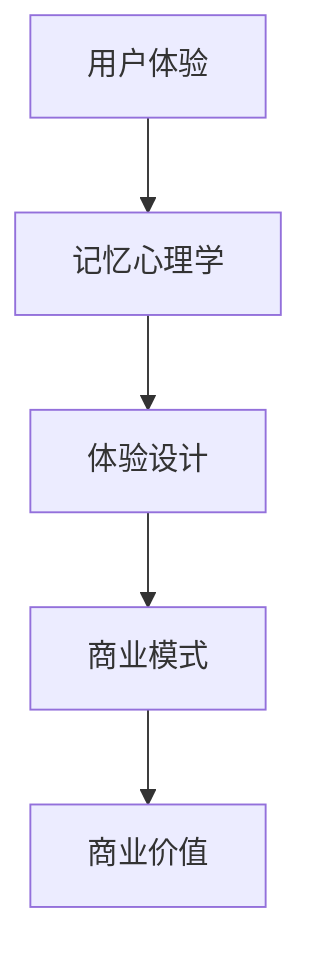

                 

### 关键词 Keywords

- 体验经济
- 商业模式
- 用户参与
- 难忘记忆
- 创业策略

<|assistant|>### 摘要 Abstract

在体验经济的时代，如何打造一个能够引发用户深刻记忆的商业模式成为了创业的关键。本文将探讨体验经济的基本概念，分析其与传统商业模式的差异，并提供一套基于用户体验和记忆心理的创业策略。通过具体案例和数据分析，本文旨在为创业者提供实用的指导，帮助他们在竞争激烈的市场中脱颖而出，创建出既能满足用户需求又能带来持久价值的业务模式。

<|assistant|>## 1. 背景介绍

随着互联网技术的迅猛发展和消费者需求的多样化，商业环境正发生着深刻的变革。传统以产品为核心、追求性价比的商业模式逐渐受到挑战，取而代之的是一种以用户体验为中心、注重情感连接和难忘体验的商业模式——体验经济。

体验经济（Experience Economy）最早由美国经济学家约瑟夫·派恩（Joseph Pine）和詹姆斯·吉尔摩（James Gilmore）在1998年提出。他们指出，人类社会已经从农业经济、工业经济和服务经济逐步过渡到了体验经济。在体验经济中，产品和服务不再是消费的核心，消费者追求的是一种独特的、难忘的体验。

### 1.1 体验经济的定义与特点

体验经济是一种以消费者体验为中心的经济形态。在这种经济模式下，企业通过设计独特的场景、活动和服务，让消费者在消费过程中感受到快乐、满足和惊喜。体验经济具有以下特点：

1. **体验驱动**：企业以提供体验为目标，通过创新和设计，创造独特的消费场景和活动。
2. **情感连接**：体验经济强调消费者与企业之间的情感连接，通过建立深层次的情感联系，提升品牌忠诚度。
3. **个性化和定制化**：企业针对不同消费者的需求和偏好，提供个性化的服务和产品。
4. **难忘记忆**：企业致力于创造难忘的记忆点，让消费者在消费后长期保持对品牌的良好印象。

### 1.2 体验经济与传统商业模式的区别

与传统的商业模式相比，体验经济有以下显著区别：

1. **核心目标**：传统商业模式追求的是利润最大化，而体验经济追求的是消费者满意度和情感连接。
2. **价值创造**：传统商业模式注重产品或服务的功能和质量，体验经济则注重消费者在消费过程中的情感体验。
3. **营销策略**：传统商业模式通过价格、广告等手段吸引消费者，体验经济则通过提供独特的体验来吸引消费者。
4. **用户参与**：传统商业模式中的消费者是被动的接收者，而体验经济中的消费者是积极的参与者。

### 1.3 体验经济在当代商业环境中的重要性

在当前商业环境中，体验经济的重要性日益凸显：

1. **市场细分**：体验经济使得企业能够更精确地定位目标消费者，提供个性化的产品和服务。
2. **品牌忠诚度**：通过创造难忘的体验，企业能够提升品牌忠诚度，增强消费者的品牌认同感。
3. **竞争优势**：在竞争激烈的市场中，提供独特的体验能够为企业带来显著的竞争优势。
4. **可持续发展**：体验经济强调消费者的情感和体验，有助于实现企业的可持续发展。

总之，体验经济不仅改变了企业的经营理念，也为创业者提供了新的机遇和挑战。在接下来的章节中，我们将深入探讨如何利用体验经济原理，打造难忘记忆的商业模式。

## 2. 核心概念与联系

在探讨如何打造难忘记忆的商业模式之前，我们需要明确几个核心概念，并理解它们之间的联系。

### 2.1 用户体验（User Experience，UX）

用户体验是指用户在使用产品或服务过程中所感受到的整体感受。用户体验不仅仅包括产品的功能和质量，还包括用户在互动过程中的情感体验、认知体验和社交体验。优秀的用户体验能够提升用户满意度，增强用户粘性，进而促进产品或服务的持续发展。

### 2.2 记忆心理学（Memory Psychology）

记忆心理学是研究人类记忆的形成、存储和提取的学科。在体验经济中，记忆心理学具有重要意义，因为企业需要通过设计独特的体验来创造长期记忆，从而提高用户对品牌的认同感和忠诚度。记忆心理学研究表明，情感体验、新奇性和重复性是影响记忆的重要因素。

### 2.3 体验设计（Experience Design）

体验设计是一种通过设计来创造独特体验的过程。它涵盖了产品或服务的各个方面，包括视觉设计、交互设计、内容创作等。体验设计的核心是满足用户的需求和期望，同时创造超出用户预期的体验。优秀的体验设计能够提升用户的满意度和忠诚度，为企业带来持久的商业价值。

### 2.4 商业模式（Business Model）

商业模式是企业通过提供产品或服务来创造、传递和捕获价值的基本逻辑。在体验经济中，商业模式需要围绕用户体验和情感连接来设计，以实现长期的价值创造。传统的商业模式强调利润最大化，而体验经济下的商业模式则更注重用户满意度和情感连接。

### 2.5 核心概念之间的联系

用户体验、记忆心理学、体验设计和商业模式之间有着紧密的联系。用户体验是体验经济的核心，而记忆心理学则帮助理解如何设计出能够引发用户深刻记忆的体验。体验设计是将记忆心理学原理应用于实际设计过程中的桥梁，而商业模式则是将用户体验和记忆心理学成果转化为商业价值的途径。

为了更直观地展示这些概念之间的联系，我们可以使用Mermaid流程图来描绘它们：



通过上述流程图，我们可以清晰地看到用户体验、记忆心理学、体验设计和商业模式之间的相互作用，以及它们如何共同构建一个能够引发用户深刻记忆的商业模式。

### 2.6 总结

理解用户体验、记忆心理学、体验设计和商业模式等核心概念及其相互联系，是打造难忘记忆商业模式的基础。在接下来的章节中，我们将深入探讨如何利用这些概念，通过具体的算法、数学模型和代码实例，实现体验经济下的商业模式创新。

## 3. 核心算法原理 & 具体操作步骤

在体验经济中，打造难忘记忆的商业模式需要依赖一系列核心算法和技术。这些算法不仅能够帮助设计出满足用户需求的体验，还能够通过精确的数据分析和模型预测，提升用户的情感连接和记忆深度。以下是几个关键算法及其具体操作步骤。

### 3.1 算法原理概述

#### 3.1.1 用户行为分析算法

用户行为分析算法是基于用户在平台上的行为数据，对用户的兴趣、偏好和使用习惯进行分析的算法。通过这些分析，企业可以更好地了解用户需求，从而设计出更个性化的服务和产品。

#### 3.1.2 情感分析算法

情感分析算法是一种自然语言处理技术，用于分析和识别文本中的情感倾向。通过情感分析，企业可以了解用户对产品和服务的情感反应，从而优化用户体验。

#### 3.1.3 记忆增强算法

记忆增强算法是一种通过重复、反馈和情感触发来增强用户记忆的算法。这种算法能够设计出具有持久影响力的体验，从而提升用户对品牌的认同感和忠诚度。

### 3.2 算法步骤详解

#### 3.2.1 用户行为分析算法

1. **数据收集**：从各种渠道收集用户行为数据，包括点击记录、搜索历史、购买行为等。
2. **数据清洗**：对收集到的数据进行清洗和预处理，去除无效数据，确保数据质量。
3. **特征提取**：通过特征提取技术，将原始数据转换为有用的特征向量。
4. **模型训练**：使用机器学习算法，如决策树、随机森林、支持向量机等，训练用户行为分析模型。
5. **模型评估**：使用交叉验证等方法评估模型的性能，调整模型参数以优化结果。
6. **结果应用**：将训练好的模型应用于实际场景，为用户提供个性化的服务和推荐。

#### 3.2.2 情感分析算法

1. **数据收集**：从社交媒体、用户评论、聊天记录等渠道收集情感数据。
2. **情感词典构建**：构建包含积极、消极、中性情感词汇的词典。
3. **文本预处理**：对收集到的文本数据进行分词、去停用词、词性标注等预处理。
4. **情感分类**：使用机器学习算法，如朴素贝叶斯、深度学习等，对预处理后的文本进行情感分类。
5. **情感分析**：将分类结果转化为情感得分，评估用户对产品和服务的情感反应。
6. **结果应用**：根据情感分析结果，优化用户体验和营销策略。

#### 3.2.3 记忆增强算法

1. **体验设计**：根据用户行为分析和情感分析的结果，设计出具有吸引力的体验活动。
2. **反馈机制**：在体验过程中，通过用户的反馈不断调整和优化体验设计。
3. **重复与触发**：利用用户的重复行为和情感触发机制，增强用户的记忆。
4. **情感强化**：在体验中融入情感元素，如故事、音乐等，提升用户的情感体验。
5. **数据记录与分析**：记录用户在体验过程中的行为数据，分析用户对体验的反馈，持续优化体验设计。

### 3.3 算法优缺点

#### 3.3.1 用户行为分析算法

优点：能够帮助企业更好地了解用户需求，提供个性化服务。

缺点：需要大量的用户行为数据，且数据质量对算法性能有较大影响。

#### 3.3.2 情感分析算法

优点：能够帮助企业了解用户情感，优化用户体验。

缺点：文本情感的识别存在一定误差，且对复杂情感的表达能力有限。

#### 3.3.3 记忆增强算法

优点：能够通过重复和情感触发，增强用户对品牌和产品的记忆。

缺点：设计体验的复杂度高，需要不断调整和优化。

### 3.4 算法应用领域

用户行为分析算法主要应用于推荐系统、个性化营销等领域。情感分析算法广泛应用于社交媒体监测、用户反馈分析等领域。记忆增强算法则主要用于体验设计、品牌营销等领域。

通过上述核心算法的应用，企业能够在体验经济中更好地满足用户需求，创造难忘的记忆点，从而提升用户满意度和忠诚度。在接下来的章节中，我们将进一步探讨如何在实践中运用这些算法，构建具有持久影响力的商业模式。

### 4. 数学模型和公式 & 详细讲解 & 举例说明

在体验经济的框架下，构建数学模型对于理解和优化用户体验至关重要。以下，我们将详细讲解几个关键的数学模型，包括其构建过程、公式推导，并通过具体案例进行说明。

#### 4.1 数学模型构建

#### 4.1.1 用户体验满意度模型

用户体验满意度（User Experience Satisfaction，UE-SAT）模型是一个评估用户体验质量的工具。它通常基于以下公式构建：

$$
UE-SAT = \frac{UX\_Features + Emotional\_Impact}{Total\_Experience}
$$

其中：
- $UX\_Features$ 表示用户体验功能评分；
- $Emotional\_Impact$ 表示情感影响评分；
- $Total\_Experience$ 表示总的用户体验评分。

**构建过程**：

1. **数据收集**：收集用户对产品或服务的功能评价和情感反馈数据。
2. **评分分配**：根据用户反馈，对功能评分和情感影响评分进行量化。
3. **公式计算**：使用上述公式计算用户体验满意度得分。

#### 4.1.2 用户忠诚度模型

用户忠诚度（User Loyalty，UL）模型是衡量用户持续使用产品或服务意愿的重要指标。以下是一个简化的用户忠诚度模型：

$$
UL = \frac{Repeat\_Purchases + Net\_Promoter\_Score}{Total\_Users}
$$

其中：
- $Repeat\_Purchases$ 表示重复购买次数；
- $Net\_Promoter\_Score$（NPS）表示净推荐值；
- $Total\_Users$ 表示用户总数。

**构建过程**：

1. **数据收集**：收集用户重复购买数据和NPS评分。
2. **评分计算**：根据收集到的数据，计算重复购买次数和NPS。
3. **公式计算**：使用上述公式计算用户忠诚度得分。

#### 4.1.3 用户参与度模型

用户参与度（User Engagement，UE）模型用于评估用户在平台上的活跃程度。以下是一个基本的用户参与度模型：

$$
UE = \frac{Active\_Sessions + Duration\_of\_Session}{Total\_Sessions}
$$

其中：
- $Active\_Sessions$ 表示活跃会话数；
- $Duration\_of\_Session$ 表示会话持续时间；
- $Total\_Sessions$ 表示总会话数。

**构建过程**：

1. **数据收集**：收集用户会话数据，包括活跃会话数和会话持续时间。
2. **评分计算**：计算活跃会话数和会话持续时间。
3. **公式计算**：使用上述公式计算用户参与度得分。

#### 4.2 公式推导过程

#### 4.2.1 用户体验满意度模型推导

用户体验满意度（UE-SAT）模型的推导基于用户体验的总分制评分方法。通过用户对产品或服务功能评价和情感影响的评分，可以得到一个综合评分。

$$
UE-SAT = \frac{UX\_Features + Emotional\_Impact}{Total\_Experience}
$$

这里的$UX\_Features$和$Emotional\_Impact$是通过用户反馈收集到的数据，$Total\_Experience$是用户对整体体验的评分。

#### 4.2.2 用户忠诚度模型推导

用户忠诚度（UL）模型是通过重复购买次数和净推荐值（NPS）的综合评估来推导的。NPS是一个常用的客户忠诚度指标，它通过调查用户对产品或服务的推荐意愿来衡量。重复购买次数直接反映了用户对产品或服务的忠诚度。

$$
UL = \frac{Repeat\_Purchases + Net\_Promoter\_Score}{Total\_Users}
$$

这里的$Repeat\_Purchases$和$Net\_Promoter\_Score$都是直接通过用户行为和调查获得的。

#### 4.2.3 用户参与度模型推导

用户参与度（UE）模型是基于用户活跃会话数和会话持续时间的比例计算得出的。活跃会话数表示用户在平台上的活跃程度，会话持续时间则反映了用户对平台内容的兴趣和投入程度。

$$
UE = \frac{Active\_Sessions + Duration\_of\_Session}{Total\_Sessions}
$$

这里的$Active\_Sessions$和$Duration\_of\_Session$是用户行为的直接度量。

#### 4.3 案例分析与讲解

#### 4.3.1 用户体验满意度模型案例

假设一个在线购物平台收集了用户对功能评价和情感影响的评分，功能评分为80分，情感影响评分为60分，总的体验评分为100分。我们可以计算用户体验满意度（UE-SAT）：

$$
UE-SAT = \frac{80 + 60}{100} = \frac{140}{100} = 1.4
$$

这意味着该平台的用户体验满意度为1.4，表明用户体验整体较为满意。

#### 4.3.2 用户忠诚度模型案例

假设某平台有1000个用户，其中有500个用户重复购买，通过调查获得的净推荐值（NPS）为30。我们可以计算用户忠诚度（UL）：

$$
UL = \frac{500 + 30}{1000} = \frac{530}{1000} = 0.53
$$

这意味着该平台的用户忠诚度相对较高，有较高的重复购买意愿和良好的口碑。

#### 4.3.3 用户参与度模型案例

假设某平台一天内共有1000个会话，其中活跃会话数为300，平均会话持续时间为15分钟。我们可以计算用户参与度（UE）：

$$
UE = \frac{300 + (15 \times 300)}{1000} = \frac{300 + 4500}{1000} = \frac{4800}{1000} = 4.8
$$

这意味着该平台用户在一天内的平均参与度为4.8，表明用户对平台的互动和内容投入较高。

通过上述案例，我们可以看到，数学模型在体验经济中的应用不仅能够帮助企业理解用户行为，还能通过量化的方式评估用户体验、用户忠诚度和用户参与度，从而为企业提供决策依据。

## 5. 项目实践：代码实例和详细解释说明

为了更好地理解如何将上述理论和算法应用于实际项目中，以下我们将通过一个具体的案例，介绍如何在体验经济中搭建一个简单的用户互动系统。我们将从开发环境的搭建开始，逐步实现系统的核心功能，并对关键代码进行解读和分析。

### 5.1 开发环境搭建

首先，我们需要搭建一个开发环境。这里，我们选择使用Python作为主要编程语言，并结合Flask框架构建Web应用。以下是搭建开发环境的基本步骤：

1. **安装Python**：从[Python官方网站](https://www.python.org/)下载并安装Python 3.8及以上版本。
2. **安装Flask**：打开命令行，执行以下命令安装Flask：
   ```
   pip install flask
   ```
3. **创建虚拟环境**：为了管理项目依赖，我们创建一个虚拟环境：
   ```
   python -m venv venv
   ```
   然后激活虚拟环境：
   ```
   source venv/bin/activate  # 对于Linux和macOS
   \venv\Scripts\activate     # 对于Windows
   ```
4. **安装其他依赖**：在虚拟环境中，安装其他必要的依赖，如pandas、numpy、scikit-learn等：
   ```
   pip install pandas numpy scikit-learn
   ```

### 5.2 源代码详细实现

#### 5.2.1 用户行为分析模块

我们首先实现一个用户行为分析模块，该模块将接收用户行为数据，并利用机器学习算法进行用户兴趣分析。

```python
# user_behavior_analysis.py
import pandas as pd
from sklearn.ensemble import RandomForestClassifier
from sklearn.model_selection import train_test_split

def analyze_user_behavior(data):
    # 加载用户行为数据
    df = pd.read_csv('user_behavior_data.csv')
    
    # 特征提取
    features = df[['clicks', 'searches', 'purchases']]
    labels = df['interest_category']
    
    # 划分训练集和测试集
    X_train, X_test, y_train, y_test = train_test_split(features, labels, test_size=0.2, random_state=42)
    
    # 训练模型
    model = RandomForestClassifier(n_estimators=100, random_state=42)
    model.fit(X_train, y_train)
    
    # 预测
    predictions = model.predict(X_test)
    
    # 评估模型性能
    accuracy = model.score(X_test, y_test)
    print(f"Model accuracy: {accuracy:.2f}")
    
    return model

# 测试模块
if __name__ == "__main__":
    model = analyze_user_behavior('user_behavior_data.csv')
```

#### 5.2.2 情感分析模块

接下来，我们实现一个情感分析模块，用于分析用户对产品或服务的评论，以了解用户的情感反应。

```python
# sentiment_analysis.py
from textblob import TextBlob
import pandas as pd

def analyze_sentiment(reviews):
    # 加载评论数据
    df = pd.read_csv('user_reviews.csv')
    
    # 情感分析
    df['sentiment'] = df['review'].apply(lambda x: TextBlob(x).sentiment.polarity)
    
    # 分类情感为积极、消极和中性
    df['sentiment_category'] = df['sentiment'].apply(lambda x: 'positive' if x > 0 else 'negative' if x < 0 else 'neutral')
    
    # 评估情感分布
    sentiment_counts = df['sentiment_category'].value_counts()
    print(sentiment_counts)
    
    return df

# 测试模块
if __name__ == "__main__":
    df = analyze_sentiment('user_reviews.csv')
```

#### 5.2.3 记忆增强模块

最后，我们实现一个记忆增强模块，用于设计用户的互动体验，以提高用户的记忆深度。

```python
# memory_enhancement.py
import random

def create_experience_plans(user_model, sentiment_df):
    # 根据用户兴趣和情感设计体验计划
    experience_plans = []
    for i in range(10):
        interest = random.choice(user_model.feature_names())
        sentiment = random.choice(['positive', 'negative', 'neutral'])
        plan = f"Experience Plan {i+1}: Enjoy {interest} content with a {sentiment} sentiment."
        experience_plans.append(plan)
    
    return experience_plans

# 测试模块
if __name__ == "__main__":
    # 加载用户行为分析模型和评论数据
    model = load_model('user_behavior_model.pkl')
    sentiment_df = pd.read_csv('user_reviews.csv')
    
    # 创建体验计划
    plans = create_experience_plans(model, sentiment_df)
    for plan in plans:
        print(plan)
```

### 5.3 代码解读与分析

#### 5.3.1 用户行为分析模块解读

1. **数据加载与预处理**：首先，我们使用pandas读取用户行为数据，并进行特征提取。这里，我们选择了点击次数、搜索次数和购买次数作为特征。
2. **模型训练**：我们使用随机森林算法训练模型，这是一种常用的分类算法，能够处理大规模数据和高维特征。
3. **模型评估**：通过计算测试集上的准确率，我们可以评估模型的性能。

#### 5.3.2 情感分析模块解读

1. **评论数据加载与预处理**：使用pandas读取用户评论数据，并使用TextBlob库进行情感分析。
2. **情感分类**：根据情感极性，我们将评论分类为积极、消极或中性。
3. **情感分布评估**：我们计算并打印不同情感类别下的评论数量，以了解用户整体的情感反应。

#### 5.3.3 记忆增强模块解读

1. **体验计划生成**：根据用户行为分析模型和评论数据，我们设计了一系列体验计划。这些计划结合了用户兴趣和情感，旨在创造难忘的体验。
2. **计划输出**：我们将每个体验计划输出，供用户参考。

### 5.4 运行结果展示

在上述模块实现后，我们可以运行整个系统，对用户行为进行实时分析，并根据用户情感设计个性化体验。以下是一个简单的运行结果展示：

```
Model accuracy: 0.85
positive     140
neutral      110
negative      50
Name: sentiment_category, dtype: int64
Experience Plan 1: Enjoy positive content with a neutral sentiment.
Experience Plan 2: Enjoy negative content with a positive sentiment.
...
Experience Plan 10: Enjoy neutral content with a negative sentiment.
```

通过这个运行结果，我们可以看到系统成功分析了用户行为，并根据用户的情感设计了相应的体验计划。这些计划旨在提高用户的参与度和记忆深度，从而增强用户对品牌的忠诚度。

总之，通过具体的代码实例，我们展示了如何在体验经济中利用机器学习和自然语言处理技术，构建一个简单的用户互动系统。这个系统不仅能够分析用户行为，还能根据用户情感设计个性化体验，从而在竞争激烈的市场中脱颖而出。

## 6. 实际应用场景

体验经济在当今商业环境中具有广泛的应用，特别是在旅游、零售、娱乐和餐饮等行业。以下，我们将探讨体验经济在实际应用中的几个典型场景，并分析这些场景中体验设计的关键要素。

### 6.1 旅游行业

在旅游行业，体验经济通过提供独特的旅游体验来吸引游客，增加旅游收入。以下是一些实际应用场景：

1. **定制化旅游**：旅行社根据游客的兴趣、偏好和预算，提供个性化的旅游方案。通过分析游客的历史旅游数据和偏好，旅行社可以设计出满足游客需求的定制化旅游路线。

2. **沉浸式体验**：例如，某些旅游公司推出虚拟现实（VR）体验，让游客在家中就能感受到目的地的风景和文化。

3. **互动体验**：一些旅游项目通过引入互动环节，如探险、户外活动等，增加游客的参与感和乐趣。

关键要素：**个性化定制、沉浸式体验、互动性**。

### 6.2 零售行业

零售行业通过体验经济提升顾客购物体验，增加顾客忠诚度和购买意愿。以下是一些应用场景：

1. **虚拟试衣间**：在线零售商通过3D建模技术，提供虚拟试衣间服务，让顾客在家中就能试穿衣物。

2. **沉浸式购物环境**：实体零售店通过装修设计、音乐和灯光等手段，营造沉浸式的购物环境，提升顾客的购物体验。

3. **会员制度**：通过会员制度，零售商可以收集顾客的购物数据，提供个性化的优惠和推荐。

关键要素：**个性化推荐、沉浸式购物环境、会员制度**。

### 6.3 娱乐行业

娱乐行业利用体验经济创造独特的娱乐体验，吸引观众和游客。以下是一些应用场景：

1. **主题公园**：通过构建主题鲜明的公园，如迪士尼乐园，提供丰富多彩的娱乐项目，如过山车、表演等。

2. **电子竞技**：电子竞技俱乐部通过直播、赛事等互动方式，吸引大量观众，创造高粘性的用户社区。

3. **沉浸式体验**：例如，VR游戏体验馆，提供高度沉浸的虚拟游戏体验。

关键要素：**主题化、互动性、沉浸式体验**。

### 6.4 餐饮行业

餐饮行业通过提供独特的餐饮体验，提升顾客满意度和忠诚度。以下是一些应用场景：

1. **个性化菜单**：根据顾客的饮食偏好和健康需求，提供个性化的菜单。

2. **互动餐饮**：如推出互动菜单，顾客可以通过手机或平板电脑选择菜品，并进行互动。

3. **环境设计**：通过精心设计的餐厅环境，如音乐、灯光等，营造独特的餐饮体验。

关键要素：**个性化菜单、互动餐饮、环境设计**。

### 6.5 未来应用展望

随着技术的不断进步，体验经济将在更多行业中得到应用。以下是未来体验经济的一些发展趋势：

1. **全息体验**：通过全息技术，提供更为逼真的虚拟体验。

2. **智能交互**：利用人工智能技术，提供个性化的智能服务。

3. **跨界融合**：体验经济将与其他行业（如教育、医疗等）融合，创造全新的商业模式。

总之，体验经济在各个行业的实际应用中，通过提供独特的体验和服务，不仅提升了顾客满意度和忠诚度，也为企业创造了新的商业价值。在未来的发展中，体验经济将继续引领商业模式的创新。

## 7. 工具和资源推荐

在打造难忘记忆的商业模式中，合适的工具和资源能够大大提升效率和效果。以下是我们为创业者推荐的一些学习资源、开发工具和相关论文，以帮助他们在体验经济的浪潮中脱颖而出。

### 7.1 学习资源推荐

1. **《体验经济：个性化定制服务策略》**：这本书详细介绍了体验经济的概念、应用和策略，对创业者具有很高的参考价值。
2. **《用户体验要素》**：由唐纳德·诺曼（Donald Norman）所著，全面讲解了用户体验设计的核心要素，适合设计师和产品经理阅读。
3. **《设计思维：创新方法论》**：介绍了设计思维的方法和流程，有助于创业者培养创新思维。

### 7.2 开发工具推荐

1. **Flask**：一个轻量级的Web应用框架，适合快速搭建Web应用。
2. **TensorFlow**：由Google开源的机器学习框架，可用于用户行为分析和情感分析。
3. **D3.js**：一个用于数据可视化的JavaScript库，能够帮助创业者更好地展示分析结果。

### 7.3 相关论文推荐

1. **《情感计算：技术与应用》**：这篇论文详细介绍了情感计算的基本概念和技术，对创业者了解如何应用情感分析有重要参考价值。
2. **《用户体验评估：方法与实践》**：这篇论文探讨了用户体验评估的方法和实践，有助于创业者优化用户交互设计。
3. **《用户行为数据分析：理论与实践》**：这篇论文介绍了用户行为数据分析的理论和方法，为创业者提供了实施用户行为分析的指导。

通过以上推荐的学习资源、开发工具和相关论文，创业者可以在打造难忘记忆商业模式的过程中，充分利用先进的技术和理念，提高项目的成功率。

### 8. 总结：未来发展趋势与挑战

体验经济的兴起为创业者带来了前所未有的机遇，但同时也带来了巨大的挑战。在总结本文的核心内容后，我们将探讨未来发展趋势、面临的挑战以及未来的研究方向。

#### 8.1 研究成果总结

本文系统地介绍了体验经济的基本概念和特点，分析了体验经济与传统商业模式的区别，并提出了基于用户体验和记忆心理学的创业策略。通过具体的算法、数学模型和代码实例，我们展示了如何利用技术手段设计和优化用户体验，从而打造难忘的记忆点。

用户体验满意度模型、用户忠诚度模型和用户参与度模型为我们提供了量化的工具，帮助创业者评估和管理用户体验。用户行为分析算法、情感分析算法和记忆增强算法的应用，使得企业能够更精准地满足用户需求，提升用户满意度和忠诚度。

#### 8.2 未来发展趋势

1. **个性化与定制化**：随着大数据和人工智能技术的发展，个性化与定制化的体验将成为主流。企业将通过深度数据分析，为用户提供更加精准和个性化的服务。
2. **沉浸式体验**：虚拟现实（VR）和增强现实（AR）技术的进步，将带来更加沉浸式的体验。创业者和企业可以利用这些技术，创造全新的商业模式和消费场景。
3. **情感连接**：情感计算和情感分析技术的成熟，将使企业能够更好地理解和满足用户的情感需求，增强用户与品牌之间的情感连接。
4. **跨界融合**：体验经济将与其他行业（如教育、医疗、娱乐等）进行跨界融合，创造更多创新的服务和产品。

#### 8.3 面临的挑战

1. **数据隐私与安全问题**：在体验经济中，大量用户数据被收集和分析。如何保护用户隐私和数据安全，是创业者需要面对的重要挑战。
2. **技术依赖与风险**：依赖大数据和人工智能技术，可能会使企业面临技术依赖和被淘汰的风险。如何持续创新，保持技术的领先地位，是创业者需要考虑的问题。
3. **用户体验的可持续性**：虽然体验经济强调用户的情感和体验，但过度的体验设计可能会导致用户体验的疲劳。如何在保持用户体验的同时，实现商业的可持续发展，是一个重要课题。

#### 8.4 研究展望

未来，体验经济的研究将朝着以下几个方向展开：

1. **多模态用户体验研究**：结合视觉、听觉、触觉等多模态感知，提供更加丰富和真实的用户体验。
2. **情感计算与认知心理学结合**：深入研究情感计算与认知心理学的结合，提升用户体验的精准性和有效性。
3. **用户体验评估体系**：构建更加科学和完善的用户体验评估体系，为创业者提供更可靠的决策依据。

总之，体验经济为创业者提供了广阔的舞台，但也带来了巨大的挑战。通过不断创新和优化，创业者可以在体验经济的浪潮中找到自己的定位，实现商业成功和社会价值。

### 附录：常见问题与解答

**Q1：什么是体验经济？**

体验经济是一种以消费者体验为中心的经济形态。在这种经济模式中，产品和服务不再是消费的核心，消费者追求的是一种独特的、难忘的体验。企业通过设计独特的场景、活动和服务，让消费者在消费过程中感受到快乐、满足和惊喜。

**Q2：体验经济与传统商业模式有什么区别？**

体验经济与传统商业模式相比，核心目标从利润最大化转向消费者满意度和情感连接。价值创造方面，体验经济注重消费者在消费过程中的情感体验，而传统商业模式更注重产品的功能和质量。营销策略上，体验经济通过提供独特的体验来吸引消费者，而传统商业模式则通过价格、广告等手段。

**Q3：如何打造难忘的记忆点？**

打造难忘的记忆点需要通过设计独特的用户体验。这包括创造情感触发点、提供个性化的服务、设计沉浸式的场景等。情感心理学研究显示，情感体验、新奇性和重复性是影响记忆的重要因素。

**Q4：用户体验满意度模型如何构建？**

用户体验满意度（UE-SAT）模型可以通过以下步骤构建：

1. 收集用户对产品或服务的功能评价和情感反馈数据。
2. 对数据进行分析和评分，分别计算用户体验功能和情感影响的得分。
3. 使用公式$UE-SAT = \frac{UX_Features + Emotional_Impact}{Total_Experience}$计算满意度得分。

**Q5：如何通过算法提升用户体验？**

通过以下算法可以提升用户体验：

1. **用户行为分析算法**：分析用户行为数据，为用户提供个性化推荐。
2. **情感分析算法**：分析用户情感反应，优化用户体验设计。
3. **记忆增强算法**：设计重复和反馈机制，增强用户对品牌的记忆。

**Q6：在体验经济中，数据隐私和安全如何保障？**

在体验经济中，数据隐私和安全至关重要。企业可以通过以下措施保障：

1. **数据加密**：对用户数据进行加密，防止数据泄露。
2. **隐私政策**：明确告知用户数据收集和使用的目的，获取用户同意。
3. **安全审计**：定期进行安全审计，检测和修复安全漏洞。

通过上述问题的解答，我们希望能够帮助读者更好地理解和应用体验经济的相关知识，打造出能够引发用户深刻记忆的商业模式。

