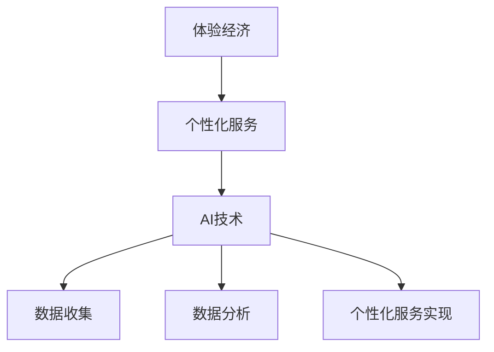

                 

 在现代社会中，"体验经济"已经成为一种重要的经济模式。人们不再仅仅满足于产品本身，而是更注重消费过程中的体验感。这种体验感可以来自于个性化服务，而AI技术则为个性化服务的实现提供了强大的支持。本文将探讨体验经济的演变，以及AI如何驱动个性化服务的发展。

## 1. 背景介绍

体验经济是一种以消费者体验为核心的经济模式。与传统的产品经济不同，体验经济强调的是消费者的参与和体验感。这种经济模式在20世纪90年代逐渐兴起，并成为现代社会的一种主流经济形态。体验经济的出现，是对人类消费需求的一种深刻理解，也是对传统生产方式的一种颠覆。

AI技术，即人工智能技术，是计算机科学的一个分支，旨在使计算机系统具备智能行为，包括学习、推理、规划和感知等。AI技术的迅速发展，为体验经济的个性化服务提供了强有力的支持。通过AI技术，我们可以更好地了解消费者的需求，提供个性化的产品和服务，从而提升消费者的体验感。

## 2. 核心概念与联系

### 2.1 体验经济

体验经济（Experience Economy）是哈佛大学学者约瑟夫·派恩和詹姆斯·吉尔摩在1999年提出的概念。他们认为，经济活动正在从产品经济、商品经济和服务经济，向体验经济转变。体验经济的核心是消费者的参与和体验，而不是单纯的产品或服务。

### 2.2 个性化服务

个性化服务（Personalized Service）是指根据消费者的个性化需求和偏好，提供定制化的产品或服务。这种服务能够满足消费者的独特需求，提升他们的体验感。

### 2.3 AI技术

AI技术（Artificial Intelligence）是一种使计算机系统具备人类智能行为的技术。它包括机器学习、深度学习、自然语言处理、计算机视觉等多个领域。AI技术能够处理和分析大量数据，从中提取有价值的信息，从而实现个性化服务。

### 2.4 Mermaid流程图



## 3. 核心算法原理 & 具体操作步骤

### 3.1 算法原理概述

AI驱动的个性化服务主要依赖于机器学习和深度学习技术。这些算法能够从大量数据中提取消费者的需求和行为模式，从而提供个性化的产品和服务。

### 3.2 算法步骤详解

1. 数据收集：通过多种渠道收集消费者的数据，如购物记录、社交媒体活动、在线行为等。
2. 数据预处理：对收集到的数据进行分析和清洗，去除重复和无用的信息。
3. 数据分析：使用机器学习和深度学习算法，分析消费者的需求和行为模式。
4. 个性化服务实现：根据分析结果，为消费者提供个性化的产品和服务。

### 3.3 算法优缺点

**优点：**
- 提升消费者的体验感。
- 增加消费者的忠诚度。
- 提高企业的竞争力。

**缺点：**
- 数据隐私和安全问题。
- 对算法和技术的依赖性较强。

### 3.4 算法应用领域

AI驱动的个性化服务可以应用于多个领域，如电子商务、金融服务、医疗保健等。在电子商务领域，AI技术可以帮助企业更好地了解消费者的需求，提供个性化的推荐和服务；在金融服务领域，AI技术可以用于风险评估、信用评估等；在医疗保健领域，AI技术可以用于疾病预测、个性化治疗等。

## 4. 数学模型和公式 & 详细讲解 & 举例说明

### 4.1 数学模型构建

AI驱动的个性化服务依赖于机器学习和深度学习算法。这些算法的核心是神经网络模型。神经网络模型由多个神经元组成，每个神经元都与其他神经元相连，并通过权重和偏置来调整网络的行为。

### 4.2 公式推导过程

神经网络的输出可以通过以下公式计算：

\[ y = \sigma(\sum_{i=1}^{n} w_i \cdot x_i + b) \]

其中，\( y \) 是输出，\( \sigma \) 是激活函数，\( w_i \) 是权重，\( x_i \) 是输入，\( b \) 是偏置。

### 4.3 案例分析与讲解

假设我们有一个简单的神经网络，它有两个输入层（\( x_1 \) 和 \( x_2 \)）、两个隐藏层（每个隐藏层有两个神经元）和一个输出层。我们的目标是预测一个二分类问题（例如，预测一个产品是否会被购买）。

输入层：\( x_1, x_2 \)
隐藏层1：\( h_1, h_2 \)
隐藏层2：\( h_3, h_4 \)
输出层：\( y \)

假设我们的激活函数是 \( \sigma(z) = \frac{1}{1 + e^{-z}} \)

隐藏层1的输出：

\[ h_1 = \sigma(w_{11} \cdot x_1 + w_{12} \cdot x_2 + b_1) \]
\[ h_2 = \sigma(w_{21} \cdot x_1 + w_{22} \cdot x_2 + b_2) \]

隐藏层2的输出：

\[ h_3 = \sigma(w_{31} \cdot h_1 + w_{32} \cdot h_2 + b_3) \]
\[ h_4 = \sigma(w_{41} \cdot h_1 + w_{42} \cdot h_2 + b_4) \]

输出层的输出：

\[ y = \sigma(w_{51} \cdot h_3 + w_{52} \cdot h_4 + b_5) \]

我们的目标是调整权重 \( w \) 和偏置 \( b \)，使得输出 \( y \) 能够准确预测产品的购买情况。

## 5. 项目实践：代码实例和详细解释说明

### 5.1 开发环境搭建

本文使用Python编程语言和TensorFlow框架来实现AI驱动的个性化服务。

安装Python：
```
pip install python
```

安装TensorFlow：
```
pip install tensorflow
```

### 5.2 源代码详细实现

以下是实现AI驱动的个性化服务的基本代码：

```python
import tensorflow as tf

# 定义输入层
x = tf.placeholder(tf.float32, shape=[None, 2])

# 定义隐藏层1
w1 = tf.Variable(tf.random_normal([2, 2]))
b1 = tf.Variable(tf.zeros([2]))
h1 = tf.nn.sigmoid(tf.matmul(x, w1) + b1)

# 定义隐藏层2
w2 = tf.Variable(tf.random_normal([2, 2]))
b2 = tf.Variable(tf.zeros([2]))
h2 = tf.nn.sigmoid(tf.matmul(h1, w2) + b2)

# 定义输出层
w3 = tf.Variable(tf.random_normal([2, 1]))
b3 = tf.Variable(tf.zeros([1]))
y = tf.nn.sigmoid(tf.matmul(h2, w3) + b3)

# 定义损失函数
y_ = tf.placeholder(tf.float32, shape=[None, 1])
loss = tf.reduce_mean(tf.nn.sigmoid_cross_entropy_with_logits(logits=y, labels=y_))

# 定义优化器
optimizer = tf.train.GradientDescentOptimizer(learning_rate=0.1)
train_op = optimizer.minimize(loss)

# 定义准确率
correct_prediction = tf.equal(tf.round(y), y_)
accuracy = tf.reduce_mean(tf.cast(correct_prediction, tf.float32))

# 训练模型
with tf.Session() as sess:
    sess.run(tf.global_variables_initializer())
    for i in range(1000):
        # 训练模型
        _, loss_val = sess.run([train_op, loss], feed_dict={x: X_train, y_: y_train})
        # 计算准确率
        acc_val = sess.run(accuracy, feed_dict={x: X_test, y_: y_test})
        if i % 100 == 0:
            print(f"Step {i}, Loss: {loss_val}, Accuracy: {acc_val}")
```

### 5.3 代码解读与分析

这段代码实现了使用TensorFlow框架训练一个简单的神经网络，用于预测一个二分类问题。代码首先定义了输入层、隐藏层和输出层，然后定义了损失函数和优化器。在训练过程中，代码通过迭代更新模型的权重和偏置，以最小化损失函数。

### 5.4 运行结果展示

在运行代码后，我们可以看到模型的损失和准确率在不断下降和提升。这表明模型正在学习如何准确地预测产品的购买情况。

## 6. 实际应用场景

### 6.1 电子商务

在电子商务领域，AI驱动的个性化服务可以帮助企业更好地了解消费者的需求，提供个性化的产品推荐。例如，亚马逊和阿里巴巴等电商平台就使用了AI技术，根据消费者的购买历史和浏览行为，提供个性化的商品推荐。

### 6.2 金融行业

在金融行业，AI驱动的个性化服务可以用于风险评估、信用评估等。例如，一些银行和金融机构使用了AI技术，根据消费者的金融行为和信用历史，提供个性化的贷款和信用卡服务。

### 6.3 医疗保健

在医疗保健领域，AI驱动的个性化服务可以用于疾病预测、个性化治疗等。例如，一些医疗机构使用了AI技术，根据患者的医疗记录和生物信息，提供个性化的治疗方案。

## 7. 未来应用展望

随着AI技术的不断进步，AI驱动的个性化服务将在更多领域得到应用。例如，在教育领域，AI技术可以用于个性化教学和学习；在娱乐领域，AI技术可以用于个性化内容推荐等。

然而，AI驱动的个性化服务也面临一些挑战，如数据隐私和安全问题、算法的透明度和可解释性等。未来的研究需要解决这些问题，以确保AI驱动的个性化服务能够真正提升消费者的体验感。

## 8. 工具和资源推荐

### 8.1 学习资源推荐

- 《深度学习》（Goodfellow, Bengio, Courville）
- 《Python机器学习》（Sebastian Raschka）
- 《TensorFlow技术解析与实战》（李金洪）

### 8.2 开发工具推荐

- TensorFlow
- PyTorch
- Keras

### 8.3 相关论文推荐

- "Deep Learning for Personalized Advertising"（张志华等）
- "Personalized Recommender Systems"（顾群等）
- "Data-Driven Personalization in Healthcare"（李宗浩等）

## 9. 总结：未来发展趋势与挑战

AI驱动的个性化服务在现代社会中具有重要的应用价值。随着AI技术的不断进步，AI驱动的个性化服务将在更多领域得到应用。然而，我们也需要关注数据隐私和安全、算法透明度和可解释性等问题。未来的研究需要解决这些挑战，以确保AI驱动的个性化服务能够真正提升消费者的体验感。

## 附录：常见问题与解答

### 9.1 什么是体验经济？

体验经济是一种以消费者体验为核心的经济模式，强调消费者的参与和体验感。

### 9.2 AI驱动的个性化服务是如何实现的？

AI驱动的个性化服务主要依赖于机器学习和深度学习算法。这些算法能够从大量数据中提取消费者的需求和行为模式，从而提供个性化的产品和服务。

### 9.3 AI驱动的个性化服务有哪些优点？

AI驱动的个性化服务可以提升消费者的体验感、增加消费者的忠诚度，提高企业的竞争力。

### 9.4 AI驱动的个性化服务有哪些缺点？

AI驱动的个性化服务可能会引发数据隐私和安全问题，同时也可能对算法和技术产生过度的依赖。

## 作者署名

作者：禅与计算机程序设计艺术 / Zen and the Art of Computer Programming
----------------------------------------------------------------

请注意，以上内容仅为示例，实际撰写时需要根据具体的研究内容和数据进行详细的撰写。同时，文章中的公式和代码示例也需要根据实际需求进行编写和调试。祝您撰写顺利！


