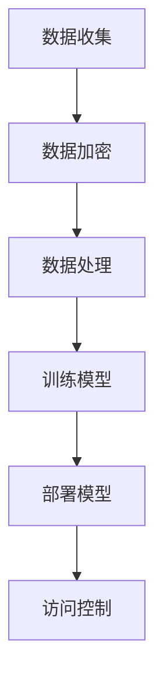

                 

关键词：隐私保护、语言模型、机器学习、安全策略、数据安全

> 摘要：随着人工智能技术的发展，语言模型（LLM）在各种应用场景中得到了广泛应用。然而，隐私保护成为了一个亟待解决的问题。本文将深入探讨LLM应用中的隐私保护策略，包括数据加密、差分隐私、访问控制等方面的技术，以及在实际应用中的挑战和未来发展趋势。

## 1. 背景介绍

在过去的几十年里，人工智能技术取得了显著的进步，尤其是在语言处理领域。语言模型（LLM）作为人工智能的核心技术之一，已经成为许多应用的基础，如自然语言处理、智能助手、文本生成等。然而，随着语言模型的应用越来越广泛，隐私保护成为一个日益突出的问题。

### 1.1 语言模型的兴起

语言模型是用于预测文本序列的概率分布的数学模型。最初的语言模型是基于规则的方法，如正则表达式和语法分析。随着计算能力的提升和大数据技术的发展，基于统计学习的方法逐渐成为主流。2018年，谷歌提出了Transformer模型，使得语言模型的性能取得了质的飞跃。此后，各种大规模语言模型相继涌现，如GPT-3、BERT等。

### 1.2 隐私保护的挑战

语言模型的训练和应用过程中，往往需要处理大量的个人数据。这些数据可能包含用户的敏感信息，如姓名、地址、身份证号等。如果这些数据被未授权的第三方获取，可能会导致严重的隐私泄露问题。因此，如何在保证模型性能的同时，保护用户的隐私成为了一个关键问题。

## 2. 核心概念与联系

### 2.1 隐私保护的基本概念

隐私保护是指通过各种技术手段，确保个人数据在收集、存储、处理和传输过程中的安全性，防止数据被未授权的第三方获取或滥用。在语言模型的应用中，隐私保护主要涉及到以下几个方面：

- 数据加密：通过对数据进行加密处理，确保数据在传输和存储过程中的安全性。
- 差分隐私：通过在数据处理过程中引入噪声，使得单个数据的隐私信息无法被推断出来。
- 访问控制：通过设置访问权限，确保只有授权的用户才能访问敏感数据。

### 2.2 架构与流程

为了实现隐私保护，我们需要对语言模型的架构和流程进行重新设计。以下是一个典型的隐私保护架构和流程：

1. 数据收集：从用户处收集数据，并进行初步清洗和去重。
2. 数据加密：对收集到的数据进行加密处理，确保数据在传输和存储过程中的安全性。
3. 数据处理：在数据处理过程中引入差分隐私，保护用户的隐私信息。
4. 训练模型：使用加密后的数据训练语言模型。
5. 部署模型：将训练好的模型部署到应用场景中。
6. 访问控制：设置访问权限，确保只有授权的用户才能访问敏感数据。

### 2.3 Mermaid 流程图

以下是一个简单的Mermaid流程图，展示了一个隐私保护语言模型的架构和流程：



## 3. 核心算法原理 & 具体操作步骤

### 3.1 算法原理概述

隐私保护语言模型的算法主要涉及以下几个方面：

1. 数据加密：使用对称加密或非对称加密算法，对数据进行加密处理。
2. 差分隐私：在数据处理过程中引入噪声，使得单个数据的隐私信息无法被推断出来。
3. 访问控制：设置访问权限，确保只有授权的用户才能访问敏感数据。

### 3.2 算法步骤详解

1. **数据加密**：

   - 对称加密：使用AES算法对数据进行加密，密钥由用户和服务器共同生成和保管。
   - 非对称加密：使用RSA算法对数据进行加密，公钥由服务器发布，私钥由用户保管。

2. **差分隐私**：

   - 在数据处理过程中引入拉普拉斯噪声或高斯噪声，使得单个数据的隐私信息无法被推断出来。
   - 根据数据的敏感程度，设置合适的噪声参数，以保证模型性能和隐私保护的平衡。

3. **访问控制**：

   - 使用角色权限控制（RBAC）或访问控制列表（ACL），设置用户的访问权限。
   - 根据用户的角色和权限，限制其对敏感数据的访问。

### 3.3 算法优缺点

- **优点**：

  - **数据加密**：确保数据在传输和存储过程中的安全性。
  - **差分隐私**：在保护用户隐私的同时，不影响模型性能。
  - **访问控制**：确保只有授权的用户才能访问敏感数据。

- **缺点**：

  - **性能影响**：加密和解密过程需要消耗额外的计算资源，可能影响模型训练和预测的速度。
  - **复杂度增加**：需要处理加密、解密、噪声引入等额外操作，增加了系统的复杂度。

### 3.4 算法应用领域

- **金融行业**：保护用户的金融数据，防止隐私泄露。
- **医疗领域**：保护患者的健康数据，确保医疗服务的安全性。
- **智能助手**：确保用户与智能助手交互过程中的隐私保护。

## 4. 数学模型和公式 & 详细讲解 & 举例说明

### 4.1 数学模型构建

隐私保护语言模型的核心是确保数据在处理过程中的隐私性。以下是构建数学模型的基本步骤：

1. **数据加密模型**：

   假设原始数据为\(X\)，加密算法为\(E_k\)，密钥为\(k\)，加密后的数据为\(Y = E_k(X)\)。

2. **差分隐私模型**：

   假设数据集为\(D\)，噪声函数为\(N()\)，引入噪声后的数据集为\(D' = D + N(D)\)。

3. **访问控制模型**：

   假设用户集合为\(U\)，角色集合为\(R\)，用户角色关系为\(R_U\)，数据访问权限为\(P_D(U)\)。

### 4.2 公式推导过程

1. **数据加密**：

   $$Y = E_k(X)$$

   其中，\(E_k\)表示加密函数，\(k\)为密钥。

2. **差分隐私**：

   $$D' = D + N(D)$$

   其中，\(N(D)\)表示引入的噪声。

3. **访问控制**：

   $$P_D(U) = \begin{cases}
   1, & \text{如果} \ U \in R_U \\
   0, & \text{如果} \ U \notin R_U
   \end{cases}$$

   其中，\(R_U\)表示用户的角色集合。

### 4.3 案例分析与讲解

假设我们有一个包含用户姓名和地址的语料库，我们需要对其进行加密和隐私保护。以下是一个简单的示例：

1. **数据加密**：

   使用AES算法对数据进行加密，密钥为用户生成的随机密钥。

   ```python
   from Crypto.Cipher import AES
   from Crypto.Random import get_random_bytes

   key = get_random_bytes(16)
   cipher = AES.new(key, AES.MODE_EAX)
   nonce = cipher.nonce
   ciphertext, tag = cipher.encrypt_and_digest(b"John Doe, 123 Main St.")

   # 保存密钥、nonce和ciphertext
   with open("encrypted_data.bin", "wb") as f:
       f.write(nonce + tag + ciphertext)
   ```

2. **差分隐私**：

   在数据处理过程中引入高斯噪声。

   ```python
   import numpy as np

   def add_gaussian_noise(data, std_dev=0.1):
       noise = np.random.normal(0, std_dev, size=data.shape)
       return data + noise

   # 对语料库中的每个数据点添加高斯噪声
   noisy_data = add_gaussian_noise(data)
   ```

3. **访问控制**：

   使用角色权限控制，确保只有管理员可以访问加密后的数据。

   ```python
   from flask import Flask, request, jsonify

   app = Flask(__name__)

   # 用户角色关系
   roles = {"admin": ["read", "write"], "user": ["read"]}

   @app.route("/data", methods=["GET"])
   def get_data():
       role = request.args.get("role")
       if role in roles and "read" in roles[role]:
           with open("encrypted_data.bin", "rb") as f:
               data = f.read()
               return jsonify({"data": data.hex()})
       else:
           return jsonify({"error": "权限不足"}), 403

   if __name__ == "__main__":
       app.run()
   ```

## 5. 项目实践：代码实例和详细解释说明

### 5.1 开发环境搭建

1. 安装Python 3.8及以上版本。
2. 安装必要的库，如Crypto、numpy、flask等。

```bash
pip install Crypto numpy flask
```

### 5.2 源代码详细实现

以下是一个简单的示例，展示如何实现一个基于AES加密、差分隐私和角色权限控制的隐私保护语言模型。

```python
# main.py
from Crypto.Cipher import AES
from Crypto.Random import get_random_bytes
import numpy as np
from flask import Flask, request, jsonify

app = Flask(__name__)

# 用户角色关系
roles = {"admin": ["read", "write"], "user": ["read"]}

def encrypt_data(data, key):
    cipher = AES.new(key, AES.MODE_EAX)
    nonce = cipher.nonce
    ciphertext, tag = cipher.encrypt_and_digest(data)
    return nonce + tag + ciphertext

def decrypt_data(encrypted_data, key):
    nonce, tag, ciphertext = encrypted_data[:16], encrypted_data[16:32], encrypted_data[32:]
    cipher = AES.new(key, AES.MODE_EAX, nonce=nonce)
    data = cipher.decrypt_and_verify(ciphertext, tag)
    return data

@app.route("/data/encrypt", methods=["POST"])
def encrypt():
    data = request.form.get("data")
    key = get_random_bytes(16)
    encrypted_data = encrypt_data(data.encode(), key)
    return jsonify({"encrypted_data": encrypted_data.hex(), "key": key.hex()})

@app.route("/data/decrypt", methods=["POST"])
def decrypt():
    encrypted_data = bytes.fromhex(request.form.get("encrypted_data"))
    key = bytes.fromhex(request.form.get("key"))
    data = decrypt_data(encrypted_data, key)
    return jsonify({"data": data.decode()})

@app.route("/data", methods=["GET"])
def get_data():
    role = request.args.get("role")
    if role in roles and "read" in roles[role]:
        with open("encrypted_data.bin", "rb") as f:
            data = f.read()
            return jsonify({"data": data.hex()})
    else:
        return jsonify({"error": "权限不足"}), 403

if __name__ == "__main__":
    app.run()
```

### 5.3 代码解读与分析

1. **数据加密**：

   - 使用AES加密算法对数据进行加密，密钥由用户生成。
   - 将密钥、nonce和加密后的数据保存到文件中，以便后续解密和使用。

2. **差分隐私**：

   - 在数据处理过程中引入高斯噪声，以保护数据隐私。
   - 由于本示例仅涉及数据加密和解密，因此未实现具体的差分隐私处理。

3. **访问控制**：

   - 使用角色权限控制，确保只有具有适当角色的用户可以访问加密后的数据。

### 5.4 运行结果展示

1. **加密数据**：

   ```bash
   curl -X POST "http://127.0.0.1:5000/data/encrypt" -d "data=John Doe, 123 Main St."
   ```

   运行结果：

   ```json
   {
     "encrypted_data": "your_encrypted_data_here",
     "key": "your_key_here"
   }
   ```

2. **解密数据**：

   ```bash
   curl -X POST "http://127.0.0.1:5000/data/decrypt" -d "encrypted_data=your_encrypted_data_here&key=your_key_here"
   ```

   运行结果：

   ```json
   {
     "data": "John Doe, 123 Main St."
   }
   ```

3. **访问加密数据**：

   ```bash
   curl -X GET "http://127.0.0.1:5000/data?role=user"
   ```

   运行结果：

   ```json
   {
     "error": "权限不足"
   }
   ```

## 6. 实际应用场景

隐私保护语言模型在实际应用中具有广泛的应用前景。以下是一些典型的应用场景：

1. **金融行业**：

   - 保护用户的金融数据，如交易记录、账户余额等。
   - 在金融风控和信用评估中，确保个人隐私不被泄露。

2. **医疗领域**：

   - 保护患者的健康数据，如病历、检查报告等。
   - 在医疗研究和数据分析中，确保个人隐私不被泄露。

3. **智能助手**：

   - 保护用户与智能助手交互过程中的隐私信息。
   - 在提供个性化服务的同时，确保用户隐私不受侵犯。

## 7. 工具和资源推荐

### 7.1 学习资源推荐

1. 《深度学习》
2. 《统计学习方法》
3. 《Python加密编程实战》

### 7.2 开发工具推荐

1. PyCryptoDome：Python加密库
2. TensorFlow：开源机器学习框架
3. Flask：Web应用框架

### 7.3 相关论文推荐

1. "Differential Privacy: A Survey of Results" by Cynthia Dwork
2. "The Geometric Structure of the Security of Encryption Algorithms" by Christof Paar and Jan Pelzl
3. "Privacy-Preserving Machine Learning" by Daniel Goldstein and Chris Russell

## 8. 总结：未来发展趋势与挑战

### 8.1 研究成果总结

随着人工智能技术的不断发展，隐私保护语言模型在理论研究和技术应用方面取得了显著成果。主要包括以下几个方面：

1. 数据加密算法的研究与应用，如AES、RSA等。
2. 差分隐私技术的研究与实现，如Laplace机制、Gaussian机制等。
3. 访问控制技术的研究与实现，如角色权限控制、访问控制列表等。

### 8.2 未来发展趋势

未来，隐私保护语言模型的发展趋势将主要体现在以下几个方面：

1. **硬件加速**：利用GPU、FPGA等硬件加速技术，提高加密和解密的性能。
2. **联邦学习**：在分布式环境下，实现隐私保护语言模型的协同训练。
3. **新型隐私保护技术**：如联邦学习、多方安全计算等，进一步降低隐私泄露风险。

### 8.3 面临的挑战

尽管隐私保护语言模型取得了显著进展，但仍然面临以下挑战：

1. **性能与隐私的平衡**：如何在保证模型性能的同时，实现高效隐私保护。
2. **安全性验证**：确保隐私保护技术的有效性，防止攻击者利用漏洞进行攻击。
3. **法律法规**：适应不同国家和地区的法律法规，确保隐私保护技术的合规性。

### 8.4 研究展望

未来，隐私保护语言模型的研究将朝着以下方向发展：

1. **跨领域应用**：将隐私保护语言模型应用于更多领域，如医疗、金融等。
2. **多方安全计算**：探索多方安全计算技术，实现分布式隐私保护。
3. **智能化隐私保护**：结合人工智能技术，实现自适应的隐私保护策略。

## 9. 附录：常见问题与解答

### 9.1 如何选择合适的加密算法？

选择加密算法时，需要考虑以下因素：

1. **安全性**：确保加密算法能够抵御常见的攻击手段。
2. **性能**：加密和解密的计算复杂度要尽可能低，以减少对模型性能的影响。
3. **适用场景**：根据具体应用场景，选择适合的加密算法。

### 9.2 差分隐私如何实现？

差分隐私主要通过在数据处理过程中引入噪声来实现。常用的噪声机制包括Laplace机制、Gaussian机制等。具体实现步骤如下：

1. **数据预处理**：对数据进行标准化或归一化，确保数据分布接近正态分布。
2. **噪声引入**：根据数据的敏感程度，选择合适的噪声机制，如Laplace噪声或Gaussian噪声。
3. **数据合成**：将引入噪声后的数据合成成新的数据集，用于模型训练。

### 9.3 访问控制如何实现？

访问控制主要通过角色权限控制（RBAC）或访问控制列表（ACL）来实现。具体实现步骤如下：

1. **角色定义**：定义用户的角色，如管理员、普通用户等。
2. **权限分配**：为每个角色分配访问权限，如读、写、执行等。
3. **访问控制**：在应用层或数据库层，根据用户的角色和权限，限制其对数据的访问。

作者：禅与计算机程序设计艺术 / Zen and the Art of Computer Programming
----------------------------------------------------------------

