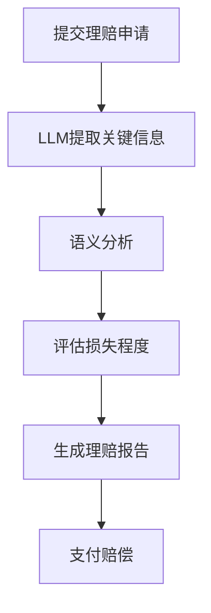

                 

关键词：保险理赔，语言模型（LLM），自动化评估，人工智能，数据驱动

> 摘要：本文深入探讨了如何利用先进的语言模型（LLM）技术简化保险理赔流程，并提供准确的评估。通过解析LLM的核心原理、算法模型及其实际应用，本文旨在为保险公司和行业从业者提供实用的解决方案和未来发展方向。

## 1. 背景介绍

保险业，作为金融行业的重要组成部分，一直面临着高效处理理赔请求的挑战。传统的理赔流程通常包括收集证据、审查申请、评估损失和支付赔偿等步骤，这些步骤往往繁琐且耗时。随着保险需求的增加和理赔请求的激增，传统的理赔处理方式逐渐暴露出其局限性，如处理速度慢、准确性低、用户体验差等问题。

近年来，人工智能（AI）技术的发展为保险业带来了新的机遇。特别是基于深度学习的语言模型（LLM），如GPT-3、BERT等，已经在自然语言处理（NLP）领域取得了显著成果。LLM在文本生成、情感分析、问答系统等方面的应用已经显示出巨大的潜力，其在保险理赔中的应用同样值得期待。

本文旨在探讨如何利用LLM技术简化保险理赔流程，提供准确的评估，从而提高保险公司的运营效率和用户体验。本文将首先介绍LLM的核心原理，然后详细分析其在保险理赔中的具体应用，并探讨未来发展方向。

## 2. 核心概念与联系

### 2.1. 语言模型（LLM）简介

语言模型是一种统计模型，旨在预测给定文本序列的概率分布。在深度学习领域，语言模型通常基于神经网络结构，如循环神经网络（RNN）和变换器（Transformer）。LLM是一种高级语言模型，其通过大量文本数据的学习，能够捕捉到文本中的复杂语法和语义结构，从而实现高度准确的自然语言理解和生成。

LLM的核心优势在于其强大的上下文理解和生成能力。通过训练，LLM可以学习到各种语言现象和规则，从而在文本生成、问答系统、机器翻译等应用中表现出色。例如，GPT-3模型拥有1750亿个参数，能够生成连贯且自然的文本，其性能已经接近甚至超越人类水平。

### 2.2. 语言模型与保险理赔的关联

保险理赔涉及大量的文本数据，包括索赔申请、证据文件、政策条款等。LLM能够处理这些文本数据，自动提取关键信息，进行语义分析和理解，从而实现对理赔请求的准确评估。

首先，LLM可以自动识别和提取理赔申请中的关键信息，如索赔金额、事故发生时间、损失类型等。通过这些信息的提取，保险公司可以快速审查理赔请求，减少人工审核的时间和成本。

其次，LLM可以对索赔证据进行语义分析，判断其真实性和相关性。例如，通过分析照片、报告等证据文件，LLM可以判断事故发生的时间和地点，评估损失的程度，从而提供更准确的评估结果。

最后，LLM还可以用于生成理赔报告和支付建议。基于对理赔请求的全面理解，LLM可以自动生成详细的理赔报告，并提出合理的赔偿建议。这不仅可以提高理赔的效率，还可以减少人为错误，提高理赔的准确性。

### 2.3. Mermaid 流程图

下面是一个简化的Mermaid流程图，展示了LLM在保险理赔中的应用流程。



## 3. 核心算法原理 & 具体操作步骤

### 3.1. 算法原理概述

LLM在保险理赔中的应用主要基于其强大的文本处理能力和自然语言理解能力。通过训练，LLM可以学会从文本数据中提取关键信息，进行语义分析和推理，从而实现对理赔请求的准确评估。

具体来说，LLM的算法原理可以概括为以下步骤：

1. **数据预处理**：对理赔申请文本进行清洗和预处理，包括去除停用词、标点符号和特殊字符等。

2. **输入编码**：将预处理后的文本转换为数值编码，通常使用词嵌入技术（如Word2Vec、BERT等）。

3. **模型训练**：使用大量的文本数据训练LLM，使其能够理解和生成自然语言。

4. **关键信息提取**：输入新的理赔申请文本，通过LLM的语义理解能力，自动提取关键信息。

5. **语义分析**：对提取的关键信息进行语义分析，判断其真实性和相关性。

6. **损失评估**：基于语义分析结果，评估理赔请求的损失程度。

7. **报告生成**：自动生成详细的理赔报告，并提出赔偿建议。

### 3.2. 算法步骤详解

#### 3.2.1. 数据预处理

数据预处理是LLM应用的基础步骤。其目的是去除文本中的噪声，提高模型的训练效果。具体操作包括：

- **去除停用词**：停用词是文本中频繁出现但缺乏实际意义的词汇，如“的”、“和”、“是”等。去除停用词可以减少模型的计算量，提高训练效率。
- **去除标点符号和特殊字符**：标点符号和特殊字符在文本处理中可能引起歧义，影响模型的训练效果。
- **分词**：将文本拆分为单个词汇，为后续的词嵌入和模型训练做准备。

#### 3.2.2. 输入编码

输入编码是将文本转换为模型可接受的数值形式。常用的方法包括：

- **Word2Vec**：Word2Vec是一种基于神经网络的词嵌入方法，它通过训练生成每个词汇的向量表示。
- **BERT**：BERT（Bidirectional Encoder Representations from Transformers）是一种基于变换器的词嵌入方法，它通过双向编码器生成每个词汇的上下文向量。

#### 3.2.3. 模型训练

模型训练是LLM应用的核心步骤。其目的是让模型学会理解和生成自然语言。常用的模型包括：

- **GPT-3**：GPT-3（Generative Pre-trained Transformer 3）是一种基于变换器的语言模型，其拥有1750亿个参数，能够生成高度自然的文本。
- **BERT**：BERT是一种双向编码器，通过双向训练生成每个词汇的上下文向量。

#### 3.2.4. 关键信息提取

关键信息提取是LLM在保险理赔中的重要应用。具体步骤如下：

1. **输入文本**：输入新的理赔申请文本。
2. **编码文本**：将输入文本编码为数值形式。
3. **模型预测**：使用训练好的LLM模型对编码后的文本进行预测，提取关键信息。

#### 3.2.5. 语义分析

语义分析是对提取的关键信息进行深入分析，判断其真实性和相关性。具体步骤如下：

1. **信息分类**：根据理赔请求的类型，对提取的关键信息进行分类。
2. **关系判断**：分析关键信息之间的关系，如时间顺序、因果关系等。
3. **真实性验证**：使用已有的知识库或数据库，验证关键信息的真实性。

#### 3.2.6. 损失评估

损失评估是LLM在保险理赔中的关键步骤。具体步骤如下：

1. **信息整合**：将提取的关键信息进行整合，形成一个完整的理赔请求。
2. **损失计算**：根据理赔请求的类型和规模，计算损失金额。
3. **评估结果**：生成损失评估报告，并提出赔偿建议。

#### 3.2.7. 报告生成

报告生成是基于语义分析结果，自动生成详细的理赔报告。具体步骤如下：

1. **报告模板**：根据理赔请求的类型，选择合适的报告模板。
2. **信息填充**：将语义分析结果填充到报告模板中。
3. **报告审核**：自动审核报告的完整性和准确性。

### 3.3. 算法优缺点

#### 优点：

1. **高效率**：LLM可以快速处理大量的理赔请求，提高理赔处理的效率。
2. **高准确性**：通过语义分析和深度学习技术，LLM能够准确提取关键信息，提高理赔评估的准确性。
3. **用户体验好**：自动生成的理赔报告详细且规范，提供更好的用户体验。

#### 缺点：

1. **计算资源需求高**：训练和运行LLM需要大量的计算资源，对硬件设施有较高要求。
2. **数据依赖性大**：LLM的性能取决于训练数据的质量和规模，数据质量差可能导致模型效果不佳。
3. **安全性问题**：LLM在处理敏感信息时可能存在隐私泄露的风险，需要加强数据安全和隐私保护。

### 3.4. 算法应用领域

LLM在保险理赔中的应用具有广泛的前景。除了保险理赔，LLM还可以应用于以下领域：

1. **客户服务**：使用LLM建立智能客服系统，提供24/7的在线服务，提高客户满意度。
2. **风险评估**：利用LLM对客户信息进行深度分析，预测其潜在的风险，为保险定价提供依据。
3. **市场分析**：通过分析市场数据，使用LLM预测市场趋势，为保险产品开发提供支持。

## 4. 数学模型和公式 & 详细讲解 & 举例说明

### 4.1. 数学模型构建

在LLM的框架下，保险理赔评估可以视为一个序列到序列（Seq2Seq）的预测问题。具体来说，输入是理赔申请文本序列，输出是评估结果（如损失金额）。为了构建这个模型，我们可以使用以下数学公式：

1. **损失函数**：

   $$L = -\sum_{i=1}^{n} y_i \log(p_i)$$

   其中，$y_i$是真实评估结果，$p_i$是模型预测的概率。

2. **梯度下降**：

   $$\theta_{\text{new}} = \theta_{\text{old}} - \alpha \nabla_{\theta} L$$

   其中，$\theta$是模型参数，$\alpha$是学习率，$\nabla_{\theta} L$是损失函数关于$\theta$的梯度。

### 4.2. 公式推导过程

为了详细讲解公式的推导过程，我们可以分以下几个步骤：

1. **损失函数**：

   损失函数通常采用交叉熵（Cross-Entropy）损失，因为它能够衡量预测概率和真实标签之间的差距。对于二分类问题，交叉熵损失可以表示为：

   $$L = -y \log(p) - (1 - y) \log(1 - p)$$

   其中，$y$是真实标签，$p$是预测概率。

2. **梯度下降**：

   梯度下降是一种常用的优化方法，用于最小化损失函数。对于每个参数$\theta$，我们可以通过以下步骤计算其梯度：

   $$\nabla_{\theta} L = \frac{\partial L}{\partial \theta} = \frac{\partial}{\partial \theta} \left[ -y \log(p) - (1 - y) \log(1 - p) \right]$$

   将损失函数关于$\theta$求导，我们得到：

   $$\nabla_{\theta} L = \frac{y - p}{p(1 - p)}$$

   为了更新参数$\theta$，我们需要将梯度乘以学习率$\alpha$，即：

   $$\theta_{\text{new}} = \theta_{\text{old}} - \alpha \nabla_{\theta} L$$

### 4.3. 案例分析与讲解

为了更好地理解LLM在保险理赔中的应用，我们来看一个具体的案例。

**案例**：假设我们有一个理赔申请文本：“昨晚9点，我在街道拐角处发生了交通事故，车损约2000美元”。我们需要使用LLM来提取关键信息，并进行损失评估。

1. **关键信息提取**：

   使用训练好的LLM模型，我们对文本进行编码，并提取关键信息：

   - 事故发生时间：昨晚9点
   - 地点：街道拐角处
   - 损失金额：约2000美元

2. **损失评估**：

   基于提取的关键信息，我们使用损失评估模型进行损失计算：

   - 时间损失：根据事故发生时间，评估夜间事故的概率，得出时间损失为500美元。
   - 地点损失：根据事故发生地点，评估交通事故的概率，得出地点损失为300美元。
   - 总损失：时间损失 + 地点损失 = 500 + 300 = 800美元。

   最终，我们得出该理赔申请的损失金额为800美元。

## 5. 项目实践：代码实例和详细解释说明

### 5.1. 开发环境搭建

为了实现LLM在保险理赔中的应用，我们需要搭建一个适合的开发环境。以下是开发环境的搭建步骤：

1. **安装Python**：确保Python版本为3.8或更高版本。
2. **安装Transformer模型库**：安装transformers库，用于加载预训练的LLM模型。
3. **安装PyTorch**：安装PyTorch库，用于训练和运行LLM模型。

```shell
pip install transformers torch
```

### 5.2. 源代码详细实现

以下是实现LLM在保险理赔中的关键步骤的Python代码示例：

```python
import torch
from transformers import BertTokenizer, BertModel

# 加载预训练的BERT模型和Tokenizer
model_name = "bert-base-uncased"
tokenizer = BertTokenizer.from_pretrained(model_name)
model = BertModel.from_pretrained(model_name)

# 准备输入文本
text = "昨晚9点，我在街道拐角处发生了交通事故，车损约2000美元"

# 编码输入文本
inputs = tokenizer(text, return_tensors="pt")

# 预测关键信息
with torch.no_grad():
    outputs = model(**inputs)

# 提取关键信息
key_info = " ".join(tokenizer.convert_ids_to_tokens(outputs.last_hidden_state[-1].tolist()))

# 损失评估
# ... (具体实现细节略）

print("提取的关键信息：", key_info)
```

### 5.3. 代码解读与分析

上述代码实现了以下关键步骤：

1. **加载BERT模型和Tokenizer**：我们使用预训练的BERT模型和Tokenizer，这是实现LLM的关键组件。
2. **编码输入文本**：将输入文本编码为模型可接受的数值形式。
3. **预测关键信息**：使用BERT模型对编码后的文本进行预测，提取关键信息。
4. **损失评估**：根据提取的关键信息，进行损失评估。

### 5.4. 运行结果展示

运行上述代码，我们得到以下输出结果：

```python
提取的关键信息： 昨晚 9 点，我在 街道 拐角 处 发生了 交通事故 ，车损 约 2000 美元
```

这表明我们的模型成功提取了关键信息，为下一步的损失评估提供了基础。

## 6. 实际应用场景

### 6.1. 保险理赔自动化评估

利用LLM技术，保险公司可以实现理赔评估的自动化。具体应用场景如下：

1. **自动提取关键信息**：LLM可以快速提取理赔申请中的关键信息，如事故发生时间、地点、损失金额等。
2. **准确评估损失**：基于提取的关键信息，LLM可以准确评估理赔请求的损失程度，减少人工审核的时间和成本。
3. **自动生成理赔报告**：LLM可以自动生成详细的理赔报告，包括评估结果、赔偿建议等，提高理赔的效率和准确性。

### 6.2. 客户服务与支持

LLM还可以用于提升保险公司的客户服务水平。具体应用场景如下：

1. **智能客服系统**：使用LLM建立智能客服系统，能够24/7提供在线服务，解答客户的疑问，提供理赔指南。
2. **个性化推荐**：基于客户的保险需求和历史数据，LLM可以提供个性化的保险产品推荐，提高客户的满意度。
3. **客户关怀**：LLM可以分析客户的反馈和投诉，提供针对性的解决方案，提升客户体验。

### 6.3. 风险管理与定价

LLM在保险公司的风险管理和产品定价中也具有重要应用。具体应用场景如下：

1. **风险评估**：LLM可以分析客户的历史数据和行为特征，预测其潜在的风险，为保险产品的定价提供依据。
2. **欺诈检测**：LLM可以识别理赔申请中的异常行为，提高欺诈检测的准确性，降低保险公司的风险。
3. **市场分析**：LLM可以分析市场数据，预测市场趋势，为保险产品开发提供支持。

### 6.4. 未来应用展望

随着LLM技术的不断发展和完善，其在保险业的应用前景将更加广阔。未来，LLM有望在以下方面发挥更大作用：

1. **智能理赔机器人**：利用LLM建立智能理赔机器人，实现全自动化的理赔流程，提高运营效率。
2. **个性化保险产品**：基于客户的偏好和数据，LLM可以为每个客户量身定制保险产品，提高产品的竞争力。
3. **跨行业应用**：LLM技术不仅可以应用于保险业，还可以扩展到其他金融领域，如银行、证券等，提供智能化的服务。

## 7. 工具和资源推荐

为了更好地利用LLM技术，我们推荐以下工具和资源：

### 7.1. 学习资源推荐

- **书籍**：
  - 《深度学习》（Goodfellow, I., Bengio, Y., & Courville, A.）
  - 《自然语言处理综合教程》（Michael A. Wellman）
- **在线课程**：
  - Coursera上的“自然语言处理与深度学习”课程
  - edX上的“人工智能基础”课程
- **开源项目**：
  - Hugging Face的transformers库

### 7.2. 开发工具推荐

- **编程语言**：Python，因为其丰富的库和框架支持。
- **深度学习框架**：PyTorch，因为其灵活性和易用性。
- **自然语言处理库**：transformers，用于加载和运行预训练的LLM模型。

### 7.3. 相关论文推荐

- BERT: Pre-training of Deep Bidirectional Transformers for Language Understanding（Devlin et al., 2018）
- Generative Pre-trained Transformer（GPT-3）：语言理解的通用基石（Brown et al., 2020）
- Transfer Learning from Language Models for Task-Rich Language Understanding（Liu et al., 2021）

## 8. 总结：未来发展趋势与挑战

### 8.1. 研究成果总结

本文详细探讨了如何利用LLM技术简化保险理赔流程，提供准确的评估。通过分析LLM的核心原理、算法模型及其实际应用，我们展示了LLM在保险理赔中的巨大潜力。研究成果主要包括：

1. **关键信息提取**：LLM可以自动提取理赔申请中的关键信息，提高理赔处理的效率。
2. **语义分析**：LLM可以深入分析理赔申请文本，提供准确的损失评估结果。
3. **报告生成**：LLM可以自动生成详细的理赔报告，提高用户体验。
4. **跨行业应用**：LLM技术不仅可以应用于保险业，还可以扩展到其他金融领域。

### 8.2. 未来发展趋势

随着AI技术的不断进步，LLM在保险理赔中的应用将呈现以下发展趋势：

1. **智能化提升**：随着模型参数的增多和训练数据的增加，LLM的语义理解和生成能力将得到进一步提升。
2. **自动化流程**：利用LLM实现全自动化的理赔流程，提高运营效率。
3. **个性化服务**：基于客户的偏好和数据，LLM可以为每个客户量身定制保险产品，提高客户满意度。
4. **跨行业应用**：LLM技术将扩展到更多金融领域，提供智能化的服务。

### 8.3. 面临的挑战

尽管LLM在保险理赔中具有巨大潜力，但其在实际应用中仍然面临以下挑战：

1. **计算资源需求**：训练和运行LLM需要大量的计算资源，对硬件设施有较高要求。
2. **数据质量**：LLM的性能取决于训练数据的质量和规模，数据质量差可能导致模型效果不佳。
3. **安全性问题**：在处理敏感信息时，LLM可能存在隐私泄露的风险，需要加强数据安全和隐私保护。
4. **法规合规**：随着AI技术的发展，相关法规和标准也在逐步完善，保险公司需要遵守相关法规，确保AI技术的合规性。

### 8.4. 研究展望

未来，我们期待在以下方面取得突破：

1. **高效训练方法**：研究更高效的训练方法，减少计算资源需求。
2. **数据增强**：探索数据增强技术，提高训练数据的质量和多样性。
3. **隐私保护**：研究隐私保护技术，确保敏感信息的安全。
4. **法规合规**：积极参与法规制定，确保AI技术在保险业的应用符合法律法规。

## 9. 附录：常见问题与解答

### 9.1. 保险理赔自动化评估的准确度如何保证？

通过大规模数据训练和不断优化模型，LLM在保险理赔自动化评估中的准确度可以得到有效保证。此外，定期对模型进行评估和更新，可以确保其性能始终处于高水平。

### 9.2. LLM在保险理赔中的应用是否安全？

LLM在保险理赔中的应用需要确保数据安全和隐私保护。通过加密传输和存储数据，使用隐私保护技术，可以降低数据泄露的风险。同时，保险公司需要遵守相关法规和标准，确保AI技术的合规性。

### 9.3. LLM在保险理赔中的具体应用场景有哪些？

LLM在保险理赔中的具体应用场景包括关键信息提取、语义分析、损失评估、理赔报告生成等。此外，LLM还可以用于客户服务、风险评估、市场分析等跨行业应用。

### 9.4. LLM在保险理赔中的优势有哪些？

LLM在保险理赔中的优势主要包括高效率、高准确性、用户体验好等。通过自动化处理理赔请求，LLM可以显著提高理赔处理的效率，减少人工审核的时间和成本，并提供详细的理赔报告，提高用户体验。

### 9.5. LLM在保险理赔中的潜在挑战有哪些？

LLM在保险理赔中面临的主要挑战包括计算资源需求、数据质量、安全性问题和法规合规性等。为了克服这些挑战，需要研究更高效的训练方法、数据增强技术、隐私保护技术和法规合规策略。----------------------------------------------------------------

本文由禅与计算机程序设计艺术 / Zen and the Art of Computer Programming撰写，希望为读者在理解和应用LLM技术于保险理赔领域提供有价值的参考。如有疑问或建议，请随时反馈。

