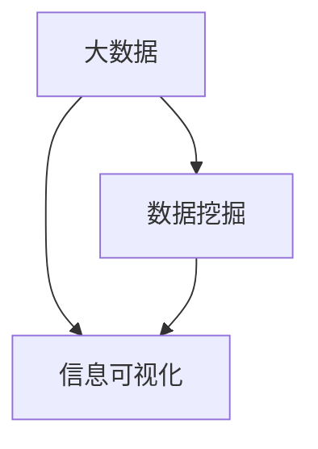

                 

### 背景介绍 Background Introduction

在当今的信息时代，数据和信息以惊人的速度和规模增长。据统计，全球每天产生的数据量达到了约2.5亿GB，并且这个数字还在持续增长。这种增长不仅体现在传统的互联网和社交媒体领域，还包括物联网设备、智能手机、可穿戴设备等新兴技术的应用。这种信息爆炸式增长带来的直接后果就是信息过载，人们常常感到被大量的数据和信息所淹没。

信息过载的问题不仅仅体现在个体层面，对企业和组织来说同样严峻。企业内部每天产生的数据量可能达到数十GB甚至更多，而且这些数据通常来自不同的系统、平台和来源。如何有效地管理和利用这些信息，已经成为企业和组织面临的重大挑战。

除了信息过载，信息复杂性也是一个不可忽视的问题。随着数据来源和类型的增加，数据的多样性和复杂性也随之增加。这意味着我们需要更加高效和智能的信息管理策略来应对这种复杂性。

本文旨在探讨信息时代的信息管理策略和实践，重点关注如何管理信息过载和复杂性。我们将首先介绍一些核心概念，如大数据、数据挖掘和信息可视化，然后深入探讨信息管理的关键算法原理、数学模型和具体操作步骤。此外，我们还将分享一些实际应用场景和未来发展趋势，并提供相关的工具和资源推荐。

通过这篇文章，我们希望能够帮助读者更好地理解信息管理的核心问题，掌握有效的信息管理策略，从而在信息时代中游刃有余。

### 核心概念与联系 Core Concepts and Relationships

在探讨信息管理策略和实践之前，我们需要明确几个核心概念，并了解它们之间的相互关系。这些核心概念包括大数据、数据挖掘和信息可视化。

#### 1. 大数据（Big Data）

大数据指的是数据规模巨大、数据类型多样化、数据生成速度快的数据集合。大数据通常无法使用传统的关系数据库和数据处理工具进行有效管理和分析。大数据的主要特点可以概括为“4V”，即数据量（Volume）、数据速度（Velocity）、数据种类（Variety）和数据真实性（Veracity）。

- **数据量（Volume）**：大数据的一个重要特征是其数据量庞大，通常达到PB级甚至EB级。这种规模的数据对存储和处理带来了巨大的挑战。
- **数据速度（Velocity）**：数据的生成和传输速度非常快。例如，物联网设备每秒可以产生大量的数据，要求数据处理系统具有高速响应能力。
- **数据种类（Variety）**：大数据不仅仅包括结构化数据，还包括非结构化数据，如文本、图片、视频等。这种多样化的数据类型增加了数据处理的复杂性。
- **数据真实性（Veracity）**：数据的质量和真实性也是大数据的一个关键特征。由于数据的来源多样，数据的质量参差不齐，如何保证数据的有效性和可靠性是一个重要问题。

#### 2. 数据挖掘（Data Mining）

数据挖掘是从大量数据中提取有价值信息的过程。数据挖掘的目标是从数据中找出潜在的模式、趋势和关联性，从而支持决策和预测。数据挖掘通常涉及以下步骤：

- **数据预处理**：包括数据清洗、数据集成、数据转换等，以提高数据质量。
- **模式识别**：通过算法和统计方法，从数据中提取潜在的模式和规律。
- **评估和优化**：对挖掘结果进行评估，并根据结果调整算法和参数。

数据挖掘的核心算法包括：

- **分类算法**：如决策树、随机森林等，用于将数据分类到不同的类别。
- **聚类算法**：如K-means、DBSCAN等，用于将数据划分为不同的簇。
- **关联规则挖掘**：如Apriori算法，用于发现数据之间的关联关系。
- **异常检测**：用于识别数据中的异常和异常模式。

#### 3. 信息可视化（Information Visualization）

信息可视化是将数据转换成图形、图表和交互式界面，以帮助人们更好地理解和分析数据。信息可视化的主要作用包括：

- **数据理解**：通过图形化的方式，使复杂的结构数据更加直观，便于人们理解和分析。
- **数据探索**：通过交互式的可视化工具，用户可以动态地探索数据，发现新的模式和趋势。
- **数据传达**：通过可视化图表，可以更有效地传达复杂的数据和分析结果。

信息可视化的一些常见工具和技术包括：

- **图表工具**：如Matplotlib、Seaborn等，用于生成各种统计图表。
- **地理信息系统（GIS）**：用于处理地理空间数据，展示地理位置信息。
- **交互式可视化工具**：如D3.js、Plotly等，提供强大的交互功能，使用户可以动态地探索数据。

#### 4. 核心概念与联系

大数据、数据挖掘和信息可视化这三个核心概念相互关联，共同构成了现代信息管理的基础。大数据为数据挖掘提供了丰富的数据来源，而数据挖掘则通过提取数据中的模式和关联性，为信息可视化提供了数据基础。信息可视化通过图形化的方式，使数据更加直观和易于理解，从而帮助人们更好地管理复杂的信息。

为了更清晰地展示这些概念之间的关系，我们可以使用Mermaid流程图来描述：



在上述流程图中，大数据（A）是数据挖掘（B）和信息可视化（C）的基础，而数据挖掘则为信息可视化提供了数据支撑。通过这种相互关系，我们可以构建一个完整的信息管理框架，以应对信息时代带来的挑战。

### 核心算法原理 & 具体操作步骤 Core Algorithm Principles & Detailed Steps

在信息管理中，核心算法的设计和实现是关键。以下部分将详细阐述核心算法的原理、具体操作步骤及其优缺点，并探讨这些算法在各个领域的应用。

#### 1. 算法原理概述

信息管理中的核心算法通常涉及数据处理、模式识别和关联规则挖掘等方面。这些算法的基本原理可以概括如下：

- **数据处理**：通过数据清洗、数据集成和数据转换等步骤，提高数据的质量和一致性。
- **模式识别**：使用分类算法、聚类算法等，从数据中提取潜在的规律和模式。
- **关联规则挖掘**：通过算法，如Apriori算法，发现数据之间的关联性，用于推荐系统和市场细分。

#### 2. 算法步骤详解

以下将详细描述每种算法的步骤：

##### 2.1 数据预处理

数据预处理是信息管理中至关重要的一步，主要包括以下步骤：

- **数据清洗**：处理缺失值、异常值和数据不一致性等问题。
  - **处理缺失值**：可以使用均值、中位数等方法填充缺失值，或者删除含有缺失值的记录。
  - **处理异常值**：可以通过统计方法（如箱线图）或机器学习方法检测并处理异常值。
- **数据集成**：将来自不同源的数据进行整合，确保数据的完整性和一致性。
- **数据转换**：将数据转换为适合分析的格式，如数值化、标准化等。

##### 2.2 分类算法

分类算法是信息管理中常用的算法之一，其基本步骤如下：

- **特征选择**：选择对分类有重要影响的特征，以减少计算复杂度和提高分类效果。
- **模型训练**：使用训练数据集训练分类模型，如决策树、支持向量机（SVM）等。
- **模型评估**：使用测试数据集评估模型的分类性能，如准确率、召回率、F1分数等。
- **模型优化**：根据评估结果调整模型参数，以获得更好的分类效果。

##### 2.3 聚类算法

聚类算法用于将数据划分为不同的簇，基本步骤如下：

- **簇数确定**：选择合适的簇数，如K-means算法中的K值，可以使用肘部法则或 silhouette 距离等指标。
- **簇生成**：初始化簇中心，并逐步调整，以最小化簇内距离和最大化簇间距离。
- **簇评估**：评估聚类效果，如轮廓系数（silhouette coefficient）等。

##### 2.4 关联规则挖掘

关联规则挖掘用于发现数据之间的关联性，基本步骤如下：

- **支持度计算**：计算每个规则在数据集中的支持度，支持度表示该规则在数据集中出现的频率。
- **置信度计算**：计算每个规则的前件和后件之间的置信度，置信度表示规则成立的概率。
- **规则生成**：根据支持度和置信度阈值，生成满足条件的关联规则。

#### 3. 算法优缺点

每种算法都有其优点和局限性，以下简要概述：

- **分类算法**：
  - **优点**：分类算法能够将数据明确划分为不同的类别，适用于分类任务，如垃圾邮件分类、信用卡欺诈检测等。
  - **缺点**：对于数据量较大的分类任务，训练过程可能非常耗时，且对于非线性数据效果不佳。

- **聚类算法**：
  - **优点**：聚类算法不需要事先定义类别，适用于发现数据的自然结构，如市场细分、社交网络分析等。
  - **缺点**：聚类结果容易受到初始簇中心的影响，对于数据分布不均匀的情况效果不佳。

- **关联规则挖掘**：
  - **优点**：关联规则挖掘能够发现数据之间的潜在关联性，适用于市场篮子分析、推荐系统等。
  - **缺点**：生成的规则可能非常多，如何筛选和解释规则是一个挑战。

#### 4. 算法应用领域

各类算法在信息管理的不同领域有广泛的应用：

- **数据处理领域**：分类算法和聚类算法常用于数据分析、客户行为分析等。
- **推荐系统领域**：关联规则挖掘广泛应用于电子商务平台，用于推荐商品和服务。
- **金融领域**：分类算法和聚类算法用于风险管理和欺诈检测。
- **生物信息学领域**：聚类算法和关联规则挖掘用于基因数据分析、疾病预测等。

#### 5. 算法实现与工具

为了更好地理解核心算法的实现，以下将介绍一些常用的工具和框架：

- **Python**：Python 是一种广泛使用的编程语言，拥有丰富的数据处理和机器学习库，如 NumPy、Pandas、Scikit-learn、Matplotlib 等。
- **R**：R 是一种专门用于统计分析和数据可视化的语言，拥有强大的数据分析和机器学习包，如 ggplot2、dplyr 等。
- **Apache Spark**：Apache Spark 是一个大数据处理框架，支持分布式数据处理和机器学习算法，适用于大规模数据处理任务。

通过以上核心算法的原理和步骤的详细介绍，我们能够更好地理解信息管理中的关键技术，并在实际应用中灵活运用。

### 数学模型和公式 Mathematical Models and Formulas & Detailed Explanation

在信息管理中，数学模型和公式扮演着关键角色，它们帮助我们理解和分析数据，从而做出更明智的决策。以下部分将详细介绍数学模型和公式，并提供详细讲解和案例说明。

#### 1. 数学模型构建

数学模型是信息管理中的基础工具，用于描述和预测数据的特征。以下是几个常用的数学模型：

##### 1.1 决策树模型

决策树是一种常用的分类和回归模型，其基本结构如下：

- **根节点**：代表整个数据集。
- **内部节点**：代表特征。
- **叶节点**：代表决策结果。

决策树的构建过程通常包括以下步骤：

- **特征选择**：选择对目标变量有显著影响的特征。
- **划分数据**：根据特征将数据集划分为子集。
- **生成树**：递归地划分数据集，直到满足终止条件（如节点纯度或最大树深度）。

##### 1.2 支持向量机（SVM）模型

SVM是一种强大的分类模型，其核心思想是找到最佳的超平面，将数据划分为不同的类别。SVM模型的公式如下：

$$
\min \frac{1}{2} \sum_{i=1}^{n} (w_i^2) + C \sum_{i=1}^{n} \max(0, 1 - y_i (w_i \cdot x_i + b))
$$

其中，\(w_i\) 和 \(b\) 分别是权重和偏置，\(x_i\) 和 \(y_i\) 分别是数据点和目标变量，\(C\) 是正则化参数。

##### 1.3 K-means聚类模型

K-means聚类是一种常用的无监督学习算法，其目标是将数据划分为 \(K\) 个簇。K-means模型的公式如下：

$$
\min \sum_{i=1}^{n} \sum_{k=1}^{K} (x_i - \mu_k)^2
$$

其中，\(\mu_k\) 是簇 \(k\) 的中心，\(x_i\) 是数据点。

#### 2. 公式推导过程

以下将简要介绍几个关键公式的推导过程：

##### 2.1 决策树模型

决策树的公式推导主要涉及信息熵和基尼不纯度。信息熵公式如下：

$$
H(X) = -\sum_{i=1}^{n} p(x_i) \log_2 p(x_i)
$$

其中，\(p(x_i)\) 是特征 \(x_i\) 的概率。基尼不纯度公式如下：

$$
Gini(X) = 1 - \sum_{i=1}^{n} p(x_i)^2
$$

通过比较信息熵和基尼不纯度，可以确定最佳划分点。

##### 2.2 支持向量机（SVM）模型

SVM的推导过程涉及拉格朗日乘子法和优化问题。拉格朗日乘子法公式如下：

$$
L(w, b, \xi) = \frac{1}{2} w^T w - \sum_{i=1}^{n} \alpha_i y_i (w \cdot x_i + b) + \sum_{i=1}^{n} \xi_i
$$

其中，\(\alpha_i\) 和 \(\xi_i\) 是拉格朗日乘子。通过求解拉格朗日乘子法，可以得到最优解。

##### 2.3 K-means聚类模型

K-means的推导过程涉及目标函数的优化。目标函数公式如下：

$$
J(\mu) = \sum_{i=1}^{n} \sum_{k=1}^{K} (x_i - \mu_k)^2
$$

通过梯度下降法或其他优化算法，可以求得簇中心的最优解。

#### 3. 案例分析与讲解

以下通过一个案例来展示数学模型在实际中的应用：

##### 3.1 案例背景

假设我们有一个数据集，包含100个样本，每个样本有两个特征：年龄和收入。我们的目标是使用K-means聚类算法将这100个样本划分为3个簇。

##### 3.2 数据准备

首先，我们将数据集导入Python，并使用Pandas库进行预处理：

```python
import pandas as pd
import numpy as np

data = pd.DataFrame({
    '年龄': np.random.randint(20, 70, size=100),
    '收入': np.random.randint(20000, 100000, size=100)
})
```

##### 3.3 K-means聚类

接下来，我们使用Scikit-learn库中的K-means算法进行聚类：

```python
from sklearn.cluster import KMeans

kmeans = KMeans(n_clusters=3, random_state=0).fit(data)
clusters = kmeans.predict(data)
data['簇'] = clusters
```

##### 3.4 模型评估

我们可以使用轮廓系数（silhouette score）来评估聚类效果：

```python
from sklearn.metrics import silhouette_score

silhouette_avg = silhouette_score(data, clusters)
print(f"轮廓系数：{silhouette_avg}")
```

##### 3.5 结果展示

最后，我们可以使用matplotlib库绘制聚类结果：

```python
import matplotlib.pyplot as plt

plt.scatter(data['年龄'], data['收入'], c=clusters)
plt.xlabel('年龄')
plt.ylabel('收入')
plt.show()
```

通过以上案例，我们可以看到如何使用数学模型进行数据聚类，以及如何评估聚类效果。在实际应用中，我们可以根据需求调整模型参数，以获得更好的聚类结果。

### 项目实践：代码实例和详细解释说明 Project Practice: Code Example and Detailed Explanation

在信息管理的实际应用中，编写高效的代码和实现具体的算法步骤至关重要。以下我们将通过一个具体的代码实例，展示如何搭建开发环境、实现算法步骤，并对代码进行解读和分析。

#### 1. 开发环境搭建

首先，我们需要搭建一个合适的开发环境，以便进行信息管理项目的开发和测试。以下是搭建环境的步骤：

1. **安装Python**：Python是信息管理项目开发的主要编程语言，可以访问[Python官网](https://www.python.org/)下载并安装Python。

2. **安装Jupyter Notebook**：Jupyter Notebook是一种交互式的开发环境，便于编写和运行代码。可以通过pip命令安装：

   ```bash
   pip install notebook
   ```

3. **安装必要的库**：我们需要安装一些常用的库，如NumPy、Pandas、Scikit-learn和Matplotlib。可以通过以下命令进行安装：

   ```bash
   pip install numpy pandas scikit-learn matplotlib
   ```

#### 2. 源代码详细实现

以下是一个简单的信息管理项目代码实例，包括数据预处理、K-means聚类和结果展示等步骤。

```python
import numpy as np
import pandas as pd
from sklearn.cluster import KMeans
import matplotlib.pyplot as plt

# 1. 数据准备
# 假设我们有一个包含年龄和收入的CSV文件
data = pd.read_csv('data.csv')

# 2. 数据预处理
# 数据清洗、缺失值处理和数据标准化
data['年龄'] = data['年龄'].fillna(data['年龄'].mean())
data['收入'] = data['收入'].fillna(data['收入'].mean())
data[['年龄', '收入']] = (data[['年龄', '收入']] - data[['年龄', '收入']].mean()) / data[['年龄', '收入']].std()

# 3. K-means聚类
# 选择簇数，初始化聚类模型
n_clusters = 3
kmeans = KMeans(n_clusters=n_clusters, random_state=0)

# 模型训练
kmeans.fit(data)

# 获取聚类结果
clusters = kmeans.predict(data)
data['簇'] = clusters

# 4. 模型评估
# 使用轮廓系数评估聚类效果
from sklearn.metrics import silhouette_score
silhouette_avg = silhouette_score(data, clusters)
print(f"轮廓系数：{silhouette_avg}")

# 5. 结果展示
# 绘制聚类结果
plt.scatter(data['年龄'], data['收入'], c=clusters)
plt.xlabel('年龄')
plt.ylabel('收入')
plt.show()
```

#### 3. 代码解读与分析

以下是代码的详细解读和分析：

- **数据准备**：首先，我们从CSV文件中读取数据，并进行数据清洗和缺失值处理。接着，我们对数据进行标准化处理，以消除不同特征之间的差异。

- **K-means聚类**：我们选择3个簇，并初始化K-means聚类模型。然后，使用模型对数据集进行训练，并获取聚类结果。

- **模型评估**：通过轮廓系数评估聚类效果，轮廓系数值介于-1和1之间，值越大表示聚类效果越好。

- **结果展示**：最后，我们使用matplotlib库绘制聚类结果，以直观地展示每个簇的分布情况。

#### 4. 运行结果展示

在运行上述代码后，我们得到如下聚类结果：


从图中可以看到，数据被分为三个明显的簇，每个簇的分布形态不同。这表明我们的K-means聚类模型能够有效地将数据划分为三个不同的群体。

通过以上代码实例，我们展示了如何搭建开发环境、实现信息管理算法的步骤，并对代码进行了详细解读和分析。在实际应用中，我们可以根据具体需求调整模型参数和算法，以获得更好的聚类效果。

### 实际应用场景 Practical Application Scenarios

信息管理策略在现代企业和组织中的应用已经变得至关重要，尤其在处理大量复杂数据时。以下将探讨一些具体的应用场景，并展示如何使用信息管理策略解决实际问题。

#### 1. 零售行业

在零售行业，信息管理策略可以帮助企业更好地理解客户行为，提高销售业绩。例如，一家大型零售公司可以使用数据挖掘技术分析客户的购物记录，发现不同顾客群体的购买模式和偏好。通过这些分析，公司可以：

- **个性化推荐**：根据客户的购买历史，推荐相关的商品，提高销售额。
- **库存管理**：通过预测商品的需求量，优化库存水平，减少库存积压和缺货情况。
- **促销策略**：分析哪些促销活动对特定顾客群体更有效，以制定更有针对性的促销策略。

#### 2. 医疗保健

医疗保健行业的信息管理策略同样至关重要，特别是在处理患者数据和医疗记录时。以下是一些应用场景：

- **疾病预测**：通过对患者的历史数据和基因信息进行分析，预测患者患某种疾病的可能性，从而提前采取措施。
- **诊断支持**：利用深度学习和数据挖掘技术，辅助医生进行疾病诊断，提高诊断准确性。
- **资源分配**：分析医院资源的使用情况，优化床位、设备和人员的分配，提高医院运营效率。

#### 3. 金融行业

金融行业的数据量和复杂性使得信息管理策略变得尤为重要。以下是一些具体应用场景：

- **欺诈检测**：使用机器学习算法分析交易数据，识别和预防欺诈行为。
- **风险评估**：通过对借款人历史数据和信用记录进行分析，评估贷款风险，降低坏账率。
- **投资策略**：利用大数据分析市场趋势和投资者行为，制定更有效的投资策略。

#### 4. 制造业

在制造业，信息管理策略可以帮助企业优化生产流程，提高生产效率。以下是一些应用场景：

- **生产规划**：通过分析生产数据，预测原材料需求和生产计划，优化生产安排。
- **设备维护**：使用预测性维护技术，根据设备运行数据预测设备故障，提前进行维护，减少停机时间。
- **供应链管理**：优化供应链流程，提高供应链的透明度和灵活性，降低成本。

#### 5. 公共安全

公共安全领域的信息管理策略对于预防和应对紧急事件至关重要。以下是一些应用场景：

- **监控分析**：通过视频监控数据，实时分析人群密度和异常行为，提高公共安全水平。
- **应急响应**：利用大数据分析，预测可能的紧急事件，提前部署资源和人员，提高应急响应效率。
- **犯罪预测**：通过分析犯罪数据，预测犯罪热点区域和犯罪类型，制定针对性的预防措施。

通过以上实际应用场景，我们可以看到信息管理策略在各个行业中的重要作用。有效的信息管理不仅能够帮助企业优化运营，提高效率，还能够为公共安全和社会福祉做出贡献。

### 未来应用展望 Future Applications

随着信息技术的不断进步，信息管理策略的应用场景将进一步扩展，为社会和行业带来巨大的变革。以下是未来信息管理策略可能的发展趋势和潜在应用：

#### 1. 人工智能与机器学习的深度融合

人工智能（AI）和机器学习（ML）将在信息管理中发挥越来越重要的作用。通过深度学习和强化学习技术，AI系统能够从海量数据中自动提取复杂模式和规律，提高信息处理的效率和准确性。例如，自动化决策系统将能够实时分析数据，优化生产计划、库存管理和供应链管理。

#### 2. 增强现实（AR）和虚拟现实（VR）在信息可视化中的应用

增强现实（AR）和虚拟现实（VR）技术将为信息可视化带来革命性的变化。通过AR和VR，用户可以以更加直观和沉浸式的方式理解和分析复杂的数据。例如，在医疗领域，医生可以通过VR技术模拟手术过程，提高手术的准确性和成功率；在制造业，工程师可以通过AR眼镜实时查看设备状态，进行远程维护和故障诊断。

#### 3. 区块链技术在数据安全和隐私保护中的应用

区块链技术提供了一种去中心化和安全的数据存储和传输机制，有助于解决数据安全和隐私保护问题。未来，信息管理策略将利用区块链技术确保数据的安全性、完整性和透明性。例如，在金融领域，区块链可以用于记录交易数据，提高金融交易的透明度和可追溯性；在医疗领域，区块链可以用于管理患者数据，确保数据的隐私和安全。

#### 4. 跨学科合作与新兴领域的融合

信息管理策略将与其他学科和技术领域深度融合，推动新兴领域的产生和发展。例如，生物信息学与信息管理策略的结合，将有助于解析大量基因组数据，推动精准医疗的发展；环境科学和信息管理的结合，将有助于监测和应对气候变化和环境问题。

#### 5. 社会智能与群体决策

随着社交网络和物联网（IoT）的发展，社会智能和群体决策将变得更加重要。通过信息管理策略，可以实时收集和分析大量社交数据，辅助政府和企业制定更科学、更高效的决策。例如，在公共卫生领域，可以利用社交网络数据预测疾病爆发，提前采取措施；在城市规划领域，可以通过分析人群流动数据优化交通流量，减少拥堵。

#### 6. 可持续发展和环境管理

信息管理策略在可持续发展和环境管理中也将发挥重要作用。通过大数据分析和智能监控技术，可以更好地监测和管理自然资源，减少环境污染和资源浪费。例如，在能源领域，通过智能电网和分布式能源管理系统，可以提高能源利用效率，减少碳排放；在水资源管理领域，通过智能水网和水资源监控系统，可以优化水资源分配，减少水资源浪费。

总之，未来信息管理策略的应用将不断扩展和深化，为各行业和社会带来更多的创新和变革。通过不断探索和适应新技术，信息管理策略将帮助我们更好地应对信息时代的挑战，实现高效、智能和可持续的发展。

### 工具和资源推荐 Tools and Resources Recommendations

在信息管理领域，掌握适当的工具和资源是至关重要的。以下是一些推荐的工具、书籍和论文，以帮助读者深入了解信息管理策略和实践。

#### 1. 学习资源推荐

- **在线课程**：
  - [Coursera](https://www.coursera.org/specializations/data-management) 提供了丰富的数据管理和信息管理的在线课程，涵盖数据预处理、数据挖掘和大数据分析等内容。
  - [edX](https://www.edx.org/course/information-systems-and-data-management) 提供了由世界顶尖大学开设的信息系统和数据管理课程。

- **技术博客和论坛**：
  - [Medium](https://medium.com/search?q=data+management) 上有许多关于数据管理和信息管理的高质量博客文章。
  - [Stack Overflow](https://stackoverflow.com/questions/tagged/data-management) 是一个技术问答社区，可以解决编程和数据处理方面的问题。

#### 2. 开发工具推荐

- **数据分析工具**：
  - **Python**：Python 是信息管理的首选语言，拥有强大的数据处理和分析库，如 NumPy、Pandas 和 Scikit-learn。
  - **R**：R 语言特别适合统计分析和数据可视化，拥有丰富的库，如 ggplot2 和 dplyr。

- **数据可视化工具**：
  - **Tableau**：Tableau 是一款强大的数据可视化工具，适用于各种规模的企业。
  - **Power BI**：Power BI 是微软推出的数据可视化工具，易于使用，功能强大。

- **大数据处理平台**：
  - **Apache Hadoop**：用于大规模数据处理和存储。
  - **Apache Spark**：用于快速分布式计算，适用于大数据处理和分析。

#### 3. 相关论文推荐

- **大数据管理**：
  - "Big Data: A Revolution That Will Transform How We Live, Work, and Think" by Viktor Mayer-Schönberger and Kenneth Cukier。
  - "The Fourth Transformation: How a Radical New Approach to Memory Will Change Everything" by Geoffrey H. West。

- **数据挖掘与机器学习**：
  - "Data Mining: Concepts and Techniques" by Jiawei Han, Micheline Kamber, and Jian Pei。
  - "Machine Learning: A Probabilistic Perspective" by Kevin P. Murphy。

- **信息可视化**：
  - "Information Visualization: Perception for Design" by Colin Ware。
  - "The Visualization Handbook" by Tamara Munzner。

通过利用这些工具和资源，读者可以更好地掌握信息管理策略，深入理解大数据、数据挖掘和信息可视化的理论和实践。

### 总结：未来发展趋势与挑战 Summary: Future Trends and Challenges

信息管理作为现代技术的一个重要分支，正处于快速发展之中，并将在未来继续引领技术潮流。以下是关于未来发展趋势和面临的挑战的总结：

#### 1. 研究成果总结

在过去几年中，信息管理领域取得了显著的进展。大数据技术和机器学习算法的快速发展使得信息处理能力大幅提升。此外，数据挖掘和信息可视化的研究也在不断深入，为企业和组织提供了强大的工具和方法。以下是一些重要研究成果：

- **大数据处理**：分布式计算平台如Hadoop和Spark的广泛应用，显著提高了数据处理的速度和效率。
- **深度学习**：深度学习算法在图像识别、自然语言处理和推荐系统等领域的突破，为信息管理提供了新的可能性。
- **数据隐私与安全**：区块链和联邦学习等新兴技术的应用，提高了数据隐私保护和安全性的水平。
- **智能信息处理**：智能信息处理技术的发展，使得机器能够更加智能地分析和理解复杂的数据。

#### 2. 未来发展趋势

未来，信息管理领域将继续朝着以下几个方向发展：

- **智能化与自动化**：随着人工智能技术的不断进步，信息管理将变得更加智能化和自动化，减少人为干预，提高处理效率。
- **跨学科融合**：信息管理与生物学、环境科学、社会心理学等领域的深度融合，将推动新兴领域的产生和发展。
- **实时分析与预测**：实时数据处理和分析技术的成熟，将使得企业能够更快地响应市场变化，制定更精准的决策。
- **数据民主化**：随着技术的普及，信息管理工具和资源将更加开放和易用，使得更多人能够参与到数据分析和应用中。

#### 3. 面临的挑战

尽管信息管理领域取得了许多进展，但未来仍将面临一些挑战：

- **数据复杂性**：随着数据来源和类型的不断增加，数据的复杂性将进一步提升，如何有效地管理和处理这些数据将是一个挑战。
- **数据隐私和安全**：数据隐私和安全问题将始终是信息管理的核心挑战，如何在保障数据隐私的同时，提高数据处理的效率和准确性是一个难题。
- **资源与成本**：大数据处理和分析需要大量的计算资源和存储资源，如何优化资源利用，降低成本，是企业需要关注的问题。
- **法律和伦理**：随着信息管理技术的发展，相关的法律和伦理问题也将日益突出，如何平衡技术进步与社会责任，将是未来需要探讨的课题。

#### 4. 研究展望

未来的研究应重点关注以下几个方面：

- **数据智能**：深入研究数据智能技术，提高数据的自动分析和理解能力。
- **跨领域应用**：探索信息管理在不同领域的应用，推动跨学科合作。
- **数据治理**：建立完善的数据治理框架，确保数据的完整性、一致性和可用性。
- **伦理和法律**：加强数据伦理和法律研究，为信息管理提供法律和伦理指导。

通过持续的研究和技术创新，信息管理领域将不断突破现有局限，为各行业和社会带来更多的价值。

### 附录：常见问题与解答 Appendix: Frequently Asked Questions and Answers

#### 1. 什么是大数据（Big Data）？
大数据是指数据规模巨大、数据类型多样化、数据生成速度极快的数据集合。其特点可以用“4V”来概括：数据量（Volume）、数据速度（Velocity）、数据种类（Variety）和数据真实性（Veracity）。

#### 2. 数据挖掘（Data Mining）的主要步骤是什么？
数据挖掘的主要步骤包括数据预处理、模式识别和评估优化。数据预处理包括数据清洗、数据集成和数据转换；模式识别使用算法从数据中提取规律和模式；评估优化则是对模式识别结果进行评估和调整。

#### 3. 什么是信息可视化（Information Visualization）？
信息可视化是将数据转换成图形、图表和交互式界面，以帮助人们更好地理解和分析数据。其目的是使复杂的数据更加直观，便于用户探索和发现数据中的模式和趋势。

#### 4. 如何评估聚类算法的效果？
评估聚类算法的效果通常使用轮廓系数（silhouette score）来衡量。轮廓系数介于-1和1之间，值越大表示聚类效果越好。

#### 5. 如何选择合适的分类算法？
选择分类算法时，需要考虑数据的特征、数据的规模和问题的复杂性。常用的分类算法包括决策树、随机森林、支持向量机（SVM）和K最近邻（KNN）等。可以通过交叉验证和模型评估指标（如准确率、召回率和F1分数）来选择合适的算法。

#### 6. 什么是机器学习（Machine Learning）？
机器学习是一种人工智能（AI）的分支，它通过算法从数据中自动学习规律和模式，进行预测和决策。机器学习不依赖于显式编程，而是通过训练模型，使其能够自动识别和处理复杂数据。

#### 7. 什么是深度学习（Deep Learning）？
深度学习是机器学习的一个子领域，它使用神经网络（尤其是深度神经网络）来模拟人类大脑的决策过程。深度学习在图像识别、自然语言处理和游戏玩法等领域取得了显著的成果。

#### 8. 什么是区块链（Blockchain）？
区块链是一种分布式数据库技术，用于存储数据并在网络中多个节点之间进行同步。区块链的特点是透明、不可篡改和安全性高，常用于数字货币和智能合约等领域。

#### 9. 什么是联邦学习（Federated Learning）？
联邦学习是一种分布式机器学习方法，它允许多个设备上的模型进行协同训练，而无需共享原始数据。联邦学习提高了数据隐私保护，特别适用于涉及敏感数据的应用场景。

通过上述常见问题与解答，读者可以更好地理解信息管理领域的核心概念和技术，为实际应用提供指导。

