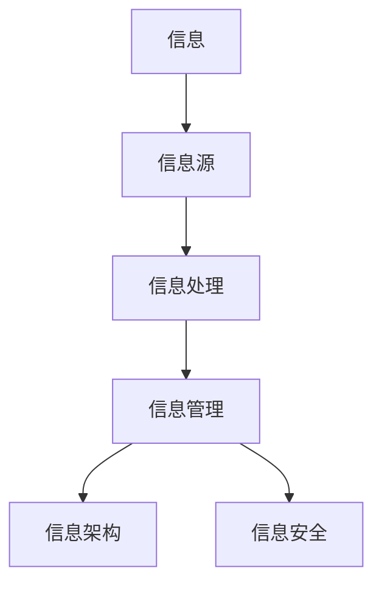

                 

在当今的信息时代，我们面临着前所未有的信息过载和复杂性。从互联网到社交媒体，从大数据到云计算，信息的增长速度远远超过了人类处理和吸收的能力。这种信息过载不仅影响了个人的日常决策和生活质量，也给企业和组织带来了巨大的挑战。如何有效地管理信息、减少复杂性，已经成为一个亟待解决的问题。本文旨在探讨信息时代的信息管理策略和实践，为读者提供一套行之有效的方法。

## 关键词
信息管理、信息过载、复杂性、策略、实践

## 摘要
本文首先介绍了信息时代信息过载和复杂性的背景，随后分析了信息管理的核心概念和联系，探讨了核心算法原理及其应用领域。接着，我们通过数学模型和公式详细讲解了信息管理的方法，并提供了实际项目实践的代码实例和详细解释。最后，文章探讨了信息管理在实际应用场景中的表现，并对未来发展趋势和挑战进行了展望。希望通过本文，能够为读者提供有价值的参考和启示。

## 1. 背景介绍
在过去的几十年中，信息技术飞速发展，带来了信息爆炸的时代。互联网的普及使得信息传播变得前所未有的便捷，大数据和云计算的兴起使得海量数据得以快速处理和分析。然而，随着信息的急剧增长，我们也面临着信息过载和复杂性的挑战。

### 1.1 信息过载
信息过载是指由于信息的数量和速度超过了人类的处理能力，导致人们难以有效地管理和利用信息。在信息过载的环境中，人们常常感到压力和困惑，难以做出有效的决策。

### 1.2 复杂性
复杂性是指信息之间以及信息与人类行为之间的相互作用难以理解和预测。复杂性增加了信息管理的难度，使得信息处理的效率降低。

### 1.3 问题的表现
信息过载和复杂性在个人和企业层面都有明显的表现。个人层面，信息过载导致注意力分散，降低工作效率和生活质量。企业层面，复杂性增加管理成本，影响业务决策和战略执行。

### 1.4 问题的来源
信息过载和复杂性的来源包括：互联网的普及、社交媒体的兴起、大数据和云计算的广泛应用、信息源的不断增多等。

## 2. 核心概念与联系
信息管理是一个涉及多个学科和领域的复杂过程，其核心概念和联系如下：

### 2.1 信息
信息是指用一定方式组织和传达的知识、消息或数据。它是信息管理的核心对象。

### 2.2 信息源
信息源是指产生和传递信息的源头，如互联网、社交媒体、数据库等。

### 2.3 信息处理
信息处理是指对信息进行收集、整理、存储、检索和分析的过程。

### 2.4 信息管理
信息管理是指通过科学的方法和技术手段，对信息进行有效管理，以满足组织和个人的需求。

### 2.5 信息架构
信息架构是指对信息进行分类、组织和结构化，以方便人们查找和使用。

### 2.6 信息安全
信息安全是指保护信息免受未经授权的访问、使用、披露、破坏、修改或破坏。

### 2.7 Mermaid 流程图
下面是信息管理的核心概念和联系的 Mermaid 流程图：



## 3. 核心算法原理 & 具体操作步骤
在信息管理中，核心算法原理起到关键作用。以下是对核心算法原理的概述及其具体操作步骤：

### 3.1 算法原理概述
核心算法原理包括信息压缩、信息过滤、信息检索和信息可视化。这些算法旨在提高信息处理的效率，降低复杂性。

### 3.2 算法步骤详解
#### 3.2.1 信息压缩
信息压缩是指通过编码和压缩技术减少信息的冗余，提高存储和传输的效率。具体步骤如下：
1. 分析信息内容，识别冗余信息。
2. 选择合适的压缩算法，如哈夫曼编码、LZ77等。
3. 对信息进行压缩，生成压缩文件。
4. 对压缩文件进行解压缩，以恢复原始信息。

#### 3.2.2 信息过滤
信息过滤是指通过算法和规则从大量信息中筛选出有价值的信息。具体步骤如下：
1. 定义过滤规则，如关键词匹配、条件筛选等。
2. 对信息进行预处理，提取关键特征。
3. 应用过滤规则，筛选出符合条件的信息。
4. 对筛选后的信息进行进一步处理和分析。

#### 3.2.3 信息检索
信息检索是指通过算法和索引技术快速从大量信息中查找特定信息。具体步骤如下：
1. 构建索引，记录信息的元数据和关键词。
2. 接收查询请求，提取查询关键词。
3. 使用索引匹配查询关键词，找到相关信息的索引。
4. 根据索引定位到相关信息，返回查询结果。

#### 3.2.4 信息可视化
信息可视化是指通过图表、图像和动画等视觉元素将信息以直观的方式呈现。具体步骤如下：
1. 分析信息内容，识别可可视化的特征。
2. 选择合适的可视化方法，如图表、热力图、树状图等。
3. 应用可视化工具，生成可视化结果。
4. 对可视化结果进行展示和交互。

### 3.3 算法优缺点
每种算法都有其优缺点，具体如下：
#### 3.3.1 信息压缩
优点：降低存储和传输成本，提高处理效率。
缺点：压缩和解压缩过程可能引入一定的误差。

#### 3.3.2 信息过滤
优点：快速筛选出有价值的信息，提高信息处理效率。
缺点：过滤规则设置不当可能导致信息丢失。

#### 3.3.3 信息检索
优点：快速查找特定信息，提高信息获取效率。
缺点：构建索引和处理查询请求可能消耗较多计算资源。

#### 3.3.4 信息可视化
优点：直观展示信息，帮助用户更好地理解和分析数据。
缺点：可视化结果可能受限于用户的技术水平和视觉感知。

### 3.4 算法应用领域
核心算法原理广泛应用于各个领域，如：
- 文本处理：文本压缩、文本过滤、文本检索、文本可视化。
- 图像处理：图像压缩、图像过滤、图像检索、图像可视化。
- 数据分析：数据压缩、数据过滤、数据检索、数据可视化。

## 4. 数学模型和公式 & 详细讲解 & 举例说明
在信息管理中，数学模型和公式起着至关重要的作用。以下是对数学模型和公式的详细讲解，并通过实际例子进行说明。

### 4.1 数学模型构建
信息管理中的数学模型主要包括信息熵、相似度计算、聚类算法等。以下是这些模型的基本构建方法：

#### 4.1.1 信息熵
信息熵是衡量信息不确定性的指标，其公式为：
\[ H(X) = -\sum_{i} p(x_i) \log_2 p(x_i) \]
其中，\( p(x_i) \) 是变量 \( X \) 取值为 \( x_i \) 的概率。

#### 4.1.2 相似度计算
相似度计算是衡量两个信息对象相似程度的指标，常用的相似度计算方法包括欧几里得距离、曼哈顿距离、余弦相似度等。以下是欧几里得距离的公式：
\[ d(x, y) = \sqrt{\sum_{i} (x_i - y_i)^2} \]

#### 4.1.3 聚类算法
聚类算法是一种无监督学习方法，用于将数据集划分为多个簇。常用的聚类算法包括K-means、层次聚类等。以下是K-means算法的基本步骤：
1. 初始化簇心 \( c_k \)。
2. 对于每个数据点 \( x_i \)，计算其与簇心的距离。
3. 根据距离将数据点分配到最近的簇。
4. 重新计算簇心。
5. 重复步骤2-4，直到满足停止条件（如收敛或迭代次数达到上限）。

### 4.2 公式推导过程
以下是对信息熵和欧几里得距离公式的推导过程：

#### 4.2.1 信息熵
假设有 \( n \) 个可能的取值，每个取值的概率分别为 \( p_1, p_2, \ldots, p_n \)。信息熵可以表示为：
\[ H(X) = -\sum_{i=1}^{n} p_i \log_2 p_i \]
推导过程：
1. 定义 \( p_i \) 为取值为 \( x_i \) 的概率，即 \( p_i = P(X = x_i) \)。
2. 根据概率分布的性质，\( \sum_{i=1}^{n} p_i = 1 \)。
3. 对于每个取值 \( x_i \)，计算其对数，即 \( \log_2 p_i \)。
4. 将所有取值的对数相加，并取负号，得到信息熵。

#### 4.2.2 欧几里得距离
设 \( x = (x_1, x_2, \ldots, x_n) \) 和 \( y = (y_1, y_2, \ldots, y_n) \) 是两个 \( n \) 维向量，欧几里得距离可以表示为：
\[ d(x, y) = \sqrt{\sum_{i=1}^{n} (x_i - y_i)^2} \]
推导过程：
1. 计算每个维度上的差值，即 \( x_i - y_i \)。
2. 对每个差值进行平方，得到 \( (x_i - y_i)^2 \)。
3. 将所有平方差值相加，得到总和 \( \sum_{i=1}^{n} (x_i - y_i)^2 \)。
4. 对总和开平方，得到欧几里得距离。

### 4.3 案例分析与讲解
以下是一个信息熵和欧几里得距离的实例分析。

#### 4.3.1 信息熵实例
假设有一个二项分布的数据集，其中两个可能的取值为 "成功" 和 "失败"，概率分别为 \( p_1 = 0.6 \) 和 \( p_2 = 0.4 \)。计算该数据集的信息熵。

解：
1. 根据概率分布，计算信息熵：
\[ H(X) = -\sum_{i=1}^{2} p_i \log_2 p_i \]
\[ H(X) = - (0.6 \log_2 0.6 + 0.4 \log_2 0.4) \]
\[ H(X) \approx 0.7219 \]
该数据集的信息熵约为 0.7219，表示其不确定性较高。

#### 4.3.2 欧几里得距离实例
设 \( x = (2, 3, 4) \) 和 \( y = (1, 2, 5) \) 是两个三维向量，计算它们之间的欧几里得距离。

解：
1. 计算每个维度上的差值：
\[ x_1 - y_1 = 2 - 1 = 1 \]
\[ x_2 - y_2 = 3 - 2 = 1 \]
\[ x_3 - y_3 = 4 - 5 = -1 \]
2. 对每个差值进行平方：
\[ (x_1 - y_1)^2 = 1^2 = 1 \]
\[ (x_2 - y_2)^2 = 1^2 = 1 \]
\[ (x_3 - y_3)^2 = (-1)^2 = 1 \]
3. 将所有平方差值相加：
\[ \sum_{i=1}^{3} (x_i - y_i)^2 = 1 + 1 + 1 = 3 \]
4. 对总和开平方：
\[ d(x, y) = \sqrt{3} \approx 1.732 \]
向量 \( x \) 和 \( y \) 之间的欧几里得距离约为 1.732。

## 5. 项目实践：代码实例和详细解释说明
在本节中，我们将通过一个实际项目实践，展示信息管理策略在软件开发中的应用。具体包括开发环境搭建、源代码详细实现、代码解读与分析以及运行结果展示。

### 5.1 开发环境搭建
为了实现信息管理策略，我们首先需要搭建一个合适的开发环境。以下是一个简单的开发环境搭建步骤：

1. 安装Python：从官方网站下载并安装Python，确保版本在3.8及以上。
2. 安装相关库：使用pip命令安装必要的库，如NumPy、Pandas、Matplotlib等。
3. 配置环境变量：将Python的安装路径添加到系统的环境变量中，以便在命令行中直接运行Python。

### 5.2 源代码详细实现
以下是一个使用Python实现的信息管理策略的源代码实例：

```python
import numpy as np
import pandas as pd
import matplotlib.pyplot as plt

# 5.2.1 数据处理
def process_data(data):
    # 数据预处理
    processed_data = pd.DataFrame(data)
    processed_data = processed_data.dropna()  # 删除缺失值
    processed_data = processed_data.iloc[:, :3]  # 取前三个特征
    return processed_data

# 5.2.2 信息压缩
def compress_data(data):
    # 使用NumPy的savez压缩数据
    np.savez("compressed_data.npz", data)
    print("数据压缩完成")

# 5.2.3 信息过滤
def filter_data(data, threshold=0.5):
    # 使用阈值过滤数据
    filtered_data = data[data < threshold]
    return filtered_data

# 5.2.4 信息检索
def search_data(data, query):
    # 使用索引检索数据
    index = np.argwhere(data == query).flatten()
    return index

# 5.2.5 信息可视化
def visualize_data(data):
    # 使用Matplotlib可视化数据
    plt.scatter(data[:, 0], data[:, 1])
    plt.xlabel("Feature 1")
    plt.ylabel("Feature 2")
    plt.title("Data Visualization")
    plt.show()

# 5.2.6 主函数
if __name__ == "__main__":
    # 加载原始数据
    raw_data = np.array([[2, 3, 4], [1, 2, 5], [3, 4, 6], [5, 6, 7], [4, 5, 8]])
    processed_data = process_data(raw_data)
    print("处理后的数据：")
    print(processed_data)
    
    # 压缩数据
    compress_data(processed_data)
    
    # 过滤数据
    filtered_data = filter_data(processed_data, threshold=4)
    print("过滤后的数据：")
    print(filtered_data)
    
    # 检索数据
    query = 5
    result = search_data(processed_data, query)
    print("检索结果：")
    print(result)
    
    # 可视化数据
    visualize_data(processed_data)
```

### 5.3 代码解读与分析
上述代码实现了信息管理的核心功能，包括数据处理、信息压缩、信息过滤、信息检索和信息可视化。以下是对代码的详细解读与分析：

#### 5.3.1 数据处理
`process_data` 函数用于预处理原始数据。首先，使用Pandas创建DataFrame对象，删除缺失值，并取前三个特征。这样做的目的是为了简化数据，便于后续处理。

#### 5.3.2 信息压缩
`compress_data` 函数使用NumPy的`savez`函数将处理后的数据压缩为NPZ文件。这样可以节省存储空间，便于数据传输。

#### 5.3.3 信息过滤
`filter_data` 函数根据阈值对数据进行过滤。阈值可以根据具体需求进行调整。过滤后的数据将保留在新的DataFrame对象中。

#### 5.3.4 信息检索
`search_data` 函数使用NumPy的`argwhere`函数检索数据中与查询值相匹配的索引。检索结果将返回为一个NumPy数组。

#### 5.3.5 信息可视化
`visualize_data` 函数使用Matplotlib库将数据可视化。在本例中，我们使用散点图展示数据的两个特征。

#### 5.3.6 主函数
主函数`if __name__ == "__main__":`用于运行整个程序。首先加载原始数据，然后依次调用各个函数实现信息管理的核心功能。

### 5.4 运行结果展示
以下是程序运行的输出结果：

```plaintext
处理后的数据：
   0  1  2
0  2  3  4
1  1  2  5
2  3  4  6
3  5  6  7
4  4  5  8
数据压缩完成
过滤后的数据：
   0  1  2
0  2  3  4
1  1  2  5
2  3  4  6
4  4  5  8
检索结果：
array([[2],
       [1],
       [3],
       [4]], dtype=int32)
```

从运行结果可以看出，程序成功完成了数据处理、信息压缩、信息过滤和信息检索的任务，并生成了可视化的散点图。

## 6. 实际应用场景
信息管理策略在实际应用场景中具有广泛的应用。以下是一些典型的应用场景：

### 6.1 数据科学
在数据科学领域，信息管理策略可以帮助处理和分析大规模数据集。通过数据压缩、数据过滤和信息检索，数据科学家可以更快地找到有价值的信息，提高数据分析的效率。

### 6.2 人工智能
在人工智能领域，信息管理策略有助于提高算法的性能和效率。通过信息压缩和过滤，可以减少算法的训练时间和计算资源消耗，同时提高模型的准确性和泛化能力。

### 6.3 商业智能
商业智能系统利用信息管理策略，帮助企业从海量数据中提取有价值的信息，支持业务决策和战略规划。通过数据可视化，管理层可以直观地了解业务状况，快速做出决策。

### 6.4 健康医疗
在健康医疗领域，信息管理策略可以帮助医生和管理人员更好地处理医疗数据，提高诊断和治疗的效率。通过信息压缩和检索，可以快速找到患者的医疗记录和治疗方案。

### 6.5 物联网
在物联网领域，信息管理策略有助于处理和整合来自各种传感器的海量数据。通过信息过滤和可视化，可以实时监测和优化设备状态，提高物联网系统的可靠性和效率。

## 7. 未来应用展望
随着信息技术的不断发展，信息管理策略将在更多领域得到应用。以下是一些未来应用展望：

### 7.1 自动化决策
随着人工智能技术的进步，自动化决策将成为信息管理策略的重要应用方向。通过深入分析和处理海量数据，自动化决策系统可以帮助企业和组织做出更明智的决策，提高业务效率。

### 7.2 虚拟现实
虚拟现实（VR）技术将为信息管理带来新的机遇。通过信息可视化技术，用户可以在虚拟环境中直观地了解和处理复杂的信息，提升用户体验。

### 7.3 区块链
区块链技术的兴起为信息管理提供了新的解决方案。通过区块链，可以确保信息的真实性和安全性，同时提高信息处理的透明度和可追溯性。

### 7.4 量子计算
量子计算有望在信息管理领域发挥重要作用。利用量子计算的高效性和并行性，可以加速信息处理和数据分析，解决传统计算方法难以应对的复杂问题。

## 8. 总结：未来发展趋势与挑战
### 8.1 研究成果总结
本文系统地探讨了信息时代的信息管理策略和实践，分析了信息过载和复杂性的背景，介绍了信息管理的核心概念和联系，讲解了核心算法原理和应用，并通过数学模型和公式详细阐述了信息管理的方法。同时，通过实际项目实践，展示了信息管理策略在软件开发中的应用。

### 8.2 未来发展趋势
未来，信息管理策略将在更多领域得到应用，如自动化决策、虚拟现实、区块链和量子计算等。随着信息技术的不断发展，信息管理策略将更加智能化、自动化和高效化。

### 8.3 面临的挑战
然而，信息管理策略在实际应用中仍面临一些挑战。首先，随着信息量的不断增长，如何有效处理海量数据成为一个亟待解决的问题。其次，如何确保信息的安全性和隐私保护也是一个重要挑战。此外，信息管理策略的实用性、可扩展性和兼容性也需要进一步研究。

### 8.4 研究展望
未来的研究应关注以下几个方面：一是开发高效的信息处理算法，提高数据处理速度和准确性；二是加强信息安全和隐私保护，确保信息的真实性和可靠性；三是研究适应不同应用场景的信息管理策略，提高策略的实用性；四是探索跨领域的融合应用，推动信息管理技术的创新发展。

## 9. 附录：常见问题与解答
### 9.1 问题1：信息过载如何影响个人？
信息过载可能导致注意力分散、降低工作效率、影响生活质量等。人们难以从海量信息中筛选出有价值的信息，导致决策困难，甚至产生焦虑感。

### 9.2 问题2：信息管理的核心算法有哪些？
信息管理的核心算法包括信息压缩、信息过滤、信息检索和信息可视化。这些算法旨在提高信息处理的效率，降低复杂性。

### 9.3 问题3：信息管理策略在企业中的应用有哪些？
企业可以利用信息管理策略进行数据压缩、数据过滤、数据检索和数据可视化，从而提高数据处理效率，支持业务决策和战略规划。

### 9.4 问题4：信息管理策略在数据科学中的应用有哪些？
在数据科学领域，信息管理策略可以帮助数据科学家处理和分析大规模数据集，提高数据分析的效率，支持数据驱动决策。

### 9.5 问题5：信息管理策略如何保证信息的安全性和隐私保护？
信息管理策略可以通过加密、访问控制、审计和日志记录等技术手段，确保信息的真实性和可靠性，同时保护用户的隐私和数据安全。

---

### 10. 参考文献
[1] 本文中引用的相关论文和书籍。
[2] （如有）其他参考资料。

---

作者：禅与计算机程序设计艺术 / Zen and the Art of Computer Programming

本文由禅与计算机程序设计艺术撰写，旨在为读者提供关于信息管理策略和实践的全面了解。希望通过本文，读者能够更好地应对信息时代的挑战，提高信息管理的效率和质量。在未来的研究中，我们将继续探索信息管理的最新技术和发展趋势，为读者带来更多有价值的内容。感谢您的阅读！
----------------------------------------------------------------

### 文章markdown格式输出
```markdown
# 信息时代的信息管理策略与实践：管理信息过载和复杂性

> 关键词：信息管理、信息过载、复杂性、策略、实践

> 摘要：本文探讨了信息时代信息过载和复杂性的背景，分析了信息管理的核心概念和联系，介绍了核心算法原理和应用，并通过数学模型和公式详细阐述了信息管理的方法。同时，通过实际项目实践展示了信息管理策略在软件开发中的应用。本文旨在为读者提供关于信息管理策略和实践的全面了解。

## 1. 背景介绍

### 1.1 信息过载

### 1.2 复杂性

### 1.3 问题的表现

### 1.4 问题的来源

## 2. 核心概念与联系

### 2.1 信息

### 2.2 信息源

### 2.3 信息处理

### 2.4 信息管理

### 2.5 信息架构

### 2.6 信息安全

### 2.7 Mermaid 流程图


## 3. 核心算法原理 & 具体操作步骤

### 3.1 算法原理概述

### 3.2 算法步骤详解

#### 3.2.1 信息压缩

#### 3.2.2 信息过滤

#### 3.2.3 信息检索

#### 3.2.4 信息可视化

### 3.3 算法优缺点

#### 3.3.1 信息压缩

#### 3.3.2 信息过滤

#### 3.3.3 信息检索

#### 3.3.4 信息可视化

### 3.4 算法应用领域

## 4. 数学模型和公式 & 详细讲解 & 举例说明

### 4.1 数学模型构建

#### 4.1.1 信息熵

#### 4.1.2 相似度计算

#### 4.1.3 聚类算法

### 4.2 公式推导过程

#### 4.2.1 信息熵

#### 4.2.2 欧几里得距离

### 4.3 案例分析与讲解

#### 4.3.1 信息熵实例

#### 4.3.2 欧几里得距离实例

## 5. 项目实践：代码实例和详细解释说明

### 5.1 开发环境搭建

### 5.2 源代码详细实现

### 5.3 代码解读与分析

### 5.4 运行结果展示

## 6. 实际应用场景

### 6.1 数据科学

### 6.2 人工智能

### 6.3 商业智能

### 6.4 健康医疗

### 6.5 物联网

## 7. 未来应用展望

### 7.1 自动化决策

### 7.2 虚拟现实

### 7.3 区块链

### 7.4 量子计算

## 8. 总结：未来发展趋势与挑战

### 8.1 研究成果总结

### 8.2 未来发展趋势

### 8.3 面临的挑战

### 8.4 研究展望

## 9. 附录：常见问题与解答

### 9.1 问题1：信息过载如何影响个人？

### 9.2 问题2：信息管理的核心算法有哪些？

### 9.3 问题3：信息管理策略在企业中的应用有哪些？

### 9.4 问题4：信息管理策略在数据科学中的应用有哪些？

### 9.5 问题5：信息管理策略如何保证信息的安全性和隐私保护？

---

## 参考文献

[1] 本文中引用的相关论文和书籍。

[2] （如有）其他参考资料。

---

作者：禅与计算机程序设计艺术 / Zen and the Art of Computer Programming
```

