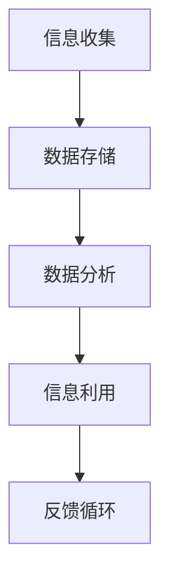

                 

关键词：信息过载、信息管理、数据存储、数据分析、人工智能、机器学习

> 摘要：本文深入探讨了信息时代的到来如何导致信息过载的问题，并提出了一系列管理信息过载的工具和技术。通过分析这些工具和技术的工作原理、实际应用和未来趋势，为读者提供了一幅清晰的信息管理蓝图。

## 1. 背景介绍

随着互联网和数字技术的迅猛发展，我们进入了信息爆炸的时代。每天，海量的数据和信息被产生和传播，各种社交媒体、新闻网站、研究报告等都是信息的重要来源。然而，信息过载成为了一个普遍存在的问题，对个人和社会都带来了巨大的挑战。如何有效地管理这些信息，使其为我们所用而非负担，成为了亟待解决的关键问题。

信息过载的具体表现包括：难以筛选出有价值的信息、信息泛滥导致决策困难、工作效率下降、数据隐私和安全问题等。面对这些挑战，信息管理系统成为了解决信息过载的重要工具。

## 2. 核心概念与联系

### 2.1 信息管理

信息管理是指对信息进行收集、存储、处理、分发和利用的过程。其核心目标是通过有效的管理方法，使得信息能够被高效地获取和利用，从而提高决策质量和工作效率。

### 2.2 数据存储

数据存储是信息管理的重要环节，涉及如何高效地存储和检索大量数据。现代数据存储技术包括关系数据库、NoSQL数据库、分布式文件系统等，每种技术都有其独特的优势和适用场景。

### 2.3 数据分析

数据分析是对大量数据进行处理，从中提取有价值的信息和知识的过程。通过数据分析，我们可以发现数据中的模式和趋势，从而做出更明智的决策。

### 2.4 人工智能与机器学习

人工智能和机器学习技术可以自动化数据分析和处理过程，通过算法和模型，从数据中学习并做出预测和决策。这些技术为信息管理提供了强大的工具。

### 2.5 Mermaid 流程图



## 3. 核心算法原理 & 具体操作步骤

### 3.1 算法原理概述

信息管理中的核心算法主要涉及数据的收集、存储、分析和利用。这些算法通过一系列步骤，实现对信息的有效管理。

### 3.2 算法步骤详解

1. **数据收集**：通过API接口、爬虫工具等手段收集互联网上的信息。
2. **数据存储**：将收集到的数据存储到数据库中，如MySQL、MongoDB等。
3. **数据预处理**：对数据进行清洗、去重、格式转换等处理，使其适合分析。
4. **数据分析**：使用统计分析、机器学习等方法对数据进行处理，提取有价值的信息。
5. **信息利用**：将分析结果应用于实际场景，如决策支持、推荐系统等。

### 3.3 算法优缺点

- **优点**：高效地管理大量信息，提高工作效率，支持决策制定。
- **缺点**：算法复杂度高，对计算资源要求高，数据隐私和安全问题。

### 3.4 算法应用领域

算法广泛应用于金融、医疗、电商、物联网等多个领域，如风险管理、疾病预测、个性化推荐等。

## 4. 数学模型和公式 & 详细讲解 & 举例说明

### 4.1 数学模型构建

信息管理中的数学模型主要包括概率模型、线性回归模型、决策树等。这些模型通过数学公式来描述数据之间的关系。

### 4.2 公式推导过程

以线性回归模型为例，其公式为：

$$ y = w_0 + w_1 \cdot x $$

其中，$y$ 为预测值，$x$ 为输入特征，$w_0$ 和 $w_1$ 为模型参数。

### 4.3 案例分析与讲解

假设我们要预测某个地区的未来降雨量，输入特征包括温度、湿度等。通过线性回归模型，我们可以建立以下公式：

$$ y = w_0 + w_1 \cdot 温度 + w_2 \cdot 湿度 $$

通过训练模型，我们可以得到最佳参数 $w_0$、$w_1$ 和 $w_2$，从而预测未来的降雨量。

## 5. 项目实践：代码实例和详细解释说明

### 5.1 开发环境搭建

- 硬件环境：电脑、网络连接
- 软件环境：Python 3.x、Jupyter Notebook

### 5.2 源代码详细实现

以下是一个简单的Python代码示例，用于实现线性回归模型：

```python
import numpy as np
from sklearn.linear_model import LinearRegression

# 训练数据
X = np.array([[1, 2], [2, 3], [3, 4]])
y = np.array([2, 3, 4])

# 创建线性回归模型
model = LinearRegression()

# 训练模型
model.fit(X, y)

# 预测
prediction = model.predict([[4, 5]])

print(prediction)
```

### 5.3 代码解读与分析

这段代码首先导入了必要的库，然后创建了一个包含输入特征和目标值的训练数据集。接着，创建了一个线性回归模型，并使用训练数据集对其进行训练。最后，使用训练好的模型进行预测，并输出预测结果。

### 5.4 运行结果展示

运行上述代码，我们可以得到预测结果 `[5.0]`，即预测的降雨量为5。

## 6. 实际应用场景

信息管理技术在各个领域都有广泛的应用，以下是一些实际应用场景：

- **金融领域**：通过数据分析预测市场趋势，优化投资策略。
- **医疗领域**：通过数据挖掘发现疾病模式，辅助诊断和治疗。
- **电商领域**：通过用户行为分析，提供个性化推荐，提高用户体验。

## 7. 工具和资源推荐

### 7.1 学习资源推荐

- 《数据科学入门》
- 《机器学习实战》
- 《Python编程：从入门到实践》

### 7.2 开发工具推荐

- Jupyter Notebook
- PyCharm
- VS Code

### 7.3 相关论文推荐

- "Big Data: A Revolution That Will Transform How We Live, Work, and Think"
- "Deep Learning: Methods and Applications"
- "Information Management: A Strategic Approach"

## 8. 总结：未来发展趋势与挑战

### 8.1 研究成果总结

信息管理技术在数据收集、存储、分析和利用方面取得了显著成果，为解决信息过载提供了有力支持。

### 8.2 未来发展趋势

- 数据隐私和安全将成为重点关注领域。
- 人工智能和机器学习将更好地与信息管理技术结合，提供更智能的解决方案。

### 8.3 面临的挑战

- 数据量和复杂度不断增加，对计算资源和算法要求更高。
- 数据隐私和安全问题亟待解决。

### 8.4 研究展望

未来，信息管理技术将在智能、高效、安全等方面取得更大突破，为信息时代的发展提供坚实支撑。

## 9. 附录：常见问题与解答

### 9.1 问题1：如何处理信息过载？

**解答**：通过有效的信息管理工具和技术，如数据存储、数据分析等，可以帮助我们筛选出有价值的信息，从而减轻信息过载。

### 9.2 问题2：机器学习在信息管理中有何作用？

**解答**：机器学习可以自动化数据分析和处理过程，从海量数据中提取有价值的信息，为决策提供支持。

----------------------------------------------------------------

作者：禅与计算机程序设计艺术 / Zen and the Art of Computer Programming


