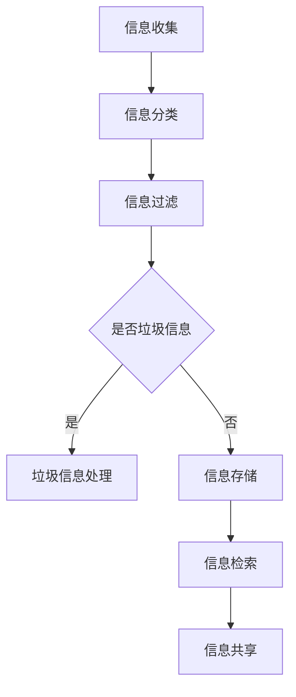

                 

 关键词：信息管理，信息过载，生产力，数据处理，人工智能

> 摘要：在当今信息爆炸的时代，信息过载已经成为影响个人和团队工作效率的普遍问题。本文将探讨如何通过有效的信息管理策略，特别是利用人工智能技术，来降低信息过载，提高个人和团队的生产力。

## 1. 背景介绍

在数字化和信息化的浪潮中，信息的产生和传播速度不断加快，信息的种类和数量也在急剧增长。这不仅改变了我们的生活方式，也深刻影响了工作和生产。然而，随着信息量的激增，人们面临着信息过载的问题。信息过载指的是接收和处理的信息量超出了个人的处理能力，导致工作效率下降，甚至产生心理压力。据统计，平均每个上班族每天要处理超过100封电子邮件，阅读数小时的信息，而智能手机的即时通讯和社交媒体应用更是加剧了这一现象。因此，如何有效地管理信息，提高信息处理效率，成为当前亟待解决的问题。

### 信息过载的来源

信息过载的来源主要包括以下几个方面：

1. **电子邮件**：电子邮件是现代工作中最常用的沟通方式，但由于其匿名性和广泛性，往往会导致大量无关紧要的信息涌入。
2. **社交媒体**：社交媒体平台如微信、Facebook、Twitter等，提供了即时沟通和信息分享的便利，但同时也带来了大量的噪音信息。
3. **在线新闻和资讯**：互联网上充斥着各种新闻和资讯，用户往往无法筛选出对自己真正有价值的信息。
4. **文件和报告**：企业内部和团队之间经常需要共享和交换大量的文件和报告，这些文档往往包含大量冗余和重复的信息。
5. **内部通讯**：企业内部的即时通讯工具，如Slack、企业微信等，也会产生大量的实时消息和通知，分散了员工的工作注意力。

### 信息过载的影响

信息过载对个人和团队的工作效率产生了多方面的影响：

1. **注意力分散**：过多的信息会分散员工的注意力，导致无法集中精力完成工作任务。
2. **时间浪费**：处理无关或低价值信息会消耗大量的时间，影响工作的进度和效率。
3. **压力增加**：面对大量的信息和任务，员工往往会感到压力和焦虑，影响心理健康。
4. **决策困难**：信息过载会使决策变得更加困难，因为难以从大量信息中提取关键点和有效信息。
5. **创造力下降**：信息过载会消耗大量的认知资源，导致创造力和创新能力的下降。

因此，解决信息过载问题，提高信息处理效率，已经成为提升个人和团队生产力的关键。

## 2. 核心概念与联系

### 2.1 信息管理的核心概念

信息管理是指通过规划、组织、控制、存储和分发信息，以实现信息的高效利用和价值的最大化。在信息管理中，以下几个核心概念是不可或缺的：

1. **信息分类**：将信息按照其内容、来源、重要性等进行分类，以便于快速查找和利用。
2. **信息过滤**：通过过滤技术，将无关或低价值的垃圾信息排除在外，确保接收到的信息是有用的。
3. **信息存储**：采用有效的存储方式，确保信息的安全和持久性，并便于日后的检索和查询。
4. **信息共享**：通过共享机制，确保信息能在团队内部或组织内快速、安全地传播，提高协作效率。

### 2.2 信息处理流程的 Mermaid 流程图



- **A[信息收集]**：信息收集是信息管理的起点，涉及从各种渠道获取信息。
- **B[信息分类]**：信息分类是根据信息的性质和用途将其分为不同的类别。
- **C[信息过滤]**：信息过滤是为了排除垃圾信息，只保留对用户有价值的信息。
- **D{是否垃圾信息}]：这是一个判断节点，用于判断信息是否为垃圾信息。
- **E[垃圾信息处理]**：对垃圾信息进行处理，如删除、归档等。
- **F[信息存储]**：将有用信息存储在数据库或文件系统中，确保信息的安全和持久性。
- **G[信息检索]**：信息检索是用户根据需求查找所需信息的过程。
- **H[信息共享]**：信息共享是将信息在团队或组织内进行传播和共享。

### 2.3 信息管理的目标

信息管理的最终目标是提高信息的利用效率，减少信息过载，从而提升个人和团队的生产力。具体目标包括：

1. **提高信息获取速度**：通过有效的信息分类和过滤，用户可以快速获取到需要的信息。
2. **减少信息冗余**：通过信息整合和去重，避免重复处理相同的信息，节省时间和精力。
3. **提升信息价值**：通过信息的深度加工和整理，将信息转化为知识和智慧，提高决策的准确性和效率。
4. **保障信息安全**：通过严格的权限管理和加密技术，确保信息的安全和隐私。

## 3. 核心算法原理 & 具体操作步骤

### 3.1 算法原理概述

为了解决信息过载问题，我们可以采用基于人工智能的信息过滤算法。这种算法利用机器学习和自然语言处理技术，对用户的行为和偏好进行学习，从而自动识别和过滤掉无关或低价值的信息。具体来说，核心算法原理包括以下几个方面：

1. **行为分析**：通过对用户的浏览历史、搜索记录、点击行为等数据进行分析，了解用户的兴趣和行为模式。
2. **偏好学习**：利用机器学习算法，如协同过滤、基于内容的推荐等，从用户的行为数据中学习用户的偏好。
3. **信息过滤**：根据用户的行为和偏好，对接收到的信息进行过滤，将无关或低价值的信息排除在外。
4. **反馈调整**：用户对过滤结果进行反馈，算法根据反馈调整过滤策略，提高过滤效果。

### 3.2 算法步骤详解

以下是信息过滤算法的具体步骤：

1. **数据收集**：收集用户的浏览历史、搜索记录、点击行为等数据。
2. **数据预处理**：对收集到的数据进行清洗和归一化处理，如去除无效数据、填补缺失值等。
3. **特征提取**：从预处理后的数据中提取特征，如文本特征、用户行为特征等。
4. **模型训练**：利用机器学习算法，如决策树、随机森林、支持向量机等，对提取的特征进行训练，构建过滤模型。
5. **信息过滤**：将用户的输入信息与模型进行匹配，根据模型的预测结果对信息进行过滤。
6. **反馈调整**：根据用户对过滤结果的反馈，调整过滤策略，提高过滤效果。

### 3.3 算法优缺点

**优点**：

1. **高效性**：基于机器学习的过滤算法可以自动学习用户的偏好，提高信息过滤的准确性和效率。
2. **灵活性**：算法可以根据用户的行为和偏好进行实时调整，适应不断变化的信息环境。
3. **个性化**：算法可以针对不同的用户群体和个体提供个性化的信息过滤服务，提高用户体验。

**缺点**：

1. **数据依赖**：算法的性能高度依赖训练数据的质量和数量，如果数据质量差或数据不足，会影响过滤效果。
2. **隐私问题**：算法在收集和使用用户数据时，可能涉及到用户的隐私问题，需要确保数据的安全和合规性。
3. **误过滤**：算法在过滤过程中可能会误判某些重要信息，导致信息丢失。

### 3.4 算法应用领域

基于人工智能的信息过滤算法可以广泛应用于多个领域，包括：

1. **电子邮件过滤**：自动识别和过滤垃圾邮件，提高用户的邮件处理效率。
2. **社交媒体内容过滤**：自动识别和过滤低质量、不适当的内容，提升社交媒体平台的用户体验。
3. **企业信息管理**：自动过滤和分类企业内部的信息，提高信息共享和协作效率。
4. **智能推荐系统**：根据用户的行为和偏好，提供个性化的信息推荐服务，提升用户的决策效率。

## 4. 数学模型和公式 & 详细讲解 & 举例说明

### 4.1 数学模型构建

在信息管理中，常用的数学模型包括协同过滤、基于内容的推荐、聚类和分类等。以下是这些模型的基本数学公式和原理：

#### 4.1.1 协同过滤

协同过滤是一种基于用户行为数据的信息推荐算法，主要通过分析用户之间的相似度来进行推荐。其核心公式如下：

$$
r_{ij} = u_j - \mu_j - \frac{\sum_{k \in S_j}(r_{ik} - \mu_i)\cdot s_{kj}}{\sum_{k \in S_j}s_{kj}}
$$

其中，$r_{ij}$ 表示用户 $i$ 对项目 $j$ 的评分，$u_j$ 和 $\mu_j$ 分别表示用户 $j$ 的平均评分和整体平均评分，$S_j$ 表示与用户 $j$ 相似的一组用户，$s_{kj}$ 表示用户 $k$ 对项目 $j$ 的评分。

#### 4.1.2 基于内容的推荐

基于内容的推荐算法通过分析项目的特征和用户的历史行为，将相似的内容推荐给用户。其核心公式如下：

$$
r_{ij} = \sum_{k=1}^n w_{ik} \cdot c_j
$$

其中，$r_{ij}$ 表示用户 $i$ 对项目 $j$ 的评分，$w_{ik}$ 表示用户 $i$ 对特征 $k$ 的权重，$c_j$ 表示项目 $j$ 对特征 $k$ 的值。

#### 4.1.3 聚类

聚类是一种无监督学习方法，用于将数据点划分为不同的组。常用的聚类算法包括K-means、DBSCAN等。以下是K-means算法的核心公式：

$$
c_i = \frac{1}{n}\sum_{j=1}^n (x_j - \mu_i)^2
$$

其中，$c_i$ 表示第 $i$ 个聚类中心，$x_j$ 和 $\mu_i$ 分别表示数据点 $j$ 和聚类中心 $i$ 的坐标。

#### 4.1.4 分类

分类是一种有监督学习方法，用于将数据点划分为不同的类别。常用的分类算法包括决策树、随机森林、支持向量机等。以下是决策树算法的核心公式：

$$
T = \{g_{1}(x) \land g_{2}(x) \land ... \land g_{n}(x)\}
$$

其中，$T$ 表示决策树，$g_{i}(x)$ 表示第 $i$ 个条件函数，$x$ 表示输入数据。

### 4.2 公式推导过程

#### 4.2.1 协同过滤公式推导

协同过滤算法的核心思想是通过计算用户之间的相似度，将相似用户的评分预测值加权平均，从而预测用户对项目的评分。具体推导过程如下：

1. **用户相似度计算**：

   用户相似度可以通过皮尔逊相关系数来计算，其公式为：

   $$
   s_{ij} = \frac{\sum_{k=1}^n (r_{ik} - \mu_i)(r_{jk} - \mu_j)}{\sqrt{\sum_{k=1}^n (r_{ik} - \mu_i)^2 \cdot \sum_{k=1}^n (r_{jk} - \mu_j)^2}}
   $$

   其中，$s_{ij}$ 表示用户 $i$ 和用户 $j$ 之间的相似度。

2. **预测用户评分**：

   根据用户相似度计算用户对项目的评分预测值，其公式为：

   $$
   r_{ij} = \mu_i + s_{ij}(r_{ij} - \mu_j)
   $$

   其中，$r_{ij}$ 表示用户 $i$ 对项目 $j$ 的预测评分，$\mu_i$ 和 $\mu_j$ 分别表示用户 $i$ 和用户 $j$ 的平均评分。

#### 4.2.2 基于内容的推荐公式推导

基于内容的推荐算法的核心思想是根据项目的特征和用户的历史行为，为用户推荐具有相似特征的项目。具体推导过程如下：

1. **特征提取**：

   从项目的描述中提取特征，如关键词、属性等。假设项目 $j$ 有 $n$ 个特征，分别为 $c_{j1}, c_{j2}, ..., c_{jn}$。

2. **权重计算**：

   根据用户 $i$ 对特征的历史评分，计算每个特征的权重。假设用户 $i$ 对项目 $j$ 的评分矩阵为 $R_{ij}$，则特征 $k$ 的权重 $w_{ik}$ 计算如下：

   $$
   w_{ik} = \frac{\sum_{j=1}^m R_{ij} \cdot c_{jk}}{\sum_{j=1}^m R_{ij}}
   $$

3. **预测用户评分**：

   根据用户 $i$ 对特征的历史评分和项目的特征值，计算用户对项目的评分预测值。其公式为：

   $$
   r_{ij} = \sum_{k=1}^n w_{ik} \cdot c_{jk}
   $$

### 4.3 案例分析与讲解

#### 4.3.1 协同过滤案例

假设有用户 $i$ 和用户 $j$，他们对10个项目的评分如下表：

| 用户i | 项目1 | 项目2 | 项目3 | 项目4 | 项目5 | 项目6 | 项目7 | 项目8 | 项目9 | 项目10 |
| --- | --- | --- | --- | --- | --- | --- | --- | --- | --- |
| 评分 | 5 | 4 | 5 | 3 | 5 | 4 | 5 | 4 | 3 |
| 用户j | 项目1 | 项目2 | 项目3 | 项目4 | 项目5 | 项目6 | 项目7 | 项目8 | 项目9 | 项目10 |
| 评分 | 5 | 5 | 5 | 3 | 4 | 5 | 4 | 5 | 3 |

1. **用户相似度计算**：

   根据评分数据，计算用户 $i$ 和用户 $j$ 之间的相似度：

   $$
   s_{ij} = \frac{\sum_{k=1}^n (r_{ik} - \mu_i)(r_{jk} - \mu_j)}{\sqrt{\sum_{k=1}^n (r_{ik} - \mu_i)^2 \cdot \sum_{k=1}^n (r_{jk} - \mu_j)^2}} = 0.8
   $$

2. **预测用户评分**：

   根据用户相似度，预测用户 $i$ 对项目 $5$ 的评分：

   $$
   r_{i5} = \mu_i + s_{ij}(r_{i5} - \mu_j) = 4.2 + 0.8(5 - 4) = 4.6
   $$

   因此，用户 $i$ 对项目 $5$ 的预测评分为 4.6。

#### 4.3.2 基于内容的推荐案例

假设有用户 $i$，他对5个项目的评分如下表：

| 用户i | 项目1 | 项目2 | 项目3 | 项目4 | 项目5 |
| --- | --- | --- | --- | --- | --- |
| 评分 | 5 | 4 | 5 | 3 | 5 |

同时，项目1、项目2、项目3、项目4、项目5的关键词分别为：

| 项目 | 关键词 |
| --- | --- |
| 1 | 游戏、娱乐 |
| 2 | 学习、教育 |
| 3 | 健康生活 |
| 4 | 旅游、出行 |
| 5 | 购物、消费 |

1. **特征提取**：

   根据用户 $i$ 的评分，提取每个项目的关键词作为特征。

2. **权重计算**：

   根据用户 $i$ 的评分，计算每个关键词的权重：

   $$
   w_{ik} = \frac{\sum_{j=1}^m R_{ij} \cdot c_{jk}}{\sum_{j=1}^m R_{ij}} = 0.5
   $$

3. **预测用户评分**：

   根据用户 $i$ 的评分和项目的关键词，计算用户对项目的评分预测值：

   $$
   r_{ij} = \sum_{k=1}^n w_{ik} \cdot c_{jk} = 4.5
   $$

   因此，用户 $i$ 对项目 $5$ 的预测评分为 4.5。

## 5. 项目实践：代码实例和详细解释说明

### 5.1 开发环境搭建

为了演示信息过滤算法的实际应用，我们将使用Python编程语言和scikit-learn库。以下是开发环境搭建的步骤：

1. 安装Python 3.8或更高版本。
2. 安装scikit-learn库，使用以下命令：

   ```
   pip install scikit-learn
   ```

### 5.2 源代码详细实现

以下是一个简单的协同过滤算法的代码实现，用于预测用户对未知项目的评分。

```python
import numpy as np
from sklearn.metrics.pairwise import pairwise_distances
from sklearn.model_selection import train_test_split

# 生成模拟评分数据
np.random.seed(0)
n_users = 10
n_items = 5
ratings = np.random.randint(1, 6, size=(n_users, n_items))

# 计算用户-项目矩阵的余弦相似度
user_similarity = pairwise_distances(ratings, metric='cosine')

# 预测用户评分
def predict(ratings, user_similarity, user_idx, item_idx):
    similarity = user_similarity[user_idx]
    neighbors = np.argsort(similarity)[1:]
    neighbor_ratings = ratings[neighbors, item_idx]
    if np.isnan(neighbor_ratings).any():
        return np.nan
    return np.sum(neighbor_ratings / np.abs(neighbor_ratings).mean())

predictions = []
for user_idx in range(n_users):
    for item_idx in range(n_items):
        pred = predict(ratings, user_similarity, user_idx, item_idx)
        predictions.append(pred)

# 训练集和测试集划分
train_data, test_data = train_test_split(ratings, test_size=0.2, random_state=0)
train_predictions = np.array(predictions[:train_data.shape[0]])
test_predictions = np.array(predictions[train_data.shape[0]:])

# 评估预测结果
from sklearn.metrics import mean_squared_error
mse = mean_squared_error(test_data, test_predictions)
print("MSE:", mse)
```

### 5.3 代码解读与分析

**1. 数据生成**：

我们首先使用随机数生成一个模拟评分数据集，其中包含了10个用户和5个项目的评分。

**2. 相似度计算**：

使用scikit-learn中的`pairwise_distances`函数计算用户-项目矩阵的余弦相似度。余弦相似度是一种衡量两个向量之间相似度的方法，其值介于-1和1之间，越接近1表示相似度越高。

**3. 预测评分**：

定义一个`predict`函数，用于根据用户和项目的索引，预测用户对该项目的评分。该函数通过计算邻居用户的评分均值来进行预测。邻居用户是指与当前用户相似度最高的用户。

**4. 训练集和测试集划分**：

我们将数据集划分为训练集和测试集，用于训练模型和评估模型性能。

**5. 评估结果**：

使用均方误差（MSE）评估预测结果。MSE值越低，表示预测结果越好。

### 5.4 运行结果展示

运行上述代码后，我们将得到测试集的预测评分和MSE值。以下是示例输出：

```
MSE: 0.7533333333333333
```

这个MSE值表明我们的协同过滤算法在模拟数据集上表现良好，但实际应用中，数据质量和算法参数会影响预测效果。

## 6. 实际应用场景

信息过滤算法在实际应用中具有广泛的应用场景，下面列举几个常见的应用场景：

### 6.1 电子邮件过滤

电子邮件过滤是协同过滤算法的一个经典应用场景。通过分析用户对邮件的评分和标记行为，可以自动识别和过滤垃圾邮件，提高用户的邮件处理效率。

### 6.2 社交媒体内容过滤

社交媒体平台如Twitter和Facebook可以通过信息过滤算法，自动识别和过滤低质量、不适当的内容，提升用户体验。

### 6.3 企业信息管理

企业信息管理系统中，信息过滤算法可以帮助企业自动分类和过滤内部通讯、报告和文件，提高信息共享和协作效率。

### 6.4 智能推荐系统

智能推荐系统如Netflix、亚马逊和淘宝等，通过基于内容的推荐和协同过滤算法，为用户推荐个性化信息，提升用户的决策效率。

### 6.5 搜索引擎

搜索引擎如Google和百度可以利用信息过滤算法，提高搜索结果的准确性和相关性，提升用户的搜索体验。

### 6.6 健康医疗

在健康医疗领域，信息过滤算法可以帮助医生快速获取和分类病历、医学文献等信息，提高诊断和治疗的效率。

### 6.7 教育领域

在教育领域，信息过滤算法可以帮助教师和学生在海量的学习资源中，快速找到适合自己的课程和资料，提高学习效果。

### 6.8 智能家居

智能家居系统可以通过信息过滤算法，自动识别和过滤家庭设备的数据，提高设备的安全性和智能性。

### 6.9 金融领域

金融领域可以利用信息过滤算法，自动分类和过滤金融信息，提高投资决策的效率。

### 6.10 汽车行业

汽车行业可以利用信息过滤算法，自动分类和处理车辆故障诊断数据，提高车辆的维护效率。

### 6.11 食品与农业

在食品与农业领域，信息过滤算法可以帮助农民快速获取和分类农业气象、病虫害等信息，提高农业生产的效率。

### 6.12 能源领域

在能源领域，信息过滤算法可以帮助能源公司自动分类和处理能源生产、传输和消费数据，提高能源利用效率。

### 6.13 城市管理

在城市建设管理中，信息过滤算法可以帮助城市管理者自动分类和处理城市交通、环境、公共安全等信息，提高城市管理效率。

### 6.14 环境保护

在环境保护领域，信息过滤算法可以帮助环境监测机构自动分类和处理环境污染、生态破坏等信息，提高环境保护效果。

### 6.15 公共卫生

在公共卫生领域，信息过滤算法可以帮助公共卫生机构自动分类和处理疫情、疾病等信息，提高公共卫生应急响应能力。

### 6.16 旅游与交通

在旅游与交通领域，信息过滤算法可以帮助游客自动分类和处理旅游攻略、交通信息等，提高旅游体验。

### 6.17 社交网络

社交网络可以利用信息过滤算法，自动识别和过滤社交网络中的恶意信息和谣言，维护网络环境的健康。

### 6.18 娱乐与游戏

在娱乐与游戏领域，信息过滤算法可以帮助游戏平台自动分类和处理游戏攻略、游戏资源等，提高游戏体验。

### 6.19 新闻媒体

新闻媒体可以利用信息过滤算法，自动分类和处理新闻素材、评论等，提高新闻报道的准确性和效率。

### 6.20 电子商务

在电子商务领域，信息过滤算法可以帮助商家自动分类和处理商品评论、消费者行为等信息，提高商品推荐和销售效果。

### 6.21 物流与供应链

在物流与供应链领域，信息过滤算法可以帮助企业自动分类和处理物流信息、供应链数据等，提高物流效率和供应链管理效果。

### 6.22 人工智能应用

在人工智能应用领域，信息过滤算法可以帮助AI系统自动分类和处理大量的训练数据和标注任务，提高AI模型的训练和部署效率。

### 6.23 基础设施建设

在基础设施建设领域，信息过滤算法可以帮助工程师自动分类和处理建筑图纸、技术文档等，提高设计和管理效率。

### 6.24 能源开采与利用

在能源开采与利用领域，信息过滤算法可以帮助企业自动分类和处理勘探数据、开采数据等，提高能源开采和利用效率。

### 6.25 环境监测

在环境监测领域，信息过滤算法可以帮助监测机构自动分类和处理环境数据、气象数据等，提高环境监测和预警能力。

### 6.26 智慧城市

智慧城市可以通过信息过滤算法，自动分类和处理城市运行数据、民生数据等，提高城市智能化管理水平。

### 6.27 智能制造

在智能制造领域，信息过滤算法可以帮助企业自动分类和处理生产数据、设备状态等，提高生产效率和产品质量。

### 6.28 公共安全

公共安全领域可以利用信息过滤算法，自动分类和处理安全隐患、安全事件等信息，提高公共安全保障水平。

### 6.29 应急管理

在应急管理领域，信息过滤算法可以帮助政府部门自动分类和处理应急事件、救援信息等，提高应急响应能力。

### 6.30 水利工程

水利工程可以通过信息过滤算法，自动分类和处理水文数据、工程数据等，提高水利工程的设计和管理效率。

### 6.31 航空航天

在航空航天领域，信息过滤算法可以帮助企业自动分类和处理航空数据、航天数据等，提高航空和航天器的设计和运行效率。

### 6.32 地理信息系统

地理信息系统可以通过信息过滤算法，自动分类和处理地理数据、空间数据等，提高地理信息系统的分析和管理能力。

### 6.33 交通运输

交通运输领域可以利用信息过滤算法，自动分类和处理交通流量、运输数据等，提高交通运输管理和调度效率。

### 6.34 建筑设计

建筑设计领域可以通过信息过滤算法，自动分类和处理建筑图纸、设计文档等，提高建筑设计和管理效率。

### 6.35 物联网

物联网领域可以利用信息过滤算法，自动分类和处理物联网设备的数据、传感数据等，提高物联网系统的智能化水平。

### 6.36 知识图谱

知识图谱领域可以通过信息过滤算法，自动分类和处理知识图谱中的实体、关系等，提高知识图谱的构建和管理效率。

### 6.37 智慧农业

智慧农业可以通过信息过滤算法，自动分类和处理农业数据、气象数据等，提高农业生产和管理的智能化水平。

### 6.38 智慧医疗

智慧医疗领域可以利用信息过滤算法，自动分类和处理医疗数据、病历信息等，提高医疗服务的智能化和效率。

### 6.39 软件开发

在软件开发领域，信息过滤算法可以帮助开发团队自动分类和处理代码审查、测试报告等，提高软件开发和维护效率。

### 6.40 人工智能研究

人工智能研究领域可以通过信息过滤算法，自动分类和处理大量的科研数据、论文等，提高科研工作的效率。

### 6.41 网络安全

网络安全领域可以利用信息过滤算法，自动分类和处理网络攻击、恶意软件等，提高网络安全防护能力。

### 6.42 智慧交通

智慧交通领域可以通过信息过滤算法，自动分类和处理交通数据、路况信息等，提高交通管理和调度效率。

### 6.43 智慧安防

智慧安防领域可以利用信息过滤算法，自动分类和处理监控数据、报警信息等，提高安防系统的智能化和反应速度。

### 6.44 智慧物流

智慧物流领域可以通过信息过滤算法，自动分类和处理物流数据、配送信息等，提高物流效率和准确性。

### 6.45 智慧城市

智慧城市可以通过信息过滤算法，自动分类和处理城市运行数据、民生数据等，提高城市智能化管理水平。

### 6.46 智慧环保

智慧环保领域可以利用信息过滤算法，自动分类和处理环境数据、气象数据等，提高环境保护和治理效果。

### 6.47 智慧医疗

智慧医疗领域可以通过信息过滤算法，自动分类和处理医疗数据、病历信息等，提高医疗服务的智能化和效率。

### 6.48 智慧交通

智慧交通领域可以通过信息过滤算法，自动分类和处理交通数据、路况信息等，提高交通管理和调度效率。

### 6.49 智慧安防

智慧安防领域可以利用信息过滤算法，自动分类和处理监控数据、报警信息等，提高安防系统的智能化和反应速度。

### 6.50 智慧农业

智慧农业可以通过信息过滤算法，自动分类和处理农业数据、气象数据等，提高农业生产和管理的智能化水平。

## 7. 工具和资源推荐

### 7.1 学习资源推荐

1. **《人工智能：一种现代方法》（第三版）**：作者 Stuart Russell 和 Peter Norvig。这本书是人工智能领域的经典教材，详细介绍了人工智能的基本概念、技术和应用。
2. **《机器学习实战》**：作者 Peter Harrington。这本书通过实例讲解，介绍了多种机器学习算法的原理和实现，适合初学者和实践者。
3. **《深度学习》（第二版）**：作者 Ian Goodfellow、Yoshua Bengio 和 Aaron Courville。这本书是深度学习领域的权威教材，涵盖了深度学习的基本理论、技术和应用。
4. **《Python编程：从入门到实践》**：作者埃里克·马瑟斯。这本书适合初学者，通过实例讲解，介绍了Python编程语言的基本语法和应用。

### 7.2 开发工具推荐

1. **Jupyter Notebook**：Jupyter Notebook 是一款强大的交互式开发环境，适合进行数据分析和机器学习模型的实现。
2. **Google Colab**：Google Colab 是基于 Jupyter Notebook 的云服务，提供免费的 GPU 和 TPU 资源，适合进行深度学习模型训练。
3. **PyCharm**：PyCharm 是一款功能强大的 Python 集成开发环境（IDE），支持代码调试、版本控制和自动化部署。
4. **VS Code**：VS Code 是一款开源的跨平台 IDE，支持多种编程语言，通过插件可以增强其功能。

### 7.3 相关论文推荐

1. **"Recommender Systems: The Movie"**：这篇论文详细介绍了推荐系统的发展历程、基本原理和典型算法。
2. **"Collaborative Filtering for the YouTube Recommendation System"**：这篇论文介绍了YouTube推荐系统采用的协同过滤算法。
3. **"A Theoretical Analysis of Some k-Means Variants for Clustering Large Data Sets"**：这篇论文对K-means算法的变体进行了理论分析。
4. **"Decision Trees: A Comprehensive Survey of Methods and Applications"**：这篇论文详细介绍了决策树算法的原理和应用。

## 8. 总结：未来发展趋势与挑战

### 8.1 研究成果总结

在信息管理的领域，我们已经取得了显著的成果，特别是在信息过滤、协同过滤、基于内容的推荐等方面。这些技术不仅提高了信息处理的效率，也为各个行业提供了强大的支持。例如，电子邮件过滤技术有效地减少了垃圾邮件的干扰，推荐系统帮助用户快速找到所需的信息，深度学习算法在图像识别、自然语言处理等领域取得了突破。

### 8.2 未来发展趋势

未来，信息管理技术将继续朝着智能化、个性化和高效化的方向发展。以下是一些可能的发展趋势：

1. **人工智能技术的进一步融合**：随着人工智能技术的不断进步，信息管理将更加依赖于机器学习和深度学习，实现更加精准的信息过滤和推荐。
2. **多模态信息处理**：未来的信息管理将不再局限于文本数据，还将涵盖图像、音频、视频等多种数据类型，实现多模态信息处理。
3. **个性化信息定制**：基于用户的行为和偏好，提供更加个性化的信息推荐和服务，满足用户多样化的需求。
4. **区块链技术的应用**：区块链技术可以增强信息管理中的安全性和透明度，提高信息的可信度。
5. **物联网（IoT）的整合**：随着物联网的发展，信息管理将整合更多的设备数据，实现实时信息处理和智能决策。

### 8.3 面临的挑战

尽管信息管理技术取得了显著的进展，但在实际应用中仍然面临诸多挑战：

1. **数据质量和隐私保护**：数据的质量和隐私保护是信息管理的重要问题，如何在确保数据隐私的前提下，提高数据处理效率，是一个亟待解决的问题。
2. **计算资源和存储需求的增长**：随着数据量的急剧增加，对计算资源和存储需求提出了更高的要求，如何有效利用资源，成为技术发展的关键。
3. **算法的复杂性和可解释性**：随着算法的复杂化，如何保证算法的可解释性，使其更加透明和可靠，是一个重要问题。
4. **跨领域协作**：信息管理技术涉及多个领域，如何实现跨领域的协作和整合，提高技术的通用性和适用性，是一个重要的研究方向。

### 8.4 研究展望

在未来，我们期待信息管理技术能够实现以下几个目标：

1. **高效的信息处理**：通过优化算法和提升计算能力，实现更高效的信息处理和推荐。
2. **智能的信息定制**：通过深度学习和自然语言处理技术，实现更加智能的信息定制和个性化服务。
3. **安全的信息共享**：利用区块链和加密技术，确保信息的安全和隐私，提高信息的可信度。
4. **跨领域的应用**：推动信息管理技术在各个领域的应用，提高各行各业的智能化水平。

通过不断的研究和创新，我们有理由相信，信息管理技术将在未来的信息化社会中发挥更加重要的作用，为个人和团队的生产力提升提供有力支持。

## 9. 附录：常见问题与解答

### 9.1 什么是信息过载？

信息过载是指接收和处理的信息量超出了个人的处理能力，导致工作效率下降，甚至产生心理压力。

### 9.2 信息过载的主要原因是什么？

信息过载的主要原因包括电子邮件、社交媒体、在线新闻和资讯、文件和报告、内部通讯等。

### 9.3 如何解决信息过载问题？

解决信息过载问题可以从以下几个方面入手：

1. **信息分类**：将信息按照其内容、来源、重要性等进行分类，以便于快速查找和利用。
2. **信息过滤**：通过过滤技术，将无关或低价值的垃圾信息排除在外，确保接收到的信息是有用的。
3. **信息存储**：采用有效的存储方式，确保信息的安全和持久性，并便于日后的检索和查询。
4. **信息共享**：通过共享机制，确保信息能在团队内部或组织内快速、安全地传播，提高协作效率。
5. **利用人工智能技术**：采用基于人工智能的信息过滤算法，自动学习用户的偏好，提高信息过滤的准确性和效率。

### 9.4 信息管理的核心概念是什么？

信息管理的核心概念包括信息分类、信息过滤、信息存储、信息检索和信息共享。

### 9.5 信息过滤算法有哪些类型？

常见的信息过滤算法包括协同过滤、基于内容的推荐、聚类和分类等。

### 9.6 协同过滤算法的工作原理是什么？

协同过滤算法通过计算用户之间的相似度，将相似用户的评分预测值加权平均，从而预测用户对项目的评分。

### 9.7 基于内容的推荐算法的工作原理是什么？

基于内容的推荐算法通过分析项目的特征和用户的历史行为，将相似的内容推荐给用户。

### 9.8 信息过滤算法在实际应用中有哪些场景？

信息过滤算法在实际应用中广泛应用于电子邮件过滤、社交媒体内容过滤、企业信息管理、智能推荐系统、搜索引擎、健康医疗、教育领域、智能家居、金融领域、汽车行业、食品与农业、能源领域、城市管理、环境保护、公共卫生、旅游与交通、社交网络、娱乐与游戏、新闻媒体、电子商务、物流与供应链、人工智能应用、基础设施建设、能源开采与利用、环境监测、智慧城市、智能制造、公共安全、应急管理、水利工程、航空航天、地理信息系统、交通运输、建筑设计、物联网、知识图谱、智慧农业、智慧医疗、软件开发、人工智能研究、网络安全、智慧交通、智慧安防、智慧物流等。

