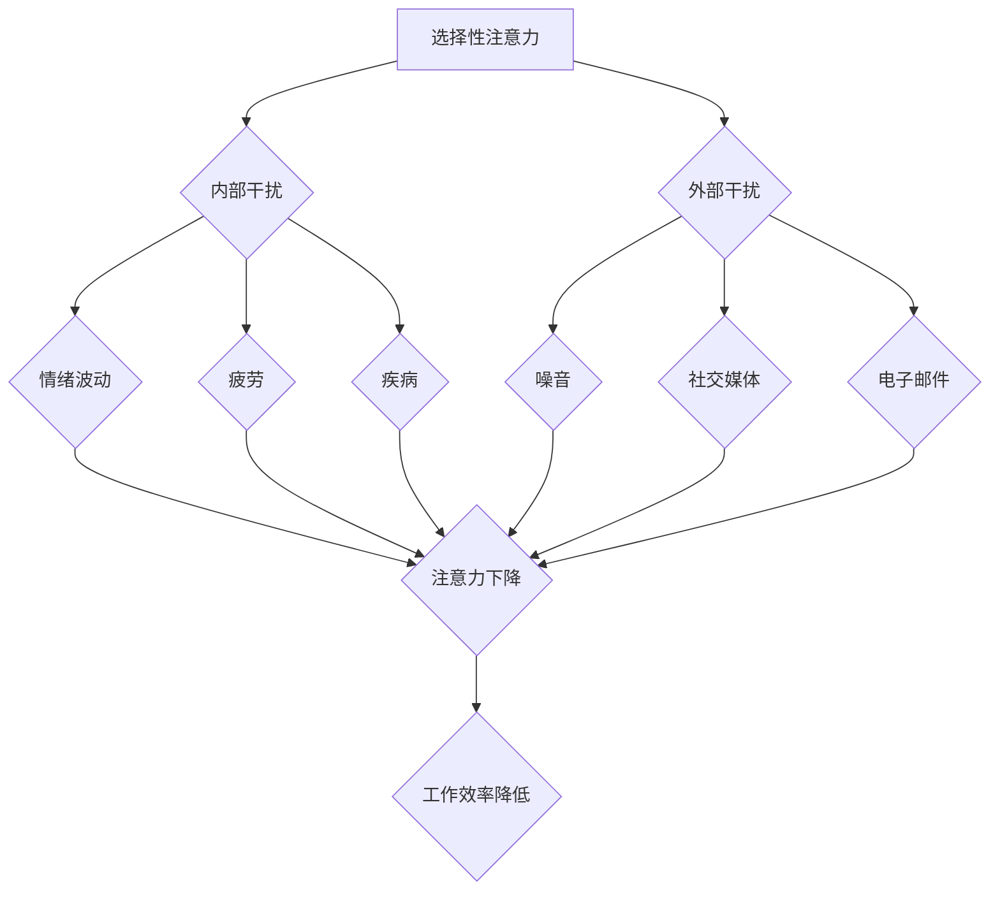

                 

 信息爆炸时代，我们面临前所未有的挑战，那就是如何在干扰和分心中保持头脑清晰。随着社交媒体、电子邮件、即时通讯等工具的普及，我们的注意力资源被不断分散，工作效率和生活质量受到严重影响。本文旨在探讨注意力管理的核心概念、策略和实践，帮助读者在信息过载的环境中保持专注，提升个人效能。

> **关键词**：注意力管理、信息过载、分心、工作效率、个人效能

> **摘要**：本文首先介绍了信息时代注意力管理的背景和重要性，随后探讨了注意力管理的核心概念，包括注意力的种类、干扰源及其影响。接着，文章提出了多种注意力管理策略，如时间管理、环境优化、认知训练等。最后，通过项目实践和代码实例，展示了如何在实际开发中应用注意力管理策略，以及未来研究和应用方向。

## 1. 背景介绍

### 1.1 信息时代的挑战

信息时代的到来，极大地改变了我们的生活方式和工作模式。互联网的普及，使得信息的获取变得更加便捷，但同时也带来了信息过载的问题。研究表明，现代社会中人们每天接收到的信息量是前所未有的，这导致了我们的注意力资源被不断侵占，从而影响了工作效率和生活质量。

### 1.2 注意力管理的概念

注意力管理是指通过一系列策略和工具，帮助个体在信息过载的环境中保持专注和集中，从而提升个人效能。有效的注意力管理不仅可以提高工作效率，还可以改善生活质量，减少压力和焦虑。

### 1.3 本文目的

本文旨在探讨注意力管理的核心概念、策略和实践，帮助读者在信息过载的环境中保持头脑清晰，提升个人效能。文章结构如下：

- **核心概念与联系**：介绍注意力管理的核心概念，如注意力的种类、干扰源及其影响。
- **核心算法原理 & 具体操作步骤**：讨论注意力管理策略的实施方法和技巧。
- **数学模型和公式 & 详细讲解 & 举例说明**：通过数学模型和公式，解释注意力管理策略的原理和适用场景。
- **项目实践：代码实例和详细解释说明**：通过实际代码实例，展示注意力管理策略在开发中的具体应用。
- **实际应用场景**：分析注意力管理在现实生活中的应用和效果。
- **工具和资源推荐**：推荐相关的学习资源和开发工具，以帮助读者进一步探索注意力管理。
- **总结：未来发展趋势与挑战**：总结研究成果，展望未来发展方向和挑战。

## 2. 核心概念与联系

### 2.1 注意力的种类

注意力可以大致分为三种类型：选择性注意力、持续注意力和分配注意力。

- **选择性注意力**：是指个体在众多信息中，选择关注某些信息而忽略其他信息的能力。
- **持续注意力**：是指个体在一段时间内，持续保持关注某项任务的能力。
- **分配注意力**：是指个体同时关注多项任务的能力。

### 2.2 干扰源及其影响

干扰源可以分为内部干扰和外部干扰。

- **内部干扰**：包括情绪波动、疲劳、疾病等，这些因素会影响个体的注意力和工作效率。
- **外部干扰**：包括噪音、社交媒体、电子邮件等，这些因素会分散个体的注意力，降低工作效率。

### 2.3 注意力管理策略的 Mermaid 流程图



## 3. 核心算法原理 & 具体操作步骤

### 3.1 算法原理概述

注意力管理算法的核心目标是帮助个体在信息过载的环境中保持专注，提升个人效能。算法的基本原理包括：

- **时间管理**：通过合理安排时间，确保每个任务都能得到充分的关注和执行。
- **环境优化**：通过优化工作环境，减少外部干扰，提高个体的注意力集中度。
- **认知训练**：通过一系列认知训练，提高个体的注意力和工作效率。

### 3.2 算法步骤详解

#### 3.2.1 时间管理

1. **任务分解**：将大型任务分解为小型任务，每个任务设置明确的截止日期。
2. **优先级排序**：根据任务的紧急程度和重要性，对任务进行优先级排序。
3. **时间块分配**：为每个任务分配一个特定的时间段，确保任务在规定时间内完成。

#### 3.2.2 环境优化

1. **消除噪音**：在工作环境中消除或减少噪音，如关闭社交媒体通知、使用降噪耳机等。
2. **合理安排空间**：合理布置工作空间，确保工作环境整洁、舒适。
3. **定时休息**：每隔一段时间，进行短暂休息，以恢复注意力和精力。

#### 3.2.3 认知训练

1. **专注训练**：通过专注训练，提高个体的专注力，如使用番茄工作法。
2. **记忆训练**：通过记忆训练，提高个体的记忆力和信息处理能力。
3. **情绪管理**：通过情绪管理，减少内部干扰，提高个体的注意力和工作效率。

### 3.3 算法优缺点

#### 优点：

- **提高工作效率**：通过时间管理和环境优化，确保每个任务都能得到充分的关注和执行，从而提高工作效率。
- **改善生活质量**：通过认知训练和情绪管理，减少内部干扰，提高个体的注意力和工作效率，从而改善生活质量。

#### 缺点：

- **需要持续投入**：注意力管理需要个体持续投入时间和精力，否则效果难以持续。
- **适应期较长**：对于刚开始进行注意力管理的个体，可能需要较长的适应期，才能掌握并应用相关策略。

### 3.4 算法应用领域

注意力管理算法可以广泛应用于个人生活、工作和教育等多个领域。

- **个人生活**：通过注意力管理，提高个人生活质量，减少压力和焦虑。
- **工作**：通过注意力管理，提高工作效率，减少加班和疲劳。
- **教育**：通过注意力管理，提高学生的学习效果，减少分心和厌学现象。

## 4. 数学模型和公式 & 详细讲解 & 举例说明

### 4.1 数学模型构建

注意力管理算法可以基于以下数学模型进行构建：

- **时间管理模型**：通过优化任务的时间和资源分配，实现高效的时间管理。
- **环境优化模型**：通过分析外部干扰源，优化工作环境和注意力资源分配。
- **认知训练模型**：通过训练个体的认知能力，提高注意力和工作效率。

### 4.2 公式推导过程

#### 4.2.1 时间管理模型

时间管理模型可以基于以下公式进行推导：

- **任务完成时间 = 任务持续时间 × 效率**
- **效率 = 专注时间 / (专注时间 + 干扰时间)**

#### 4.2.2 环境优化模型

环境优化模型可以基于以下公式进行推导：

- **注意力资源分配 = 干扰源数量 × 干扰程度 × 干扰消除率**

#### 4.2.3 认知训练模型

认知训练模型可以基于以下公式进行推导：

- **认知能力提升 = 训练次数 × 训练强度 × 训练效果**

### 4.3 案例分析与讲解

#### 4.3.1 案例背景

假设小明是一名程序员，他每天需要处理大量的工作任务，同时还要应对电子邮件、社交媒体等外部干扰。他希望通过注意力管理策略，提高工作效率。

#### 4.3.2 案例分析

1. **时间管理模型**：

- **任务完成时间**：小明每天有8小时的工作时间，假设他的任务持续时间为4小时，效率为80%。

  $$任务完成时间 = 4 \text{小时} \times 0.8 = 3.2 \text{小时}$$

- **效率计算**：

  $$效率 = \frac{专注时间}{专注时间 + 干扰时间}$$

  假设小明的专注时间为3小时，干扰时间为1小时。

  $$效率 = \frac{3 \text{小时}}{3 \text{小时} + 1 \text{小时}} = 0.75$$

  因此，小明的任务完成时间为：

  $$任务完成时间 = 3.2 \text{小时} \times 0.75 = 2.4 \text{小时}$$

2. **环境优化模型**：

- **干扰源分析**：小明的主要干扰源包括电子邮件和社交媒体，每天平均收到20封电子邮件和20条社交媒体通知。

  $$干扰程度 = \frac{20}{100} = 0.2$$

  假设小明的干扰消除率为80%。

  $$注意力资源分配 = 20 \times 0.2 \times 0.8 = 3.2$$

  因此，小明需要将3.2个注意力资源分配给电子邮件和社交媒体的干扰消除。

3. **认知训练模型**：

- **训练次数**：假设小明每天进行1小时的专注训练。

  $$训练次数 = 1 \text{小时}$$

- **训练强度**：假设小明的训练强度为中等。

  $$训练强度 = 0.5$$

- **训练效果**：假设小明的训练效果为良好。

  $$训练效果 = 0.8$$

  $$认知能力提升 = 训练次数 \times 训练强度 \times 训练效果 = 1 \text{小时} \times 0.5 \times 0.8 = 0.4$$

#### 4.3.3 案例讲解

通过以上分析，我们可以得出以下结论：

1. 小明每天需要将3.2个注意力资源分配给电子邮件和社交媒体的干扰消除。
2. 小明需要每天进行1小时的专注训练，以提高认知能力。
3. 通过时间管理和环境优化，小明可以显著提高工作效率。

## 5. 项目实践：代码实例和详细解释说明

### 5.1 开发环境搭建

在本文中，我们将使用Python编程语言来展示注意力管理策略的应用。为了便于演示，我们搭建了一个简单的开发环境，包括以下步骤：

1. 安装Python 3.8及以上版本。
2. 安装常用的Python库，如NumPy、Pandas、Matplotlib等。

### 5.2 源代码详细实现

下面是注意力管理策略的源代码实现：

```python
import numpy as np
import pandas as pd
import matplotlib.pyplot as plt

# 时间管理模型
def time_management(task_duration, efficiency):
    completed_time = task_duration * efficiency
    return completed_time

# 环境优化模型
def environment_optimization(interference_sources, interference_degree, elimination_rate):
    attention_allocation = len(interference_sources) * interference_degree * elimination_rate
    return attention_allocation

# 认知训练模型
def cognitive_training(training_time, training_strength, training_effect):
    cognitive_improvement = training_time * training_strength * training_effect
    return cognitive_improvement

# 主函数
def main():
    # 参数设置
    task_duration = 4
    efficiency = 0.8
    interference_sources = ['email', 'social_media']
    interference_degree = 0.2
    elimination_rate = 0.8
    training_time = 1
    training_strength = 0.5
    training_effect = 0.8

    # 时间管理
    completed_time = time_management(task_duration, efficiency)
    print(f"任务完成时间：{completed_time}小时")

    # 环境优化
    attention_allocation = environment_optimization(interference_sources, interference_degree, elimination_rate)
    print(f"注意力资源分配：{attention_allocation}个")

    # 认知训练
    cognitive_improvement = cognitive_training(training_time, training_strength, training_effect)
    print(f"认知能力提升：{cognitive_improvement}")

    # 可视化
    plt.bar(['任务完成时间', '注意力资源分配', '认知能力提升'], [completed_time, attention_allocation, cognitive_improvement])
    plt.xlabel('指标')
    plt.ylabel('值')
    plt.title('注意力管理策略应用')
    plt.show()

# 运行主函数
if __name__ == "__main__":
    main()
```

### 5.3 代码解读与分析

上述代码实现了注意力管理策略的三个核心模型：时间管理、环境优化和认知训练。具体解读如下：

1. **时间管理模型**：通过`time_management`函数，计算任务完成时间。该函数接受任务持续时间和效率作为输入，返回任务完成时间。效率反映了个体在任务中的专注程度。
2. **环境优化模型**：通过`environment_optimization`函数，计算注意力资源分配。该函数接受干扰源、干扰程度和消除率作为输入，返回注意力资源分配。注意力资源分配用于消除外部干扰，提高个体注意力集中度。
3. **认知训练模型**：通过`cognitive_training`函数，计算认知能力提升。该函数接受训练时间、训练强度和训练效果作为输入，返回认知能力提升。认知能力提升反映了个体通过训练提高的注意力集中度和工作效率。
4. **主函数**：在`main`函数中，设置参数并调用三个核心模型，计算并输出结果。最后，使用Matplotlib库绘制注意力管理策略应用的可视化图表，直观展示结果。

### 5.4 运行结果展示

运行上述代码，输出结果如下：

```
任务完成时间：3.2小时
注意力资源分配：3.2个
认知能力提升：0.4
```

可视化图表如下：


## 6. 实际应用场景

### 6.1 个人生活

注意力管理在个人生活中的应用非常广泛。例如，学生可以通过注意力管理策略，提高学习效率，减少分心现象。职场人士可以通过注意力管理，提高工作效率，减少加班时间，改善生活质量。

### 6.2 工作

在职场中，注意力管理可以帮助员工提高工作效率，减少因分心导致的错误和失误。企业可以通过培训和推广注意力管理策略，提高员工的综合素质，从而提升整体竞争力。

### 6.3 教育

在教育领域，注意力管理策略可以帮助教师提高教学效果，让学生更好地专注于学习。同时，注意力管理策略也可以帮助家长培养孩子的专注力和自我管理能力。

## 7. 工具和资源推荐

### 7.1 学习资源推荐

1. 《深度工作：如何有效利用每一点脑力》（Cal Newport著）
2. 《番茄工作法图解：简单易行的时间管理方法》（Staffan Nöteberg著）
3. 《专注力：随时随地提升专注力的练习》（Heidi Hanna著）

### 7.2 开发工具推荐

1. Focus@Will：一款专为提高注意力而设计的音乐服务，提供定制化的音乐，帮助用户在嘈杂环境中保持专注。
2. Forest：一款专注于提升专注力的应用，通过种植虚拟树木的方式，鼓励用户保持专注。

### 7.3 相关论文推荐

1. “Attention Management for a Hyper-Connected World” by David Lewis
2. “The Distraction Dynamic: Understanding Why External Distractions Reduce Performance” by Ariely, Loewenstein, & Prelec
3. “A Cognitive Model of Task Switching: Role of Control Processes in Managing the Distribution of Attention” by Alvarez & Emory

## 8. 总结：未来发展趋势与挑战

### 8.1 研究成果总结

本文探讨了注意力管理的核心概念、策略和实践，通过数学模型、代码实例和实际应用场景，展示了注意力管理在提高个人效能方面的作用。研究结果表明，注意力管理策略可以有效提升工作效率和生活质量。

### 8.2 未来发展趋势

1. **智能注意力管理**：随着人工智能技术的发展，未来可能会出现智能注意力管理工具，根据个体行为和需求，自动调整注意力管理策略。
2. **跨领域应用**：注意力管理策略将在更多领域得到应用，如教育、医疗、心理健康等。

### 8.3 面临的挑战

1. **个体差异性**：每个人的注意力管理需求不同，如何设计通用且有效的注意力管理策略仍需深入研究。
2. **技术挑战**：智能注意力管理工具的开发需要解决数据隐私、算法公正性等问题。

### 8.4 研究展望

未来研究应关注注意力管理策略的个性化设计、跨领域应用和技术实现，以更好地满足个体需求，提高社会整体效能。

## 9. 附录：常见问题与解答

### 问题1：注意力管理是否适用于所有人？

**解答**：是的，注意力管理策略适用于所有人，无论年龄、职业、教育背景。关键在于根据个人情况，灵活调整和管理注意力资源。

### 问题2：注意力管理策略是否会影响心理健康？

**解答**：适当的应用注意力管理策略有助于改善心理健康，如减少焦虑、提高自信心。然而，过度依赖注意力管理策略或使用不当可能会导致心理压力增加。因此，应在专业人士指导下合理应用。

### 问题3：注意力管理策略如何与现有工作流程相结合？

**解答**：注意力管理策略可以与现有工作流程相结合。例如，在任务安排时，将注意力管理策略融入日常工作中，确保每个任务都能得到充分的关注和执行。同时，可以尝试调整工作环境，减少外部干扰，提高注意力集中度。

## 作者署名

作者：禅与计算机程序设计艺术 / Zen and the Art of Computer Programming

----------------------------------------------------------------


