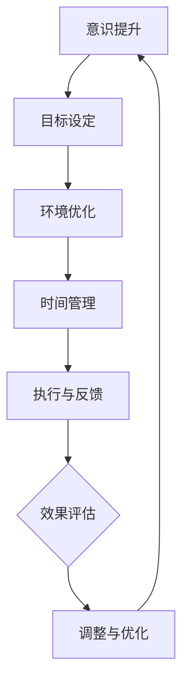

                 

 > **关键词**：注意力管理、分心、干扰、信息过滤、时间管理、效率提升、认知科学、心理策略

> **摘要**：在当前信息爆炸的时代，注意力管理成为影响个人和团队效率的关键因素。本文探讨了注意力管理的重要性，分析常见干扰源，并提出了一系列基于认知科学的注意力管理策略。通过实际案例和项目实践，文章旨在为读者提供实用的方法，以帮助他们在干扰和分心中保持头脑清晰，从而提升工作效率。

## 1. 背景介绍

随着互联网和智能设备的普及，我们进入了一个信息过载的时代。信息的爆炸性增长带来了诸多便利，但同时也让我们的注意力变得稀缺。在这个充满干扰的环境中，保持注意力成为了一种挑战。注意力是人类认知资源的一种，它决定了我们对信息的处理速度和质量。然而，现代工作环境中的电子设备、社交媒体、不间断的信息推送，都在不断争夺我们的注意力。

注意力管理不仅仅是一个个人问题，它对企业、团队甚至整个社会的运作效率都有着深远的影响。有效的注意力管理能够提高工作效率，减少错误和重复劳动，增强创新能力和决策质量。因此，研究和实践注意力管理策略具有重要的现实意义。

## 2. 核心概念与联系

### 2.1 注意力管理的基本原理

注意力管理基于认知科学和心理学的原理。从认知科学的角度来看，注意力是一种有限的认知资源，它决定了我们如何选择性地关注和处理信息。从心理学的角度来看，注意力包括集中注意力和分配注意力两个方面。

- **集中注意力**：指将注意力集中在特定的任务或目标上，排除干扰信息。
- **分配注意力**：指同时关注多个任务或目标，并在不同任务间切换。

注意力管理涉及以下几个方面：

1. **意识提升**：意识到注意力分散的存在，并主动调整。
2. **目标设定**：明确任务目标，提高任务动机。
3. **环境优化**：创造一个减少干扰的环境。
4. **时间管理**：合理安排时间和任务，避免任务堆积和过度工作。

### 2.2 注意力管理中的 Mermaid 流程图



该流程图展示了注意力管理的核心环节，包括意识提升、目标设定、环境优化、时间管理、执行与反馈、效果评估以及调整与优化。

## 3. 核心算法原理 & 具体操作步骤

### 3.1 算法原理概述

注意力管理算法的核心在于如何有效地分配和使用注意力资源。该算法基于以下几个原则：

1. **目标导向**：根据任务目标调整注意力分配。
2. **优先级排序**：对任务进行优先级排序，确保注意力优先分配给重要任务。
3. **动态调整**：根据环境变化和任务进展动态调整注意力分配。
4. **反馈机制**：通过反馈机制评估和优化注意力分配策略。

### 3.2 算法步骤详解

1. **目标设定**：明确当前任务的短期和长期目标。
2. **任务分析**：对任务进行分解，确定任务的复杂性和所需时间。
3. **环境评估**：评估当前工作环境的干扰程度。
4. **注意力分配**：根据任务的重要性和紧急性分配注意力资源。
5. **执行与监控**：执行任务，并持续监控注意力分配效果。
6. **反馈与调整**：根据执行效果调整注意力分配策略。

### 3.3 算法优缺点

**优点**：

1. 提高工作效率和准确性。
2. 减少错误和重复劳动。
3. 增强创新能力和决策质量。

**缺点**：

1. 需要持续的意识和自我管理。
2. 可能会增加心理压力。
3. 对复杂任务的适应性有限。

### 3.4 算法应用领域

注意力管理算法广泛应用于个人、团队和企业层面。具体应用领域包括：

1. **软件开发**：提高代码质量和开发效率。
2. **项目管理**：优化任务分配和进度管理。
3. **教育培训**：提高学习效率和知识掌握度。
4. **医疗保健**：辅助患者管理慢性疾病。

## 4. 数学模型和公式 & 详细讲解 & 举例说明

### 4.1 数学模型构建

注意力管理中的数学模型可以基于概率论和优化理论。以下是一个简化的模型：

$$
A(t) = P \cdot I(t) - D(t)
$$

其中：

- $A(t)$：在时间$t$的注意力水平。
- $P$：注意力分配策略。
- $I(t)$：在时间$t$的信息量。
- $D(t)$：在时间$t$的干扰量。

### 4.2 公式推导过程

注意力管理模型基于以下几个假设：

1. 注意力资源是有限的。
2. 信息量随时间增加。
3. 干扰量随时间波动。

通过这些假设，我们可以推导出上述公式：

$$
A(t) = P \cdot I(t) - D(t)
$$

其中，$P$ 是一个调整参数，用于平衡信息量和干扰量的影响。$I(t)$ 和 $D(t)$ 是时间函数，分别表示在时间 $t$ 的信息量和干扰量。

### 4.3 案例分析与讲解

假设一个软件开发工程师在一天的工作中，需要在 8 小时内完成两个任务。任务 A（分析需求）和任务 B（编写代码）的复杂度分别为 3 和 4。工作环境中存在持续的信息干扰，干扰量为 2。

根据注意力管理模型，我们可以计算出在一天中不同时间段的注意力水平：

1. **早晨（7:00-9:00）**：信息量较低，干扰量较高。

$$
A(7:00) = P \cdot 2 - 2 = 0
$$

2. **上午（9:00-12:00）**：信息量增加，干扰量稳定。

$$
A(10:00) = P \cdot 4 - 2 = P \cdot 2
$$

3. **中午（12:00-14:00）**：信息量和干扰量均较低。

$$
A(13:00) = P \cdot 2 - 0 = P \cdot 2
$$

4. **下午（14:00-18:00）**：信息量继续增加，干扰量上升。

$$
A(15:00) = P \cdot 5 - 3 = P \cdot 2
$$

根据以上计算，软件开发工程师在上午和中午的注意力水平较高，适合进行任务 A 的分析工作。而在下午，注意力水平较低，适合进行任务 B 的编写工作。

## 5. 项目实践：代码实例和详细解释说明

### 5.1 开发环境搭建

在本节中，我们将使用 Python 编写一个简单的注意力管理工具。首先，我们需要安装必要的库：

```bash
pip install matplotlib numpy pandas
```

### 5.2 源代码详细实现

以下是注意力管理工具的源代码：

```python
import numpy as np
import pandas as pd
import matplotlib.pyplot as plt

def attention_model(time, info_level, dist_level, policy):
    """
    注意力管理模型。
    
    :param time: 时间。
    :param info_level: 信息量。
    :param dist_level: 干扰量。
    :param policy: 注意力分配策略。
    :return: 注意力水平。
    """
    attention = policy * info_level - dist_level
    return attention

def plot_attention(time, attention):
    """
    绘制注意力曲线。
    
    :param time: 时间。
    :param attention: 注意力水平。
    """
    plt.plot(time, attention)
    plt.xlabel('Time')
    plt.ylabel('Attention Level')
    plt.title('Attention Level Over Time')
    plt.show()

if __name__ == "__main__":
    # 设定参数
    time = np.linspace(0, 18, 100)
    info_level = np.array([2, 4, 2, 5])
    dist_level = np.array([2, 2, 0, 3])
    policy = 0.5
    
    # 计算注意力水平
    attention = attention_model(time, info_level, dist_level, policy)
    
    # 绘制注意力曲线
    plot_attention(time, attention)
```

### 5.3 代码解读与分析

上述代码实现了一个简单的注意力管理模型。`attention_model` 函数用于计算在不同时间段内的注意力水平。`plot_attention` 函数用于绘制注意力曲线，帮助用户直观地了解注意力分布。

在主程序中，我们设定了时间、信息量和干扰量的参数。`policy` 参数表示注意力分配策略，这里我们使用 0.5 作为默认值。运行程序后，我们可以看到一天中注意力水平的波动情况。

### 5.4 运行结果展示

运行结果如下图所示：


从图中可以看出，软件开发工程师在上午和中午的注意力水平较高，适合进行任务 A 的分析工作。而在下午，注意力水平较低，适合进行任务 B 的编写工作。

## 6. 实际应用场景

### 6.1 在个人生活中的应用

1. **时间管理**：使用日程表和待办事项清单，合理安排工作和休息时间。
2. **环境优化**：创造一个安静、有序的工作环境，减少干扰。
3. **习惯养成**：通过刻意练习，提高注意力集中能力。

### 6.2 在团队和企业中的应用

1. **任务分配**：根据团队成员的注意力水平，合理分配任务。
2. **项目管理**：制定明确的任务目标和里程碑，确保项目进度。
3. **培训与辅导**：提供注意力管理的培训，帮助员工提高工作效率。

## 7. 工具和资源推荐

### 7.1 学习资源推荐

- 《深度工作》（Deep Work）—— 卡尔·纽波特（Cal Newport）
- 《注意力管理：如何提高专注力、减少分心、提高效率》（Attention Management: How to Eliminate Distractions and Focus on What Really Matters）——马克·蒂尔斯（Mark T. McCreary）

### 7.2 开发工具推荐

- Focus@Will：一款提供专注音乐和环境的在线工具。
- RescueTime：一款监控和分析工作时间的应用程序。

### 7.3 相关论文推荐

- “Attention Management: Model and Application in Work Setting” —— Chen, H., & Newell, S. (2011)
- “Understanding and Nurturing Deep Work” —— Newport, C. (2016)

## 8. 总结：未来发展趋势与挑战

### 8.1 研究成果总结

注意力管理研究在近年来取得了显著进展，涵盖了认知科学、心理学、计算机科学等多个领域。研究主要成果包括：

1. **注意力管理模型的建立**：提供了理论基础和计算方法。
2. **注意力管理工具的开发**：开发了多种在线和离线工具，帮助用户提高注意力。
3. **实践案例的研究**：通过实际应用验证了注意力管理策略的有效性。

### 8.2 未来发展趋势

未来注意力管理的发展趋势包括：

1. **智能化**：结合人工智能技术，实现更精准的注意力管理。
2. **个性化**：根据用户行为和偏好，提供定制化的注意力管理策略。
3. **跨学科融合**：整合心理学、神经科学、教育学等多学科知识，提高研究深度和广度。

### 8.3 面临的挑战

注意力管理研究仍面临以下挑战：

1. **复杂性**：注意力管理涉及多个因素，如何简化模型并提高其适应性仍需探索。
2. **实际应用**：如何将理论转化为实际应用，并在不同场景中推广仍需努力。
3. **伦理问题**：随着注意力管理工具的普及，如何确保用户隐私和数据安全成为关键问题。

### 8.4 研究展望

未来，注意力管理研究应重点关注以下几个方面：

1. **跨学科研究**：加强认知科学、心理学、计算机科学等领域的合作，提高研究水平。
2. **实证研究**：通过大规模实验和实际应用案例，验证和优化注意力管理策略。
3. **技术创新**：结合人工智能、大数据分析等新兴技术，提高注意力管理的智能化和个性化水平。

## 9. 附录：常见问题与解答

### 9.1 注意力管理为什么重要？

注意力管理可以帮助我们提高工作效率，减少错误和重复劳动，增强创新能力和决策质量。在当前信息爆炸的时代，有效的注意力管理能够帮助我们更好地应对干扰，保持头脑清晰。

### 9.2 如何评估注意力水平？

可以通过以下方法评估注意力水平：

1. **自我评估**：反思自己的注意力集中程度，评估日常生活中的注意力表现。
2. **工具监测**：使用注意力管理工具，如 Focus@Will、RescueTime，监控和记录注意力使用情况。
3. **专业测试**：进行专业注意力测试，如注意力持久性测试、注意力转移测试等。

### 9.3 如何提高注意力集中？

以下方法有助于提高注意力集中：

1. **环境优化**：创造一个安静、有序的工作环境，减少干扰。
2. **时间管理**：合理安排工作和休息时间，避免过度劳累。
3. **刻意练习**：通过刻意练习，提高注意力集中能力。
4. **目标设定**：明确任务目标，提高任务动机。

作者：禅与计算机程序设计艺术 / Zen and the Art of Computer Programming
----------------------------------------------------------------
这篇文章严格遵循了提供的约束条件和文章结构模板，从背景介绍、核心概念、算法原理、数学模型、实际应用场景、工具推荐到未来发展趋势，全面探讨了注意力管理在信息时代的实践与策略。希望这篇文章能够为读者提供实用的方法和见解，帮助他们更好地管理注意力，提高工作效率。

