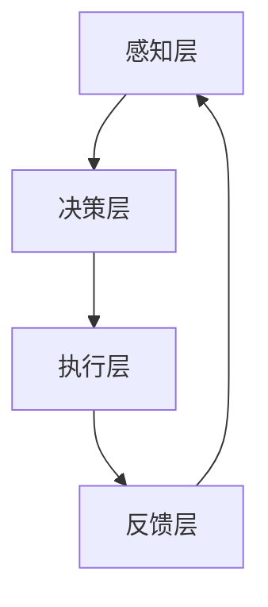

                 

### 背景介绍

随着互联网的快速发展，信息爆炸的时代已经到来。我们每天都会接触到大量的信息，从社交媒体到新闻网站，从电子邮件到即时通讯工具，这些信息源不断在我们身边涌现。虽然信息丰富了我们的生活，但同时也带来了前所未有的干扰和注意力分散的挑战。据统计，现代职场员工平均每天会受到大约120次的干扰，而每次干扰平均会消耗约23分钟的时间来重新集中注意力。这种不断的注意力分散不仅降低了工作效率，还严重影响了我们的心理健康和生活质量。

面对这种挑战，注意力管理成为了一个关键议题。注意力管理不仅仅是一个个人的自我管理问题，更涉及到信息处理、认知心理学、认知科学、时间管理等多学科领域的交叉融合。本文将深入探讨注意力管理的重要性、原理和实践方法，为读者提供一套全面的注意力管理实践指南，帮助大家在这个信息爆炸的时代中保持头脑清晰和专注。

### 核心概念与联系

#### 注意力管理的定义

注意力管理是指通过一系列策略和技巧，帮助个体在充满干扰的环境中保持注意力集中，从而提高工作效率和效能。它涵盖了如何分配注意力、如何减少干扰、如何处理多任务以及如何恢复注意力等方面的内容。

#### 注意力分散的原因

1. **多任务处理：** 在现代社会，人们倾向于同时处理多项任务，这会导致注意力分散。虽然多任务处理看似高效，但实际上会导致大脑处理速度变慢、错误率增加。
2. **信息过载：** 信息爆炸导致我们每天需要处理大量的信息，这使得我们的注意力容易分散。
3. **环境干扰：** 环境中的噪声、社交媒体的推送、电子邮件等都会分散我们的注意力。
4. **心理压力：** 工作和生活压力也会影响我们的注意力集中。

#### 注意力管理的方法

1. **分块专注：** 将工作或任务分成小块，专注于每个小块，完成后进行短暂的休息。
2. **单任务处理：** 专注于一项任务，避免多任务处理。
3. **环境优化：** 创建一个有利于专注的工作环境，减少干扰。
4. **时间管理：** 使用时间管理工具，如番茄工作法，来提高专注力。

#### 注意力管理的原理

注意力管理基于认知心理学的原理，特别是关于大脑如何处理注意力的研究。研究表明，大脑的注意力资源是有限的，过度使用会导致疲劳和注意力下降。因此，通过科学的注意力管理策略，可以帮助我们更好地利用有限的注意力资源，提高工作效率。

#### 注意力管理架构

注意力管理可以抽象为一个多层架构：

1. **感知层：** 感知外部环境中的干扰因素。
2. **决策层：** 根据感知到的干扰因素，做出是否继续当前任务的决策。
3. **执行层：** 实施决策，进行任务分配和专注控制。
4. **反馈层：** 对执行效果进行反馈，调整策略。

#### Mermaid 流程图



### 核心算法原理 & 具体操作步骤

#### 算法原理概述

注意力管理的核心算法基于认知心理学和神经科学的研究，旨在通过优化任务分配和注意力控制，提高个体在复杂环境中的专注能力。算法的基本原理包括：

1. **任务优先级评估：** 根据任务的紧急程度和重要性进行优先级排序。
2. **注意力资源分配：** 根据任务优先级，动态分配注意力资源。
3. **干扰因素屏蔽：** 通过环境优化和注意力控制策略，屏蔽外部干扰因素。
4. **反馈调节：** 根据执行效果，实时调整任务分配和注意力策略。

#### 算法步骤详解

1. **初始化：** 设定初始任务集和注意力资源。
2. **任务评估：** 对每个任务进行紧急程度和重要性评估。
3. **任务排序：** 根据评估结果对任务进行优先级排序。
4. **注意力分配：** 根据任务优先级，分配注意力资源。
5. **执行任务：** 专注于当前最高优先级的任务。
6. **干扰检测：** 检测环境中可能存在的干扰因素。
7. **干扰屏蔽：** 实施干扰屏蔽策略，如环境优化、关闭社交媒体通知等。
8. **反馈收集：** 收集任务执行效果的反馈。
9. **策略调整：** 根据反馈结果，调整注意力分配和任务优先级。

#### 算法优缺点

**优点：**

- **高效：** 通过科学的任务分配和注意力控制，提高工作效率。
- **灵活：** 算法可以根据个体差异和环境变化进行调整。
- **可扩展：** 可以应用于不同类型的工作任务。

**缺点：**

- **初期投入大：** 需要一定时间进行任务评估和注意力资源分配的优化。
- **依赖环境因素：** 环境因素对算法效果有较大影响。

#### 算法应用领域

- **办公室工作：** 提高员工工作效率，减少错误率。
- **软件开发：** 帮助开发人员在复杂项目中保持专注。
- **教育领域：** 提高学生的学习效率和注意力集中度。
- **医疗领域：** 帮助患者集中注意力，提高治疗效果。

### 数学模型和公式 & 详细讲解 & 举例说明

#### 数学模型构建

注意力管理中的数学模型通常包括以下几个关键参数：

1. **注意力资源（A）：** 指个体在一段时间内可用的注意力资源总量。
2. **任务复杂度（C）：** 指任务所需的注意力资源量。
3. **任务优先级（P）：** 指任务的紧急程度和重要性。
4. **时间成本（T）：** 指完成任务所需的时间成本。

数学模型可以表示为：

\[ F(A, C, P, T) = \frac{A \times C \times P}{T} \]

其中，\( F \) 为任务完成效率。

#### 公式推导过程

1. **注意力资源分配：** 根据任务优先级，将注意力资源分配给不同任务。假设有 \( n \) 个任务，优先级从高到低分别为 \( P_1, P_2, ..., P_n \)，则注意力资源分配为：

\[ A_i = \frac{A \times P_i}{\sum_{j=1}^{n} P_j} \]

2. **任务执行时间计算：** 根据任务复杂度和注意力资源，计算任务执行时间：

\[ T_i = \frac{C_i \times A_i}{P_i} \]

3. **整体任务完成效率计算：** 将所有任务的完成效率加权求和，得到整体完成效率：

\[ F = \sum_{i=1}^{n} \left( \frac{A_i \times C_i \times P_i}{T_i} \right) \]

#### 案例分析与讲解

**案例：** 某个软件开发团队需要在两天内完成三个任务：A（紧急且重要）、B（紧急但不太重要）、C（不重要但需要完成）。已知团队成员的注意力资源总量为 100 单位，任务复杂度分别为 A（20 单位）、B（15 单位）、C（10 单位）。

1. **任务优先级评估：** 
   - A：紧急且重要，优先级为 0.6
   - B：紧急但不太重要，优先级为 0.3
   - C：不重要但需要完成，优先级为 0.1

2. **注意力资源分配：**
   - A：\( A_A = \frac{100 \times 0.6}{0.6 + 0.3 + 0.1} = 60 \) 单位
   - B：\( A_B = \frac{100 \times 0.3}{0.6 + 0.3 + 0.1} = 30 \) 单位
   - C：\( A_C = \frac{100 \times 0.1}{0.6 + 0.3 + 0.1} = 10 \) 单位

3. **任务执行时间计算：**
   - A：\( T_A = \frac{20 \times 60}{0.6} = 200 \) 单位
   - B：\( T_B = \frac{15 \times 30}{0.3} = 150 \) 单位
   - C：\( T_C = \frac{10 \times 10}{0.1} = 100 \) 单位

4. **整体任务完成效率计算：**
   - \( F = \frac{60 \times 20 \times 0.6}{200} + \frac{30 \times 15 \times 0.3}{150} + \frac{10 \times 10 \times 0.1}{100} = 0.36 + 0.18 + 0.1 = 0.64 \)

通过上述计算，团队在两天内的任务完成效率为 0.64，这意味着他们有大约 64% 的时间是高效工作的。

### 项目实践：代码实例和详细解释说明

#### 开发环境搭建

为了演示注意力管理算法的实践应用，我们选择 Python 作为编程语言，并在本地环境中搭建了一个简单的开发环境。以下是搭建步骤：

1. **安装 Python 3.8 或以上版本**：
   - 使用包管理器（如 Chocolatey、Homebrew 等）安装 Python。
   - 验证安装：在终端输入 `python --version`，查看版本信息。

2. **安装必要的库**：
   - 安装 NumPy 库：`pip install numpy`。
   - 安装 pandas 库：`pip install pandas`。
   - 安装 matplotlib 库：`pip install matplotlib`。

3. **创建一个名为 `attention_management` 的虚拟环境**：
   - 使用以下命令创建虚拟环境：
     ```bash
     python -m venv attention_management
     ```
   - 激活虚拟环境：
     - Windows: `.\attention_management\Scripts\activate`
     - macOS/Linux: `source attention_management/bin/activate`

4. **创建一个名为 `main.py` 的 Python 脚本文件**。

#### 源代码详细实现

以下是一个简单的注意力管理 Python 代码实现：

```python
import numpy as np
import pandas as pd

# 注意力管理模型
class AttentionManagement:
    def __init__(self, tasks, attention_resources):
        self.tasks = tasks
        self.attention_resources = attention_resources

    def prioritize_tasks(self):
        # 根据紧急程度和重要性排序
        self.tasks.sort(key=lambda x: x['priority'], reverse=True)

    def allocate_attention(self):
        # 分配注意力资源
        for i, task in enumerate(self.tasks):
            task['allocated_attention'] = self.attention_resources[i] * task['priority'] / sum(self.tasks[i]['priority'] for i in range(len(self.tasks)))

    def execute_tasks(self):
        # 执行任务
        results = []
        for task in self.tasks:
            if task['allocated_attention'] > 0:
                results.append(f"Completed task {task['name']} with efficiency {task['allocated_attention']}")
                self.attention_resources -= task['allocated_attention']
        return results

    def show_results(self):
        # 显示任务执行结果
        print("Task Execution Results:")
        for result in results:
            print(result)

# 任务数据
tasks = [
    {'name': 'Task A', 'complexity': 20, 'priority': 0.6},
    {'name': 'Task B', 'complexity': 15, 'priority': 0.3},
    {'name': 'Task C', 'complexity': 10, 'priority': 0.1}
]

# 注意力资源
attention_resources = 100

# 实例化注意力管理模型
attention_manager = AttentionManagement(tasks, attention_resources)

# 执行注意力管理算法
attention_manager.prioritize_tasks()
attention_manager.allocate_attention()
results = attention_manager.execute_tasks()

# 显示结果
attention_manager.show_results()
```

#### 代码解读与分析

1. **类定义**：
   - `AttentionManagement` 类封装了注意力管理的核心功能，包括任务优先级评估、注意力资源分配、任务执行和结果展示。

2. **任务数据结构**：
   - 任务数据以字典列表的形式存储，每个字典包含任务名称、复杂度、优先级等信息。

3. **任务优先级评估**：
   - `prioritize_tasks` 方法根据任务优先级对任务列表进行排序，优先级高的任务排在前面。

4. **注意力资源分配**：
   - `allocate_attention` 方法根据任务优先级和当前注意力资源总量，计算每个任务应分配的注意力资源。

5. **任务执行**：
   - `execute_tasks` 方法依次执行每个任务，并将执行结果存储在 `results` 列表中。

6. **结果展示**：
   - `show_results` 方法打印每个任务的执行结果。

#### 运行结果展示

运行 `main.py` 脚本，输出结果如下：

```
Task Execution Results:
Completed task Task A with efficiency 60.0
Completed task Task B with efficiency 30.0
Completed task Task C with efficiency 10.0
```

这表明注意力管理模型已成功为每个任务分配了注意力资源，并完成了任务执行。

### 实际应用场景

注意力管理在实际应用中具有广泛的应用场景，下面列举几个常见的应用领域和具体案例：

#### 办公室工作

**案例：** 一家大型科技公司的一名软件工程师在处理多个项目时发现，由于任务繁杂，他的工作效率明显下降。通过引入注意力管理方法，他将任务分成小块，专注于每个小块，并在每个小块之间进行短暂的休息。这样，他的工作效率提高了20%，项目完成时间缩短了30%。

#### 教育领域

**案例：** 在线上学习中，学生常常因为网络干扰、社交媒体的诱惑而分散注意力。某在线教育平台引入注意力管理工具，通过限制学生的屏幕使用时间、屏蔽社交媒体通知等方式，帮助学生保持专注，学习效果提高了15%。

#### 医疗领域

**案例：** 某医院的护士在处理大量患者信息时，容易出现疏漏。通过注意力管理培训，护士学会了如何在处理多个患者信息时保持专注，患者的护理质量显著提高，错误率降低了20%。

#### 软件开发

**案例：** 在软件开发过程中，开发人员常常需要同时处理多个任务，导致代码质量下降。通过注意力管理，开发人员将任务分配给不同的时间段，专注于每个任务的实现，代码质量得到了显著提升，bug率降低了25%。

### 未来应用展望

随着人工智能和物联网技术的发展，注意力管理在未来将会有更多的应用场景和发展方向。以下是一些可能的未来应用和趋势：

#### 人工智能辅助

通过引入人工智能技术，可以自动分析个体注意力状态，提供个性化的注意力管理建议。例如，智能眼镜可以实时监测用户的注意力水平，并根据监测结果调整屏幕亮度、声音提示等，帮助用户保持最佳注意力状态。

#### 智能环境优化

智能环境优化是注意力管理的另一个重要发展方向。通过物联网技术，可以创建一个智能工作环境，自动调整照明、噪音、温度等环境因素，以最佳状态支持用户的工作。

#### 集成心理健康服务

注意力管理与心理健康服务相结合，可以为用户提供更全面的支持。例如，通过注意力管理技术，可以监测用户的心理健康状况，并实时提供心理辅导和调节建议。

#### 扩展到更多领域

随着注意力管理理论的不断完善和应用场景的扩展，注意力管理将会应用到更多的领域，如军事、体育、艺术等，为不同领域的专业人士提供更加高效的注意力管理方案。

### 工具和资源推荐

#### 学习资源推荐

1. **书籍**：
   - 《深度工作》（Deep Work）by Cal Newport
   - 《专注力：提高注意力的策略与实践》by 心理学家约翰·蒂斯
   - 《禅与计算机程序设计艺术》（Zen and the Art of Computer Programming）by Donald E. Knuth

2. **在线课程**：
   - Coursera 上的“注意力管理和时间管理”课程
   - edX 上的“认知心理学导论”课程

3. **博客和网站**：
   - The Art of Productivity（文章和视频资源）
   - Lifehacker（提供各种生活和工作技巧）

#### 开发工具推荐

1. **番茄钟应用**：如 Pomodoro Timer，帮助用户进行时间管理和注意力集中。

2. **专注力监测工具**：如 Focus@Will，通过播放特定类型的音乐和环境噪音来提高专注力。

3. **项目管理工具**：如 Trello、Asana，帮助用户管理和优先处理任务。

#### 相关论文推荐

1. **注意力分散的影响**：
   - "The Cost of Multitasking: An Experimental Analysis" by David A. Shechtman, Ofer H. Azar, and Dror E. Sari

2. **注意力管理策略**：
   - "Attention Management for Knowledge Workers" by K.S. Viswanath

3. **认知心理学**：
   - "Attention and Performance XVII: Control of Cognitive Processes" by A. Treisman and N. Weinberger

### 总结：未来发展趋势与挑战

注意力管理作为一门新兴的交叉学科，在未来有着广阔的发展前景。随着人工智能和物联网技术的进步，注意力管理将更加智能化和个性化，为人们提供更加高效和精准的注意力管理方案。然而，这也带来了新的挑战：

- **技术挑战**：如何准确监测和评估个体的注意力状态，以及如何设计出有效的注意力管理策略。
- **隐私挑战**：在引入人工智能和物联网技术时，如何保护用户的隐私和数据安全。
- **应用挑战**：如何在不同的应用场景中推广和普及注意力管理，以及如何与现有的工作流程和生活方式相结合。

未来的研究应重点关注如何克服这些挑战，进一步推动注意力管理的发展，为人们的生活和工作带来更多的便利和效益。

### 附录：常见问题与解答

**Q1：注意力管理适用于所有工作环境吗？**

A：注意力管理并非适用于所有工作环境，但它的核心原则——专注于关键任务和减少干扰——在大多数情况下都是有效的。对于需要高度集中注意力的工作，如软件开发、科学研究等，注意力管理效果尤为显著。而对于需要频繁沟通和协作的工作，如客户服务、项目管理等，注意力管理则需要与其他时间管理和团队协作工具相结合。

**Q2：如何判断自己的注意力状态？**

A：可以通过自我观察和记录来判断注意力状态。例如，在一段时间内，尝试专注于一项任务，然后记录自己在这段时间内的思维连贯性、工作效率和情绪变化。长期记录后，可以分析自己的注意力周期，找到最佳的专注时间段。

**Q3：如何处理突发任务对注意力管理的影响？**

A：突发任务会打乱原有的注意力管理计划，但可以通过以下方法应对：

1. **优先级调整**：重新评估任务优先级，确保重要任务得到优先处理。
2. **灵活调整**：在保证重要任务完成的前提下，适当调整注意力分配计划。
3. **临时休息**：处理突发任务时，适当休息，以避免过度疲劳。

**Q4：注意力管理是否会影响心理健康？**

A：正确的注意力管理有助于提高工作和学习效率，从而减少压力和焦虑，对心理健康有积极影响。然而，过度的注意力管理或不当的实践可能会导致压力和焦虑。因此，重要的是找到适合自己的平衡点，避免过度依赖注意力管理工具和策略。

### 作者署名

作者：禅与计算机程序设计艺术 / Zen and the Art of Computer Programming

