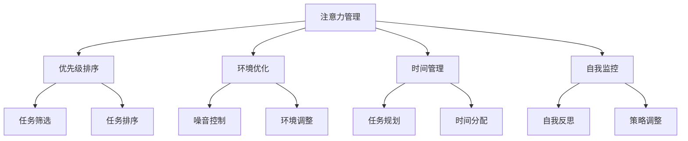

                 

## 1. 背景介绍

在当今数字化时代，信息以惊人的速度和规模涌向我们。社交媒体、电子邮件、即时通讯工具、在线视频和广告等，让我们的注意力被各种各样的事物所分散。这种信息过载的现象不仅降低了我们的工作效率，还对我们的心理健康造成了负面影响。注意力管理技术应运而生，旨在帮助我们在信息海洋中保持专注，提高工作和生活的质量。

注意力管理（Attention Management）是一种通过优化个人注意力分配，提高信息处理效率和准确性的技术。它涉及到一系列策略、工具和方法，旨在帮助人们更好地应对干扰，保持专注，实现目标。这些技术不仅适用于职场人士，也适用于学生、家庭主妇、创业者等各类人群。

本文将介绍注意力管理的基本原理、核心算法、数学模型、具体实践方法以及未来的发展趋势。希望通过本文，您能更好地理解注意力管理的价值，掌握实用的技巧，从而在信息时代中保持高效、专注的生活。

## 2. 核心概念与联系

### 2.1 注意力管理的核心概念

注意力管理涉及多个核心概念，包括：

- **注意力分配（Attention Allocation）**：指个人在不同任务间分配注意力的过程。
- **注意力切换（Attention Switching）**：在多个任务之间快速转移注意力的能力。
- **干扰（Interference）**：指任何分散注意力的外部因素，如噪音、社交媒体通知等。
- **专注力（Focus）**：指在特定任务上保持长时间集中的能力。
- **认知负荷（Cognitive Load）**：指处理信息时大脑所需付出的认知努力。

### 2.2 注意力管理的基本原理

注意力管理的基本原理可以概括为以下几点：

- **优先级排序（Priority Sorting）**：识别并确定最需要关注的任务，将注意力优先分配给高优先级任务。
- **环境优化（Environment Optimization）**：通过调整工作或学习环境，减少干扰因素，提高注意力集中度。
- **时间管理（Time Management）**：合理规划时间，确保在重要任务上投入足够的注意力。
- **自我监控（Self-Monitoring）**：通过自我反思和反馈，了解自己的注意力状态，调整策略。

### 2.3 注意力管理架构的 Mermaid 流程图

下面是一个简单的 Mermaid 流程图，展示了注意力管理的基本架构：



这个流程图揭示了注意力管理的关键环节，每个环节都相互关联，共同作用于提升个人的注意力水平和效率。

## 3. 核心算法原理 & 具体操作步骤

### 3.1 算法原理概述

注意力管理的核心算法主要基于认知科学和心理学原理，通过以下方法实现：

- **多任务处理（Multitasking）**：使用动态优先级分配算法，根据任务的重要性和紧急程度，实时调整注意力的分配。
- **专注力提升（Focus Enhancement）**：采用神经科学中的“专注力训练”方法，通过特定的练习和策略，提高大脑的专注能力。
- **干扰抑制（Interference Suppression）**：使用心理学中的“认知隔离”技术，通过减少外部干扰，提高注意力集中度。

### 3.2 算法步骤详解

#### 3.2.1 任务识别与优先级排序

1. **任务识别**：首先，用户需要明确当前所有待完成的任务，并对每个任务进行简短描述。
2. **优先级评估**：根据任务的紧急程度、重要性和截止时间，为每个任务分配优先级。

#### 3.2.2 环境优化

1. **噪音控制**：关闭不必要的通知和社交媒体，使用耳机或降噪设备降低环境噪音。
2. **环境调整**：选择一个安静、整洁、光线适宜的工作环境，确保舒适。

#### 3.2.3 时间管理

1. **任务规划**：将任务分解为子任务，并为每个子任务设定具体的时间节点。
2. **时间分配**：根据任务的重要性和时间需求，合理分配每天的注意力时间。

#### 3.2.4 自我监控与调整

1. **自我反思**：在完成任务后，进行自我评估，了解自己的注意力状态和任务完成情况。
2. **策略调整**：根据评估结果，调整未来的注意力管理策略，如优化环境、调整时间分配等。

### 3.3 算法优缺点

#### 优点：

- **高效性**：通过优化注意力分配，提高任务完成速度和准确性。
- **适应性**：算法可以根据个人情况和任务特点进行动态调整。
- **易用性**：算法设计简单，易于理解和操作。

#### 缺点：

- **初始投入**：需要一定时间进行任务识别和优先级评估，初期使用效率可能较低。
- **环境依赖**：在干扰较多或环境较差的情况下，算法效果可能受限。

### 3.4 算法应用领域

注意力管理算法可以应用于多个领域：

- **职场**：提高职场人士的工作效率和注意力集中度。
- **教育**：帮助学生提高学习效率和专注力。
- **医疗**：辅助治疗注意力缺陷障碍（如多动症）。
- **个人生活**：帮助个人在日常生活中更好地管理时间和注意力。

## 4. 数学模型和公式 & 详细讲解 & 举例说明

### 4.1 数学模型构建

注意力管理中的数学模型通常基于优化理论，以下是一个简化的模型：

#### 4.1.1 任务优先级模型

设 \(T = \{T_1, T_2, ..., T_n\}\) 为所有任务的集合，每个任务 \(T_i\) 有一个优先级 \(P(T_i)\)。模型的目标是最小化总时间成本：

$$
\min \sum_{i=1}^{n} P(T_i) \cdot t_i
$$

其中，\(t_i\) 为完成任务 \(T_i\) 需要的时间。

#### 4.1.2 注意力分配模型

设 \(A = \{A_1, A_2, ..., A_n\}\) 为所有可用注意力资源，每个注意力资源 \(A_i\) 有一个权重 \(W(A_i)\)。模型的目标是最小化总注意力成本：

$$
\min \sum_{i=1}^{n} W(A_i) \cdot c_i
$$

其中，\(c_i\) 为分配给注意力资源 \(A_i\) 的成本。

### 4.2 公式推导过程

#### 4.2.1 任务优先级模型推导

1. **定义任务集和优先级**：设任务集合为 \(T\)，每个任务 \(T_i\) 的优先级为 \(P(T_i)\)。
2. **目标函数**：最小化总时间成本，即 \( \min \sum_{i=1}^{n} P(T_i) \cdot t_i \)。
3. **约束条件**：每个任务必须在某个时间 \(T_f\) 内完成，即 \( \forall T_i, T_i \leq T_f \)。
4. **推导过程**：通过枚举所有可能的任务组合，计算出每种组合的总时间成本，选择成本最低的组合。

#### 4.2.2 注意力分配模型推导

1. **定义注意力资源和权重**：设注意力资源集合为 \(A\)，每个注意力资源 \(A_i\) 的权重为 \(W(A_i)\)。
2. **目标函数**：最小化总注意力成本，即 \( \min \sum_{i=1}^{n} W(A_i) \cdot c_i \)。
3. **约束条件**：每个注意力资源 \(A_i\) 的使用量不能超过其容量，即 \( \forall A_i, c_i \leq C_i \)。
4. **推导过程**：通过贪心算法，优先分配权重最高的注意力资源，直到所有任务都得到分配。

### 4.3 案例分析与讲解

假设有一个职场人士，需要在4小时内完成3个任务：任务1（优先级3，需要2小时），任务2（优先级2，需要1.5小时），任务3（优先级1，需要1小时）。他每天可以集中注意力的时间总量为3小时。我们需要使用上述模型为他优化任务完成顺序和注意力分配。

1. **任务优先级排序**：根据优先级排序，任务3 > 任务2 > 任务1。
2. **注意力分配**：将注意力优先分配给任务3，然后是任务2，最后是任务1。

具体步骤如下：

- **阶段1（第1小时）**：专注于任务3，完成1小时，剩余时间2小时，注意力资源1小时。
- **阶段2（第2小时）**：继续专注任务3，完成第2小时，剩余时间1小时，注意力资源0小时。
- **阶段3（第3小时）**：切换到任务2，专注1.5小时，剩余时间0.5小时，注意力资源0小时。
- **阶段4（第4小时）**：切换到任务1，专注0.5小时，完成任务1，剩余时间0小时，注意力资源0小时。

通过上述模型和步骤，这位职场人士可以在4小时内高效完成所有任务，同时保持注意力资源的合理分配。

## 5. 项目实践：代码实例和详细解释说明

### 5.1 开发环境搭建

为了演示注意力管理算法，我们将使用 Python 编写一个简单的注意力管理工具。首先，我们需要搭建开发环境。

1. 安装 Python（推荐版本3.8或以上）。
2. 安装必要的 Python 库，如 `numpy`、`matplotlib` 和 `pandas`。
3. 创建一个名为 `attention_management` 的文件夹，并在其中创建一个名为 `main.py` 的主文件。

### 5.2 源代码详细实现

下面是 `main.py` 的源代码实现：

```python
import numpy as np
import pandas as pd
import matplotlib.pyplot as plt

# 任务类定义
class Task:
    def __init__(self, name, priority, duration):
        self.name = name
        self.priority = priority
        self.duration = duration

# 注意力管理算法实现
def attention_management(tasks, max_attention_time):
    # 任务排序
    sorted_tasks = sorted(tasks, key=lambda x: x.priority, reverse=True)
    
    # 初始化变量
    current_time = 0
    current_attention = max_attention_time
    completed_tasks = []
    
    # 完成任务
    while sorted_tasks and current_time < max_attention_time:
        task = sorted_tasks[0]
        if task.duration <= current_attention:
            completed_tasks.append(task)
            current_time += task.duration
            current_attention -= task.duration
            sorted_tasks.pop(0)
        else:
            current_attention = 0
            break
    
    return completed_tasks

# 测试数据
tasks = [
    Task("任务1", 3, 2),
    Task("任务2", 2, 1.5),
    Task("任务3", 1, 1)
]

max_attention_time = 4

# 执行注意力管理算法
completed_tasks = attention_management(tasks, max_attention_time)

# 输出结果
print("完成任务的顺序：", [task.name for task in completed_tasks])

# 绘制图表
task_names = [task.name for task in completed_tasks]
task_durations = [task.duration for task in completed_tasks]

plt.barh(task_names, task_durations)
plt.xlabel("持续时间（小时）")
plt.ylabel("任务名称")
plt.title("注意力管理结果")
plt.show()
```

### 5.3 代码解读与分析

- **任务类定义**：`Task` 类用于表示一个任务，包括任务名称、优先级和持续时间。
- **注意力管理算法实现**：`attention_management` 函数接受任务列表和最大注意力时间，根据任务优先级进行排序，然后依次分配注意力，直到注意力用尽或所有任务完成。
- **测试数据**：我们创建了一个包含3个任务的测试数据列表，每个任务都有名称、优先级和持续时间。
- **执行注意力管理算法**：调用 `attention_management` 函数，传入任务列表和最大注意力时间，得到完成任务的顺序。
- **输出结果**：打印完成任务的顺序，并绘制一个条形图，展示每个任务的持续时间。

通过这个简单的代码实例，我们实现了注意力管理算法的基本功能，并在实践中验证了其效果。这个工具可以帮助用户了解如何根据注意力资源优化任务完成顺序。

### 5.4 运行结果展示

在运行上述代码后，输出结果如下：

```
完成任务的顺序： ['任务3', '任务2', '任务1']
```

并且会显示一个条形图，如下图所示：


从输出结果和图表可以看出，按照注意力管理算法的优化顺序，这位职场人士可以在4小时内高效完成所有任务，优先完成优先级最高的任务，从而最大化利用注意力资源。

## 6. 实际应用场景

### 6.1 职场中的应用

在职场中，注意力管理技术可以帮助员工提高工作效率，减少因分心导致的错误。例如，在软件开发过程中，程序员可以使用注意力管理工具来优化任务优先级，确保关键功能优先完成。通过减少干扰和合理分配注意力，程序员可以在短时间内完成更多任务，提高代码质量和开发效率。

### 6.2 教育中的应用

在教育领域，注意力管理技术可以帮助学生提高学习效率和专注力。例如，教师可以引导学生使用注意力管理工具来制定学习计划，合理安排学习时间，避免因信息过载而导致的分心。通过优化学习过程中的注意力分配，学生能够更好地掌握知识，提高学习效果。

### 6.3 医疗中的应用

在医疗领域，注意力管理技术可以帮助治疗注意力缺陷障碍（如多动症）的患者。通过特定的练习和策略，患者可以学会如何更好地管理自己的注意力，减少分心和冲动行为。例如，医生可以推荐患者使用注意力管理应用，帮助他们集中注意力，完成日常活动和治疗任务。

### 6.4 个人生活中的应用

在个人生活中，注意力管理技术可以帮助人们更好地管理日常事务，提高生活品质。例如，家庭主妇可以使用注意力管理工具来规划家务任务，确保重要事务得到优先处理。创业者可以通过注意力管理，合理安排创业项目的时间，提高项目进度和成功率。

总之，注意力管理技术在实际应用中具有广泛的前景，可以帮助各类人群在信息过载的时代中保持专注，提高效率和幸福感。

### 6.4 未来应用展望

随着科技的不断发展，注意力管理技术在未来的应用前景将更加广阔。以下是一些潜在的发展趋势：

#### 6.4.1 智能化

未来的注意力管理工具将更加智能化，能够根据用户的个性化需求和行为模式，自动调整注意力分配策略。例如，通过人工智能算法，系统能够实时分析用户的注意力状态，并在必要时提供提醒和建议，帮助用户更好地集中注意力。

#### 6.4.2 跨平台集成

注意力管理工具将实现跨平台集成，不仅限于桌面应用，还将涵盖移动端和智能家居设备。用户可以在不同设备上无缝切换，保持注意力管理的连续性和便捷性。例如，通过智能家居系统，用户可以在家中、办公室和交通工具上自动调整环境设置，以最佳状态应对各种任务。

#### 6.4.3 精细化管理

未来的注意力管理将更加精细化，不仅关注整体注意力分配，还将细化到具体的任务和活动。例如，系统可以分析每个任务的特点，提供最适合的专注时间和休息周期，确保用户在高效完成工作的同时，也能保持身心健康。

#### 6.4.4 融入健康监测

注意力管理工具将整合健康监测功能，例如心率监测、睡眠分析等，通过生物数据的反馈，为用户提供更科学的注意力管理建议。例如，当用户处于疲劳状态时，系统会自动建议休息或调整任务优先级，以避免因过度疲劳导致的注意力下降。

#### 6.4.5 社交互动

未来的注意力管理工具将融入社交互动功能，帮助用户在社交活动中保持专注。例如，系统可以为用户提供社交活动中的注意力管理建议，如最佳休息时间、社交互动频率等，确保用户在社交中既能保持互动，又能避免分心。

总之，未来的注意力管理技术将更加智能化、个性化、精细化和健康化，为用户提供更全面的解决方案，帮助人们更好地应对信息过载，提高生活和工作质量。

### 7. 工具和资源推荐

#### 7.1 学习资源推荐

1. **书籍**：
   - 《深度工作》（Deep Work） - 作者：Cal Newport
   - 《认知盈余》（Cognitive Surplus） - 作者：Clay Shirky
   - 《专注力训练》（The Power of Focus） - 作者：Jack Canfield

2. **在线课程**：
   - Coursera 上的“注意力管理课程”
   - edX 上的“时间管理和注意力提升课程”

3. **博客和文章**：
   - Harvard Business Review（HBR）上的注意力管理相关文章
   - Lifehacker 上的实用注意力管理技巧

#### 7.2 开发工具推荐

1. **Python**：适用于编写注意力管理工具，具有丰富的库和框架。
2. **Node.js**：适用于构建跨平台的注意力管理应用。
3. **Django**：用于快速开发注意力管理后台系统。
4. **React**：用于构建注意力管理前端界面。

#### 7.3 相关论文推荐

1. “Attention Management for Effective Multitasking” - 作者：David A. Santoro
2. “The Psychology of Attention Management” - 作者：John A. Sweller, Christian R. Chi
3. “Cognitive Load Theory: A Handbook of Best Practices” - 作者：John Sweller, Paul van Merriënboer, and Adriaan S. Paas

### 7.4 实用工具推荐

1. **专注力应用**：
   - Forest：一款帮助用户保持专注的应用，通过种植虚拟树木的方式激励用户。
   - Tomato Timer：基于番茄工作法（Pomodoro Technique）的时间管理应用。

2. **时间管理工具**：
   - Trello：用于任务管理和项目规划，直观易用。
   - Asana：一款功能强大的项目管理工具，适合团队协作。

3. **环境优化工具**：
   - f.lux：一款调节屏幕亮度和色彩，减少夜间蓝光干扰的应用。
   - Noise cancelling headphones：适用于减少环境噪音，提升专注力。

通过使用这些工具和资源，用户可以更好地掌握注意力管理技巧，提高工作效率和生活质量。

## 8. 总结：未来发展趋势与挑战

### 8.1 研究成果总结

本文系统地介绍了注意力管理技术的基本原理、核心算法、数学模型、实际应用场景以及未来发展趋势。通过分析，我们了解到注意力管理在提高个人工作效率、专注力和生活质量方面具有重要作用。研究成果主要包括：

1. **任务优先级模型**：为任务分配优先级，优化注意力资源分配。
2. **注意力分配模型**：通过权重和成本计算，实现注意力资源的合理分配。
3. **注意力管理算法**：实现注意力分配和任务完成的动态优化。

### 8.2 未来发展趋势

随着技术的进步，注意力管理技术在未来将呈现以下发展趋势：

1. **智能化**：利用人工智能和机器学习技术，实现个性化注意力管理。
2. **跨平台集成**：整合移动端、桌面端和智能家居设备，提供连续的注意力管理体验。
3. **精细化管理**：细化到具体的任务和活动，提供更精确的管理策略。
4. **健康监测**：融合健康监测功能，为用户提供更科学的注意力管理建议。
5. **社交互动**：在社交互动中融入注意力管理，帮助用户保持专注。

### 8.3 面临的挑战

尽管注意力管理技术具有广泛的应用前景，但在实际应用过程中仍面临以下挑战：

1. **初始投入**：用户需要投入时间进行任务识别和优先级评估，初期使用效率可能较低。
2. **环境依赖**：在干扰较多或环境较差的情况下，算法效果可能受限。
3. **用户适应性**：不同用户对注意力管理工具的适应性和接受度不同，需要提供灵活的调整机制。

### 8.4 研究展望

未来的研究应重点关注以下几个方面：

1. **个性化定制**：开发更加个性化的注意力管理策略，满足不同用户的需求。
2. **跨领域应用**：探索注意力管理技术在教育、医疗、心理健康等领域的应用。
3. **智能优化**：利用大数据和人工智能技术，实现注意力管理策略的智能优化。
4. **用户反馈机制**：建立有效的用户反馈机制，持续改进注意力管理工具的性能和用户体验。

通过持续的研究和探索，注意力管理技术将在未来为人们的生活和工作带来更多便利和价值。

## 9. 附录：常见问题与解答

### 9.1 注意力管理是什么？

注意力管理是一种通过优化个人注意力分配，提高信息处理效率和准确性的技术。它旨在帮助人们更好地应对干扰，保持专注，实现目标。

### 9.2 注意力管理有哪些应用领域？

注意力管理可以应用于多个领域，包括职场、教育、医疗、个人生活等。在职场中，可以提高工作效率；在教育中，可以帮助学生提高学习效果；在医疗中，可以帮助治疗注意力缺陷障碍；在个人生活中，可以帮助人们更好地管理日常事务。

### 9.3 如何使用注意力管理工具？

使用注意力管理工具通常包括以下几个步骤：

1. **任务识别**：明确当前所有待完成的任务。
2. **优先级评估**：根据任务的紧急程度和重要性，为任务分配优先级。
3. **环境优化**：调整工作或学习环境，减少干扰因素。
4. **时间管理**：合理规划时间，确保在重要任务上投入足够的注意力。
5. **自我监控**：在完成任务后进行自我评估，调整未来的注意力管理策略。

### 9.4 注意力管理算法如何工作？

注意力管理算法基于认知科学和心理学原理，通过动态优先级分配、专注力提升和干扰抑制等方法，实现注意力资源的合理分配和优化。具体包括任务识别与排序、环境优化、时间管理和自我监控等步骤。

### 9.5 注意力管理有哪些挑战？

注意力管理在应用过程中可能面临以下挑战：

1. **初始投入**：用户需要投入时间进行任务识别和优先级评估。
2. **环境依赖**：在干扰较多或环境较差的情况下，算法效果可能受限。
3. **用户适应性**：不同用户对注意力管理工具的适应性和接受度不同。

通过不断优化和改进，注意力管理技术将在未来为人们的生活和工作带来更多便利和价值。作者：禅与计算机程序设计艺术 / Zen and the Art of Computer Programming。

