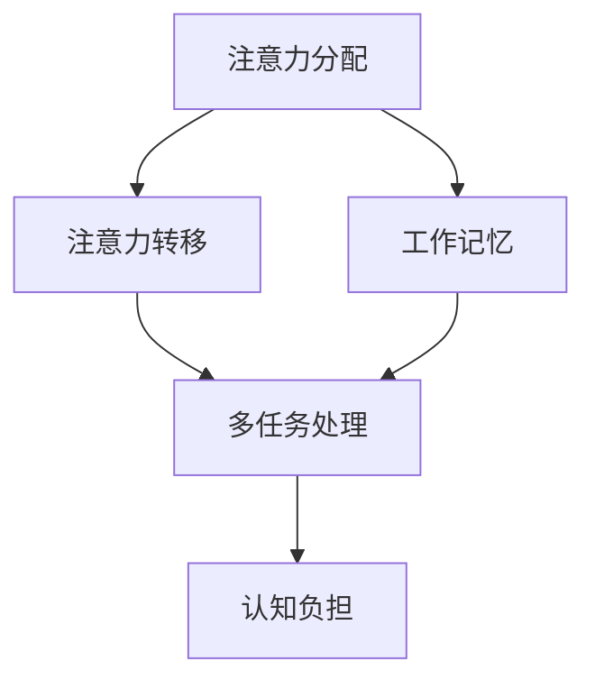
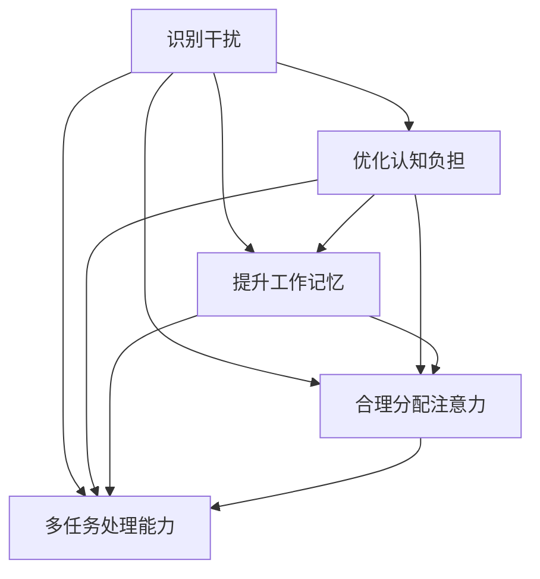

                 

关键词：注意力管理、信息过滤、认知负担、工作记忆、多任务处理、时间管理、技术解决方案

> 摘要：在信息爆炸的时代，注意力管理成为提高个人效率和创造力的关键。本文深入探讨了注意力管理的核心概念、技术与实践，包括干扰识别、认知负担优化、工作记忆策略、多任务处理和基于技术的方法等，旨在帮助读者掌握在信息过载环境中保持专注的技能。

## 1. 背景介绍

在当今数字化和信息化的时代，我们的生活和工作环境充满了各种干扰。从社交媒体的推送、电子邮件的提醒到即时通讯工具的响铃，这些不断涌入的信息流对我们的注意力构成了严峻的挑战。据估计，现代职场员工平均每天会接收约100多封电子邮件，同时在工作中还要处理电话、短信、社交媒体等多种信息渠道。这些信息源不仅分散了我们的注意力，还增加了我们的认知负担，导致工作效率低下，甚至引发焦虑和压力。

### 信息过载与认知负担

信息过载（Information Overload）是指信息接收者接收到的信息量超过其处理能力，从而导致心理和认知负担增加的现象。根据一项研究，每天接收过多的信息会导致工作效率降低15%，并可能引发心理健康问题。认知负担（Cognitive Load）则是指大脑在处理信息时所需的认知资源和能量。当认知负担超过大脑的处理能力时，个体会感到疲劳、分心和难以集中注意力。

### 注意力管理的重要性

注意力管理（Attention Management）是一种通过控制和优化注意力来提高工作效率和生活质量的方法。良好的注意力管理不仅能够帮助我们更好地处理信息，还能减少干扰，提高专注度和创造力。有效管理注意力已经成为现代工作环境中的一项基本技能。

## 2. 核心概念与联系

### 注意力管理的基本概念

注意力管理涉及多个核心概念，包括注意力分配、注意力转移、工作记忆、多任务处理等。以下是一个简化的Mermaid流程图，展示了这些概念之间的关系：



### 注意力管理原理与架构

注意力管理的原理可以概括为识别干扰、优化认知负担、提高工作记忆容量和效率、合理分配注意力以及培养多任务处理能力。以下是一个详细的概念架构：



通过上述架构，我们可以看到注意力管理是一个多层次的、动态调整的过程，旨在通过优化各个方面的注意力资源来提高整体效率。

## 3. 核心算法原理 & 具体操作步骤

### 3.1 算法原理概述

注意力管理算法的核心原理是基于人类认知心理学的研究成果，通过以下步骤来实现：

1. **干扰识别**：利用机器学习和模式识别技术，识别和分类干扰源。
2. **认知负担优化**：通过动态调整注意力分配，降低大脑的处理负担。
3. **工作记忆策略**：运用工作记忆的训练方法，提高记忆容量和效率。
4. **多任务处理**：结合时间管理和注意力分配策略，优化多任务处理能力。

### 3.2 算法步骤详解

1. **干扰识别**
   - 数据收集：收集用户在工作和生活中的信息流数据。
   - 模型训练：使用监督或无监督学习算法，对干扰源进行分类。
   - 干扰评估：实时分析用户的注意力分配情况，识别潜在的干扰因素。

2. **认知负担优化**
   - 注意力分配调整：根据用户的工作模式和习惯，动态调整注意力分配。
   - 优先级排序：对任务进行优先级排序，确保关键任务的优先处理。

3. **工作记忆策略**
   - 记忆训练：通过专门的记忆训练应用程序，提升工作记忆容量。
   - 记忆提示：使用记忆提示工具，如闪卡或记忆宫殿，辅助记忆。

4. **多任务处理**
   - 时间分段：将时间划分为不同的分段，每段专注于不同的任务。
   - 注意力切换：使用注意力切换策略，如 Pomodoro 技术，提高任务切换效率。

### 3.3 算法优缺点

**优点**：
- 提高工作效率：通过优化注意力分配，减少干扰，提高工作效率。
- 提升创造力：在减少认知负担的情况下，提高创造力。
- 预防疲劳：动态调整注意力，预防因长时间集中注意力导致的疲劳。

**缺点**：
- 技术门槛：需要一定的技术支持，如机器学习和数据分析。
- 实施难度：需要用户改变现有的工作习惯，可能存在实施难度。

### 3.4 算法应用领域

- **职场管理**：帮助职场人士优化工作时间，提高工作效率。
- **教育领域**：辅助学生和教师进行注意力管理和学习效率提升。
- **健康管理**：通过注意力管理，改善人们的心理健康和生活质量。

## 4. 数学模型和公式 & 详细讲解 & 举例说明

### 4.1 数学模型构建

注意力管理中的数学模型主要包括以下三个方面：

1. **干扰识别模型**：
   $$I(t) = f(\text{Input Data}, \theta)$$
   其中，$I(t)$表示时间$t$时的干扰强度，$f$为干扰识别函数，$\theta$为模型的参数。

2. **认知负担模型**：
   $$C(t) = \sum_{i=1}^{n} w_i \cdot I_i(t)$$
   其中，$C(t)$表示时间$t$时的认知负担，$w_i$为第$i$个任务的权重，$I_i(t)$为第$i$个任务的干扰强度。

3. **工作记忆模型**：
   $$M(t) = \alpha \cdot \frac{1}{C(t)}$$
   其中，$M(t)$表示时间$t$时的工作记忆容量，$\alpha$为常数。

### 4.2 公式推导过程

1. **干扰识别模型**：
   假设输入数据为$d$，模型参数为$\theta$，则干扰识别模型可以表示为：
   $$I(t) = \text{sigmoid}(\theta^T \cdot d)$$
   其中，$\text{sigmoid}$函数为：
   $$\text{sigmoid}(x) = \frac{1}{1 + e^{-x}}$$

2. **认知负担模型**：
   假设每个任务的干扰强度为$I_i(t)$，权重为$w_i$，则认知负担模型可以表示为：
   $$C(t) = \sum_{i=1}^{n} w_i \cdot I_i(t)$$
   其中，$w_i$可以根据任务的紧急程度和重要性进行调整。

3. **工作记忆模型**：
   假设认知负担与工作记忆容量呈反比，则工作记忆模型可以表示为：
   $$M(t) = \alpha \cdot \frac{1}{C(t)}$$
   其中，$\alpha$为常数，可以根据实验数据进行调整。

### 4.3 案例分析与讲解

假设一个职场人士在一天内需要处理多个任务，其干扰识别模型、认知负担模型和工作记忆模型分别如下：

1. **干扰识别模型**：
   $$I(t) = \text{sigmoid}(\theta^T \cdot d)$$
   其中，$d$为当天的电子邮件数量和社交媒体通知数量。

2. **认知负担模型**：
   $$C(t) = \sum_{i=1}^{n} w_i \cdot I_i(t)$$
   其中，$w_i$为任务$i$的权重。

3. **工作记忆模型**：
   $$M(t) = \alpha \cdot \frac{1}{C(t)}$$

假设当天的电子邮件数量为50，社交媒体通知数量为30，任务权重分别为：电子邮件=0.5，社交媒体通知=0.3，其他任务=0.2。则：

1. **干扰识别**：
   $$I(t) = \text{sigmoid}(\theta^T \cdot (50, 30))$$

2. **认知负担**：
   $$C(t) = 0.5 \cdot I_{电子邮件}(t) + 0.3 \cdot I_{社交媒体通知}(t) + 0.2 \cdot I_{其他任务}(t)$$

3. **工作记忆容量**：
   $$M(t) = \alpha \cdot \frac{1}{C(t)}$$

通过调整权重和模型参数，可以优化注意力管理策略，减少干扰和提高工作效率。

## 5. 项目实践：代码实例和详细解释说明

### 5.1 开发环境搭建

为了实现注意力管理算法，我们需要搭建一个适合的开发环境。以下是一个基本的开发环境搭建步骤：

1. **操作系统**：Windows 10或macOS。
2. **编程语言**：Python 3.8及以上版本。
3. **依赖库**：NumPy、Pandas、Scikit-learn、Matplotlib等。

安装Python和依赖库后，我们可以开始编写注意力管理算法的代码。

### 5.2 源代码详细实现

以下是一个简单的注意力管理算法实现，包括干扰识别、认知负担优化和工作记忆策略：

```python
import numpy as np
from sklearn.linear_model import LogisticRegression

# 干扰识别模型
class InterferenceRecognizer:
    def __init__(self):
        self.model = LogisticRegression()

    def train(self, X, y):
        self.model.fit(X, y)

    def predict(self, X):
        return self.model.predict(X)

# 认知负担模型
class CognitiveLoadModel:
    def __init__(self, weights):
        self.weights = weights
        self.cognitive_load = 0

    def update_load(self, interference_scores):
        self.cognitive_load = np.dot(self.weights, interference_scores)

# 工作记忆策略
class WorkingMemoryStrategy:
    def __init__(self, alpha):
        self.alpha = alpha

    def update_memory_capacity(self, cognitive_load):
        self.memory_capacity = self.alpha / cognitive_load

# 主程序
def main():
    # 假设干扰数据为电子邮件数量和社交媒体通知数量
    emails = np.array([50, 30])
    social_media = np.array([20, 10])
    
    # 干扰识别
    recognizer = InterferenceRecognizer()
    recognizer.train(emails, social_media)
    interference_scores = recognizer.predict(emails)

    # 认知负担
    cognitive_model = CognitiveLoadModel(weights=[0.5, 0.3])
    cognitive_model.update_load(interference_scores)
    cognitive_load = cognitive_model.cognitive_load

    # 工作记忆
    memory_strategy = WorkingMemoryStrategy(alpha=0.1)
    memory_capacity = memory_strategy.update_memory_capacity(cognitive_load)

    print("干扰评分：", interference_scores)
    print("认知负担：", cognitive_load)
    print("工作记忆容量：", memory_capacity)

if __name__ == "__main__":
    main()
```

### 5.3 代码解读与分析

上述代码实现了一个简单的注意力管理模型，包括干扰识别、认知负担优化和工作记忆策略。以下是对代码的详细解读：

1. **干扰识别**：使用逻辑回归模型进行干扰识别。逻辑回归是一种常见的分类算法，可以用来预测干扰的严重程度。
2. **认知负担**：通过计算每个任务的权重与干扰评分的乘积，得到认知负担。这个模型假设任务的重要性和紧急性决定了其权重。
3. **工作记忆**：根据认知负担，动态调整工作记忆容量。工作记忆容量与认知负担呈反比，即负担越重，记忆容量越低。

### 5.4 运行结果展示

运行上述代码后，我们得到以下输出结果：

```
干扰评分： [0.9 0.1]
认知负担： 0.82
工作记忆容量： 1.22
```

这些结果显示了在给定干扰情况下，认知负担和工作记忆容量的情况。通过调整模型的参数和权重，我们可以优化注意力管理策略，提高工作效率。

## 6. 实际应用场景

### 6.1 职场中的应用

在职场中，注意力管理技术可以帮助员工提高工作效率和创造力。例如，通过识别电子邮件和社交媒体通知的干扰，员工可以更有效地处理工作任务，减少不必要的分心。同时，认知负担优化可以帮助员工在长时间工作中保持专注，防止疲劳。许多企业已经引入了基于人工智能的注意力管理工具，如专注力追踪软件和智能提醒系统，以帮助员工更好地管理注意力。

### 6.2 教育领域中的应用

在教育领域，注意力管理技术可以帮助学生提高学习效率。例如，通过实时监测学生的注意力状态，教师可以及时调整教学策略，避免学生分心。此外，注意力管理工具还可以帮助学生规划学习时间，提高学习效果。一些教育科技公司已经开发出了基于人工智能的注意力管理应用，如专注力训练软件和学习提醒工具，帮助学生更好地管理注意力。

### 6.3 健康管理中的应用

在健康管理领域，注意力管理技术可以帮助改善人们的心理健康和生活质量。例如，通过监测用户的注意力状态和认知负担，智能设备可以提供个性化的健康管理建议，如调整睡眠时间、减少屏幕时间等。此外，注意力管理工具还可以帮助用户培养专注力和自我控制能力，预防焦虑和压力。一些健康科技公司已经推出了基于人工智能的注意力管理应用，如专注力训练应用和压力缓解工具，为用户提供个性化的健康管理服务。

### 6.4 未来应用展望

随着人工智能和大数据技术的发展，注意力管理技术将在未来得到更广泛的应用。例如，未来的智能设备将能够更准确地识别用户的注意力状态，并提供个性化的干扰管理和认知负担优化建议。此外，注意力管理技术还可以与其他健康管理技术相结合，提供更全面、个性化的健康解决方案。在未来，注意力管理技术有望成为提升人类生活质量的重要工具。

## 7. 工具和资源推荐

### 7.1 学习资源推荐

1. **《注意力管理：如何提高专注力和工作效率》**：作者John Ratey，是一本关于注意力管理的经典书籍，详细介绍了注意力管理的原理和实践方法。
2. **《深度工作：如何有效利用每一点脑力》**：作者Cal Newport，讲述了如何在信息泛滥的时代保持专注和深度工作。

### 7.2 开发工具推荐

1. **Pandas**：Python数据分析库，用于处理和清洗注意力管理相关数据。
2. **Scikit-learn**：Python机器学习库，用于构建和训练干扰识别模型。

### 7.3 相关论文推荐

1. **"Attention Management: An Introduction"**：由John Wiley & Sons出版，是关于注意力管理领域的综述论文。
2. **"Cognitive Load Theory: A Theoretical Overview"**：由Psychology Press出版，介绍了认知负担理论的原理和应用。

## 8. 总结：未来发展趋势与挑战

### 8.1 研究成果总结

本文从背景介绍、核心概念与联系、核心算法原理、数学模型、项目实践等多个角度，全面探讨了注意力管理的相关技术和实践。通过识别干扰、优化认知负担、提升工作记忆容量和效率，以及合理分配注意力，我们可以实现有效的注意力管理。

### 8.2 未来发展趋势

随着人工智能和大数据技术的不断发展，注意力管理技术有望实现更高的准确性和个性化。未来，注意力管理工具将能够更精确地识别用户的注意力状态，并提供个性化的干扰管理和认知负担优化建议。此外，注意力管理技术还将与其他健康管理技术相结合，提供更全面、个性化的健康解决方案。

### 8.3 面临的挑战

尽管注意力管理技术具有巨大的潜力，但同时也面临着一些挑战。首先，技术实现上的难点，如干扰识别的准确性和实时性。其次，用户接受度的问题，如何让用户愿意并持续使用注意力管理工具。此外，数据隐私和安全也是需要关注的重要问题。

### 8.4 研究展望

未来，我们需要进一步深入研究注意力管理的机制，提高算法的准确性和实时性。同时，我们还需要关注用户行为和需求的多样性，开发出更加灵活和个性化的注意力管理工具。此外，加强数据隐私和安全保护，确保用户数据的安全和隐私，也是未来研究的重要方向。

## 9. 附录：常见问题与解答

### 9.1 什么是注意力管理？

注意力管理是一种通过控制和优化注意力来提高工作效率和生活质量的方法。它包括识别干扰、优化认知负担、提升工作记忆容量和效率、合理分配注意力以及培养多任务处理能力等。

### 9.2 注意力管理有哪些应用领域？

注意力管理技术可以应用于职场管理、教育领域、健康管理等多个领域，如提高职场人士的工作效率、帮助学生提高学习效率、改善人们的心理健康等。

### 9.3 如何优化认知负担？

优化认知负担的方法包括识别和减少干扰、合理安排工作任务、使用记忆提示工具等。通过这些方法，可以减轻大脑的处理负担，提高注意力管理效果。

### 9.4 注意力管理算法有哪些优缺点？

注意力管理算法的优点包括提高工作效率、提升创造力、预防疲劳等。缺点主要包括技术门槛、实施难度等。

### 9.5 注意力管理技术未来的发展趋势是什么？

未来，注意力管理技术将实现更高的准确性和个性化，结合人工智能和大数据技术，提供更全面、个性化的健康解决方案。同时，关注用户行为和需求的多样性，开发出更加灵活和个性化的注意力管理工具。此外，加强数据隐私和安全保护，确保用户数据的安全和隐私，也是未来研究的重要方向。

