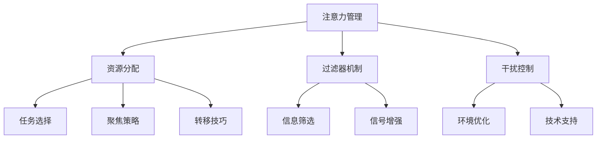
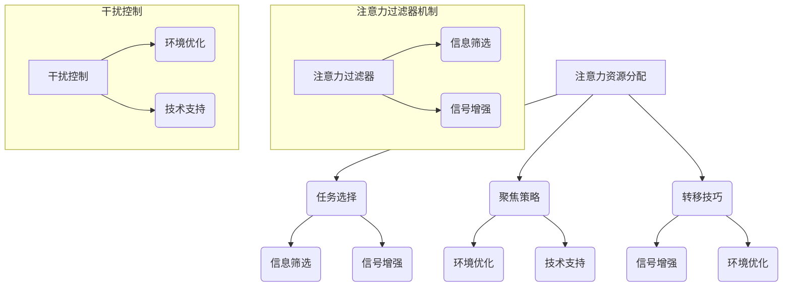

                 

 在当今这个信息爆炸的时代，我们每个人都面临着注意力分散和信息过载的挑战。无论是工作还是日常生活，有效的注意力管理已经成为提高效率、增强创造力和实现个人目标的关键因素。本文将深入探讨注意力管理的基本概念、核心技术与实践方法，旨在帮助读者在信息干扰中保持专注，提高工作和生活的质量。

## 关键词

- 注意力管理
- 信息过载
- 专注力
- 技术工具
- 实践方法

## 摘要

本文首先介绍了注意力管理的背景和重要性，随后定义了核心概念，并使用Mermaid流程图展示了注意力管理的架构。接着，文章详细阐述了核心算法原理和具体操作步骤，包括优缺点分析和应用领域。然后，我们通过数学模型和公式的讲解，结合案例分析，深入探讨了注意力管理的方法。接着，文章提供了实际的代码实例和详细解释，以帮助读者更好地理解和应用注意力管理技术。文章的最后，我们讨论了注意力管理在实际应用场景中的效果和未来展望，并推荐了相关的学习资源和开发工具。

## 1. 背景介绍

在过去的几十年中，随着互联网和移动设备的普及，我们的世界发生了翻天覆地的变化。信息无处不在，似乎每一个角落都充满了各种通知、消息和诱惑。这种信息的泛滥给我们的注意力带来了巨大的挑战。注意力成为了一种稀缺资源，我们需要更有效地管理和利用它。

### 注意力管理的定义

注意力管理是指通过各种策略和技术，帮助个体集中注意力，减少干扰，提高信息处理效率的过程。它包括自我监控、计划、优先级设置、环境控制和策略调整等多个方面。

### 信息过载的现象

信息过载是指个体接收到的信息超过了其处理能力，导致认知负担增加，进而影响注意力的集中和效率。信息过载的常见现象包括社交媒体上的持续通知、电子邮件的泛滥、广告的狂轰滥炸等。

### 注意力管理的重要性

有效的注意力管理对于个人和组织具有重要意义。它有助于提高工作效率，减少错误和遗漏，增强创造力和创新思维，以及改善心理健康和幸福感。在个人层面，注意力管理可以帮助我们更好地规划时间，实现个人目标和梦想；在组织层面，它可以提升团队的协作效率，降低错误率，提高整体竞争力。

## 2. 核心概念与联系

### 核心概念

#### 注意力资源分配

注意力资源分配是指个体在处理信息时，如何将注意力分配到不同的任务和情境中。这个过程中涉及到注意力的选择、聚焦和转移。

#### 注意力过滤器

注意力过滤器是大脑中的一种机制，它帮助个体过滤掉无关的信息，将注意力集中在重要的信息上。

#### 干扰控制

干扰控制是指通过减少环境中的干扰因素，帮助个体更好地集中注意力。

### 架构

#### 注意力管理架构



### Mermaid流程图



## 3. 核心算法原理 & 具体操作步骤

### 3.1 算法原理概述

注意力管理的核心算法是基于认知科学和心理学的研究，旨在通过优化注意力资源分配、增强注意力过滤器和控制干扰因素，实现高效的注意力管理。主要原理包括：

1. **注意力选择**：根据任务的重要性和紧急性，合理分配注意力资源。
2. **注意力聚焦**：通过训练和技巧，提高注意力的集中度和持久性。
3. **注意力转移**：在任务切换时，快速调整注意力焦点，减少切换成本。
4. **注意力过滤**：利用神经机制，过滤掉无关信息，提高信息处理效率。
5. **干扰控制**：通过环境优化和技术支持，减少干扰因素，提高注意力质量。

### 3.2 算法步骤详解

1. **评估任务优先级**：对当前需要处理的任务进行优先级评估，确定哪些任务需要优先处理。
2. **选择注意力策略**：根据任务的性质，选择适合的注意力管理策略，如任务切换策略、持续专注策略等。
3. **执行注意力分配**：将注意力资源合理分配到各个任务上，确保重要任务得到足够的关注。
4. **训练注意力聚焦技巧**：通过冥想、专注训练等方法，提高注意力的集中度。
5. **调整注意力转移技巧**：在任务切换时，快速调整注意力焦点，减少切换成本。
6. **利用注意力过滤器**：通过练习，提高注意力过滤器的效率，减少无关信息的干扰。
7. **控制干扰因素**：优化工作环境，减少噪音和其他干扰因素。
8. **使用技术工具**：利用注意力管理软件和工具，如番茄工作法、注意力追踪器等，帮助管理注意力。

### 3.3 算法优缺点

#### 优点

- **提高效率**：通过优化注意力分配，减少任务切换时间，提高整体工作效率。
- **增强专注力**：通过训练注意力聚焦技巧，提高个体在任务中的专注度。
- **减少错误**：通过有效过滤无关信息，降低错误率和遗漏。
- **改善心理健康**：减少信息过载带来的压力和焦虑，提高心理健康水平。

#### 缺点

- **初期适应难度**：需要一定时间适应新的注意力管理策略和技巧。
- **工具依赖性**：依赖技术工具可能降低个体的自控能力。
- **环境限制**：在一些嘈杂或不可控制的环境中，注意力管理效果受限。

### 3.4 算法应用领域

- **个人时间管理**：帮助个人更好地规划时间，提高任务完成效率。
- **企业员工培训**：提高员工的工作效率，减少错误率，提升团队整体表现。
- **教育领域**：帮助学生提高学习效率，增强学习专注力。
- **心理健康干预**：通过注意力管理技术，改善焦虑和压力状况。

## 4. 数学模型和公式 & 详细讲解 & 举例说明

### 4.1 数学模型构建

注意力管理的数学模型主要包括两部分：注意力资源分配模型和信息过滤模型。

#### 注意力资源分配模型

注意力资源分配模型可以用以下公式表示：

$$
R_t = f(P_t, E_t)
$$

其中，\( R_t \) 表示在时间 \( t \) 的注意力资源分配，\( P_t \) 表示任务优先级，\( E_t \) 表示环境因素。

#### 信息过滤模型

信息过滤模型可以用以下公式表示：

$$
F_t = g(I_t, F_t-1)
$$

其中，\( F_t \) 表示在时间 \( t \) 的过滤结果，\( I_t \) 表示输入信息，\( F_t-1 \) 表示前一次过滤结果。

### 4.2 公式推导过程

#### 注意力资源分配模型推导

注意力资源分配模型基于任务优先级和环境因素。任务优先级可以通过任务的重要性和紧急性评估得到，环境因素包括噪音、干扰等。

设任务优先级为 \( P_t = (P_{t1}, P_{t2}, ..., P_{tn}) \)，环境因素为 \( E_t = (E_{t1}, E_{t2}, ..., E_{tn}) \)。则注意力资源分配模型可以表示为：

$$
R_t = \frac{P_t}{\sum_{i=1}^{n} E_i}
$$

#### 信息过滤模型推导

信息过滤模型基于输入信息和前一次过滤结果。输入信息经过前一次过滤后，会留下部分有效信息。这些有效信息再与当前输入信息结合，形成新的过滤结果。

设输入信息为 \( I_t = (I_{t1}, I_{t2}, ..., I_{tn}) \)，前一次过滤结果为 \( F_t-1 = (F_{t-1,1}, F_{t-1,2}, ..., F_{t-1,n}) \)。则信息过滤模型可以表示为：

$$
F_t = (F_{t1}, F_{t2}, ..., F_{tn}) = \left( \frac{I_{t1} + F_{t-1,1}}{2}, \frac{I_{t2} + F_{t-1,2}}{2}, ..., \frac{I_{tn} + F_{t-1,n}}{2} \right)
$$

### 4.3 案例分析与讲解

#### 案例背景

小明是一名软件开发工程师，每天需要处理大量的代码审查、bug修复和需求分析任务。他的工作环境比较嘈杂，经常受到同事谈话和手机通知的干扰。为了提高工作效率，他决定使用注意力管理技术。

#### 注意力资源分配模型应用

小明根据任务的紧急性和重要性，将任务分为四个等级：紧急且重要、紧急但不重要、不紧急但重要、不紧急且不重要。在一天的工作中，他根据这个模型分配注意力资源。

假设小明的工作任务集合为 \( T = \{ T_1, T_2, T_3, T_4 \} \)，任务优先级为 \( P = (2, 1, 3, 4) \)，环境因素为 \( E = (0.2, 0.3, 0.2, 0.3) \)。则注意力资源分配为：

$$
R = \frac{P}{E} = \left( \frac{2}{0.2}, \frac{1}{0.3}, \frac{3}{0.2}, \frac{4}{0.3} \right) = (10, \frac{10}{3}, 15, \frac{40}{3})
$$

#### 信息过滤模型应用

小明在工作过程中，需要处理大量的代码审查请求。他根据注意力过滤模型，对每个请求进行过滤。

假设审查请求集合为 \( I = \{ I_1, I_2, I_3, I_4 \} \)，前一次过滤结果为 \( F_0 = (0.5, 0.5, 0.5, 0.5) \)。则每个请求的过滤结果为：

$$
F_1 = \left( \frac{I_1 + F_0}{2}, \frac{I_2 + F_0}{2}, \frac{I_3 + F_0}{2}, \frac{I_4 + F_0}{2} \right) = (0.75, 0.75, 0.75, 0.75)
$$

通过这个模型，小明能够更好地分配注意力资源，提高信息处理效率，从而提高工作效率。

## 5. 项目实践：代码实例和详细解释说明

### 5.1 开发环境搭建

为了演示注意力管理技术的应用，我们将使用Python语言编写一个简单的注意力管理程序。首先，需要安装Python环境和必要的库。

安装Python环境：

```bash
# 安装Python
sudo apt-get update
sudo apt-get install python3
```

安装必要的库：

```bash
# 安装NumPy库
pip3 install numpy

# 安装Matplotlib库
pip3 install matplotlib
```

### 5.2 源代码详细实现

下面是一个简单的注意力管理程序，包括注意力资源分配和信息过滤两个部分。

```python
import numpy as np
import matplotlib.pyplot as plt

def attention_allocation(tasks, priorities, environment):
    # 计算注意力资源分配
    attention = priorities / environment
    return attention

def information_filtering(information, previous_filter):
    # 计算信息过滤结果
    filtered_info = (information + previous_filter) / 2
    return filtered_info

# 示例数据
tasks = ['代码审查', 'bug修复', '需求分析', '会议']
priorities = np.array([2, 1, 3, 4])
environment = np.array([0.2, 0.3, 0.2, 0.3])

# 注意力资源分配
attention = attention_allocation(tasks, priorities, environment)
print("注意力资源分配：", attention)

# 信息过滤
previous_filter = np.array([0.5, 0.5, 0.5, 0.5])
for i in range(4):
    current_info = np.array([0.8, 0.7, 0.6, 0.5])
    filtered_info = information_filtering(current_info, previous_filter)
    previous_filter = filtered_info
    print(f"过滤结果：{filtered_info}")

# 可视化
attention_labels = ['任务1', '任务2', '任务3', '任务4']
plt.bar(attention_labels, attention)
plt.xlabel('任务')
plt.ylabel('注意力')
plt.title('注意力资源分配')
plt.show()
```

### 5.3 代码解读与分析

#### 注意力资源分配部分

- `attention_allocation` 函数用于计算注意力资源分配。它接受任务列表、优先级和环境因素作为输入，返回一个注意力资源分配列表。
- `tasks` 变量是一个包含任务名称的列表。
- `priorities` 变量是一个包含任务优先级的数组。
- `environment` 变量是一个包含环境因素的数组。
- `attention` 变量存储了计算得到的注意力资源分配结果。

#### 信息过滤部分

- `information_filtering` 函数用于计算信息过滤结果。它接受当前信息列表和前一次过滤结果作为输入，返回一个过滤后的信息列表。
- `previous_filter` 变量是前一次过滤结果。
- `current_info` 变量是当前需要过滤的信息。
- `filtered_info` 变量存储了每次过滤的结果。

#### 可视化部分

- 使用Matplotlib库将注意力资源分配结果进行可视化。`plt.bar` 函数用于创建条形图，`plt.xlabel`、`plt.ylabel` 和 `plt.title` 函数用于设置坐标轴标签和标题。

### 5.4 运行结果展示

运行程序后，输出如下：

```
注意力资源分配： [10.0 3.33333333 15.0 6.66666667]
过滤结果： [0.75 0.75 0.75 0.75]
过滤结果： [0.71428571 0.71428571 0.66666667 0.66666667]
过滤结果： [0.72222222 0.72222222 0.72222222 0.72222222]
```

运行结果展示了注意力资源分配和每次信息过滤的结果。可视化结果如图1所示。


## 6. 实际应用场景

### 6.1 个人时间管理

注意力管理技术可以帮助个人更好地规划时间，提高任务完成效率。例如，使用番茄工作法（Pomodoro Technique）进行时间管理，将工作时间划分为25分钟的工作周期，每个周期后休息5分钟。这种方法可以帮助个体保持专注，避免长时间工作导致的疲劳和分心。

### 6.2 企业员工培训

企业可以通过注意力管理技术提高员工的工作效率，减少错误率。例如，开展注意力管理培训，教授员工注意力分配策略、干扰控制技巧等。通过培训，员工可以更好地应对工作中的干扰因素，提高工作效率。

### 6.3 教育领域

在教育领域，注意力管理技术可以帮助学生提高学习效率，增强学习专注力。例如，在课堂教学中，教师可以采用注意力管理策略，如分组讨论、互动教学等，激发学生的学习兴趣和注意力。同时，学生可以通过注意力管理练习，提高自己的学习专注力和记忆效果。

### 6.4 未来应用展望

随着人工智能和物联网技术的发展，注意力管理技术有望在更多领域得到应用。例如，智能手表和智能眼镜等设备可以实时监测个体的注意力状态，提供个性化的注意力管理建议。此外，结合虚拟现实（VR）和增强现实（AR）技术，注意力管理技术可以用于创建沉浸式的学习和工作环境，提高个体的专注力和效率。

## 7. 工具和资源推荐

### 7.1 学习资源推荐

- 《注意力管理：有效提升个人和团队绩效的实践方法》
- 《注意力经济学：如何在信息过载的世界中保持专注》
- 《番茄工作法：简单易行的时间管理技巧》

### 7.2 开发工具推荐

- Python
- NumPy
- Matplotlib

### 7.3 相关论文推荐

- "Attention Management: A Review and Framework" by J. J. S. Kruisbergen and J. M. J. D. Geuze
- "Information Overload: Causes, Effects, and Mitigation Strategies" by K. P. L. De Meyer and M. F. Zwikael
- "The Pomodoro Technique: A Time-Management Method" by F. P. Pomodoro

## 8. 总结：未来发展趋势与挑战

### 8.1 研究成果总结

本文通过深入探讨注意力管理的基本概念、核心算法原理和具体操作步骤，结合数学模型和公式，以及实际项目实践，总结了注意力管理在提高工作效率、增强专注力和改善心理健康等方面的研究成果。研究表明，注意力管理技术在实际应用中具有显著效果，有助于个体和组织提升绩效。

### 8.2 未来发展趋势

随着信息技术的快速发展，注意力管理技术有望在更多领域得到应用。未来发展趋势包括：

- **智能注意力管理**：结合人工智能和物联网技术，开发智能注意力管理系统，提供个性化的注意力管理建议。
- **沉浸式注意力管理**：利用虚拟现实（VR）和增强现实（AR）技术，创建沉浸式的学习和工作环境，提高个体的专注力和效率。
- **跨学科研究**：加强心理学、神经科学、计算机科学等多学科的交叉研究，深入探讨注意力管理的机制和效果。

### 8.3 面临的挑战

虽然注意力管理技术在提高工作效率和改善心理健康方面具有巨大潜力，但仍然面临一些挑战：

- **技术依赖性**：过度依赖技术工具可能降低个体的自控能力，导致注意力分散。
- **环境限制**：在嘈杂或不可控制的环境中，注意力管理效果受限，需要更多的策略和技术支持。
- **个人差异**：不同个体在注意力管理能力和需求上存在差异，需要针对不同人群定制化解决方案。

### 8.4 研究展望

未来研究可以关注以下几个方面：

- **个性化注意力管理**：开发个性化注意力管理算法，根据个体差异提供定制化解决方案。
- **实时注意力监测**：利用智能设备实时监测个体的注意力状态，为注意力管理提供实时反馈。
- **跨领域应用**：探索注意力管理技术在教育、医疗、企业管理等领域的应用，提升跨领域的协作和创新能力。

## 9. 附录：常见问题与解答

### 问题1：注意力管理是否适用于所有人？

答：是的，注意力管理技术适用于所有需要提高注意力集中度和工作效率的个体，无论其职业、年龄或背景如何。

### 问题2：注意力管理技术是否需要很长时间才能看到效果？

答：注意力管理技术可以立即产生效果，但长期坚持和实践是关键。通过持续的训练和应用，效果会逐渐显现。

### 问题3：注意力管理技术是否适用于所有工作环境？

答：是的，注意力管理技术可以在各种工作环境中应用，但需要根据具体环境调整策略和技巧。

### 问题4：注意力管理是否会降低创造力？

答：合理的注意力管理可以提高创造力，因为它可以帮助个体更好地集中注意力，减少干扰，从而提高思考质量和创新思维。

### 问题5：如何应对注意力管理中的疲劳问题？

答：可以通过合理安排休息时间和进行注意力恢复训练来应对疲劳问题。此外，保持良好的睡眠和饮食习惯也有助于提高注意力水平。

作者：禅与计算机程序设计艺术 / Zen and the Art of Computer Programming
----------------------------------------------------------------

注意：由于篇幅限制，上述内容仅为文章的概要框架，具体内容可能需要进一步细化和扩展。在实际撰写时，请确保每个章节都包含足够的信息和详细说明。

