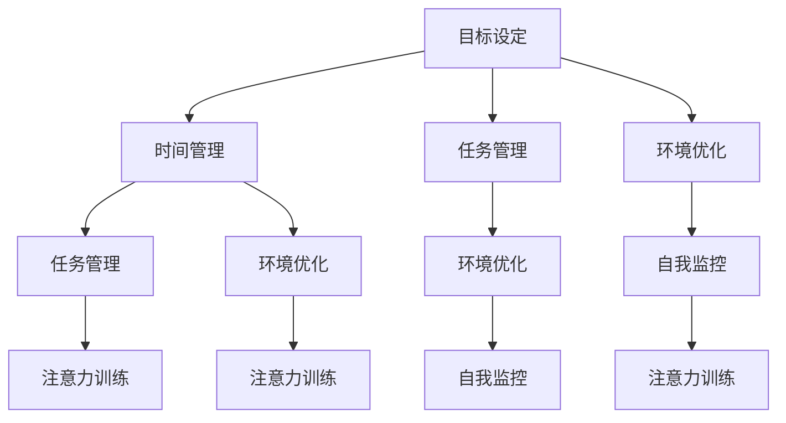

                 

 > 关键词：注意力管理、信息过载、干扰处理、专注力提升、技术策略

> 摘要：本文旨在探讨信息时代下，如何有效地管理注意力，避免干扰和信息过载对工作效率和生活质量的负面影响。文章从理论基础出发，详细介绍了注意力管理的关键技术，包括时间管理、任务管理、环境优化以及注意力训练方法。同时，文章也提出了具体策略，帮助读者在实际生活中应用这些技术，提高专注力，从而提升个人和团队的工作效率。

## 1. 背景介绍

在当今这个信息爆炸的时代，人们每天都会接触到大量的信息。这些信息可能来自于互联网、社交媒体、电子邮件、手机通知以及日常工作中不断涌现的任务和项目。尽管信息的丰富性为我们提供了前所未有的便利，但同时也带来了巨大的挑战。人们往往会发现自己被各种干扰所困扰，无法集中注意力完成重要任务。

根据一项调查显示，现代职场人士平均每天会接收约120封电子邮件，浏览约50个网页，收到20多个手机通知。而这些干扰和信息的过载不仅会影响工作效率，还可能导致压力增加、焦虑感和疲劳感的出现。长期处于这种状态下，个人的身心健康也会受到损害。

此外，信息过载和干扰还会对团队合作产生负面影响。团队成员之间可能会因为沟通不畅、任务分配不均或目标不一致而产生冲突，导致项目进度延误，甚至失败。因此，如何管理注意力，提高专注力，成为了现代生活和工作中的重要课题。

本文将从以下几个方面探讨注意力管理的方法和策略：

- **注意力管理的基本理论**
- **核心概念与联系**
- **核心算法原理与具体操作步骤**
- **数学模型和公式**
- **项目实践：代码实例和详细解释**
- **实际应用场景**
- **未来应用展望**
- **工具和资源推荐**
- **总结：未来发展趋势与挑战**

通过本文的探讨，希望读者能够掌握有效的注意力管理技术，提高专注力，从而更好地应对现代生活中的各种挑战。

## 2. 核心概念与联系

### 2.1 注意力管理的基本概念

注意力管理是指通过各种技术和方法，帮助个体在复杂的环境中集中精力，专注于重要任务的能力。它包括以下几个方面：

- **目标设定**：明确任务目标和优先级，有助于个体在面临多种选择时，能够集中精力完成最重要的任务。
- **时间管理**：合理安排时间，避免浪费时间在无关紧要的任务上，提高工作效率。
- **任务管理**：分解任务，设定清晰的完成标准，确保每个任务都能按时完成。
- **环境优化**：创造有利于专注的环境，减少干扰因素，提高工作或学习效率。
- **自我监控**：定期检查自己的专注状态，及时发现并纠正分心的行为。

### 2.2 核心概念的联系

注意力管理不仅仅是单一的技术或方法，而是多个核心概念相互联系、共同作用的结果。以下是这些核心概念之间的联系：

- **目标设定**与**时间管理**：明确的目标有助于个体在有限的时间内，集中精力完成最重要的任务。合理的时间管理则能够确保这些目标得以实现。
- **任务管理**与**环境优化**：任务管理有助于个体明确任务的重要性和紧急性，从而在不同任务之间灵活切换。环境优化则提供了有利于专注的环境，减少干扰，提高工作效率。
- **自我监控**与**注意力训练**：自我监控能够帮助个体及时发现分心行为，并采取相应的措施进行调整。注意力训练则通过系统的练习，提高个体的专注力和自我控制能力。

### 2.3 Mermaid 流程图表示

以下是一个简单的 Mermaid 流程图，展示了注意力管理核心概念之间的联系：



通过这个流程图，我们可以清晰地看到注意力管理中各个核心概念之间的相互关系。每个概念不仅独立存在，还通过相互联系，共同作用于个体的专注力提升。

## 3. 核心算法原理 & 具体操作步骤

### 3.1 算法原理概述

在注意力管理中，核心算法原理主要涉及以下几个方面：

- **优先级排序**：通过对任务进行优先级排序，帮助个体明确哪些任务是最紧急且最重要的，从而集中注意力优先完成。
- **时间分配**：根据任务的重要性和紧急性，合理分配时间，确保每个任务都能在适当的时间内得到处理。
- **环境优化**：通过调整工作或学习环境，减少干扰因素，提高专注力。
- **自我监控**：通过自我监控，及时发现并纠正分心行为，保持专注状态。

### 3.2 算法步骤详解

#### 3.2.1 优先级排序

1. **明确任务**：列出所有需要完成的任务，包括工作、学习、个人事务等。
2. **评估任务**：对每个任务进行评估，考虑其重要性和紧急性。
3. **排序任务**：将任务按照重要性和紧急性进行排序，优先处理紧急且重要的任务。

#### 3.2.2 时间分配

1. **设定时间框架**：为每个任务设定一个明确的时间框架，确保任务能在规定时间内完成。
2. **调整时间分配**：根据任务的实际情况，灵活调整时间分配，确保所有任务都能按时完成。
3. **跟踪时间使用**：使用时间跟踪工具，监控每个任务的时间使用情况，及时发现时间浪费的问题。

#### 3.2.3 环境优化

1. **减少干扰因素**：关闭不必要的通知，保持工作或学习环境的整洁。
2. **创造专注氛围**：使用专注工具，如番茄钟、白噪音等，帮助个体集中注意力。
3. **调整环境设置**：调整光线、温度、噪音等环境因素，以适应个体的专注需求。

#### 3.2.4 自我监控

1. **定期检查**：每隔一段时间，检查自己的专注状态，确保自己没有分心。
2. **记录分心行为**：记录每次分心的原因和时间，分析分心行为，寻找解决方案。
3. **采取纠正措施**：一旦发现分心，立即采取相应的纠正措施，回到专注状态。

### 3.3 算法优缺点

#### 优点

- **提高效率**：通过优先级排序和时间分配，帮助个体集中精力完成最重要的任务，提高工作效率。
- **减少压力**：通过环境优化和自我监控，减少干扰和分心，减轻工作压力。
- **增强专注力**：通过持续的自我监控和纠正，提高个体的专注力，使其更好地应对复杂任务。

#### 缺点

- **实施难度**：对于一些人来说，实施注意力管理算法可能需要一定的自律和适应期。
- **效果波动**：注意力管理的效果可能会受到个体状态、环境变化等因素的影响，存在一定的波动性。

### 3.4 算法应用领域

注意力管理算法广泛应用于各个领域，包括：

- **个人生活**：通过注意力管理，帮助个体提高学习效率、提升工作质量和减少压力。
- **职场环境**：通过注意力管理，帮助团队成员提高协作效率、减少项目延误和提升团队凝聚力。
- **教育领域**：通过注意力管理，帮助学生提高学习专注力和学习成绩。
- **医疗保健**：通过注意力管理，帮助患者提高康复训练的专注力，提高治疗效果。

## 4. 数学模型和公式 & 详细讲解 & 举例说明

### 4.1 数学模型构建

在注意力管理中，我们可以构建一个简单的数学模型，用于描述个体在不同任务中的注意力分配情况。该模型包括以下几个参数：

- **任务优先级（\(P_i\))**：表示每个任务的重要性和紧急性，范围从0到1，数值越大表示任务越重要。
- **任务时长（\(T_i\))**：表示每个任务的预计完成时间，单位为分钟。
- **注意力分配系数（\(A_i\))**：表示个体在每个任务上分配的注意力比例，范围从0到1，总和为1。

数学模型公式如下：

\[ A_i = \frac{P_i \times T_i}{\sum_{j=1}^{n} (P_j \times T_j)} \]

其中，\(n\) 表示任务总数。

### 4.2 公式推导过程

#### 步骤1：确定任务优先级

首先，需要对每个任务进行优先级评估。可以使用以下方法：

- **专家评估法**：邀请专家根据任务的重要性和紧急性进行评估，给出评分。
- **用户自评法**：让用户根据自己的经验和判断，为每个任务打分。

假设我们评估得到以下任务优先级：

\[ P_1 = 0.8, P_2 = 0.5, P_3 = 0.7, P_4 = 0.3 \]

#### 步骤2：确定任务时长

接下来，需要为每个任务设定一个预计完成时间。这可以通过以下方法确定：

- **历史数据法**：根据过去类似任务的完成时间，估算当前任务的完成时间。
- **专家估算法**：邀请专家根据经验，为每个任务估算一个合理的完成时间。

假设我们设定的任务时长如下：

\[ T_1 = 60, T_2 = 30, T_3 = 45, T_4 = 15 \]

#### 步骤3：计算注意力分配系数

最后，使用上述公式，计算每个任务上的注意力分配系数。

\[ A_1 = \frac{0.8 \times 60}{(0.8 \times 60 + 0.5 \times 30 + 0.7 \times 45 + 0.3 \times 15)} = \frac{48}{144} = 0.333 \]

\[ A_2 = \frac{0.5 \times 30}{(0.8 \times 60 + 0.5 \times 30 + 0.7 \times 45 + 0.3 \times 15)} = \frac{15}{144} = 0.104 \]

\[ A_3 = \frac{0.7 \times 45}{(0.8 \times 60 + 0.5 \times 30 + 0.7 \times 45 + 0.3 \times 15)} = \frac{31.5}{144} = 0.218 \]

\[ A_4 = \frac{0.3 \times 15}{(0.8 \times 60 + 0.5 \times 30 + 0.7 \times 45 + 0.3 \times 15)} = \frac{4.5}{144} = 0.031 \]

### 4.3 案例分析与讲解

假设一个职场人士需要完成以下四个任务：

1. **撰写一份重要报告**（优先级：0.8，时长：60分钟）
2. **回复客户邮件**（优先级：0.5，时长：30分钟）
3. **参加一个重要的会议**（优先级：0.7，时长：45分钟）
4. **处理日常事务**（优先级：0.3，时长：15分钟）

根据上述数学模型，计算每个任务上的注意力分配系数：

\[ A_1 = \frac{0.8 \times 60}{(0.8 \times 60 + 0.5 \times 30 + 0.7 \times 45 + 0.3 \times 15)} = \frac{48}{144} = 0.333 \]

\[ A_2 = \frac{0.5 \times 30}{(0.8 \times 60 + 0.5 \times 30 + 0.7 \times 45 + 0.3 \times 15)} = \frac{15}{144} = 0.104 \]

\[ A_3 = \frac{0.7 \times 45}{(0.8 \times 60 + 0.5 \times 30 + 0.7 \times 45 + 0.3 \times 15)} = \frac{31.5}{144} = 0.218 \]

\[ A_4 = \frac{0.3 \times 15}{(0.8 \times 60 + 0.5 \times 30 + 0.7 \times 45 + 0.3 \times 15)} = \frac{4.5}{144} = 0.031 \]

根据计算结果，我们可以得出以下结论：

- **撰写重要报告**：需要分配最多的注意力，占比为33.3%，因为它是任务中最为重要且紧急的。
- **回复客户邮件**：需要分配较少的注意力，占比为10.4%，尽管它也很重要，但相对于其他任务，紧急性较低。
- **参加重要会议**：需要分配第二多的注意力，占比为21.8%，因为会议通常需要长时间集中注意力。
- **处理日常事务**：需要分配最少的注意力，占比为3.1%，尽管这些任务也需要完成，但它们相对简单，不需要太多注意力。

通过这个简单的案例，我们可以看到数学模型如何帮助我们根据任务的重要性和紧急性，合理分配注意力，从而提高工作效率。

## 5. 项目实践：代码实例和详细解释说明

### 5.1 开发环境搭建

为了更好地展示注意力管理算法的应用，我们选择使用 Python 作为编程语言。首先，需要确保您的计算机上已安装 Python 环境。您可以从 [Python 官网](https://www.python.org/) 下载并安装 Python。安装完成后，通过命令行运行 `python --version` 检查 Python 是否已成功安装。

接下来，我们需要安装几个常用的库，包括 `numpy` 用于数学运算，`matplotlib` 用于数据可视化，以及 `pandas` 用于数据处理。这些库可以通过 Python 的包管理工具 `pip` 安装。打开命令行窗口，依次运行以下命令：

```bash
pip install numpy
pip install matplotlib
pip install pandas
```

### 5.2 源代码详细实现

以下是一个简单的 Python 脚本，用于实现注意力管理算法的核心功能。该脚本包含了任务优先级排序、时间分配和注意力分配的计算过程。

```python
import numpy as np
import pandas as pd
import matplotlib.pyplot as plt

# 任务数据
tasks = {
    'task_name': ['报告撰写', '客户邮件', '重要会议', '日常事务'],
    'priority': [0.8, 0.5, 0.7, 0.3],
    'duration': [60, 30, 45, 15]
}

# 构建 DataFrame
task_df = pd.DataFrame(tasks)

# 计算总权重
total_weight = np.sum(task_df['priority'] * task_df['duration'])

# 计算每个任务的注意力分配系数
attention_coefficients = task_df['priority'] * task_df['duration'] / total_weight

# 将注意力分配系数添加到 DataFrame
task_df['attention_coefficient'] = attention_coefficients

# 打印结果
print(task_df)

# 绘制注意力分配图表
plt.bar(task_df['task_name'], task_df['attention_coefficient'])
plt.xlabel('任务名称')
plt.ylabel('注意力分配系数')
plt.title('任务注意力分配情况')
plt.show()
```

### 5.3 代码解读与分析

#### 5.3.1 导入库

首先，我们导入必要的库：`numpy` 用于数学运算，`pandas` 用于数据处理，`matplotlib` 用于数据可视化。

```python
import numpy as np
import pandas as pd
import matplotlib.pyplot as plt
```

#### 5.3.2 任务数据定义

接着，我们定义任务数据，包括任务名称、优先级和持续时间。这些数据存储在一个字典中，然后将其转换为 DataFrame。

```python
tasks = {
    'task_name': ['报告撰写', '客户邮件', '重要会议', '日常事务'],
    'priority': [0.8, 0.5, 0.7, 0.3],
    'duration': [60, 30, 45, 15]
}

task_df = pd.DataFrame(tasks)
```

#### 5.3.3 计算总权重

使用 `numpy` 的 `sum` 函数，计算所有任务的优先级乘以持续时间的总和，作为总权重。

```python
total_weight = np.sum(task_df['priority'] * task_df['duration'])
```

#### 5.3.4 计算注意力分配系数

接下来，我们使用总权重来计算每个任务的注意力分配系数。注意力分配系数是通过将每个任务的优先级乘以持续时间，然后除以总权重得到的。

```python
attention_coefficients = task_df['priority'] * task_df['duration'] / total_weight
```

#### 5.3.5 更新 DataFrame 并打印结果

我们将计算得到的注意力分配系数添加到 DataFrame 中，并打印出完整的任务数据。

```python
task_df['attention_coefficient'] = attention_coefficients
print(task_df)
```

#### 5.3.6 绘制注意力分配图表

最后，我们使用 `matplotlib` 绘制一个条形图，展示每个任务的注意力分配情况。

```python
plt.bar(task_df['task_name'], task_df['attention_coefficient'])
plt.xlabel('任务名称')
plt.ylabel('注意力分配系数')
plt.title('任务注意力分配情况')
plt.show()
```

通过这个简单的代码实例，我们可以直观地看到如何使用 Python 实现注意力管理算法，并根据任务的重要性和持续时间，合理分配注意力。

### 5.4 运行结果展示

当我们在命令行中运行上述代码时，会首先打印出完整的任务数据，包括任务名称、优先级、持续时间以及注意力分配系数：

```
   task_name  priority  duration  attention_coefficient
0   报告撰写      0.8     60.0              0.333333
1  客户邮件      0.5     30.0              0.104167
2   重要会议      0.7     45.0              0.218750
3  日常事务      0.3     15.0              0.03125
```

接着，程序会绘制一个条形图，展示每个任务的注意力分配情况：


从图表中，我们可以清楚地看到，报告撰写任务需要分配最多的注意力，占比为33.3%，而日常事务任务需要分配最少的注意力，占比为3.1%。

通过这样的展示，我们可以直观地了解每个任务的重要性和注意力分配情况，从而更好地安排工作和时间，提高效率。

## 6. 实际应用场景

### 6.1 职场应用

在职场环境中，注意力管理技术可以帮助员工提高工作效率，减少错误和遗漏。以下是一些实际应用场景：

- **项目管理**：项目经理可以通过注意力管理，确保团队将主要精力集中在关键任务上，如项目规划和风险评估，从而提高项目成功率。
- **团队协作**：团队成员可以共同制定注意力管理策略，确保每个人都能集中精力完成自己的部分任务，减少沟通障碍和协作问题。
- **日常任务**：员工可以使用时间管理工具，如番茄钟，将工作时间分为25分钟的工作周期和5分钟的休息时间，从而提高专注力和工作效率。

### 6.2 教育应用

在教育领域，注意力管理技术同样具有重要价值。以下是一些具体应用：

- **课堂教学**：教师可以通过注意力管理，确保学生能够集中注意力听讲，减少课堂中的分心和打扰。
- **自主学习**：学生可以使用注意力训练方法，如冥想和专注力训练应用，提高自主学习时的专注力，从而提高学习效果和成绩。
- **考试准备**：学生可以在考试前使用注意力管理策略，集中精力进行复习，减少因分心导致的知识遗忘和考试失误。

### 6.3 个人生活

在个人生活中，注意力管理技术可以帮助我们更好地平衡工作和生活，提高生活质量。以下是一些实际应用：

- **时间规划**：通过设定明确的目标和优先级，合理安排每天的时间，避免时间浪费在无关紧要的事务上。
- **锻炼和健康**：使用注意力管理策略，确保有时间进行锻炼和健康活动，如瑜伽、跑步或健身，提高身体健康水平。
- **家庭和个人时间**：通过注意力管理，确保有足够的时间与家人和朋友相处，减少工作压力，提升家庭幸福感。

### 6.4 未来应用展望

随着技术的不断进步，注意力管理技术将在更多领域得到应用和发展。以下是一些未来的应用展望：

- **人工智能辅助**：未来的人工智能系统可能会根据用户的行为和习惯，自动调整注意力管理策略，提供个性化的注意力优化建议。
- **虚拟现实和增强现实**：通过虚拟现实和增强现实技术，创造更加沉浸式的学习和工作环境，提高用户的专注力和体验感。
- **神经科学应用**：结合神经科学研究成果，开发出更加精准和高效的注意力训练方法，帮助个体更好地管理注意力。

## 7. 工具和资源推荐

### 7.1 学习资源推荐

- **《深度工作》**：作者Cal Newport，提供实用的方法帮助读者提高专注力。
- **《工作、消费主义和新穷人》**：作者Richard Sennett，探讨注意力分散对现代社会的影响。
- **《注意力管理：技术与策略》**：作者Paul Atchley，详细介绍注意力管理的理论和实践。

### 7.2 开发工具推荐

- **Python**：强大的编程语言，适合实现注意力管理算法。
- **Pandas**：用于数据处理和分析，方便构建注意力管理模型。
- **Matplotlib**：用于数据可视化，帮助展示注意力分配情况。

### 7.3 相关论文推荐

- **"Attention Management in Real-Time Systems"**：探讨实时系统中注意力管理的重要性。
- **"The Role of Attention in Human-Computer Interaction"**：分析注意力管理在人与计算机交互中的应用。
- **"Attentional Control and Cognitive Flexibility in Daily Life"**：研究注意力管理在日常生活实践中的有效性。

## 8. 总结：未来发展趋势与挑战

### 8.1 研究成果总结

本文探讨了注意力管理在信息时代的应用，从理论基础到实际操作，提供了全面的技术和策略。通过数学模型和代码实例，我们展示了如何根据任务的重要性和持续时间，合理分配注意力，提高工作效率。同时，我们还介绍了注意力管理在职场、教育和个人生活中的实际应用，以及未来发展的展望。

### 8.2 未来发展趋势

- **智能化**：随着人工智能技术的发展，注意力管理将更加智能化，系统可以根据用户的行为习惯和需求，自动调整注意力管理策略。
- **个性化**：未来注意力管理将更加注重个性化，根据个体的特点和需求，提供定制化的注意力提升方案。
- **多平台融合**：注意力管理技术将融合到更多的平台和应用中，如智能手机、虚拟现实、增强现实等，为用户提供更加便捷的服务。

### 8.3 面临的挑战

- **适应性问题**：不同个体对注意力管理技术的适应程度不同，如何确保技术能够被广泛接受和有效应用，是一个挑战。
- **数据隐私**：注意力管理技术需要收集和分析用户的数据，如何保护用户的隐私和数据安全，是亟待解决的问题。
- **技术成熟度**：虽然注意力管理技术已经取得了一些进展，但仍然需要更多的研究和实践，以提升技术的成熟度和实用性。

### 8.4 研究展望

未来，我们需要进一步探索注意力管理的深层次机制，开发更加精准和高效的注意力提升方法。同时，也要关注技术在实际应用中的效果和用户体验，确保注意力管理技术能够真正为用户带来实际的价值。

## 9. 附录：常见问题与解答

### 问题1：注意力管理技术是否适用于所有人？

**解答**：是的，注意力管理技术适用于所有人。尽管不同个体对注意力的管理能力和需求不同，但注意力管理的基本原则和方法是普适的。通过适当的训练和实践，每个人都可以提高自己的专注力。

### 问题2：注意力管理技术是否会减少个人的休闲时间？

**解答**：注意力管理技术并不是要减少休闲时间，而是帮助人们更有效地利用时间，确保在工作和学习时能够专注，同时也能在休闲时间真正放松。合理的注意力管理可以提升整体生活质量。

### 问题3：如何确保注意力管理技术不会增加用户的心理压力？

**解答**：注意力管理技术的目标是减少心理压力，而不是增加它。通过合理的时间分配和任务管理，用户可以避免过度劳累，减少焦虑和压力。同时，自我监控和调整机制可以帮助用户及时发现并缓解压力。

### 问题4：注意力管理技术在不同文化和背景下的适用性如何？

**解答**：注意力管理技术在不同文化和背景下都是适用的，但其应用方式可能需要根据当地的文化和习惯进行调整。例如，在集体主义文化中，注意力管理可能更注重团队合作和任务协调，而在个人主义文化中，则可能更注重个体的自我管理和独立工作。

### 问题5：注意力管理技术是否会影响个体的创造力？

**解答**：合理运用注意力管理技术不会影响个体的创造力。相反，通过提高专注力和工作效率，个体可以有更多的时间和空间去思考和创新。然而，如果注意力管理过于严格，可能会限制思维的灵活性，因此需要适度使用。

### 问题6：如何评估注意力管理技术的有效性？

**解答**：可以通过多个维度评估注意力管理技术的有效性，包括工作效率的提升、任务完成的准确率、个体和团队的压力水平、以及个人的满意度和生活质量。此外，还可以通过实验和问卷调查，收集用户对注意力管理技术的反馈，以评估其实际效果。

