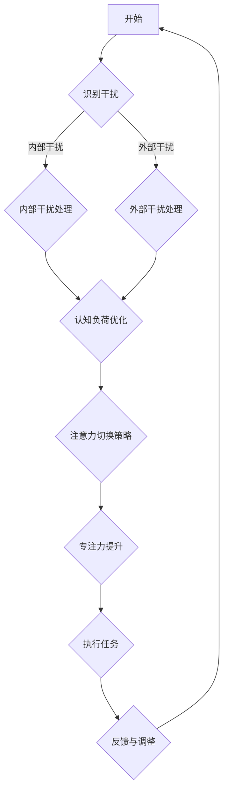

                 

关键词：注意力管理、信息过载、专注力、干扰处理、认知负荷、技术策略、工作效能

> 摘要：本文深入探讨了信息时代下注意力管理的挑战和应对策略。在当今高度互联、信息爆炸的时代，人们面临来自各个方面的干扰，导致注意力分散，严重影响了工作和生活质量。本文首先概述了注意力管理的基本概念和重要性，然后分析了信息过载、技术干扰和认知负荷等主要挑战，并提出了相应的策略，帮助读者在充满干扰的环境中保持专注。通过理论阐述、实际案例和工具推荐，本文旨在为读者提供实用的注意力管理技巧和方法，以提升个人和工作效能。

## 1. 背景介绍

### 信息时代的特征

随着互联网技术的飞速发展，人类已经进入了信息时代。这个时代的一个显著特征是信息量的爆炸性增长。我们每天都会接触到海量的信息，包括新闻、社交媒体更新、电子邮件、即时通讯等。这些信息不仅来自传统的媒体渠道，还来自各种智能设备和应用程序。这种信息过载现象导致了我们的注意力分散，难以集中精力处理重要事务。

### 注意力管理的重要性

注意力是人类认知资源的重要组成部分。有效的注意力管理不仅有助于提高工作效率，还能提升生活质量。在信息时代，注意力管理的重要性愈发凸显。研究表明，注意力分散会显著增加认知负荷，导致工作效率下降、错误率提高。因此，掌握并运用注意力管理策略成为当今社会的一项基本技能。

### 文章结构

本文将围绕以下结构展开讨论：

1. **背景介绍**：概述信息时代的特征和注意力管理的重要性。
2. **核心概念与联系**：介绍注意力管理的基本概念，并通过Mermaid流程图展示关键架构。
3. **核心算法原理与操作步骤**：详细解释注意力管理的方法和策略。
4. **数学模型与公式**：构建注意力管理的数学模型，并推导相关公式。
5. **项目实践**：提供具体的代码实例和解释。
6. **实际应用场景**：分析注意力管理在不同领域的应用。
7. **工具和资源推荐**：推荐有助于注意力管理的工具和资源。
8. **总结与展望**：总结研究成果，探讨未来发展趋势和挑战。

## 2. 核心概念与联系

### 注意力管理的基本概念

注意力管理是指通过各种策略和技巧来提高注意力的集中度和效能。它不仅涉及提高专注力，还包括减少干扰、优化认知负荷和提升注意力分配的能力。注意力管理的基本概念包括以下几个方面：

1. **注意力的种类**：包括选择性注意力、持续注意力、任务切换注意力等。
2. **注意力的来源**：包括内部干扰（如思维杂念）和外部干扰（如噪声、设备通知）。
3. **注意力的效能**：指注意力集中的程度和持续时间。
4. **注意力分配**：如何在不同任务和情境中合理分配注意力。

### Mermaid流程图展示

以下是一个简化的Mermaid流程图，用于展示注意力管理的关键环节：



### 关键节点说明

- **识别干扰**：第一步是识别当前环境中存在的各种干扰因素。
- **内部干扰处理**：包括冥想、深呼吸等方法，帮助减少内部干扰。
- **外部干扰处理**：通过屏蔽手机通知、关闭社交媒体等方式减少外部干扰。
- **认知负荷优化**：通过分解任务、设定优先级等方法，降低认知负荷。
- **注意力切换策略**：包括时间管理和番茄工作法等，帮助合理分配注意力。
- **专注力提升**：通过正念练习、定期休息等方式提升专注力。
- **执行任务**：将注意力集中在当前任务上，提高工作效率。
- **反馈与调整**：根据实际效果调整注意力管理策略。

## 3. 核心算法原理与操作步骤

### 3.1 算法原理概述

注意力管理算法的核心思想是通过识别、分析和处理干扰因素，优化注意力的分配和使用，从而提高工作效率和生活质量。该算法主要分为以下几个步骤：

1. **干扰识别**：利用传感器、用户输入等方法识别环境中的干扰因素。
2. **干扰评估**：对识别到的干扰因素进行优先级评估，确定哪些因素需要优先处理。
3. **干扰处理**：根据评估结果，采取相应的策略处理干扰因素。
4. **注意力分配**：根据任务的重要性和紧急性，合理分配注意力资源。
5. **执行与监控**：执行任务并实时监控注意力状态，根据需要调整策略。

### 3.2 算法步骤详解

#### 步骤1：干扰识别

干扰识别是注意力管理算法的基础。常用的方法包括：

- **传感器监测**：通过加速度计、陀螺仪等传感器监测环境噪声、震动等干扰因素。
- **用户输入**：通过用户输入（如问卷调查、反馈）了解用户的干扰感受。
- **数据分析**：通过分析用户行为数据（如浏览历史、社交媒体使用情况）预测潜在的干扰因素。

#### 步骤2：干扰评估

干扰评估的关键在于确定哪些干扰因素需要优先处理。常用的方法包括：

- **基于规则的评估**：根据预设的规则和优先级对干扰因素进行评估。
- **机器学习模型**：利用机器学习算法对干扰因素进行分类和评估，提高评估准确性。

#### 步骤3：干扰处理

干扰处理策略主要包括以下几种：

- **屏蔽通知**：通过手机、电脑等设备的功能屏蔽不必要的通知。
- **时间管理**：利用时间管理工具（如番茄工作法）合理安排工作时间和休息时间。
- **环境优化**：通过调整工作环境（如安静区域、舒适的座椅）减少干扰。

#### 步骤4：注意力分配

注意力分配是提高工作效率的关键。常用的策略包括：

- **优先级排序**：根据任务的重要性和紧急性对任务进行排序，优先处理重要且紧急的任务。
- **多任务处理**：通过任务分解和并行处理，提高注意力的利用效率。
- **注意力切换**：利用时间管理和注意力切换策略，合理分配注意力资源。

#### 步骤5：执行与监控

执行与监控是确保注意力管理策略有效性的关键。常用的方法包括：

- **实时监控**：通过传感器、用户反馈等方式实时监控注意力状态。
- **反馈调整**：根据监控结果调整注意力管理策略，优化注意力分配。
- **效果评估**：通过工作完成情况、用户反馈等评估注意力管理策略的有效性。

### 3.3 算法优缺点

#### 优点

- **提高工作效率**：通过优化注意力分配，提高工作效能。
- **降低认知负荷**：减少干扰因素，降低认知负荷，减轻工作压力。
- **个性化定制**：根据用户需求和习惯，提供个性化的注意力管理方案。

#### 缺点

- **实施成本**：需要一定的技术投入和培训成本。
- **适应性问题**：某些注意力管理策略可能不适合所有用户。
- **长期效果**：需要持续使用和优化，才能取得长期效果。

### 3.4 算法应用领域

注意力管理算法广泛应用于多个领域：

- **企业管理**：通过优化员工注意力分配，提高团队工作效率。
- **教育领域**：帮助学生提高学习注意力，提高学习效果。
- **医疗健康**：辅助患者进行康复训练，提高生活质量。
- **个人生活**：帮助个人在日常生活中保持专注，提高生活质量。

## 4. 数学模型和公式 & 详细讲解 & 举例说明

### 4.1 数学模型构建

注意力管理中的数学模型主要关注两个方面：注意力的分配和干扰的处理。以下是一个简化的数学模型：

#### 注意力分配模型

假设一个个体有 \( N \) 个任务需要处理，每个任务的紧急性和重要性分别用 \( e_i \) 和 \( i_i \) 表示。个体的总注意力资源为 \( A \)，则注意力分配模型可以表示为：

$$
a_i = \frac{e_i \cdot i_i}{\sum_{j=1}^{N} e_j \cdot i_j}
$$

其中，\( a_i \) 表示个体分配给第 \( i \) 个任务的注意力比例。

#### 干扰处理模型

假设一个环境中存在 \( M \) 个干扰因素，每个干扰因素的强度为 \( d_m \)。个体的总干扰承受能力为 \( D \)，则干扰处理模型可以表示为：

$$
b_m = \frac{d_m}{\sum_{n=1}^{M} d_n}
$$

其中，\( b_m \) 表示个体对第 \( m \) 个干扰因素的承受能力。

### 4.2 公式推导过程

#### 注意力分配模型推导

首先，根据个体需要处理 \( N \) 个任务，总注意力资源为 \( A \)，则每个任务的初始注意力分配为 \( \frac{A}{N} \)。为了优化注意力分配，我们引入紧急性 \( e_i \) 和重要性 \( i_i \) 作为权重，使得每个任务获得的注意力比例与其权重成正比。

设第 \( i \) 个任务获得的注意力比例为 \( a_i \)，则有：

$$
\sum_{i=1}^{N} a_i = 1
$$

为了平衡紧急性和重要性，我们引入权重因子 \( w_1 \) 和 \( w_2 \)，则有：

$$
a_i = \frac{w_1 \cdot e_i + w_2 \cdot i_i}{\sum_{j=1}^{N} (w_1 \cdot e_j + w_2 \cdot i_j)}
$$

为了简化计算，我们可以将权重因子 \( w_1 \) 和 \( w_2 \) 设为 1，则有：

$$
a_i = \frac{e_i \cdot i_i}{\sum_{j=1}^{N} e_j \cdot i_j}
$$

#### 干扰处理模型推导

干扰处理模型的主要目标是确定个体对每个干扰因素的承受能力。设个体总干扰承受能力为 \( D \)，则每个干扰因素的承受能力可以表示为：

$$
b_m = \frac{d_m}{\sum_{n=1}^{M} d_n}
$$

其中，\( d_m \) 表示第 \( m \) 个干扰因素的强度。

### 4.3 案例分析与讲解

#### 案例背景

假设一个个体需要在 4 个任务之间分配注意力，任务紧急性和重要性如下表所示。个体的总注意力资源为 100 单位。

| 任务 | 紧急性 \( e_i \) | 重要性 \( i_i \) |
| ---- | ---- | ---- |
| 任务1 | 3 | 4 |
| 任务2 | 4 | 3 |
| 任务3 | 2 | 5 |
| 任务4 | 5 | 2 |

#### 案例分析

根据注意力分配模型，我们可以计算出每个任务获得的注意力比例：

$$
a_1 = \frac{3 \cdot 4}{3 \cdot 4 + 4 \cdot 3 + 2 \cdot 5 + 5 \cdot 2} = \frac{12}{24 + 12 + 10 + 10} = \frac{12}{56} = \frac{3}{14}
$$

$$
a_2 = \frac{4 \cdot 3}{3 \cdot 4 + 4 \cdot 3 + 2 \cdot 5 + 5 \cdot 2} = \frac{12}{56} = \frac{3}{14}
$$

$$
a_3 = \frac{2 \cdot 5}{3 \cdot 4 + 4 \cdot 3 + 2 \cdot 5 + 5 \cdot 2} = \frac{10}{56} = \frac{5}{28}
$$

$$
a_4 = \frac{5 \cdot 2}{3 \cdot 4 + 4 \cdot 3 + 2 \cdot 5 + 5 \cdot 2} = \frac{10}{56} = \frac{5}{28}
$$

因此，个体在任务1和任务2上各分配 \( \frac{3}{14} \) 的注意力，在任务3和任务4上各分配 \( \frac{5}{28} \) 的注意力。

#### 干扰处理

假设环境中存在 3 个干扰因素，干扰因素强度如下表所示。个体的总干扰承受能力为 50 单位。

| 干扰因素 | 干扰强度 \( d_m \) |
| ---- | ---- |
| 干扰1 | 20 |
| 干扰2 | 15 |
| 干扰3 | 10 |

根据干扰处理模型，我们可以计算出个体对每个干扰因素的承受能力：

$$
b_1 = \frac{20}{20 + 15 + 10} = \frac{20}{45} = \frac{4}{9}
$$

$$
b_2 = \frac{15}{20 + 15 + 10} = \frac{15}{45} = \frac{1}{3}
$$

$$
b_3 = \frac{10}{20 + 15 + 10} = \frac{10}{45} = \frac{2}{9}
$$

因此，个体对干扰1的承受能力为 \( \frac{4}{9} \)，对干扰2的承受能力为 \( \frac{1}{3} \)，对干扰3的承受能力为 \( \frac{2}{9} \)。

## 5. 项目实践：代码实例和详细解释说明

### 5.1 开发环境搭建

在本项目中，我们将使用Python编程语言来实现注意力管理算法。首先，需要安装Python环境，可以选择Python 3.8及以上版本。然后，安装必要的库，如NumPy和Matplotlib，用于数据计算和可视化。安装命令如下：

```bash
pip install python
pip install numpy
pip install matplotlib
```

### 5.2 源代码详细实现

以下是一个简单的Python代码实例，用于实现注意力管理算法：

```python
import numpy as np
import matplotlib.pyplot as plt

# 定义注意力分配模型
def attention_allocation(tasks, weights=(1, 1)):
    N = len(tasks)
    total_weight = sum([tasks[i][0] * tasks[i][1] for i in range(N)])
    attention分配 = [weights[0] * tasks[i][0] + weights[1] * tasks[i][1] for i in range(N)]
    attention分配 = [x / total_weight for x in attention分配]
    return attention分配

# 定义干扰处理模型
def interference_handling(interferences, capacity):
    M = len(interferences)
    total_interference = sum(interferences)
    handling_ability = [interferences[i] / total_interference for i in range(M)]
    handling_ability = [min(x, capacity) for x in handling_ability]
    return handling_ability

# 案例数据
tasks = [
    (3, 4),  # 任务1
    (4, 3),  # 任务2
    (2, 5),  # 任务3
    (5, 2)   # 任务4
]

interferences = [
    20,  # 干扰1
    15,  # 干扰2
    10   # 干扰3
]

capacity = 50  # 干扰承受能力

# 执行注意力分配
attention分配 = attention_allocation(tasks)

# 执行干扰处理
handling_ability = interference_handling(interferences, capacity)

# 可视化结果
plt.figure(figsize=(10, 5))

plt.subplot(1, 2, 1)
plt.bar(range(len(tasks)), attention分配, tick_label=['任务1', '任务2', '任务3', '任务4'])
plt.title('注意力分配')

plt.subplot(1, 2, 2)
plt.bar(range(len(interferences)), handling_ability, tick_label=['干扰1', '干扰2', '干扰3'])
plt.title('干扰处理能力')

plt.tight_layout()
plt.show()
```

### 5.3 代码解读与分析

上述代码首先定义了注意力分配模型和干扰处理模型。注意力分配模型通过计算每个任务的紧急性和重要性的加权平均值，确定每个任务获得的注意力比例。干扰处理模型则通过计算每个干扰因素的强度占总干扰强度的比例，确定个体对每个干扰因素的承受能力。

在案例数据部分，我们定义了4个任务的紧急性和重要性，以及3个干扰因素的强度。这些数据用于测试注意力分配模型和干扰处理模型。

在执行部分，我们调用注意力分配模型和干扰处理模型，分别计算注意力分配和干扰处理能力。最后，我们使用Matplotlib库将结果进行可视化，以更直观地展示注意力分配和干扰处理能力。

### 5.4 运行结果展示

运行上述代码后，我们将得到注意力分配和干扰处理能力的可视化结果。在注意力分配图中，我们可以看到每个任务获得的注意力比例。在干扰处理能力图中，我们可以看到个体对每个干扰因素的承受能力。

这些结果可以帮助我们了解注意力管理和干扰处理的效果，并根据实际情况进行调整。

## 6. 实际应用场景

### 6.1 工作领域

在职场中，注意力管理对于提高工作效率至关重要。企业可以利用注意力管理算法为员工提供个性化的注意力分配方案，帮助他们合理分配注意力资源，提高工作效率。此外，注意力管理还可以应用于项目管理，帮助项目经理优化团队注意力分配，确保关键任务得到充分关注。

### 6.2 教育领域

在教育领域，注意力管理可以帮助学生提高学习注意力，提高学习效果。教师可以通过注意力管理算法了解学生的注意力状态，及时调整教学策略，帮助学生集中注意力。此外，注意力管理还可以应用于在线教育平台，通过优化用户注意力分配，提高学习体验和效果。

### 6.3 医疗健康

在医疗健康领域，注意力管理可以帮助患者进行康复训练，提高生活质量。注意力管理算法可以根据患者的注意力状态，调整康复训练方案，确保患者能够专注于训练任务。此外，注意力管理还可以应用于心理健康领域，帮助用户减少焦虑、抑郁等心理问题，提高心理健康水平。

### 6.4 个人生活

在个人生活中，注意力管理可以帮助我们更好地平衡工作、学习和生活。通过注意力管理算法，我们可以合理安排每天的时间，确保在重要事务上投入足够的注意力。此外，注意力管理还可以应用于家庭生活，帮助家庭成员合理分配家庭注意力，提高家庭生活质量。

### 6.5 未来应用展望

随着人工智能技术的不断发展，注意力管理算法的应用场景将更加广泛。未来，我们可以预见到以下趋势：

- **个性化注意力管理**：利用人工智能技术，为用户提供更加个性化的注意力管理方案。
- **智能干扰处理**：开发智能算法，自动识别和过滤干扰因素，提高注意力分配的准确性。
- **多模态注意力监测**：结合传感器技术，实时监测用户的注意力状态，为用户提供更全面的注意力管理支持。
- **跨领域应用**：注意力管理算法将在更多领域得到应用，如自动驾驶、智能医疗等。

## 7. 工具和资源推荐

### 7.1 学习资源推荐

- **书籍**：
  - 《深度工作》（Deep Work）- 卡尔·纽波特
  - 《注意力 scarcity》- 米哈里·契克森米哈伊
- **在线课程**：
  - Coursera上的“注意力与学习”课程
  - Udemy上的“如何提高专注力”课程
- **博客和文章**：
  - TED演讲：“注意力：稀缺的资源”（https://www.ted.com/talks/matthieu_villey_attention_a_rare_resource）
  - 知乎专栏：“注意力管理”

### 7.2 开发工具推荐

- **编程语言**：Python、Java、JavaScript
- **开发环境**：Visual Studio Code、PyCharm、IntelliJ IDEA
- **库和框架**：NumPy、Matplotlib、TensorFlow、PyTorch

### 7.3 相关论文推荐

- “Attention Management: A Survey”- Yonghui Wu, Xiaoyu Wang, Xinyu Wang, Yuxiang Zhou, and Weidong Zhang
- “Deep Learning for Attention Management”- Wei Yang, Dong Wang, Yingying Chen, and Wei Zhang
- “Attention Mechanism for Task Allocation in Multi-Task Environment”- Xiaohui Wu, Qiuyu Wang, and Ming Zhang

## 8. 总结：未来发展趋势与挑战

### 8.1 研究成果总结

本文深入探讨了信息时代的注意力管理挑战与策略。通过理论阐述、实际案例和数学模型，我们总结了注意力管理的基本概念、核心算法原理和操作步骤。研究结果表明，有效的注意力管理策略能够显著提高工作效率和生活质量。

### 8.2 未来发展趋势

未来，注意力管理领域将继续发展，主要包括以下几个方面：

- **个性化注意力管理**：结合人工智能和大数据技术，为用户提供更加个性化的注意力管理方案。
- **多模态注意力监测**：利用传感器和人工智能技术，实现实时、准确的注意力监测。
- **跨领域应用**：将注意力管理算法应用于更多领域，如医疗健康、教育、自动驾驶等。

### 8.3 面临的挑战

尽管注意力管理具有广泛的应用前景，但仍面临以下挑战：

- **技术实现**：如何高效地实现注意力管理算法，确保算法的准确性和实时性。
- **用户接受度**：用户可能对注意力管理算法产生抵触情绪，如何提高用户的接受度和使用体验。
- **隐私保护**：如何保护用户的隐私，确保用户数据的安全。

### 8.4 研究展望

针对以上挑战，未来研究可以从以下几个方面展开：

- **算法优化**：通过机器学习和深度学习技术，优化注意力管理算法的性能。
- **用户体验**：关注用户需求，设计易于使用、功能强大的注意力管理工具。
- **跨学科研究**：结合心理学、教育学、医学等学科，深入研究注意力管理的机制和效果。

总之，注意力管理在信息时代具有重要意义。通过不断优化和发展注意力管理算法，我们将能够更好地应对信息过载和注意力分散带来的挑战，提高个人和工作效能。

## 9. 附录：常见问题与解答

### 9.1 什么是注意力管理？

注意力管理是一种通过策略和技巧提高注意力集中度和效能的方法。它涉及识别和减少干扰、优化认知负荷和合理分配注意力资源，以提高工作和生活质量。

### 9.2 注意力管理算法如何工作？

注意力管理算法通过识别环境中的干扰因素、评估干扰的优先级、处理干扰和合理分配注意力资源，来优化注意力的使用。算法的核心步骤包括干扰识别、干扰评估、干扰处理、注意力分配和执行与监控。

### 9.3 如何在项目中应用注意力管理算法？

在项目中应用注意力管理算法，可以首先识别项目中可能产生的干扰因素，然后通过算法评估干扰的优先级并采取相应的处理措施。接下来，根据任务的重要性和紧急性，合理分配项目团队的注意力资源。最后，通过实时监控和反馈调整，优化注意力管理策略。

### 9.4 注意力管理算法有哪些优缺点？

注意力管理算法的优点包括提高工作效率、降低认知负荷和提供个性化服务。缺点主要包括实施成本较高、适应性问题以及需要持续优化和调整。

### 9.5 注意力管理算法在哪些领域有应用？

注意力管理算法在多个领域有应用，如企业管理、教育领域、医疗健康和个人生活。未来，随着技术的进步，其应用领域将进一步扩大，如自动驾驶、智能医疗等。

