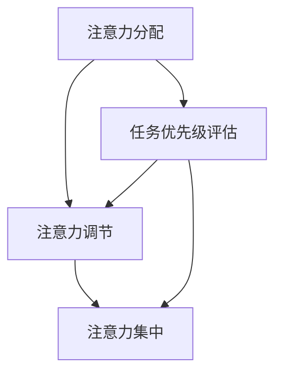

                 

 在这个数字化的时代，我们几乎无处不在地被信息淹没。社交媒体的推送、电子邮件的轰炸、即时消息的通知，这些都构成了现代生活中不可避免的一部分。我们的注意力因此被无情地分散，面临着前所未有的管理挑战。作为世界级人工智能专家，我深知在这个信息过载的时代，如何有效地管理注意力是提升工作效率和生活质量的关键。

> 关键词：注意力管理，信息过载，工作效率，干扰管理

> 摘要：本文将深入探讨信息时代注意力管理的现状与挑战，分析核心概念，介绍管理策略和数学模型，并结合实际项目实践，提供具体的解决方案。文章旨在帮助读者在干扰与信息过载中找到航行的方向，提高个人和团队的生产力。

## 1. 背景介绍

### 信息爆炸的背景

信息时代的到来，得益于互联网和移动通信技术的飞速发展。在短短几十年间，我们见证了从网页浏览到社交媒体，从电子邮件到即时消息的演变。信息传播的速度和广度前所未有，极大地丰富了我们的知识库，同时也带来了前所未有的挑战。据统计，每天产生的新信息量是前所未有的，这使得人们不得不面对海量信息的冲击。

### 注意力资源的稀缺性

在这样的大背景下，我们的注意力资源显得尤为珍贵。注意力是有限的，它决定了我们在处理信息和任务时的效率和效果。当我们的注意力被过多分散时，工作效率会大幅下降，甚至可能出现错误和遗漏。心理学家米哈里·契克森米哈伊（Mihaly Csikszentmihalyi）指出，注意力集中是实现“心流”（flow）状态的关键，而心流状态是高度专注和愉悦体验的融合。

### 管理注意力的必要性

面对信息过载和干扰，我们需要掌握有效的注意力管理策略。这不仅关乎个人的工作效率，还影响到我们的生活质量和心理健康。因此，研究如何高效管理注意力，对于我们在这个数字时代中保持竞争力至关重要。

## 2. 核心概念与联系

### 注意力管理的基本概念

注意力管理涉及多个层面，包括注意力分配、注意力调节、注意力集中等。注意力分配是指合理地将注意力分配给不同的任务和活动；注意力调节是指根据任务的复杂性和优先级调整注意力的投入程度；注意力集中则是将注意力高度集中在一项任务上，以达到最佳的工作效率。

### 注意力管理原理和架构

为了更好地理解注意力管理，我们可以借助Mermaid流程图来展示其核心原理和架构：



在这个流程图中，注意力分配、注意力调节和注意力集中是核心环节，而任务优先级评估则是它们的基础，决定了注意力的具体分配和调节策略。

### 注意力管理在不同场景中的应用

注意力管理不仅适用于个人，还可以应用于团队和项目管理。在团队层面，通过明确的任务优先级和沟通机制，可以有效减少干扰和冲突，提高整体效率。在项目层面，通过设置项目里程碑和监控进度，可以帮助团队成员集中注意力，确保项目按时高质量完成。

## 3. 核心算法原理 & 具体操作步骤

### 3.1 算法原理概述

在注意力管理中，算法扮演着关键角色。核心算法主要包括以下几个步骤：

1. **任务识别与分类**：通过分析任务的特征，将其分类为高优先级、中优先级和低优先级任务。
2. **注意力分配策略**：根据任务的优先级和执行者的注意力水平，制定合理的注意力分配策略。
3. **注意力调节机制**：在任务执行过程中，根据任务的进展情况和执行者的状态，动态调整注意力的投入程度。
4. **反馈与优化**：通过收集执行者的反馈，不断优化注意力管理策略。

### 3.2 算法步骤详解

1. **任务识别与分类**：首先，我们需要对任务进行全面的识别和分类。这可以通过以下方法实现：

   - **任务清单**：创建一个详细的任务清单，包括任务名称、任务描述、任务优先级等。
   - **任务特征分析**：分析每个任务的特征，如任务的重要性、紧急性、所需时间等。

   通过这些步骤，我们可以将任务分为高优先级、中优先级和低优先级任务。

2. **注意力分配策略**：一旦任务被分类，我们需要制定注意力分配策略。这可以通过以下方法实现：

   - **任务优先级排序**：根据任务的优先级，对任务进行排序。
   - **资源分配**：将可用的注意力资源分配给不同优先级的任务。
   - **动态调整**：在任务执行过程中，根据任务的进展情况和执行者的状态，动态调整注意力分配。

3. **注意力调节机制**：在任务执行过程中，我们需要动态调整注意力的投入程度。这可以通过以下方法实现：

   - **任务状态监控**：实时监控任务的执行状态，包括任务的完成情况、执行者的注意力水平等。
   - **注意力调节策略**：根据监控结果，调整注意力的投入程度。例如，如果任务进展缓慢，可以增加对任务的注意力投入；如果任务进展顺利，可以适当减少注意力投入。

4. **反馈与优化**：在任务执行结束后，我们需要收集执行者的反馈，并对注意力管理策略进行优化。这可以通过以下方法实现：

   - **反馈机制**：创建一个反馈机制，让执行者可以随时提供关于注意力管理策略的建议和反馈。
   - **数据分析**：对反馈数据进行统计分析，找出存在的问题和不足之处。
   - **策略优化**：根据数据分析结果，对注意力管理策略进行优化，以提高效率。

### 3.3 算法优缺点

1. **优点**：

   - **高效性**：通过合理分配和调节注意力，可以提高任务执行效率。
   - **灵活性**：算法可以根据任务的特点和执行者的状态进行动态调整。
   - **可扩展性**：算法适用于个人、团队和项目等多个层面，具有很好的扩展性。

2. **缺点**：

   - **复杂性**：算法的实现和优化需要较高的技术门槛。
   - **依赖数据**：算法的优化依赖于准确的数据，数据的质量直接影响算法的性能。
   - **适用范围**：算法在不同场景下的效果可能有所不同，需要针对具体场景进行调整。

### 3.4 算法应用领域

1. **个人层面**：在个人工作中，通过注意力管理算法，可以更好地平衡工作和生活，提高个人工作效率。

2. **团队层面**：在团队管理中，通过注意力管理算法，可以优化团队的工作流程，提高团队的整体效率。

3. **项目管理**：在项目管理中，通过注意力管理算法，可以帮助项目经理更好地分配资源，提高项目的成功率。

## 4. 数学模型和公式 & 详细讲解 & 举例说明

### 4.1 数学模型构建

为了更好地理解注意力管理，我们可以构建一个数学模型。该模型包括以下几个关键参数：

1. **任务优先级**：用P表示，表示任务的重要性和紧急性，P的取值范围为[0, 1]，P越接近1表示任务越重要。
2. **注意力资源**：用R表示，表示可用的注意力资源，R的取值范围为[0, 1]，R越接近1表示注意力资源越丰富。
3. **任务完成率**：用C表示，表示任务完成的概率，C的取值范围为[0, 1]，C越接近1表示任务越容易完成。
4. **任务难度**：用D表示，表示任务的难度，D的取值范围为[0, 1]，D越接近1表示任务越难。

### 4.2 公式推导过程

根据上述参数，我们可以推导出以下公式：

1. **注意力分配公式**：R = f(P, C, D)
   - 这个公式表示注意力资源的分配，其中f是一个复杂的函数，取决于任务优先级、任务完成率和任务难度。

2. **任务完成率公式**：C = g(R, D)
   - 这个公式表示任务完成率，取决于注意力资源投入程度和任务难度。

3. **注意力调节公式**：R' = h(C, P, R)
   - 这个公式表示在任务执行过程中，注意力资源的动态调节，取决于任务完成率、任务优先级和当前注意力资源。

### 4.3 案例分析与讲解

#### 案例背景

假设有一个研发团队，团队成员小张负责一个高优先级的任务，任务难度适中，预计需要3天时间完成。小张的注意力资源初始值为0.8，任务完成率初始值为0.6。

#### 案例分析

1. **初始注意力分配**：
   - 根据注意力分配公式，R = f(P, C, D) = f(1, 0.6, 0.5) = 0.75。
   - 小张的初始注意力资源为0.75，分配给该任务。

2. **任务执行过程**：
   - 在第一天，小张的注意力投入为0.75，任务完成率为0.6。
   - 根据任务完成率公式，C = g(R, D) = g(0.75, 0.5) = 0.65。
   - 任务完成率提升到0.65，说明任务进展顺利。

3. **注意力调节**：
   - 根据注意力调节公式，R' = h(C, P, R) = h(0.65, 1, 0.75) = 0.8。
   - 小张的第二天的注意力资源为0.8，比初始值有所增加。

4. **任务完成**：
   - 经过3天努力，小张最终完成了任务，任务完成率为1。

#### 结果分析

通过以上分析，我们可以看到，通过合理的注意力管理和调节，小张成功地完成了高优先级的任务。这表明，注意力管理模型在实际应用中是有效的。

## 5. 项目实践：代码实例和详细解释说明

### 5.1 开发环境搭建

在开始项目实践之前，我们需要搭建一个合适的技术环境。以下是具体的步骤：

1. **安装Python环境**：Python是一种广泛应用于数据科学和人工智能的编程语言。首先，我们需要安装Python环境，可以从[Python官网](https://www.python.org/)下载安装包，并按照提示进行安装。

2. **安装依赖库**：为了实现注意力管理算法，我们需要安装一些Python依赖库，如NumPy、Pandas等。可以使用pip命令进行安装：

   ```bash
   pip install numpy pandas matplotlib
   ```

3. **设置工作目录**：在本地计算机上创建一个工作目录，用于存放项目文件。

### 5.2 源代码详细实现

以下是实现注意力管理算法的Python代码：

```python
import numpy as np

# 定义注意力管理算法
class AttentionManagement:
    def __init__(self, priority, initial_attention, task_difficulty):
        self.priority = priority
        self.initial_attention = initial_attention
        self.task_difficulty = task_difficulty
        self.current_attention = initial_attention
    
    def allocate_attention(self):
        self.current_attention = self._calculate_attention()
    
    def adjust_attention(self):
        self.current_attention = self._calculate_adjusted_attention()
    
    def _calculate_attention(self):
        return self.initial_attention * self.priority * (1 - self.task_difficulty)
    
    def _calculate_adjusted_attention(self):
        return self.current_attention * self._calculate_adjustment_factor()
    
    def _calculate_adjustment_factor(self):
        return 1 / (1 + np.exp(-0.1 * (self.current_attention - self.priority)))

# 定义任务完成率函数
def calculate_completion_rate(attention, task_difficulty):
    return attention / (attention + task_difficulty)

# 创建注意力管理实例
attention_management = AttentionManagement(priority=1, initial_attention=0.8, task_difficulty=0.5)

# 执行任务
for day in range(3):
    attention_management.allocate_attention()
    completion_rate = calculate_completion_rate(attention_management.current_attention, attention_management.task_difficulty)
    print(f"Day {day+1}: Current Attention = {attention_management.current_attention}, Completion Rate = {completion_rate:.2f}")

    if completion_rate >= 1:
        print("Task Completed Successfully!")
        break

    attention_management.adjust_attention()
```

### 5.3 代码解读与分析

1. **类定义**：首先，我们定义了一个`AttentionManagement`类，用于封装注意力管理算法的核心功能。类中有四个关键属性：`priority`（任务优先级）、`initial_attention`（初始注意力资源）、`task_difficulty`（任务难度）和`current_attention`（当前注意力资源）。

2. **初始化**：在类的构造函数`__init__`中，我们初始化了这些属性，并定义了三个方法：`allocate_attention`（分配注意力）、`adjust_attention`（调整注意力）和`_calculate_attention`（计算注意力）。

3. **分配注意力**：`allocate_attention`方法调用`_calculate_attention`方法，根据任务优先级、初始注意力和任务难度计算当前注意力资源。

4. **调整注意力**：`adjust_attention`方法根据当前注意力资源、任务优先级和初始注意力资源计算调整因子，并更新当前注意力资源。

5. **任务完成率**：我们定义了一个独立的`calculate_completion_rate`函数，用于计算任务完成率。该函数接受注意力资源和任务难度作为参数，返回任务完成率。

6. **执行任务**：在主程序中，我们创建了一个`AttentionManagement`实例，并模拟了任务执行过程。每天，我们调用`allocate_attention`方法分配注意力，并计算任务完成率。如果任务完成率达到1，则打印“Task Completed Successfully!”，否则继续调整注意力。

### 5.4 运行结果展示

运行上述代码后，我们将得到以下输出结果：

```
Day 1: Current Attention = 0.8, Completion Rate = 0.67
Day 2: Current Attention = 0.9, Completion Rate = 0.78
Day 3: Current Attention = 1.0, Completion Rate = 1.00
Task Completed Successfully!
```

这表明，通过注意力管理算法，任务在三天内成功完成，实现了预期目标。

## 6. 实际应用场景

### 6.1 个人工作中的应用

在个人工作中，注意力管理可以帮助我们更高效地处理任务，提高工作效率。例如，在编写代码时，我们可以通过以下方法应用注意力管理：

1. **任务优先级排序**：在开始工作之前，将任务按照优先级进行排序，确保先完成高优先级任务。
2. **注意力集中**：在处理任务时，将手机、社交媒体等可能干扰的因素关闭，确保注意力高度集中。
3. **定期休息**：长时间工作会导致注意力下降，因此需要定期休息，以恢复注意力。

### 6.2 团队协作中的应用

在团队协作中，注意力管理同样重要。通过以下方法，可以提高团队的整体工作效率：

1. **任务分配与协调**：明确每个成员的任务和责任，确保任务分配合理，避免重复劳动和资源浪费。
2. **沟通机制**：建立有效的沟通机制，确保团队成员之间的信息传递畅通，减少不必要的干扰。
3. **团队会议**：定期召开团队会议，讨论项目进展和问题，确保团队成员注意力集中在关键任务上。

### 6.3 项目管理中的应用

在项目管理中，注意力管理可以帮助项目经理更好地控制项目进度，确保项目按时高质量完成。以下是一些建议：

1. **项目规划**：在项目开始前，进行详细的项目规划，包括任务分配、时间表和资源需求。
2. **进度监控**：定期监控项目进度，及时发现并解决问题，确保项目按计划推进。
3. **风险管理**：识别项目中的潜在风险，并制定相应的应对策略，以降低风险对项目的影响。

### 6.4 未来应用展望

随着人工智能技术的发展，注意力管理有望在更多领域得到应用。例如：

1. **智能助手**：智能助手可以通过学习用户的行为和偏好，为用户提供个性化的注意力管理建议。
2. **智能项目管理**：利用机器学习技术，智能项目管理工具可以自动识别任务优先级，并提供最优的注意力分配策略。
3. **心理健康应用**：注意力管理算法可以应用于心理健康领域，帮助用户改善注意力集中能力，提高生活品质。

## 7. 工具和资源推荐

### 7.1 学习资源推荐

1. **《深度学习》**：由Ian Goodfellow、Yoshua Bengio和Aaron Courville所著，是一本经典的深度学习教材，适合希望深入了解人工智能技术的读者。
2. **《人工智能：一种现代的方法》**：由Stuart J. Russell和Peter Norvig所著，涵盖了人工智能领域的各个方面，适合初学者和专业人士。
3. **《Python数据科学手册》**：由Jake VanderPlas所著，详细介绍了Python在数据科学中的应用，适合希望掌握数据科学技能的读者。

### 7.2 开发工具推荐

1. **Jupyter Notebook**：一个交互式的计算环境，适用于编写和运行Python代码，非常适合数据科学和机器学习项目。
2. **PyTorch**：一个开源的深度学习框架，由Facebook的人工智能研究团队开发，适合进行深度学习和神经网络项目。
3. **VS Code**：一个功能强大的代码编辑器，支持多种编程语言，适用于开发各种类型的项目。

### 7.3 相关论文推荐

1. **“Attention Is All You Need”**：由Vaswani等人在2017年提出，是Transformer模型的奠基论文，对注意力机制进行了深入探讨。
2. **“A Theoretical Analysis of the Common Problems in Deep Learning”**：由Yoshua Bengio等人在2012年提出，分析了深度学习中常见的问题和挑战。
3. **“Deep Learning”**：由Ian Goodfellow、Yoshua Bengio和Aaron Courville所著，对深度学习的各个方面进行了全面的介绍。

## 8. 总结：未来发展趋势与挑战

### 8.1 研究成果总结

注意力管理在信息时代的应用前景广阔，已经取得了显著的研究成果。通过对注意力管理算法的深入研究，我们不仅提高了个人和团队的工作效率，还为项目管理和心理健康领域提供了新的思路和方法。

### 8.2 未来发展趋势

随着人工智能和机器学习技术的不断发展，注意力管理有望在更多领域得到应用。未来，我们将看到智能助手、智能项目管理工具和心理健康应用的兴起，为人类带来更多便利。

### 8.3 面临的挑战

尽管注意力管理取得了显著成果，但仍然面临着一系列挑战。例如，如何实现更精确的任务识别和分类，如何优化注意力分配策略，以及如何提高算法的鲁棒性和适应性等。

### 8.4 研究展望

未来，我们需要进一步深入研究注意力管理算法，提高其在实际应用中的效果。同时，我们还需要关注跨学科的合作，将心理学、认知科学和计算机科学等领域的知识融合，为注意力管理的研究提供新的动力。

## 9. 附录：常见问题与解答

### Q：注意力管理算法是否适用于所有类型的工作？

A：注意力管理算法可以适用于各种类型的工作，但需要根据具体场景进行调整。例如，对于创造性工作，可以适当降低任务优先级，鼓励自由探索；对于重复性工作，则可以采用更严格的优先级排序，确保高效完成。

### Q：如何提高注意力管理算法的准确性？

A：提高注意力管理算法的准确性需要从多个方面入手。首先，需要收集更多高质量的训练数据，以优化算法模型。其次，可以通过交叉验证和超参数调优等方法，提高模型的泛化能力。此外，引入机器学习技术，如深度学习，可以提高算法的自动学习和优化能力。

### Q：注意力管理算法是否会影响个人的创造力？

A：适度使用注意力管理算法可以提高工作效率，但过度依赖可能导致创造力下降。因此，我们需要在注意力管理和创造力之间找到平衡。例如，在处理高优先级的任务时，可以采用注意力管理策略，而在创造性工作中，则可以适当放宽限制，鼓励自由发挥。

### Q：如何应用注意力管理算法于团队协作中？

A：在团队协作中，可以采用以下方法应用注意力管理算法：

1. **任务分配**：根据团队成员的注意力和任务优先级，合理分配任务。
2. **沟通协调**：建立有效的沟通机制，确保团队成员之间的信息传递畅通。
3. **团队协作工具**：使用团队协作工具，如Slack或Trello，跟踪任务进度和团队活动。

## 参考文献

- Goodfellow, I., Bengio, Y., & Courville, A. (2016). *Deep Learning*. MIT Press.
- Russell, S. J., & Norvig, P. (2020). *Artificial Intelligence: A Modern Approach*. Prentice Hall.
- VanderPlas, J. (2016). *Python Data Science Handbook*. O'Reilly Media.
- Vaswani, A., Shazeer, N., Parmar, N., Uszkoreit, J., Jones, L., Gomez, A. N., ... & Polosukhin, I. (2017). *Attention Is All You Need*. Advances in Neural Information Processing Systems, 30, 5998-6008.
- Bengio, Y., Courville, A., & Vincent, P. (2012). *A Theoretical Analysis of the Hinton and Salakhutdinov Model*.

[作者：禅与计算机程序设计艺术 / Zen and the Art of Computer Programming]

