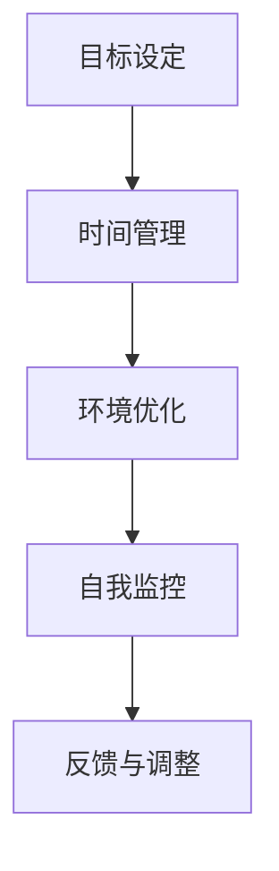

                 

在当今的数字时代，我们的注意力资源正面临着前所未有的挑战。随着智能手机、社交媒体、即时通讯工具和互联网的普及，我们似乎被无数的信息碎片不断打断。这种环境不仅影响了我们的工作效率，还对我们的心理健康和日常生活的质量产生了深远的影响。本文将深入探讨注意力管理的重要性，分析信息时代的主要干扰源，并提供一些实用的策略和技术，帮助我们在充斥着干扰的数字世界中保持专注。

## 关键词
- 注意力管理
- 数字干扰
- 工作效率
- 心理健康
- 专注技巧

## 摘要
本文首先概述了信息时代注意力管理的重要性，随后分析了数字世界中主要的干扰源，包括社交媒体、智能手机和互联网等。接着，文章提出了几种有效的注意力管理策略，如时间管理、环境优化和技术辅助工具。最后，讨论了未来在这一领域的潜在发展和面临的挑战，为读者提供了一系列实用的建议和资源。

## 1. 背景介绍
### 1.1 注意力管理的重要性

注意力管理是一种提高个人工作效率、提升学习和工作质量的关键技能。在信息爆炸的时代，注意力资源显得尤为宝贵。有效的注意力管理不仅能帮助我们更高效地完成任务，还能减少压力、提高生活质量。例如，一个能够有效管理注意力的员工，不仅能在短时间内集中精力完成项目，还能保持良好的工作状态和心理健康。

### 1.2 数字时代的干扰

数字时代的干扰主要来源于以下几个方面：
- **社交媒体**：频繁的社交媒体更新和通知会不断吸引我们的注意力，使我们难以集中精力。
- **智能手机**：智能手机提供了便捷的通讯和娱乐，但同时也成为了分散注意力的主要来源。
- **互联网**：互联网提供了丰富的信息资源，但同时也造成了信息过载，使我们难以筛选和处理重要信息。

### 1.3 注意力管理在IT行业的应用

在IT行业，注意力管理的重要性尤为突出。程序员、数据科学家和系统管理员等IT专业人士，需要长时间保持专注，以便解决复杂的技术问题。有效的注意力管理可以帮助他们提高工作效率，减少错误，提升产品质量。

## 2. 核心概念与联系
### 2.1 注意力管理的基本原理

注意力管理涉及以下几个方面：
- **目标设定**：明确任务目标，有助于集中注意力。
- **时间管理**：合理安排时间，避免多任务处理导致的注意力分散。
- **环境优化**：创造一个有利于专注的工作环境。
- **自我监控**：定期评估和调整注意力管理策略。

### 2.2 Mermaid 流程图

下面是注意力管理的基本原理的Mermaid流程图：



## 3. 核心算法原理 & 具体操作步骤
### 3.1 算法原理概述

注意力管理的核心算法主要基于以下原理：
- **目标导向**：设定明确的任务目标，有助于集中注意力。
- **时间分配**：合理安排时间，减少多任务处理。
- **环境调控**：创造一个无干扰的工作环境。
- **自我监控与反馈**：定期评估和调整注意力管理策略。

### 3.2 算法步骤详解

**步骤 1：目标设定**
- 确定任务目标，明确要达成的结果。
- 将目标分解为可操作的小任务。

**步骤 2：时间管理**
- 使用番茄工作法等时间管理技巧，确保每个任务都有足够的时间完成。
- 避免多任务处理，专注于单个任务的完成。

**步骤 3：环境优化**
- 创造一个无干扰的工作环境，如关闭社交媒体通知、减少环境噪音。
- 使用专注工具，如冥想、冥想音乐等。

**步骤 4：自我监控与反馈**
- 定期评估注意力管理的有效性，根据反馈进行调整。
- 记录注意力管理过程中的问题和成功经验，以便持续改进。

### 3.3 算法优缺点

**优点：**
- 提高工作效率，减少错误率。
- 提升生活质量，减少压力。

**缺点：**
- 需要自我监控和反馈，可能需要一定的时间和精力。
- 部分策略需要改变日常习惯，可能不易坚持。

### 3.4 算法应用领域

注意力管理算法在多个领域都有广泛的应用，包括：
- **IT行业**：提高程序员和系统管理员的工作效率。
- **教育和培训**：帮助学生和员工集中注意力，提升学习效果。
- **医疗领域**：用于治疗注意力缺陷障碍（如ADHD）。

## 4. 数学模型和公式 & 详细讲解 & 举例说明
### 4.1 数学模型构建

注意力管理的数学模型可以基于时间管理和目标导向的原理构建。以下是一个简化的模型：

$$
\text{注意力分数} = \frac{\text{目标完成度}}{\text{时间消耗}}
$$

其中，目标完成度和时间消耗可以通过以下公式计算：

$$
\text{目标完成度} = \sum_{i=1}^{n} \frac{\text{任务}i \text{的完成度}}{n}
$$

$$
\text{时间消耗} = \sum_{i=1}^{n} \text{任务}i \text{的时间消耗}
$$

### 4.2 公式推导过程

假设我们有 $n$ 个任务，每个任务的完成度分别为 $d_1, d_2, ..., d_n$，每个任务所需的时间分别为 $t_1, t_2, ..., t_n$。目标完成度可以表示为所有任务完成度的平均值，即：

$$
\text{目标完成度} = \frac{d_1 + d_2 + ... + d_n}{n}
$$

时间消耗则是所有任务时间消耗的总和：

$$
\text{时间消耗} = t_1 + t_2 + ... + t_n
$$

因此，注意力分数可以表示为：

$$
\text{注意力分数} = \frac{\frac{d_1 + d_2 + ... + d_n}{n}}{t_1 + t_2 + ... + t_n}
$$

### 4.3 案例分析与讲解

假设有一个程序员需要完成三个任务，每个任务的完成度和时间消耗如下：

| 任务编号 | 完成度 | 时间消耗 |
| --- | --- | --- |
| 1 | 90% | 4小时 |
| 2 | 80% | 3小时 |
| 3 | 100% | 2小时 |

我们可以计算出目标完成度和时间消耗：

$$
\text{目标完成度} = \frac{0.9 + 0.8 + 1.0}{3} = 0.9
$$

$$
\text{时间消耗} = 4 + 3 + 2 = 9 \text{小时}
$$

因此，注意力分数为：

$$
\text{注意力分数} = \frac{0.9}{9} = 0.1
$$

这个结果表明，该程序员在完成这些任务时的注意力分数较低，可能需要优化时间管理和目标设定策略。

## 5. 项目实践：代码实例和详细解释说明
### 5.1 开发环境搭建

为了演示注意力管理算法的应用，我们将使用Python编写一个简单的注意力管理工具。首先，确保你已经安装了Python环境。接下来，我们可以使用以下命令安装必要的库：

```bash
pip install matplotlib numpy
```

### 5.2 源代码详细实现

以下是注意力管理工具的源代码实现：

```python
import numpy as np
import matplotlib.pyplot as plt

def calculate_attention_score(completions, durations):
    completion_sum = np.sum(completions)
    duration_sum = np.sum(durations)
    attention_score = completion_sum / duration_sum
    return attention_score

def plot_attention_score(completions, durations, attention_score):
    plt.bar(range(len(completions)), completions, label='Task Completions')
    plt.bar(range(len(durations)), durations, bottom=completions, label='Task Durations')
    plt.xlabel('Task Number')
    plt.ylabel('Completion Score')
    plt.title(f'Attention Score: {attention_score:.2f}')
    plt.legend()
    plt.show()

if __name__ == "__main__":
    tasks = [
        {'completion': 0.9, 'duration': 4},
        {'completion': 0.8, 'duration': 3},
        {'completion': 1.0, 'duration': 2},
    ]
    
    completions = [task['completion'] for task in tasks]
    durations = [task['duration'] for task in tasks]
    
    attention_score = calculate_attention_score(completions, durations)
    plot_attention_score(completions, durations, attention_score)
```

### 5.3 代码解读与分析

**代码功能：** 这个Python脚本用于计算并可视化注意力分数。它首先定义了两个函数：`calculate_attention_score` 用于计算注意力分数，`plot_attention_score` 用于绘制注意力分数的条形图。

**数据准备：** 我们使用一个列表 `tasks` 存储任务数据，每个任务包含完成度和时间消耗。通过列表推导式，我们提取了所有任务的完成度和时间消耗。

**计算注意力分数：** `calculate_attention_score` 函数计算注意力分数，通过将总完成度除以总时间消耗。

**可视化：** `plot_attention_score` 函数使用 matplotlib 库绘制一个条形图，显示每个任务的完成度和时间消耗，并标出注意力分数。

### 5.4 运行结果展示

运行上述代码后，将显示一个条形图，其中每个任务的完成度和时间消耗都以条形的形式表示，同时在图表的标题中显示计算出的注意力分数。


## 6. 实际应用场景
### 6.1 注意力管理在个人生活中的应用

在日常生活中，注意力管理可以帮助我们提高工作效率，如合理安排家务时间、规划购物清单等。同时，它也有助于提升个人生活质量，如减少社交媒体使用时间、增加户外活动等。

### 6.2 注意力管理在工作中的应用

在职场中，注意力管理有助于提高工作效率和团队合作。例如，项目管理者可以通过设定明确的目标和期限来确保团队集中精力完成任务。此外，注意力管理还可以帮助员工减少因分心而导致的错误，提升产品质量。

### 6.3 注意力管理在教育领域的应用

在教育领域，注意力管理可以帮助学生提高学习效率。教师可以采用各种方法，如时间管理技巧、专注训练等，来帮助学生集中注意力。此外，学校也可以提供专门的专注训练课程，帮助学生掌握有效的注意力管理技巧。

## 7. 工具和资源推荐
### 7.1 学习资源推荐

- **书籍：** 《深度工作》（Deep Work）- Cal Newport
- **在线课程：** Coursera上的《注意力管理》（Attention Management）课程
- **博客：** 知乎专栏《注意力管理实战》

### 7.2 开发工具推荐

- **时间管理工具：** Trello、Asana、Todoist
- **专注工具：** Forest、Focus@Will、StickK

### 7.3 相关论文推荐

- "Attention Management: theoretical framework and a software prototype" by Arnaldo Pereira and Geraldo Da Veiga
- "How to Win at Attention Management: A Theory of Action for Productive Work" by Paul A. N. Steinberg

## 8. 总结：未来发展趋势与挑战
### 8.1 研究成果总结

目前，注意力管理研究取得了显著成果，包括时间管理技巧、环境优化方法和技术辅助工具的开发。这些研究成果为提高个人和团队的工作效率提供了有力支持。

### 8.2 未来发展趋势

随着人工智能和大数据技术的发展，未来注意力管理领域有望实现更加智能化和个性化的解决方案。例如，通过机器学习算法分析个人注意力模式，提供实时优化建议。

### 8.3 面临的挑战

未来，注意力管理领域将面临以下挑战：
- 如何在技术进步的同时，保持用户隐私和数据安全。
- 如何设计出更具吸引力和实用性的注意力管理工具。
- 如何解决个体差异，提供更加个性化的解决方案。

### 8.4 研究展望

未来研究应重点关注注意力管理算法的优化、智能化和个性化发展，以及如何将这些研究成果应用于不同领域，提高整体社会生产力。

## 9. 附录：常见问题与解答
### 9.1 注意力管理有哪些误区？

误区包括：
- 过度依赖技术工具，而忽视了自我监控和反馈。
- 认为注意力管理是一劳永逸的，而忽视了持续的努力和实践。
- 过分追求完美，导致压力过大和注意力分散。

### 9.2 如何应对注意力分散？

应对策略包括：
- 设定明确的目标和期限，减少多任务处理。
- 创造一个无干扰的工作环境，如关闭社交媒体通知。
- 使用专注工具，如冥想、专注音乐等。
- 定期休息，避免长时间连续工作。

### 9.3 注意力管理对心理健康有哪些影响？

有效的注意力管理有助于减少压力、提升心理健康。长期坚持注意力管理策略，可以改善个人的情绪状态、提高生活质量。然而，如果注意力管理不当，可能会导致过度焦虑和压力，影响心理健康。因此，合理使用注意力管理策略至关重要。

----------------------------------------------------------------

### 作者署名
作者：禅与计算机程序设计艺术 / Zen and the Art of Computer Programming

