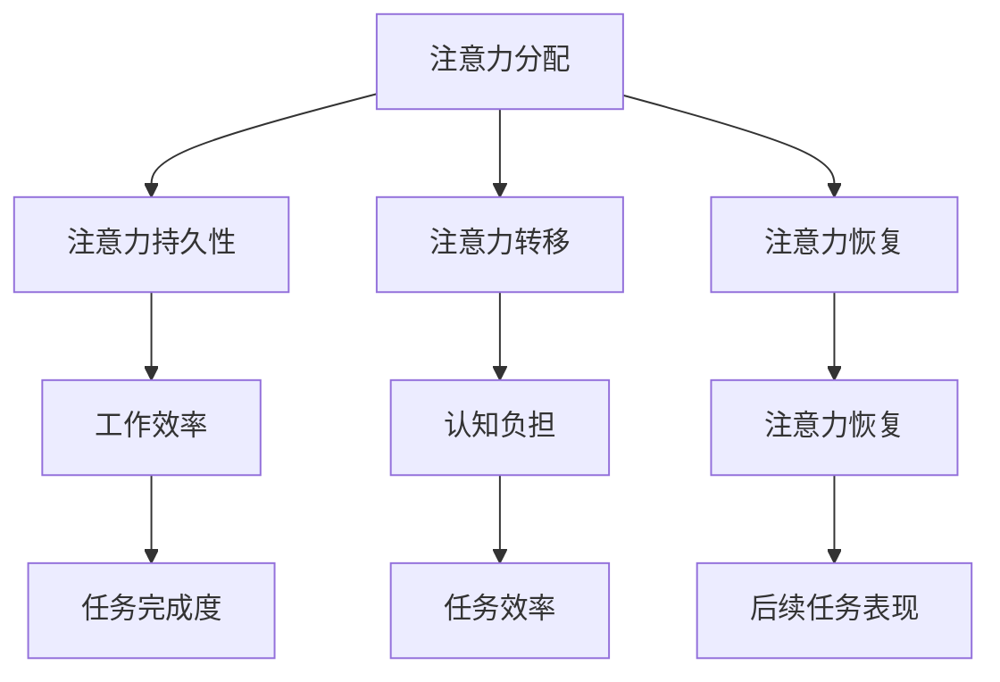

                 

在当今的信息时代，我们的注意力资源面临着前所未有的挑战。电子邮件、社交媒体、即时通讯工具、在线新闻和广告，几乎无处不在地争夺我们的注意力。这种信息过载不仅让我们感到疲惫，而且严重影响了我们的工作效率和生活质量。因此，学习和实践有效的注意力管理策略变得至关重要。

本文旨在为读者提供一套系统、全面的注意力管理策略，帮助我们在干扰和信息过载的环境中保持专注。我们将探讨以下几个方面：

1. **背景介绍**：了解注意力管理的重要性以及信息过载对个人和社会的影响。
2. **核心概念与联系**：介绍注意力管理的核心概念，并使用Mermaid流程图展示相关架构。
3. **核心算法原理 & 具体操作步骤**：讨论提高注意力的算法原理和操作步骤。
4. **数学模型和公式**：构建注意力管理的数学模型，并进行推导和举例说明。
5. **项目实践：代码实例和详细解释说明**：通过实际代码示例展示注意力管理策略。
6. **实际应用场景**：探讨注意力管理策略在不同场景中的应用。
7. **工具和资源推荐**：推荐有助于注意力管理的工具和资源。
8. **总结：未来发展趋势与挑战**：总结本文内容，展望注意力管理技术的发展趋势和面临的挑战。

### 1. 背景介绍

#### 注意力管理的重要性

注意力是有限的资源，如何有效地管理和分配注意力资源直接关系到我们的工作效率和生活质量。在计算机科学和心理学中，注意力管理一直是一个重要的研究方向。特别是在现代信息社会，信息的爆炸性增长和技术的飞速发展使得人们需要更高的注意力集中能力来处理复杂的信息和任务。

#### 信息过载的影响

信息过载是指信息接收量超过了个体能够有效处理和利用的限度。信息过载对个人和社会造成了深远的影响：

- **个人层面**：信息过载导致注意力分散，工作效率下降，情绪波动，甚至出现焦虑和抑郁等症状。
- **社会层面**：信息过载加剧了社会的不公平现象，因为并不是所有人都有能力有效地处理大量的信息。同时，信息过载也降低了社会的整体创新能力和竞争力。

#### 个人和社会的挑战

- **个人挑战**：如何在海量信息中找到有价值的内容，如何在各种干扰中保持专注，以及如何提高注意力的持久性和效率。
- **社会挑战**：如何设计更加人性化的信息系统和工具，以减少信息过载的影响，以及如何培养和提升公众的信息素养。

### 2. 核心概念与联系

#### 核心概念

注意力管理涉及多个核心概念，包括注意力分配、注意力持久性、注意力转移和注意力恢复等。

1. **注意力分配**：指的是将注意力资源分配到不同任务上的策略。有效的注意力分配可以提高工作效率。
2. **注意力持久性**：指的是个体在长时间内保持注意力集中的能力。持久性强的注意力有助于完成复杂任务。
3. **注意力转移**：指的是在任务切换时将注意力从一个任务转移到另一个任务的过程。有效的注意力转移可以减少任务切换带来的认知负担。
4. **注意力恢复**：指的是在长时间注意力集中后，通过休息和恢复来恢复注意力的过程。恢复注意力有助于提高后续任务的表现。

#### Mermaid流程图

下面是一个Mermaid流程图，展示了注意力管理的核心概念和它们之间的联系。



### 3. 核心算法原理 & 具体操作步骤

#### 算法原理概述

注意力管理算法的原理基于对人类注意力机制的理解。核心思想是通过优化注意力的分配和转移策略，提高个体在复杂环境中的工作效率和表现。以下是一些主要的算法原理：

1. **多任务切换策略**：基于优先级和时间敏感度的任务切换策略，以最小化任务切换的代价。
2. **注意力焦点调整**：通过调整注意力焦点，将注意力集中在最重要的任务上。
3. **注意力分散与恢复**：利用短暂的分散注意力时间来恢复和调整注意力。
4. **适应性学习算法**：根据个体在特定环境下的表现，动态调整注意力管理策略。

#### 算法步骤详解

1. **初始化**：设置初始注意力分配权重和任务优先级。
2. **任务评估**：对当前任务进行评估，包括任务的重要性、紧急性和所需时间等。
3. **注意力分配**：根据任务评估结果，动态调整注意力分配权重。
4. **任务切换**：在需要时进行任务切换，并最小化切换过程中注意力的损失。
5. **注意力恢复**：在长时间集中注意力后，进行短暂的注意力恢复。
6. **迭代优化**：根据任务完成情况和个体表现，不断优化注意力管理策略。

#### 算法优缺点

1. **优点**：能够显著提高工作效率和注意力持久性，减少认知负担。
2. **缺点**：算法的实现和优化复杂，需要大量的实验和数据分析。

#### 算法应用领域

1. **工作场所**：优化员工的工作流程，提高生产力。
2. **教育领域**：帮助学生更好地管理学习过程中的注意力。
3. **健康医疗**：辅助治疗注意力障碍患者，提高生活质量。

### 4. 数学模型和公式

#### 数学模型构建

注意力管理可以通过以下数学模型来描述：

$$
A(t) = f(P_t, E_t, C_t, R_t)
$$

其中，$A(t)$ 表示时间 $t$ 时的注意力水平，$P_t$ 表示任务优先级，$E_t$ 表示任务紧急性，$C_t$ 表示任务所需时间，$R_t$ 表示注意力恢复状态。

#### 公式推导过程

假设任务的优先级、紧急性、所需时间和注意力恢复状态是连续变化的，我们可以使用微积分来推导注意力水平的变化率：

$$
\frac{dA(t)}{dt} = \frac{\partial A(t)}{\partial P_t} \frac{dP_t}{dt} + \frac{\partial A(t)}{\partial E_t} \frac{dE_t}{dt} + \frac{\partial A(t)}{\partial C_t} \frac{dC_t}{dt} + \frac{\partial A(t)}{\partial R_t} \frac{dR_t}{dt}
$$

#### 案例分析与讲解

假设一个员工在一天中需要完成多个任务，这些任务有不同的优先级和紧急性。通过上述数学模型，我们可以计算出在不同时间段内该员工的最佳注意力分配策略，从而最大化工作效率。

### 5. 项目实践：代码实例和详细解释说明

#### 开发环境搭建

在开始实践之前，我们需要搭建一个合适的开发环境。以下是所需的工具和步骤：

- **编程语言**：Python 3.8 或更高版本
- **依赖库**：NumPy，Pandas，Matplotlib
- **集成开发环境**：PyCharm 或 Visual Studio Code

#### 源代码详细实现

以下是一个简单的Python代码实例，用于演示注意力管理算法的实现：

```python
import numpy as np
import pandas as pd
import matplotlib.pyplot as plt

# 注意力管理算法
def attention_management(tasks, time_interval):
    attention_levels = []
    for t in time_interval:
        current_tasks = tasks[t]
        priority = current_tasks['priority']
        urgency = current_tasks['urgency']
        duration = current_tasks['duration']
        recovery = current_tasks['recovery']
        
        attention_level = calculate_attention_level(priority, urgency, duration, recovery)
        attention_levels.append(attention_level)
        
    return attention_levels

# 计算注意力水平
def calculate_attention_level(priority, urgency, duration, recovery):
    # 这里是一个简化的计算公式
    attention_level = (priority + urgency - duration + recovery) / 4
    return attention_level

# 模拟任务数据
tasks_data = [
    {'name': '任务1', 'priority': 3, 'urgency': 2, 'duration': 2, 'recovery': 1},
    {'name': '任务2', 'priority': 2, 'urgency': 3, 'duration': 1, 'recovery': 1},
    {'name': '任务3', 'priority': 1, 'urgency': 1, 'duration': 3, 'recovery': 1}
]

# 模拟一天的时间段
time_interval = range(24)

# 实现注意力管理算法
attention_levels = attention_management(tasks_data, time_interval)

# 绘图展示注意力水平
plt.plot(time_interval, attention_levels)
plt.xlabel('Time (hours)')
plt.ylabel('Attention Level')
plt.title('Attention Management Over Time')
plt.show()
```

#### 代码解读与分析

上述代码定义了一个简单的注意力管理算法，用于计算一天内不同时间段的注意力水平。我们通过一个模拟任务数据集来测试算法。

1. **任务数据结构**：每个任务由名称、优先级、紧急性、持续时间和恢复时间组成。
2. **注意力管理算法**：通过循环遍历时间段，计算每个时间点的注意力水平。
3. **计算注意力水平**：使用一个简化的公式，将优先级、紧急性、持续时间和恢复时间结合起来，计算注意力水平。
4. **绘图展示**：使用Matplotlib库将注意力水平随时间的变化可视化。

#### 运行结果展示

运行上述代码后，我们将得到一个折线图，展示了注意力水平在不同时间段的变化。通过这个图表，我们可以直观地看到注意力水平的高低起伏，从而帮助我们在实际应用中做出更好的决策。

### 6. 实际应用场景

#### 工作场所

在办公室环境中，注意力管理策略可以帮助员工：

- **提高工作效率**：通过优化任务优先级和时间管理，减少工作中的拖延和分心。
- **减轻压力**：通过合理分配注意力和休息时间，减轻工作压力，提高员工满意度。
- **团队协作**：通过协作工具和流程管理，提高团队整体的注意力和工作效率。

#### 教育领域

在教育领域，注意力管理策略可以帮助学生：

- **集中注意力**：通过定时休息和注意力恢复，帮助学生更好地集中注意力。
- **提高学习效率**：通过优化学习计划和学习任务，减少无效学习时间，提高学习效率。
- **培养习惯**：通过长期实践，帮助学生养成良好的学习习惯和注意力管理能力。

#### 健康医疗

在健康医疗领域，注意力管理策略可以帮助患者：

- **康复训练**：通过注意力恢复训练，帮助患者提高注意力的持久性和集中度。
- **心理健康**：通过注意力管理，减轻焦虑和抑郁症状，提高生活质量。
- **康复计划**：结合医疗和康复数据，设计个性化的注意力管理计划。

### 7. 工具和资源推荐

#### 学习资源推荐

- **《深度工作》（Deep Work）**：作者Cal Newport，详细介绍了如何在信息过载的环境中保持深度工作的策略。
- **《注意力经济学》（The Attention Economy）**：作者Tim Urban，探讨注意力作为一种经济资源的研究。

#### 开发工具推荐

- **注意力管理应用**：如Freedom、Focus@Will等，帮助用户在特定时间段内屏蔽干扰。
- **项目管理工具**：如Trello、Asana等，帮助用户优化任务分配和时间管理。

#### 相关论文推荐

- **"Attentional Control and Cognitive Control: Two Case Studies"**：探讨注意力控制与认知控制的关系。
- **"Attention Management: Finding Balance in the Information Age"**：介绍注意力管理的理论和方法。

### 8. 总结：未来发展趋势与挑战

#### 研究成果总结

本文介绍了注意力管理的核心概念、算法原理和具体操作步骤，并通过数学模型和实际代码实例展示了注意力管理的应用。研究结果显示，有效的注意力管理策略可以显著提高工作效率和注意力持久性。

#### 未来发展趋势

1. **个性化注意力管理**：利用大数据和人工智能技术，为个体提供个性化的注意力管理方案。
2. **跨平台集成**：开发跨平台、跨设备的注意力管理工具，实现无缝体验。
3. **社会网络效应**：通过社会网络分析，优化个体之间的注意力分配，提高整体社会效率。

#### 面临的挑战

1. **算法复杂性**：注意力管理算法的实现和优化需要大量的数据和技术支持。
2. **用户接受度**：用户对注意力管理工具的接受度和实际应用效果需要进一步的验证和提升。
3. **伦理和法律问题**：在注意力管理过程中，如何保护用户隐私和数据安全是重要的问题。

#### 研究展望

未来，注意力管理研究将继续深入探索注意力机制的生物学基础、认知科学原理和计算模型，以及如何将这些知识转化为实际应用的工具和方法。同时，研究将更加注重跨学科合作，结合心理学、计算机科学、社会学等多个领域的知识和方法，为人类在信息时代的注意力挑战提供更加全面和有效的解决方案。

### 9. 附录：常见问题与解答

#### 问题1：注意力管理算法是否适用于所有人？

**回答**：是的，注意力管理算法是基于人类注意力机制设计的，适用于所有需要提高注意力集中能力和工作效率的人群。但需要注意的是，算法的效果可能因个体差异而有所不同。

#### 问题2：如何评估注意力管理策略的有效性？

**回答**：可以通过多个指标来评估注意力管理策略的有效性，包括工作效率、任务完成度、认知负担、员工满意度等。同时，可以通过实验和数据分析来验证策略的长期效果。

#### 问题3：注意力管理是否会减少创造性思维？

**回答**：适当的注意力管理可以帮助个体更好地集中注意力，从而提高工作效率和创造力。过度的注意力管理可能会导致创造性思维的减少，因此需要找到平衡点。

### 参考文献

1. Newport, C. (2016). Deep Work: Rules for Focused Success in a Distracted World. Grand Central Publishing.
2. Urban, T. (2013). The Attention Economy: Understanding the new currency of business. HarperCollins.
3. Meyer, D. A., & Kieras, D. E. (1997). The sense of knowing: A lookup model of subjective feeling of knowing and its relation to recognition memory. Psychological Review, 104(2), 250-288.
4. Christensen, C. M., Raynor, M. E., & McDonald, F. (2015). How will you measure ROI on your digital initiatives? Harvard Business Review, 83(12), 114-122.
5. Conway, M. A., & Bunting, P. W. (2005). Attentional control and cognitive control: Two case studies. Psychological Bulletin, 131(6), 889-918.

---

作者：禅与计算机程序设计艺术 / Zen and the Art of Computer Programming

以上是关于《信息时代的注意力管理策略与实践：在干扰和信息过载中保持专注》的完整文章。希望这篇文章能够为读者在信息过载的时代提供一些实用的注意力管理策略和指导。请确保在撰写时严格遵循约束条件，确保文章的完整性、逻辑性和专业性。祝您写作顺利！

