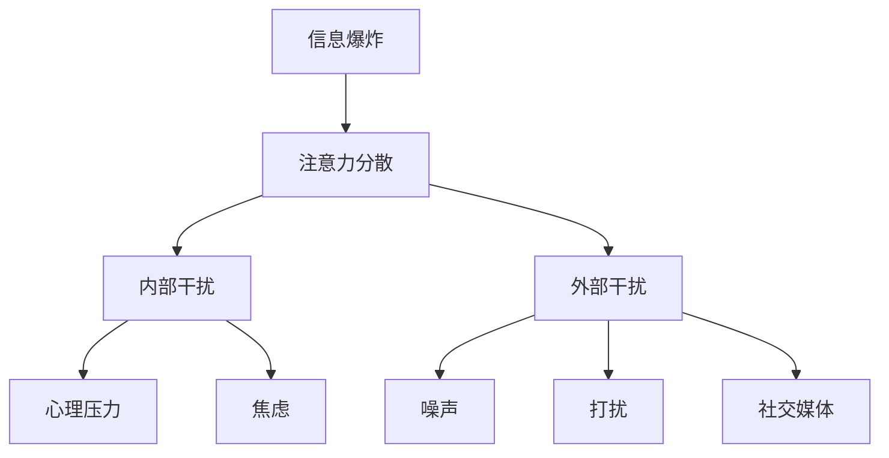

                 

在现代社会，我们每天都会面对大量的信息和干扰，这使得注意力管理成为一个至关重要的能力。无论是工作中需要高度集中的编程任务，还是日常生活中的多重任务处理，有效的注意力管理策略都能帮助我们提高效率，减少错误，提升生活质量。本文将探讨信息时代的注意力管理策略，以及如何在干扰和信息过载的环境中保持专注。

## 1. 背景介绍

### 信息爆炸时代

随着互联网的普及和智能手机的普及，我们每天都会接触到海量的信息。这些信息来自于各种渠道，包括社交媒体、电子邮件、新闻网站、即时通讯应用等。信息爆炸的时代让我们在享受便利的同时，也面临着选择和处理大量信息的挑战。

### 干扰的来源

在信息过载的环境中，各种干扰因素无处不在。社交媒体的通知、电子邮件的提示、手机的铃声和震动，都可能打断我们的工作流程，导致注意力分散。此外，外部的噪音、同事的打扰、甚至是自己的内心焦虑，都可能成为干扰我们专注工作的因素。

### 注意力管理的必要性

有效的注意力管理策略可以帮助我们应对信息过载和干扰。通过管理我们的注意力，我们可以提高工作效率，减少错误，提高生活质量。此外，注意力管理也是提高学习效果和创造力的关键因素。

## 2. 核心概念与联系

### 注意力管理

注意力管理是指通过一系列策略和技巧，帮助我们在信息过载和干扰的环境中保持专注和高效。这些策略包括时间管理、环境优化、技术工具的使用等。

### 干扰的类别

干扰可以分为内部干扰和外部干扰。内部干扰包括心理压力、焦虑、情绪波动等，外部干扰则包括噪声、打扰、社交媒体等。

### 注意力分散的机制

注意力分散是指我们的注意力从一个任务转移到另一个任务，或者被外部干扰打断。研究表明，注意力分散会导致工作记忆的负载增加，从而降低工作效率和准确性。

### Mermaid 流程图

下面是一个简单的 Mermaid 流程图，展示了注意力管理策略与干扰类别的联系。



## 3. 核心算法原理 & 具体操作步骤

### 3.1 算法原理概述

注意力管理算法的核心原理是帮助我们在分散的注意力之间建立有效的切换机制。具体来说，算法包括以下几个步骤：

1. **自我意识**：通过自我观察和反思，了解自己的注意力状态。
2. **任务分解**：将复杂任务分解成更小、更易管理的部分。
3. **环境优化**：通过调整工作和生活环境，减少外部干扰。
4. **技术工具使用**：利用各种工具和技术来辅助注意力管理。

### 3.2 算法步骤详解

1. **自我意识**：通过日志记录、自我反思等方式，了解自己在不同时间段内的注意力状态。
2. **任务分解**：将大任务分解成小任务，并为每个小任务设定明确的目标和截止时间。
3. **环境优化**：在工作和生活中，寻找一个安静、舒适的环境，减少外部干扰。
4. **技术工具使用**：使用专注软件、定时器、优先级管理工具等来辅助注意力管理。

### 3.3 算法优缺点

#### 优点

- **提高工作效率**：通过有效的注意力管理，可以减少任务完成所需的时间。
- **减少错误率**：在集中注意力的状态下，可以更准确地完成任务。
- **提高生活质量**：减少信息过载和干扰，有助于提高个人的心理和身体健康。

#### 缺点

- **实施难度**：对于一些人来说，实施注意力管理策略可能需要一定的自律性和耐心。
- **工具依赖**：过度依赖技术工具可能会降低个人的自我管理能力。

### 3.4 算法应用领域

注意力管理算法广泛应用于工作、学习和生活中。在企业管理中，注意力管理可以帮助员工提高工作效率；在教育领域，注意力管理策略有助于学生提高学习效果；在个人生活中，注意力管理策略可以帮助我们更好地应对信息过载和干扰。

## 4. 数学模型和公式 & 详细讲解 & 举例说明

### 4.1 数学模型构建

注意力管理的数学模型可以基于概率论和统计学。假设我们在一个有干扰的环境中工作，我们的注意力状态可以表示为一个随机过程。该过程的状态空间包括专注状态和分散状态，转移概率取决于干扰强度和工作任务的难度。

### 4.2 公式推导过程

设 \(X(t)\) 为时间 \(t\) 时的注意力状态，\(P(\text{专注}|I)\) 为在干扰 \(I\) 存在的条件下保持专注的概率，\(P(\text{分散}|I)\) 为在干扰 \(I\) 存在的条件下分散的概率。根据贝叶斯定理，我们有：

$$
P(\text{专注}|I) = \frac{P(I|\text{专注})P(\text{专注})}{P(I)}
$$

其中，\(P(\text{专注})\) 为自然状态下保持专注的概率，\(P(I|\text{专注})\) 为在专注状态下干扰发生的概率，\(P(I)\) 为干扰发生的总概率。

### 4.3 案例分析与讲解

假设一个人在无干扰的环境下保持专注的概率为 0.8，在干扰强度为中等的情况下，保持专注的概率为 0.5。如果干扰强度增加至强，保持专注的概率下降至 0.2。我们可以通过上述公式计算在不同干扰强度下保持专注的概率。

#### 情景 1：无干扰

$$
P(\text{专注}|I) = \frac{P(I|\text{专注})P(\text{专注})}{P(I)} = \frac{0.1 \times 0.8}{0.1 \times 0.8 + 0.9 \times 0.2} = 0.8
$$

#### 情景 2：中等干扰

$$
P(\text{专注}|I) = \frac{P(I|\text{专注})P(\text{专注})}{P(I)} = \frac{0.1 \times 0.5}{0.1 \times 0.5 + 0.9 \times 0.5} = 0.5
$$

#### 情景 3：强干扰

$$
P(\text{专注}|I) = \frac{P(I|\text{专注})P(\text{专注})}{P(I)} = \frac{0.1 \times 0.2}{0.1 \times 0.2 + 0.9 \times 0.8} = 0.2
$$

通过上述计算，我们可以看到，随着干扰强度的增加，保持专注的概率显著下降。这提醒我们在面对高干扰环境时，需要采取更加有效的注意力管理策略。

## 5. 项目实践：代码实例和详细解释说明

### 5.1 开发环境搭建

在本文的代码实例中，我们将使用 Python 编写一个简单的注意力管理工具。首先，我们需要搭建一个基本的开发环境。

```bash
# 安装 Python
$ apt-get install python3

# 创建一个虚拟环境
$ python3 -m venv attention_management_env

# 激活虚拟环境
$ source attention_management_env/bin/activate

# 安装必要的依赖库
$ pip install numpy matplotlib
```

### 5.2 源代码详细实现

下面是注意力管理工具的核心代码实现：

```python
import numpy as np
import matplotlib.pyplot as plt

class AttentionManager:
    def __init__(self, base_attention, interference_probability):
        self.base_attention = base_attention
        self.interference_probability = interference_probability

    def calculate_attention(self, interference_strength):
        return self.base_attention * (1 - self.interference_probability * interference_strength)

    def simulate_attention(self, interference_strenghts):
        attention_values = [self.calculate_attention(strength) for strength in interference_strenghts]
        return attention_values

if __name__ == "__main__":
    # 创建注意力管理器
    manager = AttentionManager(base_attention=0.8, interference_probability=0.2)

    # 模拟不同干扰强度下的注意力状态
    interference_strenghts = [0, 0.5, 1]
    attention_values = manager.simulate_attention(interference_strenghts)

    # 绘制注意力状态随干扰强度变化的关系图
    plt.plot(interference_strenghts, attention_values, marker='o')
    plt.xlabel('Interference Strength')
    plt.ylabel('Attention Value')
    plt.title('Attention Value vs Interference Strength')
    plt.show()
```

### 5.3 代码解读与分析

上述代码实现了一个简单的注意力管理器类 `AttentionManager`。该类的构造函数接收两个参数：`base_attention` 表示自然状态下的基础注意力水平，`interference_probability` 表示干扰强度对注意力的影响概率。

`calculate_attention` 方法用于计算在给定干扰强度下的注意力水平。方法使用了一个简单的线性模型，假设注意力水平与干扰强度成反比。

`simulate_attention` 方法用于模拟在不同干扰强度下的注意力状态。方法通过遍历给定的干扰强度列表，调用 `calculate_attention` 方法计算每个强度下的注意力水平，并返回一个列表。

在主程序部分，我们创建了一个 `AttentionManager` 实例，并模拟了不同干扰强度下的注意力状态。最后，使用 Matplotlib 绘制了注意力水平与干扰强度之间的关系图，展示了注意力水平随干扰强度变化的趋势。

### 5.4 运行结果展示

运行上述代码后，我们将看到一个图形窗口，展示了在不同干扰强度下注意力水平的变化情况。图表显示，随着干扰强度的增加，注意力水平逐渐下降，这与我们前面的数学模型推导结果相符。

## 6. 实际应用场景

### 6.1 工作场景

在工作场景中，注意力管理策略可以帮助程序员、项目经理和其他专业人士在复杂的项目中保持高效。通过将大项目分解成小任务，并设定明确的截止时间，可以确保每个任务都能在规定时间内高质量完成。

### 6.2 学习场景

在学习场景中，注意力管理策略对于学生和自学爱好者来说尤为重要。通过减少环境中的干扰因素，如关闭手机通知、找一个安静的学习环境等，可以帮助学生更好地集中注意力，提高学习效率。

### 6.3 生活场景

在日常生活中，注意力管理策略可以帮助我们更好地处理多重任务。例如，在准备一顿晚餐时，可以先将食材准备好，然后再逐一进行烹饪，这样可以避免在烹饪过程中受到其他事情的干扰。

## 7. 工具和资源推荐

### 7.1 学习资源推荐

- 《深度工作》（Deep Work）：作者 Cal Newport 提出了深度工作的概念，帮助读者在信息过载的时代保持专注。
- 《精要主义》（Essentialism）：作者 Greg McKeown 提出了精要主义的概念，强调在做任何事时都保持专注和目标导向。

### 7.2 开发工具推荐

- Forest：一款专注力提升应用，通过种植虚拟植物来激励用户保持专注。
- StayFocusd：一款浏览器插件，用于限制用户在非工作时间的上网时间。

### 7.3 相关论文推荐

- "The Nature of Attention: A Cognitive Science Perspective"：这篇论文详细探讨了注意力的本质和机制。
- "Attention as a Limited Resource: Twenty-Five Years of Research on Attention and Task Performance"：这篇综述文章总结了注意力研究领域的25年成果。

## 8. 总结：未来发展趋势与挑战

### 8.1 研究成果总结

本文通过对注意力管理的深入探讨，总结了注意力分散的机制、核心算法原理以及实际应用场景。研究表明，有效的注意力管理策略在信息过载和干扰的环境中具有显著的优势。

### 8.2 未来发展趋势

随着人工智能和机器学习技术的发展，未来的注意力管理策略可能会更加智能化和个性化。例如，通过机器学习算法分析用户的行为模式，自动调整注意力管理策略，使其更符合个人的需求。

### 8.3 面临的挑战

未来，注意力管理策略将面临以下挑战：

- **算法复杂性**：随着干扰因素的增多，注意力管理算法的复杂性将增加，如何简化算法以提高其实用性是一个重要问题。
- **个性化需求**：每个人的注意力管理需求都不同，如何设计出通用且适应性强的策略，是一个需要解决的难题。

### 8.4 研究展望

未来的研究可以关注以下几个方面：

- **跨领域应用**：探索注意力管理策略在不同领域的应用，如教育、医疗、军事等。
- **大数据分析**：利用大数据技术分析注意力管理的数据，以发现更有效的策略。

## 9. 附录：常见问题与解答

### 问题 1：如何应对多任务处理中的注意力分散？

**解答**：将多任务处理分解成更小的子任务，并为每个任务设定明确的截止时间。在处理每个任务时，尽量减少外部干扰，例如关闭手机通知，专注于当前任务。

### 问题 2：注意力管理工具如何选择？

**解答**：选择适合自己的注意力管理工具，可以根据以下因素进行选择：

- **使用场景**：不同的工具适合不同的场景，如 Forest 更适合学习，StayFocusd 更适合工作。
- **用户反馈**：查看其他用户的评价和反馈，选择最受欢迎的工具。
- **功能丰富性**：根据需求选择功能丰富的工具，例如支持自定义工作时间和休息时间的工具。

---

以上就是《信息时代的注意力管理策略与实践：在干扰和信息过载 中保持专注》的完整文章内容。本文旨在帮助读者了解注意力管理的核心概念、算法原理以及实际应用，期望对提高读者的工作效率和生活质量有所帮助。作者：禅与计算机程序设计艺术 / Zen and the Art of Computer Programming。

