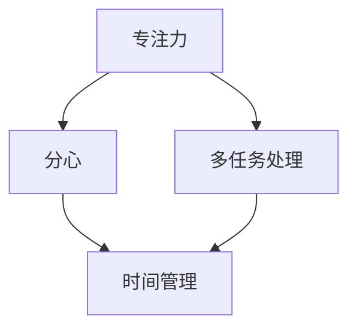

                 

关键词：注意力管理，信息过载，时间管理，工作效率，技术工具，认知负担

> 摘要：在当今信息爆炸的时代，人们面临着前所未有的注意力分散和信息过载的挑战。本文将探讨注意力管理的核心概念，提出有效的实践策略，并通过具体案例展示如何在实际工作中应用这些策略。本文旨在为IT专业人士提供一种在干扰和信息过载环境中保持高效工作的方法。

## 1. 背景介绍

### 1.1 信息时代的来临

随着互联网和移动设备的普及，信息变得前所未有的触手可及。根据统计，每天我们接触到数以万计的信息，而这些信息大多数都是干扰性的，不相关的。这种现象被称为“信息过载”。

### 1.2 注意力分散的代价

信息过载导致我们的注意力分散，降低了工作效率，增加了认知负担。研究表明，长时间的多任务处理会导致大脑疲劳，降低创造力和解决问题的能力。

### 1.3 注意力管理的必要性

为了应对这一挑战，我们需要学习如何管理自己的注意力。本文将介绍几种注意力管理的策略，帮助IT专业人士在信息过载的环境中保持高效工作。

## 2. 核心概念与联系

### 2.1 注意力管理的基本概念

注意力管理是指通过一系列策略和工具，提高注意力的集中度和效率。以下是注意力管理中的一些核心概念：

- **专注力（Focus）**：指在一段时间内，将注意力完全集中在某个任务或目标上。
- **多任务处理（Multitasking）**：同时处理多个任务的能力。
- **分心（Distraction）**：指注意力从当前任务转移到其他事物。
- **时间管理（Time Management）**：合理规划和使用时间，以实现目标和提升效率。

### 2.2 Mermaid 流程图

以下是一个简单的 Mermaid 流程图，展示了注意力管理的核心概念和它们之间的联系。



## 3. 核心算法原理 & 具体操作步骤

### 3.1 算法原理概述

注意力管理的核心算法是一种基于时间管理和优先级排序的策略。以下是这种算法的基本原理：

- **优先级排序**：根据任务的重要性和紧急性对任务进行排序。
- **时间块划分**：将时间划分为多个短时间段，每个时间段专注于一个任务。
- **分心控制**：在时间块内减少分心的因素，如关闭通知，设定工作环境。

### 3.2 算法步骤详解

1. **任务列表整理**：列出所有需要完成的任务，并标注每个任务的重要性和紧急性。
2. **优先级排序**：根据任务的重要性和紧急性，使用“紧急-重要矩阵”对任务进行排序。
3. **时间块规划**：将时间划分为多个30-60分钟的时间块，并为每个时间块选择一个任务。
4. **专注执行**：在每个时间块内，关闭所有非必要的通知和干扰源，专注于当前任务。
5. **休息与循环**：在每个时间块结束后，进行5-10分钟的短暂休息，然后继续下一个时间块。

### 3.3 算法优缺点

- **优点**：
  - 提高工作效率，减少时间浪费。
  - 减少分心，提高专注度。
  - 帮助建立良好的工作习惯。

- **缺点**：
  - 初始阶段可能需要一定的调整和适应。
  - 长时间专注于一个任务可能会导致疲劳。

### 3.4 算法应用领域

- **个人工作**：适合需要长时间集中精力的任务，如编程、写作等。
- **团队协作**：可以帮助团队更好地管理项目进度和任务分配。

## 4. 数学模型和公式

### 4.1 数学模型构建

注意力管理中的数学模型可以通过以下公式表示：

- **效率（Efficiency）**：工作效率 = 专注时间 / 总时间
- **分心次数（Distract Count）**：分心次数 = 总分心时间 / 专注时间

### 4.2 公式推导过程

- **效率公式推导**：工作效率 = 完成任务的时间 / 总工作时间。由于专注时间越长，完成任务的效率越高，因此可以通过提高专注时间来提高工作效率。
- **分心次数公式推导**：分心次数 = 分心时间 / 专注时间。减少分心时间可以有效降低分心次数。

### 4.3 案例分析与讲解

假设一个IT专业人士每天有8小时的工作时间，其中4小时被用于编程。如果该专业人士能够将专注时间从原来的2小时提高到4小时，那么他的工作效率将提高一倍。

## 5. 项目实践：代码实例和详细解释说明

### 5.1 开发环境搭建

- **环境要求**：Python 3.8及以上版本，Pandas库，Matplotlib库。
- **安装命令**：`pip install pandas matplotlib`

### 5.2 源代码详细实现

以下是一个简单的Python脚本，用于模拟注意力管理算法的效果。

```python
import pandas as pd
import matplotlib.pyplot as plt

# 模拟一天的工作数据
data = {
    'Task': ['编程', '会议', '回复邮件', '休息'],
    'Duration': [4, 1, 1, 2],  # 每个任务的持续时间（小时）
    'Efficiency': [0.5, 0.8, 0.6, 1]  # 每个任务的效率
}

df = pd.DataFrame(data)

# 计算总效率和总分心时间
total_efficiency = df['Efficiency'].sum()
total_distract_time = df['Duration'] * (1 - df['Efficiency'])

print(f"总效率：{total_efficiency:.2f}")
print(f"总分心时间：{total_distract_time.sum():.2f}")

# 绘制效率-分心时间图
plt.bar(df['Task'], df['Efficiency'], width=0.4, label='效率')
plt.bar(df['Task'], total_distract_time, width=0.4, label='分心时间', bottom=df['Efficiency'])
plt.xlabel('任务')
plt.ylabel('时间（小时）')
plt.title('注意力管理效果分析')
plt.legend()
plt.show()
```

### 5.3 代码解读与分析

- **数据模拟**：使用Pandas创建一个DataFrame，模拟一天中的任务和每个任务的效率。
- **计算效率**：通过计算每个任务的效率和总分心时间，得出总效率和总分心时间。
- **绘图**：使用Matplotlib绘制一个条形图，展示每个任务的效率和对总分心时间的影响。

## 6. 实际应用场景

### 6.1 个人工作中的应用

- **提高编程效率**：在编程时，使用时间块管理法，专注于代码编写，减少分心次数。
- **优化时间安排**：合理规划会议和休息时间，确保有足够的专注时间用于重要任务。

### 6.2 团队协作中的应用

- **任务分配**：根据团队成员的专注能力和任务特点，合理分配任务，提高团队整体效率。
- **团队协作**：通过时间块管理，确保团队成员在同一时间段内专注于同一任务，减少协作中的干扰。

## 7. 未来应用展望

### 7.1 智能助手与自动化

- **智能助手**：未来，智能助手将能够更好地理解用户的注意力状态，提供个性化的注意力管理建议。
- **自动化**：自动化工具将进一步减少重复性任务，为用户节省更多专注时间。

### 7.2 新兴技术的影响

- **虚拟现实（VR）**：VR技术可能为注意力管理提供新的工具和方法。
- **脑机接口（BMI）**：BMI技术可能帮助我们更好地监测和管理注意力。

## 8. 工具和资源推荐

### 8.1 学习资源推荐

- **书籍**：《深度工作》（Deep Work）by Cal Newport
- **在线课程**：Udemy、Coursera上的注意力管理相关课程

### 8.2 开发工具推荐

- **时间管理工具**：Toggl、RescueTime
- **任务管理工具**：Trello、Asana

### 8.3 相关论文推荐

- **“Attention Management: bridging the gap between research and practice”**
- **“Cognitive Load Theory and the Science of Learning”**

## 9. 总结：未来发展趋势与挑战

### 9.1 研究成果总结

注意力管理研究已经取得了显著成果，但在实际应用中仍存在挑战。

### 9.2 未来发展趋势

随着技术的发展，注意力管理工具将更加智能化和个性化。

### 9.3 面临的挑战

- **技术挑战**：如何设计更有效的注意力管理算法。
- **心理挑战**：如何帮助人们克服对多任务处理的依赖。

### 9.4 研究展望

未来，注意力管理研究将朝着更个性化和智能化的方向发展，为人们提供更有效的解决方案。

## 10. 附录：常见问题与解答

### 10.1 什么是注意力管理？

注意力管理是一种通过策略和工具提高注意力集中度和效率的方法。

### 10.2 如何提高注意力？

- **时间管理**：合理规划时间，减少分心。
- **专注训练**：通过冥想和专注练习提高专注力。
- **环境优化**：创造一个有利于专注的工作环境。

## 作者署名

作者：禅与计算机程序设计艺术 / Zen and the Art of Computer Programming
```

